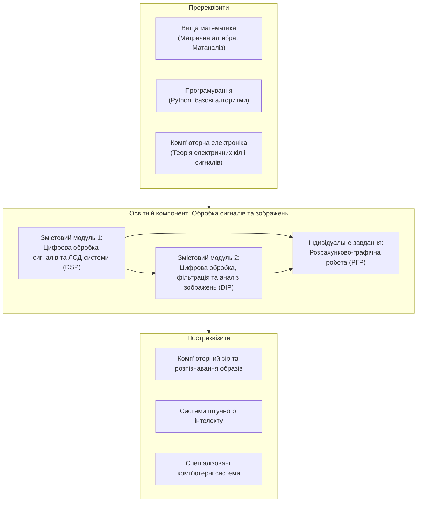
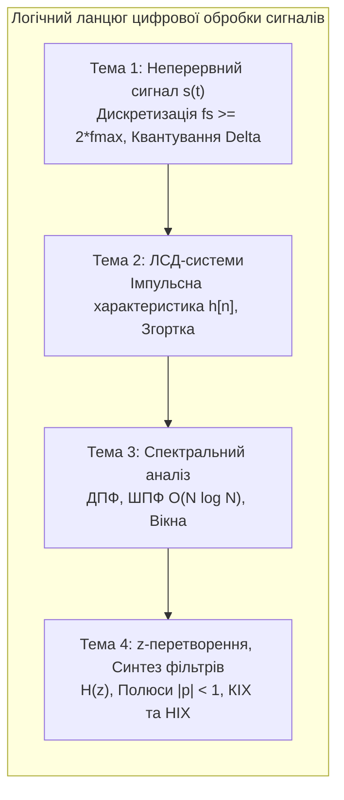
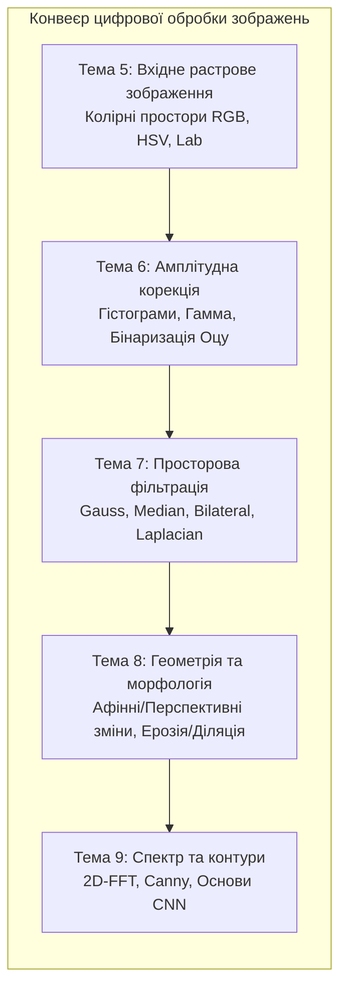

# РОБОЧА ПРОГРАМА ОСВІТНЬОГО КОМПОНЕНТА «Обробка сигналів та зображень»

---

### 1. Опис освітнього компонента

Освітній компонент «Обробка сигналів та зображень» є нормативною фундаментальною дисципліною професійного циклу підготовки бакалаврів зі спеціальності 123 «Комп'ютерна інженерія». Дисципліна формує у майбутніх фахівців системне інженерне мислення, базові математичні знання та стійкі практичні навички в галузі алгоритмічного, програмного та апаратного забезпечення цифрової обробки одновимірних часових послідовностей і багатовимірних просторових даних (статичних зображень і відеопотоків). Опанування цього компонента створює підґрунтя для розроблення сучасних інформаційно-вимірювальних систем, вбудованих контролерів Інтернету речей, систем комп'ютерного зору, робототехнічних комплексів, біомедичної діагностичної апаратури та засобів інтелектуального аналізу мультимедійних даних.

*Рисунок 1 — Структурно-логічна схема міжпредметних зв'язків освітнього компонента*

| Найменування показників | Галузь знань, спеціальність, освітній рівень | Характеристика навчальної дисципліни |
| :--- | :--- | :--- |
| **Кількість кредитів ECTS:** 4,0 **Загальний обсяг годин:** 120 | **Галузь знань:** 12 «Інформаційні технології» **Спеціальність:** 123 «Комп'ютерна інженерія» | **Вид дисципліни:** Обов'язковий освітній компонент (ООК 22) |
| **Кількість модулів:** 1 **Змістових модулів:** 2 **Індивідуальне завдання:** Розрахунково-графічна робота (РГР, 10 год) | **Освітня програма:** «Комп'ютерна інженерія» **Освітній рівень:** Перший (бакалаврський) рівень | **Рік підготовки:** 3-й (третій) **Семестр:** 5-й (п'ятий) |
| **Тижневих годин:** аудиторних — 2 год; самостійної роботи — 4 год | **Форма навчання:** Денна | **Лекції:** 18 год. **Практичні:** 0 год. **Лабораторні:** 22 год. **Самостійна робота:** 70 год. **Індивідуальне завдання (РГР):** 10 год. **Вид підсумкового контролю:** Диференційований залік |

Співвідношення кількості годин аудиторних занять до самостійної та індивідуальної роботи здобувачів вищої освіти становить: $40 / 80 = 1 / 2$ ($33.3\%$ аудиторного навантаження та $66.7\%$ позааудиторної самостійної роботи).

---

### 2. Мета та завдання освітнього компонента

**Метою викладання освітнього компонента** є формування у здобувачів вищої освіти комплексної системи теоретичних знань, алгоритмічної культури та стійких практичних компетентностей з математичного моделювання, спектрального аналізу, синтезу цифрових фільтрів і комп'ютерної обробки сигналів та зображень із використанням сучасного інструментарію мови програмування Python та спеціалізованих інженерних бібліотек.

**Основними завданнями освітнього компонента є:**
* Засвоєння фізико-математичних засад дискретизації, квантування аналогових процесів, теореми відліків Котельникова-Шеннона-Найквіста та методів запобігання аліасингу.
* Опанування апарату лінійних стаціонарних дискретних (ЛСД) систем, лінійної та кругової згортки, різницевих рівнянь та структур їхньої програмно-апаратної реалізації.
* Вивчення методів прямого, швидкого (ШПФ / FFT) та двовимірного перетворень Фур'є, властивостей спектральних віконних функцій для мінімізації витоку енергії спектра.
* Набуття практичних навичок проектування цифрових фільтрів зі скінченною (КІХ) та нескінченною (НІХ) імпульсними характеристиками, аналізу передавальних функцій $H(z)$ та перевірки BIBO-стійкості у комплексній z-площині.
* Вивчення спектрально-статистичних властивостей випадкових послідовностей, методів оцінювання автокореляційних і взаємнокореляційних функцій для локаційного виявлення затриманих сигналів у шумах.
* Опанування математичних моделей растрових зображень, колориметричних систем (RGB, HSV, CIELab, CMYK), алгоритмів поелементної корекції яскравості, контрасту, еквалізації гістограм та автоматичної бінаризації методом Оцу.
* Набуття практичних навичок реалізації просторової лінійної (Box, Gauss), нелінійної (Median, Bilateral) та диференціальної (Лапласіан, Собель, Шарр, Кенні) фільтрації, афінних і перспективних трансформацій та алгоритмів математичної морфології.

---

### 3. У результаті вивчення освітнього компонента здобувач вищої освіти повинен:

**Знати:**
* Математичні моделі неперервних, дискретних, квантованих та цифрових сигналів, умови збереження інформації при перетворенні «аналог-цифра» та фізичну сутність ефекту аліасингу.
* Властивості та часові характеристики лінійних стаціонарних дискретних систем, алгоритми обчислення прямої лінійної та циклічної дискретної згортки.
* Теоретичні основи прямого, оберненого та швидкого перетворення Фур'є за основою 2, структуру обчислювального графа типу «метелик», математичні вирази та властивості вікон Ханна, Хеммінга, Блекмана.
* Апарат прямого та оберненого z-перетворення, геометричний та алгебраїчний критерії стійкості ЛСД-систем за розташуванням полюсів на z-площині, топології реалізації КІХ та НІХ фільтрів.
* Закони змішування кольорів Грасмана, формулу яскравості ITU-R BT.601, аналітичні моделі перерахунку координат між просторами RGB, HSV, CIELab та CMYK.
* Методи поелементних амплітудних перетворень, математичний апарат глобальної еквалізації гістограм на основі дискретної функції CDF, критерій максимізації міжкласової дисперсії Оцу та локальну адаптивну бінаризацію.
* Алгоритми двовимірної просторової фільтрації, матриці ядер згладжування, підвищення різкості, операторів Собеля, Шарра, Кенні та морфологічних операторів ерозії, діляції, відкриття, закриття, Top-Hat та Black-Hat.

**Уміти:**
* Розраховувати мінімально допустиму частоту дискретизації для полігармонічних процесів, оцінювати похибки квантування за рівнем та застосовувати процедуру дизеризації для лінеаризації передавальної характеристики квантувача.
* Складати різницеві рівняння, будувати канонічні блок-схеми та обчислювати вихідний відгук ЛСД-систем методом дискретної згортки у часовій області.
* Виконувати спектральний аналіз одновимірних сигналів за допомогою бібліотеки `numpy.fft`, усувати ефект розтікання спектра застосуванням вагових вікон, аналізувати амплітудний та фазовий спектри.
* Синтезувати цифрові КІХ-фільтри методом віконного зважування та НІХ-фільтри Баттерворта за допомогою бібліотеки `scipy.signal`, аналізувати АЧХ, ФЧХ та груповий час затримки.
* Проводити статистичний та кореляційний аналіз випадкових послідовностей, розраховувати інтервал кореляції та виконувати пошук затриманого сигналу методом взаємної кореляції.
* Виконувати завантаження, декомпозицію каналів, конвертацію колірних просторів та колірну сегментацію об'єктів засобами бібліотек OpenCV та Pillow.
* Здійснювати лінійне контрастування, гамма-корекцію за допомогою таблиць LUT, еквалізацію гістограм та бінаризацію зображень з нерівномірним освітленням.
* Застосовувати лінійні, медіанні, білатеральні та лапласівські просторові фільтри, розраховувати матриці афінних та перспективних перетворень (гомографії), виконувати морфологічне очищення масок та оконтурювання об'єктів.

**Формовані компетентності та програмні результати навчання (згідно зі стандартом ВО 123 «Комп'ютерна інженерія»):**
* **ЗК 1:** Здатність до абстрактного мислення, аналізу та синтезу при побудові математичних моделей сигналів і систем.
* **ЗК 2:** Здатність застосовувати теоретичні знання математики, фізики та інформатики для розв'язання практичних інженерних задач цифрової обробки інформації.
* **ЗК 6:** Здатність до пошуку, оброблення та аналізу науково-технічної інформації з фахових джерел, стандартів та документації до спеціалізованих програмних бібліотек.
* **СК 2:** Здатність використовувати сучасні методи, алгоритми та мови високого рівня (Python) для створення й тестування програмного забезпечення комп'ютерних систем обробки сигналів та зображень.
* **СК 7:** Здатність проектувати, моделювати та досліджувати апаратно-програмні компоненти цифрових фільтрів, спектроаналізаторів і пристроїв перетворення сигналів у комп'ютерно-інтегрованих системах.
* **СК 12:** Здатність розробляти та впроваджувати алгоритми цифрової обробки зображень, просторової фільтрації, геометричної нормалізації та детектування ознак у прикладних інженерних та комп'ютерних відеосистемах.
* **ПРН 2:** Вміти застосовувати фундаментальні знання математичного аналізу, теорії ймовірностей, лінійної алгебри та теорії функцій комплексної змінної для розв'язання інженерних задач обробки сигналів.
* **ПРН 8:** Вміти розробляти алгоритмічне, математичне та програмне забезпечення для моделювання динамічних процесів, лінійних систем і фільтрації завад у каналах передачі даних.
* **ПРН 14:** Вміти виконувати часовий, спектральний, кореляційний та просторовий аналіз одновимірних сигналів і багатовимірних зображень, оцінювати якісні показники передачі та обробки даних у комп'ютерних системах.

---

### 4. Програма навчальної дисципліни

#### Модуль 1. Основи цифрової обробки сигналів та просторово-спектрального аналізу зображень

#### Змістовий модуль 1. Цифрова обробка сигналів та лінійні дискретні системи (DSP)

* **Тема 1. Математичне представлення, дискретизація та квантування сигналів. Теорема Котельникова-Шеннона-Найквіста.**
  Фізична та інформаційна природа вимірювальних сигналів у комп'ютерних системах. Класифікація сигналів: неперервні аналогові, квантовані за рівнем, дискретизовані за часом та цифрові послідовності. Базові тестові сигнали дискретного часу: одиничний імпульс Дірака-Кронекера $\delta[n]$, одиничний стрибок Хевісайда $u[n]$, дійсна та комплексна експоненти, цифрова гармонійна послідовність. Математичні основи часової дискретизації аналогових процесів. Спектральний склад дискретизованого сигналу та періодична реплікація спектральної щільності з кроком частоти дискретизації $f_s$. Фундаментальна теорема відліків Котельникова-Шеннона-Найквіста, визначення критичної частоти Найквіста $f_{Nyq} = f_s / 2$. Природа виникнення стробоскопічного ефекту та спектрального накладання (аліасингу / aliasing), аналітичний розрахунок частот несправжніх гармонік $f_{alias}$. Призначення та схемотехнічні вимоги до аналогових фільтрів попереднього захисту від аліасингу (Anti-Aliasing Filters). Математична модель квантування за рівнем. Крок рівномірного квантування $\Delta$, розрахунок дисперсії похибки квантування $\sigma_e^2 = \Delta^2 / 12$, співвідношення сигнал/шум ($\text{SNR}$). Фізичні засади та алгоритми дизеризації (dithering) для рандомізації шуму квантування та усунення нелінійних гармонійних спотворень у низькорозрядних АЦП.

* **Тема 2. Лінійні стаціонарні дискретні (ЛСД) системи. Імпульсна характеристика та дискретна згортка.**
  Поняття дискретної системи як перетворення та оператора $\mathcal{T}\{\cdot\}$. Класифікація систем: пам'ять, лінійність (принцип суперпозиції, адитивність, однорідність), часова стаціонарність (інваріантність до часового зсуву), причинність (каузальність) та BIBO-стійкість за обмеженим входом. Імпульсна характеристика $h[n]$ як вичерпний часовий опис динамічних властивостей ЛСД-системи. Математичний апарат дискретної лінійної згортки $y[n] = \sum x[k] h[n-k]$, її комутативні, асоціативні та дистрибутивні властивості. Алгоритмічні кроки обчислення згортки: часове обертання, зсув, поелементне множення та інтегрування. Розрахунок тривалості відгуку для скінченних послідовностей $N_y = N_x + N_h - 1$. Опис ЛСД-систем лінійними різницевими рівняннями $N$-го порядку з постійними коефіцієнтами. Структурні графічні схеми систем: суматори, масштабні помножувачі, елементи одиничної затримки $z^{-1}$. Системи зі скінченною (СІХ / FIR) та нескінченною (НІХ / IIR) імпульсними характеристиками. Кругова (циклічна) згортка періодичних сигналів, зв'язок між лінійною та круговою згорткою на основі процедури доповнення послідовностей нулями (Zero-Padding).

* **Тема 3. Спектральний аналіз дискретних сигналів: Дискретне перетворення Фур'є (ДПФ), ШПФ (FFT) та віконні функції.**
  Перехід від інтегрального перетворення Фур'є до Дискретного перетворення Фур'є (ДПФ / DFT) на скінченному інтервалі спостереження. Пряме та обернене ДПФ, аналітичний зміст поворотних комплексних множників $W_N = \exp(-j 2\pi / N)$. Матрична форма подання ДПФ $\mathbf{X} = \mathbf{W}_N \mathbf{x}$, оцінка квадратичної обчислювальної складності $O(N^2)$. Алгоритми швидкого перетворення Фур'є (ШПФ / FFT) Кулі-Тьюкі за основою 2 з проріджуванням за часом (DIT) та за частотою (DIF). Базова операція «метелик», факторизація матриць, зменшення складності до $O(N \log_2 N)$. Властивості ДПФ: спектральна симетрія дійсних сигналів, циклічний зсув, рівність Парсеваля. Амплітудний та фазовий спектри, розрахунок частотного кроку сітки $\Delta f = f_s / N$. Фізична природа ефекту розтікання (витоку) спектра (spectral leakage) при некратному співвідношенні частот сигналу та кроку сітки. Методи зменшення витоку енергії за допомогою множення сигналу на вагові віконні функції. Аналіз спектральних властивостей прямокутного вікна, вікон Ханна, Хеммінга та Блекмана: порівняння ширини головної пелюстки, рівня пригнічення бічних пелюсток, швидкості спадання та когерентного підсилення.

* **Тема 4. Z-перетворення та проектування цифрових фільтрів (КІХ та НІХ). Аналіз стійкості у z-площині.**
  Визначення прямого двостороннього та одностороннього z-перетворення для дискретних послідовностей. Комплексна змінна $z = \rho e^{j\Omega}$, поняття області збіжності (Region of Convergence — ROC). Зв'язок z-перетворення з перетворенням Лапласа та дискретним перетворенням Фур'є. Властивості z-перетворення: лінійність, теорема затримки, z-образ згортки, диференціювання зображення. Передавальна функція дискретної системи $H(z)$ як відношення поліномів. Геометрична інтерпретація передавальної функції: визначення нулів $z_m$ та полюсів $p_k$. Зв'язок розташування нулів і полюсів з формою амплітудно-частотної (АЧХ) та фазочастотної (ФЧХ) характеристик системи. Алгебраїчний та геометричний критерії стійкості каузальних ЛСД-систем: вимога розташування всіх полюсів строго всередині одиничного кола $|p_k| < 1$. Синтез цифрових фільтрів зі скінченною імпульсною характеристикою (КІХ / FIR): метод віконного зважування ідеальної імпульсної характеристики, умови забезпечення строго лінійної ФЧХ та постійного групового часу затримки ($\tau_g = \text{const}$). Синтез цифрових фільтрів з нескінченною імпульсною характеристикою (НІХ / IIR): метод білінійного z-перетворення (Тастіна) аналогових фільтрів-прототипів Баттерворта, Чебишева та Кауера, структури прямої (Direct Form I, II) та канонічної реалізації. Статистичні властивості випадкових сигналів, поняття білого шуму, марківського авторегресійного процесу 1-го порядку $\text{AR}(1)$, теорема Вінера-Хінчіна, автокореляційна функція (АКФ) та взаємна кореляційна функція (ВКФ) для виявлення затриманих сигналів на тлі сильних завад.

*Рисунок 2 — Концептуальний ланцюг перетворень та аналізу сигналів у змістовому модулі 1*

---

#### Змістовий модуль 2. Цифрова обробка, фільтрація та аналіз зображень (DIP & CV)

* **Тема 5. Цифрове представлення зображень та колориметричні моделі.**
  Математичний опис плоского монохромного зображення як неперервної функції двох просторових координат $f(x, y)$ та дискретного растру як матриці $I[y, x]$. Структура матричних фотоприймачів (CCD/CMOS), масив колірних фільтрів Баєра (Bayer pattern), просторова дискретизація та квантування яскравості пікселів. Розрядність цифрових зображень: бінарні (1 біт), півтонові (8 біт, типи `uint8`, `CV_8U`), підвищеної точності (16 біт `uint16`, 32 біти з рухомою комою `float32`, `CV_32F`). Формати зберігання зображень без стиснення (BMP, TIFF) та з компресією (PNG, JPEG). Колориметрія та біологічні основи зорового сприйняття. Закони змішування кольорів Грасмана. Світлота, колірний тон (Hue), насиченість (Saturation). Адитивний колірний простір RGB, формули унормованого перетворення у напівтонове півтонове зображення за стандартом ITU-R BT.601 ($Y = 0.2989R + 0.5870G + 0.1140B$). Специфіка колірного кодування бібліотеки OpenCV (порядок каналів BGR) у порівнянні з Pillow та Matplotlib (RGB). Циліндричний колірний простір HSV/HSL, формули взаємного перерахунку з RGB, нормування параметрів у 8-бітній шкалі. Апаратно-незалежні колірні системи CIE XYZ та рівноконтрастний простір CIELab ($L^*a^*b^*$). Субтрактивні поліграфічні моделі CMY та CMYK. Алгоритми декомпозиції колірних каналів та порогової сегментації об'єктів у просторі HSV.

* **Тема 6. Поелементні амплітудні перетворення, гістограмний аналіз та методи бінаризації.**
  Математична модель поелементного амплітудного перетворення яскравості $s = T(r)$. Лінійне масштабування динамічного діапазону: регулювання яскравості (зміщення $b$) та контрастності (коефіцієнт $k$) за виразом $s = \text{clip}(k \cdot r + b, 0, 255)$. Перетворення зображення в негатив. Степеневе нелінійне перетворення (гамма-корекція) $s = 255 \cdot (r / 255)^\gamma$, аналіз випадків розтягування темних тонів ($\gamma < 1$) та стиснення пересвітлених областей ($\gamma > 1$). Програмна оптимізація амплітудних перетворень на основі одновимірних таблиць пошуку (Look-Up Table — LUT). Гістограма розподілу рівнів яскравості монохромних зображень $h(r_k) = n_k$, нормована оцінка щільності ймовірності $p(r_k)$. Глобальна еквалізація гістограми за допомогою кумулятивної функції розподілу (CDF), лінеаризація інтегрального закону розподілу рівнів сірого. Сегментація зображень методом порогової бінаризації. Глобальні фіксовані пороги: режими прямої бінаризації, інверсної бінаризації, порогового усічення (TRUNC) та обнулення (TOZERO). Автоматичний метод бінаризації Оцу (Otsu's thresholding) на основі максимізації міжкласової дисперсії $\sigma_B^2(T)$. Локальна адаптивна бінаризація (Adaptive Mean та Adaptive Gaussian) на ковзних блоках $S \times S$ для сегментації текстових документів і деталей в умовах неоднорідного освітлення та градієнтного фону.

* **Тема 7. Просторова фільтрація зображень: згладжування, шумозаглушення та підкреслення меж.**
  Концепція двовимірної просторової фільтрації у просторовій області на основі ковзної маски (ядра фільтра). Механізми обробки крайових пікселів кадру (padding: нульове розширення, дзеркальне відбиття reflect, повторення границі replicate, циклічне замикання wrap). Лінійні згладжувальні фільтри низьких частот: прямокутний усереднюючий фільтр (Box filter) та двовимірний фільтр Гаусса (Gaussian Blur). Математичні моделі шумів зображень: адитивний флуктуаційний гаусів шум та імпульсний біполярний шум «сіль та перець» (Salt & Pepper). Нелінійна просторова фільтрація: ранговий медіанний фільтр (Median filter), його висока стійкість до імпульсних викидів та збереження монотонних перепадів яскравості. Білатеральна фільтрація (Bilateral filter) як метод нелінійного шумозаглушення зі збереженням різкості меж завдяки комбінації просторового та фотометричного гаусових ядер. Кількісні метрики оцінювання якості реставрації зображень: середньоквадратична похибка ($\text{MSE}$) та пікове співвідношення сигнал/шум ($\text{PSNR}$). Диференціальні просторові фільтри другого порядку: дискретний оператор Лапласа (Лапласіан), конфігурація 4-зв'язних та 8-зв'язних ядер. Метод нерізкого маскування (Unsharp Masking) та підкреслення високочастотних контурів за схемою $I_{sharp} = I_{orig} + k \cdot \nabla^2 I$.

* **Тема 8. Геометричні афінні та перспективні трансформації. Математична морфологія.**
  Матричний апарат просторових геометричних перетворень у 2D-просторі з використанням однорідних координат. Афінні перетворення: збереження паралельності прямих ліній, матриця перетворення розмірністю $2 \times 3$. Елементарні афінні операції: пропорційне та непропорційне масштабування, поворот на кут $\theta$ навколо довільного полюса $(x_c, y_c)$, паралельне перенесення $(t_x, t_y)$, скіс (shear). Пряме та зворотне координатне відображення (Inverse Mapping). Методи просторової інтерполяції яскравості пікселів: інтерполяція за найближчим сусідом (`INTER_NEAREST`), білінійна (`INTER_LINEAR`), бікубічна на сплайнах (`INTER_CUBIC`), віконна інтерполяція Ланцоша (`INTER_LANCZOS4`). Перспективні перетворення (гомографія): матриця проекції розмірністю $3 \times 3$, поняття точок сходу на площині. Розрахунок матриці гомографії за 4-ма неколінеарними парами опорних точок, алгоритм усунення перспективних спотворень (Bird's Eye View). Основи математичної морфології над множинами: поняття структуруючого елемента (ядра), форми зондуючих масок (прямокутник, хрест, еліпс). Базові операції над бінарними та напівтоновими зображеннями: ерозія (звуження $A \ominus B$) та діляція (розширення $A \oplus B$). Комбіновані морфологічні операції: відкриття (Opening), закриття (Closing), морфологічний градієнт, операції «білий капелюх» (White Top-Hat) та «чорний капелюх» (Black-Hat) для селективного виділення мікрооб'єктів на неоднорідному тлі.

* **Тема 9. Двовимірна Фур'є-обробка, детектори контурів та основи розпізнавання об'єктів.**
  Двовимірне дискретне перетворення Фур'є (2D-DFT / 2D-FFT) для аналізу просторових частот. Центрування спектрального масиву (`fftshift`), розрахунок логарифмічного амплітудного спектра $20\log_{10}(|F(u, v)| + 1)$ та фазового спектра. Частотна фільтрація у Фур'є-просторі: ідеальні фільтри (ILPF, IHPF), фільтри Гаусса (GLPF, GHPF). Аналіз паразитного явища дзвону (осциляцій Гіббса) при різкому частотному зрізі. Методи відновлення дефокусованих та розмитих рухом зображень. Градієнтні детектори меж першого порядку: оператори Робертса, Собеля, Шарра, Прюітта. Оптимальний детектор контурів Кенні (Canny edge detector): фільтрація шуму Гауссом, розрахунок модуля та напрямку градієнта, потоншення ліній пригніченням немаксимумів (Non-Maximum Suppression), подвійна порогова фільтрація та трасування контурів за гістерезисом. Вступ до інтелектуального аналізу зображень: базові принципи згорткових нейронних мереж (Convolutional Neural Networks — CNN), операція згортки у багатошарових мережах (Conv2D), шари підвибірки (MaxPooling2D), класифікаційні повнозв'язні шари (Dense) для автоматичного розпізнавання об'єктів.

*Рисунок 3 — Концептуальний конвеєр цифрової обробки та аналізу зображень у змістовому модулі 2*

---

### 5. Структура освітнього компонента

| Назва змістових модулів і тем | Усього годин | Лекції | Практичні | Лабораторні | Самостійна робота |
| :--- | :---: | :---: | :---: | :---: | :---: |
| **Змістовий модуль 1. Цифрова обробка сигналів та лінійні дискретні системи (DSP)** | | | | | |
| Тема 1. Математичне представлення, дискретизація та квантування сигналів. Теорема Котельникова-Шеннона-Найквіста. | 10 | 2 | 0 | 2 | 6 |
| Тема 2. Лінійні стаціонарні дискретні (ЛСД) системи. Імпульсна характеристика та дискретна згортка. | 10 | 2 | 0 | 2 | 6 |
| Тема 3. Спектральний аналіз дискретних сигналів: ДПФ, ШПФ (FFT) та віконні функції. | 10 | 2 | 0 | 2 | 6 |
| Тема 4. Z-перетворення та проектування цифрових фільтрів (КІХ та НІХ). Аналіз стійкості у z-площині. | 16 | 2 | 0 | 4 | 10 |
| **Усього за змістовим модулем 1** | **46** | **8** | **0** | **10** | **28** |
| **Змістовий модуль 2. Цифрова обробка, фільтрація та аналіз зображень (DIP & CV)** | | | | | |
| Тема 5. Цифрове представлення зображень та колориметричні моделі. | 10 | 2 | 0 | 2 | 6 |
| Тема 6. Поелементні амплітудні перетворення, гістограмний аналіз та методи бінаризації. | 10 | 2 | 0 | 2 | 6 |
| Тема 7. Просторова фільтрація зображень: згладжування, шумозаглушення та підкреслення меж. | 12 | 2 | 0 | 2 | 8 |
| Тема 8. Геометричні афінні та перспективні трансформації. Математична морфологія. | 18 | 2 | 0 | 4 | 12 |
| Тема 9. Двовимірна Фур'є-обробка, детектори контурів та основи розпізнавання об'єктів. | 14 | 2 | 0 | 2 | 10 |
| **Усього за змістовим модулем 2** | **64** | **10** | **0** | **12** | **42** |
| Виконання індивідуального завдання (Розрахунково-графічна робота) | 10 | 0 | 0 | 0 | 10 |
| **УСЬОГО ГОДИН** | **120** | **18** | **0** | **22** | **80** |

---

### 6. Теми лабораторних робіт

| № з/п | Номер і повна назва теми лабораторної роботи | Кількість годин |
| :---: | :--- | :---: |
| 1 | **Лабораторна робота № 1.** Дослідження процесів дискретизації, квантування сигналів та ефекту аліасингу | 2 |
| 2 | **Лабораторна робота № 2.** Моделювання лінійних стаціонарних систем та обчислення дискретної згортки | 2 |
| 3 | **Лабораторна робота № 3.** Спектральний аналіз сигналів за допомогою ДПФ/ШПФ та застосування віконних функцій | 2 |
| 4 | **Лабораторна робота № 4.** Синтез цифрових КІХ та НІХ фільтрів та аналіз стійкості у z-площині | 2 |
| 5 | **Лабораторна робота № 5.** Статистичний та кореляційний аналіз випадкових дискретних сигналів | 2 |
| 6 | **Лабораторна робота № 6.** Базові операції з цифровими зображеннями, аналіз каналів та колірні простори | 2 |
| 7 | **Лабораторна робота № 7.** Амплітудні перетворення, еквалізація гістограм та бінаризація методом Оцу | 2 |
| 8 | **Лабораторна робота № 8.** Просторова фільтрація зображень: згладжування, шумозаглушення та підкреслення меж | 2 |
| 9 | **Лабораторна робота № 9.** Геометричні афінні та перспективні перетворення зображень | 2 |
| 10 | **Лабораторна робота № 10.** Математична морфологія бінарних та напівтонових зображень | 2 |
| 11 | **Лабораторна робота № 11.** Двовимірне перетворення Фур'є та детектування контурів на зображеннях | 2 |
| | **Усього годин лабораторних занять** | **22** |

---

### 7. Теми практичних (семінарських) занять

Навчальним планом підготовки бакалаврів зі спеціальності 123 «Комп'ютерна інженерія» у межах освітнього компонента «Обробка сигналів та зображень» окремих практичних занять не передбачено (0 годин). Усі розрахункові, алгоритмічні, моделюючі та експериментально-інженерні завдання інтегровано у структуру лабораторного практикуму (22 години) та самостійної роботи здобувачів вищої освіти.

---

### 8. Самостійна робота

| № з/п | Назва теми для самостійного опрацювання та детальний зміст робіт | Кількість годин СР |
| :---: | :--- | :---: |
| 1 | **Тема 1. Математичне представлення, дискретизація та квантування сигналів.** Самостійне опрацювання методів точного відновлення сигналів за допомогою інтерполяційного ряду Уіттекера-Шеннона-Котельникова. Дослідження аналітичних залежностей спектрального шуму квантування від закону розподілу вхідного аналогового сигналу. Підготовка до лабораторної роботи № 1, оформлення звіту та програмного коду. | 6 |
| 2 | **Тема 2. Лінійні стаціонарні дискретні системи та згортка.** Вивчення аналітичних методів розв'язання різницевих рівнянь із постійними коефіцієнтами за допомогою класичного та операторного підходів. Дослідження алгоритмів швидкої згортки на основі теореми про циклічну згортку та блочних методів Overlap-Add і Overlap-Save. Підготовка до лабораторної роботи № 2, оформлення звіту. | 6 |
| 3 | **Тема 3. Спектральний аналіз: ДПФ, ШПФ та віконне зважування.** Опрацювання алгоритмів ШПФ для довільних складених довжин вибірок (алгоритм Блуштайна, алгоритм Радера). Дослідження віконних функцій із регульованими параметрами: вікна Кайзера-Бесселя та вікон Чебишева. Підготовка до лабораторної роботи № 3, оформлення звіту. | 6 |
| 4 | **Тема 4. Z-перетворення, цифрові фільтри та випадкові процеси.** Вивчення алгоритму Паркса-Макклеллана (Ремеза) для оптимального рівнохвильового синтезу КІХ-фільтрів. Дослідження методів мінімізації похибок заокруглення та шуму квантування коефіцієнтів у каскадних формах фільтрів. Опрацювання теорії випадкових марківських послідовностей вищих порядків. Підготовка до лабораторних робіт № 4 та № 5, оформлення звітів. | 10 |
| 5 | **Тема 5. Цифрове представлення зображень та колірні простори.** Дослідження алгоритмів стиснення зображень без втрат (Run-Length Encoding, LZW, дефляція PNG) та з втратами (дискретне косинусне перетворення у стандарті JPEG). Опрацювання метрик обчислення колірних відмінностей за стандартом CIE Delta E ($\Delta E_{76}, \Delta E_{94}, \Delta E_{00}$). Підготовка до лабораторної роботи № 6, оформлення звіту. | 6 |
| 6 | **Тема 6. Поелементні амплітудні перетворення та бінаризація.** Вивчення алгоритмів локально-адаптивної еквалізації гістограми з обмеженням контрасту (CLAHE). Дослідження багатопорогової бінаризації зображень за розширеним методом Оцу та методом Сауволи для низькоякісних сканів. Підготовка до лабораторної роботи № 7, оформлення звіту. | 6 |
| 7 | **Тема 7. Просторова фільтрація зображень.** Опрацювання методів оптимальної просторової деконволюції на основі фільтрації Вінера та регуляризації Тихонова для усунення розмиття зображень оптикою. Дослідження напрямлених та анізотропних фільтрів дифузії Перони-Маліка. Підготовка до лабораторної роботи № 8, оформлення звіту. | 8 |
| 8 | **Тема 8. Геометричні перетворення та математична морфологія.** Вивчення алгоритмів оцінки матриці гомографії за множиною ключових дескрипторних точок методом RANSAC. Дослідження топологічних операцій морфологічної скелетизації, алгоритму витончення контурів Зонга-Суня та гранулометричного аналізу. Підготовка до лабораторних робіт № 9 та № 10, оформлення звітів. | 12 |
| 9 | **Тема 9. Двовимірна Фур'є-обробка та аналіз контурів.** Опрацювання алгоритмів контурної сегментації на основі маркерного вододілу (Marker-Controlled Watershed) та активних контурів (Snakes). Ознайомлення з архітектурами сучасних згорткових нейронних мереж (LeNet, AlexNet, VGG) для задач класифікації зображень. Підготовка до лабораторної роботи № 11, оформлення звіту. | 10 |
| 10 | **Виконання індивідуального завдання (Розрахунково-графічна робота).** Комплексний розрахунок, програмна реалізація, тестування наскрізного тракту цифрової фільтрації вимірювальних сигналів та конвеєра просторово-спектральної обробки зображень згідно з індивідуальним варіантом. Оформлення розрахунково-пояснювальної записки відповідно до ДСТУ 3008:2015 та публічний захист роботи. | 10 |
| | **Усього годин самостійної та індивідуальної роботи** | **80** |

---

### 9. Методи навчання

Організація освітнього процесу з дисципліни «Обробка сигналів та зображень» базується на поєднанні традиційних академічних підходів та інноваційних інтерактивних методик проблемно-орієнтованого (Problem-Based Learning) і проектно-орієнтованого (Project-Based Learning) навчання.

Лекційні заняття проводяться у форматі інтерактивних мультимедійних лекцій-візуалізацій із демонстрацією фізичних та математичних моделей явищ дискретизації, спектрального розкладу та фільтрації. Теоретичний матеріал супроводжується «живим» програмуванням (Live Coding) у середовищі Jupyter Notebook, де здобувачі мають можливість у реальному часі спостерігати зміну спектрів та матриць зображень при варіюванні параметрів алгоритмів. Викладач використовує проблемний виклад матеріалу, спонукаючи здобувачів до евристичного пошуку інженерних рішень щодо усунення завад, оптимізації складності та вибору колірних просторів.

Лабораторні заняття організовано як індивідуальні науково-дослідні та інженерно-розрахункові практикуми. Кожен здобувач вищої освіти отримує унікальний числовий набір вхідних даних відповідно до свого варіанта, розробляє самостійні модульні скрипти на мові Python, проводить комп'ютерне моделювання, верифікує числові результати та аналізує графічні матеріали. Під час виконання лабораторних робіт здобувачі набувають практичних навичок роботи з промисловими бібліотеками обробки даних (NumPy, SciPy, OpenCV, Pillow, Matplotlib).

Самостійна робота здобувачів забезпечується електронними навчально-методичними комплексами у системі дистанційного навчання університету, де розміщено конспекти лекцій, методичні вказівки до лабораторних робіт, банк тестових зображень, варіанти індивідуальних завдань та контрольні тести для самоперевірки. Консультації викладача проводяться як в очній формі, так і дистанційно в синхронному та асинхронному режимах.

---

### 10. Методи контролю

Оцінювання результатів навчання здобувачів вищої освіти з освітнього компонента «Обробка сигналів та зображень» здійснюється на засадах об'єктивності, прозорості, систематичності та дотримання академічної доброчесності. Система контролю включає поточний контроль, модульний контроль, контроль виконання індивідуального завдання та підсумковий семестровий контроль.

Поточний контроль здійснюється під час проведення аудиторних занять і передбачає:
* Оцінювання активності, відповідей на теоретичні питання та участі в обговоренні проблемних ситуацій під час лекційних занять;
* Перевірку правильності написання програмного коду, демонстрацію працездатності розроблених скриптів, якість графічних візуалізацій та індивідуальний захист кожної з 11 лабораторних робіт;
* Експрес-тестування за ключовими темами змістових модулів для оперативного контролю засвоєння математичного апарату.

Модульний (проміжний) контроль проводиться двічі на семестр у формі письмових або комп'ютерних модульних контрольних робіт (МКР 1 за змістовим модулем 1 та МКР 2 за змістовим модулем 2). МКР містить теоретичні запитання на розуміння алгоритмів та розрахункові інженерні задачі на обчислення параметрів дискретизації, згортки, z-полюсів, порогів бінаризації або геометричних матриць.

Контроль виконання індивідуального завдання (Розрахунково-графічної роботи) полягає у комплексній експертизі розрахунково-пояснювальної записки, верифікації вихідного коду програми на наборі тестових даних та очному публічному захисті проекту здобувачем.

Підсумковий семестровий контроль проводиться у формі диференційованого заліку в період заліково-екзаменаційної сесії. До складання підсумкового диференційованого заліку допускаються здобувачі, які повністю виконали навчальний план, захистили всі 11 лабораторних робіт, отримали позитивну оцінку за РГР та набрали за результатами поточного й модульного контролю не менше 35 балів.

---

### 11. Розподіл балів, які отримують здобувачі за темами

| Вид навчальної діяльності / Контрольні заходи | Змістовий модуль 1 (DSP) | | | | | Змістовий модуль 2 (DIP & CV) | | | | | | Підсумковий контроль | Сума балів |
| :--- | :---: | :---: | :---: | :---: | :---: | :---: | :---: | :---: | :---: | :---: | :---: | :---: | :---: |
| | **Т1** | **Т2** | **Т3** | **Т4** | **МКР1** | **Т5** | **Т6** | **Т7** | **Т8** | **Т9** | **МКР2** | **Диф. залік** | |
| Робота на лекціях / експрес-опитування | 1 | 1 | 1 | 1 | — | 1 | 1 | 1 | 1 | 1 | — | — | **9** |
| Виконання та захист лабораторних робіт | 4 | 4 | 4 | 8* | — | 4 | 4 | 4 | 8* | 4 | — | — | **44** |
| Модульна контрольна робота (МКР) | — | — | — | — | 8 | — | — | — | — | — | 8 | — | **16** |
| Індивідуальне завдання (РГР) | — | — | — | — | — | — | — | — | — | — | — | — | **15** |
| Підсумковий семестровий контроль (Диференційований залік) | — | — | — | — | — | — | — | — | — | — | — | 16 | **16** |
| **Усього за тему / контрольний захід** | **5** | **5** | **5** | **13** | **8** | **5** | **5** | **5** | **13** | **5** | **8** | **16** | **100** |

*\*Примітка: У темі 4 оцінюються дві лабораторні роботи (ЛБ №4 та ЛБ №5 по 4 бали кожна, разом 8 балів); у темі 8 оцінюються дві лабораторні роботи (ЛБ №9 та ЛБ №10 по 4 бали кожна, разом 8 балів).*

---

### 12. Розподіл балів, які отримують здобувачі за видами занять

| Вид навчальної роботи здобувача та обґрунтування | Розрахункова формула | Максимальний бал |
| :--- | :---: | :---: |
| **Опрацювання теоретичного матеріалу та активність на лекціях.** Оцінюється відвідування лекцій, активна участь у евристичних дискусіях та виконання коротких експрес-опитувань на початку занять (9 лекційних тем по 1 балу за кожну тему). | $9 \text{ тем} \times 1 \text{ бал}$ | **9** |
| **Виконання та захист лабораторних робіт.** Оцінюється своєчасне виконання програмного коду, повнота числових і графічних результатів відповідно до індивідуального варіанта та успішний захист звіту (11 лабораторних робіт по 4 бали за кожну роботу). | $11 \text{ робіт} \times 4 \text{ бали}$ | **44** |
| **Виконання модульних контрольних робіт (МКР).** Оцінюються результати складання двох модульних контрольних робіт після завершення вивчення Змістового модуля 1 та Змістового модуля 2 (2 МКР по 8 балів за кожну роботу). | $2 \text{ МКР} \times 8 \text{ балів}$ | **16** |
| **Виконання та захист індивідуального завдання (РГР).** Оцінюється інженерна якість розрахункової частини, працездатність програмного коду, якість оформлення пояснювальної записки (8 балів) та якість очного захисту роботи (7 балів). | $8 \text{ б. (записка)} + 7 \text{ б. (захист)}$ | **15** |
| **Підсумковий семестровий контроль (Диференційований залік).** Оцінюється підсумковий письмово-усний залік, що складається з двох теоретичних запитань (по 4 бали кожне, разом 8 балів) та одного комплексного практичного завдання на розрахунок/алгоритмізацію (8 балів). | $2 \times 4 \text{ б. (теорія)} + 8 \text{ б. (практика)}$ | **16** |
| **ЗАГАЛЬНА СУМА БАЛІВ ЗА ОСВІТНІЙ КОМПОНЕНТ:** | | **100** |

---

### 13. Критерії оцінювання

#### 13.1. Критерії оцінювання лабораторних робіт та поточного контролю

Кожна з 11 лабораторних робіт оцінюється максимально у **4 бали** за такими критеріями:
* **4 бали (Відмінно):** Програмний код розроблено в повному обсязі відповідно до індивідуального варіанта, програма працює стабільно без помилок, реалізовано всі необхідні розрахунки та згенеровано високоякісні графічні ілюстрації. Здобувач вищої освіти демонструє глибоке розуміння фізико-математичних засад алгоритмів, вільно орієнтується у структурах даних NumPy та OpenCV, безпомилково відповідає на всі контрольні запитання під час захисту.
* **3 бали (Добре):** Лабораторну роботу виконано повністю, проте у вихідному коді присутні незначні стилістичні огріхи або відсутні розширені коментарі до окремих функцій. Здобувач правильно інтерпретує отримані результати, але при відповідях на додаткові теоретичні питання припускається несуттєвих неточностей, які самостійно виправляє після навідних запитань викладача.
* **2 бали (Задовільно):** Програмний код виконує лише базову частину завдання, окремі графічні матеріали побудовані з порушеннями вимог до оформлення або розрахункові значення містять похибки. Здобувач зазнає труднощів при поясненні математичного апарату перетворень та невпевнено відповідає на контрольні запитання.
* **0–1 бал (Незадовільно):** Завдання лабораторної роботи не виконано або програмний код є непрацездатним. Звіт містить плагіат чи не відповідає індивідуальному варіанту, здобувач не володіє базовими поняттями теми та не здатний пояснити логіку реалізації алгоритмів. Робота повертається на доопрацювання.

#### 13.2. Критерії оцінювання індивідуального завдання (РГР)

Розрахунково-графічна робота (РГР) оцінюється максимально у **15 балів**. Розподіл балів за складовими елементами наведено нижче:

| Складова частина РГР | Об'єкт і критерії експертного оцінювання | Максимальний бал |
| :--- | :--- | :---: |
| **Якість теоретичних розрахунків та алгоритмічної частини** | Математична коректність синтезу цифрового фільтра, розрахунку передавальної функції $H(z)$, побудови z-діаграми нулів і полюсів, обґрунтованість вибору колірних просторів та параметрів просторово-спектральних ядер обробки зображень. | **4** |
| **Програмна реалізація та експериментальні дослідження** | Повна працездатність програмного коду на мові Python, модульність архітектури, відсутність сторонніх надлишкових бібліотек, наявність вичерпних коментарів, висока наочність графічних результатів порівняльного аналізу до та після фільтрації. | **4** |
| **Оформлення пояснювальної записки** | Структурна цілісність, відповідність стандартам ДСТУ 3008:2015, грамотність тексту, правильність оформлення формул у LaTeX, таблиць, графіків, рисунків та списку використаних фахових джерел. | **3** |
| **Публічний захист роботи** | Лаконічність та структурованість доповіді здобувача, вільне володіння інженерною термінологією, обґрунтованість висновків та вичерпні точні відповіді на запитання викладача та членів комісії. | **4** |
| **УСЬОГО ЗА РОЗРАХУНКОВО-ГРАФІЧНУ РОБОТУ:** | | **15** |

#### 13.3. Критерії оцінювання підсумкового контролю (диференційованого заліку)

Підсумковий диференційований залік оцінюється максимально у **16 балів**. Екзаменаційне завдання містить два теоретичні запитання (по 4 бали) та одну комплексну розрахунково-алгоритмічну задачу (8 балів).

* **Теоретичні запитання (0–4 бали кожне):**
  * *4 бали:* Вичерпна, глибока та логічно структурована відповідь із наведенням повного математичного апарату, формул, схем алгоритмів та графічних ілюстрацій.
  * *3 бали:* Повна відповідь, що розкриває сутність явища чи методу, але містить незначні неточності у формулюваннях або непринципові описки у математичних виразах.
  * *2 бали:* Неповна або фрагментарна відповідь, у якій викладено лише загальні поняття без глибокого математичного обґрунтування та аналізу взаємозв'язків.
  * *0–1 бал:* Відповідь відсутня або демонструє грубі помилки в розумінні фундаментальних законів цифрової обробки сигналів та зображень.

* **Практичне розрахункове завдання (0–8 балів):**
  * *8 балів:* Алгоритм розроблено абсолютно правильно, математичні та матричні розрахунки виконано безпомилково, наведено правильний програмний псевдокод або Python-реалізацію, сформульовано чіткі інженерні висновки.
  * *6–7 балів:* Завдання розв'язано правильно, хід міркувань логічний, але допущено незначну арифметичну помилку, яка не спотворила загальної суті кінцевого результату.
  * *4–5 балів:* Запропоновано правильну схему розв'язання, але реалізовано лише окремі етапи розрахунку або допущено суттєві помилки у визначенні параметрів фільтрів/матриць.
  * *0–3 бали:* Завдання не розв'язано, хід міркувань математично хибний, алгоритмічна реалізація не відповідає поставленим вимогам.

---

### 14. Шкала оцінювання: національна та ECTS

| Сума балів за всі види навчальної діяльності | Оцінка ECTS | Оцінка за національною шкалою для диференційованого заліку |
| :---: | :---: | :--- |
| **90–100** | **A** | **Відмінно** — теоретичний зміст курсу освоєно повністю, необхідні практичні компетентності сформовані бездоганно, всі завдання виконані на високому рівні. |
| **82–89** | **B** | **Добре** — зміст дисципліни засвоєно на високому рівні, практичні навички сформовані, більшість завдань виконано без принципових зауважень. |
| **75–81** | **C** | **Добре** — загальний зміст матеріалу засвоєно впевнено, практичні навички сформовані, проте під час виконання окремих робіт виникали незначні помилки. |
| **64–74** | **D** | **Задовільно** — зміст дисципліни засвоєно частково, практичні навички сформовані на репродуктивному рівні, є зауваження до виконання робіт. |
| **60–63** | **E** | **Задовільно** — засвоєно мінімальний обов'язковий обсяг знань і вмінь, виконання завдань задовольняє мінімальним академічним критеріям. |
| **35–59** | **FX** | **Незадовільно з можливістю повторного складання** — здобувач не набрав мінімального порогового бала (60 балів), але має право на повторне складання заліку. |
| **1–34** | **F** | **Незадовільно з обов'язковим повторним вивченням** — грубе невиконання навчального плану, що вимагає повторного проходження освітнього компонента. |

---

### 15. Рекомендована література та інформаційні ресурси

#### Основна література:
1. Микитенко В. І., Тимчик Г. С. Цифрова обробка сигналів та зображень : навч. посіб. для студ. магістратури. — 2-ге вид., переробл. і доповн. — Київ : КПІ ім. Ігоря Сікорського, 2025. — 181 с.
2. Кравченко І. В., Микитенко В. І. Цифрова обробка сигналів та зображень. Частина 2. Практикум : навч. посіб. для здобувачів ступеня магістра. — Київ : КПІ ім. Ігоря Сікорського, 2025. — 85 с.
3. Лавер В. О., Левчук О. М. Обробка зображень та мультимедія : навч.-метод. посіб. — Ужгород : ПП «АУТДОР-ШАРК», 2021. — 51 с.
4. Мазуренко В. Б. Основи цифрової обробки сигналів та зображень : конспект лекцій. — Дніпро : ДНУ ім. Олеся Гончара, 2020. — 153 с.
5. Gonzalez R. C., Woods R. E. Digital Image Processing. — 4th ed. — New York : Pearson, 2018. — 1168 p.
6. Oppenheim A. V., Schafer R. W. Discrete-Time Signal Processing. — 3rd ed. — Upper Saddle River : Prentice Hall, 2010. — 1120 p.

#### Додаткова література:
1. Szeliski R. Computer Vision: Algorithms and Applications. — 2nd ed. — London : Springer, 2022. — 1232 p.
2. Lyons R. G. Understanding Digital Signal Processing. — 3rd ed. — Boston : Prentice Hall / Pearson, 2010. — 994 p.
3. Боровицький В. М. Розробка програм для цифрової обробки зображень з застосуванням OpenCV : навч. посіб. — Київ : Політехніка, 2022. — 84 с.
4. Ушенко Ю. О., Гавриляк М. С., Талах М. В., Дворжак В. В. Основи та методи цифрової обробки сигналів: від теорії до практики : навч. посіб. — Чернівці : Чернівецький нац. ун-т ім. Ю. Федьковича, 2021. — 308 с.
5. Mallat S. A Wavelet Tour of Signal Processing: The Sparse Way. — 3rd ed. — Burlington : Academic Press, 2009. — 832 p.

#### Інформаційні ресурси в Інтернеті:
1. Офіційний портал документації бібліотеки комп'ютерного зору OpenCV: [https://docs.opencv.org/4.x/](https://docs.opencv.org/4.x/)
2. Документація наукових пакетів SciPy та підмодуля обробки сигналів `scipy.signal`: [https://docs.scipy.org/doc/scipy/reference/signal.html](https://docs.scipy.org/doc/scipy/reference/signal.html)
3. Офіційний посібник з багатовимірної матричної алгебри NumPy: [https://numpy.org/doc/stable/](https://numpy.org/doc/stable/)
4. Довідник графічної бібліотеки візуалізації даних Matplotlib: [https://matplotlib.org/stable/contents.html](https://matplotlib.org/stable/contents.html)
5. Офіційна документація модуля обробки растрових зображень Pillow (PIL Fork): [https://pillow.readthedocs.io/en/stable/](https://pillow.readthedocs.io/en/stable/)
6. Репозиторій навчально-методичних матеріалів та дистанційних курсів КрНУ імені Михайла Остроградського: [https://moodle.kdu.edu.ua/](https://moodle.kdu.edu.ua/)