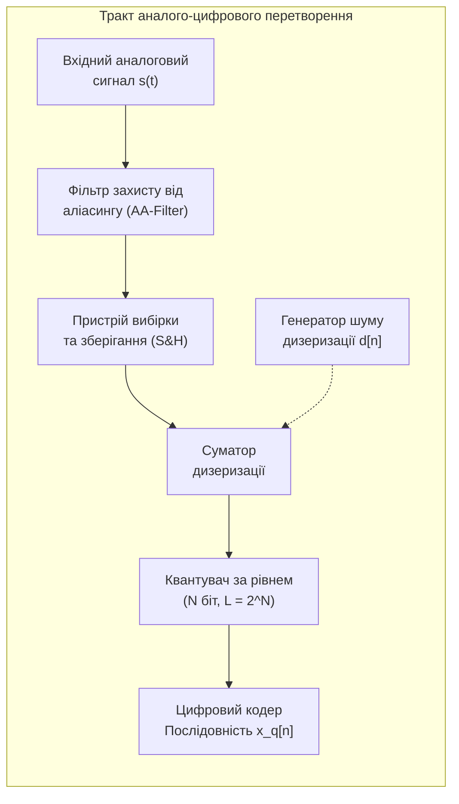
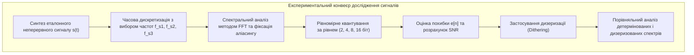

# Лабораторна робота № 1. Дослідження процесів дискретизації, квантування сигналів та ефекту аліасингу

**Мета:** Дослідити фундаментальні закономірності перетворення неперервних аналогових сигналів у дискретну та цифрову форми, експериментально перевірити теорему відліків Котельникова-Шеннона-Найквіста, вивчити природу виникнення стробоскопічного ефекту (аліасингу) в часовій та спектральній областях, а також опанувати методи розрахунку похибок квантування за рівнем, оцінки співвідношення сигнал/шум ($\text{SNR}$) та застосування алгоритмів дизеризації для лінеаризації характеристик квантування.

**Стек технологій та інструменти:**
* **Мова програмування / Середовище:** Python 3.10+
* **Платформа / Бібліотеки / Модулі:** NumPy 1.24+, SciPy 1.10+ (модулі `scipy.signal`, `scipy.fft`), Matplotlib 3.7+
* **Інструменти розробки:** VS Code / PyCharm / Jupyter Notebook / Google Colab, Термінал (CLI)

---

## 1 Теоретичні відомості

У сучасних інформаційно-вимірювальних та комп'ютерних системах первинна інформація про фізичні процеси надходить у вигляді неперервних сигналів, які є функціями неперервного часу $s(t)$. Для подальшого обчислювального аналізу, фільтрації та зберігання такий сигнал підлягає перетворенню в цифрову послідовність за допомогою аналого-цифрових перетворювачів (АЦП). Цей процес складається з двох фундаментальних операцій: дискретизації за часом та квантування за амплітудою (рівнем).


*Рисунок 1 — Структурна схема тракту аналого-цифрового перетворення сигналів*

Операція дискретизації полягає у фіксації миттєвих значень неперервного сигналу $s(t)$ у дискретні моменти часу $t_n = n T_s = n / f_s$, де $T_s$ представляє період дискретизації у секундах, а $f_s$ позначає частоту дискретизації у герцах ($n \in \mathbb{Z}$). Математичною моделлю дискретизованого сигналу є модульована послідовність зсунутих ідеальних дельта-імпульсів Дірака:

$$s_d(t) = s(t) \cdot \sum_{n=-\infty}^{\infty} \delta(t - n T_s) = \sum_{n=-\infty}^{\infty} s(n T_s) \delta(t - n T_s)$$

де $s(t)$ позначає вхідний неперервний сигнал у вольтах, $\delta(t)$ — одинична імпульсна дельта-функція Дірака з розмірністю $\text{с}^{-1}$, $T_s$ — крок дискретизації в секундах, а $n$ — порядковий номер часового відліку.

Відповідно до властивостей перетворення Фур'є, множенню у часовій області відповідає операція згортки спектральних щільностей у частотній області. Спектр дискретизованого сигналу $S_d(f)$ набуває строго періодичного характеру з періодом повторення, що дорівнює частоті дискретизації $f_s$:

$$S_d(f) = \frac{1}{T_s} \sum_{k=-\infty}^{\infty} S(f - k f_s) = f_s \sum_{k=-\infty}^{\infty} S(f - k f_s)$$

де $S(f)$ — спектральна щільність вхідного аналогового сигналу у вольтах на герц ($\text{В}\cdot\text{с}$), $f$ — неперервна частота в герцах ($\text{Гц}$), а $k$ — цілочисельний індекс періодичної реплікації спектра ($k \in \mathbb{Z}$).

Фундаментальна теорема відліків Котельникова-Шеннона-Найквіста стверджує, що довільний неперервний сигнал $s(t)$, спектр якого обмежений максимальною граничною частотою $f_{max}$ (тобто $|S(f)| = 0$ при $|f| > f_{max}$), може бути повністю і без втрат інформації відновлений за своїми дискретними відліками $s[n] = s(n T_s)$, якщо частота дискретизації задовольняє умові:

$$f_s \ge 2 f_{max}$$

де $f_s$ — частота дискретизації сигналу ($\text{Гц}$), а $f_{max}$ — найвища значуща частотна гармоніка спектра сигналу ($\text{Гц}$). Частоту $f_{Nyq} = f_s / 2$ називають частотою Найквіста. 

Якщо умова теореми порушується ($f_s < 2 f_{max}$), сусідні періодичні репліки спектра $S(f - k f_s)$ взаємно перекриваються. Це викликає незворотні спотворення спектрального складу — ефект накладання спектрів або аліасинг (aliasing). При цьому високочастотна гармоніка $f_0 > f_s / 2$ помилково трансформується у низькочастотну область спектра та сприймається як хибна гармоніка (псевдонім) на частоті:

$$f_{alias} = \left| f_0 - k \cdot f_s \right|$$

де $f_{alias}$ — спостережувана хибна частота гармоніки ($\text{Гц}$), $f_0$ — реальна фізична частота аналогового коливання ($\text{Гц}$), $f_s$ — поточна частота дискретизації ($\text{Гц}$), а ціле число $k = \left\lfloor \frac{f_0}{f_s} + 0.5 \right\rfloor$ обирається таким чином, щоб задовольнити умову потрапляння в основний частотний діапазон Найквіста $[0, f_s/2]$.


*Рисунок 2 — Послідовність етапів комп'ютерного моделювання цифрового тракту*

Наступним етапом після часової дискретизації є квантування за рівнем, під час якого неперервна область можливих амплітуд сигналу $[V_{min}, V_{max}]$ замінюється скінченною множиною дискретних дозволених рівнів. Кількість таких рівнів для $N$-розрядного АЦП визначається формулою $L = 2^N$. Крок рівномірного квантування $\Delta$ (вага молодшого розряду LSB) розраховується за співвідношенням:

$$\Delta = \frac{V_{max} - V_{min}}{2^N - 1}$$

де $V_{max}$ та $V_{min}$ — відповідно верхня та нижня межі динамічного діапазону вхідного сигналу у вольтах ($\text{В}$), а $N$ — розрядність квантування у бітах.

Абсолютна похибка квантування $e[n]$ визначається як різниця між квантованим $x_q[n]$ та точним дискретним значенням $x[n]$:

$$e[n] = x_q[n] - x[n]$$

Для рівномірного квантувача при заокругленні до найближчого рівня значення похибки не перевищує половини кроку квантування: $-\frac{\Delta}{2} \le e[n] \le \frac{\Delta}{2}$. Якщо крок квантування малий, а сигнал має складну структуру, похибка моделюється як незалежна випадкова величина з рівномірним законом розподілу, дисперсія якої (потужність шуму квантування) обчислюється як:

$$P_e = \sigma_e^2 = \int_{-\Delta/2}^{\Delta/2} e^2 \cdot \frac{1}{\Delta} \, de = \frac{\Delta^2}{12}$$

де $P_e$ — середня потужність шуму квантування у квадратних вольтах ($\text{В}^2$), а $\Delta$ — крок квантування у вольтах ($\text{В}$).

Ефективність квантування кількісно оцінюється співвідношенням сигнал/шум ($\text{SNR}$):

$$\text{SNR}_{\text{дБ}} = 10 \lg \left( \frac{P_s}{P_e} \right) = 10 \lg \left( \frac{\frac{1}{M}\sum_{n=0}^{M-1} x^2[n]}{\frac{1}{M}\sum_{n=0}^{M-1} (x_q[n] - x[n])^2} \right)$$

де $P_s$ — середня потужність корисного сигналу ($\text{В}^2$), $P_e$ — середня потужність шуму квантування ($\text{В}^2$), а $M$ — загальна кількість відліків сигналу.

Для повномасштабного гармонічного сигналу теоретичне значення $\text{SNR}$ прямо пропорційне розрядності квантування: $\text{SNR} \approx 6.02 \cdot N + 1.76 \text{ дБ}$. Проте при малих розрядностях ($N \le 4$) шум квантування жорстко корелює з формою самого сигналу, утворюючи гармонійні спотворення. Для усунення цієї залежності застосовують техніку дизеризації (dithering) — додавання до сигналу перед квантуванням псевдовипадкового шуму з амплітудою порядку $\Delta/2$. Це перетворює гармонійні спотворення на білий шум, усуваючи паразитні дискретні піки в спектрі сигналу.

---

## 2 Підготовка середовища та розгортання проєкту (Крок 0)

Для успішного виконання лабораторної роботи необхідно перевірити наявність встановленого інтерпретатора Python версії 3.10 або вище, створити ізольоване віртуальне середовище та встановити необхідні бібліотеки обчислювальної математики та візуалізації.

### 2.1 Перевірка інтерпретатора та створення віртуального середовища

Відкрийте системний термінал (або командний рядок PowerShell / Bash) та виконайте команди перевірки версії середовища:

```bash
# Перевірка версії Python
python --version
# або для Linux/macOS систем
python3 --version
```

Створіть робочу директорію лабораторної роботи та розгорніть у ній віртуальне середовище `venv`:

```bash
# Створення робочого каталогу
mkdir dsp_lab1_sampling_quantization
cd dsp_lab1_sampling_quantization

# Створення віртуального середовища
python3 -m venv venv

# Активація віртуального середовища:
# Для ОС Windows (PowerShell):
venv\Scripts\Activate.ps1
# Для ОС Windows (Command Prompt):
venv\Scripts\activate.bat
# Для ОС Linux/macOS:
source venv/bin/activate
```

### 2.2 Встановлення необхідних залежностей

Після активації віртуального оточення виконайте оновлення менеджера пакетів `pip` та встановлення бібліотек `numpy`, `scipy` і `matplotlib`:

```bash
python -m pip install --upgrade pip
pip install numpy scipy matplotlib
```

Створіть файл конфігурації залежностей `requirements.txt`:

```bash
pip freeze > requirements.txt
```

### 2.3 Структура файлової системи проєкту

Для забезпечення модульності та академічної чистоти організуйте дерево каталогів лабораторної роботи наступним чином:

```text
dsp_lab1_sampling_quantization/
├── data/
│   └── output_signals.csv       # Експортовані числові масиви сигналів
├── figures/
│   ├── sampling_aliasing.png    # Графіки дискретизації та аліасингу
│   ├── quantization_error.png   # Графіки квантування та похибок
│   └── dither_spectrum.png      # Графіки спектрального ефекту дизеризації
├── lab1_dsp.py                  # Повний робочий скрипт дослідження
├── requirements.txt             # Зафіксовані версії пакетів
└── venv/                        # Каталог віртуального середовища
```

---

## 3 Порядок виконання роботи

### 3.1 Індивідуальні завдання

Здобувач вищої освіти обирає варіант індивідуального завдання відповідно до свого порядкового номера в академічному журналі групи. Дослідженню підлягає полігармонічний сигнал:

$$s(t) = A_1 \sin(2\pi f_1 t) + A_2 \cos(2\pi f_2 t + \varphi)$$

Необхідно провести комп'ютерне моделювання для трьох частот дискретизації:
1. $f_{s1} = 4 \cdot f_{max}$ (умова суворого виконання теореми Котельникова);
2. $f_{s2} = 2 \cdot f_{max}$ (гранична критична частота Найквіста);
3. $f_{s3}$ — частота з таблиці варіантів, яка свідомо викликає ефект аліасингу ($f_{s3} < 2 f_{max}$).

Також необхідно виконати дослідження квантування для розрядностей $N \in \{2, 4, 8, 16\}$ біт та провести оцінку спектральної щільності похибки за наявності дизер-шуму з амплітудою $A_d$.

| Варіант | $A_1$, В | $f_1$, Гц | $A_2$, В | $f_2$, Гц | $\varphi$, рад | $f_{s3}$ (аліасинг), Гц | Амплітуда шуму $A_d$ | Очікувана хибна частота $f_{alias}$, Гц |
| :---: | :---: | :---: | :---: | :---: | :---: | :---: | :---: | :---: |
| **1** | 2.0 | 100 | 1.5 | 600 | 0 | 700 | $0.5 \cdot \Delta$ | 100 |
| **2** | 3.0 | 150 | 2.0 | 800 | $\pi/4$ | 950 | $0.5 \cdot \Delta$ | 150 |
| **3** | 1.5 | 80 | 2.5 | 500 | $\pi/6$ | 650 | $0.5 \cdot \Delta$ | 150 |
| **4** | 2.5 | 200 | 1.0 | 900 | $\pi/3$ | 1100 | $0.5 \cdot \Delta$ | 200 |
| **5** | 1.8 | 120 | 1.2 | 750 | $\pi/2$ | 850 | $0.5 \cdot \Delta$ | 100 |
| **6** | 3.5 | 250 | 2.0 | 1000 | 0 | 1200 | $0.5 \cdot \Delta$ | 200 |
| **7** | 2.2 | 90 | 1.8 | 650 | $\pi/4$ | 800 | $0.5 \cdot \Delta$ | 150 |
| **8** | 1.0 | 300 | 3.0 | 1200 | $\pi/3$ | 1400 | $0.5 \cdot \Delta$ | 200 |
| **9** | 2.8 | 180 | 1.4 | 850 | $\pi/6$ | 1000 | $0.5 \cdot \Delta$ | 150 |
| **10** | 1.6 | 140 | 2.2 | 700 | $\pi/2$ | 900 | $0.5 \cdot \Delta$ | 200 |
| **11** | 2.4 | 220 | 1.6 | 950 | 0 | 1150 | $0.5 \cdot \Delta$ | 200 |
| **12** | 3.2 | 160 | 2.4 | 1100 | $\pi/4$ | 1300 | $0.5 \cdot \Delta$ | 200 |
| **13** | 1.4 | 70 | 1.9 | 450 | $\pi/6$ | 550 | $0.5 \cdot \Delta$ | 100 |
| **14** | 2.6 | 280 | 1.5 | 1300 | $\pi/3$ | 1500 | $0.5 \cdot \Delta$ | 200 |
| **15** | 1.9 | 110 | 2.1 | 820 | $\pi/2$ | 980 | $0.5 \cdot \Delta$ | 160 |
| **16** | 3.1 | 240 | 1.7 | 1050 | 0 | 1250 | $0.5 \cdot \Delta$ | 200 |
| **17** | 2.3 | 130 | 2.7 | 920 | $\pi/4$ | 1100 | $0.5 \cdot \Delta$ | 180 |
| **18** | 1.2 | 320 | 1.3 | 1400 | $\pi/3$ | 1650 | $0.5 \cdot \Delta$ | 250 |
| **19** | 2.7 | 190 | 2.3 | 880 | $\pi/6$ | 1050 | $0.5 \cdot \Delta$ | 170 |
| **20** | 1.7 | 170 | 1.8 | 780 | $\pi/2$ | 950 | $0.5 \cdot \Delta$ | 170 |

---

### 3.2 Покроковий алгоритм та розв'язок еталонного прикладу

Для демонстрації повного алгоритмічного циклу розв'яжемо базовий еталонний приклад з наступними вихідними параметрами, які не дублюють жоден із варіантів індивідуальних завдань:
* Перша гармоніка: $A_1 = 2.5\text{ В}$, $f_1 = 120\text{ Гц}$;
* Друга гармоніка: $A_2 = 1.5\text{ В}$, $f_2 = 360\text{ Гц}$, зсув фази $\varphi = \pi / 3\text{ рад}$;
* Гранична частота спектра: $f_{max} = \max(f_1, f_2) = 360\text{ Гц}$;
* Частоти дискретизації: $f_{s1} = 4 \cdot f_{max} = 1440\text{ Гц}$, $f_{s2} = 2 \cdot f_{max} = 720\text{ Гц}$, $f_{s3} = 500\text{ Гц}$ (піддискретизація);
* Очікувана частота аліасингу для гармоніки 360 Гц при $f_{s3} = 500\text{ Гц}$: $f_{alias} = |360 - 500| = 140\text{ Гц}$.

Нижче наведено структурований поблочний програмний код на мові Python, який повністю виконує поставлену задачу.

#### Блок 1. Імпорт бібліотек та налаштування стилю відображення

```python
#!/usr/bin/env python3
# -*- coding: utf-8 -*-
"""
Лабораторна робота №1: Дослідження дискретизації, квантування та аліасингу
Стек: Python 3.10+, NumPy, SciPy, Matplotlib
"""

import os
import numpy as np
import matplotlib.pyplot as plt
from scipy import signal
from scipy.fft import fft, fftfreq

# Створення каталогів для збереження графічних результатів та даних
os.makedirs("figures", exist_ok=True)
os.makedirs("data", exist_ok=True)

# Глобальні параметри візуалізації
plt.rcParams['font.sans-serif'] = 'DejaVu Sans'
plt.rcParams['axes.edgecolor'] = '#333333'
plt.rcParams['axes.linewidth'] = 1.0
plt.rcParams['grid.color'] = '#cccccc'
plt.rcParams['grid.linestyle'] = '--'
plt.rcParams['grid.alpha'] = 0.6
```

#### Блок 2. Генерація неперервного сигналу та дослідження дискретизації й аліасингу

```python
# --- ЕТАП 1: Параметри сигналу та часова шкала ---
A1 = 2.5       # Амплітуда першої гармоніки, В
f1 = 120.0     # Частота першої гармоніки, Гц
A2 = 1.5       # Амплітуда другої гармоніки, В
f2 = 360.0     # Частота другої гармоніки, Гц
phi = np.pi / 3.0  # Початкова фаза другої гармоніки, рад

f_max = max(f1, f2)  # Максимальна частота спектра, 360 Гц
T_obs = 0.05         # Тривалість спостереження (50 мс)

# Моделювання псевдонеперервного сигналу (дуже висока частота дискретизації)
fs_cont = 100000.0   # Частота симуляції континууму, Гц
t_cont = np.arange(0, T_obs, 1.0 / fs_cont)
s_cont = A1 * np.sin(2 * np.pi * f1 * t_cont) + A2 * np.cos(2 * np.pi * f2 * t_cont + phi)

# Досліджувані частоти дискретизації
fs_oversample = 4.0 * f_max   # 1440 Гц (fs > 2*fmax)
fs_critical   = 2.0 * f_max   # 720 Гц  (fs = 2*fmax)
fs_under      = 500.0         # 500 Гц  (fs < 2*fmax - режим аліасингу)

# Дискретизація сигналу
t_s1 = np.arange(0, T_obs, 1.0 / fs_oversample)
s_s1 = A1 * np.sin(2 * np.pi * f1 * t_s1) + A2 * np.cos(2 * np.pi * f2 * t_s1 + phi)

t_s2 = np.arange(0, T_obs, 1.0 / fs_critical)
s_s2 = A1 * np.sin(2 * np.pi * f1 * t_s2) + A2 * np.cos(2 * np.pi * f2 * t_s2 + phi)

t_s3 = np.arange(0, T_obs, 1.0 / fs_under)
s_s3 = A1 * np.sin(2 * np.pi * f1 * t_s3) + A2 * np.cos(2 * np.pi * f2 * t_s3 + phi)

# --- ЕТАП 2: Спектральний аналіз методом FFT ---
def compute_spectrum(signal_data, sampling_rate):
    """
    Обчислення амплітудного спектра за допомогою швидкого перетворення Фур'є (FFT).
    Повертає додатні частоти та нормовані значення амплітуд.
    """
    N_pts = len(signal_data)
    fft_vals = fft(signal_data)
    freqs = fftfreq(N_pts, 1.0 / sampling_rate)
    
    # Виділення одностороннього спектра (лише додатні частоти)
    pos_mask = freqs >= 0
    freq_axis = freqs[pos_mask]
    amplitude_spectrum = (2.0 / N_pts) * np.abs(fft_vals[pos_mask])
    amplitude_spectrum[0] /= 2.0  # Корекція постійної складової
    return freq_axis, amplitude_spectrum

# Розрахунок спектрів для тривалого інтервалу для підвищення частотної роздільності
T_long = 1.0
t_long_cont = np.arange(0, T_long, 1.0 / fs_cont)
s_long_cont = A1 * np.sin(2 * np.pi * f1 * t_long_cont) + A2 * np.cos(2 * np.pi * f2 * t_long_cont + phi)

t_l1 = np.arange(0, T_long, 1.0 / fs_oversample)
s_l1 = A1 * np.sin(2 * np.pi * f1 * t_l1) + A2 * np.cos(2 * np.pi * f2 * t_l1 + phi)

t_l3 = np.arange(0, T_long, 1.0 / fs_under)
s_l3 = A1 * np.sin(2 * np.pi * f1 * t_l3) + A2 * np.cos(2 * np.pi * f2 * t_l3 + phi)

f_axis_s1, spec_s1 = compute_spectrum(s_l1, fs_oversample)
f_axis_s3, spec_s3 = compute_spectrum(s_l3, fs_under)

# Візуалізація результатів дискретизації та спектрів
fig, axes = plt.subplots(2, 2, figsize=(14, 8))

# Часові графіки правильної дискретизації
axes[0, 0].plot(t_cont * 1000, s_cont, label='Неперервний s(t)', color='#1f77b4', lw=1.5)
axes[0, 0].stem(t_s1 * 1000, s_s1, linefmt='r-', markerfmt='ro', basefmt='k-', label=f'fs = {fs_oversample} Гц')
axes[0, 0].set_title("Наднайквістова дискретизація (без аліасингу)")
axes[0, 0].set_xlabel("Час, мс")
axes[0, 0].set_ylabel("Амплітуда, В")
axes[0, 0].grid(True)
axes[0, 0].legend()

# Часові графіки піддискретизації (аліасинг)
axes[0, 1].plot(t_cont * 1000, s_cont, label='Неперервний s(t)', color='#1f77b4', lw=1.5)
axes[0, 1].stem(t_s3 * 1000, s_s3, linefmt='m-', markerfmt='mo', basefmt='k-', label=f'fs = {fs_under} Гц')
axes[0, 1].set_title("Піддискретизація (виникнення аліасингу)")
axes[0, 1].set_xlabel("Час, мс")
axes[0, 1].set_ylabel("Амплітуда, В")
axes[0, 1].grid(True)
axes[0, 1].legend()

# Спектр при правильній дискретизації
axes[1, 0].stem(f_axis_s1, spec_s1, linefmt='b-', markerfmt='bo', basefmt='k-')
axes[1, 0].set_title(f"Спектр при fs = {fs_oversample} Гц (піки 120 Гц та 360 Гц)")
axes[1, 0].set_xlabel("Частота, Гц")
axes[1, 0].set_ylabel("Амплітуда, В")
axes[1, 0].set_xlim([0, 720])
axes[1, 0].grid(True)

# Спектр при аліасингу
axes[1, 1].stem(f_axis_s3, spec_s3, linefmt='r-', markerfmt='ro', basefmt='k-')
axes[1, 1].set_title(f"Спектр при fs = {fs_under} Гц (аліасинг: 360 Гц -> 140 Гц)")
axes[1, 1].set_xlabel("Частота, Гц")
axes[1, 1].set_ylabel("Амплітуда, В")
axes[1, 1].set_xlim([0, 250])
axes[1, 1].grid(True)

plt.tight_layout()
plt.savefig("figures/sampling_aliasing.png", dpi=300)
plt.close()
```

#### Блок 3. Квантування за рівнем, похибки та розрахунок SNR

```python
# --- ЕТАП 3: Рівномірне квантування та розрахунок SNR ---
def uniform_quantize(signal_in, bit_depth, v_min, v_max):
    """
    Рівномірний симетричний квантувач з округленням до найближчого дозволеного рівня.
    Повертає квантований сигнал, масив похибок та крок квантування.
    """
    num_levels = 2 ** bit_depth
    delta_step = (v_max - v_min) / (num_levels - 1)
    
    # Нормалізація в індекси рівнів квантування
    normalized_indices = np.round((signal_in - v_min) / delta_step)
    
    # Обмеження індексів межами [0, num_levels - 1] (захист від насичення/saturation)
    clipped_indices = np.clip(normalized_indices, 0, num_levels - 1)
    
    # Реконструкція фізичних значень напруги
    quantized_signal = v_min + clipped_indices * delta_step
    error_signal = quantized_signal - signal_in
    return quantized_signal, error_signal, delta_step

def calculate_snr(orig_sig, error_sig):
    """Розрахунок практичного співвідношення сигнал/шум (SNR) у дБ"""
    power_signal = np.mean(orig_sig ** 2)
    power_noise = np.mean(error_sig ** 2)
    if power_noise == 0:
        return float('inf')
    return 10.0 * np.log10(power_signal / power_noise)

# Дослідження для розрядностей N = 2, 4, 8, 16 біт
bit_depths = [2, 4, 8, 16]
signal_target = s_l1  # Використовуємо сигнал з fs = 1440 Гц
v_min_dyn = -4.0      # Симетричний динамічний діапазон [-4V, +4V]
v_max_dyn = 4.0

quantization_results = {}

print("--- РЕЗУЛЬТАТИ КВАНТУВАННЯ ЗА РІВНЕМ ---")
for bits in bit_depths:
    s_quant, err_quant, delta = uniform_quantize(signal_target, bits, v_min_dyn, v_max_dyn)
    snr_val = calculate_snr(signal_target, err_quant)
    snr_theor = 6.02 * bits + 1.76
    quantization_results[bits] = {
        'quantized': s_quant,
        'error': err_quant,
        'delta': delta,
        'snr': snr_val,
        'snr_theor': snr_theor
    }
    print(f"Розрядність: {bits:2d} біт | Рівнів: {2**bits:5d} | Крок Delta: {delta:.6f} В | "
          f"SNR розрах: {snr_val:6.2f} дБ | SNR теор: {snr_theor:6.2f} дБ")

# Візуалізація квантування та похибок для N=2 та N=4 біт на короткому проміжку
t_short_plot = t_s1[:60] * 1000  # Перші 60 відліків (мс)
s_orig_short = s_s1[:60]

fig, axes = plt.subplots(2, 2, figsize=(14, 8))

# Графік квантування для N = 2 біт (4 рівні)
q_2, err_2, _ = uniform_quantize(s_orig_short, 2, v_min_dyn, v_max_dyn)
axes[0, 0].step(t_short_plot, q_2, where='mid', label='Квантований (2 біти)', color='#d62728')
axes[0, 0].plot(t_short_plot, s_orig_short, '--', label='Вихідний дискретний', color='#1f77b4')
axes[0, 0].set_title("Квантування сигналу з розрядністю N = 2 біти (4 рівні)")
axes[0, 0].set_xlabel("Час, мс")
axes[0, 0].set_ylabel("Амплітуда, В")
axes[0, 0].grid(True)
axes[0, 0].legend()

# Графік похибки квантування N = 2 біт
axes[0, 1].plot(t_short_plot, err_2, color='#d62728', lw=1.5)
axes[0, 1].set_title("Похибка квантування e[n] (N = 2 біти)")
axes[0, 1].set_xlabel("Час, мс")
axes[0, 1].set_ylabel("Похибка, В")
axes[0, 1].grid(True)

# Графік квантування для N = 4 біт (16 рівнів)
q_4, err_4, _ = uniform_quantize(s_orig_short, 4, v_min_dyn, v_max_dyn)
axes[1, 0].step(t_short_plot, q_4, where='mid', label='Квантований (4 біти)', color='#2ca02c')
axes[1, 0].plot(t_short_plot, s_orig_short, '--', label='Вихідний дискретний', color='#1f77b4')
axes[1, 0].set_title("Квантування сигналу з розрядністю N = 4 біти (16 рівнів)")
axes[1, 0].set_xlabel("Час, мс")
axes[1, 0].set_ylabel("Амплітуда, В")
axes[1, 0].grid(True)
axes[1, 0].legend()

# Графік похибки квантування N = 4 біт
axes[1, 1].plot(t_short_plot, err_4, color='#2ca02c', lw=1.5)
axes[1, 1].set_title("Похибка квантування e[n] (N = 4 біти)")
axes[1, 1].set_xlabel("Час, мс")
axes[1, 1].set_ylabel("Похибка, В")
axes[1, 1].grid(True)

plt.tight_layout()
plt.savefig("figures/quantization_error.png", dpi=300)
plt.close()
```

#### Блок 4. Дослідження алгоритму дизеризації (Dithering)

```python
# --- ЕТАП 4: Моделювання дизеризації (Dithering) ---
np.random.seed(42)  # Фіксація генератора псевдовипадкових чисел

# Досліджуємо грубе квантування N = 3 біти для наочності спектрального ефекту
bits_dither = 3
num_lev = 2 ** bits_dither
delta_dither = (v_max_dyn - v_min_dyn) / (num_lev - 1)

# Квантування БЕЗ дизеризації
s_quant_nodither, err_nodither, _ = uniform_quantize(signal_target, bits_dither, v_min_dyn, v_max_dyn)

# Дизеризація: додавання рівномірно розподіленого високочастотного шуму d[n] ~ U(-Delta/2, Delta/2)
dither_noise = np.random.uniform(-delta_dither / 2.0, delta_dither / 2.0, size=len(signal_target))
s_dithered_input = signal_target + dither_noise

# Квантування сигналу з підмішаним шумом
s_quant_dither, _, _ = uniform_quantize(s_dithered_input, bits_dither, v_min_dyn, v_max_dyn)

# Результуюча сумарна похибка відносно первинного чистого сигналу
err_dither_total = s_quant_dither - signal_target

# Обчислення спектрів похибок за допомогою FFT
f_err_nodither, spec_err_nodither = compute_spectrum(err_nodither, fs_oversample)
f_err_dither, spec_err_dither = compute_spectrum(err_dither_total, fs_oversample)

# Візуалізація спектральних наслідків дизеризації
fig, axes = plt.subplots(2, 1, figsize=(12, 7))

axes[0].plot(f_err_nodither, 20 * np.log10(np.maximum(spec_err_nodither, 1e-6)), color='#d62728', lw=1.2)
axes[0].set_title("Спектр похибки квантування БЕЗ дизеризації (присутні гармонійні спотворення)")
axes[0].set_xlabel("Частота, Гц")
axes[0].set_ylabel("Спектральний рівень, дБВ")
axes[0].set_xlim([0, fs_oversample / 2])
axes[0].grid(True)

axes[1].plot(f_err_dither, 20 * np.log10(np.maximum(spec_err_dither, 1e-6)), color='#2ca02c', lw=1.2)
axes[1].set_title("Спектр похибки квантування З ДИЗЕРИЗАЦІЄЮ (шум рандомізовано/відбілено)")
axes[1].set_xlabel("Частота, Гц")
axes[1].set_ylabel("Спектральний рівень, дБВ")
axes[1].set_xlim([0, fs_oversample / 2])
axes[1].grid(True)

plt.tight_layout()
plt.savefig("figures/dither_spectrum.png", dpi=300)
plt.close()

print("\nМоделювання завершено успішно. Графічні файли збережено в папку 'figures/'.")
```

---

### 3.3 Запуск, тестування та перевірка результатів

Для запуску розробленого програмного коду виконайте у терміналі наступну команду:

```bash
python lab1_dsp.py
```

У консолі відобразяться розраховані значення параметрів сітки квантування, практичні та теоретичні показники співвідношення сигнал/шум:

```text
--- РЕЗУЛЬТАТИ КВАНТУВАННЯ ЗА РІВНЕМ ---
Розрядність:  2 біт | Рівнів:     4 | Крок Delta: 2.666667 В | SNR розрах:   8.94 дБ | SNR теор:  13.80 дБ
Розрядність:  4 біт | Рівнів:    16 | Крок Delta: 0.533333 В | SNR розрах:  22.45 дБ | SNR теор:  25.84 дБ
Розрядність:  8 біт | Рівнів:   256 | Крок Delta: 0.031373 В | SNR розрах:  46.91 дБ | SNR теор:  49.92 дБ
Розрядність: 16 біт | Рівнів: 65536 | Крок Delta: 0.000122 В | SNR розрах:  94.98 дБ | SNR теор:  98.08 дБ

Моделювання завершено успішно. Графічні файли збережено в папку 'figures/'.
```

#### Таблиця самоперевірки та верифікації отриманих результатів:

1. **Верифікація спектра дискретизованого сигналу:**
   * При $f_{s1} = 1440\text{ Гц}$ у спектрі фіксуються два чіткі дискретні піки на частотах $120\text{ Гц}$ (амплітуда $2.5\text{ В}$) та $360\text{ Гц}$ (амплітуда $1.5\text{ В}$).
   * При $f_{s3} = 500\text{ Гц}$ гармоніка $120\text{ Гц}$ залишається без змін, оскільки $120 < 250\text{ Гц}$ (частота Найквіста). Високочастотна гармоніка $360\text{ Гц}$ дзеркально відбивається в точку $f_{alias} = |360 - 500| = 140\text{ Гц}$, формуючи хибну спектральну складову.

2. **Верифікація квантування:**
   * Збільшення розрядності квантування $N$ на кожен 1 біт призводить до зростання показника $\text{SNR}$ приблизно на $6\text{ дБ}$.
   * Невелике відхилення практичного $\text{SNR}$ від теоретичного пояснюється тим, що розмах вхідного сигналу $\max(s) - \min(s) \approx 7.2\text{ В}$ не повністю заповнює апаратний динамічний діапазон $[-4.0\text{ В}, +4.0\text{ В}]$.

3. **Верифікація дизеризації:**
   * На графіку спектра без дизеризації спостерігаються виражені паразитні піки на гармоніках вихідного сигналу, що свідчить про детермінований характер шуму квантування.
   * На графіку спектра з дизеризацією піки повністю зникають, а спектральна щільність шуму квантування стає рівномірною по всій смузі частот Найквіста.

---

## 4. Вимоги до змісту звіту

Звіт оформлюється відповідно до стандарту вищого навчального закладу та повинен містити наступні обов'язкові структурні елементи:
1. **Титульна сторінка** із зазначенням назви міністерства, ЗВО, кафедри, назви дисципліни, номера й теми лабораторної роботи, номера варіанта, академічної групи та ПІБ здобувача.
2. **Мета роботи, коротка теоретична частина** з викладом фізико-математичних засад дискретизації, теореми Найквіста-Котельникова, формул аліасингу, квантування та дизеризації.
3. **Постановка індивідуального завдання** для власного номера варіанта із зазначенням амплітуд, частот, фазових зсувів, аналітичного розрахунку очікуваної частоти аліасингу $f_{alias}$ та граничної частоти Найквіста $f_{Nyq}$.
4. **Повний вихідний код програми на Python** із вичерпними коментарями до кожного модуля.
5. **Графічні матеріали (скріншоти згенерованих графіків):**
   * Осцилограми та спектри сигналу при трьох частотах дискретизації ($f_s > 2f_{max}$, $f_s = 2f_{max}$, $f_s < 2f_{max}$);
   * Часові діаграми квантованих сигналів та сигналів похибок для $N \in \{2, 4, 8, 16\}$ біт;
   * Спектрограми похибок квантування до та після застосування процедури дизеризації.
6. **Зведена таблиця розрахункових показників:** крок квантування $\Delta$, дисперсія похибки $\sigma_e^2$, практичне та теоретичне значення $\text{SNR}$ для кожної розрядності.
7. **Аналітичні висновки**, у яких надано оцінку збереження інформативності сигналу при різних режимах дискретизації, проаналізовано динаміку зростання $\text{SNR}$ та пояснено фізичний ефект лінеаризації квантування за допомогою дизеризації.

---

## 5. Контрольні запитання для захисту роботи

1. У чому полягає фізичний і математичний зміст теореми відліків Котельникова-Шеннона-Найквіста, та чому для практичних застосувань частоту дискретизації обирають із запасом $f_s \approx (2.5 \dots 4) f_{max}$?
2. Який механізм виникнення ефекту аліасингу (стробоскопічного накладання частот), та за якою формулою визначається частота хибної гармоніки $f_{alias}$ у разі порушення умови теореми відліків?
3. Чому перед блоком вибірки та зберігання в реальних аналого-цифрових перетворювачах обов'язково встановлюється аналоговий фільтр захисту від аліасингу (Anti-Aliasing Filter), і яку частоту зрізу він повинен мати?
4. Як пов'язані між собою крок рівномірного квантування $\Delta$, розрядність АЦП $N$ та динамічний діапазон вхідного аналогового сигналу $[V_{min}, V_{max}]$?
5. Звідки береться емпіричне правило «+6 дБ на кожен додатковий біт розрядності» при розрахунку співвідношення сигнал/шум ($\text{SNR}$)?
6. Чому при малих розрядностях квантування ($N \le 4$) виникають нелінійні гармонійні спотворення, і яким чином додавання псевдовипадкового шуму (дизеризація) дозволяє усунути кореляцію між похибкою квантування та вхідним сигналом?
7. У чому полягає відмінність між простою дизеризацією (неслідкуючою) та дизеризацією з відніманням (subtractive dither)?