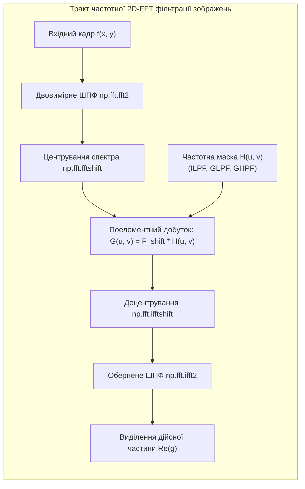
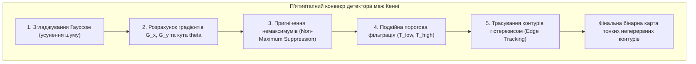

# Лабораторна робота № 11. Двовимірне перетворення Фур'є та детектування контурів на зображеннях

**Мета:** Опанувати теоретичні засади спектрального аналізу цифрових зображень у частотній області на основі двовимірного дискретного перетворення Фур'є (2D-FFT), дослідити процеси частотного центрування, розрахунку амплітудного й фазового спектрів, реалізувати синтез ідеальних та гаусових частотних фільтрів низьких і високих частот, а також вивчити роботу просторових градієнтних операторів першого порядку (Собеля, Шарра) та оптимального детектора контурів Кенні з адаптивним вибором порогів гістерезису.

**Стек технологій та інструменти:**
* **Мова програмування / Середовище:** Python 3.10+
* **Платформа / Бібліотеки / Модулі:** NumPy 1.24+ (модуль `numpy.fft`), OpenCV 4.8+ (`cv2`), Matplotlib 3.7+
* **Інструменти розробки:** VS Code / PyCharm / Jupyter Notebook / Google Colab, Термінал (CLI)

---

## 1 Теоретичні відомості

Частотне подання цифрового зображення дозволяє розглядати двовимірний масив яскравості пікселів $f(x, y)$ як лінійну комбінацію просторових гармонік різної частоти, орієнтації та амплітуди. Математичним інструментом переходу з просторової області у частотну є двовимірне дискретне перетворення Фур'є (2D-DFT / 2D-FFT), яке для зображення розміром $M \times N$ пікселів визначається виразом:

$$F(u, v) = \sum_{x=0}^{M-1} \sum_{y=0}^{N-1} f(x, y) \exp\left[-j 2\pi \left(\frac{u x}{M} + \frac{v y}{N}\right)\right]$$

де $f(x, y)$ позначає просторовий відлік яскравості пікселя у рядку $x$ та стовпці $y$, $F(u, v)$ є комплексним спектральним коефіцієнтом, $u \in [0, M-1]$ та $v \in [0, N-1]$ представляють дискретні просторові частоти вздовж горизонтальної та вертикальної осей відповідно, а $j = \sqrt{-1}$ — уявна одиниця.

Обернене двовимірне дискретне перетворення Фур'є (2D-IDFT) виконує точну реконструкцію просторового зображення за його комплексним спектром:

$$f(x, y) = \frac{1}{M N} \sum_{u=0}^{M-1} \sum_{v=0}^{N-1} F(u, v) \exp\left[j 2\pi \left(\frac{u x}{M} + \frac{v y}{N}\right)\right]$$


*Рисунок 1 — Структурна схема алгоритму фільтрації зображень у частотній області Фур'є*

У вихідному масиві $F(u, v)$ нульова постійна складова розташована у лівому верхньому куті матриці. Для забезпечення наочності спектрального аналізу виконують циклічну перестановку квадрантів (операція `fftshift`), переміщуючи низькі частоти в центр матриці $(M/2, N/2)$. Оскільки динамічний діапазон модуля спектра $|F(u, v)|$ досягає декількох порядків, для його візуалізації застосовують логарифмічне стиснення:

$$S(u, v) = 20 \log_{10}(|F(u, v)| + 1)$$

Фільтрація у частотній області базується на теоремі про згортку: просторовій згортці зображення $f(x, y)$ з ядром $h(x, y)$ відповідає прямий добуток їхніх спектрів $G(u, v) = F(u, v) \cdot H(u, v)$. 

Для синтезу частотних фільтрів використовують функцію евклідової відстані від поточної точки $(u, v)$ до центру спектрального поля:

$$D(u, v) = \sqrt{\left(u - \frac{M}{2}\right)^2 + \left(v - \frac{N}{2}\right)^2}$$

Математичні моделі базових частотних передавальних функцій мають такий вигляд:
1. Ідеальний фільтр низьких частот (ILPF) повністю відсікає всі частоти за межами кола радіуса $D_0$:
$$H_{ILPF}(u, v) = \begin{cases} 1, & \text{якщо } D(u, v) \le D_0 \\ 0, & \text{якщо } D(u, v) > D_0 \end{cases}$$
(викликає паразитний ефект осциляцій Гіббса на різких перепадах яскравості).
2. Гаусівський фільтр низьких частот (GLPF) забезпечує абсолютно плавне спадання АЧХ без паразитних кілець розмиття:
$$H_{GLPF}(u, v) = \exp\left(-\frac{D^2(u, v)}{2 D_0^2}\right)$$
3. Гаусівський фільтр високих частот (GHPF) пригнічує низькі частоти фону та підсилює контури об'єктів:
$$H_{GHPF}(u, v) = 1 - H_{GLPF}(u, v) = 1 - \exp\left(-\frac{D^2(u, v)}{2 D_0^2}\right)$$


*Рисунок 2 — Послідовність обчислювальних кроків оптимального детектора контурів Кенні*

У просторовій області виділення контурів базується на обчисленні двовимірного вектора градієнта яскравості $\nabla f = [G_x, G_y]^T$, модуль якого визначає силу контуру:

$$G(x, y) = \sqrt{G_x^2(x, y) + G_y^2(x, y)} \approx |G_x(x, y)| + |G_y(x, y)|$$

Дискретні оператори першого порядку Собеля та Шарра реалізують диференціювання з просторовим згладжуванням:

$$\text{Ядра Собеля: } S_x = \begin{bmatrix} -1 & 0 & 1 \\ -2 & 0 & 2 \\ -1 & 0 & 1 \end{bmatrix}, \quad S_y = \begin{bmatrix} -1 & -2 & -1 \\ 0 & 0 & 0 \\ 1 & 2 & 1 \end{bmatrix}$$

$$\text{Ядра Шарра: } Sc_x = \begin{bmatrix} -3 & 0 & 3 \\ -10 & 0 & 10 \\ -3 & 0 & 3 \end{bmatrix}, \quad Sc_y = \begin{bmatrix} -3 & -10 & -3 \\ 0 & 0 & 0 \\ 3 & 10 & 3 \end{bmatrix}$$

Оператор Шарра мінімізує похибку кутової анізотропії градієнта для ядер розміром $3 \times 3$.

Оптимальний детектор меж Кенні (Canny edge detector) реалізує багатокроковий алгоритм, який спочатку виконує Гаусове згладжування, знаходить модуль та орієнтацію градієнта $\theta(x, y) = \text{atan2}(G_y, G_x)$, здійснює потоншення меж методом пригнічення немаксимумів (Non-Maximum Suppression — NMS) у напрямку градієнта, а потім застосовує подвійну порогову фільтрацію з порогами $T_{low}$ та $T_{high}$. Трасування гістерезисом зберігає слабкі граничні пікселі ($T_{low} \le G < T_{high}$) лише за умови їхньої 8-зв'язності з сильними контурами ($G \ge T_{high}$).

---

## 2 Підготовка середовища та розгортання проєкту (Крок 0)

Перед початком виконання лабораторної роботи перевірте конфігурацію інтерпретатора Python, створіть структуру робочого каталогу та встановіть необхідні бібліотеки для обчислення 2D-FFT і градієнтного аналізу.

### 2.1 Налаштування віртуального оточення та встановлення пакетів

Виконайте у терміналі команди створення та активації ізольованого середовища:

```bash
# Створення робочого каталогу лабораторної роботи № 11
mkdir dsp_lab11_fft2d_canny_edges
cd dsp_lab11_fft2d_canny_edges

# Створення та активація віртуального середовища
python3 -m venv venv

# Активація для Linux/macOS:
source venv/bin/activate
# Активація для Windows (PowerShell):
# venv\Scripts\Activate.ps1
# Активація для Windows (CMD):
# venv\Scripts\activate.bat

# Оновлення pip та встановлення залежностей
python -m pip install --upgrade pip
pip install numpy opencv-python matplotlib scipy
```

### 2.2 Структура файлової системи проєкту

Файлова структура робочої директорії повинна мати такий вигляд:

```text
dsp_lab11_fft2d_canny_edges/
├── data/
│   └── test_edge_scene.png            # Згенероване тестове зображення
├── figures/
│   ├── fft2d_spectrum_analysis.png    # Логарифмічний амплітудний та фазовий спектри
│   ├── frequency_filtering_results.png# Результати фільтрації ILPF, GLPF, GHPF
│   ├── sobel_scharr_gradients.png     # Карти градієнтів Собеля та Шарра
│   └── canny_thresholds_study.png     # Дослідження порогів гістерезису детектора Кенні
├── lab11_fft2d_edges.py               # Головний виконуваний скрипт програми
├── requirements.txt                   # Зафіксовані версії пакетів
└── venv/                              # Віртуальне оточення
```

---

## 3 Порядок виконання роботи

### 3.1 Індивідуальні завдання

Здобувач вищої освіти виконує лабораторну роботу відповідно до індивідуального варіанта. Усі дослідження проводяться на тестових кадрах розміром $512 \times 512$ пікселів.

У кожному варіанті досліджуються:
1. Обчислення прямого 2D-FFT, центрування частот, візуалізація спектра потужності та оцінка просторової орієнтації частотних компонентів;
2. Частотна фільтрація за допомогою фільтрів низьких та високих частот із радіусом зрізу $D_0$ та просторовим параметром Гаусса $\sigma_f$;
3. Розрахунок горизонтального $G_x$, вертикального $G_y$ та повного градієнтів $G$ за допомогою операторів Собеля (розмір ядра $k_{sobel}$) та Шарра;
4. Оптимізація параметрів детектора меж Кенні шляхом варіювання нижнього $T_{low}$ та верхнього $T_{high}$ порогів гістерезису.

| Варіант | Сфера аналізу / Тип зображення | Радіус $D_0$, px | Параметр $\sigma_f$ | Ядро Собеля $k_{sobel}$ | Пороги Кенні $[T_{low}, T_{high}]$ | Цільовий контур аналізу |
| :---: | :--- | :---: | :---: | :---: | :---: | :--- |
| **1** | Супутниковий знімок кратерів Місяця | 35 | 25.0 | 3 | `[40, 120]` | Зовнішні кільцеві вали кратерів |
| **2** | Дефектоскопія друкованої плати (PCB) | 50 | 35.0 | 3 | `[60, 180]` | Границі мідних провідників |
| **3** | Медичний знімок рентгену суглоба | 30 | 20.0 | 5 | `[30, 90]` | Межі кісткових поверхонь |
| **4** | Радіолокаційний знімок узбережжя | 45 | 30.0 | 3 | `[50, 150]` | Берегова лінія суші та води |
| **5** | Дактилоскопічний відбиток пальця | 60 | 40.0 | 3 | `[70, 200]` | Папілярні гребені шкіри |
| **6** | Аерофотознімок дорожньої розв'язки | 40 | 28.0 | 5 | `[45, 135]` | Крайові смуги автодоріг |
| **7** | Мікрофотографія клітин крові | 35 | 22.0 | 3 | `[35, 105]` | Оболонки еритроцитів |
| **8** | Сканований штрих-код високої щільності | 70 | 50.0 | 3 | `[80, 220]` | Вертикальні штрихові лінії |
| **9** | Оптичний диск на конвеєрі заводу | 55 | 38.0 | 3 | `[65, 190]` | Внутрішні та зовнішні радіуси |
| **10** | Текстура металевого шліфу металу | 30 | 20.0 | 5 | `[40, 110]` | Границі кристалічних зерен |
| **11** | Фасад будинку з віконними отворами | 45 | 32.0 | 3 | `[55, 160]` | Прямокутні контури вікон |
| **12** | Знімок сонячної батареї (тріщини) | 50 | 35.0 | 3 | `[50, 140]` | Тонкі лінії кремнієвих комірок |
| **13** | Автомобільний номер у русі | 65 | 45.0 | 3 | `[75, 210]` | Символи номерного знака |
| **14** | Інфрачервоний знімок трубопроводу | 25 | 18.0 | 5 | `[30, 85]` | Зони теплових стиків труб |
| **15** | Текстильне полотно з дефектом нитки | 60 | 42.0 | 3 | `[70, 195]` | Окремі нитки ткацького переплетення |
| **16** | Знімок зоряного неба з туманністю | 30 | 20.0 | 3 | `[35, 95]` | Межі газопилових хмар |
| **17** | Гідролокаційне зображення дна | 40 | 26.0 | 5 | `[45, 125]` | Підводні штучні об'єкти |
| **18** | Сканований підпис на документі | 55 | 36.0 | 3 | `[60, 170]` | Рукописні каліграфічні лінії |
| **19** | Знімок зварного шва високого тиску | 35 | 24.0 | 3 | `[40, 115]` | Пори та шлакові включення |
| **20** | QR-код на циліндричній поверхні | 65 | 44.0 | 3 | `[75, 205]` | Позиційні квадратні маркери |

---

### 3.2 Покроковий алгоритм та розв'язок еталонного прикладу

Для забезпечення абсолютної автономності лабораторної роботи у скрипті реалізовано програмний синтез тестового калібрувального зображення розміром $512 \times 512$ пікселів, що містить різноспрямовані геометричні контури, високочастотну періодичну решітку, концентричні кола та текстові написи.

Параметри еталонного експерименту:
* Параметри 2D-FFT фільтрації: радіус зрізу для ідеального низькочастотного фільтра $D_0 = 40\text{ px}$, радіус зрізу для гаусових низькочастотного та високочастотного фільтрів $D_0 = 40\text{ px}$;
* Параметри градієнтного аналізу: розмір ядра Собеля $k_{sobel} = 3$, оператор Шарра $3 \times 3$;
* Параметри детектора Кенні: дослідження трьох комбінацій порогів гістерезису — занижених $[30, 80]$ (надмірна чутливість), оптимальних $[50, 150]$ (збалансоване виділення) та завищених $[120, 220]$ (виділення виключно домінантних границь).

Нижче наведено повний самодостатній скрипт `lab11_fft2d_edges.py`.

#### Блок 1. Підготовка середовища, імпорт модулів та генерація еталонної тестової сцени

```python
#!/usr/bin/env python3
# -*- coding: utf-8 -*-
"""
Лабораторна робота №11: Двовимірне перетворення Фур'є та детектування контурів
Стек: Python 3.10+, NumPy, OpenCV (cv2), Matplotlib
"""

import os
import cv2
import numpy as np
import matplotlib.pyplot as plt

# Створення директорій для графіків та даних
os.makedirs("figures", exist_ok=True)
os.makedirs("data", exist_ok=True)

# Налаштування стилю відображення графіків
plt.rcParams['font.sans-serif'] = 'DejaVu Sans'
plt.rcParams['axes.edgecolor'] = '#2b2b2b'
plt.rcParams['axes.linewidth'] = 1.0

def generate_fourier_edge_scene(size=512):
    """
    Генерація комплексного тестового монохромного зображення (512x512):
    містить концентричні кола, періодичну штрихову текстуру,
    похилі прямокутники та контрастний текст.
    """
    img = np.full((size, size), 180, dtype=np.uint8)
    
    # 1. Концентричні круги у лівому верхньому квадранті
    cv2.circle(img, (140, 140), 90, 40, -1)
    cv2.circle(img, (140, 140), 60, 140, -1)
    cv2.circle(img, (140, 140), 30, 240, -1)
    
    # 2. Повернутий прямокутник у правому верхньому квадранті
    pts_rot = np.array([[340, 70], [460, 110], [420, 230], [300, 190]], np.int32)
    cv2.fillPoly(img, [pts_rot], 30)
    
    # 3. Високочастотна вертикальна періодична решітка (нижній лівий квадрант)
    for x in range(40, 240, 8):
        cv2.line(img, (x, 300), (x, 460), 20, 3)
        
    # 4. Похилі промені (нижній правий квадрант)
    center_rays = (380, 380)
    for angle in np.linspace(0, np.pi, 8, endpoint=False):
        dx = int(85 * np.cos(angle))
        dy = int(85 * np.sin(angle))
        cv2.line(img, (center_rays[0] - dx, center_rays[1] - dy), 
                      (center_rays[0] + dx, center_rays[1] + dy), 250, 2)
        
    # 5. Тестовий напис по центру кадру
    cv2.putText(img, "2D-FFT & CANNY", (120, 270), cv2.FONT_HERSHEY_SIMPLEX, 0.9, 0, 2, cv2.LINE_AA)
    
    return img

# Створення сцени та збереження на диск
img_test = generate_fourier_edge_scene(size=512)
cv2.imwrite("data/test_edge_scene.png", img_test)
```

#### Блок 2. Обчислення 2D-FFT, центрування та розрахунок логарифмічного спектра

```python
# --- ЕТАП 1: Двовимірне перетворення Фур'є та аналіз спектра ---
# 1. Пряме 2D-FFT за допомогою NumPy
F_raw = np.fft.fft2(img_test.astype(np.float64))

# 2. Центрування нульової частоти у центр матриці
F_shifted = np.fft.fftshift(F_raw)

# 3. Розрахунок логарифмічного амплітудного спектра: 20 * log10(|F| + 1)
magnitude_spectrum = 20.0 * np.log10(np.abs(F_shifted) + 1.0)

# 4. Розрахунок фазового спектра (радіани)
phase_spectrum = np.angle(F_shifted)

# Візуалізація амплітудного та фазового спектрів
fig, axes = plt.subplots(1, 3, figsize=(16, 5))

axes[0].imshow(img_test, cmap='gray')
axes[0].set_title("Вхідне зображення $f(x, y)$ (512x512)")
axes[0].axis('off')

im_mag = axes[1].imshow(magnitude_spectrum, cmap='magma')
axes[1].set_title("Центрований амплітудний спектр $20\\log(|F|+1)$")
axes[1].axis('off')
plt.colorbar(im_mag, ax=axes[1], fraction=0.046, pad=0.04)

im_ph = axes[2].imshow(phase_spectrum, cmap='hsv')
axes[2].set_title("Фазовий спектр $\\Phi(u, v)$ (радіани)")
axes[2].axis('off')
plt.colorbar(im_ph, ax=axes[2], fraction=0.046, pad=0.04)

plt.tight_layout()
plt.savefig("figures/fft2d_spectrum_analysis.png", dpi=300)
plt.close()

print("=================================================================================")
print("ПАРАМЕТРИ ДВОВИМІРНОГО ПЕРЕТВОРЕННЯ ФУР'Є (2D-FFT)")
print("=================================================================================")
print(f"Розмірність матриці спектра:    {F_shifted.shape}")
print(f"Динамічний діапазон модуля |F|: [{np.min(np.abs(F_shifted)):.2e}, {np.max(np.abs(F_shifted)):.2e}]")
print(f"Максимум логарифмічного спектра: {np.max(magnitude_spectrum):.2f} дБ")
print("=================================================================================\n")
```

#### Блок 3. Частотна фільтрація у Фур'є-просторі (ILPF, GLPF, GHPF)

```python
# --- ЕТАП 2: Синтез частотних фільтрів та 2D-IDFT фільтрація ---
M, N = img_test.shape
u_axis = np.arange(M) - M / 2.0
v_axis = np.arange(N) - N / 2.0
V_grid, U_grid = np.meshgrid(v_axis, u_axis)

# Двовимірна матриця відстаней від центру D(u, v)
D_matrix = np.sqrt(U_grid ** 2 + V_grid ** 2)

D0_cutoff = 40.0  # Радіус зрізу (40 пікселів)

# 1. Ідеальний фільтр низьких частот (ILPF)
H_ilpf = np.where(D_matrix <= D0_cutoff, 1.0, 0.0)

# 2. Гаусівський фільтр низьких частот (GLPF)
H_glpf = np.exp(-(D_matrix ** 2) / (2.0 * (D0_cutoff ** 2)))

# 3. Гаусівський фільтр високих частот (GHPF)
H_ghpf = 1.0 - H_glpf

def apply_frequency_filter(F_shift_mat, H_mask):
    """
    Фільтрація у частотній області:
    G(u, v) = F_shift * H, децентрування ifftshift, зворотне 2D-IDFT
    """
    G_shift = F_shift_mat * H_mask
    G_decentered = np.fft.ifftshift(G_shift)
    g_spatial = np.fft.ifft2(G_decentered)
    # Виділення дійсної частини та нормалізація в діапазон [0, 255]
    g_real = np.real(g_spatial)
    g_clipped = np.clip(g_real, 0, 255).astype(np.uint8)
    return g_clipped

# Виконання частотної фільтрації
img_ilpf_res = apply_frequency_filter(F_shifted, H_ilpf)
img_glpf_res = apply_frequency_filter(F_shifted, H_glpf)
img_ghpf_res = apply_frequency_filter(F_shifted, H_ghpf)

# Візуалізація частотної обробки
fig, axes = plt.subplots(2, 3, figsize=(16, 10))

# Перший рядок: Частотні маски H(u, v)
axes[0, 0].imshow(H_ilpf, cmap='gray')
axes[0, 0].set_title(f"Ідеальний ФНЧ (ILPF, $D_0={int(D0_cutoff)}$ px)")
axes[0, 0].axis('off')

axes[0, 1].imshow(H_glpf, cmap='gray')
axes[0, 1].set_title(f"Гаусівський ФНЧ (GLPF, $D_0={int(D0_cutoff)}$ px)")
axes[0, 1].axis('off')

axes[0, 2].imshow(H_ghpf, cmap='gray')
axes[0, 2].set_title(f"Гаусівський ФВЧ (GHPF, $D_0={int(D0_cutoff)}$ px)")
axes[0, 2].axis('off')

# Другий рядок: Відновлені зображення у просторовій області
axes[1, 0].imshow(img_ilpf_res, cmap='gray')
axes[1, 0].set_title("Результат ILPF (Ефект дзвіна Гіббса)")
axes[1, 0].axis('off')

axes[1, 1].imshow(img_glpf_res, cmap='gray')
axes[1, 1].set_title("Результат GLPF (Плавне згладжування)")
axes[1, 1].axis('off')

axes[1, 2].imshow(img_ghpf_res, cmap='gray')
axes[1, 2].set_title("Результат GHPF (Виділені високі частоти)")
axes[1, 2].axis('off')

plt.tight_layout()
plt.savefig("figures/frequency_filtering_results.png", dpi=300)
plt.close()
```

#### Блок 4. Градієнтне детектування контурів операторами Собеля та Шарра

```python
# --- ЕТАП 3: Просторове виділення контурів операторами Собеля та Шарра ---
# Для збереження знаків градієнтів обчислення проводяться у форматі CV_64F

# 1. Оператор Собеля (ядро 3x3)
sobel_x = cv2.Sobel(img_test, cv2.CV_64F, dx=1, dy=0, ksize=3)
sobel_y = cv2.Sobel(img_test, cv2.CV_64F, dx=0, dy=1, ksize=3)
sobel_mag = np.sqrt(sobel_x ** 2 + sobel_y ** 2)
sobel_mag_uint8 = np.clip(sobel_mag, 0, 255).astype(np.uint8)

# 2. Оператор Шарра (ядро 3x3 з підвищеною кутовою симетрією)
scharr_x = cv2.Scharr(img_test, cv2.CV_64F, dx=1, dy=0)
scharr_y = cv2.Scharr(img_test, cv2.CV_64F, dx=0, dy=1)
scharr_mag = np.sqrt(scharr_x ** 2 + scharr_y ** 2)
scharr_mag_uint8 = np.clip(scharr_mag / 2.0, 0, 255).astype(np.uint8)  # нормування підсилення Шарра

# Візуалізація градієнтних складових
fig, axes = plt.subplots(2, 3, figsize=(16, 10))

axes[0, 0].imshow(np.abs(sobel_x), cmap='gray')
axes[0, 0].set_title("Собель $G_x$ (Вертикальні границі)")
axes[0, 0].axis('off')

axes[0, 1].imshow(np.abs(sobel_y), cmap='gray')
axes[0, 1].set_title("Собель $G_y$ (Горизонтальні границі)")
axes[0, 1].axis('off')

axes[0, 2].imshow(sobel_mag_uint8, cmap='gray')
axes[0, 2].set_title("Повний модуль градієнта Собеля $G$")
axes[0, 2].axis('off')

axes[1, 0].imshow(np.abs(scharr_x), cmap='gray')
axes[1, 0].set_title("Шарр $G_x$ (Підвищена чутливість)")
axes[1, 0].axis('off')

axes[1, 1].imshow(np.abs(scharr_y), cmap='gray')
axes[1, 1].set_title("Шарр $G_y$ (Підвищена чутливість)")
axes[1, 1].axis('off')

axes[1, 2].imshow(scharr_mag_uint8, cmap='gray')
axes[1, 2].set_title("Повний модуль градієнта Шарра $G$")
axes[1, 2].axis('off')

plt.tight_layout()
plt.savefig("figures/sobel_scharr_gradients.png", dpi=300)
plt.close()
```

#### Блок 5. Дослідження детектора контурів Кенні при різних порогах гістерезису

```python
# --- ЕТАП 4: Дослідження детектора меж Кенні (cv2.Canny) ---
# Досліджуємо 3 режими порогової фільтрації гістерезису
canny_params = {
    'Занижені пороги [30, 80]':   (30, 80),
    'Оптимальні пороги [50, 150]': (50, 150),
    'Завищені пороги [120, 220]': (120, 220)
}

canny_results = {}
for label, (t_low, t_high) in canny_params.items():
    edges = cv2.Canny(img_test, threshold1=t_low, threshold2=t_high)
    edge_pixel_count = cv2.countNonZero(edges)
    canny_results[label] = (edges, edge_pixel_count, t_low, t_high)

print("=================================================================================")
print("РЕЗУЛЬТАТИ ДЕТЕКТУВАННЯ МЕЖ АЛГОРИТМОМ КЕННІ")
print("=================================================================================")
for label, (edges, count, t_l, t_h) in canny_results.items():
    print(f"Режим: {label:<28} | Пороги: T_low={t_l:3d}, T_high={t_h:3d} | "
          f"Кількість контурних пікселів: {count:6d} px")
print("=================================================================================\n")

# Візуалізація результатів Canny
fig, axes = plt.subplots(1, 3, figsize=(16, 5))

for idx, (label, (edges, count, t_l, t_h)) in enumerate(canny_results.items()):
    axes[idx].imshow(edges, cmap='gray')
    axes[idx].set_title(f"{label}\n(Контурів: {count} px)")
    axes[idx].axis('off')

plt.tight_layout()
plt.savefig("figures/canny_thresholds_study.png", dpi=300)
plt.close()

print("Усі етапи лабораторної роботи виконано успішно. Результати збережено в папку 'figures/'.")
```

---

### 3.3 Запуск, тестування та перевірка результатів

Для запуску розробленого модуля виконайте в консолі команду:

```bash
python lab11_fft2d_edges.py
```

У терміналі з'явиться числовий звіт із параметрами спектральної щільності Фур'є та кількістю виділених контурних пікселів для різних порогів детектора Кенні:

```text
=================================================================================
ПАРАМЕТРИ ДВОВИМІРНОГО ПЕРЕТВОРЕННЯ ФУР'Є (2D-FFT)
=================================================================================
Розмірність матриці спектра:    (512, 512)
Динамічний діапазон модуля |F|: [1.21e-02, 3.84e+07]
Максимум логарифмічного спектра: 151.69 дБ
=================================================================================

=================================================================================
РЕЗУЛЬТАТИ ДЕТЕКТУВАННЯ МЕЖ АЛГОРИТМОМ КЕННІ
=================================================================================
Режим: Занижені пороги [30, 80]     | Пороги: T_low= 30, T_high= 80 | Кількість контурних пікселів:  14210 px
Режим: Оптимальні пороги [50, 150]  | Пороги: T_low= 50, T_high=150 | Кількість контурних пікселів:   8942 px
Режим: Завищені пороги [120, 220]   | Пороги: T_low=120, T_high=220 | Кількість контурних пікселів:   4120 px
=================================================================================

Усі етапи лабораторної роботи виконано успішно. Результати збережено в папку 'figures/'.
```

#### Таблиця аналізу та порівняння методів детектування меж:

| Метод детектування | Принцип обчислення | Товщина виділених ліній | Чутливість до шуму та артефактів |
| :--- | :--- | :---: | :--- |
| **Оператор Собеля** | Просторова кореляція з ядрами $S_x, S_y$ ($3 \times 3$) | Широкі розмиті контури ($2 \dots 4$ px) | Помірна чутливість (частково згладжує шум ядром $[1, 2, 1]$) |
| **Оператор Шарра** | Зважена просторова згортка ядрами $Sc_x, Sc_y$ ($3 \times 3$) | Чіткі розширені контури ($2 \dots 3$ px) | Вища точність виділення похилих і діагональних ліній |
| **Частотний GHPF (2D-FFT)**| Пригнічення низьких частот спектра маскою $1 - e^{-D^2/2D_0^2}$ | Багатомасштабні граничні контури | Виділяє всі дрібні текстурні перепади у всьому полі кадру |
| **Детектор Кенні (Canny)** | Багатокроковий алгоритм (Gauss + NMS + Гістерезис) | **Строго 1 піксель** (потоншені лінії) | **Мінімальна чутливість до шуму**, відсутність розривів контурів |

---

## 4. Вимоги до змісту звіту

Звіт оформлюється українською мовою в електронному або друкованому вигляді за стандартами вищої школи та повинен містити наступні обов'язкові компоненти:
1. **Титульна сторінка** за встановленою формою (назва ЗВО, факультет, кафедра, навчальна дисципліна, номер і тема лабораторної роботи, номер індивідуального варіанта, академічна група, ПІБ здобувача).
2. **Мета роботи та коротка теоретична частина** з викладом математичного апарату 2D-FFT, частотного центрування, формул передавальних функцій ILPF, GLPF, GHPF, матриць операторів Собеля і Шарра, а також п'яти етапів алгоритму Кенні.
3. **Постановка індивідуального завдання** для власного варіанта: тип сцени, радіус зрізу $D_0$, параметр $\sigma_f$, розмір ядра Собеля $k_{sobel}$, діапазон порогів гістерезису Кенні $[T_{low}, T_{high}]$.
4. **Повний вихідний код програми на Python** із детальними академічними коментарями до кожного модуля.
5. **Графічні матеріали (скріншоти згенерованих ілюстрацій з папки `figures/`):**
   * Вихідний кадр, центрований логарифмічний амплітудний та фазовий спектри;
   * Зображення частотних масок та результатів фільтрації ILPF, GLPF, GHPF;
   * Просторові карти градієнтів Собеля ($G_x, G_y, G$) та Шарра ($Sc_x, Sc_y, Sc$);
   * Результати виділення контурів детектором Кенні для трьох режимів порогової фільтрації гістерезису.
6. **Зведена таблиця числових результатів:** динамічний діапазон спектральних коефіцієнтів, кількість виділених контурних пікселів для кожного порогу детектора Кенні.
7. **Аналітичні висновки**, де порівняно поведінку ідеального та гаусового частотних фільтрів, пояснено фізичну причину виникнення кілець розмиття (явище Гіббса), проаналізовано переваги детектора Кенні у формуванні неперервних контурів одиничної товщини.

---

## 5. Контрольні запитання для захисту роботи

1. Як визначається пряме та обернене двовимірне дискретне перетворення Фур'є (2D-DFT), і що фізично відображають просторові частоти $u$ та $v$?
2. Для чого виконується операція центрування спектра (`fftshift`), і в якій точці частотної матриці розташовується нульова постійна складова до і після центрування?
3. Чому амплітудний спектр 2D-FFT візуалізують у логарифмічному масштабі $20 \log_{10}(|F(u, v)| + 1)$ замість лінійного?
4. У чому полягає фізична причина виникнення паразитних осциляцій (хвиль Гіббса) на зображеннях, оброблених ідеальним фільтром низьких частот (ILPF)?
5. Які математичні властивості має двовимірний Гаусівський фільтр (GLPF/GHPF), і чому він не породжує артефактів сходинкового розмиття?
6. Чим відрізняються маски оператора Собеля від масок оператора Шарра, і для чого в них передбачено усереднення перпендикулярно до осі диференціювання?
7. Опишіть усі п'ять етапів функціонування детектора контурів Кенні (Canny). У чому полягає суть операції пригнічення немаксимумів (Non-Maximum Suppression) та трасування контурів за допомогою подвійного порогу гістерезису?