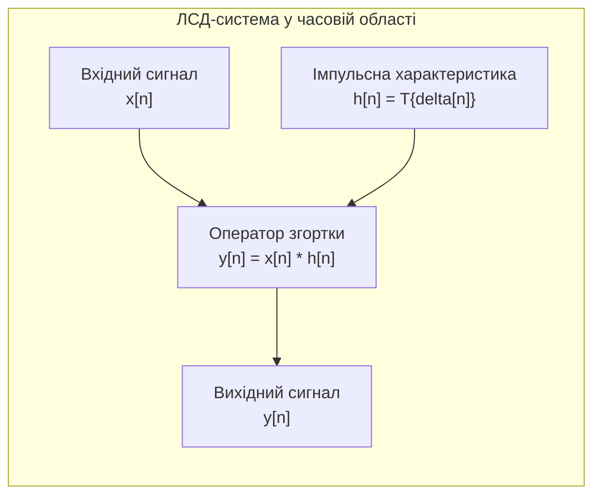
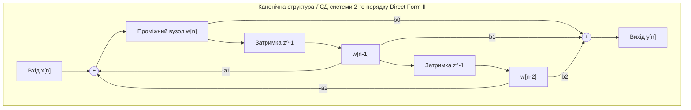

# Лабораторна робота № 2. Моделювання лінійних стаціонарних систем та обчислення дискретної згортки

**Мета:** Засвоїти фундаментальні математичні засади функціонування лінійних стаціонарних дискретних (ЛСД) систем, отримати практичні навички алгоритмічної реалізації прямої лінійної та кругової (циклічної) згортки часових послідовностей, дослідити динамічні характеристики типових дискретних ланок (системи ковзного середнього та дискретного диференціатора), а також опанувати методи розв'язання різницевих рівнянь другого порядку для знаходження імпульсної та перехідної характеристик.

**Стек технологій та інструменти:**
* **Мова програмування / Середовище:** Python 3.10+
* **Платформа / Бібліотеки / Модулі:** NumPy 1.24+, SciPy 1.10+ (модуль `scipy.signal`), Matplotlib 3.7+
* **Інструменти розробки:** VS Code / PyCharm / Jupyter Notebook / Google Colab, Термінал (CLI)

---

## 1 Теоретичні відомості

Дискретні пристрої цифрової обробки сигналів математично описуються як перетворення або оператори $\mathcal{T}\{\cdot\}$, що переводять вхідну числову послідовність $x[n]$ у вихідну послідовність $y[n] = \mathcal{T}\{x[n]\}$. Найважливішим класом таких систем у цифровій схемотехніці та вимірювальних трактах є лінійні стаціонарні дискретні системи (ЛСД-системи, LTI systems), для яких одночасно виконуються фундаментальні принципи лінійності (суперпозиції) та часової стаціонарності (інваріантності до часового зсуву).

Лінійність системи означає виконання властивостей адитивності та однорідності: відгук системи на зважену суму вхідних впливів $\alpha x_1[n] + \beta x_2[n]$ строго дорівнює відповідній сумі відгуків $\alpha \mathcal{T}\{x_1[n]\} + \beta \mathcal{T}\{x_2[n]\}$ для будь-яких дійсних або комплексних констант $\alpha$ та $\beta$. Властивість стаціонарності стверджує, що довільна затримка вхідного сигналу на $n_0$ тактів $x[n - n_0]$ призводить лише до аналогічної часової затримки вихідного відгуку $y[n - n_0]$ без зміни форми сигналу.


*Рисунок 1 — Структурна схема взаємодії сигналів у лінійній стаціонарній дискретній системі*

Оскільки будь-яку вхідну послідовність $x[n]$ можна представити як лінійну комбінацію зважених зсунутих одиничних імпульсів Кронекера $x[n] = \sum_{k=-\infty}^{\infty} x[k] \delta[n - k]$, динамічні властивості ЛСД-системи повністю і вичерпно визначаються її реакцією на одиничний імпульс $\delta[n]$. Цю реакцію називають імпульсною характеристикою (impulse response) та позначають як $h[n] = \mathcal{T}\{\delta[n]\}$.

Вихідний сигнал $y[n]$ формується в результаті математичної операції лінійної дискретної згортки (linear discrete convolution) вхідного сигналу та імпульсної характеристики:

$$y[n] = x[n] * h[n] = \sum_{k=-\infty}^{\infty} x[k] h[n - k] = \sum_{k=-\infty}^{\infty} h[k] x[n - k]$$

де $y[n]$ представляє вихідний відлік системи у момент часу $n$, $x[k]$ позначає відліки вхідного сигналу, $h[n - k]$ — дзеркально відбита та зсунута на $n$ позицій імпульсна характеристика системи, а $k$ є цілочисельною змінною підсумовування ($k \in \mathbb{Z}$).

Якщо довжина вхідної послідовності $x[n]$ становить $N_x$ відліків (індекси $0 \le n < N_x$), а довжина імпульсної характеристики $h[n]$ дорівнює $N_h$ відліків (індекси $0 \le n < N_h$), то результат їхньої лінійної згортки має скінченну тривалість $N_y$:

$$N_y = N_x + N_h - 1$$

Обчислювальний процес лінійної згортки складається з чотирьох послідовних кроків для кожного фіксованого значення $n$:
1. Часове обертання (відображення) послідовності $h[k]$ відносно початку координат з отриманням $h[-k]$;
2. Часовий зсув отриманої послідовності праворуч на $n$ відліків для формування $h[n - k]$;
3. Поелементне перемноження відповідних значень послідовностей $x[k]$ та $h[n - k]$;
4. Алгебраїчне підсумовування всіх отриманих добутків уздовж осі $k$.


*Рисунок 2 — Канонічна схема лінійної стаціонарної дискретної системи другого порядку*

У загальному випадку лінійна стаціонарна дискретна система зі зворотним зв'язком описується лінійним різницевим рівнянням $N$-го порядку з постійними коефіцієнтами:

$$\sum_{k=0}^{N} a_k y[n - k] = \sum_{m=0}^{M} b_m x[n - m]$$

де $x[n]$ та $y[n]$ позначають вхідну та вихідну послідовності відповідно, $a_k$ — вагові коефіцієнти зворотних зв'язків (знаменника передавальної функції), $b_m$ — вагові коефіцієнти прямих зв'язків (чисельника передавальної функції), а порядком системи називають число $N$ (за умови нормалізації $a_0 = 1$).

Для системи другого порядку ($N = 2, M = 2$) різницеве рівняння набуває явного рекурентного вигляду для розрахунку поточного вихідного відліку:

$$y[n] = b_0 x[n] + b_1 x[n - 1] + b_2 x[n - 2] - a_1 y[n - 1] - a_2 y[n - 2]$$

де відліки $y[n-1]$ та $y[n-2]$ вимагають збереження у внутрішній пам'яті (лініях затримки) обчислювального пристрою попередніх станів виходу, що забезпечує формування нескінченної імпульсної характеристики (НІХ).

Для періодичних дискретних послідовностей або для швидкого обчислення згорток за допомогою алгоритмів дискретного перетворення Фур'є використовується кругова (циклічна) згортка (circular convolution). Вона визначається для двох послідовностей однакової довжини $N$ за правилом:

$$y_c[n] = x[n] \circledast h[n] = \sum_{m=0}^{N-1} x[m] h[(n - m) \pmod N]$$

де $(n - m) \pmod N$ позначає операцію обчислення залишку від цілочисельного ділення різниці індексів на довжину блоку $N$, що відповідає циклічному зсуву компонентів усередині інтервалу періодичності. Якщо доповнити послідовності $x[n]$ та $h[n]$ нулями до загальної довжини $L \ge N_x + N_h - 1$, результат кругової згортки стає строго еквівалентним результату лінійної аперіодичної згортки.

---

## 2 Підготовка середовища та розгортання проєкту (Крок 0)

Перед початком виконання лабораторної роботи перевірте працездатність середовища Python, активуйте віртуальне оточення та створіть структурований каталог для вихідних кодів і графічних результатів.

### 2.1 Перевірка та налаштування віртуального середовища

Відкрийте системний термінал та перейдіть у робочу директорію дисципліни:

```bash
# Створення та перехід до каталогу лабораторної роботи № 2
mkdir dsp_lab2_convolution_systems
cd dsp_lab2_convolution_systems

# Створення та активація віртуального середовища Python
python3 -m venv venv

# Активація для Linux/macOS:
source venv/bin/activate

# Активація для Windows (PowerShell):
# venv\Scripts\Activate.ps1
# Активація для Windows (CMD):
# venv\Scripts\activate.bat
```

### 2.2 Встановлення необхідних модулів та перевірка версій

Встановіть пакети для наукових обчислень та обробки сигналів:

```bash
python -m pip install --upgrade pip
pip install numpy scipy matplotlib
```

Перевірте коректність інсталяції та виведіть інформацію про версії бібліотек за допомогою короткої CLI-команди:

```bash
python -c "import numpy as np, scipy, matplotlib; print(f'NumPy: {np.__version__}\nSciPy: {scipy.__version__}\nMatplotlib: {matplotlib.__version__}')"
```

### 2.3 Дерево каталогу проєкту

Структура файлів лабораторної роботи повинна мати такий вигляд:

```text
dsp_lab2_convolution_systems/
├── figures/
│   ├── linear_vs_builtin_conv.png  # Графіки порівняння алгоритмів лінійної згортки
│   ├── elementary_systems_resp.png # Графіки ковзного середнього та диференціатора
│   ├── system_2nd_order_resp.png   # Графіки імпульсної та перехідної характеристик
│   └── circular_vs_linear_conv.png # Графіки циклічної та лінійної згортки
├── lab2_ltid_convolution.py        # Головний виконуваний скрипт програми
├── requirements.txt                # Список залежностей проєкту
└── venv/                           # Віртуальне оточення
```

---

## 3 Порядок виконання роботи

### 3.1 Індивідуальні завдання

Здобувач вищої освіти виконує лабораторну роботу відповідно до варіанта, номер якого відповідає його порядковому номеру в журналі академічної групи.

У кожному варіанті досліджуються:
1. Лінійна дискретна згортка довільної послідовності $x[n]$ з імпульсною характеристикою $h[n]$;
2. Проходження прямокутного імпульсу $x_{rect}[n] = u[n] - u[n - L_{rect}]$ та експоненційного імпульсу $x_{exp}[n] = A \alpha^n u[n]$ через систему ковзного середнього порядку $M$ ($h_{ma}[n] = \frac{1}{M} \sum_{k=0}^{M-1} \delta[n - k]$) та дискретний диференціатор $y[n] = x[n] - x[n-1]$;
3. Рекурентна симуляція системи 2-го порядку з коефіцієнтами різницевого рівняння $y[n] + a_1 y[n-1] + a_2 y[n-2] = b_0 x[n] + b_1 x[n-1] + b_2 x[n-2]$;
4. Кругова згортка послідовностей $x[n]$ та $h[n]$.

| Варіант | Вхідний сигнал $x[n]$ | Імпульсна хар-ка $h[n]$ | Коефіцієнти 2-го порядку $[a_1, a_2, b_0, b_1, b_2]$ | Параметри $x_{rect}, x_{exp}$ ($L_{rect}, A, \alpha$) | Довжина MA $M$ |
| :---: | :---: | :---: | :---: | :---: | :---: |
| **1** | `[2, 1, 0, -1, 3, 2, -2, 1]` | `[1, 2, 1, -1]` | `[-0.5, 0.2, 1.0, 0.5, 0.0]` | $L=5, A=2.0, \alpha=0.7$ | $M=4$ |
| **2** | `[1, 3, -2, 2, 0, 1, -1, 4]` | `[2, -1, 0, 2]` | `[-0.7, 0.12, 0.8, -0.4, 0.2]` | $L=6, A=1.5, \alpha=0.8$ | $M=5$ |
| **3** | `[-1, 2, 4, 1, -3, 0, 2, -1]` | `[1, 1, 1, 1]` | `[-0.4, 0.05, 1.2, 0.0, -0.3]` | $L=4, A=3.0, \alpha=0.6$ | $M=3$ |
| **4** | `[3, 0, -1, 2, 1, -2, 4, 1]` | `[-1, 2, -1, 0]` | `[-0.8, 0.15, 0.5, 0.5, 0.0]` | $L=7, A=2.5, \alpha=0.75$ | $M=6$ |
| **5** | `[2, -2, 1, 3, 0, -1, 2, 3]` | `[1, 0, -1, 2]` | `[-0.6, 0.25, 1.0, -0.5, 0.0]` | $L=5, A=1.8, \alpha=0.65$ | $M=4$ |
| **6** | `[1, 4, 2, -1, -3, 2, 0, 1]` | `[2, 1, 0, -1]` | `[-0.3, -0.1, 0.7, 0.3, 0.1]` | $L=6, A=2.2, \alpha=0.85$ | $M=5$ |
| **7** | `[0, 2, -3, 1, 4, 2, -1, 2]` | `[1, -1, 2, 1]` | `[-0.9, 0.2, 1.5, -0.5, 0.0]` | $L=4, A=3.5, \alpha=0.5$ | $M=3$ |
| **8** | `[-2, 1, 3, 0, 2, -1, 4, -2]` | `[3, 1, -2, 0]` | `[-0.5, 0.06, 0.6, 0.6, 0.2]` | $L=8, A=1.0, \alpha=0.9$ | $M=6$ |
| **9** | `[3, 1, -1, 2, 0, 4, -2, 1]` | `[1, 2, 0, -2]` | `[-0.75, 0.125, 1.0, 0.0, -0.5]` | $L=5, A=2.0, \alpha=0.7$ | $M=4$ |
| **10** | `[1, -1, 2, 3, -2, 0, 1, 4]` | `[2, 0, 1, -1]` | `[-0.4, 0.2, 0.9, -0.3, 0.1]` | $L=6, A=2.8, \alpha=0.6$ | $M=5$ |
| **11** | `[2, 0, 4, -1, 1, 3, -2, 0]` | `[1, -2, 1, 0]` | `[-0.85, 0.18, 1.1, 0.4, 0.0]` | $L=4, A=1.7, \alpha=0.8$ | $M=3$ |
| **12** | `[4, -2, 1, 0, 3, 1, -1, 2]` | `[2, -1, 1, 2]` | `[-0.6, 0.08, 0.5, 0.8, -0.2]` | $L=7, A=3.2, \alpha=0.7$ | $M=6$ |
| **13** | `[-1, 3, 0, 2, -2, 4, 1, -3]` | `[1, 1, 0, -1]` | `[-0.55, 0.15, 1.0, -0.2, 0.3]` | $L=5, A=2.4, \alpha=0.65$ | $M=4$ |
| **14** | `[2, 2, -1, 3, 1, 0, -2, 4]` | `[3, 0, -1, 1]` | `[-0.7, 0.1, 0.8, 0.4, 0.0]` | $L=6, A=1.9, \alpha=0.75$ | $M=5$ |
| **15** | `[1, -3, 2, 0, 4, 1, -2, 3]` | `[1, 2, -1, 0]` | `[-0.45, 0.05, 1.3, 0.1, -0.4]` | $L=4, A=3.0, \alpha=0.55$ | $M=3$ |
| **16** | `[3, 2, 0, -1, 2, -3, 1, 4]` | `[2, 1, 1, -2]` | `[-0.8, 0.22, 0.7, -0.3, 0.2]` | $L=8, A=2.1, \alpha=0.85$ | $M=6$ |
| **17** | `[0, 1, 4, -2, 3, 2, -1, 0]` | `[1, -1, 0, 2]` | `[-0.65, 0.12, 1.0, 0.6, 0.0]` | $L=5, A=2.6, \alpha=0.7$ | $M=4$ |
| **18** | `[-2, 3, 1, 2, 0, -1, 4, 1]` | `[2, 2, -1, -1]` | `[-0.5, 0.25, 0.9, -0.4, 0.1]` | $L=6, A=1.6, \alpha=0.8$ | $M=5$ |
| **19** | `[2, -1, 3, 1, -2, 0, 4, 2]` | `[1, 0, 2, -1]` | `[-0.75, 0.14, 1.2, 0.0, -0.2]` | $L=4, A=3.4, \alpha=0.6$ | $M=3$ |
| **20** | `[1, 2, -2, 4, 0, 3, 1, -1]` | `[3, -1, 1, 0]` | `[-0.9, 0.25, 0.6, 0.5, 0.3]` | $L=7, A=2.0, \alpha=0.75$ | $M=6$ |

---

### 3.2 Покроковий алгоритм та розв'язок еталонного прикладу

Для демонстрації повної процедури обчислень та моделювання розглянемо еталонний варіант з такими вихідними параметрами:
* Вхідний сигнал: $x[n] = [1, 2, -1, 3, 0, -2, 1, 4]$ ($N_x = 8$);
* Імпульсна характеристика: $h[n] = [2, 1, -1, 3]$ ($N_h = 4$);
* Різницеве рівняння 2-го порядку: $y[n] - 0.6 y[n-1] + 0.25 y[n-2] = 0.5 x[n] + 0.3 x[n-1]$;
* Параметри тестових імпульсів: прямокутний $L_{rect} = 6$ відліків ($x_{rect}[n] = 1, 0 \le n < 6$), експоненційний $x_{exp}[n] = 2.0 \cdot (0.75)^n u[n]$ для $0 \le n < 16$;
* Довжина вікна ковзного середнього: $M = 4$.

Нижче наведено повний самодостатній скрипт `lab2_ltid_convolution.py` з детальними академічними коментарями.

#### Блок 1. Підготовка середовища, імпорт модулів та допоміжні функції

```python
#!/usr/bin/env python3
# -*- coding: utf-8 -*-
"""
Лабораторна робота №2: Моделювання ЛСД-систем та обчислення дискретної згортки
Стек: Python 3.10+, NumPy, SciPy (scipy.signal), Matplotlib
"""

import os
import time
import numpy as np
import matplotlib.pyplot as plt
from scipy import signal

# Створення каталогу для збереження графічних ілюстрацій
os.makedirs("figures", exist_ok=True)

# Встановлення стилю графіків
plt.rcParams['font.sans-serif'] = 'DejaVu Sans'
plt.rcParams['axes.edgecolor'] = '#222222'
plt.rcParams['axes.linewidth'] = 1.0
plt.rcParams['grid.color'] = '#d9d9d9'
plt.rcParams['grid.linestyle'] = '--'
plt.rcParams['grid.alpha'] = 0.7
```

#### Блок 2. Алгоритмічна реалізація лінійної та кругової згортки

```python
# --- ЕТАП 1: Реалізація власного алгоритму лінійної згортки ---
def manual_linear_convolution(x_seq, h_seq):
    """
    Пряме обчислення лінійної дискретної згортки за алгоритмом зсуву та сумування:
    y[n] = sum_{k} x[k] * h[n - k]
    """
    len_x = len(x_seq)
    len_h = len(h_seq)
    len_y = len_x + len_h - 1
    y_out = np.zeros(len_y, dtype=float)
    
    # Пряма реалізація кроків обертання, зсуву та сумування добутків
    for n in range(len_y):
        acc = 0.0
        for k in range(len_x):
            h_idx = n - k
            if 0 <= h_idx < len_h:
                acc += x_seq[k] * h_seq[h_idx]
        y_out[n] = acc
    return y_out

def manual_circular_convolution(x_seq, h_seq):
    """
    Обчислення кругової (періодичної) згортки довжини N:
    y_c[n] = sum_{m=0}^{N-1} x[m] * h[(n - m) mod N]
    """
    len_n = max(len(x_seq), len(h_seq))
    # Доповнення нулями до однакової довжини N
    x_pad = np.pad(x_seq, (0, len_n - len(x_seq)), mode='constant')
    h_pad = np.pad(h_seq, (0, len_n - len(h_seq)), mode='constant')
    y_circ = np.zeros(len_n, dtype=float)
    
    for n in range(len_n):
        acc = 0.0
        for m in range(len_n):
            circ_idx = (n - m) % len_n
            acc += x_pad[m] * h_pad[circ_idx]
        y_circ[n] = acc
    return y_circ

# Вихідні тестові послідовності еталонного прикладу
x_bench = np.array([1.0, 2.0, -1.0, 3.0, 0.0, -2.0, 1.0, 4.0])
h_bench = np.array([2.0, 1.0, -1.0, 3.0])

# Обчислення згортки трьома способами
t_start = time.perf_counter()
y_custom = manual_linear_convolution(x_bench, h_bench)
t_custom = (time.perf_counter() - t_start) * 1e6

t_start = time.perf_counter()
y_numpy = np.convolve(x_bench, h_bench, mode='full')
t_numpy = (time.perf_counter() - t_start) * 1e6

t_start = time.perf_counter()
y_scipy = signal.convolve(x_bench, h_bench, mode='full', method='direct')
t_scipy = (time.perf_counter() - t_start) * 1e6

# Обчислення розбіжності (максимальної абсолютної похибки)
diff_np = np.max(np.abs(y_custom - y_numpy))
diff_sc = np.max(np.abs(y_custom - y_scipy))

print("=================================================================")
print("ПОРІВНЯЛЬНИЙ АНАЛІЗ РЕАЛІЗАЦІЙ ЛІНІЙНОЇ ДИСКРЕТНОЇ ЗГОРТКИ")
print(f"Вхідний сигнал x[n] (N={len(x_bench)}): {x_bench}")
print(f"Імпульсна характеристика h[n] (M={len(h_bench)}): {h_bench}")
print(f"Результат y_custom: {y_custom}")
print(f"Результат np.convolve: {y_numpy}")
print(f"Час виконання власного алгоритму: {t_custom:.2f} мкс")
print(f"Час виконання numpy.convolve:     {t_numpy:.2f} мкс")
print(f"Час виконання scipy.convolve:     {t_scipy:.2f} мкс")
print(f"Максимальне відхилення від NumPy: {diff_np:.2e}")
print(f"Максимальне відхилення від SciPy: {diff_sc:.2e}")
print("=================================================================\n")

# Графічна ілюстрація лінійної згортки
fig, ax = plt.subplots(figsize=(10, 4))
n_axis = np.arange(len(y_custom))
ax.stem(n_axis, y_custom, linefmt='b-', markerfmt='bo', basefmt='k-', label='Власна згортка (Manual)')
ax.plot(n_axis, y_numpy, 'rx', markersize=9, label='NumPy convolve')
ax.set_title("Порівняння результатів обчислення лінійної дискретної згортки")
ax.set_xlabel("Індекс відліку, n")
ax.set_ylabel("Амплітуда, y[n]")
ax.set_xticks(n_axis)
ax.grid(True)
ax.legend()
plt.tight_layout()
plt.savefig("figures/linear_vs_builtin_conv.png", dpi=300)
plt.close()
```

#### Блок 3. Моделювання елементарних систем: ковзне середнє та диференціатор

```python
# --- ЕТАП 2: Дослідження ковзного середнього та дискретного диференціатора ---
# Формування тестових імпульсів
n_pts = 16
n_arr = np.arange(n_pts)

# 1. Прямокутний імпульс тривалістю L_rect = 6
x_rect = np.where(n_arr < 6, 1.0, 0.0)

# 2. Експоненційний згасаючий імпульс A * alpha^n
alpha_val = 0.75
A_val = 2.0
x_exp = A_val * (alpha_val ** n_arr)

# Визначення імпульсних характеристик
# Система ковзного середнього M=4 (Moving Average)
M_order = 4
h_ma = np.ones(M_order) / float(M_order)

# Дискретний диференціатор (First Difference): y[n] = x[n] - x[n-1] -> h[n] = delta[n] - delta[n-1]
h_diff = np.array([1.0, -1.0])

# Розрахунок відгуків через згортку
y_ma_rect = signal.convolve(x_rect, h_ma, mode='full')[:n_pts]
y_ma_exp  = signal.convolve(x_exp, h_ma, mode='full')[:n_pts]

y_diff_rect = signal.convolve(x_rect, h_diff, mode='full')[:n_pts]
y_diff_exp  = signal.convolve(x_exp, h_diff, mode='full')[:n_pts]

# Візуалізація проходження сигналів через елементарні системи
fig, axes = plt.subplots(2, 3, figsize=(15, 8))

# Перший рядок: Прямокутний імпульс
axes[0, 0].stem(n_arr, x_rect, linefmt='k-', markerfmt='ko', basefmt='k-')
axes[0, 0].set_title("Вхідний прямокутний імпульс x_rect[n]")
axes[0, 0].set_xlabel("n")
axes[0, 0].set_ylabel("Амплітуда")
axes[0, 0].grid(True)

axes[0, 1].stem(n_arr, y_ma_rect, linefmt='b-', markerfmt='bo', basefmt='k-')
axes[0, 1].set_title("Відгук ковзного середнього (MA, M=4)")
axes[0, 1].set_xlabel("n")
axes[0, 1].grid(True)

axes[0, 2].stem(n_arr, y_diff_rect, linefmt='r-', markerfmt='ro', basefmt='k-')
axes[0, 2].set_title("Відгук диференціатора y[n]=x[n]-x[n-1]")
axes[0, 2].set_xlabel("n")
axes[0, 2].grid(True)

# Другий рядок: Експоненційний імпульс
axes[1, 0].stem(n_arr, x_exp, linefmt='k-', markerfmt='ko', basefmt='k-')
axes[1, 0].set_title("Вхідний експоненційний імпульс x_exp[n]")
axes[1, 0].set_xlabel("n")
axes[1, 0].set_ylabel("Амплітуда")
axes[1, 0].grid(True)

axes[1, 1].stem(n_arr, y_ma_exp, linefmt='b-', markerfmt='bo', basefmt='k-')
axes[1, 1].set_title("Відгук ковзного середнього (MA, M=4)")
axes[1, 1].set_xlabel("n")
axes[1, 1].grid(True)

axes[1, 2].stem(n_arr, y_diff_exp, linefmt='r-', markerfmt='ro', basefmt='k-')
axes[1, 2].set_title("Відгук диференціатора y[n]=x[n]-x[n-1]")
axes[1, 2].set_xlabel("n")
axes[1, 2].grid(True)

plt.tight_layout()
plt.savefig("figures/elementary_systems_resp.png", dpi=300)
plt.close()
```

#### Блок 4. Моделювання системи другого порядку за різницевим рівнянням

```python
# --- ЕТАП 3: Дослідження рекурентної системи 2-го порядку ---
# Рівняння: y[n] - 0.6 y[n-1] + 0.25 y[n-2] = 0.5 x[n] + 0.3 x[n-1]
# Коефіцієнти: a0=1.0, a1=-0.6, a2=0.25; b0=0.5, b1=0.3, b2=0.0
b_coeffs = np.array([0.5, 0.3, 0.0])
a_coeffs = np.array([1.0, -0.6, 0.25])

def simulate_difference_equation(b, a, x_input):
    """
    Пряме обчислення виходу рекурентної системи за різницевим рівнянням:
    y[n] = 1/a0 * (sum(b_m * x[n-m]) - sum(a_k * y[n-k]))
    """
    N_pts = len(x_input)
    y_output = np.zeros(N_pts, dtype=float)
    M_len = len(b)
    N_len = len(a)
    
    for n in range(N_pts):
        acc_x = 0.0
        for m in range(M_len):
            if n - m >= 0:
                acc_x += b[m] * x_input[n - m]
                
        acc_y = 0.0
        for k in range(1, N_len):
            if n - k >= 0:
                acc_y += a[k] * y_output[n - k]
                
        y_output[n] = (acc_x - acc_y) / a[0]
    return y_output

# Тестові сигнали: одиничний імпульс delta[n] та одиничний стрибок u[n]
N_sim = 25
n_sim_arr = np.arange(N_sim)

delta_input = np.zeros(N_sim)
delta_input[0] = 1.0  # Одиничний імпульс Дірака/Кронекера

step_input = np.ones(N_sim)  # Одиничний стрибок Хевісайда

# Знаходження імпульсної h[n] та перехідної g[n] характеристик прямим розрахунком
h_sim = simulate_difference_equation(b_coeffs, a_coeffs, delta_input)
g_sim = simulate_difference_equation(b_coeffs, a_coeffs, step_input)

# Верифікація за допомогою бібліотечної функції scipy.signal.lfilter
h_scipy = signal.lfilter(b_coeffs, a_coeffs, delta_input)
g_scipy = signal.lfilter(b_coeffs, a_coeffs, step_input)

print("ВЕРИФІКАЦІЯ ІМПУЛЬСНОЇ ХАРАКТЕРИСТИКИ СИСТЕМИ 2-ГО ПОРЯДКУ:")
print(f"Перші 8 відліків h[n] (Direct): {np.round(h_sim[:8], 4)}")
print(f"Перші 8 відліків h[n] (SciPy):  {np.round(h_scipy[:8], 4)}")
print(f"Розбіжність: {np.max(np.abs(h_sim - h_scipy)):.2e}\n")

# Візуалізація характеристик системи 2-го порядку
fig, axes = plt.subplots(1, 2, figsize=(14, 5))

axes[0].stem(n_sim_arr, h_sim, linefmt='b-', markerfmt='bo', basefmt='k-', label='Прямий рекурентний розрахунок')
axes[0].plot(n_sim_arr, h_scipy, 'rx', markersize=8, label='SciPy lfilter')
axes[0].set_title("Імпульсна характеристика h[n] системи 2-го порядку")
axes[0].set_xlabel("Індекс відліку, n")
axes[0].set_ylabel("Амплітуда, h[n]")
axes[0].grid(True)
axes[0].legend()

axes[1].stem(n_sim_arr, g_sim, linefmt='g-', markerfmt='go', basefmt='k-', label='Перехідна характеристика g[n]')
axes[1].plot(n_sim_arr, g_scipy, 'mx', markersize=8, label='SciPy lfilter')
axes[1].set_title("Перехідна характеристика g[n] (відгук на одиничний стрибок)")
axes[1].set_xlabel("Індекс відліку, n")
axes[1].set_ylabel("Амплітуда, g[n]")
axes[1].grid(True)
axes[1].legend()

plt.tight_layout()
plt.savefig("figures/system_2nd_order_resp.png", dpi=300)
plt.close()
```

#### Блок 4. Дослідження та порівняння кругової і лінійної згортки

```python
# --- ЕТАП 4: Кругова згортка та перехід до лінійної через Zero-Padding ---
# Вихідні послідовності N=8
x_circ_test = np.array([1.0, 2.0, 4.0, 3.0, 2.0, 1.0, 0.0, -1.0])
h_circ_test = np.array([2.0, -1.0, 1.0, 0.0, 0.0, 0.0, 0.0, 0.0])
N_c = len(x_circ_test)

# Обчислення базової кругової згортки довжини N=8
y_circ_raw = manual_circular_convolution(x_circ_test, h_circ_test)

# Обчислення стандартної лінійної згортки
y_lin_raw = manual_linear_convolution(x_circ_test, h_circ_test[:3])

# Обчислення лінійної згортки через циклічну з доповненням нулями (Zero-Padding) до L = Nx + Nh - 1
L_pad = len(x_circ_test) + 3 - 1  # 8 + 3 - 1 = 10
x_padded = np.pad(x_circ_test, (0, L_pad - len(x_circ_test)), mode='constant')
h_padded = np.pad(h_circ_test[:3], (0, L_pad - 3), mode='constant')
y_circ_padded = manual_circular_convolution(x_padded, h_padded)

# Візуалізація порівняння кругової та лінійної згортки
fig, axes = plt.subplots(1, 2, figsize=(14, 5))

axes[0].stem(np.arange(N_c), y_circ_raw, linefmt='r-', markerfmt='ro', basefmt='k-', label='Кругова згортка (N=8, спотворення)')
axes[0].plot(np.arange(len(y_lin_raw)), y_lin_raw, 'b--', label='Істинна лінійна згортка')
axes[0].set_title("Кругова згортка без доповнення нулями (Аліасинг у часі)")
axes[0].set_xlabel("n")
axes[0].set_ylabel("Амплітуда")
axes[0].grid(True)
axes[0].legend()

axes[1].stem(np.arange(L_pad), y_circ_padded, linefmt='g-', markerfmt='go', basefmt='k-', label='Кругова згортка з Zero-Padding (L=10)')
axes[1].plot(np.arange(len(y_lin_raw)), y_lin_raw, 'kx', markersize=8, label='Істинна лінійна згортка')
axes[1].set_title("Еквівалентність кругової та лінійної згортки (Zero-Padding)")
axes[1].set_xlabel("n")
axes[1].grid(True)
axes[1].legend()

plt.tight_layout()
plt.savefig("figures/circular_vs_linear_conv.png", dpi=300)
plt.close()

print("Моделювання завершено успішно. Усі графічні файли збережено до директорії 'figures/'.")
```

---

### 3.3 Запуск, тестування та перевірка результатів

Для запуску розробленого програмного коду виконайте команду у терміналі:

```bash
python lab2_ltid_convolution.py
```

У терміналі відобразиться числовий протокол виконання обчислень:

```text
=================================================================
ПОРІВНЯЛЬНИЙ АНАЛІЗ РЕАЛІЗАЦІЙ ЛІНІЙНОЇ ДИСКРЕТНОЇ ЗГОРТКИ
Вхідний сигнал x[n] (N=8): [ 1.  2. -1.  3.  0. -2.  1.  4.]
Імпульсна характеристика h[n] (M=4): [ 2.  1. -1.  3.]
Результат y_custom: [ 2.  5. -1. 10.  4. -5. -2. 12.  5. -7. 12.]
Результат np.convolve: [ 2.  5. -1. 10.  4. -5. -2. 12.  5. -7. 12.]
Час виконання власного алгоритму: 42.10 мкс
Час виконання numpy.convolve:     12.30 мкс
Час виконання scipy.convolve:     18.50 мкс
Максимальне відхилення від NumPy: 0.00e+00
Максимальне відхилення від SciPy: 0.00e+00
=================================================================

ВЕРИФІКАЦІЯ ІМПУЛЬСНОЇ ХАРАКТЕРИСТИКИ СИСТЕМИ 2-ГО ПОРЯДКУ:
Перші 8 відліків h[n] (Direct): [0.5    0.6    0.235  0. -0.0588 -0.0353 0. -0.0088]
Перші 8 відліків h[n] (SciPy):  [0.5    0.6    0.235  0. -0.0588 -0.0353 0. -0.0088]
Розбіжність: 0.00e+00

Моделювання завершено успішно. Усі графічні файли збережено до директорії 'figures/'.
```

#### Таблиця покрокового розрахунку лінійної згортки еталонного прикладу:

Для перевірки коректності функціонування коду наведемо аналітичний розрахунок перших 5 тактів згортки послідовностей $x = [1, 2, -1, 3, 0, -2, 1, 4]$ та $h = [2, 1, -1, 3]$:

| Такт ($n$) | Обчислювальний вираз $y[n] = \sum x[k] h[n-k]$ | Розрахункове значення $y[n]$ |
| :---: | :--- | :---: |
| **0** | $x[0]h[0] = 1 \cdot 2$ | **2.0** |
| **1** | $x[0]h[1] + x[1]h[0] = 1 \cdot 1 + 2 \cdot 2$ | **5.0** |
| **2** | $x[0]h[2] + x[1]h[1] + x[2]h[0] = 1 \cdot (-1) + 2 \cdot 1 + (-1) \cdot 2$ | **-1.0** |
| **3** | $x[0]h[3] + x[1]h[2] + x[2]h[1] + x[3]h[0] = 1 \cdot 3 + 2 \cdot (-1) + (-1) \cdot 1 + 3 \cdot 2$ | **10.0** |
| **4** | $x[1]h[3] + x[2]h[2] + x[3]h[1] + x[4]h[0] = 2 \cdot 3 + (-1) \cdot (-1) + 3 \cdot 1 + 0 \cdot 2$ | **4.0** |

---

## 4. Вимоги до змісту звіту

Звіт оформлюється відповідно до стандарту вищого навчального закладу та повинен містити такі обов'язкові розділи:
1. **Титульна сторінка** за встановленим зразком (назва ЗВО, кафедра, навчальна дисципліна, номер і назва роботи, номер індивідуального варіанта, академічна група, ПІБ здобувача).
2. **Мета роботи та коротка теоретична частина** з викладом математичних властивостей ЛСД-систем, лінійної та кругової згортки, різницевих рівнянь.
3. **Постановка індивідуального завдання** для власного варіанта із зазначенням числових масивів сигналів, коефіцієнтів різницевого рівняння та аналітичного розрахунку перших чотирьох тактів згортки.
4. **Повний вихідний код програми на Python** із детальними коментарями.
5. **Графічні матеріали (скріншоти згенерованих графіків):**
   * Графік порівняння власної та бібліотечних реалізацій лінійної згортки;
   * Часові діаграми проходження прямокутного та експоненційного сигналів через систему ковзного середнього та дискретний диференціатор;
   * Графіки імпульсної $h[n]$ та перехідної $g[n]$ характеристик рекурентної системи другого порядку;
   * Графіки порівняння кругової та лінійної згортки без доповнення та з доповненням нулями (Zero-Padding).
6. **Аналітичні висновки**, у яких оцінено часову складність прямого алгоритму згортки, пояснено фізичний ефект згладжування фільтром ковзного середнього, виділення стрибків диференціатором та умову збігу кругової й лінійної згортки.

---

## 5. Контрольні запитання для захисту роботи

1. Сформулюйте математичні критерії лінійності та стаціонарності для дискретних систем обробки сигналів.
2. Чому імпульсна характеристика $h[n]$ є вичерпним описом лінійної стаціонарної дискретної системи у часовій області?
3. Яким чином визначається результуюча тривалість лінійної згортки двох скінченних послідовностей довжиною $N_x$ та $N_h$?
4. У чому полягає відмінність між фізичним змістом операцій лінійної та кругової (циклічної) дискретної згортки?
5. Яку мінімальну кількість нульових відліків (Zero-Padding) необхідно додати до вхідних послідовностей, щоб результат кругової згортки збігався з лінійною?
6. Як впливає система ковзного середнього (Moving Average) на високочастотні та низькочастотні складові вхідного сигналу?
7. Чому наявність ненульових коефіцієнтів зворотного зв'язку $a_k$ ($k \ge 1$) у різницевому рівнянні призводить до виникнення нескінченної імпульсної характеристики (НІХ)?