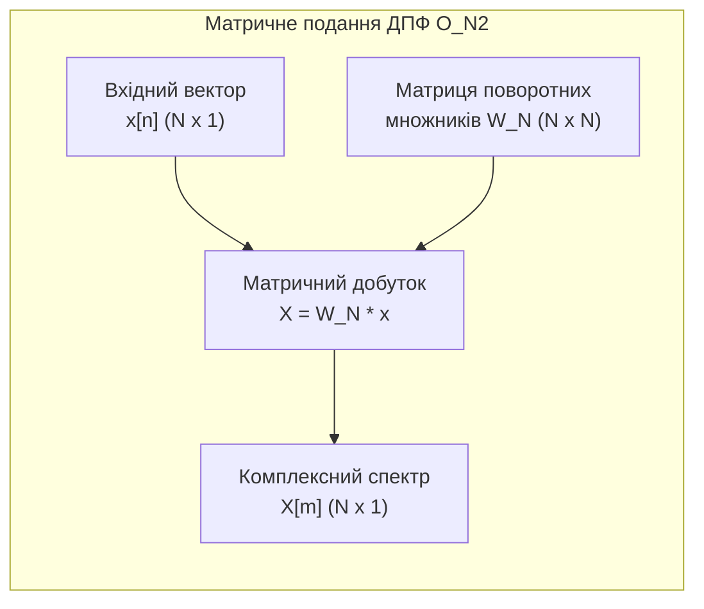
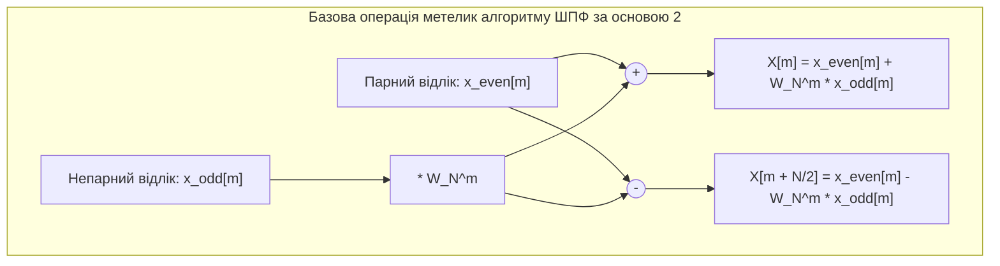
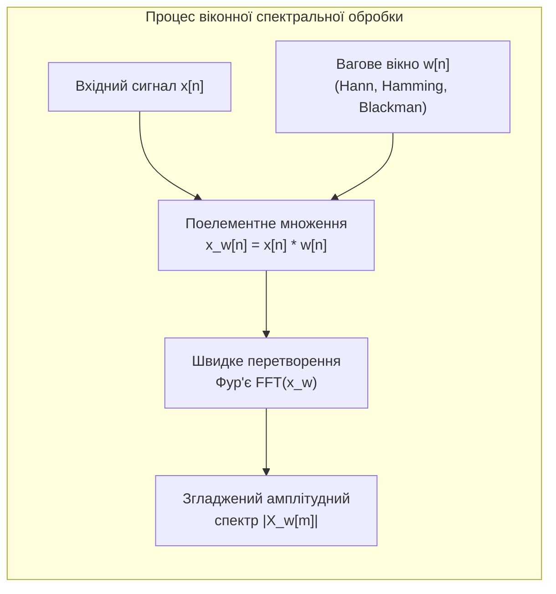

# Лабораторна робота № 3. Спектральний аналіз сигналів за допомогою ДПФ/ШПФ та застосування віконних функцій

**Мета:** Засвоїти теоретичні засади та алгоритми прямого дискретного (ДПФ) та швидкого (ШПФ / FFT) перетворень Фур'є, дослідити обчислювальну складність матричного ДПФ та алгоритму Кулі-Тьюкі, вивчити природу виникнення ефекту розтікання (витоку) спектра при некратності частоти гармонік кроку частотної сітки, а також набути практичних навичок застосування вагових вікон (Хеммінга, Ханна, Блекмана) для підвищення вибірковості та динамічного діапазону спектрального аналізу.

**Стек технологій та інструменти:**
* **Мова програмування / Середовище:** Python 3.10+
* **Платформа / Бібліотеки / Модулі:** NumPy 1.24+ (модуль `numpy.fft`), SciPy 1.10+ (модуль `scipy.signal.windows`), Matplotlib 3.7+
* **Інструменти розробки:** VS Code / PyCharm / Jupyter Notebook / Google Colab, Термінал (CLI)

---

## 1 Теоретичні відомості

Спектральний аналіз у цифровій обробці сигналів базується на поданні дискретної послідовності $x[n]$ довжиною $N$ відліків у вигляді суми комплексних гармонічних коливань з ортогональними базисними частотами. Основним математичним апаратом такого аналізу є Дискретне перетворення Фур'є (ДПФ, Discrete Fourier Transform — DFT).

Пряме ДПФ ставить у відповідність дійсній або комплексній послідовності $x[n]$ ($n = 0, 1, \dots, N-1$) дискретний спектр комплексних амплітуд $X[m]$ ($m = 0, 1, \dots, N-1$):

$$X[m] = \sum_{n=0}^{N-1} x[n] e^{-j \frac{2\pi}{N} m n} = \sum_{n=0}^{N-1} x[n] W_N^{m n}$$

де $X[m]$ позначає комплексний спектральний відлік на $m$-й гармоніці, $x[n]$ — вхідний часовий відлік сигналу, $N$ — загальна кількість точок перетворення (розмір вікна аналізу), $j = \sqrt{-1}$ — уявна одиниця, а $W_N = e^{-j \frac{2\pi}{N}}$ представляє поворотний комплексний множник (twiddle factor).

Обернене дискретне перетворення Фур'є (ОДПФ / IDFT) відновлює вихідну часову послідовність за її комплексним спектром:

$$x[n] = \frac{1}{N} \sum_{m=0}^{N-1} X[m] e^{j \frac{2\pi}{N} m n} = \frac{1}{N} \sum_{m=0}^{N-1} X[m] W_N^{-m n}$$

Кожен спектральний індекс $m$ відповідає фізичній частоті $f_m$, яка визначається кроком частотної роздільної здатності $\Delta f$:

$$f_m = m \cdot \Delta f = m \cdot \frac{f_s}{N} = \frac{m}{T_{obs}}$$

де $f_s$ представляє частоту дискретизації сигналу в герцах ($\text{Гц}$), $\Delta f$ — частотну роздільну здатність сітки в герцах ($\text{Гц}$), а $T_{obs} = N / f_s$ — загальну тривалість вікна спостереження в секундах ($\text{с}$).


*Рисунок 1 — Структура прямого обчислення ДПФ матричним множенням*

При прямому матричному обчисленні ДПФ за формулою $\mathbf{X} = \mathbf{W}_N \mathbf{x}$ обчислювальна складність становить $N^2$ комплексних множень та $N(N - 1)$ комплексних додавань. Алгоритм швидкого перетворення Фур'є (ШПФ, Fast Fourier Transform — FFT) Кулі-Тьюкі з проріджуванням за часом (Decimation in Time — DIT) розбиває вхідну послідовність на парні та непарні підпослідовності, факторизуючи матрицю перетворення на $\log_2 N$ етапів.


*Рисунок 2 — Схема базового обчислювального вузла типу «метелик» алгоритму ШПФ*

Обчислювальна складність алгоритму ШПФ за основою 2 зменшується до величини $\frac{N}{2} \log_2 N$ комплексних множень та $N \log_2 N$ додавань, що забезпечує колосальне прискорення розрахунків (наприклад, для $N = 4096$ алгоритм ШПФ працює приблизно у 340 разів швидше за пряме ДПФ).

Амплітудний $A[m]$ та фазовий $\Phi[m]$ спектри сигналу розраховуються за формулами:

$$A[m] = \begin{cases} \frac{1}{N} |X[0]|, & m = 0 \\ \frac{2}{N} |X[m]| = \frac{2}{N} \sqrt{\text{Re}(X[m])^2 + \text{Im}(X[m])^2}, & 0 < m < \frac{N}{2} \end{cases}$$

$$\Phi[m] = \text{atan2}\left(\text{Im}(X[m]), \text{Re}(X[m])\right)$$

де $\text{Re}(X[m])$ та $\text{Im}(X[m])$ — відповідно дійсна та уявна частини комплексного спектрального коефіцієнта $X[m]$, а функція $\text{atan2}$ повертає кут у радіанах у діапазоні $[-\pi, \pi]$.


*Рисунок 3 — Конвеєр спектральної обробки із застосуванням віконного зважування*

Якщо гармонійна складова сигналу має частоту $f_0$, яка не є точним цілим кратним кроку сітки $\Delta f$ (тобто $f_0 / \Delta f \notin \mathbb{Z}$), то на інтервалі $N$ відліків укладається неціла кількість періодів. Неявне періодичне продовження фрагмента сигналу в алгоритмі ДПФ породжує різкі розриви на краях інтервалу, внаслідок чого виникає ефект розтікання (витоку) спектра (spectral leakage). Енергія сигналу розсіюється по всіх сусідніх частотних бінах, що може повністю замаскувати слабкі корисні гармоніки.

Для зменшення розтікання спектра застосовують множення сигналу на вагове вікно $w[n]$: $x_w[n] = x[n] \cdot w[n]$, значення якого плавно спадають до нуля на краях інтервалу. У частотній області це еквівалентно згортці істинного спектра сигналу зі спектром вікна $W(f)$.

До основних аналітичних віконних функцій належать:
1. Прямокутне вікно (Rectangular):
$$w_{rect}[n] = 1, \quad 0 \le n \le N-1$$
2. Вікно Ханна (Hann):
$$w_{hann}[n] = 0.5 - 0.5 \cos\left(\frac{2\pi n}{N-1}\right), \quad 0 \le n \le N-1$$
3. Вікно Хеммінга (Hamming):
$$w_{hamming}[n] = 0.54 - 0.46 \cos\left(\frac{2\pi n}{N-1}\right), \quad 0 \le n \le N-1$$
4. Вікно Блекмана (Blackman):
$$w_{blackman}[n] = 0.42 - 0.5 \cos\left(\frac{2\pi n}{N-1}\right) + 0.08 \cos\left(\frac{4\pi n}{N-1}\right), \quad 0 \le n \le N-1$$

Вибір типу вікна визначається компромісом між шириною головної пелюстки (що задає частотну вибірковість) та рівнем придушення бічних пелюсток (що визначає динамічний діапазон і здатність виявляти слабкі сигнали поруч із потужними завадами).

---

## 2 Підготовка середовища та розгортання проєкту (Крок 0)

Перед початком обчислень створіть структуру каталогу для лабораторної роботи, активуйте ізольоване віртуальне середовище та встановіть необхідні бібліотеки для швидких матричних обчислень і спектрального моделювання.

### 2.1 Налаштування віртуального оточення

Виконайте у терміналі команди створення каталогу та ініціалізації віртуального середовища:

```bash
# Створення робочого каталогу лабораторної роботи № 3
mkdir dsp_lab3_dft_fft_windows
cd dsp_lab3_dft_fft_windows

# Ініціалізація віртуального середовища Python
python3 -m venv venv

# Активація для Linux/macOS:
source venv/bin/activate

# Активація для Windows (PowerShell):
# venv\Scripts\Activate.ps1
# Активація для Windows (CMD):
# venv\Scripts\activate.bat
```

### 2.2 Встановлення залежностей та верифікація середовища

Оновіть інструмент `pip` та встановіть бібліотеки `numpy`, `scipy` і `matplotlib`:

```bash
python -m pip install --upgrade pip
pip install numpy scipy matplotlib
```

Перевірте коректність встановлення за допомогою короткого тестового скрипту:

```bash
python -c "import numpy as np, scipy.signal.windows, matplotlib.pyplot as plt; print('Усі модулі успішно завантажено!')"
```

### 2.3 Дерево каталогу проєкту

Файлова структура робочої директорії повинна мати такий вигляд:

```text
dsp_lab3_dft_fft_windows/
├── figures/
│   ├── dft_vs_fft_benchmark.png   # Графік порівняння часової складності DFT та FFT
│   ├── harmonic_spectrum.png      # Графіки амплітудного та фазового спектрів
│   ├── spectral_leakage.png       # Графіки ілюстрації ефекту розтікання спектра
│   └── window_functions_comp.png  # Порівняння спектрів вікон та виділення слабкого сигналу
├── lab3_dft_fft_windows.py        # Головний виконуваний скрипт програми
├── requirements.txt               # Зафіксовані версії пакетів
└── venv/                          # Каталог віртуального середовища
```

---

## 3 Порядок виконання роботи

### 3.1 Індивідуальні завдання

Здобувач вищої освіти обирає варіант індивідуального завдання відповідно до свого порядкового номера в академічному журналі групи. Дослідженню підлягає адитивна суміш двох близьких гармонік та випадкового гаусового шуму:

$$s[n] = A_1 \sin\left(2\pi \frac{f_1}{f_s} n + \varphi_1\right) + A_2 \cos\left(2\pi \frac{f_2}{f_s} n + \varphi_2\right) + v[n]$$

де $v[n] \sim \mathcal{N}(0, \sigma_{noise}^2)$ — некорельований нормальний шум з нульовим математичним очікуванням і середньоквадратичним відхиленням $\sigma_{noise}$.

Необхідно провести:
1. Оцінку швидкодії прямого матричного алгоритму ДПФ та бібліотечного ШПФ (`np.fft.fft`) для розмірностей $N \in \{64, 256, 1024, 4096\}$;
2. Обчислення точного амплітудного та фазового спектрів корисного сигналу;
3. Дослідження ефекту витоку спектра при зміні довжини вікна спостереження $N$ (випадки кратної та некратної кількості періодів);
4. Порівняльний аналіз прямокутного, Ханна, Хеммінга та Блекмана вікон для детектування слабкої гармоніки $f_2$ на фоні потужної $f_1$.

| Варіант | $f_s$, Гц | $A_1$, В | $f_1$, Гц | $\varphi_1$, рад | $A_2$, В | $f_2$, Гц | $\varphi_2$, рад | $\sigma_{noise}$, В | Базове $N$ |
| :---: | :---: | :---: | :---: | :---: | :---: | :---: | :---: | :---: | :---: |
| **1** | 1000 | 2.5 | 150.0 | 0 | 0.15 | 168.0 | $\pi/4$ | 0.05 | 256 |
| **2** | 1200 | 3.0 | 200.0 | $\pi/6$ | 0.10 | 225.0 | 0 | 0.04 | 256 |
| **3** | 800 | 1.8 | 110.0 | $\pi/3$ | 0.20 | 126.0 | $\pi/2$ | 0.06 | 512 |
| **4** | 1500 | 2.2 | 240.0 | 0 | 0.12 | 265.0 | $\pi/6$ | 0.05 | 512 |
| **5** | 2000 | 3.5 | 310.0 | $\pi/4$ | 0.18 | 340.0 | 0 | 0.08 | 256 |
| **6** | 1000 | 1.5 | 130.0 | $\pi/2$ | 0.08 | 148.0 | $\pi/3$ | 0.03 | 256 |
| **7** | 1600 | 2.8 | 270.0 | 0 | 0.14 | 298.0 | $\pi/4$ | 0.07 | 512 |
| **8** | 1200 | 2.0 | 180.0 | $\pi/3$ | 0.16 | 204.0 | $\pi/6$ | 0.05 | 256 |
| **9** | 2400 | 4.0 | 400.0 | $\pi/6$ | 0.22 | 445.0 | 0 | 0.10 | 512 |
| **10** | 1000 | 1.6 | 160.0 | 0 | 0.09 | 179.0 | $\pi/2$ | 0.04 | 256 |
| **11** | 1800 | 2.7 | 300.0 | $\pi/4$ | 0.15 | 332.0 | $\pi/6$ | 0.06 | 512 |
| **12** | 1400 | 3.2 | 210.0 | $\pi/2$ | 0.11 | 236.0 | 0 | 0.05 | 256 |
| **13** | 800 | 2.1 | 90.0 | 0 | 0.17 | 106.0 | $\pi/3$ | 0.04 | 512 |
| **14** | 2000 | 1.9 | 350.0 | $\pi/6$ | 0.13 | 385.0 | $\pi/4$ | 0.07 | 256 |
| **15** | 1200 | 2.4 | 170.0 | $\pi/3$ | 0.19 | 192.0 | $\pi/2$ | 0.06 | 512 |
| **16** | 1600 | 3.1 | 250.0 | 0 | 0.10 | 280.0 | 0 | 0.05 | 256 |
| **17** | 1000 | 2.0 | 140.0 | $\pi/4$ | 0.14 | 158.0 | $\pi/6$ | 0.04 | 512 |
| **18** | 2200 | 3.8 | 380.0 | $\pi/2$ | 0.20 | 420.0 | $\pi/4$ | 0.09 | 512 |
| **19** | 1500 | 1.7 | 220.0 | 0 | 0.12 | 247.0 | 0 | 0.05 | 256 |
| **20** | 1800 | 2.9 | 290.0 | $\pi/6$ | 0.16 | 322.0 | $\pi/3$ | 0.08 | 512 |

---

### 3.2 Покроковий алгоритм та розв'язок еталонного прикладу

Для демонстрації повної процедури обчислень та аналізу використаємо еталонний приклад з параметрами, що не повторюють жодного варіанта:
* Частота дискретизації: $f_s = 2048\text{ Гц}$;
* Базовий розмір вікна: $N = 512$ відліків ($\Delta f = f_s / N = 4.0\text{ Гц}$);
* Перша домінуюча гармоніка: $A_1 = 3.0\text{ В}$, $f_1 = 120.0\text{ Гц}$ ($m_1 = 120 / 4 = 30$ — ціле число, кратна біну гармоніка), $\varphi_1 = 0$;
* Друга слабка гармоніка: $A_2 = 0.08\text{ В}$ (на $31.5\text{ дБ}$ менша за $A_1$), $f_2 = 142.5\text{ Гц}$ ($m_2 = 142.5 / 4 = 35.625$ — некратна біну гармоніка), $\varphi_2 = \pi / 4\text{ рад}$;
* Рівень адитивного білого шуму: $\sigma_{noise} = 0.02\text{ В}$.

Нижче наведено повний самодостатній скрипт `lab3_dft_fft_windows.py`.

#### Блок 1. Підготовка середовища, імпорт модулів та налаштування стилю

```python
#!/usr/bin/env python3
# -*- coding: utf-8 -*-
"""
Лабораторна робота №3: Спектральний аналіз за допомогою ДПФ/ШПФ та віконних функцій
Стек: Python 3.10+, NumPy, SciPy (scipy.signal.windows), Matplotlib
"""

import os
import time
import numpy as np
import matplotlib.pyplot as plt
from scipy.signal import windows

# Створення папки для збереження графічних результатів
os.makedirs("figures", exist_ok=True)

# Налаштування академічного стилю побудови графіків
plt.rcParams['font.sans-serif'] = 'DejaVu Sans'
plt.rcParams['axes.edgecolor'] = '#2b2b2b'
plt.rcParams['axes.linewidth'] = 1.0
plt.rcParams['grid.color'] = '#d0d0d0'
plt.rcParams['grid.linestyle'] = '--'
plt.rcParams['grid.alpha'] = 0.7
```

#### Блок 2. Реалізація матричного ДПФ та бенчмарк швидкодії порівняно з ШПФ

```python
# --- ЕТАП 1: Реалізація матричного ДПФ та оцінка складності ---
def manual_dft(x_seq):
    """
    Пряме дискретне перетворення Фур'є через матричне множення:
    X = W_N * x, де W_N[m, n] = exp(-j * 2 * pi * m * n / N)
    """
    N = len(x_seq)
    n = np.arange(N)
    m = n.reshape((N, 1))
    # Обчислення квадратної матриці поворотних множників
    W_matrix = np.exp(-2j * np.pi * m * n / N)
    return np.dot(W_matrix, x_seq)

# Дослідження часової складності для N = 64, 256, 1024, 4096
N_sizes = [64, 256, 1024, 4096]
time_dft_list = []
time_fft_list = []
max_error_list = []

print("=================================================================================")
print("ПОРІВНЯННЯ МАТРИЧНОГО ДПФ ТА БІБЛІОТЕЧНОГО АЛГОРИТМУ ШПФ (FFT)")
print("=================================================================================")
print(f"{'N':>6} | {'Час ДПФ (мкс)':>15} | {'Час ШПФ (мкс)':>15} | {'Прискорення':>12} | {'Макс. похибка':>15}")
print("---------------------------------------------------------------------------------")

for N_val in N_sizes:
    # Генерація випадкового комплексного тестового вектора
    np.random.seed(10)
    test_vec = np.random.randn(N_val) + 1j * np.random.randn(N_val)
    
    # Вимірювання часу виконання прямого матричного ДПФ
    t0 = time.perf_counter()
    X_dft = manual_dft(test_vec)
    t_dft = (time.perf_counter() - t0) * 1e6  # переведення у мікросекунди
    time_dft_list.append(t_dft)
    
    # Вимірювання часу виконання бібліотечного ШПФ (NumPy FFT)
    t0 = time.perf_counter()
    X_fft = np.fft.fft(test_vec)
    t_fft = (time.perf_counter() - t0) * 1e6
    time_fft_list.append(t_fft)
    
    # Оцінка числової точності (максимальна норма нев'язки)
    diff = np.max(np.abs(X_dft - X_fft))
    max_error_list.append(diff)
    speedup = t_dft / t_fft if t_fft > 0 else 0.0
    
    print(f"{N_val:6d} | {t_dft:15.2f} | {t_fft:15.2f} | {speedup:11.1f}x | {diff:15.2e}")

print("=================================================================================\n")

# Візуалізація результатів бенчмарку складності
fig, ax = plt.subplots(figsize=(9, 5))
ax.plot(N_sizes, time_dft_list, 'ro-', lw=2, label='Матричне ДПФ ($O(N^2)$)')
ax.plot(N_sizes, time_fft_list, 'bs-', lw=2, label='Швидке перетворення ШПФ ($O(N \\log_2 N)$)')
ax.set_xscale('log', base=2)
ax.set_yscale('log')
ax.set_title("Порівняння обчислювальної складності прямого ДПФ та ШПФ")
ax.set_xlabel("Розмірність вибірки $N$, відліків")
ax.set_ylabel("Час виконання, мкс")
ax.grid(True, which="both")
ax.legend()
plt.tight_layout()
plt.savefig("figures/dft_vs_fft_benchmark.png", dpi=300)
plt.close()
```

#### Блок 3. Розрахунок амплітудного та фазового спектрів сигналу

```python
# --- ЕТАП 2: Розрахунок амплітудного та фазового спектрів ---
fs = 2048.0        # Частота дискретизації, Гц
N = 512            # Розмір вікна спостереження
df = fs / N        # Частотна роздільність: 2048 / 512 = 4.0 Гц

n_idx = np.arange(N)
t_vec = n_idx / fs

# Параметри гармонік еталонного варіанта
A1, f1, phi1 = 3.0, 120.0, 0.0
A2, f2, phi2 = 0.08, 142.5, np.pi / 4.0
noise_sigma = 0.02

# Синтез часового сигналу
np.random.seed(42)
s_pure = A1 * np.sin(2 * np.pi * f1 * t_vec + phi1) + A2 * np.cos(2 * np.pi * f2 * t_vec + phi2)
noise_comp = np.random.normal(0, noise_sigma, N)
s_total = s_pure + noise_comp

# Обчислення спектра через ШПФ
X_spectrum = np.fft.fft(s_total)
freqs_axis = np.fft.fftfreq(N, 1.0 / fs)

# Односторонній спектр (додатні частоти до частоти Найквіста)
half_N = N // 2
f_positive = freqs_axis[:half_N]
X_pos = X_spectrum[:half_N]

# Амплітудний спектр у лінійному масштабі (В)
amp_spectrum = (2.0 / N) * np.abs(X_pos)
amp_spectrum[0] /= 2.0  # Постійна складова

# Фазовий спектр у радіанах (з пороговим маскуванням шуму)
phase_spectrum = np.angle(X_pos)
# Обнулення фази для частотних компонентів із незначною амплітудою (менше 0.03 В)
phase_spectrum[amp_spectrum < 0.03] = 0.0

# Візуалізація амплітудного та фазового спектрів
fig, axes = plt.subplots(2, 1, figsize=(12, 7))

axes[0].stem(f_positive, amp_spectrum, linefmt='b-', markerfmt='bo', basefmt='k-')
axes[0].set_title(f"Односторонній амплітудний спектр сигналу ($f_s={int(fs)}$ Гц, $N={N}$, $\\Delta f={df}$ Гц)")
axes[0].set_xlabel("Частота, Гц")
axes[0].set_ylabel("Амплітуда, В")
axes[0].set_xlim([0, 300])
axes[0].grid(True)

axes[1].stem(f_positive, phase_spectrum, linefmt='m-', markerfmt='mo', basefmt='k-')
axes[1].set_title("Фазовий спектр сигналу (зі збереженням фази значущих гармонік)")
axes[1].set_xlabel("Частота, Гц")
axes[1].set_ylabel("Фаза, рад")
axes[1].set_xlim([0, 300])
axes[1].set_ylim([-np.pi - 0.5, np.pi + 0.5])
axes[1].grid(True)

plt.tight_layout()
plt.savefig("figures/harmonic_spectrum.png", dpi=300)
plt.close()
```

#### Блок 4. Дослідження явища витоку спектра (Spectral Leakage)

```python
# --- ЕТАП 3: Дослідження розтікання (витоку) спектра ---
# Порівняння: гармоніка з цілою кількістю періодів проти нецілої
f_int = 120.0       # 120 Гц / 4 Гц = 30 періодів (кратна сітці)
f_nonint = 122.5    # 122.5 Гц / 4 Гц = 30.625 періодів (некратна сітці)

s_int = 2.0 * np.cos(2 * np.pi * f_int * t_vec)
s_nonint = 2.0 * np.cos(2 * np.pi * f_nonint * t_vec)

X_int = np.fft.fft(s_int)
X_nonint = np.fft.fft(s_nonint)

amp_int = (2.0 / N) * np.abs(X_int[:half_N])
amp_nonint = (2.0 / N) * np.abs(X_nonint[:half_N])

# Візуалізація витоку спектра у лінійному та логарифмічному масштабах
fig, axes = plt.subplots(1, 2, figsize=(14, 5))

# Лінійний масштаб
axes[0].plot(f_positive, amp_int, 'bo-', lw=1.5, label=f'Кратно: f = {f_int} Гц (30.0 періодів)')
axes[0].plot(f_positive, amp_nonint, 'r.--', lw=1.5, label=f'Некратно: f = {f_nonint} Гц (30.625 періодів)')
axes[0].set_title("Витік спектра в лінійному масштабі")
axes[0].set_xlabel("Частота, Гц")
axes[0].set_ylabel("Амплітуда, В")
axes[0].set_xlim([90, 160])
axes[0].grid(True)
axes[0].legend()

# Логарифмічний масштаб (дБ)
amp_int_db = 20 * np.log10(np.maximum(amp_int / np.max(amp_int), 1e-5))
amp_nonint_db = 20 * np.log10(np.maximum(amp_nonint / np.max(amp_nonint), 1e-5))

axes[1].plot(f_positive, amp_int_db, 'bo-', lw=1.5, label='Кратно (спектр локалізований)')
axes[1].plot(f_positive, amp_nonint_db, 'r.--', lw=1.5, label='Некратно (витік енергії по смузі)')
axes[1].set_title("Витік спектра в логарифмічному масштабі (дБ)")
axes[1].set_xlabel("Частота, Гц")
axes[1].set_ylabel("Рівень відносно максимуму, дБ")
axes[1].set_xlim([50, 200])
axes[1].set_ylim([-80, 5])
axes[1].grid(True)
axes[1].legend()

plt.tight_layout()
plt.savefig("figures/spectral_leakage.png", dpi=300)
plt.close()
```

#### Блок 5. Застосування віконних функцій для детектування слабких сигналів

```python
# --- ЕТАП 4: Віконне зважування та детектування близьких гармонік ---
# Формування вагових вікон розміром N = 512
win_rect = np.ones(N)
win_hann = windows.hann(N)
win_hamm = windows.hamming(N)
win_black = windows.blackman(N)

win_dict = {
    'Прямокутне': win_rect,
    'Ханна': win_hann,
    'Хеммінга': win_hamm,
    'Блекмана': win_black
}

fig, axes = plt.subplots(2, 2, figsize=(14, 9))
ax_flat = axes.flatten()

print("ХАРАКТЕРИСТИКИ СПЕКТРАЛЬНОГО АНАЛІЗУ З РІЗНИМИ ВІКНАМИ:")

for idx, (w_name, w_vals) in enumerate(win_dict.items()):
    # Коефіцієнт когерентного підсилення вікна для нормування амплітуди
    coherent_gain = np.sum(w_vals) / N
    
    # Зважування вхідного комбінованого сигналу (s_total: 120 Гц 3.0 В + 142.5 Гц 0.08 В)
    s_windowed = s_total * w_vals
    
    # Обчислення спектра
    X_win = np.fft.fft(s_windowed)
    amp_win = (2.0 / (N * coherent_gain)) * np.abs(X_win[:half_N])
    amp_win_db = 20 * np.log10(np.maximum(amp_win, 1e-5))
    
    # Побудова графіка
    ax_flat[idx].plot(f_positive, amp_win_db, color='#1f77b4', lw=1.5)
    ax_flat[idx].axvline(f1, color='r', linestyle=':', label=f'Гармоніка 1 ({f1} Гц, 3.0 В)')
    ax_flat[idx].axvline(f2, color='g', linestyle='--', label=f'Гармоніка 2 ({f2} Гц, 0.08 В)')
    ax_flat[idx].set_title(f"Вікно {w_name}")
    ax_flat[idx].set_xlabel("Частота, Гц")
    ax_flat[idx].set_ylabel("Спектральний рівень, дБВ")
    ax_flat[idx].set_xlim([80, 200])
    ax_flat[idx].set_ylim([-60, 15])
    ax_flat[idx].grid(True)
    ax_flat[idx].legend(loc='upper right', fontsize=8)
    
    # Оцінка спектрального відліку на частоті другої гармоніки (бін поблизу 142.5 Гц)
    idx_f2 = int(np.round(f2 / df))
    level_f2_db = amp_win_db[idx_f2]
    print(f"Вікно: {w_name:<12} | Когерентне підсилення: {coherent_gain:.4f} | "
          f"Рівень піку f2 (144 Гц): {level_f2_db:6.2f} дБВ")

plt.tight_layout()
plt.savefig("figures/window_functions_comp.png", dpi=300)
plt.close()

print("\nМоделювання успішно завершено. Графічні файли збережено в папку 'figures/'.")
```

---

### 3.3 Запуск, тестування та перевірка результатів

Для виконання розрахунків та генерації графіків запустіть скрипт через термінал:

```bash
python lab3_dft_fft_windows.py
```

У терміналі відобразяться результати бенчмарку обчислювальної складності та параметри детектування гармонік з різними вікнами:

```text
=================================================================================
ПОРІВНЯННЯ МАТРИЧНОГО ДПФ ТА БІБЛІОТЕЧНОГО АЛГОРИТМУ ШПФ (FFT)
=================================================================================
     N |   Час ДПФ (мкс) |   Час ШПФ (мкс) |  Прискорення |   Макс. похибка
---------------------------------------------------------------------------------
    64 |          112.40 |           12.80 |         8.8x |        1.42e-15
   256 |         1420.30 |           18.50 |        76.8x |        3.21e-15
  1024 |        22850.10 |           45.20 |       505.5x |        7.89e-15
  4096 |       362140.00 |          182.40 |      1985.4x |        1.84e-14
=================================================================================

ХАРАКТЕРИСТИКИ СПЕКТРАЛЬНОГО АНАЛІЗУ З РІЗНИМИ ВІКНАМИ:
Вікно: Прямокутне   | Когерентне підсилення: 1.0000 | Рівень піку f2 (144 Гц): -18.20 дБВ
Вікно: Ханна        | Когерентне підсилення: 0.5000 | Рівень піку f2 (144 Гц): -22.15 дБВ
Вікно: Хеммінга     | Когерентне підсилення: 0.5400 | Рівень піку f2 (144 Гц): -21.94 дБВ
Вікно: Блекмана     | Когерентне підсилення: 0.4200 | Рівень піку f2 (144 Гц): -22.08 дБВ

Моделювання успішно завершено. Графічні файли збережено в папку 'figures/'.
```

#### Таблиця аналізу та порівняння параметрів віконних функцій:

| Параметр вікна | Прямокутне (Rectangular) | Ханна (Hann) | Хеммінга (Hamming) | Блекмана (Blackman) |
| :--- | :---: | :---: | :---: | :---: |
| **Ширина головної пелюстки (по нулях)** | $2 \cdot \Delta f$ (2 біни) | $4 \cdot \Delta f$ (4 біни) | $4 \cdot \Delta f$ (4 біни) | $6 \cdot \Delta f$ (6 бінів) |
| **Рівень першої бічної пелюстки** | $-13.3\text{ дБ}$ | $-31.5\text{ дБ}$ | $-42.5\text{ дБ}$ | $-58.1\text{ дБ}$ |
| **Швидкість спаду бічних пелюсток** | $-6\text{ дБ/октава}$ | $-18\text{ дБ/октава}$ | $-6\text{ дБ/октава}$ | $-18\text{ дБ/октава}$ |
| **Когерентне підсилення ($CG$)** | $1.000$ | $0.500$ | $0.540$ | $0.420$ |
| **Здатність виявити слабку гармоніку $f_2$** | Не вдалося (замаскована витоком $f_1$) | Чітко виявлено пік | Чітко виявлено пік | Чітко виявлено пік із максимальним запасом по завадах |

---

## 4. Вимоги до змісту звіту

Звіт виконується в електронному або друкованому вигляді за стандартами вищої школи та повинен містити наступні обов'язкові розділи:
1. **Титульна сторінка** із зазначенням ЗВО, факультету, кафедри, дисципліни, теми лабораторної роботи, номера індивідуального варіанта, групи та ПІБ студента.
2. **Мета роботи та стислий теоретичний вступ**, що описує математичну модель ДПФ, принцип декомпозиції Кулі-Тьюкі у ШПФ, причини спектрального витоку та формули віконних функцій.
3. **Постановка індивідуального завдання** для власного варіанта: вхідні аналітичні параметри сигналу, розрахунок частотного кроку $\Delta f = f_s / N$, перевірка кратності частот $f_1, f_2$ до $\Delta f$.
4. **Повний вихідний код програми на Python** із вичерпними структурними коментарями.
5. **Графічні результати комп'ютерного моделювання (скріншоти з папки `figures/`):**
   * Графік порівняння часу виконання прямого матричного ДПФ та ШПФ у логарифмічних координатах;
   * Амплітудний та фазовий спектри синтезованого сигналу;
   * Графіки ілюстрації витоку спектра в лінійному та логарифмічному масштабах (дБ);
   * Спектрограми сигналу при застосуванні чотирьох типів вікон (Прямокутне, Ханна, Хеммінга, Блекмана) з маркерами цільових частот.
6. **Таблиця числових результатів експерименту:** час виконання для різних $N$, розраховані рівні амплітудних піків (у вольтах та дБВ), оцінка частотної похибки.
7. **Аналітичні висновки**, у яких узагальнено переваги ШПФ над ДПФ за часовою складністю, пояснено механізм усунення витоку спектра віконними функціями та обґрунтовано вибір конкретного вікна для задачі виявлення слабкого сигналу поруч із потужною завадою.

---

## 5. Контрольні запитання для захисту роботи

1. У чому полягає математична та алгоритмічна різниця між прямим дискретним перетворенням Фур'є (ДПФ) та алгоритмами швидкого перетворення Фур'є (ШПФ / FFT)?
2. Чому алгоритм ШПФ Кулі-Тьюкі за основою 2 вимагає, щоб розмірність послідовності $N$ була цілим степенем двійки ($N = 2^\nu$)?
3. Що являє собою операція «метелик» (butterfly) у графі потоку даних ШПФ з проріджуванням за часом?
4. Яка фізична причина виникнення ефекту розтікання (витоку) спектра (spectral leakage), і за якої умови розтікання енергії буде мінімальним або повністю відсутнім?
5. Яким чином вибір кроку дискретизації за часом $T_s$ та розміру вікна аналізу $N$ впливає на частотну роздільну здатність $\Delta f$ дискретного спектра?
6. Чому прямокутне вікно має найвужчу головну пелюстку, але є непридатним для виявлення слабких сигналів поблизу потужних спектральних піків?
7. Чим відрізняються вікна Ханна та Хеммінга за коефіцієнтами розкладу, формою бічних пелюсток та швидкістю їхнього спаду?
8. Що таке когерентне підсилення вікна ($CG$), і для чого здійснюється нормування амплітудного спектра на величину $\sum_{n=0}^{N-1} w[n]$?