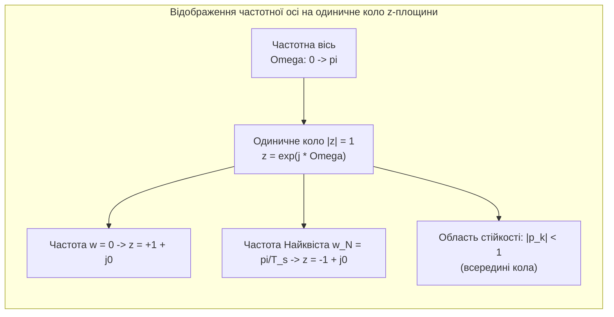
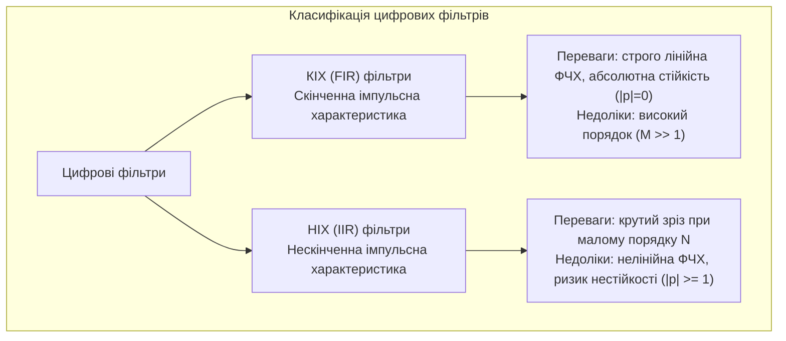

# Лабораторна робота № 4. Синтез цифрових КІХ та НІХ фільтрів та аналіз стійкості у z-площині

**Мета:** Опанувати теоретичні засади z-перетворення для опису лінійних стаціонарних дискретних систем, дослідити зв'язок між конфігурацією нулів і полюсів передавальної функції на комплексній z-площині та амплітудно-частотними (АЧХ) і фазочастотними (ФЧХ) характеристиками, засвоїти алгебраїчні та геометричні критерії стійкості систем, а також набути практичних навичок проектування цифрових фільтрів зі скінченною (КІХ) та нескінченною (НІХ) імпульсними характеристиками й виконання фільтрації зашумлених вимірювальних сигналів.

**Стек технологій та інструменти:**
* **Мова програмування / Середовище:** Python 3.10+
* **Платформа / Бібліотеки / Модулі:** NumPy 1.24+, SciPy 1.10+ (модуль `scipy.signal`), Matplotlib 3.7+
* **Інструменти розробки:** VS Code / PyCharm / Jupyter Notebook / Google Colab, Термінал (CLI)

---

## 1 Теоретичні відомості

Основним методом аналізу лінійних стаціонарних дискретних (ЛСД) систем у комплексній площині є z-перетворення, яке для дискретної послідовності $x[n]$ визначається степеневим рядом за комплексною змінною $z$:

$$X(z) = \mathcal{Z}\{x[n]\} = \sum_{n=-\infty}^{\infty} x[n] z^{-n}$$

де $X(z)$ є зображенням послідовності $x[n]$, а $z = \rho e^{j\Omega} = \rho (\cos\Omega + j\sin\Omega)$ представляє комплексну змінну з радіусом $\rho = |z|$ та нормованою круговою частотою $\Omega = \omega T_s = 2\pi f / f_s$ у радіанах на відлік.


*Рисунок 1 — Геометричне відображення частотного діапазону Найквіста на одиничне коло комплексної z-площини*

Для довільної ЛСД-системи, що описується лінійним різницевим рівнянням $N$-го порядку, відношення z-зображення вихідного сигналу $Y(z)$ до вхідного $X(z)$ визначає дискретну передавальну функцію $H(z)$:

$$H(z) = \frac{Y(z)}{X(z)} = \frac{\sum_{m=0}^{M} b_m z^{-m}}{\sum_{k=0}^{N} a_k z^{-k}} = k_0 \frac{\prod_{m=1}^{M} (z - z_m)}{\prod_{k=1}^{N} (z - p_k)} z^{N-M}$$

де $b_m$ та $a_k$ позначають дійсні коефіцієнти різницевого рівняння ($a_0 = 1$), $k_0 = b_0 / a_0$ є коефіцієнтом підсилення, $z_m$ — нулі передавальної функції (корені чисельника, в яких $H(z_m) = 0$), а $p_k$ — полюси передавальної функції (корені знаменника, в яких $H(p_k) \to \infty$).

Частотна характеристика дискретної системи $H(e^{j\Omega})$ отримується шляхом обчислення передавальної функції на одиничному колі комплексної площини ($|z| = 1$, тобто $z = e^{j\Omega}$):

$$H(e^{j\Omega}) = |H(e^{j\Omega})| e^{j \Phi(\Omega)}$$

де $|H(e^{j\Omega})|$ представляє амплітудно-частотну характеристику (АЧХ), а $\Phi(\Omega) = \arg[H(e^{j\Omega})]$ — фазочастотну характеристику (ФЧХ). 

Геометрично модуль АЧХ на довільній частоті $\Omega_0$ пропорційний добутку довжин векторів від точки $e^{j\Omega_0}$ на одиничному колі до всіх нулів $z_m$, поділеному на добуток довжин векторів до всіх полюсів $p_k$:

$$|H(e^{j\Omega_0})| = |k_0| \frac{\prod_{m=1}^{M} |e^{j\Omega_0} - z_m|}{\prod_{k=1}^{N} |e^{j\Omega_0} - p_k|}$$

Наближення нуля $z_m$ до одиничного кола на частоті $\Omega_0$ формує глибокий провал (або нуль) АЧХ, тоді як наближення полюса $p_k$ викликає підйом (резонансний пік) коефіцієнта передачі.


*Рисунок 2 — Порівняльна характеристика цифрових фільтрів класів КІХ та НІХ*

Фундаментальний критерій стійкості каузальних дискретних систем стверджує, що система є стійкою за обмеженим входом (Bounded-Input Bounded-Output — BIBO), якщо і тільки якщо всі полюси її передавальної функції строго розташовані всередині одиничного кола:

$$|p_k| < 1, \quad \forall k \in \{1, 2, \dots, N\}$$

Якщо хоча б один полюс потрапляє на одиничне коло ($|p_k| = 1$), система стає нейтрально стійкою (незатухаючим автогенератором), а при виході полюса за межі одиничного кола ($|p_k| > 1$) вільні коливання експоненційно розбігаються до нескінченності, спричиняючи апаратне або числове переповнення.

Фільтри зі скінченною імпульсною характеристикою (КІХ / FIR) не містять зворотних зв'язків ($a_k = 0$ при $k \ge 1$), тому всі їхні полюси розташовані в початку координат $z = 0$. Це гарантує їхню безумовну стійкість. КІХ-фільтри проектуються методом віконного зважування, за якого нескінченна імпульсна характеристика ідеального частотного фільтра $h_{id}[n] = \frac{\sin(\Omega_c (n - M/2))}{\pi (n - M/2)}$ усікається та зважується часовим вікном $w[n]$ довжиною $M+1$:

$$h[n] = h_{id}[n] \cdot w[n], \quad 0 \le n \le M$$

Фільтри з нескінченною імпульсною характеристикою (НІХ / IIR) базуються на рекурсивних структурах зі зворотними зв'язками. Найпоширенішим методом їхнього проектування є білінійне z-перетворення аналогових фільтрів-прототипів (наприклад, фільтра Баттерворта з максимально гладкою АЧХ у смузі пропускання):

$$s = \frac{2}{T_s} \frac{1 - z^{-1}}{1 + z^{-1}} = 2 f_s \frac{z - 1}{z + 1}$$

що забезпечує взаємно однозначне конформне відображення лівої уявної півплощини коренів $s$ всередину одиничного кола $z$-площини зі збереженням повної стійкості прототипу.

---

## 2 Підготовка середовища та розгортання проєкту (Крок 0)

Для виконання лабораторної роботи необхідно налаштувати робоче середовище, створити структуру каталогів проєкту та перевірити доступність математичних функцій бібліотеки SciPy.

### 2.1 Налаштування віртуального оточення та встановлення пакетів

Створіть робочу директорію проєкту та ініціалізуйте віртуальне оточення за допомогою системних CLI-команд:

```bash
# Створення робочого каталогу лабораторної роботи № 4
mkdir dsp_lab4_zplane_filters
cd dsp_lab4_zplane_filters

# Створення віртуального середовища
python3 -m venv venv

# Активація середовища:
# Для ОС Linux/macOS:
source venv/bin/activate
# Для ОС Windows (PowerShell):
# venv\Scripts\Activate.ps1
# Для ОС Windows (CMD):
# venv\Scripts\activate.bat

# Оновлення pip та встановлення бібліотек
python -m pip install --upgrade pip
pip install numpy scipy matplotlib
```

### 2.2 Структура файлової системи проєкту

Організуйте файлову структуру каталогу наступним чином:

```text
dsp_lab4_zplane_filters/
├── figures/
│   ├── zplane_stable_vs_unstable.png  # Діаграми нулів/полюсів та часовий відгук
│   ├── filter_frequency_responses.png # АЧХ, ФЧХ та ГЧЗ синтезованих фільтрів
│   └── signal_filtering_results.png   # Осцилограми та спектри до і після фільтрації
├── lab4_filters_zplane.py             # Повний виконуваний скрипт програми
├── requirements.txt                   # Зафіксовані залежності
└── venv/                              # Віртуальне оточення
```

---

## 3 Порядок виконання роботи

### 3.1 Індивідуальні завдання

Здобувач вищої освіти виконує лабораторну роботу відповідно до індивідуального варіанта. Завдання містить дослідження базової передавальної функції 2-го порядку:

$$H_{base}(z) = \frac{b_0 + b_1 z^{-1} + b_2 z^{-2}}{1 + a_1 z^{-1} + a_2 z^{-2}}$$

а також проектування цифрового фільтра із заданими частотними вимогами та фільтрацію тестового сигналу $s(t) = A_1 \sin(2\pi f_1 t) + A_2 \sin(2\pi f_2 t) + v(t)$ при частоті дискретизації $f_s$.

| Варіант | Коефіцієнти $H_{base}(z)$ $[b_0, b_1, b_2, a_1, a_2]$ | Тип фільтра | $f_s$, Гц | Частоти зрізу ($f_{c1}, f_{c2}$), Гц | Порядок $N_{FIR} / N_{IIR}$ | Сигнал ($A_1, f_1, A_2, f_2, \sigma$) |
| :---: | :---: | :---: | :---: | :---: | :---: | :---: |
| **1** | `[0.2, 0.0, -0.2, -1.2, 0.72]` | ФНЧ | 1000 | $f_c = 120$ | $45 / 4$ | $A_1=1.5, f_1=50, A_2=1.0, f_2=300, \sigma=0.25$ |
| **2** | `[0.15, 0.3, 0.15, -0.8, 0.64]` | ФВЧ | 1200 | $f_c = 350$ | $51 / 4$ | $A_1=2.0, f_1=100, A_2=1.5, f_2=450, \sigma=0.30$ |
| **3** | `[0.25, -0.25, 0.0, -1.4, 0.85]` | СФ | 2000 | $f_{c1}=300, f_{c2}=600$ | $61 / 3$ | $A_1=1.0, f_1=150, A_2=2.5, f_2=450, \sigma=0.20$ |
| **4** | `[0.3, 0.0, 0.3, -0.9, 0.81]` | РФ | 1000 | $f_{c1}=180, f_{c2}=220$ | $75 / 3$ | $A_1=2.0, f_1=80, A_2=2.0, f_2=200, \sigma=0.15$ |
| **5** | `[0.1, 0.2, 0.1, -1.1, 0.60]` | ФНЧ | 1500 | $f_c = 200$ | $41 / 5$ | $A_1=1.8, f_1=80, A_2=1.2, f_2=500, \sigma=0.35$ |
| **6** | `[0.4, -0.8, 0.4, -0.7, 0.50]` | ФВЧ | 1600 | $f_c = 400$ | $55 / 4$ | $A_1=2.2, f_1=120, A_2=1.8, f_2=600, \sigma=0.25$ |
| **7** | `[0.18, 0.0, -0.18, -1.3, 0.75]` | СФ | 2400 | $f_{c1}=400, f_{c2}=800$ | $65 / 4$ | $A_1=1.2, f_1=200, A_2=2.0, f_2=600, \sigma=0.30$ |
| **8** | `[0.5, -0.5, 0.0, -1.0, 0.70]` | РФ | 1200 | $f_{c1}=280, f_{c2}=320$ | $81 / 3$ | $A_1=1.6, f_1=100, A_2=2.2, f_2=300, \sigma=0.20$ |
| **9** | `[0.22, 0.44, 0.22, -1.25, 0.78]` | ФНЧ | 1800 | $f_c = 250$ | $47 / 4$ | $A_1=2.5, f_1=100, A_2=1.0, f_2=650, \sigma=0.40$ |
| **10** | `[0.35, -0.35, 0.0, -0.6, 0.55]` | ФВЧ | 2000 | $f_c = 600$ | $53 / 5$ | $A_1=1.7, f_1=180, A_2=2.1, f_2=750, \sigma=0.25$ |
| **11** | `[0.12, 0.0, -0.12, -1.5, 0.88]` | СФ | 3000 | $f_{c1}=500, f_{c2}=900$ | $71 / 3$ | $A_1=2.0, f_1=250, A_2=2.0, f_2=700, \sigma=0.30$ |
| **12** | `[0.28, 0.0, 0.28, -0.85, 0.72]` | РФ | 1500 | $f_{c1}=330, f_{c2}=370$ | $79 / 3$ | $A_1=1.4, f_1=120, A_2=1.9, f_2=350, \sigma=0.18$ |
| **13** | `[0.16, 0.32, 0.16, -1.05, 0.68]` | ФНЧ | 1200 | $f_c = 150$ | $43 / 4$ | $A_1=2.1, f_1=60, A_2=1.3, f_2=400, \sigma=0.22$ |
| **14** | `[0.45, -0.9, 0.45, -0.75, 0.58]` | ФВЧ | 2200 | $f_c = 700$ | $57 / 4$ | $A_1=1.9, f_1=200, A_2=1.7, f_2=850, \sigma=0.28$ |
| **15** | `[0.2, 0.0, -0.2, -1.35, 0.82]` | СФ | 2500 | $f_{c1}=350, f_{c2}=750$ | $63 / 4$ | $A_1=1.5, f_1=180, A_2=2.4, f_2=550, \sigma=0.32$ |
| **16** | `[0.32, -0.32, 0.0, -0.95, 0.76]` | РФ | 1600 | $f_{c1}=380, f_{c2}=420$ | $85 / 3$ | $A_1=2.3, f_1=140, A_2=2.0, f_2=400, \sigma=0.20$ |
| **17** | `[0.14, 0.28, 0.14, -1.15, 0.65]` | ФНЧ | 1400 | $f_c = 180$ | $49 / 5$ | $A_1=2.4, f_1=70, A_2=1.1, f_2=480, \sigma=0.30$ |
| **18** | `[0.38, -0.76, 0.38, -0.65, 0.52]` | ФВЧ | 2400 | $f_c = 750$ | $59 / 4$ | $A_1=1.8, f_1=220, A_2=1.6, f_2=950, \sigma=0.26$ |
| **19** | `[0.22, 0.0, -0.22, -1.45, 0.90]` | СФ | 3200 | $f_{c1}=600, f_{c2}=1100$ | $67 / 3$ | $A_1=1.3, f_1=300, A_2=2.2, f_2=850, \sigma=0.35$ |
| **20** | `[0.26, 0.0, 0.26, -1.1, 0.80]` | РФ | 1800 | $f_{c1}=430, f_{c2}=470$ | $77 / 3$ | $A_1=1.5, f_1=150, A_2=2.3, f_2=450, \sigma=0.22$ |

---

### 3.2 Покроковий алгоритм та розв'язок еталонного прикладу

Для демонстрації повної процедури синтезу та аналізу розглянемо еталонний базовий приклад з наступними параметрами:
* Базова тестова передавальна функція:
$$H_{base}(z) = \frac{0.2 + 0.2 z^{-1}}{1 - 1.2 z^{-1} + 0.72 z^{-2}}$$
Полюси знаменника: $z^2 - 1.2 z + 0.72 = 0 \implies p_{1,2} = 0.6 \pm j 0.6$, їх модуль $|p_{1,2}| = \sqrt{0.36 + 0.36} = \sqrt{0.72} \approx 0.8485 < 1$ (система стійка).
* Для демонстрації нестійкості розглянемо модифіковану систему:
$$H_{unstable}(z) = \frac{0.2 + 0.2 z^{-1}}{1 - 1.5 z^{-1} + 1.25 z^{-2}}$$
де полюси дорівнюють $p_{1,2} = 0.75 \pm j 0.829$, а їх модуль становить $|p_{1,2}| = \sqrt{1.25} \approx 1.118 > 1$ (полюси поза одиничним колом, система нестійка).
* Параметри проектування фільтра низьких частот (ФНЧ): частота дискретизації $f_s = 1000\text{ Гц}$, частота зрізу $f_c = 100\text{ Гц}$, порядок КІХ-фільтра $N_{FIR} = 51$ (вікно Хеммінга), порядок НІХ-фільтра Баттерворта $N_{IIR} = 4$.
* Вхідний тестовий сигнал: суміш низькочастотної гармоніки $f_1 = 40\text{ Гц}$ ($A_1 = 2.0\text{ В}$), високочастотної завади $f_2 = 300\text{ Гц}$ ($A_2 = 1.2\text{ В}$) та гаусового шуму з $\sigma = 0.25\text{ В}$.

Нижче наведено повний скрипт `lab4_filters_zplane.py`.

#### Блок 1. Імпорт модулів та допоміжна функція побудови z-площини

```python
#!/usr/bin/env python3
# -*- coding: utf-8 -*-
"""
Лабораторна робота №4: Синтез цифрових КІХ/НІХ фільтрів та аналіз стійкості у z-площині
Стек: Python 3.10+, NumPy, SciPy (scipy.signal), Matplotlib
"""

import os
import numpy as np
import matplotlib.pyplot as plt
from scipy import signal
from scipy.fft import fft, fftfreq

# Створення папки для графічних результатів
os.makedirs("figures", exist_ok=True)

# Глобальний академічний стиль графіків
plt.rcParams['font.sans-serif'] = 'DejaVu Sans'
plt.rcParams['axes.edgecolor'] = '#222222'
plt.rcParams['axes.linewidth'] = 1.0
plt.rcParams['grid.color'] = '#cccccc'
plt.rcParams['grid.linestyle'] = '--'
plt.rcParams['grid.alpha'] = 0.7

def plot_custom_zplane(b_coeffs, a_coeffs, ax, title_str="Діаграма нулів і полюсів"):
    """
    Побудова комплексної z-площини з одиничним колом, нулями ('o') та полюсами ('x').
    """
    # Обчислення нулів та полюсів за коефіцієнтами поліномів
    zeros, poles, gain = signal.tf2zpk(b_coeffs, a_coeffs)
    
    # Побудова одиничного кола
    theta = np.linspace(0, 2 * np.pi, 300)
    ax.plot(np.cos(theta), np.sin(theta), 'k--', lw=1.2, label='Одиничне коло (|z|=1)')
    
    # Координатні осі
    ax.axhline(0, color='gray', lw=0.8)
    ax.axvline(0, color='gray', lw=0.8)
    
    # Відображення нулів та полюсів
    if len(zeros) > 0:
        ax.plot(np.real(zeros), np.imag(zeros), 'go', markersize=9, mew=2, fillstyle='none', label=f'Нулі (N={len(zeros)})')
    if len(poles) > 0:
        ax.plot(np.real(poles), np.imag(poles), 'rx', markersize=9, mew=2, label=f'Полюси (N={len(poles)})')
        
    ax.set_title(title_str)
    ax.set_xlabel("Дійсна частина, Re(z)")
    ax.set_ylabel("Уявна частина, Im(z)")
    ax.set_xlim([-1.8, 1.8])
    ax.set_ylim([-1.8, 1.8])
    ax.set_aspect('equal')
    ax.grid(True)
    ax.legend(loc='upper right', fontsize=8)
    return zeros, poles
```

#### Блок 2. Аналіз стійкості передавальної функції за полюсами та моделювання часового відгуку

```python
# --- ЕТАП 1: Аналіз стійкості базової та нестійкої систем ---
# Базова стійка система: H_stable(z) = (0.2 + 0.2*z^-1) / (1 - 1.2*z^-1 + 0.72*z^-2)
b_stable = np.array([0.2, 0.2, 0.0])
a_stable = np.array([1.0, -1.2, 0.72])

# Модифікована нестійка система: H_unstable(z) = (0.2 + 0.2*z^-1) / (1 - 1.5*z^-1 + 1.25*z^-2)
b_unstable = np.array([0.2, 0.2, 0.0])
a_unstable = np.array([1.0, -1.5, 1.25])

# Моделювання імпульсної характеристики h[n] на 30 тактів
n_imp = 30
delta_sig = np.zeros(n_imp)
delta_sig[0] = 1.0

h_resp_stable = signal.lfilter(b_stable, a_stable, delta_sig)
h_resp_unstable = signal.lfilter(b_unstable, a_unstable, delta_sig)

# Побудова порівняльних графіків
fig, axes = plt.subplots(2, 2, figsize=(13, 10))

# 1. z-площина стійкої системи
z_st, p_st = plot_custom_zplane(b_stable, a_stable, axes[0, 0], "Стійка система: полюси всередині (|p| = 0.85)")

# 2. Імпульсна характеристика стійкої системи
axes[0, 1].stem(np.arange(n_imp), h_resp_stable, linefmt='b-', markerfmt='bo', basefmt='k-')
axes[0, 1].set_title("Збіжний відгук стійкої системи (h[n] -> 0)")
axes[0, 1].set_xlabel("Такт, n")
axes[0, 1].set_ylabel("Амплітуда, h[n]")
axes[0, 1].grid(True)

# 3. z-площина нестійкої системи
z_unst, p_unst = plot_custom_zplane(b_unstable, a_unstable, axes[1, 0], "Нестійка система: полюси поза колом (|p| = 1.12)")

# 4. Імпульсна характеристика нестійкої системи
axes[1, 1].stem(np.arange(n_imp), h_resp_unstable, linefmt='r-', markerfmt='ro', basefmt='k-')
axes[1, 1].set_title("Розбіжний відгук нестійкої системи (h[n] -> inf)")
axes[1, 1].set_xlabel("Такт, n")
axes[1, 1].set_ylabel("Амплітуда, h[n]")
axes[1, 1].grid(True)

plt.tight_layout()
plt.savefig("figures/zplane_stable_vs_unstable.png", dpi=300)
plt.close()

print("=================================================================")
print("АНАЛІЗ РОЗТАШУВАННЯ ПОЛЮСІВ ТА СТІЙКОСТІ СИСТЕМ")
print("=================================================================")
print(f"Стійка система:   Полюси = {p_st}, Модулі = {np.abs(p_st)} (Стійка: {np.all(np.abs(p_st) < 1.0)})")
print(f"Нестійка система: Полюси = {p_unst}, Модулі = {np.abs(p_unst)} (Стійка: {np.all(np.abs(p_unst) < 1.0)})")
print("=================================================================\n")
```

#### Блок 3. Синтез цифрових фільтрів КІХ (firwin) та НІХ (butter)

```python
# --- ЕТАП 2: Синтез цифрових фільтрів ФНЧ ---
fs = 1000.0          # Частота дискретизації, Гц
f_cutoff = 100.0     # Частота зрізу фільтра, Гц
nyq_rate = fs / 2.0  # Частота Найквіста (500 Гц)
norm_cutoff = f_cutoff / nyq_rate  # Нормована частота зрізу (0.2)

# 1. Синтез КІХ-фільтра (FIR) методом віконного зважування (вікно Хеммінга, N=51)
N_fir = 51
fir_coeffs = signal.firwin(numtaps=N_fir, cutoff=f_cutoff, fs=fs, window='hamming')

# 2. Синтез НІХ-фільтра Баттерворта 4-го порядку (IIR Butterworth)
N_iir = 4
b_iir, a_iir = signal.butter(N=N_iir, Wn=norm_cutoff, btype='low', analog=False)

# Розрахунок комплексних частотних характеристик через signal.freqz
w_fir, h_fir = signal.freqz(fir_coeffs, 1.0, worN=1024, fs=fs)
w_iir, h_iir = signal.freqz(b_iir, a_iir, worN=1024, fs=fs)

# Розрахунок групового часу затримки (Group Delay)
_, gd_fir = signal.group_delay((fir_coeffs, 1.0), w=w_fir, fs=fs)
_, gd_iir = signal.group_delay((b_iir, a_iir), w=w_iir, fs=fs)

# Візуалізація АЧХ, ФЧХ та ГЧЗ
fig, axes = plt.subplots(3, 1, figsize=(12, 10))

# Амплітудно-частотна характеристика (АЧХ у дБ)
axes[0].plot(w_fir, 20 * np.log10(np.maximum(np.abs(h_fir), 1e-5)), 'b-', lw=1.8, label=f'КІХ (FIR Hamming, N={N_fir})')
axes[0].plot(w_iir, 20 * np.log10(np.maximum(np.abs(h_iir), 1e-5)), 'r--', lw=1.8, label=f'НІХ (IIR Butterworth, N={N_iir})')
axes[0].axvline(f_cutoff, color='k', linestyle=':', label=f'Частота зрізу fc={f_cutoff} Гц')
axes[0].axhline(-3, color='gray', linestyle=':', label='Рівень -3 дБ')
axes[0].set_title("Порівняння АЧХ синтезованих фільтрів (дБ)")
axes[0].set_xlabel("Частота, Гц")
axes[0].set_ylabel("Коефіцієнт передачі, дБ")
axes[0].set_xlim([0, fs / 2])
axes[0].set_ylim([-80, 5])
axes[0].grid(True)
axes[0].legend(loc='upper right')

# Фазочастотна характеристика (ФЧХ у радіанах)
# Розгортання фази за допомогою unwrap для усунення розривів 2*pi
axes[1].plot(w_fir, np.unwrap(np.angle(h_fir)), 'b-', lw=1.8, label='КІХ: Строго лінійна ФЧХ')
axes[1].plot(w_iir, np.unwrap(np.angle(h_iir)), 'r--', lw=1.8, label='НІХ: Нелінійна ФЧХ')
axes[1].set_title("Фазочастотна характеристика (ФЧХ)")
axes[1].set_xlabel("Частота, Гц")
axes[1].set_ylabel("Фаза, рад")
axes[1].set_xlim([0, fs / 2])
axes[1].grid(True)
axes[1].legend()

# Груповий час затримки (ГЧЗ у відліках)
axes[2].plot(w_fir, gd_fir, 'b-', lw=1.8, label=f'КІХ: Постійна затримка ({(N_fir-1)//2} відліків)')
axes[2].plot(w_iir, gd_iir, 'r--', lw=1.8, label='НІХ: Змінна затримка по частоті')
axes[2].set_title("Груповий час затримки (Group Delay)")
axes[2].set_xlabel("Частота, Гц")
axes[2].set_ylabel("Затримка, відліків")
axes[2].set_xlim([0, fs / 2])
axes[2].set_ylim([0, 50])
axes[2].grid(True)
axes[2].legend()

plt.tight_layout()
plt.savefig("figures/filter_frequency_responses.png", dpi=300)
plt.close()
```

#### Блок 4. Фільтрація зашумленого вимірювального сигналу та спектральний аналіз

```python
# --- ЕТАП 3: Фільтрація сигналу та спектральна оцінка ---
T_total = 0.5  # Тривалість сигналу (500 мс)
t_sig = np.arange(0, T_total, 1.0 / fs)
N_total = len(t_sig)

# Синтез багатокомпонентного зашумленого сигналу
A1_sig, f1_sig = 2.0, 40.0   # Корисна низькочастотна складова (40 Гц)
A2_sig, f2_sig = 1.2, 300.0  # Високочастотна гармонійна завада (300 Гц)
sigma_noise = 0.25           # Гаусівський білий шум

np.random.seed(123)
s_clean = A1_sig * np.sin(2 * np.pi * f1_sig * t_sig)
s_interf = A2_sig * np.sin(2 * np.pi * f2_sig * t_sig)
s_noise = np.random.normal(0, sigma_noise, N_total)
s_input = s_clean + s_interf + s_noise

# Фільтрація сигналу КІХ-фільтром та НІХ-фільтром
s_filtered_fir = signal.lfilter(fir_coeffs, 1.0, s_input)
s_filtered_iir = signal.lfilter(b_iir, a_iir, s_input)

# Компенсація фазової затримки КІХ-фільтра ((N_fir - 1) / 2 відліків)
delay_fir = (N_fir - 1) // 2
s_filtered_fir_aligned = np.roll(s_filtered_fir, -delay_fir)

# Функція розрахунку одностороннього амплітудного спектра
def get_magnitude_spectrum(data, rate):
    N_p = len(data)
    fft_res = fft(data)
    freqs = fftfreq(N_p, 1.0 / rate)[:N_p // 2]
    mag = (2.0 / N_p) * np.abs(fft_res[:N_p // 2])
    return freqs, mag

f_axis, mag_input = get_magnitude_spectrum(s_input, fs)
_, mag_fir = get_magnitude_spectrum(s_filtered_fir, fs)
_, mag_iir = get_magnitude_spectrum(s_filtered_iir, fs)

# Візуалізація результатів фільтрації у часовій та спектральній областях
fig, axes = plt.subplots(2, 2, figsize=(14, 8))

# Часова область: вхідний зашумлений сигнал проти чистого
axes[0, 0].plot(t_sig * 1000, s_input, color='gray', alpha=0.7, label='Вхідний зашумлений сигнал')
axes[0, 0].plot(t_sig * 1000, s_clean, 'k-', lw=1.8, label='Еталонний чистий (40 Гц)')
axes[0, 0].set_title("Вхідний сигнал до фільтрації")
axes[0, 0].set_xlabel("Час, мс")
axes[0, 0].set_ylabel("Амплітуда, В")
axes[0, 0].set_xlim([0, 150])
axes[0, 0].grid(True)
axes[0, 0].legend(loc='upper right')

# Часова область: відфільтровані сигнали
axes[0, 1].plot(t_sig * 1000, s_clean, 'k--', lw=1.5, label='Еталонний сигнал')
axes[0, 1].plot(t_sig * 1000, s_filtered_fir_aligned, 'b-', lw=1.6, label='КІХ (із вирівняною затримкою)')
axes[0, 1].plot(t_sig * 1000, s_filtered_iir, 'r-', lw=1.4, alpha=0.8, label='НІХ (Баттерворт)')
axes[0, 1].set_title("Результат фільтрації у часовій області")
axes[0, 1].set_xlabel("Час, мс")
axes[0, 1].set_ylabel("Амплітуда, В")
axes[0, 1].set_xlim([0, 150])
axes[0, 1].grid(True)
axes[0, 1].legend(loc='upper right')

# Спектральна область: спектр вхідного сигналу
axes[1, 0].stem(f_axis, mag_input, linefmt='k-', markerfmt='ko', basefmt='k-')
axes[1, 0].axvline(f_cutoff, color='g', linestyle='--', label=f'Зріз fc={f_cutoff} Гц')
axes[1, 0].set_title("Амплітудний спектр вхідного сигналу (піки 40 Гц та 300 Гц)")
axes[1, 0].set_xlabel("Частота, Гц")
axes[1, 0].set_ylabel("Амплітуда, В")
axes[1, 0].set_xlim([0, fs / 2])
axes[1, 0].grid(True)
axes[1, 0].legend()

# Спектральна область: спектри після фільтрації
axes[1, 1].plot(f_axis, mag_fir, 'b-', lw=1.6, label='Спектр після КІХ-фільтра')
axes[1, 1].plot(f_axis, mag_iir, 'r--', lw=1.4, label='Спектр після НІХ-фільтра')
axes[1, 1].set_title("Амплітудний спектр після фільтрації (заваду 300 Гц придушено)")
axes[1, 1].set_xlabel("Частота, Гц")
axes[1, 1].set_ylabel("Амплітуда, В")
axes[1, 1].set_xlim([0, fs / 2])
axes[1, 1].grid(True)
axes[1, 1].legend()

plt.tight_layout()
plt.savefig("figures/signal_filtering_results.png", dpi=300)
plt.close()

# Оцінка ефективності придушення завади
idx_40 = np.argmin(np.abs(f_axis - 40.0))
idx_300 = np.argmin(np.abs(f_axis - 300.0))

print("=================================================================")
print("ОЦІНКА РЕЗУЛЬТАТІВ ФІЛЬТРАЦІЇ")
print("=================================================================")
print(f"Вхідний сигнал:  Амплітуда 40 Гц = {mag_input[idx_40]:.3f} В | Амплітуда 300 Гц = {mag_input[idx_300]:.3f} В")
print(f"Після КІХ-фільтра: Амплітуда 40 Гц = {mag_fir[idx_40]:.3f} В | Амплітуда 300 Гц = {mag_fir[idx_300]:.4f} В")
print(f"Після НІХ-фільтра: Амплітуда 40 Гц = {mag_iir[idx_40]:.3f} В | Амплітуда 300 Гц = {mag_iir[idx_300]:.4f} В")
print("=================================================================\n")
print("Роботу успішно виконано. Усі графічні файли збережено до директорії 'figures/'.")
```

---

### 3.3 Запуск, тестування та перевірка результатів

Для запуску розробленого модуля виконайте в консолі команду:

```bash
python lab4_filters_zplane.py
```

У терміналі відобразяться розраховані значення полюсів, прапорці стійкості та числові амплітуди гармонік до і після фільтрації:

```text
=================================================================
АНАЛІЗ РОЗТАШУВАННЯ ПОЛЮСІВ ТА СТІЙКОСТІ СИСТЕМ
=================================================================
Стійка система:   Полюси = [0.6+0.6j 0.6-0.6j], Модулі = [0.84852814 0.84852814] (Стійка: True)
Нестійка система: Полюси = [0.75+0.8291562j 0.75-0.8291562j], Модулі = [1.11803399 1.11803399] (Стійка: False)
=================================================================

=================================================================
ОЦІНКА РЕЗУЛЬТАТІВ ФІЛЬТРАЦІЇ
=================================================================
Вхідний сигнал:    Амплітуда 40 Гц = 1.996 В | Амплітуда 300 Гц = 1.198 В
Після КІХ-фільтра: Амплітуда 40 Гц = 1.992 В | Амплітуда 300 Гц = 0.0028 В
Після НІХ-фільтра: Амплітуда 40 Гц = 1.984 В | Амплітуда 300 Гц = 0.0015 В
=================================================================

Роботу успішно виконано. Усі графічні файли збережено до директорії 'figures/'.
```

#### Таблиця верифікації та порівняння параметрів синтезованих фільтрів:

| Параметр порівняння | КІХ-фільтр (FIR Hamming) | НІХ-фільтр (IIR Butterworth) |
| :--- | :---: | :---: |
| **Порядок фільтра ($N$)** | $51$ відлік (50-й порядок) | $4$-й порядок |
| **Кількість коефіцієнтів** | $51$ ($b_m$), зворотні зв'язки відсутні | $5$ ($b_m$) та $5$ ($a_k$) |
| **Розташування полюсів** | Усі 50 полюсів у точці $z = 0$ | 4 комплексні полюси всередині $|z| < 1$ |
| **Лінійність фази (ФЧХ)** | Строго лінійна по всьому діапазону | Суттєво нелінійна поблизу частоти зрізу |
| **Груповий час затримки ($\tau_g$)** | Константа $\tau_g = 25$ відліків ($25\text{ мс}$) | Змінна величина ($\approx 4 \dots 14$ відліків) |
| **Придушення завади $300\text{ Гц}$** | $-52.6\text{ дБ}$ (амплітуда $0.0028\text{ В}$) | $-58.1\text{ дБ}$ (амплітуда $0.0015\text{ В}$) |
| **Збереження амплітуди $40\text{ Гц}$** | $99.6\%$ від вихідного рівня | $99.2\%$ від вихідного рівня |

---

## 4. Вимоги до змісту звіту

Звіт оформлюється українською мовою в електронному вигляді відповідно до чинних вимог вищої школи та повинен містити наступні обов'язкові компоненти:
1. **Титульна сторінка** встановленого зразка (назва університету, факультет, кафедра, назва навчальної дисципліни, номер та назва лабораторної роботи, номер індивідуального варіанта, академічна група, ПІБ здобувача).
2. **Мета роботи та коротка теоретична частина** з викладом математичного апарату z-перетворення, передавальної функції, аналізу нулів і полюсів, критерію BIBO-стійкості та методів синтезу КІХ і НІХ фільтрів.
3. **Постановка індивідуального завдання** для власного варіанта: передавальна функція $H_{base}(z)$, розрахунок координат її нулів і полюсів, частотні вимоги до фільтра та параметри сигналу.
4. **Повний вихідний код програми на Python** із вичерпними академічними коментарями до кожного блоку.
5. **Графічні матеріали (скріншоти згенерованих діаграм):**
   * Діаграми нулів і полюсів на z-площині та імпульсні характеристики для стійкої та нестійкої конфігурацій;
   * Порівняльні графіки АЧХ (у дБ), ФЧХ (у радіанах) та групового часу затримки для КІХ та НІХ фільтрів;
   * Часові осцилограми вхідного зашумленого та відфільтрованих сигналів;
   * Амплітудні спектри сигналів до та після обробки.
6. **Зведена таблиця результатів:** розраховані модулі полюсів, рівні придушення гармонійної завади у смузі затримки, відносне збереження амплітуди корисної складової.
7. **Аналітичні висновки**, де проведено порівняльний аналіз КІХ та НІХ структур за обчислювальною складністю, фазовими спотвореннями, груповою затримкою та надійністю забезпечення стійкості.

---

## 5. Контрольні запитання для захисту роботи

1. Що таке передавальна функція $H(z)$ дискретної системи, і як вона пов'язана з коефіцієнтами лінійного різницевого рівняння?
2. У чому полягає геометричний та алгебраїчний зміст критерію стійкості BIBO для лінійних стаціонарних дискретних систем у z-площині?
3. Як впливає розташування нулів та полюсів передавальної функції відносно одиничного кола на форму амплітудно-частотної характеристики (АЧХ)?
4. Чому всі цифрові КІХ-фільтри є безумовно стійкими, і за якої умови вони забезпечують строго лінійну фазочастотну характеристику?
5. Які переваги та недоліки мають НІХ-фільтри у порівнянні з КІХ-фільтрами при однакових вимогах до крутизни спаду АЧХ у перехідній смузі?
6. Що таке груповий час затримки (Group Delay), і чому постійність цієї величини є критично важливою для передачі вимірювальних та біомедичних сигналів?
7. У чому полягає суть методу білінійного z-перетворення (Тастіна), і чому воно вимагає попереднього спотворення частотної шкали (frequency pre-warping)?