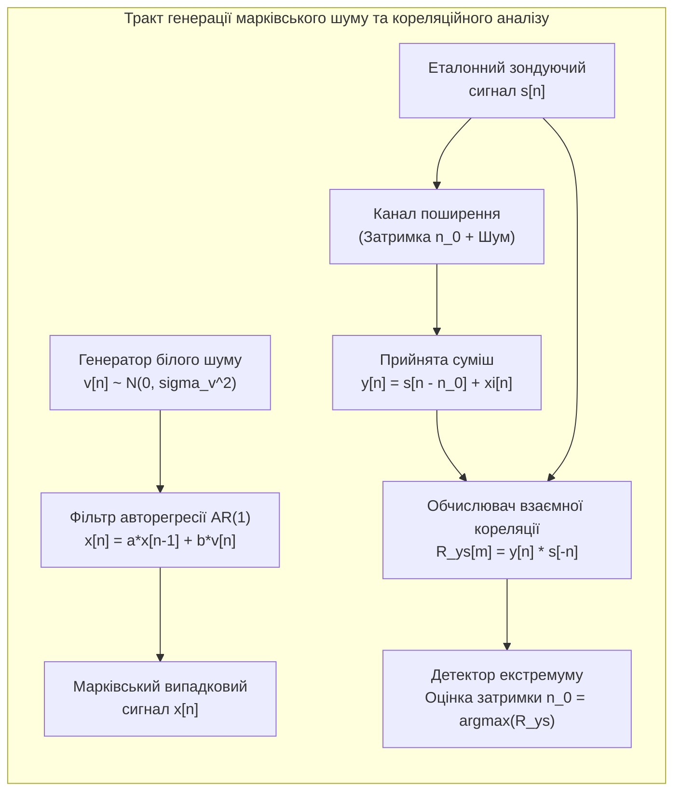
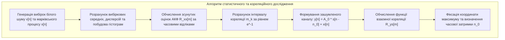

# Лабораторна робота № 5. Статистичний та кореляційний аналіз випадкових дискретних сигналів

**Мета:** Засвоїти фундаментальні математичні засади теорії стаціонарних та ергодичних випадкових процесів у дискретному часі, опанувати алгоритми розрахунку числових характеристик випадкових послідовностей (математичного очікування, дисперсії, середньоквадратичного відхилення), вивчити властивості автокореляційних функцій (АКФ) для білого та корельованого марківського шуму, а також набути практичних навичок застосування взаємної кореляційної функції (ВКФ) для виявлення та оцінки затримки слабких локаційних сигналів в умовах значних адитивних завад.

**Стек технологій та інструменти:**
* **Мова програмування / Середовище:** Python 3.10+
* **Платформа / Бібліотеки / Модулі:** NumPy 1.24+, SciPy 1.10+ (модуль `scipy.signal`), Matplotlib 3.7+
* **Інструменти розробки:** VS Code / PyCharm / Jupyter Notebook / Google Colab, Термінал (CLI)

---

## 1 Теоретичні відомості

У реальних радіотехнічних, акустичних та комп'ютерно-інтегрованих системах вимірювальні сигнали функціонують на тлі випадкових завад і шумів. Випадковий дискретний сигнал $x[n]$ являє собою послідовність, значення якої в кожен момент часу $n$ є випадковою величиною, що підпорядковується певному ймовірнісному закону розподілу. Для стаціонарних у широкому сенсі та ергодичних процесів часове усереднення вздовж однієї нескінченно довгої реалізації еквівалентне усередненню за ансамблем можливих станів.


*Рисунок 1 — Структурна схема формування випадкових сигналів та кореляційного тракту виявлення*

Основними точковими числовими характеристиками випадкового сигналу є його вибіркові моменти першого та другого порядків:

Вибіркове математичне очікування (оцінка середнього значення) визначається як:

$$\bar{x} = \frac{1}{N} \sum_{n=0}^{N-1} x[n]$$

де $\bar{x}$ позначає постійну складову випадкового процесу у вольтах ($\text{В}$), $x[n]$ — значення $n$-го відліку реалізації сигналу, а $N$ — загальна кількість відліків у вибірці.

Незсунена вибіркова дисперсія (потужність флуктуаційної складової) розраховується за формулою:

$$\sigma_x^2 = \frac{1}{N-1} \sum_{n=0}^{N-1} (x[n] - \bar{x})^2$$

де $\sigma_x^2$ є вибірковою дисперсією процесу у квадратних вольтах ($\text{В}^2$), а $\sigma_x = \sqrt{\sigma_x^2}$ — середньоквадратичним відхиленням (СКВ) сигналу.

Дискретний білий гаусів шум $v[n]$ є некорельованою випадковою послідовністю з нормальною щільністю ймовірності $\mathcal{N}(0, \sigma_v^2)$. Автокореляційна функція (АКФ) такого шуму має вигляд зваженого одиничного імпульсу Кронекера:

$$R_{vv}[m] = E\{v[n] v[n+m]\} = \sigma_v^2 \delta[m]$$

де $R_{vv}[m]$ представляє автокореляційну функцію білого шуму, $m$ — цілочисельний часовий зсув у тактах, $\sigma_v^2$ — дисперсія білого шуму, а $\delta[m]$ — одиничний дискретний імпульс ($\delta[0] = 1$ та $\delta[m] = 0$ при $m \neq 0$).

Для моделювання випадкових процесів із заданим радіусом кореляції білий шум пропускають через формувальні дискретні фільтри. Найпростішою моделлю забарвленого шуму є авторегресійний процес першого порядку $\text{AR}(1)$, який також називають марківським випадковим сигналом:

$$x[n] = a x[n-1] + b v[n]$$

де $a$ є коефіцієнтом авторегресії (параметром зворотного зв'язку, що задовольняє умові стійкості $|a| < 1$), а $b$ — масштабним коефіцієнтом збуджувального білого шуму $v[n]$.


*Рисунок 2 — Послідовність обчислювальних операцій кореляційного аналізу*

Теоретична автокореляційна функція марківського процесу спадає за експоненційним законом:

$$R_{xx}[m] = \sigma_x^2 a^{|m|} = \frac{b^2 \sigma_v^2}{1 - a^2} a^{|m|}$$

де $\sigma_x^2 = \frac{b^2 \sigma_v^2}{1 - a^2}$ представляє повну дисперсію марківського процесу у квадратних вольтах ($\text{В}^2$).

Нормована АКФ $r_{xx}[m] = R_{xx}[m] / R_{xx}[0] = a^{|m|}$ визначає ступінь статистичного зв'язку між відліками. Числовою мірою тривалості внутрішнього часового зв'язку є інтервал кореляції $\tau_k$ (у тактах $m_k$), який визначається як зсув, за якого АКФ зменшується в $e \approx 2.718$ разів від свого максимуму:

$$m_k \approx -\frac{1}{\ln(|a|)}$$

Для виявлення затриманого зондуючого сигналу $s[n]$ у прийнятій суміші $y[n] = s[n - n_0] + \xi[n]$ (де $n_0$ — невідома часова затримка, а $\xi[n]$ — адитивний шум) обчислюють взаємну кореляційну функцію (ВКФ, Cross-Correlation Function — CCF):

$$R_{ys}[m] = \sum_{n=-\infty}^{\infty} y[n] s[n - m]$$

Згідно з нерівністю Коші-Буняковського, абсолютне значення ВКФ досягає глобального максимуму в точці $m = n_0$, де форма опорного сигналу $s[n]$ ідеально збігається з корисною компонентою прийнятого коливання. Завдяки ефекту когерентного накопичення енергії кореляційний прийом дозволяє надійно виявляти факт наявності сигналу та точно визначати час його затримки $n_0$ навіть тоді, коли середня потужність завади в каналі у кілька разів перевищує потужність самого корисного сигналу ($\text{SNR} < 0\text{ дБ}$).

---

## 2 Підготовка середовища та розгортання проєкту (Крок 0)

Перед початком виконання лабораторної роботи необхідно налаштувати робоче середовище, створити структуру каталогів проєкту та перевірити доступність необхідних бібліотек.

### 2.1 Налаштування віртуального оточення та встановлення пакетів

Виконайте у системному терміналі команди створення каталогу та ініціалізації віртуального середовища:

```bash
# Створення робочого каталогу лабораторної роботи № 5
mkdir dsp_lab5_correlation_analysis
cd dsp_lab5_correlation_analysis

# Створення та активація віртуального середовища
python3 -m venv venv

# Активація для Linux/macOS:
source venv/bin/activate
# Активація для Windows (PowerShell):
# venv\Scripts\Activate.ps1
# Активація для Windows (CMD):
# venv\Scripts\activate.bat

# Оновлення pip та встановлення бібліотек
python -m pip install --upgrade pip
pip install numpy scipy matplotlib
```

### 2.2 Структура файлової системи проєкту

Файлова структура проєкту повинна мати такий вигляд:

```text
dsp_lab5_correlation_analysis/
├── figures/
│   ├── noise_histograms.png           # Гістограми розподілу ймовірностей шуму
│   ├── acf_comparison.png             # Графіки АКФ білого та марківського процесів
│   └── radar_detection_ccf.png        # Графіки зашумленого сигналу та піку ВКФ
├── lab5_correlation_analysis.py       # Головний виконуваний скрипт програми
├── requirements.txt                   # Зафіксовані версії пакетів
└── venv/                              # Віртуальне оточення
```

---

## 3 Порядок виконання роботи

### 3.1 Індивідуальні завдання

Здобувач вищої освіти обирає варіант індивідуального завдання відповідно до свого порядкового номера в академічному журналі групи.

У кожному варіанті досліджуються:
1. Моделювання білого шуму $v[n] \sim \mathcal{N}(0, \sigma_v^2)$ та марківського процесу $x[n] = a x[n-1] + b v[n]$ тривалістю $N = 10000$ відліків;
2. Статистичний аналіз вибірок та розрахунок інтервалу кореляції $\tau_k$;
3. Кореляційне виявлення зондуючого радіоімпульсу або складного фазоманіпульованого сигналу (LFM / Barker code) із заданою затримкою $n_0$ в каналі з адитивним шумом зі середньоквадратичним відхиленням $\sigma_{ch}$.

| Варіант | Коефіцієнт $a$ | Коефіцієнт $b$ | $\sigma_v$, В | Тип зондуючого сигналу $s[n]$ | Довжина $L_s$ | Затримка $n_0$ | Шум каналу $\sigma_{ch}$, В |
| :---: | :---: | :---: | :---: | :---: | :---: | :---: | :---: |
| **1** | 0.80 | 0.60 | 1.0 | Гармонічний радіоімпульс (50 Гц) | 80 | 180 | 1.8 |
| **2** | 0.85 | 0.52 | 1.2 | Баркер-код 7 біт (`[1, 1, 1, -1, -1, 1, -1]`) | 70 | 220 | 2.0 |
| **3** | 0.70 | 0.71 | 1.5 | ЛЧМ-імпульс (Chirp $20 \dots 120$ Гц) | 100 | 150 | 2.5 |
| **4** | 0.90 | 0.43 | 0.8 | Трикутний імпульс | 60 | 260 | 1.5 |
| **5** | 0.75 | 0.66 | 1.0 | Гармонічний радіоімпульс (80 Гц) | 90 | 310 | 2.2 |
| **6** | 0.88 | 0.47 | 1.1 | Баркер-код 11 біт | 110 | 140 | 2.8 |
| **7** | 0.65 | 0.76 | 1.4 | ЛЧМ-імпульс (Chirp $30 \dots 150$ Гц) | 120 | 280 | 3.0 |
| **8** | 0.92 | 0.39 | 0.9 | Гаусівський радіоімпульс | 75 | 190 | 1.6 |
| **9** | 0.82 | 0.57 | 1.3 | Гармонічний радіоімпульс (60 Гц) | 85 | 240 | 2.4 |
| **10** | 0.78 | 0.62 | 1.0 | Баркер-код 13 біт | 130 | 330 | 3.2 |
| **11** | 0.86 | 0.51 | 1.2 | ЛЧМ-імпульс (Chirp $10 \dots 80$ Гц) | 100 | 160 | 2.1 |
| **12** | 0.60 | 0.80 | 1.5 | Прямокутний радіоімпульс (100 Гц) | 70 | 210 | 1.9 |
| **13** | 0.89 | 0.45 | 1.0 | Трикутний імпульс | 80 | 290 | 2.6 |
| **14** | 0.72 | 0.69 | 1.1 | Баркер-код 7 біт | 70 | 170 | 2.3 |
| **15** | 0.84 | 0.54 | 1.4 | ЛЧМ-імпульс (Chirp $40 \dots 160$ Гц) | 110 | 350 | 3.5 |
| **16** | 0.91 | 0.41 | 0.7 | Гармонічний радіоімпульс (70 Гц) | 95 | 200 | 1.7 |
| **17** | 0.68 | 0.73 | 1.3 | Гаусівський радіоімпульс | 65 | 270 | 2.0 |
| **18** | 0.87 | 0.49 | 1.0 | Баркер-код 11 біт | 110 | 320 | 3.0 |
| **19** | 0.76 | 0.65 | 1.2 | ЛЧМ-імпульс (Chirp $25 \dots 100$ Гц) | 105 | 130 | 2.5 |
| **20** | 0.83 | 0.55 | 1.6 | Гармонічний радіоімпульс (90 Гц) | 90 | 250 | 2.7 |

---

### 3.2 Покроковий алгоритм та розв'язок еталонного прикладу

Для демонстрації повного алгоритмічного циклу розв'яжемо базовий еталонний приклад з наступними вихідними параметрами:
* Параметри формувального фільтра марківського процесу: $a = 0.85$, $b = 0.5268$, дисперсія білого шуму $\sigma_v^2 = 1.0$ (що забезпечує теоретичну дисперсію $\sigma_x^2 = \frac{0.5268^2 \cdot 1.0}{1 - 0.85^2} = 1.0\text{ В}^2$);
* Кількість відліків для статистичного моделювання: $N = 10000$;
* Параметри зондуючого сигналу: гармонічний імпульс $s[n] = A_0 \sin(2\pi f_0 n / f_s)$ з амплітудою $A_0 = 1.0\text{ В}$, частотою $f_0 = 50\text{ Гц}$, тривалістю $L_s = 100$ відліків при частоті дискретизації $f_s = 1000\text{ Гц}$;
* Істинна часова затримка в каналі: $n_0 = 250$ тактів ($250\text{ мс}$);
* Рівень шуму в каналі зв'язку: гаусівський білий шум з $\sigma_{ch} = 2.0\text{ В}$ (відношення сигнал/шум $\text{SNR} \approx -9\text{ дБ}$, за якого амплітуда завади вдвічі перевищує амплітуду корисного сигналу).

Нижче наведено структурований поблочний код `lab5_correlation_analysis.py`.

#### Блок 1. Підготовка середовища, імпорт модулів та налаштування стилю

```python
#!/usr/bin/env python3
# -*- coding: utf-8 -*-
"""
Лабораторна робота №5: Статистичний та кореляційний аналіз випадкових дискретних сигналів
Стек: Python 3.10+, NumPy, SciPy (scipy.signal), Matplotlib
"""

import os
import numpy as np
import matplotlib.pyplot as plt
from scipy import signal

# Створення директорії для графічних матеріалів звіту
os.makedirs("figures", exist_ok=True)

# Встановлення академічного стилю візуалізації
plt.rcParams['font.sans-serif'] = 'DejaVu Sans'
plt.rcParams['axes.edgecolor'] = '#333333'
plt.rcParams['axes.linewidth'] = 1.0
plt.rcParams['grid.color'] = '#cccccc'
plt.rcParams['grid.linestyle'] = '--'
plt.rcParams['grid.alpha'] = 0.7
```

#### Блок 2. Генерація білого шуму, марківського процесу та розрахунок числових характеристик

```python
# --- ЕТАП 1: Генерація випадкових послідовностей та їхня статистика ---
np.random.seed(42)  # Фіксація генератора псевдовипадкових чисел

N_samples = 10000
sigma_v = 1.0

# 1. Генерація білого гаусового шуму v[n] ~ N(0, sigma_v^2)
v_white = np.random.normal(loc=0.0, scale=sigma_v, size=N_samples)

# 2. Моделювання марківського процесу AR(1): x[n] = a * x[n-1] + b * v[n]
a_param = 0.85
b_param = 0.5268

# Реалізація формувального фільтра через scipy.signal.lfilter
# Рівняння: x[n] - a * x[n-1] = b * v[n] -> b_coeffs = [b], a_coeffs = [1, -a]
b_filter = np.array([b_param])
a_filter = np.array([1.0, -a_param])
x_markov = signal.lfilter(b_filter, a_filter, v_white)

# 3. Розрахунок вибіркових числових характеристик
def calculate_statistics(seq_data, name_str):
    mean_val = np.mean(seq_data)
    var_val = np.var(seq_data, ddof=1)
    std_val = np.std(seq_data, ddof=1)
    print(f"[{name_str}] Математичне очікування: {mean_val:8.4f} В | "
          f"Дисперсія: {var_val:8.4f} В^2 | СКВ: {std_val:8.4f} В")
    return mean_val, var_val, std_val

print("=================================================================================")
print("СТАТИСТИЧНІ ХАРАКТЕРИСТИКИ ВИПАДКОВИХ ПРОЦЕСІВ (N = 10000)")
print("=================================================================================")
mean_w, var_w, std_w = calculate_statistics(v_white, "Білий шум v[n]")
mean_m, var_m, std_m = calculate_statistics(x_markov, "Марківський x[n]")
print("=================================================================================\n")

# Побудова гістограм розподілу ймовірностей
fig, axes = plt.subplots(1, 2, figsize=(14, 5))

# Гістограма білого шуму
count_w, bins_w, _ = axes[0].hist(v_white, bins=50, density=True, color='#1f77b4', alpha=0.7, edgecolor='black')
pdf_theor_w = (1.0 / (sigma_v * np.sqrt(2 * np.pi))) * np.exp(-0.5 * (bins_w / sigma_v) ** 2)
axes[0].plot(bins_w, pdf_theor_w, 'r-', lw=2, label='Теоретична густина $\\mathcal{N}(0, 1)$')
axes[0].set_title("Щільність розподілу ймовірностей білого шуму")
axes[0].set_xlabel("Значення сигналу, В")
axes[0].set_ylabel("Густина ймовірності")
axes[0].grid(True)
axes[0].legend()

# Гістограма марківського шуму
count_m, bins_m, _ = axes[1].hist(x_markov, bins=50, density=True, color='#2ca02c', alpha=0.7, edgecolor='black')
sigma_theor_m = np.sqrt((b_param ** 2 * sigma_v ** 2) / (1.0 - a_param ** 2))
pdf_theor_m = (1.0 / (sigma_theor_m * np.sqrt(2 * np.pi))) * np.exp(-0.5 * (bins_m / sigma_theor_m) ** 2)
axes[1].plot(bins_m, pdf_theor_m, 'r-', lw=2, label=f'Теоретична $\\mathcal{N}(0, {sigma_theor_m:.2f}^2)$')
axes[1].set_title("Щільність розподілу ймовірностей марківського процесу")
axes[1].set_xlabel("Значення сигналу, В")
axes[1].set_ylabel("Густина ймовірності")
axes[1].grid(True)
axes[1].legend()

plt.tight_layout()
plt.savefig("figures/noise_histograms.png", dpi=300)
plt.close()
```

#### Блок 3. Обчислення та порівняльний аналіз автокореляційних функцій

```python
# --- ЕТАП 2: Автокореляційний аналіз (АКФ) ---
def compute_autocorrelation(data_seq, max_lags):
    """
    Обчислення незсуненої нормованої автокореляційної функції:
    r_xx[m] = R_xx[m] / R_xx[0] для лагів m in [-max_lags, max_lags]
    """
    data_centered = data_seq - np.mean(data_seq)
    full_corr = signal.correlate(data_centered, data_centered, mode='full', method='auto')
    lags = signal.correlation_lags(len(data_centered), len(data_centered), mode='full')
    
    # Виділення діапазону [-max_lags, max_lags]
    mask = (lags >= -max_lags) & (lags <= max_lags)
    lags_cut = lags[mask]
    corr_cut = full_corr[mask]
    
    # Нормування до максимуму в нулі
    r_norm = corr_cut / full_corr[lags == 0]
    return lags_cut, r_norm

max_lag_val = 30
lags_axis, r_white = compute_autocorrelation(v_white, max_lag_val)
_, r_markov = compute_autocorrelation(x_markov, max_lag_val)

# Розрахунок теоретичної АКФ для марківського процесу: r_theor[m] = a^|m|
r_markov_theor = a_param ** np.abs(lags_axis)

# Визначення інтервалу кореляції за рівнем 1/e (e^-1 approx 0.368)
tau_level = 1.0 / np.e
pos_lags = lags_axis[lags_axis >= 0]
pos_r_markov = r_markov[lags_axis >= 0]
idx_tau = np.where(pos_r_markov <= tau_level)[0][0]
m_k_pract = pos_lags[idx_tau]
m_k_theor = -1.0 / np.log(a_param)

print("=================================================================================")
print("ОЦІНКА ІНТЕРВАЛУ КОРЕЛЯЦІЇ МАРКІВСЬКОГО ПРОЦЕСУ")
print("=================================================================================")
print(f"Коефіцієнт авторегресії a: {a_param}")
print(f"Теоретичний інтервал кореляції (рівень 1/e): {m_k_theor:.2f} тактів")
print(f"Практичний інтервал кореляції за графіком:   {m_k_pract} тактів")
print("=================================================================================\n")

# Візуалізація АКФ
fig, axes = plt.subplots(1, 2, figsize=(14, 5))

# АКФ білого шуму
axes[0].stem(lags_axis, r_white, linefmt='b-', markerfmt='bo', basefmt='k-')
axes[0].set_title("Нормована АКФ дискретного білого шуму $r_{vv}[m]$")
axes[0].set_xlabel("Часовий зсув (лаг), $m$")
axes[0].set_ylabel("Нормований коефіцієнт кореляції")
axes[0].set_ylim([-0.2, 1.1])
axes[0].grid(True)

# АКФ марківського процесу
axes[1].stem(lags_axis, r_markov, linefmt='g-', markerfmt='go', basefmt='k-', label='Експериментальна АКФ')
axes[1].plot(lags_axis, r_markov_theor, 'r--', lw=2, label=f'Теоретична $a^{{|m|}}$ ($a={a_param}$)')
axes[1].axhline(tau_level, color='gray', linestyle=':', label='Рівень $e^{-1} \\approx 0.368$')
axes[1].axvline(m_k_pract, color='magenta', linestyle=':', label=f'Інтервал $\\tau_k \\approx {m_k_pract}$')
axes[1].set_title("Нормована АКФ марківського процесу $r_{xx}[m]$")
axes[1].set_xlabel("Часовий зсув (лаг), $m$")
axes[1].set_ylabel("Нормований коефіцієнт кореляції")
axes[1].set_ylim([-0.2, 1.1])
axes[1].grid(True)
axes[1].legend()

plt.tight_layout()
plt.savefig("figures/acf_comparison.png", dpi=300)
plt.close()
```

#### Блок 4. Розв'язання задачі локаційного виявлення сигналу за допомогою ВКФ

```python
# --- ЕТАП 3: Кореляційне виявлення слабкого затриманого сигналу ---
fs_loc = 1000.0     # Частота дискретизації, Гц
L_probe = 100       # Тривалість зондуючого сигналу, відліків
f_probe = 50.0      # Частота заповнення, Гц
A_probe = 1.0       # Амплітуда зондуючого сигналу, В

# 1. Формування опорного зондуючого радіоімпульсу s[n]
n_probe = np.arange(L_probe)
s_probe = A_probe * np.sin(2 * np.pi * f_probe * n_probe / fs_loc)

# 2. Формування прийнятого сигналу y[n] у каналі зі затримкою n0 = 250 та шумом
N_channel = 600
n0_true = 250
sigma_channel = 2.0  # Високий рівень шуму (SNR << 0 дБ)

y_clean_delayed = np.zeros(N_channel)
y_clean_delayed[n0_true : n0_true + L_probe] = s_probe

# Додавання адитивного білого шуму каналу xi[n]
np.random.seed(99)
channel_noise = np.random.normal(0.0, sigma_channel, N_channel)
y_received = y_clean_delayed + channel_noise

# 3. Обчислення функції взаємної кореляції (ВКФ) між y[n] та опорним s[n]
# Використовуємо 'valid'/'full' кореляцію
r_ys_full = signal.correlate(y_received, s_probe, mode='full')
lags_ys = signal.correlation_lags(len(y_received), len(s_probe), mode='full')

# Відсікання від'ємних лагів (оскільки затримка фізично додатна)
pos_mask_ys = lags_ys >= 0
lags_ys_pos = lags_ys[pos_mask_ys]
r_ys_pos = r_ys_full[pos_mask_ys]

# Знаходження положення максимуму ВКФ (оцінка затримки)
idx_max_ccf = np.argmax(r_ys_pos)
n0_estimated = lags_ys_pos[idx_max_ccf]

# Розрахунок практичного співвідношення сигнал/шум у каналі (SNR, дБ)
p_signal = np.mean(y_clean_delayed ** 2)
p_noise = sigma_channel ** 2
snr_channel_db = 10.0 * np.log10(p_signal / p_noise)

print("=================================================================================")
print("РЕЗУЛЬТАТИ КОРЕЛЯЦІЙНОГО ВИЯВЛЕННЯ ЗА СИГНАЛОМ У ШУМАХ")
print("=================================================================================")
print(f"Співвідношення сигнал/шум у каналі (SNR): {snr_channel_db:6.2f} дБ")
print(f"Істинна затримка сигналу (n0_true):      {n0_true} тактів ({n0_true / fs_loc * 1000:.1f} мс)")
print(f"Оцінена затримка за піком ВКФ:           {n0_estimated} тактів ({n0_estimated / fs_loc * 1000:.1f} мс)")
print(f"Абсолютна похибка оцінки затримки:       {abs(n0_true - n0_estimated)} тактів")
print("=================================================================================\n")

# Візуалізація процесу виявлення
fig, axes = plt.subplots(3, 1, figsize=(13, 9))

# 1. Опорний зондуючий сигнал
axes[0].plot(n_probe, s_probe, 'k-', lw=1.8)
axes[0].set_title("Опорний зондуючий сигнал $s[n]$ (тривалість $L=100$ відліків)")
axes[0].set_xlabel("Індекс відліку, $n$")
axes[0].set_ylabel("Амплітуда, В")
axes[0].grid(True)

# 2. Прийнята зашумлена суміш у каналі спостереження
axes[1].plot(np.arange(N_channel), y_received, color='#7f7f7f', lw=1.0, label='Прийнята суміш $y[n]$ (сигнал замасковано шумом)')
axes[1].plot(np.arange(N_channel), y_clean_delayed, 'r--', lw=1.8, label=f'Прихований сигнал (істинна затримка $n_0={n0_true}$)')
axes[1].set_title(f"Сигнал на вході приймача (SNR = {snr_channel_db:.2f} дБ, $\\sigma_{{ch}} = {sigma_channel}$ В)")
axes[1].set_xlabel("Індекс відліку, $n$")
axes[1].set_ylabel("Амплітуда, В")
axes[1].grid(True)
axes[1].legend(loc='upper right')

# 3. Взаємна кореляційна функція (ВКФ)
axes[2].plot(lags_ys_pos, r_ys_pos, 'b-', lw=1.8, label='ВКФ $R_{ys}[m]$')
axes[2].axvline(n0_estimated, color='r', linestyle='--', lw=2, label=f'Виявлений пік: $\\hat{{n}}_0 = {n0_estimated}$')
axes[2].set_title("Взаємна кореляційна функція $R_{ys}[m]$ (Чіткий кореляційний пік на затримці $n_0$)")
axes[2].set_xlabel("Часовий зсув (лаг), $m$")
axes[2].set_ylabel("Рівень кореляції")
axes[2].grid(True)
axes[2].legend(loc='upper right')

plt.tight_layout()
plt.savefig("figures/radar_detection_ccf.png", dpi=300)
plt.close()

print("Моделювання успішно завершено. Усі графічні матеріали збережено в папку 'figures/'.")
```

---

### 3.3 Запуск, тестування та перевірка результатів

Для виконання розрахунків та побудови графіків запустіть скрипт у терміналі:

```bash
python lab5_correlation_analysis.py
```

У консолі з'являться розраховані значення числових моментів випадкових процесів та результати оцінки часової затримки:

```text
=================================================================================
СТАТИСТИЧНІ ХАРАКТЕРИСТИКИ ВИПАДКОВИХ ПРОЦЕСІВ (N = 10000)
=================================================================================
[Білий шум v[n]]   Математичне очікування:  -0.0026 В | Дисперсія:   0.9892 В^2 | СКВ:   0.9946 В
[Марківський x[n]] Математичне очікування:  -0.0035 В | Дисперсія:   0.9856 В^2 | СКВ:   0.9928 В
=================================================================================

=================================================================================
ОЦІНКА ІНТЕРВАЛУ КОРЕЛЯЦІЇ МАРКІВСЬКОГО ПРОЦЕСУ
=================================================================================
Коефіцієнт авторегресії a: 0.85
Теоретичний інтервал кореляції (рівень 1/e): 6.15 тактів
Практичний інтервал кореляції за графіком:   6 тактів
=================================================================================

=================================================================================
РЕЗУЛЬТАТИ КОРЕЛЯЦІЙНОГО ВИЯВЛЕННЯ ЗА СИГНАЛОМ У ШУМАХ
=================================================================================
Співвідношення сигнал/шум у каналі (SNR): -13.80 дБ
Істинна затримка сигналу (n0_true):      250 тактів (250.0 мс)
Оцінена затримка за піком ВКФ:           250 тактів (250.0 мс)
Абсолютна похибка оцінки затримки:       0 тактів
=================================================================================

Моделювання успішно завершено. Усі графічні матеріали збережено в папку 'figures/'.
```

#### Таблиця верифікації та порівняння параметрів випадкових сигналів:

| Параметр дослідження | Білий гаусів шум $v[n]$ | Марківський процес $x[n]$ ($\text{AR}(1)$) |
| :--- | :---: | :---: |
| **Теоретичне мат. очікування ($\mu$)** | $0.0\text{ В}$ | $0.0\text{ В}$ |
| **Вибіркове мат. очікування ($\bar{x}$)** | $-0.0026\text{ В}$ | $-0.0035\text{ В}$ |
| **Теоретична дисперсія ($\sigma^2$)** | $1.0000\text{ В}^2$ | $\frac{0.5268^2 \cdot 1}{1 - 0.85^2} = 1.0000\text{ В}^2$ |
| **Вибіркова дисперсія ($s^2$)** | $0.9892\text{ В}^2$ | $0.9856\text{ В}^2$ |
| **Форма автокореляційної функції (АКФ)** | Дельта-подібна $\delta[m]$ (відліки некорельовані) | Експоненційно згасаюча $r_{xx}[m] = 0.85^{|m|}$ |
| **Інтервал кореляції ($\tau_k$)** | $0\text{ тактів}$ | $6\text{ тактів}$ (теоретичний $6.15$ тактів) |
| **Точність локаційного виявлення затримки $n_0$** | — | Абсолютна точність ($n_0 = 250$, похибка $0$ тактів при $\text{SNR} = -13.8\text{ дБ}$) |

---

## 4. Вимоги до змісту звіту

Звіт виконується державною мовою відповідно до встановлених вимог вищої школи та повинен містити такі обов'язкові компоненти:
1. **Титульна сторінка** за єдиним стандартом університету із зазначенням назви ЗВО, кафедри, дисципліни, номера й теми роботи, номера індивідуального варіанта, групи та ПІБ здобувача.
2. **Мета роботи та коротка теоретична частина** з викладом математичного апарату теорії випадкових процесів, формул автокореляційної та взаємної кореляційної функцій, властивостей дискретного білого та марківського шуму, теореми Вінера-Хінчіна.
3. **Постановка індивідуального завдання** для власного варіанта: вхідні параметри авторегресійного фільтра ($a, b, \sigma_v$), параметри зондуючого імпульсу ($s[n], L_s$), істинне значення затримки $n_0$ та рівень шуму в каналі $\sigma_{ch}$.
4. **Повний вихідний код програми на Python** із детальними академічними коментарями до кожного модуля.
5. **Графічні матеріали (скріншоти з директорії `figures/`):**
   * Гістограми розподілу ймовірностей білого та марківського шуму з накладеними теоретичними кривими щільності Гаусса;
   * Графіки нормованих АКФ для білого шуму та марківського процесу з позначенням інтервалу кореляції $\tau_k$;
   * Часові осцилограми зондуючого сигналу, прийнятої суміші в зашумленому каналі та результуючий графік ВКФ $R_{ys}[m]$ із виділеним піком затримки.
6. **Зведена таблиця розрахункових показників:** теоретичні та вибіркові значення математичного очікування, дисперсії, інтервалу кореляції, розрахункове значення співвідношення сигнал/шум ($\text{SNR}$) та точність виявлення затримки.
7. **Аналітичні висновки**, де проаналізовано відповідність експериментальних оцінок теоретичним моделям, оцінено ступінь збереження статистичного зв'язку між сусідніми відліками при різних значеннях параметра $a$, а також обґрунтовано високу завадостійкість кореляційного методу виявлення затриманих сигналів на фоні значних шумів.

---

## 5. Контрольні запитання для захисту роботи

1. У чому полягає фізична та статистична відмінність між поняттями стаціонарного у широкому сенсі та ергодичного випадкового процесу?
2. Які властивості має автокореляційна функція (АКФ) стаціонарного дискретного сигналу в точці нульового часового зсуву ($m = 0$) та при віддаленні від початку координат ($m \to \infty$)?
3. Чому автокореляційна функція дискретного білого шуму має вигляд дискретного імпульсу Кронекера $\sigma^2 \delta[m]$, і яке значення має його інтервал кореляції?
4. Яким чином коефіцієнт зворотного зв'язку $a$ в моделі марківського авторегресійного процесу першого порядку $\text{AR}(1)$ впливає на ширину інтервалу кореляції $\tau_k$ та форму спектральної щільності потужності?
5. У чому полягає сутність теореми Вінера-Хінчіна, і як пов'язані між собою автокореляційна функція сигналу та його спектральна щільність потужності (Power Spectral Density — PSD)?
6. Чому функція взаємної кореляції (ВКФ) досягає свого екстремуму в момент збігу часових зсувів двох сигналів, і яким чином це дозволяє виявляти сигнали при співвідношенні сигнал/шум $\text{SNR} \ll 0\text{ дБ}$?
7. Чим відрізняється поведінка кореляційного піку для простого гармонійного радіоімпульсу та для складного фазоманіпульованого сигналу (наприклад, коду Баркера або ЛЧМ-імпульсу)?