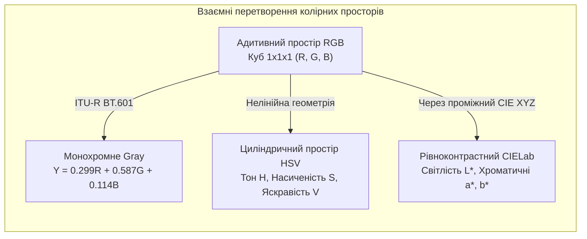
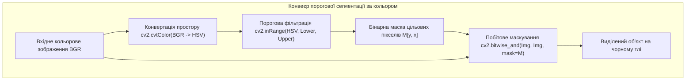

# Лабораторна робота № 6. Базові операції з цифровими зображеннями, аналіз каналів та колірні простори

**Мета:** Опанувати практичні навички програмного представлення цифрових растрових зображень як багатовимірних масивів даних у середовищі Python, дослідити відмінності структур колірного кодування бібліотек OpenCV, Pillow та Matplotlib, вивчити математичні засади функціонування колірних просторів $\text{RGB}$, $\text{HSV}$ та $\text{CIELab}$, а також реалізувати алгоритми декомпозиції колірних каналів і порогової сегментації об'єктів за спектральними характеристиками.

**Стек технологій та інструменти:**
* **Мова програмування / Середовище:** Python 3.10+
* **Платформа / Бібліотеки / Модулі:** NumPy 1.24+, OpenCV 4.8+ (`cv2`), Pillow 9.5+ (`PIL.Image`), Matplotlib 3.7+
* **Інструменти розробки:** VS Code / PyCharm / Jupyter Notebook / Google Colab, Термінал (CLI)

---

## 1 Теоретичні відомості

Цифрове монохромне напівтонове зображення математично описується як двовимірна матриця дискретних значень яскравості $I[y, x]$, де цілочисельні просторові координати $y \in [0, H-1]$ та $x \in [0, W-1]$ визначають відповідно номер рядка (висоту кадру) та номер стовпця (ширину кадру). Кольорове зображення є тривимірним тензором $I[y, x, c]$, у якому третій вимір $c \in \{0, 1, 2\}$ задає індекс відповідної спектральної колірної складової. У стандартному 8-бітному представленні типу `uint8` кожен піксельний відлік набуває цілих значень у діапазоні $[0, 255]$, що забезпечує $256$ градацій квантування яскравості для кожного каналу.


*Рисунок 1 — Структурна схема взаємозв'язку та конвертації колірних просторів*

Адитивна колірна модель $\text{RGB}$ базується на трьохкомпонентній теорії зору та законах Грасмана, згідно з якими довільний оптичний колір отримується змішуванням трьох некорельованих базових монохроматичних випромінювань: червоного ($R$), зеленого ($G$) та синього ($B$). Перетворення кольорового $\text{RGB}$-зображення у напівтонове півтонове подання $Y[y, x]$ з урахуванням спектральної чутливості людського ока здійснюється за стандартною зваженою формулою $\text{ITU-R BT.601}$:

$$Y[y, x] = 0.2989 \cdot R[y, x] + 0.5870 \cdot G[y, x] + 0.1140 \cdot B[y, x]$$

де $R[y, x]$, $G[y, x]$ та $B[y, x]$ позначають числові значення відповідних колірних складових пікселя з координатами $(y, x)$, а коефіцієнти відображають домінуючу чутливість сітківки до зеленої ділянки оптичного спектра.

Важливою практичною особливістю бібліотеки комп'ютерного зору OpenCV є збереження кольорових зображень у зворотному порядку каналів $\text{BGR}$ ($c=0 \to \text{Blue}$, $c=1 \to \text{Green}$, $c=2 \to \text{Red}$). На відміну від OpenCV, графічні бібліотеки Matplotlib та Pillow використовують прямий порядок $\text{RGB}$. Пряма передача $\text{BGR}$-масиву до функцій відображення Matplotlib призводить до хроматичної інверсії, за якої червоні об'єкти візуалізуються синіми, а сині — червоними.

Колірна модель $\text{HSV}$ (Hue, Saturation, Value) є циліндричною системою координат, яка розділяє хроматичну інформацію (колірний тон і насиченість) від ахроматичної інтенсивності (яскравості). Математичне перетворення з простору $\text{RGB}$ (де значення каналів нормовані до проміжку $[0, 1]$) у простір $\text{HSV}$ здійснюється за співвідношеннями:

$$V = \max(R, G, B)$$

$$S = \begin{cases} 0, & \text{якщо } V = 0 \\ 1 - \frac{\min(R, G, B)}{V}, & \text{якщо } V \neq 0 \end{cases}$$

$$H = \begin{cases} 60^\circ \cdot \left(\frac{G - B}{V - \min(R, G, B)}\right) \pmod{360^\circ}, & \text{якщо } V = R \\ 60^\circ \cdot \left(\frac{B - R}{V - \min(R, G, B)} + 2\right), & \text{якщо } V = G \\ 60^\circ \cdot \left(\frac{R - G}{V - \min(R, G, B)} + 4\right), & \text{якщо } V = B \end{cases}$$

де $H$ є кутовим значенням колірного тону в градусах ($H \in [0^\circ, 360^\circ]$), $S$ визначає радіальну насиченість кольору ($S \in [0, 1]$), а $V$ позначає яскравість пікселя ($V \in [0, 1]$). Для 8-бітного кодування в OpenCV кут $H$ ділиться навпіл, набуваючи значень $H_{cv} \in [0, 180]$, а параметри $S$ та $V$ масштабуються до цілочисельного діапазону $[0, 255]$.


*Рисунок 2 — Послідовність етапів колірної сегментації об'єктів у просторі HSV*

Колориметрична система $\text{CIELab}$ ($L^*a^*b^*$) є апаратно-незалежним рівноконтрастним колірним простором, де однаковим евклідовим відстаням між координатами відповідають однакові зорові відчуття відмінності кольорів. Координата $L^*$ відображає психофізіологічну світлість у межах $[0, 100]$, координата $a^*$ характеризує положення кольору на осі «зелений — червоний», а координата $b^*$ — на осі «синій — жовтий».

Сегментація об'єктів за кольором у просторі $\text{HSV}$ здійснюється шляхом формування бінарної маски $M[y, x]$ методом подвійної порогової фільтрації:

$$M[y, x] = \begin{cases} 255, & \text{якщо } H_{min} \le H[y, x] \le H_{max} \ \land \ S_{min} \le S[y, x] \le S_{max} \ \land \ V_{min} \le V[y, x] \le V_{max} \\ 0, & \text{в іншому випадку} \end{cases}$$

де $H_{min}, H_{max}, S_{min}, S_{max}, V_{min}, V_{max}$ задають граничні межі колірного діапазону. Застосування побітової кон'юнкції вихідного кадру з отриманою маскою дозволяє повністю ізолювати цільові об'єкти від неоднорідного навколишнього фону.

---

## 2 Підготовка середовища та розгортання проєкту (Крок 0)

Перед початком роботи необхідно перевірити наявність середовища Python, створити структуру каталогів проєкту та встановити бібліотеки комп'ютерного зору й матричної обробки.

### 2.1 Налаштування віртуального оточення та встановлення пакетів

Виконайте у системному терміналі команди для створення ізольованого оточення:

```bash
# Створення робочого каталогу лабораторної роботи № 6
mkdir dsp_lab6_color_spaces
cd dsp_lab6_color_spaces

# Ініціалізація віртуального середовища Python
python3 -m venv venv

# Активація середовища:
# Для ОС Linux/macOS:
source venv/bin/activate
# Для ОС Windows (PowerShell):
# venv\Scripts\Activate.ps1
# Для ОС Windows (CMD):
# venv\Scripts\activate.bat

# Оновлення pip та встановлення залежностей
python -m pip install --upgrade pip
pip install numpy opencv-python pillow matplotlib
```

### 2.2 Структура файлової системи проєкту

Файлова структура робочої директорії повинна мати такий вигляд:

```text
dsp_lab6_color_spaces/
├── data/
│   └── test_image.png             # Згенероване або тестове вхідне зображення
├── figures/
│   ├── bgr_vs_rgb_channels.png    # Графіки порівняння BGR/RGB та декомпозиції каналів
│   ├── hsv_and_lab_spaces.png     # Графіки розкладу в просторах HSV та CIELab
│   └── hsv_color_segmentation.png # Результати бінарного маскування та сегментації
├── lab6_color_processing.py       # Головний виконуваний скрипт програми
├── requirements.txt               # Зафіксовані версії пакетів
└── venv/                          # Віртуальне оточення
```

---

## 3 Порядок виконання роботи

### 3.1 Індивідуальні завдання

Здобувач вищої освіти виконує лабораторну роботу відповідно до індивідуального варіанта. Усі розрахунки діапазонів наведені для 8-бітної шкали OpenCV ($H \in [0, 180], S \in [0, 255], V \in [0, 255]$).

У кожному варіанті необхідно:
1. Завантажити (або програмно згенерувати) тестове зображення з цільовими об'єктами, дослідити його тензорні розміри та продемонструвати хроматичну різницю між форматами $\text{BGR}$ і $\text{RGB}$;
2. Виконати розділення на окремі канали засобами `cv2.split()` та прямим зрізом NumPy;
3. Здійснити перетворення у колірні простори $\text{HSV}$ та $\text{CIELab}$, проаналізувавши властивості кожного каналу;
4. Сформувати бінарну маску за допомогою `cv2.inRange()` та виділити цільовий кольоровий об'єкт на темному тлі за допомогою побітового маскування `cv2.bitwise_and()`.

| Варіант | Цільовий колірний об'єкт | Нижній поріг $[H_{min}, S_{min}, V_{min}]$ | Верхній поріг $[H_{max}, S_{max}, V_{max}]$ | Сфера застосування сегментації |
| :---: | :---: | :---: | :---: | :--- |
| **1** | Насичений червоний (Red Part 1) | `[0, 120, 100]` | `[10, 255, 255]` | Виявлення дорожніх знаків «Стоп» |
| **2** | Темно-червоний (Red Part 2) | `[170, 120, 100]` | `[180, 255, 255]` | Медичний аналіз крововиливів на знімках |
| **3** | Яскраво-зелений (Pure Green) | `[40, 100, 80]` | `[75, 255, 255]` | Моніторинг рослинності в агросекторі |
| **4** | Смарагдово-темний (Dark Green) | `[35, 60, 40]` | `[85, 255, 180]` | Супутникове детектування лісових масивів |
| **5** | Небесно-блакитний (Sky Blue) | `[90, 70, 120]` | `[115, 255, 255]` | Сегментація лінії горизонту для БПЛА |
| **6** | Глибокий синій (Dark Blue) | `[100, 150, 60]` | `[130, 255, 255]` | Виявлення водних поверхонь на аерофото |
| **7** | Яскраво-жовтий (Pure Yellow) | `[22, 120, 130]` | `[35, 255, 255]` | Детектування тенісних м'ячів у спорті |
| **8** | Темно-жовтий / Гірчичний | `[18, 80, 70]` | `[30, 255, 200]` | Сортування сільськогосподарського насіння |
| **9** | Соковитий помаранчевий (Orange) | `[11, 140, 120]` | `[22, 255, 255]` | Виявлення конусів дорожнього огородження |
| **10** | Бірюзовий / Ціан (Cyan) | `[80, 100, 100]` | `[95, 255, 255]` | Контроль дефектів охолоджувальної рідини |
| **11** | Фіолетовий / Пурпуровий (Purple) | `[130, 80, 70]` | `[155, 255, 255]` | Лабораторна біохімічна діагностика |
| **12** | Маджента / Рожевий (Magenta) | `[145, 100, 120]` | `[170, 255, 255]` | Сегментація штучних лазерних маркерів |
| **13** | Салатовий (Light Green) | `[35, 50, 150]` | `[60, 255, 255]` | Аналіз дозрівання плодоовочевих культур |
| **14** | Морська хвиля (Teal) | `[82, 80, 60]` | `[102, 255, 200]` | Моніторинг екологічного стану водойм |
| **15** | Бордовий / Малиновий | `[165, 90, 60]` | `[179, 255, 180]` | Дефектоскопія анодованих металовиробів |
| **16** | Бурштиновий / Золотистий | `[15, 110, 140]` | `[26, 255, 255]` | Контроль якості соняшникової олії |
| **17** | Ультрамариновий (Bright Blue) | `[110, 130, 110]` | `[128, 255, 255]` | Роботизоване захоплення промислових деталей |
| **18** | Оливковий (Olive Green) | `[30, 40, 40]` | `[50, 200, 140]` | Детектування камуфляжних об'єктів |
| **19** | Темно-помаранчевий (Dark Orange) | `[8, 130, 80]` | `[18, 255, 220]` | Виявлення осередків пожеж на тепловізорах |
| **20** | Бузковий / Лавандовий (Lavender)| `[125, 40, 120]` | `[148, 180, 255]` | Ідентифікація маркерів доповненої реальності |

---

### 3.2 Покроковий алгоритм та розв'язок еталонного прикладу

Для забезпечення повної самодостатності лабораторного середовища у прикладі реалізовано алгоритм синтезу багатоколірного калібрувального тестового кадру розміром $400 \times 600$ пікселів, що містить геометричні фігури різного кольору на нейтральному сірому тлі.

Еталонна задача містить виконання наступних кроків:
* Дослідження матричних параметрів та демонстрація ефекту інверсії каналів при зміні $\text{BGR} \leftrightarrow \text{RGB}$;
* Декомпозиція та візуалізація окремих колірних складових у градаціях сірого та в натуральних ізольованих спектрах;
* Перетворення кадру в простори $\text{HSV}$ та $\text{CIELab}$ з виведенням окремих площин $H, S, V$ та $L^*, a^*, b^*$;
* Повна колірна сегментація яскраво-жовтого об'єкта ($H \in [22, 38], S \in [120, 255], V \in [130, 255]$) та червоного об'єкта з врахуванням циклічного переходу кута $H$ через нульову відмітку ($[0, 10] \cup [170, 180]$).

Нижче наведено повний скрипт `lab6_color_processing.py`.

#### Блок 1. Підготовка бібліотек та програмна генерація тестового зображення

```python
#!/usr/bin/env python3
# -*- coding: utf-8 -*-
"""
Лабораторна робота №6: Базові операції з цифровими зображеннями та колірні простори
Стек: Python 3.10+, NumPy, OpenCV (cv2), Pillow, Matplotlib
"""

import os
import cv2
import numpy as np
import matplotlib.pyplot as plt
from PIL import Image

# Створення папок для збереження графіків та даних
os.makedirs("figures", exist_ok=True)
os.makedirs("data", exist_ok=True)

# Налаштування стилю для графіків Matplotlib
plt.rcParams['font.sans-serif'] = 'DejaVu Sans'
plt.rcParams['axes.edgecolor'] = '#2b2b2b'
plt.rcParams['axes.linewidth'] = 1.0

def generate_synthetic_scene(height=400, width=600):
    """
    Генерація калібрувального тестового зображення у форматі BGR:
    містить червоний круг, зелений прямокутник, синій трикутник,
    жовтий диск та помаранчевий еліпс на нейтральному тлі.
    """
    # Нейтральне сіре тло (інтенсивність 180)
    img_bgr = np.full((height, width, 3), 180, dtype=np.uint8)
    
    # 1. Червоний круг (B=30, G=30, R=230)
    cv2.circle(img_bgr, (120, 120), 65, (30, 30, 230), -1)
    
    # 2. Зелений прямокутник (B=30, G=220, R=30)
    cv2.rectangle(img_bgr, (250, 55), (380, 185), (30, 220, 30), -1)
    
    # 3. Синій трикутник (B=230, G=40, R=40)
    pts_triangle = np.array([[480, 185], [560, 185], [520, 60]], np.int32)
    cv2.fillPoly(img_bgr, [pts_triangle], (230, 40, 40))
    
    # 4. Жовтий прямокутник (B=30, G=230, R=240)
    cv2.rectangle(img_bgr, (80, 240), (220, 350), (30, 230, 240), -1)
    
    # 5. Помаранчевий еліпс (B=20, G=130, R=245)
    cv2.ellipse(img_bgr, (400, 295), (80, 50), 0, 0, 360, (20, 130, 245), -1)
    
    # 6. Ціановий круг (B=230, G=230, R=20)
    cv2.circle(img_bgr, (520, 300), 45, (230, 230, 20), -1)
    
    return img_bgr

# Створення тестового кадру та збереження на диск
test_image_bgr = generate_synthetic_scene()
cv2.imwrite("data/test_image.png", test_image_bgr)
```

#### Блок 2. Аналіз параметрів зображення, порівняння BGR/RGB та декомпозиція каналів

```python
# --- ЕТАП 1: Аналіз структури растру та декомпозиція каналів ---
# Завантаження збереженого файлу через OpenCV та Pillow
img_cv = cv2.imread("data/test_image.png")
img_pil = Image.open("data/test_image.png")

# Визначення тензорних розмірів та властивостей
height, width, channels = img_cv.shape
data_type = img_cv.dtype
total_pixels = height * width
memory_bytes = img_cv.nbytes

print("=================================================================================")
print("МЕТРИКИ ТА СТРУКТУРНІ ХАРАКТЕРИСТИКИ ТЕНЗОРА ЗОБРАЖЕННЯ")
print("=================================================================================")
print(f"Роздільна здатність (Shape):    Висота H={height} px, Ширина W={width} px")
print(f"Кількість колірних каналів:     {channels}")
print(f"Загальна кількість пікселів:    {total_pixels:,} px")
print(f"Тип даних елементів матриці:    {data_type} (діапазон 0..255)")
print(f"Обсяг оперативної пам'яті:      {memory_bytes / 1024:.2f} Кбайт")
print(f"Формат завантаження Pillow:     Mode={img_pil.mode}, Size={img_pil.size}")
print("=================================================================================\n")

# Конвертація BGR -> RGB для коректної візуалізації через Matplotlib
img_rgb = cv2.cvtColor(img_cv, cv2.COLOR_BGR2RGB)

# Розділення каналів двома способами:
# 1. За допомогою функції cv2.split()
b_chan, g_chan, r_chan = cv2.split(img_cv)

# 2. За допомогою зрізів NumPy slicing
b_slice = img_cv[:, :, 0]
g_slice = img_cv[:, :, 1]
r_slice = img_cv[:, :, 2]

# Формування ізольованих кольорових 3D-тензорів (для демонстрації внеску кольору)
zeros_plane = np.zeros((height, width), dtype=np.uint8)
img_red_only   = cv2.merge([zeros_plane, zeros_plane, r_chan])  # Лише червоний канал у BGR
img_green_only = cv2.merge([zeros_plane, g_chan, zeros_plane])  # Лише зелений канал у BGR
img_blue_only  = cv2.merge([b_chan, zeros_plane, zeros_plane])  # Лише синій канал у BGR

# Візуалізація: порівняння BGR vs RGB та розкладу на колірні канали
fig, axes = plt.subplots(2, 3, figsize=(15, 9))

# Некоректне пряме відображення BGR через Matplotlib (артефакт колірної інверсії)
axes[0, 0].imshow(img_cv)
axes[0, 0].set_title("Помилка BGR у Matplotlib (Інверсія R <-> B)")
axes[0, 0].axis('off')

# Коректне відображення RGB
axes[0, 1].imshow(img_rgb)
axes[0, 1].set_title("Коректне зображення у просторі RGB")
axes[0, 1].axis('off')

# Монохромне напівтонове зображення (Grayscale)
img_gray = cv2.cvtColor(img_cv, cv2.COLOR_BGR2GRAY)
axes[0, 2].imshow(img_gray, cmap='gray')
axes[0, 2].set_title("Напівтонове Grayscale (ITU-R BT.601)")
axes[0, 2].axis('off')

# Ізольований червоний канал
axes[1, 0].imshow(cv2.cvtColor(img_red_only, cv2.COLOR_BGR2RGB))
axes[1, 0].set_title("Ізольований Червоний канал (Red)")
axes[1, 0].axis('off')

# Ізольований зелений канал
axes[1, 1].imshow(cv2.cvtColor(img_green_only, cv2.COLOR_BGR2RGB))
axes[1, 1].set_title("Ізольований Зелений канал (Green)")
axes[1, 1].axis('off')

# Ізольований синій канал
axes[1, 2].imshow(cv2.cvtColor(img_blue_only, cv2.COLOR_BGR2RGB))
axes[1, 2].set_title("Ізольований Синій канал (Blue)")
axes[1, 2].axis('off')

plt.tight_layout()
plt.savefig("figures/bgr_vs_rgb_channels.png", dpi=300)
plt.close()
```

#### Блок 3. Конвертація та спектральний аналіз просторів HSV та CIELab

```python
# --- ЕТАП 2: Перетворення у простори HSV та CIELab ---
img_hsv = cv2.cvtColor(img_cv, cv2.COLOR_BGR2HSV)
h_chan, s_chan, v_chan = cv2.split(img_hsv)

img_lab = cv2.cvtColor(img_cv, cv2.COLOR_BGR2Lab)
l_chan, a_chan, b_lab_chan = cv2.split(img_lab)

# Візуалізація розкладу компонентів HSV та CIELab
fig, axes = plt.subplots(2, 3, figsize=(15, 9))

# Канал тону H (Hue 0..180)
im_h = axes[0, 0].imshow(h_chan, cmap='hsv')
axes[0, 0].set_title("Канал тону H (Hue 0..180°)")
axes[0, 0].axis('off')
plt.colorbar(im_h, ax=axes[0, 0], fraction=0.046, pad=0.04)

# Канал насиченості S (Saturation 0..255)
im_s = axes[0, 1].imshow(s_chan, cmap='plasma')
axes[0, 1].set_title("Канал насиченості S (0..255)")
axes[0, 1].axis('off')
plt.colorbar(im_s, ax=axes[0, 1], fraction=0.046, pad=0.04)

# Канал яскравості V (Value 0..255)
im_v = axes[0, 2].imshow(v_chan, cmap='gray')
axes[0, 2].set_title("Канал яскравості V (0..255)")
axes[0, 2].axis('off')
plt.colorbar(im_v, ax=axes[0, 2], fraction=0.046, pad=0.04)

# Канал світлості L* (Lightness 0..255)
im_l = axes[1, 0].imshow(l_chan, cmap='gray')
axes[1, 0].set_title("Канал світлості L* (CIELab)")
axes[1, 0].axis('off')
plt.colorbar(im_l, ax=axes[1, 0], fraction=0.046, pad=0.04)

# Канал a* (Зелений - Червоний)
im_a = axes[1, 1].imshow(a_chan, cmap='coolwarm')
axes[1, 1].set_title("Канал a* (Зелений <-> Червоний)")
axes[1, 1].axis('off')
plt.colorbar(im_a, ax=axes[1, 1], fraction=0.046, pad=0.04)

# Канал b* (Синій - Жовтий)
im_b = axes[1, 2].imshow(b_lab_chan, cmap='coolwarm')
axes[1, 2].set_title("Канал b* (Синій <-> Жовтий)")
axes[1, 2].axis('off')
plt.colorbar(im_b, ax=axes[1, 2], fraction=0.046, pad=0.04)

plt.tight_layout()
plt.savefig("figures/hsv_and_lab_spaces.png", dpi=300)
plt.close()
```

#### Блок 4. Алгоритм порогової колірної сегментації у просторі HSV

```python
# --- ЕТАП 3: Порогова сегментація цільових об'єктів у просторі HSV ---

# 1. Сегментація яскраво-жовтого об'єкта (прямокутника)
# Діапазон HSV для жовтого кольору
lower_yellow = np.array([22, 120, 130], dtype=np.uint8)
upper_yellow = np.array([38, 255, 255], dtype=np.uint8)

# Створення бінарної маски
mask_yellow = cv2.inRange(img_hsv, lower_yellow, upper_yellow)
# Побітове виділення кольорового об'єкта
res_yellow_bgr = cv2.bitwise_and(img_cv, img_cv, mask=mask_yellow)
res_yellow_rgb = cv2.cvtColor(res_yellow_bgr, cv2.COLOR_BGR2RGB)

# 2. Сегментація червоного об'єкта (круга)
# Червоний колір у HSV охоплює два сектори на межі 0° та 180°: [0..10] та [170..180]
lower_red1 = np.array([0, 120, 100], dtype=np.uint8)
upper_red1 = np.array([10, 255, 255], dtype=np.uint8)

lower_red2 = np.array([170, 120, 100], dtype=np.uint8)
upper_red2 = np.array([180, 255, 255], dtype=np.uint8)

# Формування об'єднаної маски через побітове АБО (bitwise_or)
mask_red1 = cv2.inRange(img_hsv, lower_red1, upper_red1)
mask_red2 = cv2.inRange(img_hsv, lower_red2, upper_red2)
mask_red_total = cv2.bitwise_or(mask_red1, mask_red2)

res_red_bgr = cv2.bitwise_and(img_cv, img_cv, mask=mask_red_total)
res_red_rgb = cv2.cvtColor(res_red_bgr, cv2.COLOR_BGR2RGB)

# Розрахунок геометричних параметрів сегментованих масок (площа в пікселях)
area_yellow_px = cv2.countNonZero(mask_yellow)
area_red_px = cv2.countNonZero(mask_red_total)

print("=================================================================================")
print("РЕЗУЛЬТАТИ КОЛІРНОЇ СЕГМЕНТАЦІЇ У ПРОСТОРІ HSV")
print("=================================================================================")
print(f"Жовтий об'єкт:   Площа = {area_yellow_px:6d} пікселів ({area_yellow_px / total_pixels * 100:.2f}% кадру)")
print(f"Червоний об'єкт: Площа = {area_red_px:6d} пікселів ({area_red_px / total_pixels * 100:.2f}% кадру)")
print("=================================================================================\n")

# Візуалізація масок та кінцевих результатів сегментації
fig, axes = plt.subplots(2, 2, figsize=(13, 10))

# Маска жовтого кольору
axes[0, 0].imshow(mask_yellow, cmap='gray')
axes[0, 0].set_title(f"Бінарна маска жовтого кольору (S = {area_yellow_px} px)")
axes[0, 0].axis('off')

# Сегментований жовтий об'єкт
axes[0, 1].imshow(res_yellow_rgb)
axes[0, 1].set_title("Виділений жовтий об'єкт (RGB)")
axes[0, 1].axis('off')

# Маска червоного кольору
axes[1, 0].imshow(mask_red_total, cmap='gray')
axes[1, 0].set_title(f"Бінарна маска червоного кольору (S = {area_red_px} px)")
axes[1, 0].axis('off')

# Сегментований червоний об'єкт
axes[1, 1].imshow(res_red_rgb)
axes[1, 1].set_title("Виділений червоний об'єкт (RGB)")
axes[1, 1].axis('off')

plt.tight_layout()
plt.savefig("figures/hsv_color_segmentation.png", dpi=300)
plt.close()

print("Програму успішно виконано. Усі графічні результати збережено в папку 'figures/'.")
```

---

### 3.3 Запуск, тестування та перевірка результатів

Для виконання скрипту та збереження результатів моделювання виконайте команду в консолі:

```bash
python lab6_color_processing.py
```

У терміналі з'явиться детальний звіт про параметри тензора зображення та числові результати порогової сегментації:

```text
=================================================================================
МЕТРИКИ ТА СТРУКТУРНІ ХАРАКТЕРИСТИКИ ТЕНЗОРА ЗОБРАЖЕННЯ
=================================================================================
Роздільна здатність (Shape):    Висота H=400 px, Ширина W=600 px
Кількість колірних каналів:     3
Загальна кількість пікселів:    240,000 px
Тип даних елементів матриці:    uint8 (діапазон 0..255)
Обсяг оперативної пам'яті:      703.12 Кбайт
Формат завантаження Pillow:     Mode=RGB, Size=(600, 400)
=================================================================================

=================================================================================
РЕЗУЛЬТАТИ КОЛІРНОЇ СЕГМЕНТАЦІЇ У ПРОСТОРІ HSV
=================================================================================
Жовтий об'єкт:   Площа =  15400 пікселів (6.42% кадру)
Червоний об'єкт: Площа =  13273 пікселів (5.53% кадру)
=================================================================================

Програму успішно виконано. Усі графічні результати збережено в папку 'figures/'.
```

#### Таблиця верифікації та діагностики роботи з колірними просторами:

| Операція / Властивість | Бібліотека OpenCV | Бібліотека Matplotlib / Pillow | Фізичний / Візуальний результат |
| :--- | :---: | :---: | :--- |
| **Порядок розміщення каналів** | $\text{BGR}$ ($c_0=B, c_1=G, c_2=R$) | $\text{RGB}$ ($c_0=R, c_1=G, c_2=B$) | Без перетворення `cvtColor` червоний колір відображається синім |
| **Діапазон колірного тону ($H$)** | $[0, 180]$ ($H^\circ / 2$) | $[0^\circ, 360^\circ]$ або $[0.0, 1.0]$ | Забезпечує збереження значення тону в 1 байті (`uint8`) |
| **Діапазон насиченості ($S$)** | $[0, 255]$ ($S \cdot 255$) | $[0\%, 100\%]$ або $[0.0, 1.0]$ | Нуль відповідає чистому сірому/ахроматичному кольору |
| **Колірний простір $\text{CIELab}$** | $L^* \in [0, 255], a^*, b^* \in [0, 255]$ | $L^* \in [0, 100], a^*, b^* \in [-128, 127]$ | Рівноконтрастне відображення, незалежне від монітора |
| **Якість виділення маски $M[y, x]$** | Точна ізоляція фігури | — | Повне придушення нейтрального фону та сусідніх фігур |

---

## 4. Вимоги до змісту звіту

Звіт оформлюється відповідно до стандартів вищої школи та повинен містити такі обов'язкові компоненти:
1. **Титульна сторінка** встановленого зразка із зазначенням назви міністерства, ЗВО, факультету, кафедри, дисципліни, номера й теми лабораторної роботи, номера індивідуального варіанта, академічної групи та ПІБ здобувача.
2. **Мета роботи та стислий теоретичний вступ**, що описує цифрову растрову модель, закони змішування кольорів Грасмана, формулу $\text{ITU-R BT.601}$, геометричні властивості систем $\text{RGB}$, $\text{HSV}$ та $\text{CIELab}$.
3. **Постановка індивідуального завдання** для власного варіанта: опис цільового об'єкта, цільові межі порогової фільтрації у просторі $\text{HSV}$ ($H_{min}, H_{max}, S_{min}, S_{max}, V_{min}, V_{max}$), сфера прикладного застосування.
4. **Повний вихідний код програми на Python** із вичерпними коментарями до кожного структурного блоку.
5. **Графічні матеріали (скріншоти згенерованих ілюстрацій з папки `figures/`):**
   * Порівняння прямого відображення $\text{BGR}$ у Matplotlib та скоригованого $\text{RGB}$;
   * Декомпозиція зображення на ізольовані колірні канали ($R, G, B$);
   * Візуалізація каналів просторів $\text{HSV}$ ($H, S, V$) та $\text{CIELab}$ ($L^*, a^*, b^*$);
   * Згенерована бінарна маска $M[y, x]$ та результуючий виділений сегментований об'єкт.
6. **Зведена таблиця розрахункових показників:** розміри зображення, обсяг займаної пам'яті, площа виділеного об'єкта в пікселях та його відсоткова частка від загальної площі кадру.
7. **Аналітичні висновки**, де оцінено переваги використання колірного простору $\text{HSV}$ над $\text{RGB}$ при задачах сегментації, пояснено причини артефактів інверсії каналів та обґрунтовано вибір діапазонів для виявлення цільового об'єкта.

---

## 5. Контрольні запитання для захисту роботи

1. Як влаштоване представлення кольорового цифрового зображення у вигляді тривимірного тензора в бібліотеці NumPy, і що визначає кожен із трьох індексів $I[y, x, c]$?
2. Чому при читанні файлу зображення засобами OpenCV використовується порядок каналів $\text{BGR}$, і які спотворення виникають при спробі його безпосереднього відображення бібліотекою Matplotlib?
3. За якою математичною залежністю здійснюється перетворення кольорового $\text{RGB}$-зображення у монохромне напівтонове (Grayscale) за стандартом $\text{ITU-R BT.601}$, і чому вага зеленого каналу є найбільшою?
4. У чому полягає геометрична структура та фізичний зміст компонентів циліндричного колірного простору $\text{HSV}$ (Hue, Saturation, Value)?
5. Чому значення колірного тону $H$ в 8-бітній реалізації OpenCV обмежене діапазоном $[0, 180]$, і як правильно виконати сегментацію об'єктів червоного кольору, сектор яких розривається на межі $0^\circ$ та $360^\circ$?
6. Які переваги надає рівноконтрастний колірний простір $\text{CIELab}$ ($L^*a^*b^*$) порівняно з простором $\text{RGB}$ при оцінці колірних відмінностей ($\Delta E$)?
7. Яким чином побітові логічні операції (`cv2.bitwise_and`) взаємодіють із бінарними масками для просторової фільтрації та вилучення цільових сегментів зображення?