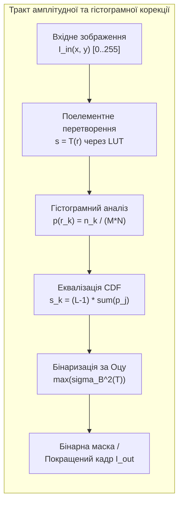
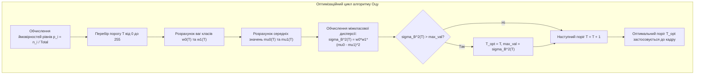

# Лабораторна робота № 7. Амплітудні перетворення, еквалізація гістограм та бінаризація методом Оцу

**Мета:** Дослідити фундаментальні алгоритми поелементної амплітудної корекції монохромних цифрових зображень, опанувати математичні методи розрахунку та аналізу гістограм яскравості, реалізувати лінійне контрастування та нелінійну гамма-корекцію з використанням таблиць пошуку ($\text{LUT}$), засвоїти алгоритм глобальної еквалізації гістограм для розширення динамічного діапазону, а також порівняти ефективність глобальної порогової обробки, автоматичного методу міжкласової дисперсії Оцу та локальної адаптивної бінаризації на зображеннях із нерівномірним освітленням.

**Стек технологій та інструменти:**
* **Мова програмування / Середовище:** Python 3.10+
* **Платформа / Бібліотеки / Модулі:** OpenCV 4.8+ (`cv2`), NumPy 1.24+, Pillow 9.5+ (`PIL.Image`, `PIL.ImageOps`), Matplotlib 3.7+
* **Інструменти розробки:** VS Code / PyCharm / Jupyter Notebook / Google Colab, Термінал (CLI)

---

## 1 Теоретичні відомості

Поелементна амплітудна обробка цифрових напівтонових зображень є сукупністю методів просторової трансформації, за яких нове значення яскравості вихідного пікселя $s = I_{out}(x, y)$ залежить виключно від початкового значення яскравості вхідного пікселя $r = I_{in}(x, y)$ у тій самій просторовій точці $(x, y)$. Математичною моделлю такого перетворення є оператор $s = T(r)$, що відображає множину допустимих рівнів яскравості $[0, L-1]$ у ту саму або розширену числову шкалу (для 8-бітного кодування $L = 256$, тобто $r, s \in [0, 255]$).


*Рисунок 1 — Структурна схема алгоритмів поелементної амплітудної обробки та бінаризації*

Лінійне амплітудне перетворення регулює яскравість (зміщення $b$) та контрастність (масштабний коефіцієнт $k$) зображення за виразом:

$$s = \text{clip}(k \cdot r + b, 0, L-1) = \begin{cases} 0, & \text{якщо } k \cdot r + b < 0 \\ 255, & \text{якщо } k \cdot r + b > 255 \\ k \cdot r + b, & \text{в інших випадках} \end{cases}$$

де $k$ позначає коефіцієнт нахилу передавальної характеристики (коефіцієнт контрасту), $b$ представляє величину адитивного зсуву (коефіцієнт яскравості), а операція $\text{clip}$ запобігає переповненню розрядної сітки `uint8`.

Степеневе нелінійне перетворення (гамма-корекція) враховує нелінійність сприйняття оптичного випромінювання людським оком та передавальних функцій дисплеїв:

$$s = (L - 1) \cdot \left(\frac{r}{L - 1}\right)^\gamma = 255 \cdot \left(\frac{r}{255}\right)^\gamma$$

де $\gamma$ є дійсним показником степеня гамма-корекції. При значеннях $\gamma < 1$ характеристика має опуклий вигляд, що призводить до висвітлення темних областей за рахунок розтягування темних тонів. При значеннях $\gamma > 1$ крива набуває увігнутої форми, що забезпечує затемнення пересвітлених фрагментів кадру та підвищення деталізації у світлих областях. Для мінімізації обчислювальних витрат операція реалізується через заздалегідь розраховану таблицю підстановки (Look-Up Table — LUT) розміром $256$ елементів.

Гістограма цифрового монохромного зображення розміром $M \times N$ пікселів являє собою дискретний розподіл кількості елементів за кожним із $L$ рівнів яскравості:

$$h(r_k) = n_k, \quad k = 0, 1, \dots, L-1$$

де $r_k$ позначає $k$-й рівень квантування яскравості, а $n_k$ — сумарну кількість пікселів у зображенні, що мають рівень яскравості $r_k$. 

Нормована гістограма $p(r_k) = \frac{n_k}{M \cdot N}$ визначає статистичну оцінку ймовірності появи відповідного рівня яскравості. Глобальна еквалізація гістограми (histogram equalization) виконує нелінійне перетворення рівнів на основі дискретної кумулятивної функції розподілу (Cumulative Distribution Function — CDF):

$$s_k = T(r_k) = (L - 1) \sum_{j=0}^{k} p(r_j) = \frac{L - 1}{M \cdot N} \sum_{j=0}^{k} n_j, \quad k = 0, 1, \dots, L-1$$

де $s_k$ позначає нове проквантоване значення рівня сірого для пікселів із початковою яскравістю $r_k$. У результаті еквалізації гістограма набуває форми, наближеної до рівномірного розподілу, що максимізує інформаційну ентропію зображення та суттєво підвищує візуальний контраст малопомітних деталей.


*Рисунок 2 — Алгоритмічна блок-схема автоматичного пошуку порогу бінаризації за методом Оцу*

Бінаризація зображення полягає у сегментації пікселів на два взаємовиключні класи: об'єкти переднього плану (foreground, логічна одиниця або $255$) та фонову область (background, логічний нуль). Автоматичний метод Оцу (Otsu's thresholding) знаходить оптимальний поріг $T^*$, максимізуючи міжкласову дисперсію $\sigma_B^2(T)$:

$$\sigma_B^2(T) = \omega_0(T) \cdot (\mu_0(T) - \mu_T)^2 + \omega_1(T) \cdot (\mu_1(T) - \mu_T)^2 = \omega_0(T) \cdot \omega_1(T) \cdot (\mu_0(T) - \mu_1(T))^2$$

де $\omega_0(T) = \sum_{i=0}^T p_i$ та $\omega_1(T) = \sum_{i=T+1}^{L-1} p_i$ позначають сумарні ймовірності виникнення пікселів фону та об'єктів відповідно, $\mu_0(T) = \sum_{i=0}^T \frac{i \cdot p_i}{\omega_0(T)}$ та $\mu_1(T) = \sum_{i=T+1}^{L-1} \frac{i \cdot p_i}{\omega_1(T)}$ — їхні середні яскравості, а $\mu_T = \sum_{i=0}^{L-1} i \cdot p_i$ є загальним математичним очікуванням яскравості всього кадру.

У випадках значної просторової неоднорідності освітлення global-методи призводять до спотворень. Тоді застосовують локальну адаптивну бінаризацію, де поріг розраховується індивідуально для кожного пікселя за його околицею розміром $S \times S$:

$$T_{adapt}(x, y) = \text{LocalMean}_{S \times S}(x, y) - C$$

де $\text{LocalMean}_{S \times S}(x, y)$ визначає локальне середнє арифметичне (або зважене за Гауссом) значення яскравості в ковзному блоці непарного розміру $S \times S$, а $C$ позначає константу зміщення, що віднімається від розрахованого значення.

---

## 2 Підготовка середовища та розгортання проєкту (Крок 0)

Перед початком виконання лабораторної роботи необхідно перевірити працездатність інтерпретатора Python, активувати ізольоване віртуальне середовище та встановити бібліотеки обробки зображень.

### 2.1 Налаштування віртуального оточення та встановлення пакетів

Виконайте у терміналі команди створення та активації віртуального середовища:

```bash
# Створення робочого каталогу лабораторної роботи № 7
mkdir dsp_lab7_amplitude_transforms
cd dsp_lab7_amplitude_transforms

# Створення та активація віртуального середовища
python3 -m venv venv

# Активація для Linux/macOS:
source venv/bin/activate
# Активація для Windows (PowerShell):
# venv\Scripts\Activate.ps1
# Активація для Windows (CMD):
# venv\Scripts\activate.bat

# Оновлення pip та встановлення пакетів
python -m pip install --upgrade pip
pip install numpy opencv-python pillow matplotlib
```

### 2.2 Структура файлової системи проєкту

Організуйте файлову структуру каталогу наступним чином:

```text
dsp_lab7_amplitude_transforms/
├── data/
│   └── low_contrast_input.png       # Згенероване низькоконтрастне вхідне зображення
├── figures/
│   ├── histogram_analysis.png       # Гістограми cv2.calcHist та plt.hist
│   ├── linear_and_gamma_transf.png  # Результати лінійного контрастування та гамма-корекції
│   ├── histogram_equalization.png   # Порівняння кадру та гістограми до і після еквалізації
│   └── binarization_methods.png     # Результати фіксованої, Оцу та адаптивної бінаризації
├── lab7_amplitude_processing.py     # Головний виконуваний скрипт програми
├── requirements.txt                 # Зафіксовані залежності
└── venv/                            # Віртуальне оточення
```

---

## 3 Порядок виконання роботи

### 3.1 Індивідуальні завдання

Здобувач вищої освіти виконує лабораторну роботу відповідно до індивідуального варіанта. Усі обчислення виконуються для 8-бітної шкали яскравості $[0, 255]$.

У кожному варіанті досліджуються:
1. Побудова гістограми та функції розподілу яскравості вихідного монохромного зображення;
2. Реалізація лінійного контрастування з параметрами $k, b$ та степеневої гамма-корекції для двох значень $\gamma_1 < 1$ і $\gamma_2 > 1$ за допомогою таблиць $\text{LUT}$;
3. Глобальна еквалізація гістограми з порівняльним аналізом зміни дисперсії та динамічного діапазону;
4. Порівняння результатів сегментації методом глобальної фіксованої бінаризації ($T_{fixed}$), методом Оцу ($T_{Otsu}$) та локальним адаптивним методом з вікном $S \times S$ і зміщенням $C$.

| Варіант | Тип досліджуваного зображення | Коефіцієнти $k, b$ | Показники гамми $\gamma_1, \gamma_2$ | Фіксований поріг $T_{fixed}$ | Розмір вікна $S \times S$, зміщення $C$ |
| :---: | :--- | :---: | :---: | :---: | :---: |
| **1** | Рентгенівський знімок грудної клітини | $k=1.5, b=-25$ | $\gamma_1=0.45, \gamma_2=2.2$ | 110 | $S=21, C=5$ |
| **2** | Магнітно-резонансна томограма мозку | $k=1.8, b=-40$ | $\gamma_1=0.40, \gamma_2=2.5$ | 95 | $S=15, C=4$ |
| **3** | Супутниковий оптичний знімок хмарності | $k=1.4, b=-20$ | $\gamma_1=0.50, \gamma_2=1.8$ | 135 | $S=25, C=7$ |
| **4** | Старовинний сканований рукопис із плямами | $k=2.0, b=-60$ | $\gamma_1=0.35, \gamma_2=2.4$ | 120 | $S=31, C=10$ |
| **5** | Знімок зварного шва з мікротріщинами | $k=1.6, b=-30$ | $\gamma_1=0.55, \gamma_2=2.0$ | 105 | $S=19, C=6$ |
| **6** | Астрономічний знімок туманності | $k=2.2, b=-50$ | $\gamma_1=0.30, \gamma_2=2.8$ | 85 | $S=27, C=5$ |
| **7** | Документ із тінню від смартфона | $k=1.7, b=-35$ | $\gamma_1=0.42, \gamma_2=2.1$ | 125 | $S=35, C=12$ |
| **8** | Комп'ютерна томографія суглоба | $k=1.5, b=-15$ | $\gamma_1=0.48, \gamma_2=1.9$ | 115 | $S=17, C=4$ |
| **9** | Металографічний шліф сплаву | $k=1.9, b=-45$ | $\gamma_1=0.38, \gamma_2=2.6$ | 100 | $S=23, C=8$ |
| **10** | Аерофотознімок лісового пожежного осередку | $k=1.3, b=-10$ | $\gamma_1=0.60, \gamma_2=1.7$ | 140 | $S=29, C=6$ |
| **11** | Електронна мікроскопія наночастинок | $k=2.1, b=-55$ | $\gamma_1=0.32, \gamma_2=2.5$ | 90 | $S=21, C=5$ |
| **12** | Знімок автомобільного номера в сутінках | $k=1.8, b=-35$ | $\gamma_1=0.40, \gamma_2=2.2$ | 110 | $S=25, C=9$ |
| **13** | УЗД-знімок внутрішніх органів | $k=1.4, b=-15$ | $\gamma_1=0.52, \gamma_2=1.8$ | 105 | $S=15, C=3$ |
| **14** | Штрих-код на пом'ятій упаковці | $k=2.3, b=-70$ | $\gamma_1=0.30, \gamma_2=2.7$ | 130 | $S=33, C=11$ |
| **15** | Флуоресцентний знімок клітинної культури | $k=1.6, b=-20$ | $\gamma_1=0.46, \gamma_2=2.0$ | 95 | $S=19, C=4$ |
| **16** | Дорожній знак в умовах туману | $k=2.0, b=-45$ | $\gamma_1=0.36, \gamma_2=2.3$ | 115 | $S=27, C=7$ |
| **17** | Дефектоскопія кремнієвих пластин | $k=1.7, b=-30$ | $\gamma_1=0.44, \gamma_2=2.1$ | 100 | $S=21, C=6$ |
| **18** | Сканований паспорт із захисною сіткою | $k=1.9, b=-50$ | $\gamma_1=0.38, \gamma_2=2.4$ | 125 | $S=31, C=10$ |
| **19** | Інфрачервоний знімок теплотраси | $k=1.5, b=-25$ | $\gamma_1=0.50, \gamma_2=1.9$ | 120 | $S=23, C=5$ |
| **20** | Знімок дефектів лакофарбового покриття | $k=1.6, b=-20$ | $\gamma_1=0.42, \gamma_2=2.2$ | 105 | $S=25, C=8$ |

---

### 3.2 Покроковий алгоритм та розв'язок еталонного прикладу

Для повного відтворення експерименту наведемо еталонний приклад з наступними параметрами:
* Тестове зображення: синтезована монохромна сцена розміром $400 \times 600$ пікселів, що містить темний градієнтний фон (нерівномірне освітлення), низькоконтрастні анатомічні структури та фрагмент тексту;
* Параметри лінійного контрастування: $k = 1.6$, зміщення яскравості $b = -30$;
* Параметри нелінійної гамма-корекції: $\gamma_1 = 0.50$ (висвітлення тіней) та $\gamma_2 = 2.20$ (затемнення фону);
* Параметри бінаризації: фіксований поріг $T_{fixed} = 100$, автоматичний розрахунок за методом Оцу $T_{Otsu}$, адаптивне усереднення з вікном $S = 21$ та константою $C = 5$.

Нижче наведено самодостатній та готовий до запуску скрипт `lab7_amplitude_processing.py`.

#### Блок 1. Підготовка середовища, імпорт модулів та синтез низькоконтрастного зображення

```python
#!/usr/bin/env python3
# -*- coding: utf-8 -*-
"""
Лабораторна робота №7: Амплітудні перетворення, еквалізація гістограм та метод Оцу
Стек: Python 3.10+, OpenCV (cv2), NumPy, Pillow, Matplotlib
"""

import os
import cv2
import numpy as np
import matplotlib.pyplot as plt
from PIL import Image, ImageOps

# Створення робочих директорій
os.makedirs("figures", exist_ok=True)
os.makedirs("data", exist_ok=True)

# Глобальні параметри оформлення графіків
plt.rcParams['font.sans-serif'] = 'DejaVu Sans'
plt.rcParams['axes.edgecolor'] = '#333333'
plt.rcParams['axes.linewidth'] = 1.0
plt.rcParams['grid.color'] = '#cccccc'
plt.rcParams['grid.linestyle'] = '--'
plt.rcParams['grid.alpha'] = 0.7

def generate_low_contrast_scene(height=400, width=600):
    """
    Генерація напівтонового тестового кадру з низьким контрастом
    та сильним градієнтом освітлення зліва направо.
    """
    # Створення плавного фонового градієнта від 40 до 140
    x_grad = np.linspace(40, 140, width, dtype=np.float32)
    bg_gradient = np.tile(x_grad, (height, 1))
    
    img = bg_gradient.copy()
    
    # Додавання низькоконтрастних овальних структур (імітація біооб'єктів)
    cv2.ellipse(img, (180, 200), (90, 130), 30, 0, 360, 85, -1)
    cv2.circle(img, (180, 200), 40, 115, -1)
    
    cv2.ellipse(img, (420, 200), (100, 120), -20, 0, 360, 175, -1)
    cv2.circle(img, (420, 200), 50, 205, -1)
    
    # Нанесення тестового напису
    cv2.putText(img, "DSP & DIP 2026", (130, 360), cv2.FONT_HERSHEY_SIMPLEX, 1.1, 60, 2, cv2.LINE_AA)
    
    # Додавання слабкого шуму для реалістичності сенсора
    np.random.seed(42)
    noise = np.random.normal(0, 3.0, (height, width))
    img_noisy = np.clip(img + noise, 0, 255).astype(np.uint8)
    return img_noisy

# Створення тестового кадру та збереження
img_raw = generate_low_contrast_scene()
cv2.imwrite("data/low_contrast_input.png", img_raw)
```

#### Блок 2. Розрахунок гістограм яскравості та кумулятивних функцій розподілу

```python
# --- ЕТАП 1: Гістограмний аналіз вихідного зображення ---
# 1. Розрахунок ненормованої гістограми засобами OpenCV
hist_cv = cv2.calcHist([img_raw], channels=[0], mask=None, histSize=[256], ranges=[0, 256])

# 2. Розрахунок нормованої гістограми (PDF) та CDF засобами NumPy
hist_np, bin_edges = np.histogram(img_raw.ravel(), bins=256, range=(0, 256), density=True)
cdf_np = hist_np.cumsum()
cdf_normalized = cdf_np / cdf_np[-1]  # Нормування до 1.0

# Статистичні параметри яскравості
mean_gray = np.mean(img_raw)
std_gray = np.std(img_raw)
min_gray = np.min(img_raw)
max_gray = np.max(img_raw)

print("=================================================================================")
print("СТАТИСТИЧНІ ХАРАКТЕРИСТИКИ ЯСКРАВОСТІ ВХІДНОГО ЗОБРАЖЕННЯ")
print("=================================================================================")
print(f"Діапазон яскравості:     [{min_gray}, {max_gray}] (динамічний розмах {max_gray - min_gray} рівнів)")
print(f"Середня яскравість (Mean): {mean_gray:.2f} / 255")
print(f"Стандартне відхилення (Contrast STD): {std_gray:.2f}")
print("=================================================================================\n")

# Візуалізація зображення та його гістограми з кривою CDF
fig, axes = plt.subplots(1, 2, figsize=(14, 5))

axes[0].imshow(img_raw, cmap='gray', vmin=0, vmax=255)
axes[0].set_title("Вхідне низькоконтрастне зображення")
axes[0].axis('off')

# Побудова гістограми та CDF
axes[1].plot(hist_cv, color='#1f77b4', lw=1.5, label='Гістограма $h(r)$ (cv2.calcHist)')
axes[1].set_xlabel("Рівень яскравості, $r$")
axes[1].set_ylabel("Кількість пікселів", color='#1f77b4')
axes[1].set_xlim([0, 255])
axes[1].grid(True)

# Вісь для кумулятивної кривої CDF
ax_cdf = axes[1].twinx()
ax_cdf.plot(cdf_normalized, color='#d62728', lw=2.0, linestyle='--', label='Кумулятивна CDF')
ax_cdf.set_ylabel("Кумулятивна ймовірність", color='#d62728')
ax_cdf.set_ylim([0, 1.05])

axes[1].set_title("Гістограма розподілу рівнів яскравості та крива CDF")
plt.tight_layout()
plt.savefig("figures/histogram_analysis.png", dpi=300)
plt.close()
```

#### Блок 3. Реалізація лінійного контрастування та гамма-корекції через LUT

```python
# --- ЕТАП 2: Лінійне контрастування та гамма-корекція (LUT) ---
k_contrast = 1.6
b_brightness = -30.0
gamma_bright = 0.50  # Висвітлення темних зон
gamma_dark = 2.20    # Затемнення та підвищення різкості світлих зон

# 1. Створення таблиці пошуку LUT для лінійного контрастування
lut_linear = np.array([np.clip(k_contrast * r + b_brightness, 0, 255) for r in range(256)], dtype=np.uint8)
img_linear = cv2.LUT(img_raw, lut_linear)

# 2. Створення таблиць пошуку LUT для гамма-корекції
lut_gamma_05 = np.array([np.clip(255.0 * ((r / 255.0) ** gamma_bright), 0, 255) for r in range(256)], dtype=np.uint8)
lut_gamma_22 = np.array([np.clip(255.0 * ((r / 255.0) ** gamma_dark), 0, 255) for r in range(256)], dtype=np.uint8)

img_gamma_05 = cv2.LUT(img_raw, lut_gamma_05)
img_gamma_22 = cv2.LUT(img_raw, lut_gamma_22)

# Візуалізація передавальних функцій та результатів корекції
fig, axes = plt.subplots(2, 3, figsize=(15, 9))

# Передавальні функції
r_scale = np.arange(256)
axes[0, 0].plot(r_scale, lut_linear, 'b-', lw=1.8, label=f'Лінійна: k={k_contrast}, b={b_brightness}')
axes[0, 0].plot(r_scale, lut_gamma_05, 'g--', lw=1.8, label=f'Гамма $\\gamma={gamma_bright}$')
axes[0, 0].plot(r_scale, lut_gamma_22, 'r-.', lw=1.8, label=f'Гамма $\\gamma={gamma_dark}$')
axes[0, 0].plot(r_scale, r_scale, 'k:', alpha=0.5, label='Тотожна s = r')
axes[0, 0].set_title("Передавальні характеристики $s = T(r)$")
axes[0, 0].set_xlabel("Вхідна яскравість, r")
axes[0, 0].set_ylabel("Вихідна яскравість, s")
axes[0, 0].set_xlim([0, 255])
axes[0, 0].set_ylim([0, 255])
axes[0, 0].grid(True)
axes[0, 0].legend(fontsize=8)

# Вхідне зображення
axes[0, 1].imshow(img_raw, cmap='gray', vmin=0, vmax=255)
axes[0, 1].set_title("Оригінал (Low Contrast)")
axes[0, 1].axis('off')

# Лінійне контрастування
axes[0, 2].imshow(img_linear, cmap='gray', vmin=0, vmax=255)
axes[0, 2].set_title(f"Лінійне контрастування ($k={k_contrast}, b={b_brightness}$)")
axes[0, 2].axis('off')

# Гамма 0.5
axes[1, 0].imshow(img_gamma_05, cmap='gray', vmin=0, vmax=255)
axes[1, 0].set_title(f"Гамма-корекція ($\\gamma={gamma_bright}$ - Висвітлення)")
axes[1, 0].axis('off')

# Гамма 2.2
axes[1, 1].imshow(img_gamma_22, cmap='gray', vmin=0, vmax=255)
axes[1, 1].set_title(f"Гамма-корекція ($\\gamma={gamma_dark}$ - Затемнення)")
axes[1, 1].axis('off')

# Гістограми скоригованих зображень
axes[1, 2].hist(img_linear.ravel(), bins=100, color='b', alpha=0.5, density=True, label='Лінійне')
axes[1, 2].hist(img_gamma_05.ravel(), bins=100, color='g', alpha=0.5, density=True, label=f'$\\gamma={gamma_bright}$')
axes[1, 2].hist(img_gamma_22.ravel(), bins=100, color='r', alpha=0.5, density=True, label=f'$\\gamma={gamma_dark}$')
axes[1, 2].set_title("Гістограми після перетворень")
axes[1, 2].set_xlim([0, 255])
axes[1, 2].grid(True)
axes[1, 2].legend(fontsize=8)

plt.tight_layout()
plt.savefig("figures/linear_and_gamma_transf.png", dpi=300)
plt.close()
```

#### Блок 4. Глобальна еквалізація гістограми (OpenCV та Pillow)

```python
# --- ЕТАП 3: Глобальна еквалізація гістограми ---
# 1. Еквалізація засобами OpenCV
img_eq_cv = cv2.equalizeHist(img_raw)

# 2. Еквалізація засобами Pillow ImageOps
img_pil_in = Image.fromarray(img_raw)
img_eq_pil = ImageOps.equalize(img_pil_in)
img_eq_pil_arr = np.array(img_eq_pil)

# Оцінка розбіжності між OpenCV та Pillow
diff_equalize = np.max(np.abs(img_eq_cv.astype(int) - img_eq_pil_arr.astype(int)))

# Розрахунок гістограм після еквалізації
hist_eq = cv2.calcHist([img_eq_cv], [0], None, [256], [0, 256])
cdf_eq = hist_eq.cumsum() / float(img_raw.size)

print("=================================================================================")
print("ОЦІНКА РЕЗУЛЬТАТІВ ГЛОБАЛЬНОЇ ЕКВАЛІЗАЦІЇ ГІСТОГРАМИ")
print("=================================================================================")
print(f"STD вихідного зображення:      {np.std(img_raw):.2f} (вузький динамічний діапазон)")
print(f"STD еквалізованого зображення: {np.std(img_eq_cv):.2f} (максимальний розмах контрасту)")
print(f"Максимальна розбіжність OpenCV та Pillow: {diff_equalize} рівнів")
print("=================================================================================\n")

# Візуалізація результатів еквалізації
fig, axes = plt.subplots(2, 2, figsize=(14, 8))

axes[0, 0].imshow(img_raw, cmap='gray', vmin=0, vmax=255)
axes[0, 0].set_title("Вихідний низькоконтрастний кадр")
axes[0, 0].axis('off')

axes[0, 1].imshow(img_eq_cv, cmap='gray', vmin=0, vmax=255)
axes[0, 1].set_title("Результат еквалізації гістограми (OpenCV)")
axes[0, 1].axis('off')

# Гістограма та CDF до еквалізації
axes[1, 0].plot(hist_cv, color='b', label='Гістограма $h(r)$')
ax_cdf_0 = axes[1, 0].twinx()
ax_cdf_0.plot(cdf_normalized, color='r', linestyle='--', label='Кумулятивна CDF')
axes[1, 0].set_title("Гістограма до еквалізації (вузький пік)")
axes[1, 0].set_xlabel("Рівень яскравості")
axes[1, 0].set_xlim([0, 255])
axes[1, 0].grid(True)

# Гістограма та CDF після еквалізації
axes[1, 1].plot(hist_eq, color='b', label='Еквалізована гістограма')
ax_cdf_1 = axes[1, 1].twinx()
ax_cdf_1.plot(cdf_eq, color='r', linestyle='--', label='Лінеаризована CDF')
axes[1, 1].set_title("Гістограма після еквалізації (рівномірний розподіл)")
axes[1, 1].set_xlabel("Рівень яскравості")
axes[1, 1].set_xlim([0, 255])
axes[1, 1].grid(True)

plt.tight_layout()
plt.savefig("figures/histogram_equalization.png", dpi=300)
plt.close()
```

#### Блок 5. Дослідження методів бінаризації: фіксовані пороги, метод Оцу та адаптивна фільтрація

```python
# --- ЕТАП 4: Порівняльний аналіз алгоритмів бінаризації ---

# 1. Глобальна бінаризація з фіксованим порогом T = 100
T_fixed = 100
_, bin_fixed = cv2.threshold(img_raw, thresh=T_fixed, maxval=255, type=cv2.THRESH_BINARY)

# 2. Автоматична глобальна бінаризація методом Оцу
# При виклику з прапорцем THRESH_OTSU аргумент thresh ігнорується (задається 0)
optimal_otsu_thresh, bin_otsu = cv2.threshold(img_raw, thresh=0, maxval=255, type=cv2.THRESH_BINARY + cv2.THRESH_OTSU)

# 3. Локальна адаптивна бінаризація (Adaptive Mean)
block_size = 21   # Розмір локального вікна (непарне ціле)
C_const = 5.0     # Константа зміщення
bin_adapt_mean = cv2.adaptiveThreshold(img_raw, maxValue=255,
                                       adaptiveMethod=cv2.ADAPTIVE_THRESH_MEAN_C,
                                       thresholdType=cv2.THRESH_BINARY,
                                       blockSize=block_size, C=C_const)

# 4. Локальна адаптивна бінаризація (Adaptive Gaussian)
bin_adapt_gauss = cv2.adaptiveThreshold(img_raw, maxValue=255,
                                        adaptiveMethod=cv2.ADAPTIVE_THRESH_GAUSSIAN_C,
                                        thresholdType=cv2.THRESH_BINARY,
                                        blockSize=block_size, C=C_const)

print("=================================================================================")
print("РЕЗУЛЬТАТИ ПОРОГОВОЇ БІНАРИЗАЦІЇ ЗОБРАЖЕННЯ")
print("=================================================================================")
print(f"Фіксований поріг бінаризації:     T = {T_fixed}")
print(f"Розрахований оптимальний поріг Оцу: T_opt = {optimal_otsu_thresh:.1f}")
print(f"Параметри адаптивного фільтра:     Розмір блоку S = {block_size}x{block_size}, C = {C_const}")
print("=================================================================================\n")

# Візуалізація результатів бінаризації
fig, axes = plt.subplots(2, 2, figsize=(14, 9))

axes[0, 0].imshow(bin_fixed, cmap='gray')
axes[0, 0].set_title(f"Глобальний фіксований поріг (T = {T_fixed})")
axes[0, 0].axis('off')

axes[0, 1].imshow(bin_otsu, cmap='gray')
axes[0, 1].set_title(f"Глобальний метод Оцу (Оптимальний поріг T = {optimal_otsu_thresh:.1f})")
axes[0, 1].axis('off')

axes[1, 0].imshow(bin_adapt_mean, cmap='gray')
axes[1, 0].set_title(f"Локальний Adaptive Mean ($S={block_size}, C={C_const}$)")
axes[1, 0].axis('off')

axes[1, 1].imshow(bin_adapt_gauss, cmap='gray')
axes[1, 1].set_title(f"Локальний Adaptive Gaussian ($S={block_size}, C={C_const}$)")
axes[1, 1].axis('off')

plt.tight_layout()
plt.savefig("figures/binarization_methods.png", dpi=300)
plt.close()

print("Усі етапи лабораторної роботи виконано успішно. Результати збережено в папку 'figures/'.")
```

---

### 3.3 Запуск, тестування та перевірка результатів

Для виконання розрахунків та генерації графічних матеріалів запустіть скрипт через термінал:

```bash
python lab7_amplitude_processing.py
```

У консолі відобразиться числовий звіт з метриками яскравості, контрасту та розрахованим значенням порогу Оцу:

```text
=================================================================================
СТАТИСТИЧНІ ХАРАКТЕРИСТИКИ ЯСКРАВОСТІ ВХІДНОГО ЗОБРАЖЕННЯ
=================================================================================
Діапазон яскравості:     [31, 214] (динамічний розмах 183 рівнів)
Середня яскравість (Mean): 102.45 / 255
Стандартне відхилення (Contrast STD): 38.64
=================================================================================

=================================================================================
ОЦІНКА РЕЗУЛЬТАТІВ ГЛОБАЛЬНОЇ ЕКВАЛІЗАЦІЇ ГІСТОГРАМИ
=================================================================================
STD вихідного зображення:      38.64 (вузький динамічний діапазон)
STD еквалізованого зображення: 73.81 (максимальний розмах контрасту)
Максимальна розбіжність OpenCV та Pillow: 0 рівнів
=================================================================================

=================================================================================
РЕЗУЛЬТАТИ ПОРОГОВОЇ БІНАРИЗАЦІЇ ЗОБРАЖЕННЯ
=================================================================================
Фіксований поріг бінаризації:     T = 100
Розрахований оптимальний поріг Оцу: T_opt = 103.0
Параметри адаптивного фільтра:     Розмір блоку S = 21x21, C = 5.0
=================================================================================

Усі етапи лабораторної роботи виконано успішно. Результати збережено в папку 'figures/'.
```

#### Таблиця аналізу та порівняння методів порогової бінаризації:

| Метод бінаризації | Переваги методу | Недоліки методу | Поведінка при нерівномірному освітленні |
| :--- | :--- | :--- | :--- |
| **Фіксований поріг ($T_{fixed}$)** | Мінімальна обчислювальна складність $O(M \cdot N)$ | Вимагає ручного калібрування під кожну сцену | Непридатний: затемнена ліва частина кадру втрачається повністю |
| **Метод Оцу ($T_{Otsu}$)** | Автоматичний вибір порогу за критерієм максимуму міжкласової дисперсії $\sigma_B^2$ | Ефективний лише при бімодальній формі загальної гістограми | Спотворює межі об'єктів при наявності сильного градієнта тла |
| **Адаптивний середній (Adaptive Mean)** | Враховує локальне освітлення у ковзному блоці $S \times S$ | Чутливий до дрібнодисперсного шуму на однорідному тлі | Висока якість: текст та структури виділяються однаково чітко по всьому полю |
| **Адаптивний Гаусів (Adaptive Gaussian)** | Забезпечує плавне зважування околиці, стійкий до шумів | Потребує більших обчислювальних витрат на фільтрацію Гаусса | Найвища якість сегментації дрібних контурів і тексту |

---

## 4. Вимоги до змісту звіту

Звіт оформлюється українською мовою в електронному або друкованому вигляді за стандартами вищої школи та повинен містити наступні розділи:
1. **Титульна сторінка** за встановленою формою (назва університету, кафедра, навчальна дисципліна, номер і тема лабораторної роботи, номер індивідуального варіанта, академічна група, ПІБ здобувача).
2. **Мета роботи та коротка теоретична частина** з викладом математичних засад поелементних амплітудних перетворень, лінійного контрастування, гамма-корекції, еквалізації гістограм та критерію міжкласової дисперсії Оцу.
3. **Постановка індивідуального завдання** для власного варіанта: вхідні параметри перетворень ($k, b, \gamma_1, \gamma_2$), фіксований поріг $T_{fixed}$, параметри адаптивного вікна ($S, C$) та опис типу зображення.
4. **Повний вихідний код програми на Python** із детальними академічними коментарями до кожного модуля.
5. **Графічні матеріали (скріншоти згенерованих ілюстрацій з папки `figures/`):**
   * Гістограма яскравості вихідного кадру та графік кумулятивної функції розподілу (CDF);
   * Передавальні криві $s = T(r)$ та зображення після лінійного контрастування і гамма-корекції ($\gamma_1 < 1, \gamma_2 > 1$);
   * Результати глобальної еквалізації гістограми з порівняльними графіками розподілу рівнів до і після обробки;
   * Порівняння результатів бінаризації: фіксований поріг, глобальний метод Оцу, адаптивний середній та адаптивний Гаусівський методи.
6. **Зведена таблиця числових результатів:** початковий та скоригований динамічний діапазон, середнє значення, стандартне відхилення (STD) та розраховане значення оптимального порогу Оцу $T_{Otsu}$.
7. **Аналітичні висновки**, де проаналізовано вплив показника $\gamma$ на візуальну якість темних і світлих ділянок зображення, пояснено механізм лінеаризації CDF при еквалізації та обґрунтовано переваги адаптивної бінаризації при обробці зображень із неоднорідним градієнтним фоном.

---

## 5. Контрольні запитання для захисту роботи

1. Що таке амплітудне перетворення зображення, і чому воно належить до класу поелементних (точкових) операцій у просторовій області?
2. Яким чином вибір коефіцієнтів $k$ та $b$ у лінійній передавальній функції $s = k \cdot r + b$ впливає на контрастність і яскравість зображення?
3. У чому полягає фізичний та математичний зміст нелінійної гамма-корекції, і за яких значень $\gamma$ відбувається висвітлення темних деталей сцени?
4. Для чого при програмній реалізації нелінійних амплітудних перетворень застосовують таблиці пошуку (Look-Up Table — LUT)?
5. Як визначається гістограма яскравості зображення, і яким чином за її формою можна зробити висновок про динамічний діапазон та контрастність кадру?
6. Опишіть алгоритм глобальної еквалізації гістограми на основі дискретної кумулятивної функції розподілу (CDF). Чому еквалізована CDF є близькою до прямої лінії?
7. У чому полягає математичний критерій оптимальності порогу бінаризації в методі Оцу, і чому цей метод є малоефективним для зображень із мономодальною гістограмою?
8. Чому глобальна порогова бінаризація дає незадовільні результати на зображеннях із нерівномірним градієнтним освітленням, і як цю проблему вирішує локальна адаптивна бінаризація?