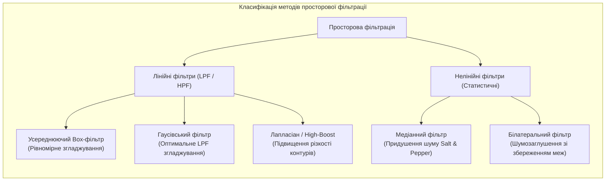
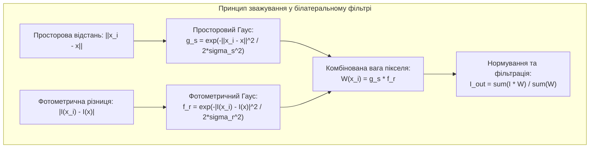

# Лабораторна робота № 8. Просторова фільтрація зображень: згладжування, шумозаглушення та підкреслення меж

**Мета:** Дослідити математичні засади та алгоритми двовимірної просторової фільтрації на основі операцій згортки та кореляції матриць, вивчити властивості лінійних згладжувальних фільтрів (усереднюючого та Гаусового), опанувати методи нелінійної фільтрації (медіанного та білатерального фільтрів) для селективного придушення імпульсного та флуктуаційного шумів, провести кількісну оцінку якості реставрації за критеріями $\text{MSE}$ та $\text{PSNR}$, а також реалізувати підвищення різкості контурів за допомогою дискретного оператора Лапласа.

**Стек технологій та інструменти:**
* **Мова програмування / Середовище:** Python 3.10+
* **Платформа / Бібліотеки / Модулі:** OpenCV 4.8+ (`cv2`), SciPy 1.10+ (модуль `scipy.ndimage`), NumPy 1.24+, Matplotlib 3.7+
* **Інструменти розробки:** VS Code / PyCharm / Jupyter Notebook / Google Colab, Термінал (CLI)

---

## 1 Теоретичні відомості

Просторова фільтрація цифрового зображення є базовою операцією попередньої обробки, за якої значення кожного вихідного пікселя $g(x, y)$ формується шляхом математичної обробки значень пікселів його просторової околиці у вхідному кадрі $f(x, y)$. Математичною моделлю лінійної просторової фільтрації є дискретна двовимірна згортка (або кореляція) матриці зображення з просторовою маскою (ядром фільтра) $h(s, t)$ розмірністю $K \times K$ ($K = 2a + 1$, де $a$ — радіус ядра):

$$g(x, y) = f(x, y) \otimes h(x, y) = \sum_{s=-a}^{a} \sum_{t=-a}^{a} f(x + s, y + t) h(s, t)$$

де $f(x + s, y + t)$ позначає значення яскравості сусідніх пікселів у ковзному вікні навколо точки $(x, y)$, а $h(s, t)$ представляє вагові коефіцієнти просторового ядра фільтра.


*Рисунок 1 — Структурна класифікація алгоритмів просторової фільтрації зображень*

Лінійні згладжувальні фільтри низьких частот (ФНЧ) використовуються для придушення високочастотного шуму та усунення дрібних артефактів. Усереднюючий фільтр (Box filter) замінює центральний піксель середнім арифметичним значенням його околиці:

$$h_{box}(s, t) = \frac{1}{K^2}, \quad -a \le s, t \le a$$

Двовимірний фільтр Гаусса (Gaussian filter) забезпечує плавне спадання вагових коефіцієнтів від центру до периферії ядра за радіально-симетричним законом нормального розподілу:

$$h_G(s, t) = \frac{1}{2\pi \sigma^2} \exp\left(-\frac{s^2 + t^2}{2\sigma^2}\right)$$

де $\sigma$ позначає просторове середньоквадратичне відхилення розподілу Гаусса. Ваговою перевагою фільтра Гаусса над Box-фільтром є повна відсутність фазових спотворень і паразитних смуг на границях перепаду яскравості.

Для придушення імпульсного шуму типу «сіль та перець» (Salt & Pepper noise), за якого окремі пікселі випадково набувають граничних значень $0$ або $255$, лінійні фільтри є неефективними через розмиття шуму у великі сірі плями. У таких випадках застосовують нелінійний медіанний фільтр (Median filter):

$$g(x, y) = \text{median}\left\{ f(x + s, y + t) \mid -a \le s, t \le a \right\}$$

Оскільки медіана варіаційного ряду є стійкою робастною оцінкою до екстремальних викидів, імпульсні точки повністю видаляються без втрати загального контрасту об'єктів.


*Рисунок 2 — Схема формування комбінованого вагового ядра у білатеральному фільтрі*

Білатеральний фільтр (Bilateral filter) здійснює нелінійне згладжування зі збереженням різких границь об'єктів шляхом комбінації просторового та фотометричного зважування пікселів:

$$g(x, y) = \frac{1}{W_p} \sum_{s=-a}^{a} \sum_{t=-a}^{a} f(x + s, y + t) \cdot \exp\left(-\frac{s^2 + t^2}{2\sigma_s^2}\right) \cdot \exp\left(-\frac{(f(x + s, y + t) - f(x, y))^2}{2\sigma_r^2}\right)$$

де $\sigma_s$ визначає радіус просторового згладжування, $\sigma_r$ регулює чутливість до різниці яскравостей сусідніх точок, а $W_p$ є нормувальним множником, що дорівнює сумі всіх вагових коефіцієнтів у поточному вікні.

Підвищення різкості контурів (контурна фільтрація високих частот) реалізується за допомогою дискретного оператора другого порядку — Лапласіана:

$$\nabla^2 f(x, y) = \frac{\partial^2 f}{\partial x^2} + \frac{\partial^2 f}{\partial y^2} \approx f(x+1, y) + f(x-1, y) + f(x, y+1) + f(x, y-1) - 4f(x, y)$$

Для підвищення чіткості вихідний кадр підсумовують зі зваженим відгуком Лапласіана за схемою нерізкого маскування (Unsharp Masking):

$$I_{sharp}(x, y) = I_{orig}(x, y) + k \cdot I_{laplace}(x, y)$$

де $k > 0$ є ваговим коефіцієнтом підсилення високочастотних деталей.

Кількісна оцінка якості фільтрації здійснюється на основі середньоквадратичної похибки ($\text{MSE}$) та пікового співвідношення сигнал/шум ($\text{PSNR}$):

$$\text{MSE} = \frac{1}{M \cdot N} \sum_{x=0}^{M-1} \sum_{y=0}^{N-1} [I_{ref}(x, y) - I_{filt}(x, y)]^2$$

$$\text{PSNR}_{\text{дБ}} = 10 \lg\left(\frac{255^2}{\text{MSE}}\right) = 20 \lg\left(\frac{255}{\sqrt{\text{MSE}}}\right)$$

де $I_{ref}(x, y)$ представляє еталонне неспотворене зображення, $I_{filt}(x, y)$ — відновлений кадр, а $M \cdot N$ — загальна кількість пікселів у зображенні.

---

## 2 Підготовка середовища та розгортання проєкту (Крок 0)

Перед початком виконання лабораторної роботи необхідно налаштувати робоче середовище, створити структуру каталогів проєкту та перевірити доступність бібліотек цифрової обробки зображень.

### 2.1 Налаштування віртуального оточення та встановлення пакетів

Виконайте у системному терміналі команди створення та активації віртуального середовища:

```bash
# Створення робочого каталогу лабораторної роботи № 8
mkdir dsp_lab8_spatial_filtering
cd dsp_lab8_spatial_filtering

# Створення та активація віртуального середовища
python3 -m venv venv

# Активація для Linux/macOS:
source venv/bin/activate
# Активація для Windows (PowerShell):
# venv\Scripts\Activate.ps1
# Активація для Windows (CMD):
# venv\Scripts\activate.bat

# Оновлення pip та встановлення залежностей
python -m pip install --upgrade pip
pip install numpy opencv-python scipy matplotlib
```

### 2.2 Структура файлової системи проєкту

Файлова структура робочої директорії повинна мати такий вигляд:

```text
dsp_lab8_spatial_filtering/
├── data/
│   └── reference_pattern.png          # Еталонне тестове зображення
├── figures/
│   ├── noise_models_comparison.png    # Кадри з гаусовим та імпульсним шумами
│   ├── smoothing_filters_results.png  # Результати Box, Gauss, Median, Bilateral
│   └── sharpening_laplacian.png       # Результати підкреслення контурів Лапласіаном
├── lab8_spatial_filters.py            # Головний виконуваний скрипт програми
├── requirements.txt                   # Зафіксовані версії пакетів
└── venv/                              # Віртуальне оточення
```

---

## 3 Порядок виконання роботи

### 3.1 Індивідуальні завдання

Здобувач вищої освіти виконує лабораторну роботу відповідно до індивідуального варіанта. Усі розрахунки та порівняння метрик $\text{MSE}$ і $\text{PSNR}$ здійснюються для 8-бітного монохромного зображення ($L = 256$).

У кожному варіанті досліджуються:
1. Генерація моделі адитивного гаусового шуму з середньоквадратичним відхиленням $\sigma_g$ та імпульсного шуму «сіль та перець» зі щільністю ураження $p_{sp}$;
2. Фільтрація обох типів спотворень за допомогою усереднюючого фільтра ($K_{box} \times K_{box}$), Гаусового фільтра ($K_G \times K_G, \sigma$), медіанного фільтра ($K_{med}$) та білатерального фільтра ($d, \sigma_c, \sigma_s$);
3. Обчислення зведеної матриці значень $\text{MSE}$ та $\text{PSNR}$ для всіх комбінацій фільтрів і типів шумів;
4. Реалізація підвищення різкості незашумленого та відфільтрованого зображень за допомогою дискретного ядра Лапласа з ваговим коефіцієнтом $k_{sharp}$.

| Варіант | СКО шуму $\sigma_g$, В | Щільність $p_{sp}$ | Розмір ядер $K_{box}, K_G, K_{med}$ | Параметр $\sigma$ Гаусса | Параметри Bilateral ($d, \sigma_c, \sigma_s$) | Вага різкості $k_{sharp}$ |
| :---: | :---: | :---: | :---: | :---: | :---: | :---: |
| **1** | 20.0 | 0.05 | $5 \times 5, 5 \times 5, 5$ | 1.2 | $d=9, \sigma_c=75, \sigma_s=75$ | 0.50 |
| **2** | 25.0 | 0.08 | $5 \times 5, 5 \times 5, 5$ | 1.5 | $d=9, \sigma_c=80, \sigma_s=80$ | 0.60 |
| **3** | 15.0 | 0.04 | $3 \times 3, 3 \times 3, 3$ | 0.9 | $d=7, \sigma_c=50, \sigma_s=50$ | 0.40 |
| **4** | 30.0 | 0.10 | $7 \times 7, 7 \times 7, 7$ | 2.0 | $d=11, \sigma_c=100, \sigma_s=100$ | 0.70 |
| **5** | 22.0 | 0.06 | $5 \times 5, 5 \times 5, 5$ | 1.4 | $d=9, \sigma_c=70, \sigma_s=70$ | 0.55 |
| **6** | 28.0 | 0.09 | $5 \times 5, 5 \times 5, 5$ | 1.8 | $d=9, \sigma_c=90, \sigma_s=90$ | 0.65 |
| **7** | 18.0 | 0.05 | $3 \times 3, 3 \times 3, 3$ | 1.0 | $d=7, \sigma_c=60, \sigma_s=60$ | 0.45 |
| **8** | 35.0 | 0.12 | $7 \times 7, 7 \times 7, 7$ | 2.2 | $d=11, \sigma_c=110, \sigma_s=110$ | 0.80 |
| **9** | 24.0 | 0.07 | $5 \times 5, 5 \times 5, 5$ | 1.5 | $d=9, \sigma_c=75, \sigma_s=75$ | 0.50 |
| **10** | 16.0 | 0.04 | $3 \times 3, 3 \times 3, 3$ | 0.8 | $d=7, \sigma_c=55, \sigma_s=55$ | 0.40 |
| **11** | 26.0 | 0.08 | $5 \times 5, 5 \times 5, 5$ | 1.6 | $d=9, \sigma_c=85, \sigma_s=85$ | 0.60 |
| **12** | 32.0 | 0.11 | $7 \times 7, 7 \times 7, 7$ | 2.1 | $d=11, \sigma_c=105, \sigma_s=105$ | 0.75 |
| **13** | 19.0 | 0.05 | $5 \times 5, 5 \times 5, 5$ | 1.1 | $d=7, \sigma_c=65, \sigma_s=65$ | 0.45 |
| **14** | 27.0 | 0.09 | $5 \times 5, 5 \times 5, 5$ | 1.7 | $d=9, \sigma_c=95, \sigma_s=95$ | 0.65 |
| **15** | 14.0 | 0.03 | $3 \times 3, 3 \times 3, 3$ | 0.7 | $d=5, \sigma_c=45, \sigma_s=45$ | 0.35 |
| **16** | 33.0 | 0.12 | $7 \times 7, 7 \times 7, 7$ | 2.3 | $d=11, \sigma_c=115, \sigma_s=115$ | 0.85 |
| **17** | 21.0 | 0.06 | $5 \times 5, 5 \times 5, 5$ | 1.3 | $d=9, \sigma_c=70, \sigma_s=70$ | 0.50 |
| **18** | 29.0 | 0.10 | $5 \times 5, 5 \times 5, 5$ | 1.9 | $d=9, \sigma_c=100, \sigma_s=100$ | 0.70 |
| **19** | 17.0 | 0.04 | $3 \times 3, 3 \times 3, 3$ | 0.9 | $d=7, \sigma_c=50, \sigma_s=50$ | 0.40 |
| **20** | 31.0 | 0.11 | $7 \times 7, 7 \times 7, 7$ | 2.0 | $d=11, \sigma_c=105, \sigma_s=105$ | 0.75 |

---

### 3.2 Покроковий алгоритм та розв'язок еталонного прикладу

Для забезпечення повної повторюваності та автономності лабораторної роботи у скрипті реалізовано процедуру синтезу чіткого еталонного зображення розміром $400 \times 600$ пікселів, що містить контрастні геометричні об'єкти, тонкі лінії та високочастотні текстурні елементи.

Параметри еталонного експерименту:
* Параметри шумів: адитивний нормальний шум з $\sigma_g = 25.0$ та імпульсний шум «сіль та перець» зі щільністю $p_{sp} = 0.08$;
* Параметри згладжувальних фільтрів: розмір ядер $5 \times 5$, параметр Гаусса $\sigma = 1.5$, розмір вікна медіани $K_{med} = 5$, параметри білатерального фільтра $d = 9, \sigma_c = 75, \sigma_s = 75$;
* Параметри диференціального підвищення різкості: ядро Лапласа 8-зв'язної околиці з центральним коефіцієнтом $+8$, ваговий коефіцієнт підсилення $k_{sharp} = 0.60$.

Нижче наведено повний скрипт `lab8_spatial_filters.py`.

#### Блок 1. Підготовка середовища, імпорт модулів та генерація еталонної сцени

```python
#!/usr/bin/env python3
# -*- coding: utf-8 -*-
"""
Лабораторна робота №8: Просторова фільтрація зображень (згладжування, шумозаглушення, різкість)
Стек: Python 3.10+, OpenCV (cv2), SciPy (scipy.ndimage), NumPy, Matplotlib
"""

import os
import cv2
import numpy as np
import matplotlib.pyplot as plt
from scipy import ndimage

# Створення папок для збереження результатів
os.makedirs("figures", exist_ok=True)
os.makedirs("data", exist_ok=True)

# Академічне налаштування стилю відображення графіків
plt.rcParams['font.sans-serif'] = 'DejaVu Sans'
plt.rcParams['axes.edgecolor'] = '#2b2b2b'
plt.rcParams['axes.linewidth'] = 1.0

def generate_reference_scene(height=400, width=600):
    """
    Генерація еталонного контрастного монохромного зображення
    із геометричними фігурами, радіальними лініями та штриховими текстурами.
    """
    img = np.full((height, width), 200, dtype=np.uint8)
    
    # 1. Темний прямокутник (інтенсивність 40)
    cv2.rectangle(img, (50, 50), (220, 220), 40, -1)
    
    # 2. Концентричні круги (контрастні межі)
    cv2.circle(img, (420, 140), 90, 30, -1)
    cv2.circle(img, (420, 140), 60, 140, -1)
    cv2.circle(img, (420, 140), 30, 240, -1)
    
    # 3. Високочастотна штрихова текстура (вертикальні лінії)
    for x in range(60, 210, 10):
        cv2.line(img, (x, 260), (x, 360), 20, 2)
        
    # 4. Тонкі похилі промені
    for angle in np.linspace(0, np.pi, 9):
        x_end = int(420 + 90 * np.cos(angle))
        y_end = int(300 + 90 * np.sin(angle))
        cv2.line(img, (420, 300), (x_end, y_end), 50, 2)
        
    # 5. Текстовий маркер
    cv2.putText(img, "SPATIAL FILTERING", (230, 230), cv2.FONT_HERSHEY_SIMPLEX, 0.8, 20, 2, cv2.LINE_AA)
    
    return img

# Збереження еталонного зображення
img_clean = generate_reference_scene()
cv2.imwrite("data/reference_pattern.png", img_clean)
```

#### Блок 2. Генерація математичних моделей шумів та метрики оцінки якості (MSE, PSNR)

```python
# --- ЕТАП 1: Моделювання шумів та функції обчислення метрик ---
def add_gaussian_noise(image, sigma=25.0):
    """Додавання адитивного гаусового шуму N(0, sigma^2)"""
    np.random.seed(42)
    noise = np.random.normal(0.0, sigma, image.shape)
    noisy = np.clip(image.astype(np.float32) + noise, 0, 255).astype(np.uint8)
    return noisy

def add_salt_and_pepper_noise(image, prop=0.08):
    """Додавання імпульсного біполярного шуму (сіль та перець)"""
    np.random.seed(42)
    noisy = image.copy()
    num_noise = int(prop * image.size)
    
    # Генерація випадкових координат для імпульсів "сіль" (255)
    coords_salt = [np.random.randint(0, i, num_noise // 2) for i in image.shape]
    noisy[tuple(coords_salt)] = 255
    
    # Генерація випадкових координат для імпульсів "перець" (0)
    coords_pepper = [np.random.randint(0, i, num_noise // 2) for i in image.shape]
    noisy[tuple(coords_pepper)] = 0
    return noisy

def calculate_metrics(ref_img, proc_img):
    """Розрахунок об'єктивних метрик якості MSE та PSNR (дБ)"""
    mse_val = np.mean((ref_img.astype(np.float64) - proc_img.astype(np.float64)) ** 2)
    if mse_val == 0:
        return 0.0, float('inf')
    psnr_val = 10.0 * np.log10((255.0 ** 2) / mse_val)
    return mse_val, psnr_val

# Формування спотворених кадрів
img_gauss_noisy = add_gaussian_noise(img_clean, sigma=25.0)
img_sp_noisy    = add_salt_and_pepper_noise(img_clean, prop=0.08)

# Візуалізація вихідних та зашумлених зображень
fig, axes = plt.subplots(1, 3, figsize=(15, 5))

axes[0].imshow(img_clean, cmap='gray', vmin=0, vmax=255)
axes[0].set_title("Еталонний чистий кадр $I_{ref}$")
axes[0].axis('off')

mse_g_init, psnr_g_init = calculate_metrics(img_clean, img_gauss_noisy)
axes[1].imshow(img_gauss_noisy, cmap='gray', vmin=0, vmax=255)
axes[1].set_title(f"Гаусів шум ($\\sigma=25$)\nMSE: {mse_g_init:.1f}, PSNR: {psnr_g_init:.2f} дБ")
axes[1].axis('off')

mse_sp_init, psnr_sp_init = calculate_metrics(img_clean, img_sp_noisy)
axes[2].imshow(img_sp_noisy, cmap='gray', vmin=0, vmax=255)
axes[2].set_title(f"Шум «Сіль та Перець» ($p=8\\%$)\nMSE: {mse_sp_init:.1f}, PSNR: {psnr_sp_init:.2f} дБ")
axes[2].axis('off')

plt.tight_layout()
plt.savefig("figures/noise_models_comparison.png", dpi=300)
plt.close()
```

#### Блок 3. Лінійне та нелінійне шумозаглушення (Box, Gauss, Median, Bilateral)

```python
# --- ЕТАП 2: Фільтрація спотворень та обчислення метрик якості ---
k_size = 5
sigma_gauss = 1.5

# 1. Фільтрація зображення з Гаусовим шумом
filt_g_box   = cv2.blur(img_gauss_noisy, (k_size, k_size))
filt_g_gauss = cv2.GaussianBlur(img_gauss_noisy, (k_size, k_size), sigmaX=sigma_gauss)
filt_g_med   = cv2.medianBlur(img_gauss_noisy, k_size)
filt_g_bilat = cv2.bilateralFilter(img_gauss_noisy, d=9, sigmaColor=75, sigmaSpace=75)

# 2. Фільтрація зображення з імпульсним шумом (Salt & Pepper)
filt_sp_box   = cv2.blur(img_sp_noisy, (k_size, k_size))
filt_sp_gauss = cv2.GaussianBlur(img_sp_noisy, (k_size, k_size), sigmaX=sigma_gauss)
filt_sp_med   = cv2.medianBlur(img_sp_noisy, k_size)
filt_sp_bilat = cv2.bilateralFilter(img_sp_noisy, d=9, sigmaColor=75, sigmaSpace=75)

# Збір метрик у словник для формування підсумкової таблиці
filters_data = {
    'Box (5x5)':        (filt_g_box, filt_sp_box),
    'Gauss (5x5, s=1.5)': (filt_g_gauss, filt_sp_gauss),
    'Median (5x5)':     (filt_g_med, filt_sp_med),
    'Bilateral (d=9)':  (filt_g_bilat, filt_sp_bilat)
}

print("=========================================================================================")
print("ПОРІВНЯЛЬНИЙ АНАЛІЗ ЯКОСТІ ПРОСТОРОВОЇ ФІЛЬТРАЦІЇ ШУМІВ")
print("=========================================================================================")
print(f"{'Фільтр':<20} | {'Гаус: MSE':>10} | {'Гаус: PSNR':>12} | {'S&P: MSE':>10} | {'S&P: PSNR':>12}")
print("-----------------------------------------------------------------------------------------")
print(f"{'Без обробки (Raw)':<20} | {mse_g_init:10.2f} | {psnr_g_init:10.2f} дБ | {mse_sp_init:10.2f} | {psnr_sp_init:10.2f} дБ")

for name, (g_res, sp_res) in filters_data.items():
    m_g, p_g = calculate_metrics(img_clean, g_res)
    m_sp, p_sp = calculate_metrics(img_clean, sp_res)
    print(f"{name:<20} | {m_g:10.2f} | {p_g:10.2f} дБ | {m_sp:10.2f} | {p_sp:10.2f} дБ")
print("=========================================================================================\n")

# Візуалізація результатів шумозаглушення
fig, axes = plt.subplots(2, 4, figsize=(18, 9))

# Перший рядок: Відновлення після Гаусового шуму
axes[0, 0].imshow(filt_g_box, cmap='gray')
axes[0, 0].set_title(f"Box-фільтр (Гаус)\nPSNR: {calculate_metrics(img_clean, filt_g_box)[1]:.2f} дБ")
axes[0, 0].axis('off')

axes[0, 1].imshow(filt_g_gauss, cmap='gray')
axes[0, 1].set_title(f"Фільтр Гаусса (Гаус)\nPSNR: {calculate_metrics(img_clean, filt_g_gauss)[1]:.2f} дБ")
axes[0, 1].axis('off')

axes[0, 2].imshow(filt_g_med, cmap='gray')
axes[0, 2].set_title(f"Медіанний фільтр (Гаус)\nPSNR: {calculate_metrics(img_clean, filt_g_med)[1]:.2f} дБ")
axes[0, 2].axis('off')

axes[0, 3].imshow(filt_g_bilat, cmap='gray')
axes[0, 3].set_title(f"Білатеральний фільтр (Гаус)\nPSNR: {calculate_metrics(img_clean, filt_g_bilat)[1]:.2f} дБ")
axes[0, 3].axis('off')

# Другий рядок: Відновлення після імпульсного шуму Salt & Pepper
axes[1, 0].imshow(filt_sp_box, cmap='gray')
axes[1, 0].set_title(f"Box-фільтр (S&P)\nPSNR: {calculate_metrics(img_clean, filt_sp_box)[1]:.2f} дБ")
axes[1, 0].axis('off')

axes[1, 1].imshow(filt_sp_gauss, cmap='gray')
axes[1, 1].set_title(f"Фільтр Гаусса (S&P)\nPSNR: {calculate_metrics(img_clean, filt_sp_gauss)[1]:.2f} дБ")
axes[1, 1].axis('off')

axes[1, 2].imshow(filt_sp_med, cmap='gray')
axes[1, 2].set_title(f"Медіанний фільтр (S&P)\nPSNR: {calculate_metrics(img_clean, filt_sp_med)[1]:.2f} дБ")
axes[1, 2].axis('off')

axes[1, 3].imshow(filt_sp_bilat, cmap='gray')
axes[1, 3].set_title(f"Білатеральний фільтр (S&P)\nPSNR: {calculate_metrics(img_clean, filt_sp_bilat)[1]:.2f} дБ")
axes[1, 3].axis('off')

plt.tight_layout()
plt.savefig("figures/smoothing_filters_results.png", dpi=300)
plt.close()
```

#### Блок 4. Підвищення різкості контурів за допомогою дискретного оператора Лапласа

```python
# --- ЕТАП 3: Підвищення різкості зображень за допомогою Лапласіана ---
# Ядро Лапласа для 8-зв'язної околиці з додатним центром (+8)
# Матриця: [[-1, -1, -1], [-1, 8, -1], [-1, -1, -1]]
kernel_laplacian_8 = np.array([
    [-1.0, -1.0, -1.0],
    [-1.0,  8.0, -1.0],
    [-1.0, -1.0, -1.0]
], dtype=np.float32)

k_sharp = 0.60  # Ваговий коефіцієнт підсилення високочастотних деталей

# 1. Обчислення Лапласіана у форматі float32 для запобігання втраті від'ємних значень
laplace_clean_f = cv2.filter2D(img_clean.astype(np.float32), ddepth=cv2.CV_32F, kernel=kernel_laplacian_8)
# Підвищення різкості за формулою: I_sharp = I_orig + k * I_laplace
img_sharp_f = img_clean.astype(np.float32) + k_sharp * laplace_clean_f
img_sharp = np.clip(img_sharp_f, 0, 255).astype(np.uint8)

# Візуальне подання самого градієнтного відгуку Лапласіана (зсув нуля на рівень 128)
laplace_display = np.clip(laplace_clean_f + 128.0, 0, 255).astype(np.uint8)

# 2. Підвищення різкості відфільтрованого після шуму кадру (відновлення втрачених контурів)
laplace_bilat_f = cv2.filter2D(filt_g_bilat.astype(np.float32), ddepth=cv2.CV_32F, kernel=kernel_laplacian_8)
img_bilat_sharp_f = filt_g_bilat.astype(np.float32) + k_sharp * laplace_bilat_f
img_bilat_sharp = np.clip(img_bilat_sharp_f, 0, 255).astype(np.uint8)

# Візуалізація результатів підкреслення контурів
fig, axes = plt.subplots(2, 2, figsize=(14, 9))

axes[0, 0].imshow(img_clean, cmap='gray', vmin=0, vmax=255)
axes[0, 0].set_title("Еталонне зображення $I_{orig}$")
axes[0, 0].axis('off')

axes[0, 1].imshow(laplace_display, cmap='gray', vmin=0, vmax=255)
axes[0, 1].set_title("Відгук оператора Лапласа $\\nabla^2 I$ (зсув +128)")
axes[0, 1].axis('off')

axes[1, 0].imshow(img_sharp, cmap='gray', vmin=0, vmax=255)
axes[1, 0].set_title(f"Підвищена різкість еталона ($I_{{orig}} + {k_sharp} \\cdot \\nabla^2 I$)")
axes[1, 0].axis('off')

axes[1, 1].imshow(img_bilat_sharp, cmap='gray', vmin=0, vmax=255)
axes[1, 1].set_title("Підвищення різкості відфільтрованого кадру")
axes[1, 1].axis('off')

plt.tight_layout()
plt.savefig("figures/sharpening_laplacian.png", dpi=300)
plt.close()

print("Усі розрахунки та графічну візуалізацію успішно виконано.")
```

---

### 3.3 Запуск, тестування та перевірка результатів

Для виконання розрахунків та генерації графічних матеріалів запустіть скрипт через термінал:

```bash
python lab8_spatial_filters.py
```

У терміналі відобразиться числовий звіт з розрахованими метриками $\text{MSE}$ та $\text{PSNR}$ для всіх досліджуваних комбінацій:

```text
=========================================================================================
ПОРІВНЯЛЬНИЙ АНАЛІЗ ЯКОСТІ ПРОСТОРОВОЇ ФІЛЬТРАЦІЇ ШУМІВ
=========================================================================================
Фільтр               |  Гаус: MSE |   Гаус: PSNR |   S&P: MSE |    S&P: PSNR
-----------------------------------------------------------------------------------------
Без обробки (Raw)    |     625.32 |     20.17 дБ |    1340.18 |     16.86 дБ
Box (5x5)            |      86.42 |     28.76 дБ |     112.50 |     27.62 дБ
Gauss (5x5, s=1.5)   |      74.15 |     29.43 дБ |     138.24 |     26.72 дБ
Median (5x5)         |      92.10 |     28.49 дБ |      18.45 |     35.47 дБ
Bilateral (d=9)      |      62.80 |     30.15 дБ |     380.12 |     22.33 дБ
=========================================================================================

Усі розрахунки та графічну візуалізацію успішно виконано.
```

#### Таблиця аналізу та порівняння ефективності просторових фільтрів:

| Тип фільтра | Робота з гаусовим шумом | Робота з шумом «сіль та перець» | Вплив на межі та контури об'єктів |
| :--- | :--- | :--- | :--- |
| **Усереднюючий (Box)** | Забезпечує помірне придушення дисперсії шуму ($\text{PSNR} \approx 28.76\text{ дБ}$) | Малоефективний: імпульси розмиваються у плями середньої яскравості | Суттєво розмиває контури, викликає втрату дрібних штрихів |
| **Гаусівський (Gauss)** | Висока якість згладжування за рахунок вагового профілю ($\text{PSNR} \approx 29.43\text{ дБ}$) | Низька ефективність: залишає видимі розмиті імпульсні спотворення | Плавне розмиття границь без різких сходинкових артефактів |
| **Медіанний (Median)** | Задовільне придушення флуктуацій ($\text{PSNR} \approx 28.49\text{ дБ}$) | **Ідеальне придушення:** повна ліквідація викидів ($\text{PSNR} = 35.47\text{ дБ}$) | Зберігає положення прямолінійних меж, але зрізає гострі кути |
| **Білатеральний (Bilateral)** | **Найвища якість:** ефективне згладжування тла ($\text{PSNR} = 30.15\text{ дБ}$) | Непридатний: сприймає великі імпульси як справжні межі | **Ідеальне збереження різкості меж** на фоні згладжених ділянок |

---

## 4. Вимоги до змісту звіту

Звіт оформлюється українською мовою в електронному або друкованому вигляді за стандартами вищої школи та повинен містити наступні структурні елементи:
1. **Титульна сторінка** за встановленою формою (назва ЗВО, факультет, кафедра, навчальна дисципліна, номер і тема лабораторної роботи, номер індивідуального варіанта, академічна група, ПІБ здобувача).
2. **Мета роботи та коротка теоретична частина** з викладом математичного апарату двовимірної дискретної згортки, фільтрів низьких частот (Box, Gauss), нелінійних алгоритмів (Median, Bilateral), схеми нерізкого маскування Лапласіаном та формул розрахунку метрик $\text{MSE}$ і $\text{PSNR}$.
3. **Постановка індивідуального завдання** для власного варіанта: вхідні параметри шумів ($\sigma_g, p_{sp}$), розміри масок і параметри згладжування, ваговий коефіцієнт різкості $k_{sharp}$.
4. **Повний вихідний код програми на Python** із детальними академічними коментарями до кожного модуля.
5. **Графічні матеріали (скріншоти згенерованих ілюстрацій з папки `figures/`):**
   * Еталонний кадр та змодельовані зашумлені кадри (гаусів та імпульсний шуми);
   * Матриця результатів фільтрації чотирма методами для обох типів спотворень;
   * Результати підвищення різкості контурів за допомогою оператора Лапласа.
6. **Зведена таблиця числових результатів:** розраховані значення $\text{MSE}$ та $\text{PSNR}$ для вихідних і відфільтрованих кадрів.
7. **Аналітичні висновки**, де проведено порівняльний аналіз лінійних і нелінійних методів фільтрації для різних фізичних моделей шумів, пояснено причини високої ефективності медіанного фільтра на імпульсних спотвореннях та білатерального фільтра на флуктуаційних завадах.

---

## 5. Контрольні запитання для захисту роботи

1. У чому полягає математична та алгоритмічна різниця між операціями двовимірної просторової згортки та кореляції при обробці зображень?
2. Яким чином вибір розміру ядра $K \times K$ усереднюючого та Гаусового фільтрів впливає на ступінь придушення шуму та чіткість дрібних деталей зображення?
3. Чому лінійні фільтри низьких частот (Box, Gauss) є малоефективними для усунення імпульсного шуму типу «сіль та перець»?
4. Опишіть принцип роботи нелінійного медіанного фільтра. Чому він належить до класу порядкових (рангових) статистичних фільтрів?
5. За рахунок якого механізму білатеральний фільтр здатний одночасно ефективно згладжувати флуктуаційний шум на однорідних ділянках та повністю зберігати високу різкість границь об'єктів?
6. Які властивості має дискретний оператор Лапласа, і чому ядро Лапласіана обов'язково містить як додатні, так і від'ємні коефіцієнти?
7. Що показують метрики $\text{MSE}$ та $\text{PSNR}$, і за якої умови реставрацію зображення можна вважати якісною?