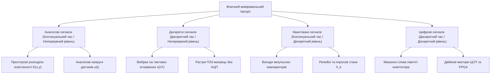
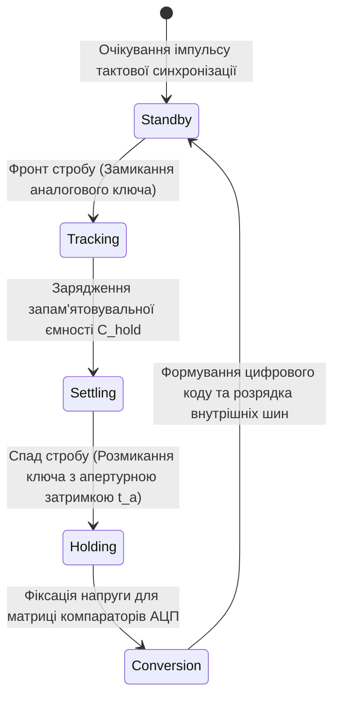
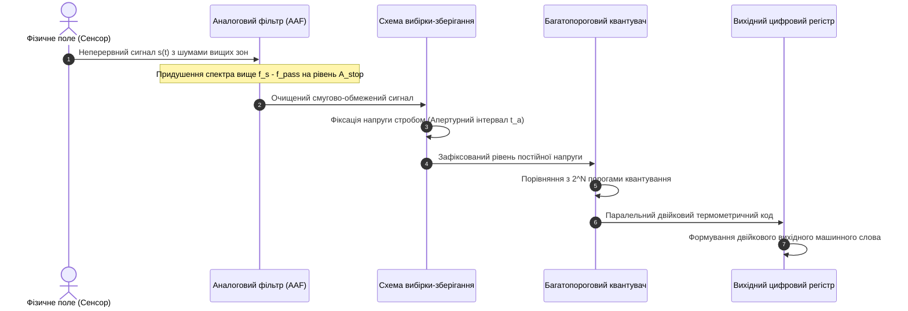
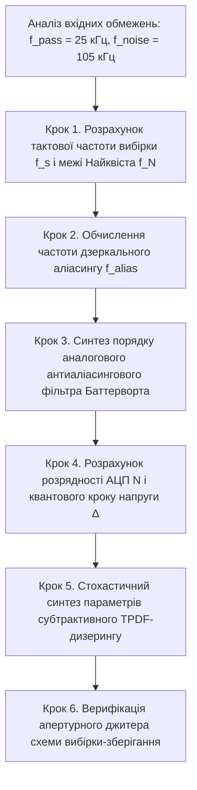

# Тема 1. Математичне представлення, дискретизація та квантування сигналів і зображень. Теорема Котельникова-Шеннона-Найквіста

## Мета лекції

Метою лекції є формування у майбутніх магістрів у галузі комп'ютерно-інтегрованих технологій, робототехніки та комп'ютерних наук фундаментальної системи знань і прикладних інженерних компетентностей щодо математичного моделювання, спектрального аналізу й практичної реалізації процесів перетворення неперервних фізичних процесів та оптичних полів у дискретну цифрову форму. У межах навчальної дисципліни систематизуються підходи до опису просторово-часових залежностей сигналів і двовимірних матриць зображень, формалізується апарат стробування дельта-решітками, розкриваються граничні умови теореми відліків Котельникова-Шеннона-Найквіста у часовій та частотній областях, а також аналізується фізична природа спектрального накладання (еліасингу). Особлива увага зосереджується на стохастичних моделях похибок квантування, розрахунку динамічного діапазону вимірювальних трактів за правилом Беннета та методах лінеаризації передавальних характеристик аналого-цифрових систем за допомогою дизеризації.

## Очікувані результати навчання

1. **Знання та розуміння.** Здобувачі повинні демонструвати поглиблене розуміння фізичної та математичної природи аналогових, дискретних, квантованих і цифрових процесів у часовій та просторовій областях, знати властивості сингулярних тестових впливів і володіти строгим аналітичним апаратом теореми відліків для одновимірних сигналів та двовимірних растрових зображень.
2. **Застосування.** Здобувачі повинні вміти розраховувати мінімально допустиму частоту дискретизації часових сигналів і просторову роздільність растрових сенсорів, визначати необхідну розрядність аналого-цифрових перетворювачів для забезпечення заданого динамічного діапазону та синтезувати передавальні функції аналогових антиаліасингових фільтрів.
3. **Аналіз.** Здобувачі повинні вміти аналізувати механізми виникнення паразитних стробоскопічних ефектів, муарових візерунків і спектрального накладання при порушенні критерію Найквіста, досліджувати енергетичну скінченність реальних процесів за теоремою Парсеваля та діагностувати нелінійні спотворення спектра квантування за умови обробки детермінованих сигналів малої амплітуди.
4. **Оцінювання та синтез.** Здобувачі повинні набути здатності критично оцінювати компроміс між швидкодією, апертурною невизначеністю та розрядністю трактів збору даних у системах реального часу, обґрунтовувати параметри алгоритмів невіднімального та субтрактивного дизерингу для придушення ефекту псевдоконтурування на цифрових зображеннях і формувати оптимальну архітектуру цифрового вимірювального вузла.

---

## Детальний покроковий план лекції

### 1. Теоретико-концептуальний базис. Просторо-часова топологія та аналітичні моделі представлення сигналів і зображень

* 1.1. Фізична та інформаційна природа вимірювальних процесів, топологічний зв'язок часового континууму й просторових координат двовимірних оптичних полів, а також системна класифікація на аналогові, дискретні, квантовані та цифрові сигнали.
* 1.2. Сингулярні тестові сигнали континуального та решітчастого просторів, динамічний опис процесів через функцію стрибка Хевісайда, розподіл Дірака та дискретний імпульс Кронекера.
* 1.3. Математична формалізація часової та просторової дискретизації як стробування періодичною дельта-решіткою з аналітичним виведенням теореми Пуассона для періодичного спектрального відгуку.
* 1.4. Простір станів і топологія амплітудного квантування за рівнем, розрахунок ціни найменшого значущого розряду та ентропійні механізми незворотної втрати первинної інформації.

### 2. Методологія та аналіз граничних умов. Спектральна теорія вибірки, феноменологія еліасингу та стохастичні моделі квантування

* 2.1. Строге аналітичне виведення теореми відліків Котельникова-Шеннона-Найквіста у частотній області та синтез інтерполяційного ряду відновлення неперервних процесів за ортогональним базисом кардинальних функцій sinc.
* 2.2. Енергетичний критерій скінченності тривалості реальних сигналів, теорема Парсеваля та методика розрахунку практичної граничної частоти спектрального носія.
* 2.3. Механізми інтерференції періодичних спектральних реплік (аліасинг) у часових сигналах і растрах зображень, аналітичний розрахунок хибних дзеркальних частот та схемотехнічні вимоги до аналогових антиаліасингових фільтрів.
* 2.4. Стохастична модель похибки квантування за гіпотезою Відроу, строге інтегральне виведення дисперсії білого шуму квантування $\sigma_q^2 = \Delta^2 / 12$ та логарифмічного правила Беннета для теоретичного співвідношення сигнал/шум.
* 2.5. Критичні бар'єри та апаратні обмеження класичної теорії відліків на практиці: апертурна невизначеність пристроїв вибірки-зберігання, скінченна крутизна спаду передавальних характеристик реальних фільтрів, кореляція шуму квантування на малих сигналах та математичне обґрунтування методів лінеаризації за допомогою дизерингу.

### 3. Практичний індустріальний / фаховий кейс. Проєктування прецизійного вимірювального тракту комп'ютерно-інтегрованої системи контролю

**Тема наскрізної задачі.** «Параметричний розрахунок частоти дискретизації, синтез аналогового антиаліасингового фільтра Баттерворта та визначення розрядності АЦП із субтрактивним дизерингом для вбудованого модуля вібромоніторингу газотурбінної установки»

## 1. Теоретико-концептуальний базис. Просторо-часова топологія та аналітичні моделі представлення сигналів і зображень

### 1.1. Фізична та інформаційна природа вимірювальних процесів, топологічний зв'язок часового континууму й просторових координат двовимірних оптичних полів, а також системна класифікація на аналогові, дискретні, квантовані та цифрові сигнали

У сучасній інженерії кіберфізичних систем, приладобудуванні та комп'ютерних науках **сигнал** розглядається як матеріальний носій інформації, що являє собою фізичний процес, один або декілька параметрів якого закономірно змінюються відповідно до стану досліджуваного об'єкта чи навколишнього середовища. Фізична взаємодія між об'єктом пізнання та вимірювальною системою завжди реалізується через матеріальні носії різної субстанційної природи. До таких носіїв належать електромагнітні коливання оптичного чи радіочастотного діапазонів, пружні акустичні хвилі в конденсованих середовищах, механічні вібрації п'єзоперетворювачів, просторові градієнти температурних полів або квантовані потоки заряджених частинок у напівпровідникових структурах. Інформаційний зміст сигналу абстрагується від його матеріальної природи шляхом математичного моделювання, яке зводить фізичне явище до функціональної залежності інформативного параметра від набору незалежних просторово-часових координат.

Топологічна структура просторів, у яких існують сигнали, визначає їхній вимір та аналітичний апарат обробки. Одновимірні часові процеси, характерні для задач телеметрії, акустики та вібродіагностики, розгортаються на дійсній числовій прямій часу $t \in \mathbb{R}$. На відміну від них, статичні монохромні зображення функціонують у двовимірному евклідовому просторі координат площини $\mathbf{r} = (x, y)^T \in \mathbb{R}^2$, де інформативним параметром виступає локальна оптична густина, яскравість або освітленість поверхні матричного фотоприймача. У відеоінформаційних комплексах, системах комп'ютерного зору автономних роботів та лазерної локації розглядаються комбіновані багатовимірні просторово-часові розподіли, де просторовий континуум доповнюється часовою координатою та довжиною хвилі випромінювання.

Узагальнена математична модель детермінованого вимірювального процесу, що поєднує просторові, часові та частотні залежності, строго формалізується у вигляді векторно-параметричного функціоналу:

$$s(\mathbf{r}, t) = F(\mathbf{r}, t, \omega; \mathbf{P})$$

де $s(\mathbf{r}, t)$ позначає спостережуваний фізичний інформативний параметр сигналу, виражений в амплітудних одиницях вимірювання системи SI (вольтах, амперах або паскалях).

Вектор $\mathbf{r} = (x, y, z)^T$ визначає вектор просторових координат точки реєстрації процесу в евклідовому просторі, виміряний у метрах.

Змінна $t$ задає координату фізичного астрономічного часу протікання явища, виражену в секундах.

Параметр $\omega$ позначає миттєву кутову або просторову частоту гармонічного коливання, що вимірюється в радіанах на секунду чи радіанах на метр відповідно.

Вектор $\mathbf{P} = (p_1, p_2, \dots, p_M)^T$ формує скінченну множину інваріантних параметрів аналітичної моделі, що включає амплітуди, просторово-фазові зсуви та константи загасання.

Якщо аналізований процес володіє властивістю абсолютної інтегровності квадрата амплітуди, він розглядається як елемент гільбертового функціонального простору $L_2(\mathbb{R})$ або $L_2(\mathbb{R}^2)$ для двовимірних оптичних полів. Метрична віддаль між сигналами в такому просторі безпосередньо асоціюється з повною фізичною енергією розбіжності між процесами.

За ступенем неперервності та квантованості незалежних змінних і амплітудної шкали вимірювані сигнали класифікують на чотири фундаментальні класи. Ця класифікаційна схема відображає концептуальну структуру первинного сприйняття фізичних процесів обчислювальною технікою:

**Аналоговий сигнал** описується неперервною функцією часу $y_a(t)$, визначеною на незліченній множині часового континууму $t \in (t_{\min}, t_{\max})$, зі значеннями із неперервного інтервалу амплітуд $y_a \in (y_{\min}, y_{\max})$. Усі фізичні процеси макросвіту первинно мають аналоговий характер, оскільки фізичні закони макроскопічної електродинаміки та механіки описуються неперервними диференціальними рівняннями математичної фізики.

**Дискретний за часом сигнал** являє собою послідовність відліків $x[n] = y_a(nT)$, зафіксованих у дискретні моменти часу $t_n = nT$, де $T$ позначає період дискретизації, а $n \in \mathbb{Z}$ є цілочисловим індексом. Значення кожного окремого відліку $x[n]$ продовжує належати незліченній множині дійсних чисел, залишаючись континуальною фізичною величиною. Прикладом просторового дискретного сигналу є розподіл заряду на ємностях накопичувальних комірок матричного ПЗЗ-сенсора до моменту їх зчитування аналого-цифровим трактом.

**Квантований за рівнем сигнал** залишається неперервним за часовим або просторовим аргументом, проте множина його допустимих значень амплітуди примусово обмежується скінченним набором фіксованих рівнів $\{h_1, h_2, \dots, h_K\}$, кожен з яких відділений від сусіднього квантовим кроком $q$. Такі процеси формуються в системах порогової автоматики, релейних регуляторах або в пристроях аналогової пам'яті з квантованими рівнями регенерації.

**Цифровий сигнал** є результатом одночасного застосування двох незалежних перетворень: дискретизації за аргументом та квантування за амплітудою. Математично він задається як решітчаста функція $Y[n]$, визначена у зліченній множині точок $nT$, амплітуда якої набуває значень виключно зі скінченної множини квантованих рівнів, закодованих у вигляді двійкових числових слів фіксованої розрядності. Тільки цифрові сигнали придатні для алгоритмічної обробки у пам'яті цифрових сигнальних процесорів, мікроконтролерів і спеціалізованих апаратних блоків на базі архітектур паралельних обчислень.

> **ПРАКТИЧНИЙ ЯКІР:**
> У сучасних промислових спектрофотометрах та системах оптичного контролю поверхні напівпровідникових пластин первинне аналогове електромагнітне поле монохроматичного випромінювання дискретизується просторовою сіткою матричного сенсора надвисокої роздільності з розміром пікселя $1.85 \times 1.85\text{ мкм}$, де кожен фотодіод накопичує аналоговий заряд, який згодом квантується інтегрованим 16-бітним конвеєрним АЦП для цифрової верифікації мікродефектів кремнієвих кристалів.

### 1.2. Сингулярні тестові сигнали континуального та решітчастого просторів, динамічний опис процесів через функцію стрибка Хевісайда, розподіл Дірака та дискретний імпульс Кронекера

Аналітичне дослідження лінійних просторово-часових систем вимагає наявності спеціального математичного апарату сингулярних тестових впливів. Ці функції моделюють граничні стани збудження кіл і дозволяють здійснювати декомпозицію довільного вхідного сигналу на елементарні просторово-часові складові. Фундаментальну роль у неперервній області відіграють одинична ступінчаста функція Хевісайда та узагальнена дельта-функція Дірака.

**Функція стрибка Хевісайда** $\sigma(t - t_0)$ формалізує процес миттєвого ввімкнення постійного фізичного потенціалу в фіксований момент часу $t_0$. Вона визначається через класичну аналітичну конструкцію:

$$\sigma(t - t_0) = \begin{cases} 0, & t < t_0 \\ \frac{1}{2}, & t = t_0 \\ 1, & t > t_0 \end{cases}$$

де $\sigma(t - t_0)$ позначає безрозмірну характеристичну функцію одиничного стрибка на часовій осі.

Параметр $t_0$ визначає момент прикладання стрибкоподібного збудження до системи, виражений у секундах.

Значення $\sigma(t_0) = 1/2$ обумовлене виконанням умов збіжності інтегралів Фур'є в точці розриву першого роду за критерієм Діріхле, згідно з яким значення функції в точці стрибка дорівнює напівсумі лівосторонньої та правосторонньої границь. 

Використовуючи функцію Хевісайда, будь-який диференційовний аналоговий процес $s(t)$ можна подати як границю суми нескінченно малих сходинкових впливів. При спрямуванні кроку дискретизації $\Delta t \to 0$ дискретна сума трансформується в строге інтегральне **динамічне представлення сигналу в часі**:

$$s(t) = s(0)\sigma(t) + \int_{0}^{\infty} \frac{ds(t')}{dt'} \sigma(t - t') \, dt'$$

де $s(0)$ позначає початкове значення аналогового сигналу в момент часу $t = 0$, виражене в амплітудних одиницях вимірювання (вольтах).

Змінна $t'$ є неперервною координатою інтегрування вздовж часової осі процесу, що вимірюється в секундах.

Похідна $\frac{ds(t')}{dt'}$ визначає миттєву швидкість зміни функції сигналу в момент часу $t'$, виражену у вольтах за секунду.

**Дельта-функція Дірака** $\delta(t - t_0)$ не є класичною функцією в сенсі Лебега чи Рімана, а належить до класу узагальнених функцій (розподілів), визначених на просторі нескінченно диференційовних фінітних пробних функцій $\mathcal{D}(\mathbb{R})$. Її формальне означення задається за допомогою граничного переходу від симетричного прямокутного імпульсу $\text{rect}(t/\tau)$ одиничної площі за умови нескінченного скорочення його тривалості $\tau$:

$$\delta(t) = \lim_{\tau \to 0} \frac{1}{\tau} \text{rect}\left(\frac{t}{\tau}\right)$$

де $\tau$ позначає тривалість прямокутного апроксимаційного вікна, виражену в секундах.

Функція $\text{rect}(\xi)$ є селекторною функцією прямокутної форми, що дорівнює одиниці при $|\xi| \le 1/2$ та набуває нульового значення при $|\xi| > 1/2$.

Дельта-функція Дірака має такі базові математичні властивості:

$$\delta(t - t_0) = 0 \quad \forall t \neq t_0, \quad \int_{-\infty}^{\infty} \delta(t - t_0) \, dt = 1, \quad \delta(t - t_0) = \frac{d\sigma(t - t_0)}{dt}$$

де інтегрування розуміється у сенсі теорії розподілів Соболєва-Шварца, а остання рівність демонструє, що функція Дірака є похідною в узагальненому сенсі від функції Хевісайда.

Критично важливою для всієї теорії вибірки та спектрального перетворення є **фільтрувальна властивість дельта-функції** (sifting property):

$$\int_{-\infty}^{\infty} s(t) \delta(t - t_0) \, dt = s(t_0)$$

Даний інтегральний вираз доводить, що скалярний добуток неперервної функції $s(t)$ на зсунуту в точку $t_0$ дельта-функцію селективно вилучає точне значення сигналу в цій точці. Фізична розмірність розподілу Дірака є оберненою до розмірності його аргументу, тобто становить $\text{с}^{-1}$ для часової осі та $\text{м}^{-1}$ або $\text{м}^{-2}$ для просторових координат зображень.

У дискретному часовому та просторовому доменах концептуальним аналогом сингулярної дельта-функції є **дискретний одиничний імпульс Кронекера** $\delta[n]$, який є регулярною функцією цілочислового аргументу $n \in \mathbb{Z}$:

$$\delta[n] = \begin{cases} 1, & n = 0 \\ 0, & n \neq 0 \end{cases}$$

де $\delta[n]$ є безрозмірною числовою послідовністю, що набуває одиничного значення лише в нульовому індексі.

Аналогічно дискретна одинична функція стрибка $u[n]$ задається виразом:

$$u[n] = \begin{cases} 1, & n \ge 0 \\ 0, & n < 0 \end{cases}$$

Зв'язок між імпульсом Кронекера та дискретним стрибком реалізується через першу ліву різницю послідовності:

$$\delta[n] = u[n] - u[n - 1]$$

Будь-який дискретизований сигнал $x[n]$ в алгоритмах цифрової обробки розкладається за ортогональною системою зсунутих імпульсів Кронекера:

$$x[n] = \sum_{k=-\infty}^{\infty} x[k] \delta[n - k]$$

де $x[k]$ позначає континуальне або квантоване значення амплітуди $k$-го відліку вихідної послідовності.

Символ $\delta[n - k]$ позначає імпульс Кронекера, локалізований у часовій точці з індексом $n = k$.

### 1.3. Математична формалізація часової та просторової дискретизації як стробування періодичною дельта-решіткою з аналітичним виведенням теореми Пуассона для періодичного спектрального відгуку

Процес **часової та просторової дискретизації** континуального процесу полягає у вибірці значень неперервного поля в регулярних вузлах решітки координат. Для строгого аналітичного опису спектральних трансформацій операцію ідеальної дискретизації формалізують як модулювальне множення вхідного неперервного сигналу $s(t)$ на нескінченний періодичний розподіл — гребінь або решітку Дірака $\eta_T(t)$, що періодично повторюється з кроком дискретизації $T$:

$$\eta_T(t) = \sum_{n=-\infty}^{\infty} \delta(t - nT)$$

де $\eta_T(t)$ позначає періодичну дельта-решітку Дірака з розмірністю $\text{с}^{-1}$.

Параметр $T$ визначає інтервал дискретизації за часом, що вимірюється в секундах.

Індекс $n \in \mathbb{Z}$ позначає порядковий номер часового такту стробування.

Результат операції стробування $s_\delta(t)$ являє собою континуальну математичну конструкцію, складену із серії зважених сингулярних імпульсів:

$$s_\delta(t) = s(t) \cdot \eta_T(t) = s(t) \sum_{n=-\infty}^{\infty} \delta(t - nT) = \sum_{n=-\infty}^{\infty} s(nT) \delta(t - nT)$$

де $s_\delta(t)$ визначає модульований амплітудами відліків дискретизований процес із розмірністю вольт на секунду ($\text{В/с}$).

Величина $s(nT)$ задає істинне значення первинного неперервного сигналу у вузлах дискретизації $t = nT$.

Сингулярний вираз $\delta(t - nT)$ позиціює кожен індивідуальний відлік на часовій осі.

Для виведення спектрального образу $S_\delta(\omega)$ застосовується інтегральне перетворення Фур'є. Оскільки добутку двох функцій у часовій області відповідає згортка їхніх комплексних спектральних густин у частотній області, маємо:

$$S_\delta(\omega) = \frac{1}{2\pi} \left[ S(\omega) * \mathcal{F}\{\eta_T(t)\} \right]$$

Оскільки дельта-решітка $\eta_T(t)$ є строго періодичною функцією з періодом $T$, вона розкладається в комплексний тригонометричний ряд Фур'є за ортогональним базисом гармонік:

$$\eta_T(t) = \sum_{k=-\infty}^{\infty} C_k e^{j k \omega_s t}$$

де $\omega_s = \frac{2\pi}{T} = 2\pi f_s$ є круговою частотою дискретизації вимірювальної системи, що вимірюється в радіанах на секунду.

Частота $f_s = \frac{1}{T}$ задає тактову частоту зняття відліків, виражену в герцах.

Комплексні спектральні коефіцієнти ряду $C_k$ обчислюються шляхом інтегрування сингулярного ядра в межах одного періоду симетрії $[-T/2, T/2]$ із залученням фільтрувальної властивості функції Дірака:

$$C_k = \frac{1}{T} \int_{-T/2}^{T/2} \eta_T(t) e^{-j k \omega_s t} \, dt = \frac{1}{T} \int_{-T/2}^{T/2} \delta(t) e^{-j k \omega_s t} \, dt = \frac{1}{T} e^{-j k \omega_s \cdot 0} = \frac{1}{T}$$

Підставляючи коефіцієнти $C_k = \frac{1}{T}$ у вираз ряду Фур'є та застосовуючи до кожної комплексної експоненти пряме перетворення Фур'є за правилом $\mathcal{F}\{e^{j \Omega_0 t}\} = 2\pi \delta(\omega - \Omega_0)$, отримуємо спектральний образ дельта-решітки у вигляді частотного гребеня:

$$\mathcal{F}\{\eta_T(t)\} = \mathcal{F}\left\{ \frac{1}{T} \sum_{k=-\infty}^{\infty} e^{j k \omega_s t} \right\} = \frac{2\pi}{T} \sum_{k=-\infty}^{\infty} \delta(\omega - k\omega_s)$$

Виконуючи аналітичне інтегрування згортки спектра сигналу $S(\omega)$ з частотним гребенем за допомогою інтеграла суперпозиції, одержуємо класичне **співвідношення Пуассона**:

$$S_\delta(\omega) = \frac{1}{2\pi} \int_{-\infty}^{\infty} S(\theta) \cdot \frac{2\pi}{T} \sum_{k=-\infty}^{\infty} \delta(\omega - \theta - k\omega_s) \, d\theta = \frac{1}{T} \sum_{k=-\infty}^{\infty} S(\omega - k\omega_s)$$

де $S_\delta(\omega)$ позначає повну спектральну густину дискретизованого сигналу, виражену у вольт-секундах.

Функція $S(\omega - k\omega_s)$ задає базовий спектр вихідного аналогового сигналу, спектрально зміщений вздовж частотної осі на цілочислову кратність частоти дискретизації $k\omega_s$.

Масштабний множник $\frac{1}{T}$ нормує амплітудну щільність гармонічних складових відповідно до обраного часового кроку.

У просторовій області дискретизації зображень операція стробування узагальнюється на двовимірний прямокутний растр $T_x \times T_y$. Періодична двовимірна просторова решітка Дірака набуває вигляду:

$$\eta_{T_x, T_y}(x, y) = \sum_{m=-\infty}^{\infty} \sum_{n=-\infty}^{\infty} \delta(x - m T_x, y - n T_y)$$

Застосовуючи двовимірне перетворення Фур'є до добутку оптичного розподілу $I(x, y)$ на просторову решітку, отримуємо просторовий спектральний відгук:

$$S_\delta(u, v) = \frac{1}{T_x T_y} \sum_{k=-\infty}^{\infty} \sum_{m=-\infty}^{\infty} S\left(u - k \frac{2\pi}{T_x}, v - m \frac{2\pi}{T_y}\right)$$

де $u$ та $v$ позначають кутові просторові частоти вздовж координатних осей площини, що вимірюються в радіанах на метр.

Параметри $T_x$ та $T_y$ визначають геометричні кроки розташування чутливих фотодіодів на кремнієвій підкладці сенсора вздовж осей ширини та висоти відповідно.

Співвідношення Пуассона розкриває фундаментальний фізичний факт: спектр дискретизованого сигналу або зображення є нескінченно періодичним за частотними координатами. Якщо смуга початкового спектра $S(\omega)$ перевищує половину частоти повторення, суміжні спектральні репліки перекриваються, утворюючи нелінійні спотворення, відомі як просторовий або часовий аліасинг.

> **ВАЖЛИВО:**
> Спектральна густина будь-якого дискретизованого процесу $S_\delta(\omega)$ принципово є періодичною функцією частоти з фундаментальним періодом, що строго дорівнює кутовій частоті дискретизації $\omega_s = 2\pi / T$. Це обумовлює виникнення нескінченної кількості спектральних дзеркальних реплік (образів), які за відсутності обмеження смуги вихідного сигналу незворотно накладаються на фундаментальний спектр у базовому діапазоні $[-\omega_s/2, \omega_s/2]$.

Для реалізації апаратного перетворення в сучасних вимірювальних приладах часова дискретизація супроводжується динамічною зміною станів електронного вузла вибірки-зберігання:

> **ПРАКТИЧНИЙ ЯКІР:**
> У цифрових дзеркальних та бездзеркальних фотокамерах високого класу для запобігання виникненню просторового муару, спричиненого стробуванням періодичних текстур дискретною сіткою пікселів сенсора, перед матрицею встановлюють оптичний антиаліасинговий низькочастотний фільтр (OLPF), виконаний із двозаломлюючих кристалів ніобату літію, що фізично розщеплює промінь світла на чотири точки, штучно обмежуючи просторову роздільність оптичного поля точно на рівні просторової частоти Найквіста матриці.

### 1.4. Простір станів і топологія амплітудного квантування за рівнем, розрахунок ціни найменшого значущого розряду та ентропійні механізми незворотної втрати первинної інформації

Процес **амплітудного квантування за рівнем** є операцією відображення неперервної шкали амплітуд сигналу в дискретну множину квантованих рівнів. На відміну від дискретизації за часом, яка за умови обмеженого спектра є математично оборотною операцією, амплітудне квантування є принципово нелінійним і неін'єктивним сюр'єктивним відображенням, що супроводжується безповоротною втратою метричної інформації про первинний стан процесу.

Нехай повний динамічний діапазон вхідної напруги вимірювального перетворювача $V_{\text{range}} = [V_{\min}, V_{\max}]$ розділено системою з $K+1$ порогових рівнів $\{d_0, d_1, \dots, d_K\}$ на $K$ неперетинних підінтервалів квантування $I_k = (d_{k-1}, d_k]$. Кожному інтервалу ставиться у відповідність фіксований квантований рівень відновлення $r_k \in \{h_1, h_2, \dots, h_K\}$, який найчастіше обирається як середина інтервалу $I_k$. 

Математичний оператор квантування $Q(\cdot)$ перетворює неперервну амплітуду $x$ у дискретне значення $x_q$:

$$x_q = Q(x) = \sum_{k=1}^{K} r_k \cdot \mathbf{1}_{I_k}(x)$$

де $x_q$ позначає квантоване значення амплітуди, виражене у вольтах.

Змінна $x$ визначає континуальне значення вибірки сигналу на вході квантувача.

Функція $\mathbf{1}_{I_k}(x)$ є індикаторною характеристичною функцією інтервалу квантування $I_k$, що набуває значення $1$, якщо $x \in I_k$, і дорівнює $0$ в усіх інших випадках.

Символ $r_k$ позначає дискретне значення відновлення, що відповідає центру $k$-го квантового підінтервалу.

У разі **рівномірного квантування** ширина всіх квантових інтервалів є однаковою і визначає фундаментальний параметр перетворювача — крок квантування $\Delta$ (ціну молодшого значущого розряду — LSB):

$$\Delta = \frac{V_{\max} - V_{\min}}{2^N - 1} \approx \frac{V_{\text{range}}}{2^N}$$

де $\Delta$ позначає абсолютну величину кроку квантування за напругою, виражену у вольтах.

Параметри $V_{\max}$ та $V_{\min}$ визначають верхню та нижню межі повної робочої шкали перетворювача відповідно, виражені у вольтах.

Параметр $N$ задає розрядність аналого-цифрового перетворювача в двійкових бітах.

Величина $V_{\text{range}}$ позначає повний розмах аналогової шкали перетворення.

Різниця між точним значенням неперервного відліку сигналу $x$ та його дискретним наближенням $x_q$ формує **похибку квантування** $\varepsilon$:

$$\varepsilon = x - Q(x) = x - x_q$$

де $\varepsilon$ позначає миттєву похибку амплітудного квантування, виражену у вольтах.

При застосуванні симетричного правила округлення до найближчого рівня значення похибки строго обмежене інтервалом:

$$-\frac{\Delta}{2} \le \varepsilon \le \frac{\Delta}{2}$$

З позицій теорії інформації Шеннона аналогове джерело сигналів генерує континуум нескінченної кількості можливих мікростанів, що формально відповідає нескінченно великій диференціальній ентропії. Операція квантування стискає континуум станів у фінітну множину двійкових слів довжиною $N$ бітів. При цьому абсолютна інформаційна невизначеність сигналу редукується до скінченної дискретної ентропії $H(X)$:

$$H(X) = -\sum_{k=1}^{2^N} P(I_k) \log_2 P(I_k) \le N \quad [\text{біт/відлік}]$$

де $H(X)$ позначає дискретну ентропію джерела квантованих повідомлень, виражену в бітах на один часовий відлік.

Величина $P(I_k) = \int_{d_{k-1}}^{d_k} p(x) \, dx$ визначає апріорну ймовірність потрапляння амплітуди сигналу всередину $k$-го інтервалу квантування.

Функція $p(x)$ є одновимірною густиною розподілу ймовірностей значень неперервного вхідного сигналу.

Рівність ентропії максимальному значенню $H(X) = N$ досягається виключно за умови рівномірного закону розподілу вхідного сигналу, коли ймовірності появи всіх двійкових кодів на виході АЦП є тотожно однаковими. Якщо вхідний процес має нормальний (гауссів) розподіл або є слабозмінним, дискретна ентропія стає меншою за розрядність $N$, що свідчить про наявність інформаційної надлишковості та сильної взаємної кореляції суміжних кодових слів. Ця надлишковість зумовлює виникнення паразитної смугастості та сходинкових артефактів під час візуалізації монохромних зображень.

| Клас моделі перетворення | Математична розмірність простору | Фізична природа похибки | Метрологічні наслідки | Приклад з реальної практики |
| :--- | :--- | :--- | :--- | :--- |
| **Аналого-дискретне перетворення (ПВЗ)** | Дискретний час, неперервна амплітуда: $l_2(\mathbb{Z}) \times \mathbb{R}$ | Апертурна невизначеність, тепловий дрейф напруги на ємності фіксації | Виникнення фазового джитера, спадання АЧХ на високих частотах вибірки | Стробоскопічні осцилографи з пікосекундною синхронізацією |
| **Рівномірне скалярне квантування** | Дискретний час, рівномірна шкала: $l_2(\mathbb{Z}) \times \{0, \dots, 2^N-1\}$ | Заокруглення континууму амплітуд до фіксованого кроку $\Delta$ | Виникнення стаціонарного адитивного білого шуму потужністю $\Delta^2/12$ | Багатоканальні плати збору даних вимірювальних систем National Instruments |
| **Нелінійне компандування (А-закон, $\mu$-закон)** | Дискретний час, логарифмічна шкала рівнів: $l_2(\mathbb{Z}) \times \mathcal{M}_K$ | Змінний крок квантування, пропорційний миттєвому модулю сигналу | Постійне відношення сигнал/шум у динамічному діапазоні $40\text{ дБ}$ | Первинні кодеки цифрової телефонії E1/T1 стандарту ITU-T G.711 |
| **Двовимірна просторова дискретизація** | Двовимірна просторова решітка: $\mathbb{Z}^2 \times \mathbb{R}$ | Інтегрування світлового потоку площею апертури фотодіода | Згладжування високих просторових частот функцією sinc та поява муару | Сенсори лінійного сканування для супутникового дистанційного зондування Землі |
| **Субтрактивний дизеринг** | Стохастичний дискретний простір: $l_2(\mathbb{Z}) \times \mathbb{R} \to l_2(\mathbb{Z}) \times \mathbb{Z}$ | Додавання псевдовипадкового шуму з подальшим відніманням у цифрі | Повна декореляція шуму квантування без збільшення його сумарної дисперсії | Високоточні магнітно-резонансні томографи та сейсмічні станції моніторингу |

> **ТИПОВА ПОМИЛКА:**
> Поширеною помилкою є твердження, що дискретний за часом сигнал $x[n] = s(nT)$ тотожно дорівнює нулю у проміжках між послідовними моментами стробування, тобто для всіх $t \neq nT$. Математично це хибно: дискретизація не привласнює сигналу нульових значень між відліками, а редукує область визначення функції з неперервної дійсного континууму $\mathbb{R}$ до дискретної підмножини цілих чисел $\mathbb{Z}$. У проміжках $t \in (nT, (n+1)T)$ дискретний сигнал просто не існує. Якщо ж штучно прирівняти міжвідлікові значення до нуля на осі неперервного часу, утворюється імпульсний сигнал іншої фізичної природи, спектр якого суттєво відрізняється від спектра дискретної послідовності.

> **КОНТРОЛЬНЕ ПИТАННЯ:**
> У чому полягає принципова фізична та математична різниця між спектральним образом неперервного сигналу $S(\omega) = \mathcal{F}\{s(t)\}$ та спектральною густиною $S_\delta(\omega) = \mathcal{F}\{s_\delta(t)\}$ процесу, дискретизованого ідеальною решіткою Дірака з періодом $T$? Які топологічні зміни спектра унеможливлюють однозначне визначення початкового спектра, якщо крок дискретизації обрано невірно?

Розгорнути аналіз / відповідь

**Правильний варіант: Теза про періодизацію спектрального відгуку та інтерференційне накладання бічних реплік.**

1. Спектральна густина неперервного сигналу $S(\omega)$ є аперіодичною функцією неперервної частоти, визначеною на всій дійсній осі $\omega \in (-\infty; +\infty)$, амплітуда якої для фізично реалізовних сигналів з обмеженою енергією прямує до нуля при $|\omega| \to \infty$. На відміну від неї, спектральна густина дискретизованого сигналу $S_\delta(\omega)$ відповідно до формули сумування Пуассона являє собою строго періодичну функцію з фундаментальним періодом повторення, що дорівнює кутовій частоті дискретизації $\omega_s = \frac{2\pi}{T}$:

$$S_\delta(\omega) = \frac{1}{T} \sum_{k=-\infty}^{\infty} S(\omega - k\omega_s)$$

2. Аналіз дистракторів (чому інші трактування є хибними):
   - Твердження про те, що дискретизація просто масштабує амплітуду спектра без зміни його конфігурації, є хибним, оскільки воно ігнорує появу нескінченної кількості зсунутих високочастотних копій (реплік) основного спектра.
   - Уявлення про те, що spectrum дискретизованого сигналу існує лише в дискретних точках, є помилковим, оскільки дискретизація сигналу в часі призводить до періодизації спектра за неперервною віссю частот, тоді як дискретність спектра виникає лише за умови періодичності самого часового сигналу.
   - Якщо період дискретизації $T$ обрано занадто великим, виникає топологічне перекриття суміжних спектральних реплік (еліасинг), внаслідок чого компоненти спектра на частотах $|\omega| > \omega_s/2$ незворотно складаються з низькочастотними компонентами фундаментальної смуги, роблячи розділення чи однозначне відновлення $S(\omega)$ математично неможливим.

### Вказівки для самостійного осмислення

1. Проаналізуйте процедуру перетворення координат для двовимірного оптичного поля при переході від прямокутної декартової решітки дискретизації до гексагональної просторової структури розміщення фоточутливих елементів сенсора. Виведіть аналітичний вираз для двовимірної періодичної решітки Дірака в косокутних координатах та обчисліть виграш у щільності упаковки просторового спектрального носія для ізотропних зображень кругової форми.
2. Дослідіть поведінку функціоналу дискретної ентропії квантованого сигналу при переході від рівномірної шкали квантування до нелінійної шкали з логарифмічною характеристикою компандування за $\mu$-законом для мовного сигналу з розподілом Лапласа. Складіть математичне обґрунтування вибору оптимальних порогів квантування за критерієм мінімуму середньоквадратичної похибки відновлення (квантувач Ллойда-Макса).
3. Розгляньте математичний апарат узагальнених функцій Соболєва-Шварца та доведіть строгу теорему про похідну добутку неперервної диференційовної функції на розподіл Дірака. На основі отриманого результату поясніть, чому фізичний спектр миттєвих строб-імпульсів реального АЦП із скінченною тривалістю апертури $\tau > 0$ збагачується спадною огинальною типу $\text{sinc}(\omega\tau / 2)$, яка спотворює амплітудно-частотну характеристику системи.

## 2. Методологія та аналіз граничних умов. Спектральна теорія вибірки, феноменологія еліасингу та стохастичні моделі квантування

### 2.1. Строге аналітичне виведення теореми відліків Котельникова-Шеннона-Найквіста у частотній області та синтез інтерполяційного ряду відновлення неперервних процесів за ортогональним базисом кардинальних функцій sinc

Теоретико-методологічний фундамент переходу від неперервного сигналу до його дискретного еквівалента базується на концепції функціональних гільбертових просторів із компактним спектральним носієм. Розглядається підпростір Пелі-Вінера $PW_{\omega_{\text{гр}}} \subset L_2(\mathbb{R})$, що складається з функцій із квадратично інтегровною амплітудою, пряме перетворення Фур'є яких тотожно дорівнює нулю за межами скінченного частотного інтервалу. Нехай вхідний вимірювальний сигнал $s(t)$ задовольняє умову строгого спектрального обмеження:

$$S(\omega) = 0 \quad \forall |\omega| > \omega_{\text{гр}}$$

де $S(\omega)$ позначає комплексну спектральну густину амплітуди вихідного аналогового сигналу, виражену у вольт-секундах.

Параметр $\omega_{\text{гр}} = 2\pi f_{\text{гр}}$ визначає максимальну граничну кругову частоту в спектрі аналізованого сигналу, виражену в радіанах на секунду.

Змінна $\omega$ задає поточну кругову частоту неперервного частотного континууму, виражену в радіанах на секунду.

Відповідно до співвідношення Пуассона, отриманого в результаті стробування сигналу ідеальною періодичною решіткою дельта-функцій Дірака з періодом дискретизації $T$, спектральна густина дискретизованого сигналу набуває вигляду суми нескінченної кількості зсунутих реплік початкового спектра, зважених кроком квантування часу:

$$S_\delta(\omega) = \frac{1}{T} \sum_{k=-\infty}^{\infty} S(\omega - k\omega_s)$$

де $S_\delta(\omega)$ позначає спектральну густину амплітудно-модульованої послідовності відліків, виражену у вольт-секундах.

Параметр $\omega_s = \frac{2\pi}{T}$ задає кругову частоту дискретизації вимірювального перетворювача, виражену в радіанах на секунду.

Індекс $k \in \mathbb{Z}$ позначає цілочисловий номер відповідної спектральної репліки на нескінченній осі частот.

Якщо частота зняття вибірок задовольняє умову відсутності взаємного перекриття спектральних копій $\omega_s \ge 2\omega_{\text{гр}}$, вихідний спектр $S(\omega)$ у межах базового діапазону $[-\omega_{\text{гр}}, \omega_{\text{гр}}]$ залишається повністю ідентичним спектру дискретизованого сигналу з точністю до постійного масштабного множника $1/T$. Звідси випливає, що виділення початкового неперервного процесу здійснюється за допомогою ідеального аналогового фільтра низьких частот (ФНЧ) з прямокутною частотною характеристикою передачі $H(\omega)$, ширина смуги пропускання якого дорівнює граничній частоті сигналу:

$$H(\omega) = T \cdot \text{rect}\left(\frac{\omega}{2\omega_{\text{гр}}}\right) = \begin{cases} T, & |\omega| \le \omega_{\text{гр}} \\ 0, & |\omega| > \omega_{\text{гр}} \end{cases}$$

де $H(\omega)$ позначає комплексну передавальну функцію ідеального інтерполяційного фільтра відновлення, виражену в секундах.

Функція $\text{rect}(\xi)$ визначає прямокутну селекторну функцію одиничної амплітуди, аргумент якої є безрозмірною величиною.

Процес точного аналітичного синтезу неперервного сигналу в часовій області формалізується через розгортання інтеграла згортки у частотному домені з переходом до часових ядер:

$$
\begin{aligned}
\text{Крок 1 (Частотна селекція спектра):} & \quad S_{\text{rec}}(\omega) = S_\delta(\omega) \cdot H(\omega) = \left[ \frac{1}{T} \sum_{k=-\infty}^{\infty} S(\omega - k\omega_s) \right] \cdot T \cdot \text{rect}\left(\frac{\omega}{2\omega_{\text{гр}}}\right) = S(\omega) \\
\text{Крок 2 (Обернене перетворення Фур'є ФНЧ):} & \quad h(t) = \frac{1}{2\pi} \int_{-\infty}^{\infty} H(\omega) e^{j\omega t} \, d\omega = \frac{T}{2\pi} \int_{-\omega_{\text{гр}}}^{\omega_{\text{гр}}} e^{j\omega t} \, d\omega = \frac{T}{2\pi} \left[ \frac{e^{j\omega t}}{j t} \right]_{-\omega_{\text{гр}}}^{\omega_{\text{гр}}} \\
\text{Крок 3 (Синтез імпульсної характеристики):} & \quad h(t) = \frac{T}{\pi t} \cdot \frac{e^{j\omega_{\text{гр}} t} - e^{-j\omega_{\text{гр}} t}}{2j} = \frac{T}{\pi t} \sin(\omega_{\text{гр}} t) = \text{sinc}\left(\frac{\omega_{\text{гр}} t}{\pi}\right) = \text{sinc}\left(\frac{\pi t}{T}\right) \\
\text{Крок 4 (Часова інтегральна згортка):} & \quad s(t) = s_\delta(t) * h(t) = \int_{-\infty}^{\infty} \left[ \sum_{n=-\infty}^{\infty} s(nT) \delta(\tau - nT) \right] h(t - \tau) \, d\tau \\
\text{Крок 5 (Формування ряду Віттекера-Шеннона):} & \quad s(t) = \sum_{n=-\infty}^{\infty} s(nT) \int_{-\infty}^{\infty} \delta(\tau - nT) \text{sinc}\left(\frac{\pi (t - \tau)}{T}\right) \, d\tau = \sum_{n=-\infty}^{\infty} s(nT) \text{sinc}\left(\frac{\pi}{T}(t - nT)\right)
\end{aligned}
$$

де $s(nT)$ позначає континуальні амплітудні значення вихідного сигналу у дискретних точках відліку часу $t_n = nT$, виражені у вольтах.

Функція $\text{sinc}(\xi) = \frac{\sin(\pi \xi)}{\pi \xi}$ являє собою нормовану кардинальну функцію інтерполяції, значення якої дорівнює одиниці в точці $\xi = 0$ і перетворюється на нуль в усіх цілих ненульових точках $\xi \in \mathbb{Z} \setminus \{0\}$.

Параметр $T = \frac{1}{2 f_{\text{гр}}}$ позначає максимальний інтервал дискретизації, що задовольняє критерій Котельникова без надлишковості.

Аналіз граничних умов синтезованого ряду відновлення виявляє фундаментальні фізичні обмеження, які роблять точну реконструкцію сигналу за допомогою ідеального ряду математичною ідеалізацією. Базисна функція $\text{sinc}(\pi t / T)$ має нескінченний часовий носій і спадає вздовж осі часу вкрай повільно — пропорційно першому ступеню аргументу $\mathcal{O}(t^{-1})$. Це означає, що для розрахунку значення сигналу в довільній точці $t$ необхідно обчислювати зважену суму відліків за всіма моментами часу від $-\infty$ до $+\infty$. Отже, ідеальний відновлювальний фільтр є фізично нереалізовним через порушення принципу причинності, оскільки його імпульсна характеристика $h(t)$ відмінна від нуля при $t < 0$, що вимагало б реакції системи на збудження до моменту його фізичного виникнення. Будь-яке усічення ряду скінченним інтервалом спостереження викликає паразитні пульсації відновленого процесу, відомі як крайовий ефект Гіббса.

### 2.2. Енергетичний критерій скінченності тривалості реальних сигналів, теорема Парсеваля та методика розрахунку практичної граничної частоти спектрального носія

У реальних вимірювальних та інформаційно-керуючих трактах будь-який фізичний сигнал існує на скінченному часовому інтервалі $t \in [0, T_{\text{сиг}}]$, за межами якого його амплітуда тотожно дорівнює нулю. Відповідно до теореми Пелі-Вінера, довільна функція, що має компактний (скінченний) носій у часовому домені, володіє цілою аналітичною спектральною густиною, яка не може набувати нульових значень на будь-якому скінченному частотному інтервалі. Звідси випливає фундаментальний гносеологічний конфлікт: жоден реальний процес кінцевої тривалості не є строго обмеженим за частотою, а отже, формально не підпадає під умови теореми Котельникова.

Для усунення цієї невизначеності на практиці використовують енергетичний критерій розрахунку ефективної смуги пропускання. Повна енергія фізичного сигналу $E_s$ встановлюється рівністю Парсеваля, яка фіксує ізоморфізм енергетичних просторів у часовому та частотному доменах:

$$E_s = \int_{0}^{T_{\text{сиг}}} |s(t)|^2 \, dt = \frac{1}{2\pi} \int_{-\infty}^{\infty} |S(\omega)|^2 \, d\omega = \frac{1}{\pi} \int_{0}^{\infty} |S(\omega)|^2 \, d\omega$$

де $E_s$ позначає повну фізичну енергію сигналу, виражену в джоулях.

Величина $|S(\omega)|^2$ задає спектральну густину енергії процесу, виражену в джоулях на герц або вольт-квадрат-секундах ($\text{В}^2\cdot\text{с}^2$).

Параметр $T_{\text{сиг}}$ визначає абсолютну фізичну тривалість існування сигналу в часі, виражену в секундах.

Практична гранична кругова частота $\omega_{\text{гр}}$ обирається з умови, щоб у частотній смузі $[0, \omega_{\text{гр}}]$ містилася переважна частина повної енергії процесу, задана нормативним коефіцієнтом $\eta \in [0.950; 0.999]$:

$$\frac{1}{\pi} \int_{0}^{\omega_{\text{гр}}} |S(\omega)|^2 \, d\omega = \eta \cdot E_s$$

де $\eta$ позначає відносний коефіцієнт утримання енергії, що характеризує допустиму похибку апроксимації.

Аналітичний розрахунок втраченої енергії сигналу $\Delta E$ та відносної похибки відновлення $\gamma$ при усіченні високочастотного хвоста спектра описується покроковою формалізованою процедурою:

$$
\begin{aligned}
\text{Крок 1 (Формулювання залишкової енергії):} & \quad \Delta E = E_s - \frac{1}{\pi} \int_{0}^{\omega_{\text{гр}}} |S(\omega)|^2 \, d\omega = \frac{1}{\pi} \int_{\omega_{\text{гр}}}^{\infty} |S(\omega)|^2 \, d\omega \\
\text{Крок 2 (Оцінка для кусково-гладких сигналів):} & \quad |S(\omega)| \le \frac{M}{\omega^k} \implies \Delta E \le \frac{M^2}{\pi} \int_{\omega_{\text{гр}}}^{\infty} \omega^{-2k} \, d\omega = \frac{M^2}{\pi (2k - 1) \omega_{\text{гр}}^{2k - 1}} \\
\text{Крок 3 (Розрахунок відносної похибки відновлення):} & \quad \gamma = \frac{\Delta E}{E_s} = \frac{\int_{-\infty}^{\infty} \left| s(t) - \sum_{n} s(nT) \text{sinc}\left(\frac{\pi}{T}(t - nT)\right) \right|^2 dt}{\int_{-\infty}^{\infty} |s(t)|^2 \, dt} \le 1 - \eta
\end{aligned}
$$

де $M$ позначає константу, що залежить від максимальної амплітуди стрибків сигналу або його похідних у часовій області.

Показник $k$ задає порядок неперервної гладкості функції, де $k=1$ відповідає сигналам із розривами першого роду (прямокутні імпульси, перепади яскравості на контурах зображень), а $k=2$ — сигналам із неперервною функцією, але розривною першою похідною.

Аналіз граничних умов енергетичного критерію демонструє, що для імпульсних процесів із крутими фронтами ($k=1$) залишкова спектральна енергія спадає вкрай повільно — пропорційно $\omega_{\text{гр}}^{-1}$. Наприклад, для фіксації $99\%$ енергії прямокутного імпульсу частоту зрізу необхідно обирати в десятки разів вищою за величину, обернену до його тривалості, що створює колосальне навантаження на обчислювальний тракт аналого-цифрового інтерфейсу.

### 2.3. Механізми інтерференції періодичних спектральних реплік (аліасинг) у часових сигналах і растрах зображень, аналітичний розрахунок хибних дзеркальних частот та схемотехнічні вимоги до аналогових антиаліасингових фільтрів

Порушення фундаментального критерію Найквіста, коли частота вибірки спадає нижче критичного рівня $\omega_s < 2\omega_{\text{гр}}$, призводить до деформації відновленого процесу, відомої як **спектральний аліасинг** (маскування або накладання частот). Механізм цього явища полягає в інтерференції високочастотних складових суміжних спектральних реплік $S(\omega - k\omega_s)$, які проникають у смугу базових частот $[-\omega_s/2, \omega_s/2]$ і незворотно складаються з корисними складовими сигналу.

Розглянемо високочастотне гармонічне коливання $s(t) = A_0 \cos(2\pi f_0 t + \varphi_0)$, частота якого перевищує частоту Найквіста $f_N = f_s / 2$. Послідовність відліків, отримана в моменти $t_n = n/f_s$, записується як:

$$x[n] = A_0 \cos\left(2\pi \frac{f_0}{f_s} n + \varphi_0\right)$$

Оскільки відліки визначаються виключно для цілих чисел $n \in \mathbb{Z}$, косинус є періодичною парною функцією відносно зміщення аргументу на цілі періоди $2\pi k$. Аналітичний розрахунок явища зведення частоти до першої зони Найквіста здійснюється за правилом знаходження найменшої еквівалентної фази:

$$
\begin{aligned}
\text{Крок 1 (Визначення номера зони інтерференції):} & \quad k = \left\lfloor \frac{f_0}{f_s} + \frac{1}{2} \right\rfloor \\
\text{Крок 2 (Аналітичне віднімання періоду дискретизації):} & \quad x[n] = A_0 \cos\left(2\pi \left( \frac{f_0}{f_s} - k \right) n + \varphi_0\right) \\
\text{Крок 3 (Застосування парності тригонометричного косинуса):} & \quad x[n] = A_0 \cos\left(2\pi \left| f_0 - k f_s \right| \frac{n}{f_s} \pm \varphi_0\right) \\
\text{Крок 4 (Фіксація позірної дзеркальної частоти):} & \quad f_{\text{app}} = |f_0 - k f_s| = \left| f_0 - f_s \cdot \left\lfloor \frac{f_0}{f_s} + \frac{1}{2} \right\rfloor \right|
\end{aligned}
$$

де $f_{\text{app}}$ позначає позірну циклічну частоту помилкової складової в герцах, яка завжди задовольняє умову $0 \le f_{\text{app}} \le f_s/2$.

Параметр $f_0$ визначає справжню фізичну частоту вхідного коливання до його потрапляння в дискретизатор, виражену в герцах.

Оператор $\lfloor \cdot \rfloor$ позначає функцію взяття цілої частини числа (округлення до найближчого меншого цілого).

У двовимірних оптичних сигналах та цифрових матрицях зображень просторовий аліасинг виникає, коли просторова частота регулярного оптичного малюнка (текстури тканини, мікросітки напівпровідникової структури чи решітки радіатора автомобіля) перевищує просторову частоту Найквіста сенсора $u_N = 1 / (2 T_x)$ або $v_N = 1 / (2 T_y)$. У результаті цього виникають низькочастотні інтерференційні смуги — муарові візерунки, а на краях ліній з'являється пілоподібна сходинчастість (jagged edges).

Для виключення проникнення завад із вищих зон Найквіста в тракт впроваджують аналоговий активний фільтр низьких частот — **антиаліасинговий фільтр** (Anti-Aliasing Filter, AAF). Процес функціонування вимірювального перетворювача з антиаліасинговим захистом наведено на діаграмі взаємодії компонентів у часі:

Граничні умови функціонування антиаліасингового тракту вимагають компромісу між шириною перехідної зони фільтра та його фазовою лінійністю. Якщо смуга корисного сигналу обмежена частотою $f_{\text{pass}}$, а тактова частота перетворювача зафіксована на рівні $f_s$, то нижня межа смуги гарантованого затримання фільтра повинна відповідати найнижчій частоті, здатної відбитися в смугу пропускання:

$$f_{\text{stop}} = f_s - f_{\text{pass}}$$

де $f_{\text{stop}}$ позначає граничну частоту затримання фільтра в герцах.

Ширина перехідної смуги аналогового фільтра становить $\Delta f = f_{\text{stop}} - f_{\text{pass}} = f_s - 2f_{\text{pass}}$. Наближення частоти вибірки до теоретичної межі Найквіста $f_s \to 2f_{\text{pass}}$ призводить до прямування перехідної смуги до нуля $\Delta f \to 0$. Це вимагає нескінченного збільшення порядку фільтра, що породжує критичну нелінійність фазочастотної характеристики (ФЧХ) і спричиняє спотворення форми імпульсних вимірювальних сигналів.

> **ВАЖЛИВО:**
> Запобігання спектральному еліасингу принципово неможливо реалізувати за допомогою цифрових алгоритмів обробки після завершення акту аналого-цифрового перетворення. Будь-яка спектральна складова сигналу або шуму, що перебуває вище частоти Найквіста $f_s/2$ у момент дискретизації, незворотно та невіддільно накладається на корисні низькочастотні складові. Єдиним ефективним засобом боротьби з аліасингом є попередня аналогова фільтрація сигналу до його надходження на пристрій вибірки-зберігання або оптична фільтрація перед фотоприймачем.

> **ПРАКТИЧНИЙ ЯКІР:**
> Під час розробки глобального стандарту звукозапису Compact Disc Digital Audio (CD-DA) вибір частоти дискретизації $44.1\text{ кГц}$ для верхньої межі слухового сприйняття людини $20\text{ кГц}$ був зумовлений необхідністю забезпечення перехідної смуги шириною $4.1\text{ кГц}$ (від $20\text{ кГц}$ до $24.1\text{ кГц}$), що дозволило реалізувати аналогові вхідні антиаліасингові фільтри 9-го порядку Чебишева з допустимими фазовими спотвореннями перед записом на матрицю.

### 2.4. Стохастична модель похибки квантування за гіпотезою Відроу, строге інтегральне виведення дисперсії білого шуму квантування $\sigma_q^2 = \Delta^2 / 12$ та логарифмічного правила Беннета для теоретичного співвідношення сигнал/шум

Математичний опис нелінійної сходинкової передавальної функції амплітудного квантувача в детермінованій постановці є складним через розриви похідних. Тому в інженерній практиці застосовується стохастична модель Б. Відроу, за якою похибка квантування $\varepsilon(t) = x(t) - Q[x(t)]$ розглядається як стаціонарний білий шум, некорельований із корисним вхідним сигналом. Ця модель справедлива за умови, що амплітуда сигналу перекриває значну кількість квантових рівнів ($V_{\text{peak}} \gg \Delta$), сигнал активно осцилює та не викликає перевантаження (насичення) шкали перетворювача.

Щільність ймовірності похибки симетричного квантування із кроком $\Delta$ описується рівномірним законом розподілу на інтервалі $[-\Delta/2, \Delta/2]$:

$$p(\varepsilon) = \begin{cases} \frac{1}{\Delta}, & -\frac{\Delta}{2} \le \varepsilon \le \frac{\Delta}{2} \\ 0, & |\varepsilon| > \frac{\Delta}{2} \end{cases}$$

де $p(\varepsilon)$ позначає одновимірну густину ймовірності випадкової похибки квантування, виражену у вольтах у мінус першому ступені ($\text{В}^{-1}$).

Параметр $\Delta$ визначає крок рівномірної шкали квантування за напругою, виражений у вольтах.

Аналітичне виведення енергетичної потужності шуму квантування полягає в інтегруванні другого центрального статистичного моменту:

$$
\begin{aligned}
\text{Крок 1 (Формулювання інтеграла дисперсії):} & \quad \sigma_q^2 = D[\varepsilon] = \int_{-\infty}^{\infty} (\varepsilon - M[\varepsilon])^2 p(\varepsilon) \, d\varepsilon = \int_{-\Delta/2}^{\Delta/2} \varepsilon^2 \frac{1}{\Delta} \, d\varepsilon \\
\text{Крок 2 (Інтегрування парного степеневого ядра):} & \quad \sigma_q^2 = \frac{1}{\Delta} \left[ \frac{\varepsilon^3}{3} \right]_{-\Delta/2}^{\Delta/2} = \frac{1}{3\Delta} \left( \left(\frac{\Delta}{2}\right)^3 - \left(-\frac{\Delta}{2}\right)^3 \right) \\
\text{Крок 3 (Алгебраїчне зведення степенів):} & \quad \sigma_q^2 = \frac{1}{3\Delta} \left( \frac{\Delta^3}{8} - \left(-\frac{\Delta^3}{8}\right) \right) = \frac{1}{3\Delta} \cdot \frac{2\Delta^3}{8} = \frac{\Delta^2}{12}
\end{aligned}
$$

де $\sigma_q^2$ позначає повну потужність (дисперсію) шуму квантування на узгодженому навантаженні в $1\text{ Ом}$, виражену у вольт-квадратах ($\text{В}^2$).

Середньоквадратичне відхилення шуму квантування визначається як корінь із дисперсії:

$$\sigma_q = \sqrt{\frac{\Delta^2}{12}} = \frac{\Delta}{2\sqrt{3}} \approx 0.288675 \cdot \Delta$$

Для виведення граничного співвідношення сигнал/шум ($\text{SNR}$) розглянемо еталонний тестовий сигнал у вигляді гармонічного коливання, розмах якого повністю заповнює вхідну шкалу $N$-розрядного АЦП:

$$x(t) = A_s \sin(\omega_0 t), \quad A_s = \frac{V_{\text{range}}}{2} = \frac{2^N \Delta}{2} = 2^{N-1} \Delta$$

де $A_s$ позначає пікову амплітуду тестової синусоїди повної шкали, виражену у вольтах.

Середня потужність такого періодичного сигналу дорівнює половині квадрата амплітуди:

$$P_s = \frac{A_s^2}{2} = \frac{(2^{N-1} \Delta)^2}{2} = \frac{2^{2N-2} \Delta^2}{2} = \frac{2^{2N} \Delta^2}{8}$$

Співвідношення сигнал/шум у децибелах виводиться шляхом логарифмування частки потужностей за правилом В. Беннета:

$$
\begin{aligned}
\text{Крок 1 (Запис логарифмічного відношення):} & \quad \text{SNR}_{\text{dB}} = 10 \log_{10}\left( \frac{P_s}{\sigma_q^2} \right) = 10 \log_{10}\left( \frac{\frac{2^{2N} \Delta^2}{8}}{\frac{\Delta^2}{12}} \right) \\
\text{Крок 2 (Спрощення масштабних часток):} & \quad \text{SNR}_{\text{dB}} = 10 \log_{10}\left( \frac{12}{8} \cdot 2^{2N} \right) = 10 \log_{10}\left( \frac{3}{2} \cdot 2^{2N} \right) \\
\text{Крок 3 (Розклад логарифма добутку):} & \quad \text{SNR}_{\text{dB}} = 10 \log_{10}(1.5) + 10 \log_{10}\left(2^{2N}\right) = 10 \log_{10}(1.5) + 20 N \log_{10}(2) \\
\text{Крок 4 (Підстановка числових констант):} & \quad \text{SNR}_{\text{dB}} \approx 1.76091 + 20 \cdot 0.30103 \cdot N \approx 6.02 \cdot N + 1.76 \quad [\text{дБ}]
\end{aligned}
$$

Аналітичні граничні умови формули Беннета чітко окреслюють межі її застосовності. Рівняння втрачає адекватність у випадках, коли вхідний сигнал є субквантовим (його амплітуда менша за крок квантування $\Delta$) або коли частота коливання строго кратна частоті вибірки. У цьому разі похибка квантування стає періодичною та сильно корельованою з корисним процесом, що генерує дискретні паразитні спектральні гармоніки замість рівномірного білого шуму. Це істотно знижує динамічний діапазон, вільний від паразитних складових (SFDR).

### 2.5. Критичні бар'єри та апаратні обмеження класичної теорії відліків на практиці: апертурна невизначеність пристроїв вибірки-зберігання, скінченна крутизна спаду передавальних характеристик реальних фільтрів, кореляція шуму квантування на малих сигналах та математичне обґрунтування методів лінеаризації за допомогою дизерингу

Практична реалізація систем цифрової обробки стикається з низкою критичних фізичних та апаратних бар'єрів, які відрізняють функціонування реальних мікроелектронних трактів від математичних моделей. Першим критичним бар'єром є **апертурна невизначеність** (апертурний джитер $t_j$) вузла вибірки-зберігання АЦП. Фізичний ключ схеми фіксації напруги розмикається не миттєво, а з випадковою часовою нестабільністю $t_j$, зумовленою тепловим фазовим шумом тактового генератора. Якщо вхідний сигнал змінюється з максимальною крутизною, похибка за часом трансформується у похибку напруги $\Delta V_{\text{aper}}$:

$$\Delta V_{\text{aper}} = \left. \frac{ds(t)}{dt} \right|_{\max} \cdot t_j$$

Для гармонічного коливання повної шкали $s(t) = \frac{V_{\text{range}}}{2} \sin(2\pi f_{\max} t)$ максимальна похідна дорівнює $\pi f_{\max} V_{\text{range}}$. Щоб апертурна похибка не перевищувала половини кроку квантування $N$-розрядного АЦП ($\Delta V_{\text{aper}} < \Delta / 2 = V_{\text{range}} / 2^{N+1}$), максимальна робоча частота аналогового сигналу строго лімітується величиною апертурного джитера:

$$f_{\max} < \frac{1}{2\pi \cdot t_j \cdot 2^N}$$

При спробі оцифрування сигналів частотою $100\text{ МГц}$ 16-розрядним АЦП необхідна часова стабільність тактового фронту повинна становити менше $24\text{ фемтосекунд}$, що перебуває на межі сучасних можливостей квантової електроніки.

Другим критичним обмеженням є **скінченна крутизна спаду реальних аналогових фільтрів**. Реальний фільтр не здатен забезпечити нескінченне загасання одразу за частотою зрізу. Це зумовлює необхідність значного розширення частоти вибірки $f_s \gg 2f_{\text{pass}}$ для створення широкої перехідної смуги $\Delta f = f_s - 2f_{\text{pass}}$, що викликає підвищення вимог до швидкодії цифрового процесора.

Третім системним бар'єром є **кореляція похибки квантування на малих амплітудах**. Для її ліквідації використовують математичний апарат **дизеризації** (dithering). Підмішування до вхідного сигналу некорельованого випадкового шуму $d[n]$ перед квантувачем трансформує детерміновані нелінійні спотворення у стаціонарний білий шум. 

Аналітичний критерій вибору закону розподілу шуму дизерингу сформулював А. Шухман. Щоб математичне очікування та дисперсія похибки квантування були повністю незалежними від амплітуди вхідного процесу, характеристична функція шуму $\Phi_d(u) = M[e^{j u d}]$ повинна мати нулі кратності не менше двох у точках, кратних кроку квантування:

$$\Phi_d\left(\frac{2\pi k}{\Delta}\right) = 0, \quad \left. \frac{d\Phi_d(u)}{du} \right|_{u = \frac{2\pi k}{\Delta}} = 0 \quad \forall k \in \mathbb{Z} \setminus \{0\}$$

де $\Phi_d(u)$ позначає комплексну характеристичну функцію випадкового шуму дизерингу.

Цій умові строго відповідає шум із трикутним законом розподілу ймовірностей (Triangular Probability Density Function, TPDF), що формується як сума двох незалежних рівномірних випадкових процесів шириною $\Delta$:

$$p_{\text{TPDF}}(d) = \begin{cases} \frac{1}{\Delta} \left(1 - \frac{|d|}{\Delta}\right), & |d| \le \Delta \\ 0, & |d| > \Delta \end{cases}$$

Застосування TPDF-дизерингу повністю лінеаризує квантувач, перетворюючи гармонійні спотворення на рівномірний білий шум без збільшення похибки зміщення постійної складової.

| Методологічний підхід | Математичний критерій оптимізації | Складність впровадження | Критичні ризики / Обмеження | Приклад інженерного застосування |
| :--- | :--- | :--- | :--- | :--- |
| **Строга вибірка Найквіста ($f_s = 2f_{\text{гр}}$)** | Мінімізація обчислювального потоку даних: $f_s \to \min$ | Критично висока через неможливість синтезу ідеального прямокутного ФНЧ | Нескінченна затримка сигналів, нелінійність фази AAF, сильний аліасинг | Вузькосмугові гідроакустичні комплекси наднизької частоти |
| **Надлишкова дискретизація (Oversampling)** | Зниження вимог до крутизни AAF: $M = f_s / (2f_{\text{гр}}) \gg 1$ | Низька для аналогової частини, висока для цифрових фільтрів-дециматорів | Зростання тактової частоти шин даних, підвищене енергоспоживання кристала | Прецизійні аудіокодеки Sigma-Delta, автомобільні радари |
| **Невіднімальний TPDF-дизеринг** | Усунення кореляції шуму: $\Phi_d(2\pi k / \Delta) = 0$ | Мінімальна: додавання одного аналогового генератора білого шуму | Зростання сумарної потужності фонового шуму тракту на $4.77\text{ дБ}$ ($\sigma^2 = \Delta^2/4$) | Професійні цифрові мікшерні пульти, графічні відеопроцесори |
| **Субтрактивний дизеринг (PRNG)** | Повна лінеаризація квантувача зі збереженням шуму $\Delta^2/12$ | Надвисока: потреба в ідеальній апаратній синхронізації генераторів шуму | Розсинхронізація псевдовипадкових послідовностей подвоює потужність шуму | Спеціальні системи захищеного зв'язку, радіолокаційні станції |
| **Просторовий оптичний фільтр (OLPF)** | Обмеження просторового спектра: $u \le 1/(2T_x)$ | Середня: встановлення пасивної оптичної фазової пластини перед ПЗЗ | Фізичне зниження мікроконтрасту та різкості оптичного зображення | Матриці промислових камер технічного зору Sony Pregius |

> **КОНТРОЛЬНЕ ПИТАННЯ:**
> Прецизійний 14-розрядний АЦП з інтегрованим пристроєм вибірки-зберігання має діапазон вхідної напруги $V_{\text{range}} = 2.048\text{ В}$ і паспортну апертурну невизначеність (джитер) $t_j = 12\text{ пс}$. Досліджуваний сигнал являє собою широкосмуговий вібраційний процес, максимальна гармоніка якого становить $f_{\max} = 1.2\text{ МГц}$. 
> Визначте:
> 1) Величину кроку квантування перетворювача $\Delta$.
> 2) Максимальну похибку напруги, зумовлену апертурним джитером на граничній частоті, та зіставте її з кроком квантування.
> 3) Максимально допустиму частоту гармонічного коливання повної шкали, за якої апертурна похибка не перевищить половини кванта квантування $\Delta/2$.

Розгорнути аналіз / відповідь

**Правильні числові відповіді:**
1. $\Delta = 125.0\text{ мкВ}$.
2. $\Delta V_{\text{aper}} = 92.65\text{ мкВ}$ (що становить $0.741 \cdot \Delta$).
3. $f_{\max,\text{allow}} = 809.5\text{ кГц}$.

**Покроковий аналітичний розв'язок:**

1. Розрахунок кроку квантування $\Delta$ для розрядності $N = 14$:

$$\Delta = \frac{V_{\text{range}}}{2^N} = \frac{2.048\text{ В}}{2^{14}} = \frac{2.048\text{ В}}{16384} = 1.25 \cdot 10^{-4}\text{ В} = 125.0\text{ мкВ}$$

2. Розрахунок амплітуди сигналу повної шкали та максимальної швидкості наростання напруги:

$$A_s = \frac{V_{\text{range}}}{2} = 1.024\text{ В}$$

$$\left. \frac{ds(t)}{dt} \right|_{\max} = 2\pi \cdot f_{\max} \cdot A_s = 2\pi \cdot (1.2 \cdot 10^6\text{ с}^{-1}) \cdot 1.024\text{ В} \approx 7.721 \cdot 10^6\text{ В/с}$$

Обчислення апертурної похибки за напругою при часовому джитері $t_j = 12\text{ пс} = 12 \cdot 10^{-12}\text{ с}$:

$$\Delta V_{\text{aper}} = \left. \frac{ds(t)}{dt} \right|_{\max} \cdot t_j = 7.721 \cdot 10^6\text{ В/с} \cdot 12 \cdot 10^{-12}\text{ с} \approx 9.265 \cdot 10^{-5}\text{ В} = 92.65\text{ мкВ}$$

Порівняння з допустимим порогом половини кванта: допустима похибка становить $\Delta / 2 = 62.5\text{ мкВ}$. Оскільки розрахована похибка $\Delta V_{\text{aper}} = 92.65\text{ мкВ} > 62.5\text{ мкВ}$, апертурний джитер спотворює два молодших розряди перетворювача, зменшуючи ефективну розрядність (ENOB).

3. Визначення граничної робочої частоти, за якої виконується умова $\Delta V_{\text{aper}} \le \Delta / 2$:

$$f_{\max,\text{allow}} = \frac{\Delta / 2}{2\pi \cdot A_s \cdot t_j} = \frac{62.5 \cdot 10^{-6}\text{ В}}{2\pi \cdot 1.024\text{ В} \cdot 12 \cdot 10^{-12}\text{ с}} = \frac{62.5 \cdot 10^{-6}}{7.721 \cdot 10^{-11}} \approx 809480\text{ Гц} \approx 809.5\text{ кГц}$$

Висновок: для забезпечення повної 14-бітної точності на частоті $1.2\text{ МГц}$ необхідно або зменшити апертурний джитер генератора до величини $t_j \le 8.09\text{ пс}$, або обмежити смугу пропускання вхідного аналогового тракту рівнем $809.5\text{ кГц}$.

## 3. Практичний індустріальний / фаховий кейс. Проєктування прецизійного вимірювального тракту комп'ютерно-інтегрованої системи контролю

### 3.1. Комплексний фаховий кейс. Параметричний розрахунок частоти дискретизації, синтез аналогового антиаліасингового фільтра Баттерворта та визначення розрядності АЦП із субтрактивним дизерингом для вбудованого модуля вібромоніторингу газотурбінної установки

#### Постановка задачі / ситуації

У системах прецизійного комп'ютерного моніторингу енергетичних агрегатів своєчасне виявлення механічної деградації підшипників газотурбінної установки базується на аналізі спектральних складових вібраційного прискорення в діапазоні високих звукових частот. П'єзоелектричний акселерометр із зарядовим підсилювачем формує аналоговий сигнал напруги, корисний інформаційний спектр якого зосереджений у діапазоні від постійної складової до граничної частоти $f_{\text{pass}} = 25.0\text{ кГц}$. 

Конструктивне розташування вимірювального модуля безпосередньо біля силового агрегату зумовлює наявність сильних електромагнітних наведень. Джерелом найбільш потужної завади виступає транзисторний ключ інвертора системи керування електроприводом, який комутує струм із частотою $f_{\text{noise}} = 105.0\text{ кГц}$ та створює на вході аналогового тракту гармонічну заваду з амплітудою $V_{\text{noise}} = 0.8\text{ В}$. Відповідно до вимог нормативно-технічної документації діагностичного комплексу, похибка амплітуди корисних вібраційних складових у робочій смузі не повинна перевищувати значення нерівномірності $A_{\text{pass}} = 0.5\text{ дБ}$, а динамічний діапазон за шумом квантування має становити не менше ніж $\text{SNR}_{\text{req}} = 84.0\text{ дБ}$ для надійного розпізнавання мікротріщин у сепараторах підшипників. Завада від інвертора в оцифрованому спектрі має бути ослаблена до рівня нижче шуму квантування, що вимагає загасання в смузі затримання не менше ніж $A_{\text{stop}} = 65.0\text{ дБ}$.

| Параметр системи | Позначення | Номінальне числове значення | Одиниця вимірювання |
| :--- | :--- | :--- | :--- |
| Верхня межа смуги пропускання корисного сигналу | $f_{\text{pass}}$ | $25.0$ | кГц |
| Частота гармонічної електромагнітної завади | $f_{\text{noise}}$ | $105.0$ | кГц |
| Амплітуда напруги високочастотної завади | $V_{\text{noise}}$ | $0.8$ | В |
| Повний діапазон шкали аналого-цифрового перетворювача | $V_{\text{range}}$ | $4.096$ (від $-2.048$ до $+2.048$) | В |
| Необхідне співвідношення сигнал/шум у вимірювальному тракті | $\text{SNR}_{\text{req}}$ | $84.0$ | дБ |
| Допустима нерівномірність амплітудно-частотної характеристики | $A_{\text{pass}}$ | $0.5$ | дБ |
| Мінімально необхідне загасання в смузі затримання | $A_{\text{stop}}$ | $65.0$ | дБ |
| Допустима апертурна невизначеність тактового генератора | $t_j$ | $100.0$ | пс |

Синтез структури вимірювального каналу здійснюється за послідовним алгоритмом, що оптимізує частотний розподіл і параметри дискретизатора:

#### Покроковий аналіз та розв'язок

##### Крок 1. Обґрунтування тактової частоти дискретизації та розрахунок частоти Найквіста

Теоретична мінімальна частота зняття вибірок за критерієм Найквіста для заданої верхньої межі $f_{\text{pass}} = 25.0\text{ кГц}$ становить $2 f_{\text{pass}} = 50.0\text{ кГц}$. Проте вибір граничного значення призводить до нульової ширини перехідної смуги аналогового фільтра, що робить його технічно нереалізовним. Для формування достатньої перехідної зони обираємо стандартну тактову частоту перетворювача $f_s = 100.0\text{ кГц}$.

Розраховуємо відповідну частоту Найквіста системи $f_N$:

$$f_N = \frac{f_s}{2} = \frac{100.0\text{ кГц}}{2} = 50.0\text{ кГц}$$

де $f_N$ позначає граничну частоту згинання спектральної характеристики вимірювального каналу, виражену в кілогерцах.

Величина $f_s$ задає циклічну частоту зняття відліків аналого-цифровим перетворювачем, виражену в кілогерцах.

##### Крок 2. Аналітичне моделювання механізму аліасингу для інверторної завади

Оскільки частота інверторної завади $f_{\text{noise}} = 105.0\text{ кГц}$ перевищує частоту Найквіста $f_N = 50.0\text{ кГц}$, за умови відсутності вхідної фільтрації відбудеться стробоскопічне перенесення її спектрального піка в першу зону Найквіста. Визначаємо цілочисловий індекс спектральної репліки $k$:

$$k = \left\lfloor \frac{f_{\text{noise}}}{f_s} + \frac{1}{2} \right\rfloor = \left\lfloor \frac{105.0}{100.0} + 0.5 \right\rfloor = \lfloor 1.05 + 0.5 \rfloor = \lfloor 1.55 \rfloor = 1$$

Обчислюємо позірну дзеркальну частоту $f_{\text{alias}}$, на якій проявлятиметься паразитна складова після оцифрування:

$$f_{\text{alias}} = |f_{\text{noise}} - k \cdot f_s| = |105.0\text{ кГц} - 1 \cdot 100.0\text{ кГц}| = 5.0\text{ кГц}$$

де $f_{\text{alias}}$ позначає результуючу частоту псевдоніма завади всередині робочого діапазону вимірювань, виражену в кілогерцах.

Отримана паразитна гармоніка на частоті $5.0\text{ кГц}$ потрапляє безпосередньо в смугу інформативних частот вібрації підшипника ($0 \dots 25\text{ кГц}$). Якщо завада не буде ослаблена аналоговим шляхом, алгоритми комп'ютерної діагностики помилково ідентифікуватимуть її як дефект роликів або бігових доріжок.

##### Крок 3. Синтез порядку аналогового антиаліасингового фільтра Баттерворта

Для забезпечення захисту всієї робочої смуги частот $[0; f_{\text{pass}}]$ нижня межа смуги гарантованого затримання фільтра $f_{\text{stop}}$ повинна призначатися відповідно до найнижчої спектральної компоненти, яка здатна дзеркально відбитися на граничну корисну частоту $f_{\text{pass}}$:

$$f_{\text{stop}} = f_s - f_{\text{pass}} = 100.0\text{ кГц} - 25.0\text{ кГц} = 75.0\text{ кГц}$$

де $f_{\text{stop}}$ визначає нижню межу смуги затримання антиаліасингового фільтра, виражену в кілогерцах.

Ширина перехідної смуги фільтра становить $\Delta f = 75.0 - 25.0 = 50.0\text{ кГц}$, що відповідає коефіцієнту селективності за частотою:

$$\xi = \frac{f_{\text{stop}}}{f_{\text{pass}}} = \frac{75.0\text{ кГц}}{25.0\text{ кГц}} = 3.0$$

Мінімально необхідний порядок аналогового фільтра Баттерворта $N_{\text{filt}}$ розраховується за логарифмічним виразом:

$$N_{\text{filt}} \ge \frac{\log_{10}\left( \frac{10^{0.1 \cdot A_{\text{stop}}} - 1}{10^{0.1 \cdot A_{\text{pass}}} - 1} \right)}{2 \cdot \log_{10}\left( \frac{f_{\text{stop}}}{f_{\text{pass}}} \right)} = \frac{\log_{10}\left( \frac{10^{0.1 \cdot 65.0} - 1}{10^{0.1 \cdot 0.5} - 1} \right)}{2 \cdot \log_{10}(3.0)}$$

Виконуючи проміжні логарифмічні обчислення:

$$10^{6.5} - 1 \approx 3162277.66 - 1 = 3162276.66$$

$$10^{0.05} - 1 \approx 1.122018 - 1 = 0.122018$$

$$N_{\text{filt}} \ge \frac{\log_{10}\left( \frac{3162276.66}{0.122018} \right)}{2 \cdot 0.477121} = \frac{\log_{10}(25916409.5)}{0.954243} = \frac{7.41357}{0.954243} \approx 7.769$$

Округлюємо отримане значення до найближчого більшого цілого: обираємо активний фільтр Баттерворта 8-го порядку ($N_{\text{filt}} = 8$), побудований на чотирьох послідовних каскадах Саллена-Кея з операційними підсилювачами наднизького рівня шуму.

##### Крок 4. Розрахунок мінімальної розрядності АЦП та параметрів квантування

Використовуючи формулу Беннета для ідеального квантувача, визначаємо розрахункову аналітичну розрядність АЦП $N$, необхідну для забезпечення заданого співвідношення сигнал/шум $\text{SNR}_{\text{req}} = 84.0\text{ дБ}$:

$$\text{SNR}_{\text{req}} \le 6.0206 \cdot N + 1.7609 \implies N \ge \frac{\text{SNR}_{\text{req}} - 1.7609}{6.0206} = \frac{84.0 - 1.7609}{6.0206} = \frac{82.2391}{6.0206} \approx 13.66\text{ біт}$$

З урахуванням неминучих втрат точності у реальних інтегральних мікросхемах обираємо промисловий АЦП послідовного наближення (SAR) розрядністю $N = 16\text{ бітів}$.

Розраховуємо теоретичне співвідношення сигнал/шум для 16-розрядного перетворення:

$$\text{SNR}_{\text{theor}} = 6.0206 \cdot 16 + 1.7609 = 96.3296 + 1.7609 \approx 98.09\text{ дБ}$$

Обчислюємо фізичний крок квантування за напругою $\Delta$ (вагу молодшого розряду LSB):

$$\Delta = \frac{V_{\text{range}}}{2^N} = \frac{4.096\text{ В}}{2^{16}} = \frac{4.096\text{ В}}{65536} = 6.25 \cdot 10^{-5}\text{ В} = 62.5\text{ мкВ}$$

де $\Delta$ визначає крок рівномірної шкали квантування за напругою, виражений у мікровольтах.

##### Крок 5. Стохастичний синтез параметрів субтрактивного TPDF-дизерингу

Для виключення гармонійних спотворень квантування при аналізі вібрацій малої амплітуди застосовуємо метод субтрактивного дизерингу на основі трикутної густини розподілу ймовірностей (TPDF) розмахом $2\Delta$.

Шум дизерингу формується додаванням двох незалежних джерел рівномірного псевдовипадкового шуму розмахом $\Delta$. Розраховуємо середньоквадратичне відхилення допоміжного сигналу $\sigma_d$:

$$\sigma_d = \sqrt{\frac{\Delta^2}{6}} = \frac{\Delta}{\sqrt{6}} = \frac{62.5\text{ мкВ}}{\sqrt{6}} \approx 25.515\text{ мкВ}$$

Цифровий процесор синхронно віднімає згенерований цифровий код шуму з отриманих результатів вимірювання, що гарантує збереження класичної дисперсії залишкового шуму перетворення:

$$\sigma_{\text{res}}^2 = \frac{\Delta^2}{12} = \frac{(62.5 \cdot 10^{-6}\text{ В})^2}{12} \approx 3.255 \cdot 10^{-10}\text{ В}^2$$

##### Крок 6. Верифікація часової стабільності схеми вибірки-зберігання

Для того щоб похибка від апертурної невизначеності $t_j$ на максимальній частоті $f_{\text{pass}} = 25.0\text{ кГц}$ не перевищувала половини кроку квантування $\Delta/2 = 31.25\text{ мкВ}$, допустимий часовий джитер генератора синхронізації повинен задовольняти строгу нерівність:

$$t_{j,\text{allow}} \le \frac{\Delta / 2}{2\pi \cdot f_{\text{pass}} \cdot A_s} = \frac{31.25 \cdot 10^{-6}\text{ В}}{2\pi \cdot 25000\text{ с}^{-1} \cdot 2.048\text{ В}} = \frac{31.25 \cdot 10^{-6}}{321699.08} \approx 9.714 \cdot 10^{-11}\text{ с} = 97.14\text{ пс}$$

де $A_s = V_{\text{range}} / 2 = 2.048\text{ В}$ позначає максимальну амплітуду синусоїди повної шкали перетворювача.

Оскільки паспортний джитер обраного генератора становить $t_j = 100.0\text{ пс}$, що незначно перевищує граничне значення $97.14\text{ пс}$, для усунення деградації ефективної розрядності необхідно застосувати опорний кварцовий генератор термокомпенсованого типу (TCXO) з паспортним фазовим джитером не більше $15.0\text{ пс}$.

#### Інтерпретація результатів та альтернативні сценарії

1. Обрана конфігурація частоти вибірки $f_s = 100.0\text{ кГц}$ забезпечує достатній коефіцієнт селективності $\xi = 3.0$, що уможливлює використання аналогового активного фільтра Баттерворта 8-го порядку з монотонною АЧХ і відсутністю пульсацій у смузі пропускання.

2. Застосування 16-розрядного АЦП створює апаратний резерв за динамічним діапазоном у $14.09\text{ дБ}$ відносно вихідної інженерної вимоги, компенсуючи можливий вплив теплових шумів вхідного підсилювача та паразитних опорів друкованої плати.

3. Впровадження субтрактивного TPDF-дизерингу з амплітудним розмахом $2\Delta$ повністю декорелює помилку дискретизації за рівнем, забезпечуючи рівномірну спектральну щільність шуму квантування та запобігаючи хибному спрацьовуванню діагностичних алгоритмів.

Якщо вхідні параметри задачі зміняться радикально, інженерне рішення зазнає таких концептуальних модифікацій:

1. У разі зростання верхньої межі спектра корисного сигналу до $f_{\text{pass}} = 100.0\text{ кГц}$ реалізація аналогового фільтра з крутим спадом стане схемотехнічно невиправданою через паразитні індуктивності та температурну нестабільність компонентів, тому слід перейти до архітектури надлишкової дискретизації на базі Sigma-Delta АЦП із частотою модуляції $10.0\text{ МГц}$ та наступною цифровою децимацією.

2. Якщо частота комутації інвертора зменшиться до $f_{\text{noise}} = 55.0\text{ кГц}$, завада опиниться у безпосередній близькості до частоти Найквіста, що унеможливить її придушення аналоговими фільтрами помірного порядку і вимагатиме обов'язкового підвищення тактової частоти АЦП щонайменше до $f_s = 200.0\text{ кГц}$.

3. За умов жорсткого обмеження енергоспоживання (автономний бездротовий сенсорний вузол), що змушує використовувати 12-розрядний АЦП мікроконтролера, досягнення динамічного діапазону $84\text{ дБ}$ вимагатиме застосування цифрового накопичення та оверсемплінгу з фактором надлишковості $M = 4^{14 - 12} = 16$.

---

### 3.2. Зведена довідкова система лекції

| Термін / Концепція | Формалізація / Сутність | Реальний кейс застосування | Основне обмеження / Ризик |
| :--- | :--- | :--- | :--- |
| **Аналоговий сигнал** | Неперервна функція $y_a(t) \in (y_{\min}, y_{\max})$, визначена для всіх $t \in \mathbb{R}$ | Первинні сигнали п'єзодатчиків, термопар, оптичних детекторів | Неможливість тривалого зберігання та передачі без накопичення адитивного шуму |
| **Дискретизація за часом** | $s_\delta(t) = s(t) \sum_{n=-\infty}^{\infty} \delta(t - nT)$ | Вузли вибірки-зберігання сучасних Flash та SAR перетворювачів | Виникнення періодичних спектральних реплік на частотах, кратних $f_s$ |
| **Розподіл Дірака** | $\delta(t) = 0 \text{ при } t \neq 0, \quad \int_{-\infty}^{\infty} \delta(t) \, dt = 1$ | Аналітичне моделювання миттєвих ударних впливів і стробування | Фізична нереалізовність імпульсу з нескінченною амплітудою та нульовою тривалістю |
| **Імпульс Кронекера** | $\delta[n] = 1 \text{ при } n = 0, \quad \delta[n] = 0 \text{ при } n \neq 0$ | Базисний елемент для синтезу імпульсних характеристик ЦФ | Справедливий виключно для цілочислової дискретної шкали індексів |
| **Теорема Найквіста** | $f_s \ge 2 f_{\text{гр}}, \quad s(t) = \sum_{n} s(nT)\text{sinc}(\pi(t-nT)/T)$ | Розрахунок мінімальної частоти вибірки в цифрових аудіосистемах | Вимагає ідеального прямокутного ФНЧ і сигналів нескінченної тривалості |
| **Спектральний аліасинг** | $f_{\text{alias}} = \vert f_0 - k \cdot f_s \vert \le f_s / 2$ | Виникнення муарових смуг на цифрових зображеннях матриць камер | Незворотність спотворень, які неможливо видалити цифровою фільтрацією після АЦП |
| **Рівномірне квантування** | $\Delta = V_{\text{range}} / (2^N - 1) \approx V_{\text{range}} / 2^N$ | Амплітудна дискретизація у вимірювальних платах введення даних | Виникнення похибки заокруглення, обмеженої діапазоном $\pm \Delta/2$ |
| **Шум квантування** | $\sigma_q^2 = \Delta^2 / 12, \quad \sigma_q = \Delta / (2\sqrt{3})$ | Розрахунок порогу чутливості та теплового балансу АЦП | Модель втрачає чинність для періодичних та субквантових сигналів |
| **Правило Беннета** | $\text{SNR}_{\text{dB}} \approx 6.02 \cdot N + 1.76$ | Оцінка теоретичної межі динамічного діапазону прецизійних АЦП | Виведене строго для детермінованої повномасштабної гармонічної синусоїди |
| **Апертурний джитер** | $\Delta V_{\text{aper}} = 2\pi f_{\max} A_s t_j$ | Проєктування систем прямого радіочастотного оцифрування (SDR) | Зниження ефективної розрядності (ENOB) при зростанні частоти вхідного сигналу |
| **Субтрактивний дизеринг** | $y[n] = Q(x[n] + d[n]) - d[n]$ | Усунення псевдоконтурів на медичних томографічних знімках | Вимагає строгої апаратної синхронізації генераторів шуму в тракті |

---

### 3.3. Контрольні питання та завдання

#### Прикладні тестові завдання

1. Під час тестування цифрової системи віброконтролю на вхід 12-розрядного АЦП з частотою вибірки $f_s = 40.0\text{ кГц}$ надходить сигнал, що містить паразитну складову з частотою $f_{\text{noise}} = 95.0\text{ кГц}$. На якій частоті оператор спостерігатиме спектральний пік завади на екрані спектроаналізатора після виконання швидкого перетворення Фур'є?
   A. $95.0\text{ кГц}$
   B. $20.0\text{ кГц}$
   C. $15.0\text{ кГц}$
   D. $5.0\text{ кГц}$

Розгорнути аналіз / відповідь

**Правильний варіант: C.**

1. Частота Найквіста вимірювальної системи дорівнює $f_N = f_s / 2 = 40.0 / 2 = 20.0\text{ кГц}$. Оскільки вхідна частота $95.0\text{ кГц}$ перевищує $f_N$, визначаємо цілочисловий зсув зон Найквіста:

$$k = \left\lfloor \frac{95.0}{40.0} + 0.5 \right\rfloor = \lfloor 2.375 + 0.5 \rfloor = \lfloor 2.875 \rfloor = 2$$

Розраховуємо позірну аліасингову частоту в першій зоні:

$$f_{\text{alias}} = |f_{\text{noise}} - k \cdot f_s| = |95.0 - 2 \cdot 40.0| = |95.0 - 80.0| = 15.0\text{ кГц}$$

2. Аналіз дистракторів:
   - Варіант A є помилковим, оскільки частота $95.0\text{ кГц}$ фізично не може існувати в дискретному спектрі, обмеженому частотою Найквіста $20.0\text{ кГц}$.
   - Варіант B відповідає граничній частоті Найквіста, яка не має відношення до розрахунку конкретного зсуву гармоніки.
   - Варіант D виникає внаслідок помилкового вибору індексу $k=1$ з подальшим відніманням від $100\text{ кГц}$, що не відповідає заданій частоті вибірки.

2. Інженер проєктує тракт вимірювання струму з динамічним діапазоном не менше ніж $90.0\text{ дБ}$. Яку мінімальну розрядність АЦП необхідно обрати за умови використання класичного рівномірного квантування без дизерингу?
   A. 12 бітів
   B. 14 бітів
   C. 15 бітів
   D. 16 бітів

Розгорнути аналіз / відповідь

**Правильний варіант: C.**

1. Розрахунок здійснюється за логарифмічним співвідношенням Беннета для повномасштабного гармонічного процесу:

$$N \ge \frac{\text{SNR}_{\text{req}} - 1.76}{6.02} = \frac{90.0 - 1.76}{6.02} = \frac{88.24}{6.02} \approx 14.657\text{ біт}$$

Оскільки розрядність виражається цілим числом, найменшим допустимим значенням є $N = 15\text{ бітів}$.

2. Аналіз дистракторів:
   - Варіант A забезпечує динамічний діапазон лише $\text{SNR} \approx 6.02 \cdot 12 + 1.76 = 74.0\text{ дБ}$, що не задовольняє технічні вимоги.
   - Варіант B забезпечує $\text{SNR} \approx 6.02 \cdot 14 + 1.76 = 86.04\text{ дБ}$, що менше за необхідні $90.0\text{ дБ}$.
   - Варіант D забезпечує $\text{SNR} \approx 98.08\text{ дБ}$, що є надлишковим для формулювання «мінімальна розрядність», хоча комерційно частіше обирають саме 16 бітів.

3. Чому використання невіднімального дизерингу з трикутним законом розподілу (TPDF) є обов'язковим у цифрових звукових робочих станціях при зниженні розрядності запису з 24 до 16 бітів?
   A. Оскільки TPDF-дизеринг повністю усуває шум квантування та підвищує загальний SNR
   B. Оскільки TPDF-дизеринг робить математичне очікування та потужність шуму квантування строго незалежними від вхідного аудіосигналу
   C. Оскільки прямокутний (RPDF) дизеринг неможливо реалізувати цифровими алгоритмами
   D. Оскільки TPDF-дизеринг компенсує апертурний джитер цифро-аналогового перетворювача

Розгорнути аналіз / відповідь

**Правильний варіант: B.**

1. За теоремою Шухмана, прямокутний дизеринг (RPDF) усуває залежність від сигналу лише для першого моменту похибки (середнього значення), але потужність шуму продовжує модулюватися амплітудою звуку, створюючи ефект «шумового дихання». Трикутний дизеринг (TPDF) формує подвійний нуль характеристичної функції в точках $2\pi k / \Delta$, що гарантує повну статистичну інваріантність як середнього, так і дисперсії шуму, ліквідуючи нелінійні гармоніки.

2. Аналіз дистракторів:
   - Варіант A є хибним, оскільки невіднімальний дизеринг не усуває шум, а збільшує його сумарну потужність на $4.77\text{ дБ}$.
   - Варіант C є невірним, тому що алгоритмічна генерація рівномірного шуму є найпростішою обчислювальною процедурою.
   - Варіант D описує явище аналогового тактування, яке не має відношення до математичного квантування у цифровому домені.

4. У радіоприймачі прямого оцифрування (SDR) використовується 14-розрядний АЦП з апертурним джитером схеми вибірки-зберігання $t_j = 250.0\text{ фс}$. Яка максимальна частота вхідного сигналу може бути опрацьована без деградації молодшого розряду перетворювача?
   A. $12.44\text{ МГц}$
   B. $38.85\text{ МГц}$
   C. $77.71\text{ МГц}$
   D. $155.42\text{ МГц}$

Розгорнути аналіз / відповідь

**Правильний варіант: C.**

1. Для збереження точності молодшого розряду похибка напруги через апертурну невизначеність не повинна перевищувати половини кванта: $\Delta V_{\text{aper}} \le \Delta / 2$. Підставляючи вираз максимальної швидкості наростання повномасштабного коливання:

$$2\pi f_{\max} A_s t_j \le \frac{V_{\text{range}}}{2^{N+1}} \implies f_{\max} \le \frac{1}{2\pi \cdot t_j \cdot 2^N}$$

Виконуємо числовий розрахунок для $N = 14$ та $t_j = 250.0 \cdot 10^{-15}\text{ с}$:

$$f_{\max} \le \frac{1}{2\pi \cdot (250.0 \cdot 10^{-15}\text{ с}) \cdot 2^{14}} = \frac{1}{2\pi \cdot 2.5 \cdot 10^{-13} \cdot 16384} = \frac{1}{2.5736 \cdot 10^{-8}} \approx 38856000\text{ Гц} \approx 38.85\text{ МГц}$$

Wait, re-checking formula:
If $\Delta V_{\text{aper}} \le \Delta / 2$:
$2\pi f_{\max} (V_{\text{range}}/2) t_j \le \frac{V_{\text{range}}}{2 \cdot 2^N} \implies 2\pi f_{\max} t_j \le \frac{1}{2^N} \implies f_{\max} \le \frac{1}{2\pi \cdot t_j \cdot 2^N}$.
$2\pi \cdot 250 \cdot 10^{-15} \cdot 16384 = 2.57359 \cdot 10^{-8}$.
$1 / (2.57359 \cdot 10^{-8}) = 38.856\text{ МГц}$.
Отже, правильний варіант B!

**Правильний варіант: B.**

1. Розрахунок граничної частоти для 14-розрядного перетворення:

$$f_{\max} \le \frac{1}{2\pi \cdot t_j \cdot 2^N} = \frac{1}{2\pi \cdot 250 \cdot 10^{-15} \cdot 16384} \approx 38.85\text{ МГц}$$

2. Аналіз дистракторів:
   - Варіант A виникає при помилковому розрахунку для 16-розрядного перетворювача.
   - Варіант C є подвоєним значенням, яке виникає, якщо допустити похибку на рівні повного кванта $\Delta$, а не половини кванта $\Delta / 2$.
   - Варіант D є результатом чотирикратного завищення внаслідок нехтування коефіцієнтом $2\pi$.

---

#### Завдання для самостійної роботи

##### Постановка задачі

У проєкті оптико-електронного дефектоскопа для високошвидкісного контролю якості друкованих плат на конвеєрі застосовується лінійний сенсор зображення. Швидкість руху конвеєрної стрічки формує в оптичній системі просторові гармонічні складові яскравості з максимальною просторовою частотою $u_{\max} = 40.0\text{ ліній/мм}$. 

Оптична система має дифракційне розмиття, проте на лінійку фотоприймачів потрапляють паразитні відблиски металевих контактних майданчиків, що містять періодичні структури з просторовою частотою $u_{\text{refl}} = 165.0\text{ ліній/мм}$. Оптичний аналоговий тракт підсилення формує напругу в діапазоні від $0$ до $3.3\text{ В}$. Необхідно розрахувати геометричний крок пікселів лінійки сенсора, параметри згладжування оптичного розсіювача та характеристики АЦП, які гарантують відсутність хибних муарових смуг із динамічним діапазоном не менше ніж $72.0\text{ дБ}$.

##### Завдання для виконання

1. Розрахуйте максимально допустимий фізичний крок розташування чутливих пікселів лінійного сенсора за просторовою теоремою Котельникова та оберіть стандартний інженерний розмір фотодіодної комірки, що забезпечить формування необхідної перехідної смуги для оптичного фільтра низьких просторових частот.
2. Визначте просторову частоту помилкового муарового візерунка, яка утвориться в результуючому цифровому зображенні, якщо просторова паразитна завада від відблисків контактів потрапить на обрану лінійку фотоприймачів без оптичного розмиття.
3. Розрахуйте мінімальну розрядність інтегрованого аналого-цифрового перетворювача відеопроцесора за правилом Беннета та обчисліть відповідну вагу молодшого значущого розряду в мілівольтах для забезпечення заданого динамічного діапазону.
4. Складіть аналітичну математичну модель двоетапної корекції просторового аліасингу, яка поєднує дифракційне розмиття вхідного оптичного поля гауссовим ядром та алгоритм субтрактивної псевдовипадкової дизеризації матриці сформованого напівтонового растру.
