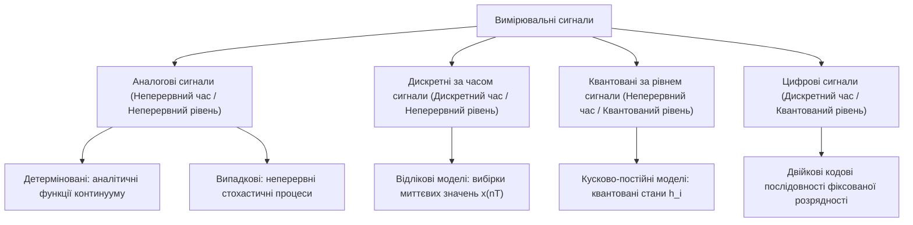
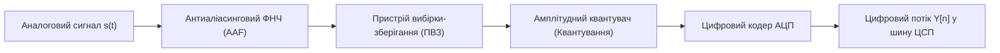
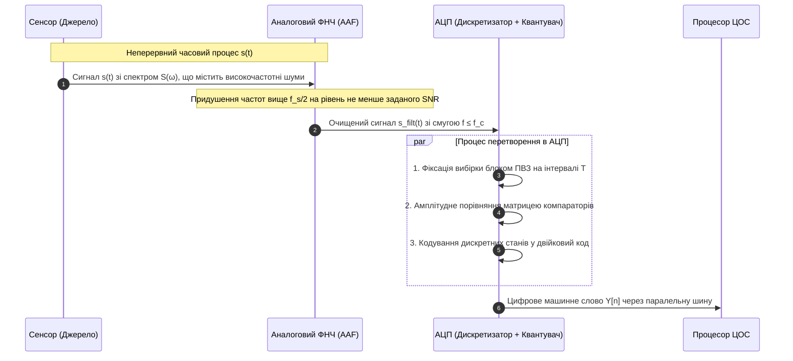
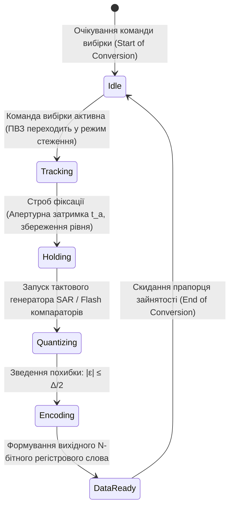
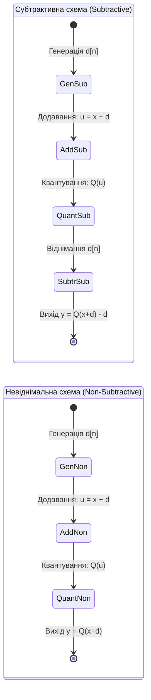
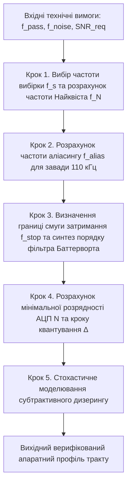

# Тема 1. Математичне представлення, дискретизація та квантування сигналів. Теорема Котельникова-Шеннона-Найквіста

## Мета лекції

Метою лекції є формування у майбутніх інженерів з комп'ютерних систем фундаментального теоретичного базису та практичних компетентностей щодо математичного моделювання й аналізу процесів перетворення неперервних фізичних сигналів у дискретну цифрову форму. У межах заняття розглядаються топологія просторів неперервних та квантованих сигналів, аналітичний апарат стробування континууму решіткою Дірака, граничні умови теореми відліків Котельникова-Шеннона-Найквіста, а також фізична природа спектрального еліасингу. Особлива увага приділяється метрологічним аспектам квантування за рівнем, аналітичному виведенню енергетичних співвідношень сигналу й шуму та методам стохастичної лінеаризації аналого-цифрових трактів засобами дизерингу.

## Очікувані результати навчання

1. **Знання та розуміння.** Студенти повинні демонструвати ґрунтовне розуміння фізичної та математичної природи аналогових, дискретних, квантованих і цифрових сигналів, знати властивості сингулярних тестових функцій, а також володіти аналітичним формулюванням теореми відліків Котельникова-Шеннона-Найквіста у часовій та частотній областях.

2. **Застосування.** Студенти повинні вміти розраховувати мінімально необхідну частоту дискретизації для детермінованих процесів, визначати параметри кроку квантування й розрядності АЦП для забезпечення заданого динамічного діапазону, а також розраховувати частоти зрізу аналогових антиаліасингових фільтрів.

3. **Аналіз.** Студенти повинні вміти аналізувати механізми виникнення паразитних стробоскопічних ефектів і спектрального накладання при порушенні критерію Найквіста, досліджувати спектральну щільність енергії похибки за теоремою Парсеваля та виявляти нелінійні кореляційні спотворення при квантуванні слабозмінних сигналів.

4. **Оцінювання та синтез.** Студенти повинні набути здатності критично оцінювати енергетичні втрати при дискретизації фінітних сигналів, аргументувати вибір параметрів надлишкової дискретизації (oversampling) та обґрунтовувати доцільність застосування адитивного або субтрактивного дизерингу для усунення ефекту псевдоконтурування на цифрових зображеннях.

---

## Детальний покроковий план лекції

### 1. Теоретичний модуль. Фізико-математичні основи представлення та класифікації сигналів у комп'ютерних системах

* 1.1. Фізична та інформаційна природа сигналів, взаємозв'язок просторово-часових континуумів і фундаментальна класифікація вимірювальних процесів на аналогові, дискретні, квантовані та цифрові.
* 1.2. Сингулярні тестові сигнали неперервного та дискретного часу: динамічне представлення процесів через функцію Хевісайда, розподіл Дірака та дискретний імпульс Кронекера.
* 1.3. Математична формалізація часової дискретизації як стробування неперервного сигналу періодичною дельта-решіткою та аналіз періодичності спектрального відгуку.
* 1.4. Простір станів і топологія амплітудного квантування за рівнем: аналітичний опис рівномірної дискретизації шкали вимірювань і природа незворотної інформаційної ентропії.

### 2. Аналітичний модуль. Спектральна теорія вибірки, критерії Найквіста та стохастичні моделі квантування

* 2.1. Строге аналітичне виведення теореми відліків Котельникова-Шеннона-Найквіста та синтез інтерполяційного ряду відновлення за ортогональним базисом функцій $\text{sinc}$.
* 2.2. Енергетичний критерій скінченності тривалості реальних сигналів, теорема Парсеваля та методика розрахунку практичної граничної частоти спектра.
* 2.3. Математична модель інтерференції спектральних реплік (аліасинг), аналітичний розрахунок хибних дзеркальних частот та схемотехнічні вимоги до антиаліасингової фільтрації.
* 2.4. Стохастична модель похибки квантування: аналітичне виведення потужності рівномірного білого шуму $\sigma_q^2 = \Delta^2 / 12$ та логарифмічного правила Беннета $\text{SNR} = 6.02N + 1.76\text{ дБ}$.
* 2.5. Математичне обґрунтування процедури дизеризації (dithering): механізми декореляції шуму квантування, порівняльний аналіз невіднімальних та субтрактивних алгоритмів лінеаризації перетворювачів.

### 3. Практично-розрахунковий кейс. Комплексне проєктування тракту аналого-цифрового перетворення для комп'ютерної системи збору даних

**Тема наскрізної задачі.** «Параметричний розрахунок частоти дискретизації, синтез антиаліасингового фільтра та визначення розрядності АЦП з оцінкою ефективності субтрактивного дизерингу для сенсорного вузла комп'ютерної вимірювальної системи»

## 1. Фундаментальний теоретичний базис та концептуальні засади

### 1.1. Фізична та інформаційна природа сигналів, просторово-часові залежності та класифікація вимірювальних процесів

У теорії комп'ютерних систем, приладобудуванні та інформаційно-вимірювальних технологіях **сигнал** розглядається як матеріальне втілення інформаційного повідомлення, представлене фізичним процесом, параметри якого функціонально змінюються залежно від стану досліджуваного об'єкта, фізичного поля або середовища поширення. Будь-який вимірювальний сигнал за своєю первинною сутністю є наслідком взаємодії матеріального носія із чутливим елементом первинного перетворювача (давача). У процесі цієї взаємодії просторово-часовий розподіл фізичної величини (механічного тиску, електромагнітної напруженості, температури чи оптичної густини) трансформується в еквівалентний інформативний параметр.

З позицій математичного моделювання сигнал абстрагується від конкретної фізичної субстанції та описується як функціональна залежність між інформативним параметром і множиною незалежних аргументів. У найпростішому випадку одномірного сигналу незалежною змінною є неперервний фізичний час $t \in \mathbb{R}$. Якщо об'єктом комп'ютерного аналізу є статичне монохромне зображення, фізична природа сигналу виражається просторовим розподілом яскравості чи оптичної щільності на площині, де аргументами виступають дві просторові координати $(x, y) \in \mathbb{R}^2$. У складніших радіолокаційних, томографічних або відеоінформаційних системах обробці підлягають багатовимірні просторово-часові поля $s(x, y, z, t)$, у яких інформативний параметр одночасно залежить від тривимірної просторової конфігурації та часової динаміки.

Узагальнена математична модель детермінованого вимірювального процесу довільної розмірності задається у формі багатопараметричного функціонального відображення:

$$s(\mathbf{r}, t) = F(\mathbf{r}, t, \omega; \mathbf{P})$$

де $s(\mathbf{r}, t)$ позначає спостережуваний інформативний параметр фізичного сигналу, виражений у відповідних одиницях вимірювання системи SI (вольтах, амперах чи паскалях).

Вектор $\mathbf{r} = (x, y, z)^T$ визначає просторові координати точки спостереження у тривимірному евклідовому просторі, які вимірюються в метрах ($\text{м}$).

Змінна $t$ задає абсолютний фізичний час протікання процесу, який вимірюється в секундах ($\text{с}$).

Параметр $\omega$ позначає просторову або часову кругову частоту коливань, що виражається в радіанах за секунду ($\text{рад/с}$).

Вектор $\mathbf{P} = (A, B, C, \dots)^T$ формує скінченну множину інваріантних параметрів аналітичної моделі сигналу (амплітудних масштабів, фазових зсувів, постійних часу), які визначають просторово-часову конфігурацію конкретного процесу.

За ознаками неперервності та дискретності просторово-часової області визначення, а також області допустимих значень інформативного параметра, усі фізичні процеси поділяються на чотири фундаментальні класи: аналогові, дискретні за часом, квантовані за рівнем та цифрові.

**Аналоговий сигнал** $y_a(t)$ є базовою фізичною формою існування матеріальних процесів макросвіту. Він описується неперервною або кусково-неперервною функцією, визначеною на незліченному континуумі часу $t$, де функція та її аргумент можуть набувати будь-яких значень у межах заданих неперервних інтервалів:

$$y_a(t) \in (y_{\min}, y_{\max}), \quad t \in (t_{\min}, t_{\max})$$

де $y_a(t)$ позначає миттєве значення аналогового сигналу у довільний момент часу $t$, виражене у вольтах ($\text{В}$).

Величини $y_{\min}$ та $y_{\max}$ задають нижню та верхню межі динамічного діапазону амплітуди сигналу, виражені у вольтах ($\text{В}$).

Величини $t_{\min}$ та $t_{\max}$ визначають часовий інтервал фізичного існування сигналу, виражений у секундах ($\text{с}$).

**Дискретний сигнал** $x[n]$ виникає шляхом фіксації значень первинного аналогового сигналу виключно в дискретні моменти часу $t_n = nT$, де $T$ виступає сталим інтервалом (періодом) дискретизації, а $n \in \mathbb{Z}$ є порядковим номером відліку. Значення кожного відліку $x[n] = y_a(nT)$ залишається неперервною фізичною величиною, що набуває значень із незліченної континуальної множини.

**Квантований за рівнем сигнал** $y_q(t)$ залишається неперервним за часовим аргументом $t$, проте його миттєва амплітуда набуває значень виключно зі скінченної або зліченної множини дозволених рівнів $\{h_1, h_2, \dots, h_K\}$. Кожен дозволений рівень відокремлений від сусіднього величиною кроку квантування $q$.

**Цифровий сигнал** $Y[n]$ формується внаслідок одночасного застосування операцій часової дискретизації та амплітудного квантування. Він являє собою квантовану решітчасту послідовність, кожен член якої визначений у дискретний момент $nT$, належить дискретній множині дозволених рівнів і кодується двійковим числовим словом певної розрядності. Саме цифрові сигнали є єдиною формою подання даних, придатною для безпосередньої машинної обробки у мікропроцесорах, спеціалізованих цифрових сигнальних процесорах (ЦСП) та електронно-обчислювальних машинах загального призначення.

За ступенем апріорної невизначеності інформаційного параметра сигнали поділяють на **детерміновані** (невипадкові) та **випадкові** (стохастичні). Якщо для будь-якого моменту часу значення процесу можна абсолютно точно обчислити за допомогою математичного виразу чи детермінованого алгоритму, сигнал вважається детермінованим. Якщо ж миттєве значення сигналу в момент часу $t_0$ являє собою випадкову величину, яка підпорядковується певній функції густини розподілу ймовірностей $p(x, t_0)$, то такий процес є випадковим. Реальні фізичні сигнали в радіотехніці та комп'ютерній інженерії завжди є випадковими або квазідетермінованими через неминучу присутність внутрішніх шумів напівпровідникових структур, атмосферних електромагнітних завад і термодинамічних флуктуацій.

### 1.2. Сингулярні тестові сигнали неперервного та дискретного часу: функції Хевісайда, дельта-функція Дірака та імпульс Кронекера

Теоретичний аналіз лінійних стаціонарних систем базується на використанні спеціальних тестових функцій, що мають особливі граничні або сингулярні властивості. Фундаментальними базисними функціями теорії сигналів є одинична ступінчаста функція Хевісайда та одинична імпульсна функція Дірака.

**Функція Хевісайда** $\sigma(t - t_0)$ (функція одиничного стрибка, або функція включення) моделює миттєвий перехід системи зі стану спокою в стан із постійним рівнем збудження під дією зовнішнього впливу, прикладеного в момент часу $t_0$. Формальне математичне визначення функції Хевісайда має вигляд:

$$\sigma(t - t_0) = \begin{cases} 0, & t < t_0 \\ \frac{1}{2}, & t = t_0 \\ 1, & t > t_0 \end{cases}$$

де $\sigma(t - t_0)$ є безрозмірною функцією одиничного стрибка, значення якої змінюється від $0$ до $1$.

Параметр $t_0$ позначає часовий момент прикладання стрибкоподібного збудження на осі часу, виражений у секундах ($\text{с}$).

Значення функції в точці розриву першого роду, що дорівнює $1/2$, визначається відповідно до класичної умови збіжності ряду Фур'є за критерієм Діріхле як напівсума правосторонньої та лівосторонньої границь. Функція Хевісайда дозволяє синтезувати довільний складний сигнал $s(t)$ за допомогою кусково-постійної апроксимації. При спрямуванні елементарного часового кроку $\Delta t \to 0$ така сума вироджується в інтегральне **динамічне представлення сигналу в часі**:

$$s(t) = s(0)\sigma(t) + \int_{0}^{\infty} \frac{ds(t')}{dt'} \sigma(t - t') \, dt'$$

де $s(0)$ позначає початкове значення аналогового сигналу в нульовий момент часу $t = 0$, виражене у вольтах ($\text{В}$).

Змінна $t'$ є змінною інтегрування вздовж координати часу, вираженою в секундах ($\text{с}$).

Похідна $\frac{ds(t')}{dt'}$ визначає миттєву швидкість зміни сигналу у фіксований момент $t'$, виражену у вольтах за секунду ($\text{В/с}$).

**Дельта-функція Дірака** $\delta(t - t_0)$ являє собою сингулярну узагальнену функцію (розподіл), яка формалізує фізичне поняття надкороткого імпульсного впливу нескінченно великої інтенсивності з кінцевою площею збудження, рівною одиниці. У рамках класичного математичного аналізу функція Дірака визначається співвідношеннями:

$$\delta(t - t_0) = \begin{cases} 0, & t \neq t_0 \\ \infty, & t = t_0 \end{cases}, \quad \int_{-\infty}^{\infty} \delta(t - t_0) \, dt = 1$$

де $\delta(t - t_0)$ позначає сингулярну узагальнену функцію Дірака, яка має розмірність $\text{с}^{-1}$.

Фізично дельта-функцію коректно інтерпретувати як границю прямокутного імпульсу $\text{rect}(t / \tau)$ одиничної площі за умови нескінченного звуження його тривалості $\tau$:

$$\delta(t) = \lim_{\tau \to 0} \frac{1}{\tau} \text{rect}\left(\frac{t}{\tau}\right)$$

де $\tau$ позначає тривалість прямокутного стробуючого імпульсу, яка вимірюється в секундах ($\text{с}$).

Функція $\text{rect}(\xi)$ є прямокутною селекторною функцією, що дорівнює одиниці при $|\xi| \le 1/2$ та набуває нульового значення при $|\xi| > 1/2$.

Між узагальненою дельта-функцією та функцією стрибка Хевісайда існує строгий взаємний інтегро-диференціальний зв'язок у сенсі теорії узагальнених функцій:

$$\delta(t - t_0) = \frac{d\sigma(t - t_0)}{dt}, \quad \sigma(t - t_0) = \int_{-\infty}^{t} \delta(\tau - t_0) \, d\tau$$

Ключовою математичною властивістю дельта-функції, покладеною в основу теорії дискретизації та спектрального аналізу, є її **фільтрувальна властивість** (sifting property):

$$\int_{-\infty}^{\infty} s(t) \delta(t - t_0) \, dt = s(t_0)$$

Даний інтегральний вираз демонструє, що скалярний добуток довільної неперервної функції $s(t)$ на зсунуту дельта-функцію Дірака дозволяє селективно вилучити (відфільтрувати) дискретне значення сигналу безпосередньо в точці сингулярності $t = t_0$.

У дискретній часовій області точним математичним еквівалентом дельта-функції виступає **одиничний імпульс Кронекера** $\delta[n]$, який на відміну від континуального розподілу Дірака є звичайною, несингулярною числовою послідовністю:

$$\delta[n] = \begin{cases} 1, & n = 0 \\ 0, & n \neq 0 \end{cases}$$

де $\delta[n]$ є безрозмірним числовим дискретним імпульсом, аргумент якого $n \in \mathbb{Z}$ є цілим числом.

Аналогом неперервної функції Хевісайда у дискретному часі є дискретний одиничний стрибок $u[n]$, який визначається співвідношенням:

$$u[n] = \begin{cases} 1, & n \ge 0 \\ 0, & n < 0 \end{cases}$$

Дискретний імпульс Кронекера пов'язаний із дискретним стрибком через першу різницеву похідну:

$$\delta[n] = u[n] - u[n - 1]$$

Будь-яка числова послідовність $x[n]$, що надходить у тракт цифрового сигнального процесора, може бути розкладена за ортонормованим базисом зсунутих імпульсів Кронекера:

$$x[n] = \sum_{k=-\infty}^{\infty} x[k]\delta[n - k]$$

де $x[n]$ позначає загальну числову послідовність дискретного сигналу, виражену в умовних одиницях або квантованих числових еквівалентах.

Числові коефіцієнти $x[k]$ визначають конкретне амплітудне значення сигналу в дискретний момент часу з індексом $k$.

Функція $\delta[n - k]$ забезпечує позиціювання відповідного відліку сигналу на цілочисловій осі часових індексів.

### 1.3. Математична формалізація часової дискретизації як стробування неперервного сигналу періодичною дельта-решіткою та аналіз періодичності спектрального відгуку

**Дискретизація неперервного сигналу за часом** являє собою процес перетворення неперервної функції континууму $s(t)$ у решітчасту дискретну послідовність числових значень. Формальною математичною моделлю ідеальної дискретизації (стробування) є операція множення неперервної функції $s(t)$ на періодичну імпульсну послідовність дельта-функцій Дірака, яка в літературі має назву гребеня або решітки Дірака $\eta_T(t)$:

$$\eta_T(t) = \sum_{n=-\infty}^{\infty} \delta(t - nT)$$

де $\eta_T(t)$ позначає періодичну гребінчасту функцію дискретизації, виражену в одиницях $\text{с}^{-1}$.

Параметр $T$ визначає крок (період) квантування часу між двома сусідніми актами зняття вибірок, який вимірюється в секундах ($\text{с}$).

Індекс $n \in \mathbb{Z}$ задає цілочисловий номер відповідного часового відліку.

Результат ідеальної дискретизації $s_\delta(t)$ у часовій області описується функціональним рядом амплітудно-модульованих сингулярних імпульсів:

$$s_\delta(t) = s(t) \cdot \eta_T(t) = s(t) \sum_{n=-\infty}^{\infty} \delta(t - nT) = \sum_{n=-\infty}^{\infty} s(nT) \delta(t - nT)$$

де $s_\delta(t)$ позначає математичну модель дискретизованого сигналу у вигляді модульованої послідовності імпульсів із неперервною амплітудою, виражену у вольтах на секунду ($\text{В/с}$).

Величина $s(nT)$ визначає істинне значення первинного неперервного сигналу в дискретний момент стробування $t = nT$, виражене у вольтах ($\text{В}$).

Функція $\delta(t - nT)$ позначає сингулярну дельта-функцію Дірака, зсунуту в часову точку взяття $n$-го відліку.

Для дослідження спектрального складу дискретизованого процесу $s_\delta(t)$ необхідно виконати пряме інтегральне перетворення Фур'є. Оскільки операції множення двох сигналів у часовій області відповідає згортка їхніх спектральних образів у частотній області, спектральна густина дискретизованого сигналу $S_\delta(\omega)$ набуває вигляду:

$$S_\delta(\omega) = \frac{1}{2\pi} \left[ S(\omega) * \mathcal{F}\{\eta_T(t)\} \right]$$

Оскільки функція $\eta_T(t)$ є строго періодичною з періодом $T$, її можна розкласти в комплексний тригонометричний ряд Фур'є:

$$\eta_T(t) = \sum_{k=-\infty}^{\infty} C_k e^{j k \omega_s t}, \quad C_k = \frac{1}{T} \int_{-T/2}^{T/2} \delta(t) e^{-j k \omega_s t} \, dt = \frac{1}{T}$$

де $\omega_s = \frac{2\pi}{T} = 2\pi f_s$ є круговою частотою дискретизації, що вимірюється в радіанах за секунду ($\text{рад/с}$).

Параметр $f_s = \frac{1}{T}$ позначає циклічну частоту зняття відліків, яка вимірюється в герцах ($\text{Гц}$).

Комплексні коефіцієнти ряду Фур'є $C_k$ є константами і чисельно дорівнюють величині $1/T$ для всіх гармонійних компонентів $k \in \mathbb{Z}$.

Виконуючи почленне перетворення Фур'є для ряду $\eta_T(t)$, отримуємо спектральне представлення гребеня Дірака у вигляді нескінченної періодичної послідовності імпульсів на осі частот:

$$\mathcal{F}\{\eta_T(t)\} = \frac{2\pi}{T} \sum_{k=-\infty}^{\infty} \delta\left(\omega - k\omega_s\right)$$

Обчислюючи інтеграл згортки неперервного спектра $S(\omega)$ з отриманим частотним гребенем за допомогою фільтрувальної властивості дельта-функції, отримуємо фундаментальне співвідношення Пуассона для спектральної густини дискретизованого сигналу:

$$S_\delta(\omega) = \frac{1}{2\pi} \int_{-\infty}^{\infty} S(\theta) \cdot \frac{2\pi}{T} \sum_{k=-\infty}^{\infty} \delta\left(\omega - \theta - k\omega_s\right) \, d\theta = \frac{1}{T} \sum_{k=-\infty}^{\infty} S(\omega - k\omega_s)$$

де $S_\delta(\omega)$ позначає спектральну густину дискретизованого сигналу, виражену у вольт-секундах ($\text{В}\cdot\text{с}$).

Функція $S(\omega - k\omega_s)$ визначає базовий спектр початкового неперервного сигналу, циклічно зміщений уздовж осі частот на величину $k\omega_s$, кратну частоті дискретизації.

Множник $\frac{1}{T}$ виступає амплітудним масштабним коефіцієнтом, що нормує спектральну густину відповідно до періоду стробування.

Аналітичний висновок із формули спектра дискретизованого сигналу доводить: спектр сигналу після процедури часової дискретизації трансформується у строго періодичну функцію частоти з періодом повторення, що чисельно дорівнює частоті дискретизації $\omega_s$. Цей спектр формується нескінченною сумою спектральних реплік (копій) оригінального спектра $S(\omega)$. Для запобігання взаємного накладання цих реплік необхідно забезпечити розділення суміжних спектральних зон на осі частот, що становить основу фізичної реалізації апаратури цифрового перетворення.

Наведена структурна схема відображає типовий шлях перетворення сигналу в апаратному тракті комп'ютерної системи. Первинний аналоговий сигнал очищується від високочастотних складових за допомогою аналогового антиаліасингового фільтра (AAF), надходить до пристрою вибірки-зберігання (ПВЗ), де здійснюється фіксація миттєвого рівня на час перетворення, після чого квантується за амплітудою та кодується паралельним числовим двійковим кодом.

### 1.4. Простір станів і топологія амплітудного квантування за рівнем: аналітичний опис рівномірної дискретизації шкали вимірювань і природа незворотної інформаційної ентропії

Фізичні відліки $s(nT)$, отримані на виході ідеального дискретизатора часу, продовжують залишатися континуальними величинами з незліченної множини амплітуд. Для представлення цих значень у скінченній розрядній сітці обчислювального пристрою необхідно здійснити **квантування за рівнем** — відображення неперервної осі амплітуд на дискретну множину цілочислових індексів.

Повний динамічний діапазон вхідної напруги $V_{\text{range}} = [V_{\min}, V_{\max}]$ розбивається системою з $K+1$ порогових рівнів $\{d_0, d_1, \dots, d_K\}$ на $K$ неперетинних підінтервалів квантування $I_j = (d_{j-1}, d_j]$. Кожному інтервалу $I_j$ ставиться у відповідність дискретний рівень квантування $r_j \in \{h_1, h_2, \dots, h_K\}$, який найчастіше обирається як геометричний центр відповідного сегмента.

Оператор рівномірного амплітудного квантування $Q(\cdot)$ формалізується кусково-постійною передавальною функцією сходинкового типу:

$$x_q = Q(x) = r_j, \quad \text{якщо } x \in (d_{j-1}, d_j]$$

де $x$ позначає вхідне неперервне амплітудне значення відліку, виражене у вольтах ($\text{В}$).

Величина $x_q$ позначає дискретне квантоване значення амплітуди сигналу, виражене у вольтах ($\text{В}$).

Символ $r_j$ задає фіксований номінальний рівень відновлення, закріплений за $j$-м діапазоном квантування.

Параметри $d_{j-1}$ та $d_j$ визначають нижню та верхню межі (пороги спрацьовування компараторів) $j$-го інтервалу квантування.

У разі **рівномірного квантування** ширина всіх квантових інтервалів є строго константною та визначає величину кроку квантування $\Delta$ (квант за напругою, ціна найменшого значущого розряду — LSB, Least Significant Bit). Для лінійного аналого-цифрового перетворювача з розрядністю $N$ бітів загальна кількість формуваних рівнів становить $K = 2^N$, а величина кроку квантування розраховується за аналітичною залежністю:

$$\Delta = \frac{V_{\max} - V_{\min}}{2^N - 1} \approx \frac{V_{\text{range}}}{2^N}$$

де $\Delta$ визначає крок квантування за рівнем напруги, виражений у вольтах ($\text{В}$).

Параметри $V_{\max}$ та $V_{\min}$ задають граничні межі вхідної аналогової шкали перетворювача, виражені у вольтах ($\text{В}$).

Змінна $N$ позначає розрядність аналого-цифрового перетворювача, виражену в цілих бітах.

Величина $V_{\text{range}}$ визначає повний діапазон перетворення шкали квантувача у вольтах ($\text{В}$).

Квантування за рівнем є принципово нелінійною, неін'єктивною операцією, за якої безліч незліченних континуальних значень вхідного сигналу відображається в одне єдине дискретне число. Це породжує непереборну інформаційну ентропію — незворотну втрату первинної інформації про точну амплітуду відліку. Різниця між істинним значенням сигналу $x(t)$ та його дискретним наближенням $x_q(t)$ утворює **похибку (шум) квантування** $\varepsilon(t)$:

$$\varepsilon(t) = x(t) - Q[x(t)] = x(t) - x_q(t)$$

де $\varepsilon(t)$ позначає абсолютну миттєву похибку амплітудного квантування, виражену у вольтах ($\text{В}$).

Функція $x(t)$ позначає точне аналогове значення амплітуди первинного сигналу в момент вимірювання, виражене у вольтах ($\text{В}$).

Величина $x_q(t)$ позначає дискретне квантоване наближення сигналу на виході перетворювача, виражене у вольтах ($\text{В}$).

При застосуванні симетричного правила заокруглення до найближчого дозволеного рівня максимальна абсолютна похибка квантування строго обмежена половиною кроку квантування:

$$-\frac{\Delta}{2} \le \varepsilon(t) \le \frac{\Delta}{2}$$

| Клас сигналу | Часовий аргумент | Амплітудний рівень | Математичний опис | Апаратна реалізація | Основне джерело похибок |
| :--- | :--- | :--- | :--- | :--- | :--- |
| **Аналоговий** | Неперервний ($t \in \mathbb{R}$) | Неперервний ($y \in \mathbb{R}$) | Диференціальні рівняння, інтеграли Фур'є | Аналогові RC/LC-ланцюги, операційні підсилювачі | Дрейф нуля, тепловий шум Джонсона, температурна нестабільність |
| **Дискретний** | Дискретний ($n \in \mathbb{Z}$) | Неперервний ($y \in \mathbb{R}$) | Решітчасті функції, різницеві рівняння | Пристрої вибірки-зберігання, комутовані конденсатори | Джитер синхросигналу (апертурна невизначеність), витік заряду ПВЗ |
| **Квантований** | Неперервний ($t \in \mathbb{R}$) | Дискретний ($y \in \{h_1..h_K\}$) | Кусково-постійні функції, релейні оператори | Порогові тригери Шмітта, багатопорогові компаратори | Статична нелінійність компаратора, гістерезисні затримки |
| **Цифровий** | Дискретний ($n \in \mathbb{Z}$) | Дискретний ($y \in \{h_1..h_K\}$) | Алгебраїчні різницеві рівняння, z-перетворення | Сигнальні процесори (DSP), мікроконтролери, ПЛІС (FPGA) | Похибка квантування, шум скінченної розрядності регістрів обчислювача |

> **ТИПОВА ПОМИЛКА:**
> Поширеним є твердження, що дискретний за часом сигнал $x[n]$ дорівнює нулю у проміжках між послідовними моментами стробування, тобто коли часовий аргумент $t \neq nT$. Це грубе методологічне порушення фізичної та математичної логіки. Операція дискретизації за своєю фундаментальною природою звужує область визначення функції з континууму дійсних чисел $\mathbb{R}$ до дискретної підмножини цілих чисел $\mathbb{Z}$. У проміжках між відліками $t \in (nT, (n+1)T)$ дискретний сигнал взагалі не існує (його значення невизначене), а не набуває числового значення $0$. Приписування сигналу нульових значень у міжвідліковому інтервалі еквівалентно штучному впровадженню додаткових нульових строб-імпульсів, що радикально модифікує спектральний склад процесу, збагачуючи його новими високочастотними паразитними гармоніками.

> **КОНТРОЛЬНЕ ПИТАННЯ.**
> У чому полягає фундаментальна математична відмінність між розмірністю та спектральними властивостями континуальної дельта-функції Дірака $\delta(t)$ та дискретного імпульсу Кронекера $\delta[n]$, і як ця відмінність впливає на операцію розкладання сигналів у відповідних часових областях?

Розгорнути відповідь

**Відповідь:**

1. Функція Дірака $\delta(t)$ є узагальненою сингулярною функцією (розподілом) неперервного часу з нескінченною амплітудою в точці $t=0$, скінченною одиничною площею та фізичною розмірністю оберненого часу ($\text{с}^{-1}$). Її спектральна щільність Фур'є є неперервною константою у нескінченному діапазоні частот:

$$S_\delta(\omega) = \int_{-\infty}^{\infty} \delta(t) e^{-j\omega t} \, dt = 1, \quad \omega \in (-\infty; +\infty)$$

2. Дискретний одиничний імпульс Кронекера $\delta[n]$ є безрозмірною числовою послідовністю дискретного часу, амплітуда якої строго дорівнює одиниці в точці $n=0$ і нулю при $n \neq 0$. Його спектр є періодичною функцією частоти:

$$X_\delta(e^{j\omega}) = \sum_{n=-\infty}^{\infty} \delta[n] e^{-j\omega n} = 1, \quad \forall \omega$$

3. Аналіз дистракторів та наслідків:

    * Твердження про повну еквівалентність функцій Дірака і Кронекера є хибним, оскільки інтегрування сигналу з дельта-функцією вимагає використання неперервного інтеграла Рімана-Стілтьєса, тоді як дискретне розкладання спирається на дискретну операцію сумування згорток.
    * Помилковим є ототожнення розмірностей: дельта-функція Дірака має фізичну розмірність, що компенсує диференціал часу $dt$ під інтегралом, тоді як імпульс Кронекера є строго нормованим абстрактним скалярним множником.

### Вказівки для самостійного осмислення теоретичного базису

1. **Порівняльний топологічний аналіз континуальних та решітчастих просторів.** Необхідно самостійно довести, чому перетворення гільбертового простору неперервних функцій $L_2(\mathbb{R})$ у простір дискретних числових послідовностей $l_2(\mathbb{Z})$ зберігає ізоморфізм енергетичних параметрів виключно для сигналів з компактним спектральним носієм. Слід звернути увагу на геометричну інтерпретацію відстані між сигналами у функціональних просторах різної природи.

2. **Аналіз ентропійних характеристик перетворювачів.** Потрібно проаналізувати механізм зменшення інформаційної невизначеності сигналу при переході від аналогового представлення до квантованого цифрового потоку через призму ентропії Шеннона. Необхідно формалізувати аналітичну залежність між довжиною машинного слова розрядної сітки АЦП та теоретичною швидкістю генерації інформації джерелом дискретизованих повідомлень.

## 2. Аналітичні процеси, математичний апарат та моделювання

### 2.1. Строге аналітичне виведення теореми відліків Котельникова-Шеннона-Найквіста та синтез інтерполяційного ряду відновлення за ортогональним базисом функцій $\text{sinc}$

Теорема відліків розглядає гільбертів простір функцій із квадратично інтегрованою амплітудою $L_2(\mathbb{R})$, спектральний носій яких є компактною множиною, обмеженою граничною круговою частотою $\omega_{\text{гр}} = 2\pi f_{\text{гр}}$. Такий підпростір у функціональному аналізі позначається як простір Пелі-Вінера $PW_{\omega_{\text{гр}}}$. Нехай аналоговий сигнал $s(t) \in PW_{\omega_{\text{гр}}}$ є строго фінітним у частотній області, тобто його спектральна густина $S(\omega) = \mathcal{F}\{s(t)\}$ тотожно перетворюється на нуль за межами частотного інтервалу:

$$S(\omega) = 0 \quad \forall |\omega| > \omega_{\text{гр}}$$

Обернене перетворення Фур'є для зазначеного класу сигналів записується у вигляді інтеграла зі скінченними межами:

$$s(t) = \frac{1}{2\pi} \int_{-\omega_{\text{гр}}}^{\omega_{\text{гр}}} S(\omega) e^{j\omega t} \, d\omega$$

де $s(t)$ позначає значення неперервного сигналу в довільний момент часу $t$, виражене у вольтах ($\text{В}$).

Функція $S(\omega)$ позначає комплексну спектральну густину амплітуд первинного сигналу, виражену у вольт-секундах ($\text{В}\cdot\text{с}$).

Змінна $\omega$ задає поточну кругову частоту коливань континууму, яка вимірюється в радіанах за секунду ($\text{рад/с}$).

Параметр $\omega_{\text{гр}}$ визначає максимальну граничну кругову частоту спектра процесу, виражену в радіанах за секунду ($\text{рад/с}$).

Розглянемо періодичне продовження функції $S(\omega)$ із базового інтервалу $[-\omega_{\text{гр}}, \omega_{\text{гр}}]$ на всю дійсну вісь частот із періодом повторення $\omega_s \ge 2\omega_{\text{гр}}$. Періодизовану функцію спектра $S_{\text{per}}(\omega)$ можна розкласти у класичний комплексний ряд Фур'є за ортогональною системою гармонічних базисних функцій $\{e^{-j n \frac{2\pi}{\omega_s} \omega}\}$:

$$S_{\text{per}}(\omega) = \sum_{n=-\infty}^{\infty} c_n e^{-j n T \omega}, \quad T = \frac{2\pi}{\omega_s}$$

Комплексні коефіцієнти ряду $c_n$ обчислюються шляхом інтегрування спектральної функції в межах одного періоду:

$$c_n = \frac{1}{\omega_s} \int_{-\omega_s/2}^{\omega_s/2} S_{\text{per}}(\omega) e^{j n T \omega} \, d\omega$$

За умови мінімальної частоти вибірки $\omega_s = 2\omega_{\text{гр}}$ період повторення становить $T = \frac{\pi}{\omega_{\text{гр}}}$. У межах симетричного інтервалу $[-\omega_{\text{гр}}, \omega_{\text{гр}}]$ періодизована функція $S_{\text{per}}(\omega)$ повністю збігається з вихідною спектральною густиною $S(\omega)$. Порівнюючи інтеграл для коефіцієнта $c_n$ із загальним виразом оберненого перетворення Фур'є для моменту часу $t = nT$, встановлюємо строгу рівність:

$$c_n = \frac{1}{2\omega_{\text{гр}}} \int_{-\omega_{\text{гр}}}^{\omega_{\text{гр}}} S(\omega) e^{j n T \omega} \, d\omega = \frac{2\pi}{2\omega_{\text{гр}}} \cdot \left[ \frac{1}{2\pi} \int_{-\omega_{\text{гр}}}^{\omega_{\text{гр}}} S(\omega) e^{j \omega (nT)} \, d\omega \right] = \frac{\pi}{\omega_{\text{гр}}} s(nT) = T \cdot s(nT)$$

Підставляючи отримані вагові коефіцієнти $c_n$ у формулу ряду Фур'є для спектральної густини, а потім підставляючи вираз спектра в інтеграл оберненого перетворення Фур'є, отримуємо аналітичну процедуру відновлення континууму:

$$
\begin{aligned}
\text{Етап 1 (Підстановка спектрального ряду):} & \quad s(t) = \frac{1}{2\pi} \int_{-\omega_{\text{гр}}}^{\omega_{\text{гр}}} \left[ \sum_{n=-\infty}^{\infty} T \cdot s(nT) e^{-j n T \omega} \right] e^{j\omega t} \, d\omega \\
\text{Етап 2 (Зміна порядку операцій):} & \quad s(t) = \sum_{n=-\infty}^{\infty} s(nT) \cdot \frac{T}{2\pi} \int_{-\omega_{\text{гр}}}^{\omega_{\text{гр}}} e^{j\omega (t - nT)} \, d\omega \\
\text{Етап 3 (Аналітичне інтегрування ядер):} & \quad \int_{-\omega_{\text{гр}}}^{\omega_{\text{гр}}} e^{j\omega (t - nT)} \, d\omega = \left[ \frac{e^{j\omega (t - nT)}}{j(t - nT)} \right]_{-\omega_{\text{гр}}}^{\omega_{\text{гр}}} = \frac{2\sin(\omega_{\text{гр}}(t - nT))}{t - nT} \\
\text{Етап 4 (Формування кардинального ряду):} & \quad s(t) = \sum_{n=-\infty}^{\infty} s(nT) \frac{\sin\left(\frac{\pi}{T}(t - nT)\right)}{\frac{\pi}{T}(t - nT)} = \sum_{n=-\infty}^{\infty} s(nT) \text{sinc}\left(\frac{\pi}{T}(t - nT)\right)
\end{aligned}
$$

де $s(nT)$ позначає миттєве значення сигналу у вузлі дискретизації $t_n = nT$, виражене у вольтах ($\text{В}$).

Функція $\text{sinc}(\xi) = \frac{\sin \xi}{\xi}$ визначає кардинальне інтерполяційне ядро Котельникова, аргумент якого є безрозмірним.

Величина $T = \frac{1}{2 f_{\text{гр}}}$ є граничним кроком дискретизації за часом, що вимірюється в секундах ($\text{с}$).

Базисні функції $\psi_n(t) = \text{sinc}\left(\frac{\pi}{T}(t - nT)\right)$ володіють властивістю строгої взаємної ортогональності в гільбертовому просторі $L_2(\mathbb{R})$:

$$\int_{-\infty}^{\infty} \text{sinc}\left(\frac{\pi}{T}(t - nT)\right) \text{sinc}\left(\frac{\pi}{T}(t - mT)\right) \, dt = T \cdot \delta_{nm}$$

де $\delta_{nm}$ є символом Кронекера, який дорівнює одиниці при рівності цілочислових індексів $n = m$ та нулю при їх розбіжності $n \neq m$.

Асимптотична поведінка кардинального ядра при наближенні аргументу до вузлових точок відповідає фундаментальним граничним співвідношенням:

$$\lim_{t \to nT} \text{sinc}\left(\frac{\pi}{T}(t - nT)\right) = 1, \quad \lim_{t \to mT, \, m \neq n} \text{sinc}\left(\frac{\pi}{T}(t - nT)\right) = 0$$

Це гарантує точну інтерполяцію: у моменти зняття відліків внесок усіх сусідніх членів ряду повністю обнуляється, а вихідний сигнал формується виключно поточним значенням $s(nT)$.

### 2.2. Енергетичний критерій обмеження спектра реальних фінітних сигналів за формулою Парсеваля та вибір практичної граничної частоти

У реальних інформаційно-вимірювальних каналах будь-який спостережуваний процес $s(t)$ має скінченну тривалість $T_{\text{сиг}}$, тобто є строго фінітною функцією на інтервалі $t \in [0, T_{\text{сиг}}]$. Згідно з фундаментальною теоремою Пелі-Вінера, функція, скінченна в часовій області, не може мати строго обмеженого носія у частотній області. Спектральна густина $S(\omega)$ фінітного сигналу тягнеться вздовж осі частот до нескінченності, спадаючи за асимптотичним степеневим законом $\mathcal{O}(\omega^{-k})$, де показник $k$ визначається порядком гладкості найгрубшого розриву функції або її похідних.

Для коректного визначення частоти вибірки використовують енергетичну метрику. Повна фізична енергія сигналу $E_s$ встановлюється рівністю Парсеваля:

$$E_s = \int_{0}^{T_{\text{сиг}}} |s(t)|^2 \, dt = \frac{1}{2\pi} \int_{-\infty}^{\infty} |S(\omega)|^2 \, d\omega = \frac{1}{\pi} \int_{0}^{\infty} |S(\omega)|^2 \, d\omega$$

де $E_s$ позначає повну енергію процесу, виражену в джоулях ($\text{Дж}$).

Величина $|S(\omega)|^2$ задає спектральну густину енергії процесу, виражену в джоулях на герц ($\text{Дж/Гц}$ або $\text{В}^2\cdot\text{с}^2$).

Практична гранична кругова частота $\omega_{\text{гр}}$ знаходиться із трансцендентного інтегрального рівняння, що фіксує частку корисної збереженої енергії $\eta$:

$$\frac{1}{\pi} \int_{0}^{\omega_{\text{гр}}} |S(\omega)|^2 \, d\omega = \eta \cdot E_s$$

де $\eta$ є нормативним коефіцієнтом збереження енергії, який в інженерних розрахунках обирається в діапазоні $\eta \in [0.950; 0.999]$.

Енергетична похибка апроксимації $\Delta E$, зумовлена відкиданням нескінченного спектрального хвоста вище розрахункової частоти $\omega_{\text{гр}}$, дорівнює:

$$\Delta E = \frac{1}{\pi} \int_{\omega_{\text{гр}}}^{\infty} |S(\omega)|^2 \, d\omega = (1 - \eta) E_s$$

Абсолютна та відносна похибки відновлення сигналу за нормою простору $L_2$ зв'язані співвідношенням:

$$\gamma = \frac{\Delta E}{E_s} = 1 - \eta = \frac{\int_{-\infty}^{\infty} \left|s(t) - \sum_{n} s(nT)\text{sinc}\left(\frac{\pi}{T}(t - nT)\right)\right|^2 dt}{\int_{-\infty}^{\infty} |s(t)|^2 dt}$$

Розглянемо як модельний приклад поодинокий прямокутний відеоімпульс амплітудою $A$ і тривалістю $\tau$. Його спектральна густина описується виразом:

$$S(\omega) = A\tau \frac{\sin\left(\frac{\omega\tau}{2}\right)}{\frac{\omega\tau}{2}}$$

Повна енергія сигналу становить $E_s = A^2 \tau$. Інтеграл спектральної щільності зводиться до інтеграла Діріхле:

$$
\begin{aligned}
\text{Етап 1 (Запис інтеграла енергії хвоста):} & \quad \Delta E = \frac{A^2 \tau^2}{\pi} \int_{\omega_{\text{гр}}}^{\infty} \frac{\sin^2\left(\frac{\omega\tau}{2}\right)}{\left(\frac{\omega\tau}{2}\right)^2} \, d\omega \\
\text{Етап 2 (Заміна змінної $\xi = \frac{\omega\tau}{2}$):} & \quad \Delta E = \frac{2 A^2 \tau}{\pi} \int_{\frac{\omega_{\text{гр}}\tau}{2}}^{\infty} \frac{\sin^2 \xi}{\xi^2} \, d\xi \\
\text{Етап 3 (Асимптотична оцінка при $\omega_{\text{гр}}\tau \gg 1$):} & \quad \Delta E \approx \frac{2 A^2 \tau}{\pi} \cdot \frac{1}{2} \int_{\frac{\omega_{\text{гр}}\tau}{2}}^{\infty} \xi^{-2} \, d\xi = \frac{2 E_s}{\pi \omega_{\text{гр}} \tau}
\end{aligned}
$$

З отриманої асимптотики випливає, що відносна похибка $\gamma = \frac{2}{\pi \omega_{\text{гр}} \tau}$ спадає гіперболічно повільно, що вимагає багаторазового розширення смуги частот антиаліасингового тракту для імпульсних процесів.

### 2.3. Математична модель інтерференції спектральних реплік (аліасинг), аналітичний розрахунок хибних дзеркальних частот та схемотехнічні вимоги до антиаліасингової фільтрації

Якщо частота дискретизації $\omega_s$ не задовольняє умову Найквіста і становить величину $\omega_s < 2\omega_{\text{гр}}$, періодичні репліки спектра $S(\omega - k\omega_s)$ у формулі Пуассона взаємно перекриваються. Процес суперпозиції високочастотних спектральних компонентів на область базових низьких частот описується сумарною спектральною густиною дискретизованого сигналу:

$$S_\delta(\omega) = \frac{1}{T} S(\omega) + \frac{1}{T} \sum_{k \neq 0} S(\omega - k\omega_s)$$

В інтервалі спостереження $|\omega| \le \frac{\omega_s}{2}$ другий доданок перестає дорівнювати нулю і створює незворотну аліасингову деформацію.

Для аналітичного розрахунку хибної частоти (псевдоніма) розглянемо високочастотне гармонічне коливання з частотою $f_0$, що перевищує частоту Найквіста $f_N = f_s / 2$. Послідовність відліків такого сигналу має вигляд:

$$x[n] = \cos(2\pi f_0 n T + \varphi_0) = \cos\left(2\pi \frac{f_0}{f_s} n + \varphi_0\right)$$

Користуючись властивістю парності тригонометричного косинуса $\cos(\alpha) = \cos(-\alpha)$ та періодичністю відносно додавання цілого числа періодів $2\pi k$, ми можемо перетворити аргумент до еквівалентного значення, що потрапляє в першу зону Найквіста $[0; f_s/2]$:

$$x[n] = \cos\left(2\pi \left| f_0 - k f_s \right| n T \pm \varphi_0\right)$$

Ціле число $k$ визначається за формулою округлення до найближчого цілого:

$$k = \left\lfloor \frac{f_0}{f_s} + \frac{1}{2} \right\rfloor$$

Таким чином, розрахункова позірна (аліасингова) циклічна частота $f_{\text{app}}$, що спостерігається на виході ідеального демодулятора, визначається формулою:

$$f_{\text{app}} = \left| f_0 - f_s \cdot \left\lfloor \frac{f_0}{f_s} + \frac{1}{2} \right\rfloor \right|$$

де $f_{\text{app}}$ позначає результуючу частоту помилкової низькочастотної гармоніки в герцах ($\text{Гц}$), причому гарантовано $0 \le f_{\text{app}} \le \frac{f_s}{2}$.

Параметр $f_0$ задає дійсну фізичну частоту вхідного сигналу, виражену в герцах ($\text{Гц}$).

Величина $f_s$ позначає циклічну частоту дискретизації вимірювального перетворювача в герцах ($\text{Гц}$).

Для виключення проникнення завад із вищих зон Найквіста в тракт впроваджують аналоговий фільтр низьких частот (Anti-Aliasing Filter — AAF). Якщо корисний сигнал займає смугу частот $[0; f_{\text{pass}}]$, а частота дискретизації системи зафіксована на рівні $f_s$, то найнижча частота, здатна створити аліасинг у корисній смузі, становить:

$$f_{\text{stop}} = f_s - f_{\text{pass}}$$

Отже, антиаліасинговий фільтр повинен мати перехідну смугу шириною $\Delta f = f_{\text{stop}} - f_{\text{pass}} = f_s - 2f_{\text{pass}}$. Мінімально необхідний порядок фільтра Баттерворта $N_{\text{filt}}$ для забезпечення ослаблення $A_{\text{stop}}$ (дБ) у смузі затримання при нерівномірності $A_{\text{pass}}$ (дБ) у смузі пропускання розраховується за формулою:

$$N_{\text{filt}} \ge \frac{\log_{10}\left( \frac{10^{0.1 A_{\text{stop}}} - 1}{10^{0.1 A_{\text{pass}}} - 1} \right)}{2 \log_{10}\left( \frac{f_{\text{stop}}}{f_{\text{pass}}} \right)}$$

### 2.4. Стохастична модель похибки квантування: аналітичне виведення потужності рівномірного білого шуму $\sigma_q^2 = \Delta^2 / 12$ та логарифмічного правила Беннета $\text{SNR} = 6.02N + 1.76\text{ дБ}$

Математичний опис процесу квантування як детермінованої нелінійності сходинкового типу є надзвичайно громіздким для спектрального аналізу. Відповідно до стохастичної моделі Відроу, похибка квантування $\varepsilon = x - x_q$ моделюється як стаціонарний випадковий процес типу «білий шум», що має нульове математичне очікування та рівномірну одновимірну густину розподілу ймовірностей $p(\varepsilon)$ на інтервалі симетричного заокруглення:

$$p(\varepsilon) = \begin{cases} \frac{1}{\Delta}, & -\frac{\Delta}{2} \le \varepsilon \le \frac{\Delta}{2} \\ 0, & |\varepsilon| > \frac{\Delta}{2} \end{cases}$$

де $\Delta$ позначає величину кванта напруги (крок квантування), виражену у вольтах ($\text{В}$).

Потужність шуму квантування дорівнює дисперсії випадкової величини $\sigma_q^2 = D[\varepsilon]$. Оскільки математичне очікування помилки $M[\varepsilon] = 0$ через симетрію розподілу, дисперсія обчислюється як інтеграл другого початкового моменту:

$$
\begin{aligned}
\text{Етап 1 (Формулювання інтеграла):} & \quad \sigma_q^2 = \int_{-\infty}^{\infty} \varepsilon^2 p(\varepsilon) \, d\varepsilon = \int_{-\Delta/2}^{\Delta/2} \varepsilon^2 \frac{1}{\Delta} \, d\varepsilon \\
\text{Етап 2 (Інтегрування степеневої функції):} & \quad \sigma_q^2 = \frac{1}{\Delta} \left[ \frac{\varepsilon^3}{3} \right]_{-\Delta/2}^{\Delta/2} \\
\text{Етап 3 (Підстановка границь інтегрування):} & \quad \sigma_q^2 = \frac{1}{3\Delta} \left( \left(\frac{\Delta}{2}\right)^3 - \left(-\frac{\Delta}{2}\right)^3 \right) = \frac{1}{3\Delta} \left( \frac{\Delta^3}{8} + \frac{\Delta^3}{8} \right) \\
\text{Етап 4 (Остаточне спрощення виразу):} & \quad \sigma_q^2 = \frac{1}{3\Delta} \cdot \frac{2\Delta^3}{8} = \frac{\Delta^2}{12}
\end{aligned}
$$

Середньоквадратичне відхилення (ефективна напруга шуму квантування) становить:

$$\sigma_q = \frac{\Delta}{\sqrt{12}} = \frac{\Delta}{2\sqrt{3}} \approx 0.2887 \cdot \Delta$$

Для отримання енергетичного відношення сигнал/шум ($\text{SNR}$) розглянемо тестове детерміноване гармонічне коливання повної шкали $x(t) = A \sin(\omega_0 t)$, де амплітуда $A$ збігається з половиною повного динамічного діапазону перетворення $N$-розрядного АЦП:

$$A = \frac{V_{\text{range}}}{2} = \frac{2^N \Delta}{2} = 2^{N-1} \Delta$$

Середня потужність гармонічного коливання на одиничному опорі обчислюється через інтеграл за періодом:

$$P_s = \frac{1}{T_0} \int_{0}^{T_0} A^2 \sin^2(\omega_0 t) \, dt = \frac{A^2}{2} = \frac{\left(2^{N-1} \Delta\right)^2}{2} = \frac{2^{2N-2} \Delta^2}{2} = \frac{2^{2N} \Delta^2}{8}$$

Співвідношення сигнал/шум у децибелах визначається як логарифм відношення потужностей:

$$
\begin{aligned}
\text{Етап 1 (Складання дробу потужностей):} & \quad \text{SNR} = 10 \log_{10}\left( \frac{P_s}{\sigma_q^2} \right) = 10 \log_{10}\left( \frac{\frac{2^{2N} \Delta^2}{8}}{\frac{\Delta^2}{12}} \right) \\
\text{Етап 2 (Спрощення масштабних факторів):} & \quad \text{SNR} = 10 \log_{10}\left( \frac{12}{8} \cdot 2^{2N} \right) = 10 \log_{10}\left( \frac{3}{2} \cdot 2^{2N} \right) \\
\text{Етап 3 (Розклад логарифма добутку):} & \quad \text{SNR} = 10 \log_{10}(1.5) + 10 \log_{10}\left(2^{2N}\right) \\
\text{Етап 4 (Винесення показника степеня):} & \quad \text{SNR} = 10 \log_{10}(1.5) + 20 N \log_{10}(2)
\end{aligned}
$$

Обчислюючи константи з високою точністю:

$$10 \log_{10}(1.5) \approx 1.76091259\dots \text{ дБ}, \quad 20 \log_{10}(2) \approx 6.0205999\dots \text{ дБ}$$

Отримуємо класичну формулу Беннета для граничного теоретичного відношення сигнал/шум ідеального квантувача:

$$\text{SNR}_{\text{dB}} = 6.0206 \cdot N + 1.7609 \approx 6.02 \cdot N + 1.76 \quad [\text{дБ}]$$

де $N$ позначає кількість розрядів АЦП (біт).

Дослідження граничної поведінки співвідношення при прямуванні розрядності до нескінченності:

$$\lim_{N \to \infty} \text{SNR}(N) = \infty, \quad \lim_{N \to \infty} \sigma_q^2(N) = \lim_{N \to \infty} \frac{V_{\text{range}}^2}{12 \cdot 2^{2N}} = 0$$

Це свідчить про повну лінеаризацію тракту перетворення при експоненційному зростанні апаратної складності.

### 2.5. Математичне обґрунтування процедури дизеризації (dithering): механізми декореляції шуму квантування, порівняльний аналіз невіднімальних та субтрактивних алгоритмів лінеаризації перетворювачів

Якщо квантований процес має амплітуду, співрозмірну з кроком квантування $\Delta$, або змінюється строго періодично із частотами, кратними частоті вибірки, припущення Відроу про білий шум порушується. Похибка квантування стає детермінованою нелінійною функцією сигналу:

$$\varepsilon[n] = x[n] - Q(x[n])$$

Це призводить до появи паразитних гармонік у спектрі (Cross-modulation distortion), виникнення стійких граничних циклів і візуального ефекту «псевдоконтурування» (ізоліній) на цифрових зображеннях.

Для усунення кореляції між сигналом і шумом застосовують **дизеризацію** — підмішування псевдовипадкового допоміжного некорельованого сигналу $d[n]$ перед процедурою квантування.

У разі невіднімального дизерингу результуючий вихідний сигнал $y[n]$ формується як:

$$y[n] = Q(x[n] + d[n])$$

За Шухманом, для того, щоб математичне очікування сумарної похибки $\varepsilon_t = y - x$ не залежало від значення вхідного сигналу $x$, характеристична функція шуму дизерингу $\Phi_d(u) = M[e^{j u d}]$ повинна набувати нульових значень у дискретних точках:

$$\Phi_d\left(\frac{2\pi k}{\Delta}\right) = 0 \quad \forall k \in \mathbb{Z} \setminus \{0\}$$

Цій умові відповідає генератор випадкового шуму з прямокутною густиною розподілу ймовірностей (RPDF) шириною $\Delta$. Проте для повної незалежності дисперсії (другого моменту похибки) від вхідного процесу необхідно застосовувати шум із трикутною густиною розподілу (TPDF) шириною $2\Delta$, що формується сумою двох незалежних рівномірних випадкових величин. При цьому дисперсія шуму на виході зростає до величини:

$$\sigma_{\text{non-sub}}^2 = \sigma_q^2 + \sigma_{\text{dither}}^2 = \frac{\Delta^2}{12} + \frac{\Delta^2}{6} = \frac{\Delta^2}{4}$$

У **субтрактивному дизерингу** той самий сигнал $d[n]$, сформований цифровим генератором псевдовипадкових чисел (PRNG), віднімається від квантованої суміші в цифровій області:

$$y_{\text{sub}}[n] = Q(x[n] + d[n]) - d[n]$$

Аналітичне обчислення умовного математичного очікування відновленого сигналу демонструє строгу лінійність перетворення:

$$M[y_{\text{sub}}[n] \mid x[n]] = M[Q(x[n] + d[n]) - d[n] \mid x[n]] = x[n]$$

При цьому сумарна похибка квантування $\varepsilon_{\text{sub}}[n] = y_{\text{sub}}[n] - x[n]$ стає повністю незалежним строго білим стаціонарним процесом із чистою дисперсією класичного рівня:

$$\sigma_{\text{sub}}^2 = \frac{\Delta^2}{12}$$

Субтрактивний дизеринг забезпечує ідеальну лінеаризацію квантувача без збільшення потужності вихідного фонового шуму.

> **ВАЖЛИВО:**
> Відповідно до теореми Котельникова-Шеннона-Найквіста, точне відновлення неперервного сигналу без виникнення спектрального аліасингу можливе тоді і тільки тоді, коли частота вибірки $f_s$ строго перевищує подвоєну граничну частоту спектра $2f_{\text{гр}}$, а інтерполяційний фільтр відновлення має прямокутну частотну характеристику зі смугою пропускання, рівною частоті Найквіста $f_N = f_s / 2$. При цьому базис розкладу формується нескінченною за часом системою ортогональних функцій $\text{sinc}\left(\frac{\pi}{T}(t - nT)\right)$. Будь-яке обмеження тривалості або заниження частоти вибірки призводить до незворотної втрати ортогональності та перенесення потужності високочастотних складових у робочий частотний діапазон.

| Модель перетворення | Необхідна апріорна інформація | Апаратна складність реалізації | Рівень внесеного шуму / похибки | Динамічний діапазон (SNR) | Сфера інженерного застосування |
| :--- | :--- | :--- | :--- | :--- | :--- |
| **Класичний Найквіст (Рівномірна вибірка)** | Гранична частота спектра $f_{\text{гр}}$ | Середня: аналоговий AAF високого порядку + лінійний АЦП | $\sigma_q^2 = \frac{\Delta^2}{12}$ | $\approx 6.02N + 1.76\text{ дБ}$ | Прецизійні системи збору даних, сейсмометрія, спектрометрія |
| **Надлишкова дискретизація (Oversampling)** | Наближена межа смуги пропускання $f_{\text{pass}}$ | Низька аналогова частина, але висока цифрова (цифровий дециматор) | Знижений у $M$ разів у корисній смузі: $\frac{\Delta^2}{12 M}$ | $6.02N + 1.76 + 10\log_{10}(M)\text{ дБ}$ | Сигма-дельта ($\Sigma\Delta$) АЦП високої точності (аудіо, біомедицина) |
| **Невіднімальний дизеринг (TPDF Dither)** | Діапазон зміни амплітуди сигналу | Низька: додавання некорельованого аналогового генератора шуму | Збільшений шум: $\sigma^2 = \frac{\Delta^2}{4}$ | Зменшується приблизно на $4.77\text{ дБ}$, але придушує гармоніки | Системи обробки звуку, рендеринг графіки (усунення постеризації) |
| **Субтрактивний дизеринг (Subtractive)** | Повна синхронізація генераторів шуму в АЦП і ЦОС | Висока: прецизійний цифровий генератор PRNG з ЦАП компенсації | Мінімальний шум: $\sigma^2 = \frac{\Delta^2}{12}$ | Повний динамічний діапазон $6.02N + 1.76\text{ дБ}$ без гармонік | Військова локація, захищені канали зв'язку, надвисокоточні вимірювання |

> **КОНТРОЛЬНЕ ПИТАННЯ.**
> На вхід 12-розрядного АЦП із діапазоном напруги $V_{\text{range}} = 0 \dots 4.096\text{ В}$ і тактовою частотою $f_s = 100\text{ кГц}$ надходить адитивна суміш корисного гармонічного сигналу $s(t) = 1.5 \sin(2\pi \cdot 20000 \cdot t)$ та паразитної гармонійної завади $n(t) = 0.5 \cos(2\pi \cdot 135000 \cdot t)$. Розрахуйте:
> 1) Крок квантування перетворювача $\Delta$.
> 2) Теоретичне граничне співвідношення сигнал/шум квантування ($\text{SNR}$) для повномасштабного корисного сигналу.
> 3) Точну частоту $f_{\text{alias}}$, на якій проявлятиметься паразитна завада всередині робочого діапазону Найквіста після оцифрування без антиаліасингового фільтра.

Розгорнути аналіз відповіді

**Правильні відповіді:**
1. $\Delta = 1.0\text{ мВ}$.
2. $\text{SNR} = 74.00\text{ дБ}$.
3. $f_{\text{alias}} = 35\text{ кГц}$.

**Аналітичне обґрунтування:**

1. Розрахунок кроку квантування $\Delta$ здійснюється за співвідношенням розмаху шкали та кількості дискретних квантових інтервалів для розрядності $N = 12$:

$$\Delta = \frac{V_{\text{range}}}{2^N} = \frac{4.096\text{ В}}{2^{12}} = \frac{4.096\text{ В}}{4096} = 0.001\text{ В} = 1.0\text{ мВ}$$

2. Розрахунок теоретичного граничного співвідношення сигнал/шум квантування ($\text{SNR}$) за формулою Беннета:

$$\text{SNR}_{\text{dB}} = 6.0206 \cdot N + 1.7609 = 6.0206 \cdot 12 + 1.7609 = 72.2472 + 1.7609 = 74.0081 \approx 74.00\text{ дБ}$$

3. Розрахунок явища аліасингу для паразитної складової $f_0 = 135\text{ кГц}$ при частоті стробування $f_s = 100\text{ кГц}$:

    * Частота Найквіста вимірювальної системи становить $f_N = \frac{f_s}{2} = \frac{100}{2} = 50\text{ кГц}$.
    * Знаходимо цілочисловий параметр зсуву зон Найквіста $k$:

    $k = \left\lfloor \frac{f_0}{f_s} + \frac{1}{2} \right\rfloor = \left\lfloor \frac{135000}{100000} + 0.5 \right\rfloor = \lfloor 1.35 + 0.5 \rfloor = \lfloor 1.85 \rfloor = 1$

    * Обчислюємо видиму частоту псевдоніма $f_{\text{alias}}$ у першій зоні Найквіста:

$$f_{\text{alias}} = |f_0 - k \cdot f_s| = |135\text{ кГц} - 1 \cdot 100\text{ кГц}| = 35\text{ кГц}$$

Оскільки $35\text{ кГц} \le 50\text{ кГц}$, компонента осяде на частоті 35 кГц. Якщо система обробки застосовуватиме цифровий ФНЧ із частотою зрізу вище 35 кГц, дана завада невідворотно спотворить спектральний аналіз корисного коливання 20 кГц.

## 3. Практично-прикладний блок

### 3.1. Комплексний інженерний кейс. Параметричний розрахунок тракту аналого-цифрового перетворення для сенсорного вузла комп'ютерної системи

#### Постановка інженерної задачі

У структурі вбудованого комп'ютерного комплексу вібромоніторингу газотурбінних установок необхідно спроєктувати тракт аналого-цифрового перетворення для сенсорного вузла на базі п'єзоелектричного акселерометра. Корисний інформаційний сигнал вібрації зосереджений у смузі частот від $0$ до $f_{\text{pass}} = 24\text{ кГц}$. 

У процесі експлуатації на вхід вимірювального тракту діє потужна гармонічна електромагнітна завада від широтно-імпульсного модулятора силового інвертора на частоті $f_{\text{noise}} = 110\text{ кГц}$ з амплітудою $V_{\text{noise}} = 0.5\text{ В}$. Перетворювач має забезпечувати динамічний діапазон за шумом квантування не менше ніж $\text{SNR}_{\text{req}} = 85\text{ дБ}$ для запобігання маскуванню мікровібрацій підшипників. Максимальна нерівномірність амплітудно-частотної характеристики (АЧХ) у смузі пропускання не повинна перевищувати $A_{\text{pass}} = 0.5\text{ дБ}$, а рівень придушення високочастотної завади на частоті її дзеркального накладання має складати щонайменше $A_{\text{stop}} = 60\text{ дБ}$.

| Параметр системи | Позначення | Числове значення | Одиниця вимірювання |
| :--- | :--- | :--- | :--- |
| Верхня межа смуги пропускання корисного сигналу | $f_{\text{pass}}$ | $24.0$ | кГц |
| Частота гармонічної електромагнітної завади | $f_{\text{noise}}$ | $110.0$ | кГц |
| Амплітуда високочастотної завади | $V_{\text{noise}}$ | $0.5$ | В |
| Повний динамічний діапазон вхідної напруги АЦП | $V_{\text{range}}$ | $5.12$ (від $-2.56$ до $+2.56$) | В |
| Необхідне співвідношення сигнал/шум у смузі | $\text{SNR}_{\text{req}}$ | $85.0$ | дБ |
| Допустима нерівномірність у смузі пропускання | $A_{\text{pass}}$ | $0.5$ | дБ |
| Мінімально необхідне загасання в смузі затримки | $A_{\text{stop}}$ | $60.0$ | дБ |

#### Покроковий аналітичний розрахунок

##### Крок 1. Вибір тактової частоти дискретизації та розрахунок частоти Найквіста

Теоретична абсолютна межа Котельникова вимагає виконання умови $f_s \ge 2 f_{\text{pass}} = 48\text{ кГц}$. Проте вибір мінімальної частоти призводить до нульової ширини перехідної смуги фільтра, що робить фізичну реалізацію аналогового AAF неможливою. Обираємо стандартну для промислових сигнальних процесорів частоту вибірки $f_s = 96.0\text{ кГц}$.

Розраховуємо частоту Найквіста $f_N$:

$$f_N = \frac{f_s}{2} = \frac{96.0\text{ кГц}}{2} = 48.0\text{ кГц}$$

де $f_N$ позначає граничну частоту згинання спектральної характеристики, виражену в кілогерцах ($\text{кГц}$).

Змінна $f_s$ визначає тактову частоту зняття відліків аналого-цифровим перетворювачем, виражену в кілогерцах ($\text{кГц}$).

##### Крок 2. Моделювання ефекту аліасингу для інверторної завади

Оскільки частота інвертора $f_{\text{noise}} = 110\text{ кГц}$ суттєво перевищує частоту Найквіста $f_N = 48\text{ кГц}$, за відсутності фільтрації відбудеться дзеркальне накладання спектральних реплік. Визначаємо цілочисловий індекс спектральної зони Найквіста $k$:

$$k = \left\lfloor \frac{f_{\text{noise}}}{f_s} + \frac{1}{2} \right\rfloor = \left\lfloor \frac{110.0}{96.0} + 0.5 \right\rfloor = \lfloor 1.1458 + 0.5 \rfloor = \lfloor 1.6458 \rfloor = 1$$

Обчислюємо видиму частоту псевдоніма $f_{\text{alias}}$, під виглядом якої високочастотна завада потрапить у цифровий сигнал:

$$f_{\text{alias}} = |f_{\text{noise}} - k \cdot f_s| = |110.0\text{ кГц} - 1 \cdot 96.0\text{ кГц}| = 14.0\text{ кГц}$$

де $f_{\text{alias}}$ визначає паразитну частоту, що формується в спектрі внаслідок еліасингу, виражену в кілогерцах ($\text{кГц}$).

Оскільки розрахована частота $14.0\text{ кГц}$ потрапляє безпосередньо всередину інформаційного діапазону $[0; 24\text{ кГц}]$, її подальше цифрове видалення без спотворення корисних вібраційних складових стає фізично неможливим. Це доводить критичну необхідність аналогового придушення сигналу на частоті $110\text{ кГц}$.

##### Крок 3. Синтез параметрів антиаліасингового фільтра Баттерворта

Для гарантованого захисту всього корисного діапазону частот $[0; f_{\text{pass}}]$ нижня межа смуги затримання антиаліасингового фільтра $f_{\text{stop}}$ повинна призначатися таким чином, щоб найнижча спектральна компонента, яка здатна дзеркально відбитися в корисну смугу, зазнала повного нормованого загасання:

$$f_{\text{stop}} = f_s - f_{\text{pass}} = 96.0\text{ кГц} - 24.0\text{ кГц} = 72.0\text{ кГц}$$

де $f_{\text{stop}}$ визначає нижню межу смуги гарантованого затримання аналогового фільтра, виражену в кілогерцах ($\text{кГц}$).

Розраховуємо мінімально необхідний порядок фільтра Баттерворта $N_{\text{filt}}$ за логарифмічним критерієм:

$$N_{\text{filt}} \ge \frac{\log_{10}\left( \frac{10^{0.1 \cdot A_{\text{stop}}} - 1}{10^{0.1 \cdot A_{\text{pass}}} - 1} \right)}{2 \cdot \log_{10}\left( \frac{f_{\text{stop}}}{f_{\text{pass}}} \right)} = \frac{\log_{10}\left( \frac{10^{0.1 \cdot 60.0} - 1}{10^{0.1 \cdot 0.5} - 1} \right)}{2 \cdot \log_{10}\left( \frac{72.0}{24.0} \right)}$$

$$N_{\text{filt}} \ge \frac{\log_{10}\left( \frac{10^6 - 1}{10^{0.05} - 1} \right)}{2 \cdot \log_{10}(3.0)} = \frac{\log_{10}\left( \frac{999999}{1.122018 - 1} \right)}{2 \cdot 0.47712} = \frac{\log_{10}\left( \frac{999999}{0.122018} \right)}{0.95424} = \frac{\log_{10}(8195503.9)}{0.95424} = \frac{6.91357}{0.95424} \approx 7.245$$

Округлюємо отримане значення до найближчого більшого цілого числа: обираємо аналоговий активний фільтр Баттерворта $8$-го порядку ($N_{\text{filt}} = 8$), що реалізується на чотирьох каскадах Саллена-Кея.

##### Крок 4. Розрахунок мінімальної розрядності АЦП та параметрів квантування

Використовуючи формулу Беннета для ідеального квантувача, визначаємо аналітичну залежність необхідної розрядності $N$ від вимог динамічного діапазону:

$$\text{SNR}_{\text{req}} \le 6.0206 \cdot N + 1.7609 \implies N \ge \frac{\text{SNR}_{\text{req}} - 1.7609}{6.0206} = \frac{85.0 - 1.7609}{6.0206} = \frac{83.2391}{6.0206} \approx 13.825\text{ біт}$$

Найближчою стандартною розрядністю інтегральних прецизійних перетворювачів є $N = 14\text{ бітів}$ або $N = 16\text{ бітів}$. Обираємо промисловий АЦП послідовного наближення (SAR) з розрядністю $N = 16\text{ бітів}$.

Розраховуємо теоретичний $\text{SNR}$ для 16-розрядного перетворення:

$$\text{SNR}_{\text{theor}} = 6.0206 \cdot 16 + 1.7609 = 96.3296 + 1.7609 \approx 98.09\text{ дБ}$$

Визначаємо фізичний крок квантування за напругою $\Delta$:

$$\Delta = \frac{V_{\text{range}}}{2^N} = \frac{5.12\text{ В}}{2^{16}} = \frac{5.12\text{ В}}{65536} \approx 7.8125 \cdot 10^{-5}\text{ В} = 78.125\text{ мкВ}$$

де $\Delta$ позначає абсолютний крок квантування за рівнем напруги (LSB), виражений у мікровольтах ($\text{мкВ}$).

##### Крок 5. Стохастичне моделювання субтрактивного дизерингу

Для запобігання появі паразитних граничних циклів і лінеаризації перетворювача на малих рівнях сигналів синтезуємо параметри субтрактивного дизерингу на базі трикутного розподілу ймовірностей (TPDF).

Шум дизерингу формується додаванням двох незалежних рівномірно розподілених процесів шириною $\Delta$. Розраховуємо середньоквадратичне відхилення (СКВ) шуму дизерингу $\sigma_d$:

$$\sigma_d = \sqrt{\frac{\Delta^2}{6}} = \frac{\Delta}{\sqrt{6}} = \frac{78.125\text{ мкВ}}{2.4495} \approx 31.894\text{ мкВ}$$

У цифровій області обчислювач віднімає згенеровані значення псевдовипадкового коду, забезпечуючи нульове зміщення та повертаючи вихідну потужність залишкового шуму квантування до класичного рівня:

$$\sigma_{\text{res}}^2 = \frac{\Delta^2}{12} = \frac{(78.125 \cdot 10^{-6}\text{ В})^2}{12} \approx 5.086 \cdot 10^{-10}\text{ В}^2$$

#### Інтерпретація результатів

1. Застосування частоти вибірки $f_s = 96\text{ кГц}$ формує захисний інтервал шириною $48\text{ кГц}$ між корисною смугою та першою дзеркальною реплікою спектра, що дозволяє замінити фізично нереалізовний прямокутний фільтр практичним аналоговим фільтром Баттерворта помірного $8$-го порядку.

2. Розраховане дзеркальне відображення інверторної завади з частоти $110\text{ кГц}$ на інформаційну частоту $14\text{ кГц}$ доводить, що без попереднього аналогового ослаблення на $60\text{ дБ}$ цифрова фільтрація виявилася б абсолютно безпорадною через незворотне накладання спектральних густин.

3. Вибір 16-розрядного АЦП забезпечує запас за динамічним діапазоном у $13.09\text{ дБ}$ порівняно з вихідною вимогою ($98.09\text{ дБ}$ проти $85.0\text{ дБ}$), що гарантує збереження метрологічної точності вимірювань навіть у присутності теплових шумів аналогового тракту.

4. Впровадження субтрактивного дизерингу з трикутним законом розподілу повністю лінеаризує передавальну функцію квантувача на рівні мікропереміщень, гарантуючи рівномірну спектральну щільність шуму без паразитних спектральних піків.

---

### 3.2. Зведена довідкова система лекції

| Термін / Поняття | Формалізація / Формула | Сфера інженерного застосування | Граничні обмеження | Типові помилки інтерпретації |
| :--- | :--- | :--- | :--- | :--- |
| **Дискретизація за часом** | $s_\delta(t) = \sum_{n=-\infty}^{\infty} s(nT)\delta(t-nT)$ | Первинне перетворення сигналів у ПВЗ АЦП, стробоскопічні змішувачі | Крок $T$ обмежений максимальною тривалістю апертурної невизначеності | Ототожнення з нульовими значеннями сигналу у міжвідлікових інтервалах |
| **Теорема Котельникова** | $s(t) = \sum_{n} s(nT)\text{sinc}\left(\frac{\pi}{T}(t-nT)\right)$ | Обґрунтування мінімальної частоти зняття вибірок $f_s \ge 2f_{\text{гр}}$ | Вимагає строго нескінченної тривалості сигналу та ідеального ФНЧ | Спроба прямого відновлення фінітних сигналів без урахування розширення спектра |
| **Частота Найквіста** | $f_N = \frac{f_s}{2} = \frac{1}{2T}$ | Базовий орієнтир для розрахунку частотних характеристик ЦОС | Не залежить від форми сигналу, визначається виключно тактом $T$ | Плутанина між частотою дискретизації $f_s$ та граничною частотою $f_N$ |
| **Спектральний аліасинг** | $f_{\text{alias}} = \vert f_0 - k \cdot f_s \vert \le f_N$ | Аналіз паразитного накладання частот, радіоприймачі прямого оцифрування | Виникає завжди, коли спектр сигналу на вході АЦП перевищує $f_N$ | Хибне уявлення про можливість усунення аліасингу засобами цифрової фільтрації після АЦП |
| **Рівномірне квантування** | $\Delta = \frac{V_{\max} - V_{\min}}{2^N - 1} \approx \frac{V_{\text{range}}}{2^N}$ | Амплітудна дискретизація у Flash, SAR та Pipeline АЦП | Вводить незворотну ентропійну похибку, обмежену діапазоном $\pm \Delta/2$ | Вважати, що зменшення кроку $\Delta$ повністю ліквідує шум квантування |
| **Шум квантування** | $\sigma_q^2 = \frac{\Delta^2}{12}, \quad \sigma_q = \frac{\Delta}{2\sqrt{3}}$ | Розрахунок чутливості та порогових характеристик цифрових трактів | Справедливо виключно за умови некорельованості сигналу та похибки | Застосування формули до постійних сигналів або процесів з малою амплітудою |
| **Правило Беннета (SNR)** | $\text{SNR} \approx 6.02 \cdot N + 1.76\text{ [дБ]}$ | Оцінка теоретичного динамічного діапазону лінійних АЦП | Виведене строго для неперервного гармонічного сигналу повної шкали | Застосування константи $1.76$ до шумоподібних, імпульсних або мовних сигналів |
| **Субтрактивний дизеринг** | $y[n] = Q(x[n] + d[n]) - d[n]$ | Усунення хибних контурів у відеосигналах, лінеаризація звукових трактів | Вимагає повної цифрової синхронізації генератора в приймачі | Думка про те, що підмішування шуму дизерингу завжди знижує співвідношення сигнал/шум |

---

### 3.3. Контрольні питання та завдання

#### Концептуальні тестові завдання

1. Неперервний гармонічний сигнал $x(t) = \cos(2\pi \cdot 170 \cdot t)$ дискретизується з частотою $f_s = 100\text{ Гц}$. Яка частота коливання буде зареєстрована у результаті відновлення ідеальним інтерполяційним фільтром низьких частот?
   A. $170\text{ Гц}$
   B. $70\text{ Гц}$
   C. $30\text{ Гц}$
   D. $15\text{ Гц}$

Пояснення правильної відповіді

**Правильний варіант: C.**

1. Розрахунок базується на формулі пошуку позірної частоти в першій зоні Найквіста, де частота Найквіста дорівнює $f_N = f_s / 2 = 50\text{ Гц}$. Визначаємо цілочисловий зсув зон $k$:

$$k = \left\lfloor \frac{f_0}{f_s} + \frac{1}{2} \right\rfloor = \left\lfloor \frac{170}{100} + 0.5 \right\rfloor = \lfloor 2.2 \rfloor = 2$$

Обчислюємо видиму частоту псевдоніма:

$$f_{\text{alias}} = |f_0 - k \cdot f_s| = |170 - 2 \cdot 100| = |-30| = 30\text{ Гц}$$

2. Аналіз дистракторів:

    * **Варіант A** є хибним, оскільки частота $170\text{ Гц}$ лежить за межами смуги пропускання відновлювального фільтра ($f_N = 50\text{ Гц}$) і не може бути відновлена безпосередньо.
    * **Варіант B** є некоректним, тому що частота $70\text{ Гц}$ є результатом прямого віднімання $170 - 100$, проте вона все ще перевищує частоту Найквіста $50\text{ Гц}$ і зазнає вторинного дзеркального відбиття: $100 - 70 = 30\text{ Гц}$.
    * **Варіант D** є арифметично безпідставним і не відповідає жодній комбінації зон дискретизації.

2. Як зміниться теоретичне співвідношення сигнал/шум ідеального квантувача, якщо розрядність АЦП збільшити з $10$ до $14$ бітів?
   A. Збільшиться на $4.0\text{ дБ}$
   B. Збільшиться приблизно на $24.08\text{ дБ}$
   C. Збільшиться у $4$ рази за логарифмічною шкалою
   D. Збільшиться рівно на $16\text{ дБ}$

Пояснення правильної відповіді

**Правильний варіант: B.**

1. Відповідно до правила Беннета, збільшення розрядності на $\Delta N$ бітів дає приріст співвідношення сигнал/шум, що визначається формулою:

$$\Delta \text{SNR} = 6.0206 \cdot \Delta N = 6.0206 \cdot (14 - 10) = 6.0206 \cdot 4 \approx 24.0824\text{ дБ}$$

2. Аналіз дистракторів:

    * **Варіант A** є помилковим, оскільки значення $4$ є просто різницею кількості бітів, а не енергетичним співвідношенням у децибелах.
    * **Варіант C** некоректно інтерпретує логарифмічні одиниці, оскільки додавання $24\text{ дБ}$ відповідає збільшенню відношення потужностей у $256$ разів, а не у $4$ рази.
    * **Варіант D** базується на спрощеному припущенні, що кожен біт додає $4\text{ дБ}$, що суперечить аналітичному коефіцієнту $20 \log_{10}(2) \approx 6.02\text{ дБ}$.

3. Яку математичну властивість має ядро відновлення $\text{sinc}\left(\frac{\pi}{T}(t - nT)\right)$ у точках часової осі $t = mT$, де $m \in \mathbb{Z}$ та $m \neq n$?
   A. Набуває максимального значення, рівного одиниці
   B. Набуває невизначеного значення типу $0/0$
   C. Строго дорівнює нулю
   D. Прямує до нескінченності за асимптотичним законом

Пояснення правильної відповіді

**Правильний варіант: C.**

1. Підставляючи $t = mT$ у формулу кардинального ядра при $m \neq n$, отримуємо цілочислове значення аргументу синуса:

$$\text{sinc}\left(\frac{\pi}{T}(mT - nT)\right) = \frac{\sin(\pi(m - n))}{\pi(m - n)}$$

Оскільки різниця $(m - n) = k \neq 0$ є цілим ненульовим числом, чисельник $\sin(\pi k) \equiv 0$, а знаменник $\pi k \neq 0$. Отже, ядро тотожно дорівнює нулю.

2. Аналіз дистракторів:

    * **Варіант A** є хибним, оскільки одиниці функція дорівнює виключно у власній вузловій точці при $m = n$.
    * **Варіант B** є некоректним, оскільки невизначеність $0/0$ виникає лише в точці $t = nT$, де вона розкривається за першою чудовою границею і дорівнює $1$.
    * **Варіант D** є принципово невірним, оскільки функція $\text{sinc}$ обмежена на всій числовій осі: $|\text{sinc}(x)| \le 1$.

4. Чому для повної декореляції другого моменту (дисперсії) похибки квантування від вхідного сигналу при невіднімальному дизерингу необхідно використовувати шум із трикутним (TPDF), а не прямокутним (RPDF) розподілом?
   A. Оскільки RPDF-шум неможливо згенерувати апаратними засобами
   B. Оскільки характеристична функція RPDF-шуму має лише один нуль на осі частот
   C. Оскільки RPDF-шум забезпечує незалежність лише математичного очікування, тоді як TPDF-шум робить інваріантною також і дисперсію помилки
   D. Оскільки TPDF-шум повністю усуває похибку квантування на виході

Пояснення правильної відповіді

**Правильний варіант: C.**

1. За теоремою Шухмана, для незалежності першого моменту (середнього) достатньо першого порядку нулів характеристичної функції шуму дизерингу (що забезпечує RPDF шириною $\Delta$). Для того, щоб потужність шуму квантування (другий момент) також не модулювалася вхідним сигналом, характеристична функція повинна мати подвійні нулі у точках $2\pi k / \Delta$, що досягається виключно згорткою двох прямокутних розподілів, тобто трикутним розподілом TPDF шириною $2\Delta$.

2. Аналіз дистракторів:

    * **Варіант A** є хибним, оскільки рівномірний RPDF-шум генерується схемотехнічно найпростішим шляхом.
    * **Варіант B** є математично невірним, оскільки функція $\text{sinc}(\pi u \Delta)$ для RPDF має нескінченну кількість періодичних нулів.
    * **Варіант D** є неможливим, оскільки невіднімальний дизеринг не усуває шум, а навпаки збільшує його дисперсію до $\Delta^2 / 4$, ліквідуючи лише його спектральну кореляцію.

---

#### Завдання для самостійної роботи

##### Постановка задачі

Для комп'ютерної системи реєстрації біопотенціалів головного мозку (електроенцефалографа — ЕЕГ) необхідно розрахувати параметри цифрового вимірювального каналу. ЕЕГ-сигнал має максимальну амплітуду $V_{\text{peak}} = \pm 100\text{ мкВ}$ ($V_{\text{range}} = 200\text{ мкВ}$) та верхню межу фізіологічного спектра $f_{\text{eeg}} = 125\text{ Гц}$. 

У приміщенні діє потужна мережева завада частотою $f_{\text{grid}} = 50\text{ Гц}$ та її вищі непарні гармоніки ($150\text{ Гц}, 250\text{ Гц}, 350\text{ Гц}$). Канал повинен забезпечити роздільну здатність за напругою не гірше ніж $0.05\text{ мкВ}$ та співвідношення сигнал/шум квантування не менше ніж $75\text{ дБ}$.

##### Завдання для виконання

1. Визначте мінімально допустиму частоту дискретизації $f_s$ за теоремою Котельникова та оберіть стандартну кратну інженерну частоту дискретизації $f_{s,\text{eng}}$, що забезпечить формування захисної смуги для аналогового антиаліасингового фільтра.

2. Розрахуйте спектральні позиції перших трьох вищих гармонік мережевої завади ($150\text{ Гц}, 250\text{ Гц}, 350\text{ Гц}$) у першій зоні Найквіста за умови, що оцифрування виконується на обраній інженерній частоті без попередньої фільтрації.

3. Розрахуйте мінімальну розрядність АЦП $N$, яка одночасно задовольняє вимогу щодо співвідношення сигнал/шум $\text{SNR} \ge 75\text{ дБ}$ та забезпечує ціну одиниці молодшого розряду (LSB) $\Delta \le 0.05\text{ мкВ}$.

4. Складіть аналітичний вираз інтерполяційного ряду відновлення первинного ЕЕГ-сигналу в часовій області за його дискретними відліками, вказавши явний вигляд базисних ядер.
