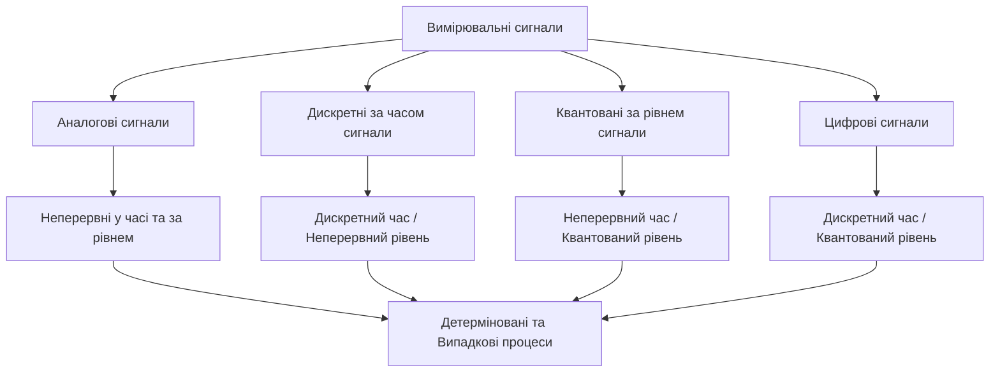
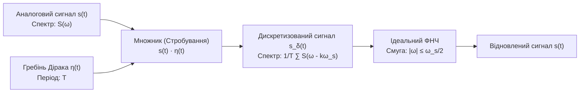
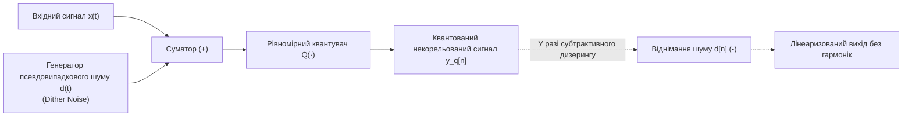

# ТЕМА 1. МАТЕМАТИЧНЕ ПРЕДСТАВЛЕННЯ, ДИСКРЕТИЗАЦІЯ ТА КВАНТУВАННЯ СИГНАЛІВ. ТЕОРЕМА КОТЕЛЬНИКОВА-ШЕННОНА-НАЙКВІСТА

---

## 1.1. Фізична та математична природа сигналів. Класифікація вимірювальних сигналів: аналогові, дискретні, квантовані, цифрові. Тестові сигнали

### Основний зміст та теоретичний базис

У теорії інформаційно-вимірювальних та комп'ютерних систем **сигнал** розглядається як матеріальний носій інформації, що являє собою фізичний процес, параметри якого змінюються відповідно до стану досліджуваного об'єкта, явища або середовища. З математичної точки зору сигнал моделюється як функція однієї чи кількох незалежних змінних, що відображає динаміку зміни його інформативних параметрів. Якщо незалежною змінною виступає часовий інтервал $t$, сигнал $s(t)$ описує часовий процес, як-от коливання акустичного тиску або зміну електричного потенціалу на виході датчика. У випадках, коли аргументами виступають просторові координати $(x, y)$ або $(x, y, z)$, функція $s(x, y)$ описує просторовий розподіл фізичної величини, характерний для оптичної яскравості, температурних або гравітаційних полів.

При математичному моделюванні вимірювальних процедур виділяють поняття фізичного параметра та інформативного параметра сигналу. Фізичний параметр є безпосередньо вимірюваною величиною (напруга, сила струму, інтенсивність світлового випромінювання, механічний тиск). Інформативним є той параметр, який функціонально пов'язаний із досліджуваною фізичною величиною або несе цільове повідомлення. Залежно від характеру поведінки як самого інформативного параметра, так і його просторово-часових аргументів, усі вимірювальні сигнали підлягають строгій фундаментальній класифікації.


*Рисунок 1.1 — Ієрархічна структура класифікації вимірювальних сигналів за ознаками неперервності та квантованості просторово-часових і амплітудних параметрів*

Зв'язок між різними класами сигналів визначається топологією простору їхнього визначення та областю можливих значень. **Аналоговий сигнал** $y_a(t)$ описується неперервною або кусково-неперервною функцією, визначеною на суцільному часовому континуумі, де як сама функція, так і її аргумент можуть набувати будь-яких незліченних значень у межах заданих інтервалів:

$$y_a(t) \in (y_{\min}, y_{\max}), \quad t \in (t_{\min}, t_{\max})$$

де $y_a(t)$ позначає миттєве значення аналогового сигналу у довільний момент часу $t$, виражене у відповідних фізичних одиницях (вольтах, амперах, паскалях); $y_{\min}$ та $y_{\max}$ задають динамічний діапазон фізичної величини; $t_{\min}$ та $t_{\max}$ визначають часовий інтервал існування сигналу. Усі фізичні процеси на макроскопічному рівні мають суто аналогову природу.

**Дискретний сигнал** $x[n]$ формується в результаті фіксації значень аналогового процесу в окремі ізольовані моменти часу $t_n = nT$, де $T = \text{const}$ виступає періодом дискретизації, а $n \in \mathbb{Z}$ є цілочисловим індексом відліку. Значення відліків такого сигналу залишаються неперервними величинами з незліченної множини амплітуд. 

**Квантований за рівнем сигнал** $y_q(t)$ характеризується тим, що його часовий аргумент є неперервним, проте амплітуда може набувати лише значень із дискретної множини дозволених рівнів квантування $h_i = i \cdot q$, де $q$ — крок квантування, а $i \in \mathbb{Z}$.

**Цифровий сигнал** є результатом одночасного застосування операцій дискретизації за часом та квантування за рівнем. Він являє собою послідовність квантованих решітчастих функцій $Y(nT)$, значення яких у дискретні моменти часу $nT$ належать скінченній множині рівнів $\{h_1, h_2, \dots, h_K\}$ і подаються у вигляді двійкових слів фіксованої розрядності.

За ознакою прогнозованості поведінки у часі сигнали поділяють на детерміновані та випадкові (стохастичні). **Детермінованим** називають сигнал, значення якого в будь-який момент часу або просторову координату можна абсолютно точно визначити за допомогою аналітичного виразу або обчислювального алгоритму:

$$s(t) = F(t, z, \omega; A, B, C)$$

де $s(t)$ — інформативний параметр; $t, z, \omega$ — незалежні змінні (час, просторова координата, частота); $A, B, C$ — фіксовані параметри моделі. 

**Випадковим процесом** $X(t)$ називають функцію, миттєве значення якої у довільний момент часу $t = t_0$ є випадковою величиною $X(t_0)$, що описується відповідними законами розподілу ймовірностей. Реальні вимірювальні сигнали завжди містять випадкові завади (шуми), обумовлені тепловими флуктуаціями, електромагнітними наведеннями або нестабільністю середовища передачі.

| Тип сигналу | Неперервність за часом / простором | Неперервність за амплітудою | Математична форма подання | Сфера практичного застосування |
| :--- | :--- | :--- | :--- | :--- |
| **Аналоговий** | Неперервний ($t \in \mathbb{R}$) | Неперервна ($y \in \mathbb{R}$) | $y_a(t) = f(t)$ | Первинні сенсори, радіохвилі, акустичні коливання |
| **Дискретний** | Дискретний ($n \in \mathbb{Z}$) | Неперервна ($y \in \mathbb{R}$) | $x[n] = y_a(nT)$ | Пристрої вибірки-зберігання (S/H), імпульсна модуляція |
| **Квантований** | Неперервний ($t \in \mathbb{R}$) | Дискретна ($y \in \{h_1, \dots, h_K\}$) | $y_q(t) = Q[y_a(t)]$ | Релейні системи, нелінійні компаратори |
| **Цифровий** | Дискретний ($n \in \mathbb{Z}$) | Дискретна ($y \in \{h_1, \dots, h_K\}$) | $Y[n] = Q[y_a(nT)]$ | ЦСП, мікроконтролери, пам'ять ЕОМ, цифрові інтерфейси |

Під час дослідження систем обробки сигналів фундаментальну роль відіграють елементарні тестові сигнали, серед яких виділяють одиничну функцію включення (функцію Хевісайда) та одиничний імпульс (дельта-функцію Дірака). **Функція Хевісайда** $\sigma(t - t_0)$ моделює стрибкоподібне підключення постійного впливу в момент часу $t = t_0$ і формалізується співвідношенням:

$$\sigma(t - t_0) = \begin{cases} 0, & t < t_0 \\ \frac{1}{2}, & t = t_0 \\ 1, & t > t_0 \end{cases}$$

де $t_0$ визначає часову точку фазового переходу функції від нульового до одиничного рівня. Функція Хевісайда дозволяє синтезувати довільний сигнал $s(t)$ у вигляді нескінченної суми елементарних сходинок. При спрямуванні інтервалу розбиття $\Delta t \to 0$, сума переходів трансформується в інтегральне динамічне представлення:

$$s(t) = s(0)\sigma(t) + \int_{0}^{\infty} \frac{ds(t')}{dt'} \sigma(t - t') \, dt'$$

де $s(0)$ — початковий стан сигналу у момент часу $t = 0$; $t'$ — змінна інтегрування вздовж осі часу; $\frac{ds(t')}{dt'}$ — швидкість зміни сигналу у момент часу $t'$.

**Дельта-функція Дірака** $\delta(t - t_0)$ являє собою узагальнену функцію (сингулярний розподіл), яка описує імпульсний процес нескінченно малої тривалості із нескінченно великою амплітудою, площа якого дорівнює одиниці:

$$\delta(t - t_0) = \begin{cases} 0, & t \neq t_0 \\ \infty, & t = t_0 \end{cases}, \quad \int_{-\infty}^{\infty} \delta(t - t_0) \, dt = 1$$

Фізично функція Дірака визначається як границя прямокутного імпульсу $\text{rect}(t / \tau)$ одиничної площі при прямуванні його тривалості $\tau$ до нуля:

$$\delta(t) = \lim_{\tau \to 0} \frac{1}{\tau} \text{rect}\left(\frac{t}{\tau}\right)$$

де $\tau$ — тривалість апроксимуючого прямокутного імпульсу; $\text{rect}(x)$ дорівнює 1 при $|x| \le 1/2$ та 0 при $|x| > 1/2$. Функція Хевісайда та дельта-функція пов'язані між собою операціями диференціювання та інтегрування:

$$\delta(t - t_0) = \frac{d\sigma(t - t_0)}{dt}, \quad \sigma(t - t_0) = \int_{-\infty}^{t} \delta(\tau - t_0) \, d\tau$$

Найважливішою для теорії систем є **фільтрувальна властивість дельта-функції**, яка дозволяє «вирізати» миттєве значення довільної неперервної функції $s(t)$ у точці локалізації імпульсу:

$$\int_{-\infty}^{\infty} s(t) \delta(t - t_0) \, dt = s(t_0)$$

У дискретному часі аналогом дельта-функції є одиничний дискретний імпульс Кронекера $\delta[n]$, який набуває одиничного значення при $n = 0$ і дорівнює нулю для всіх $n \neq 0$. Завдяки цьому будь-яка цифрова послідовність $x[n]$ може бути строго розкладена у базис зсунутих одиничних імпульсів:

$$x[n] = \sum_{k=-\infty}^{\infty} x[k]\delta[n - k]$$

де $x[k]$ — вагові коефіцієнти розкладу, що чисельно дорівнюють значенням відліків послідовності у відповідні моменти індексу $k$.

---

## 1.2. Процес дискретизації за часом. Теорема Котельникова-Шеннона-Найквіста. Частота Найквіста, гранична частота спектра

### Основний зміст та теоретичний базис

**Дискретизація неперервного сигналу** за часом полягає в перетворенні неперервної функції часу $s(t)$ у послідовність миттєвих значень $s[n] = s(nT)$, відібраних через фіксовані інтервали часу $T$, які називаються періодом дискретизації. Математичною моделлю ідеальної дискретизації є множення вхідного аналогового сигналу $s(t)$ на періодичну послідовність дельта-функцій Дірака, так звану дискретизувальну послідовність (решітку або гребінь Дірака) $\eta(t)$:

$$\eta(t) = \sum_{n=-\infty}^{\infty} \delta(t - nT)$$

Дискретизований сигнал $s_{\delta}(t)$ у часовій області набуває форми модульованої послідовності дельта-імпульсів:

$$s_{\delta}(t) = s(t) \cdot \eta(t) = s(t) \sum_{n=-\infty}^{\infty} \delta(t - nT) = \sum_{n=-\infty}^{\infty} s(nT) \delta(t - nT)$$

де $s_{\delta}(t)$ — дискретизований у часі неперервно-амплітудний сигнал; $s(nT)$ — амплітуда $n$-го відліку у момент часу $t = nT$; $T$ — період дискретизації (с).

Для аналізу спектрального складу дискретизованого сигналу застосуємо пряме перетворення Фур'є. Оскільки операції множення сигналів у часовій області відповідає згортка їхніх спектральних густин у частотній області, спектр дискретизованого сигналу $S_{\delta}(\omega)$ визначається через згортку спектра вихідного сигналу $S(\omega)$ та спектра решітки Дірака:

$$S_{\delta}(\omega) = \frac{1}{2\pi} \left[ S(\omega) * \mathcal{F}\{\eta(t)\} \right]$$

Спектр періодичної послідовності $\eta(t)$ є також періодичною дельта-функцією у частотній області:

$$\mathcal{F}\{\eta(t)\} = \omega_s \sum_{k=-\infty}^{\infty} \delta(\omega - k\omega_s) = \frac{2\pi}{T} \sum_{k=-\infty}^{\infty} \delta\left(\omega - \frac{2\pi k}{T}\right)$$

де $\omega_s = 2\pi / T = 2\pi f_s$ — кругова частота дискретизації ($\text{рад/с}$); $f_s = 1/T$ — циклічна частота дискретизації ($\text{Гц}$). Підставляючи спектр решітки Дірака у вираз для згортки, отримуємо фундаментальне співвідношення для спектра дискретизованого сигналу:

$$S_{\delta}(\omega) = \frac{1}{T} \sum_{k=-\infty}^{\infty} S(\omega - k\omega_s)$$

Спектр сигналу, дискретизованого з періодом $T$, являє собою нескінченну періодичну суму копій (реплік) спектра вихідного неперервного сигналу $S(\omega)$, масштабованих за амплітудою множником $1/T$ та зсунутих уздовж осі частот на величини, кратні частоті дискретизації $k\omega_s$.


*Рисунок 1.2 — Структурна схема математичної моделі дискретизації за часом та ідеального відновлення аналогового сигналу за допомогою інтерполяційного ФНЧ*

Можливість точного відновлення початкового аналогового сигналу $s(t)$ із дискретної послідовності його відліків $s(nT)$ без втрати інформації регламентується **теоремою Котельникова-Шеннона-Найквіста** (в англомовній літературі — *Nyquist-Shannon sampling theorem*):

> Якщо неперервний сигнал $s(t)$ має спектр $S(\omega)$, обмежений найвищою граничною частотою $\omega_{\text{гр}} = 2\pi f_{\text{гр}}$ (тобто $S(\omega) = 0$ для всіх $|\omega| > \omega_{\text{гр}}$), він повністю й однозначно визначається послідовністю своїх дискретних відліків $s(nT)$, узятих з інтервалом $T \le \frac{1}{2f_{\text{гр}}}$, або з частотою дискретизації $f_s \ge 2f_{\text{гр}}$.

Частота $f_N = f_s / 2$, що дорівнює половині частоти дискретизації, називається **частотою Найквіста** (або частотою згинання спектра). Для запобігання втрати інформації максимальна частота сигналу $f_{\text{гр}}$ не повинна перевищувати частоту Найквіста ($f_{\text{гр}} \le f_N$).

Математична процедура відновлення аналогового сигналу полягає у виділенні центральної (базової) смуги спектра $S(\omega)$ за допомогою ідеального фільтра низьких частот (ФНЧ) із прямокутною передавальною характеристикою:

$$H_{\text{rec}}(\omega) = \begin{cases} T, & |\omega| \le \frac{\omega_s}{2} \\ 0, & |\omega| > \frac{\omega_s}{2} \end{cases}$$

Імпульсна характеристика $h_{\text{rec}}(t)$ такого ідеального ФНЧ знаходиться через обернене перетворення Фур'є:

$$h_{\text{rec}}(t) = \frac{1}{2\pi} \int_{-\omega_s/2}^{\omega_s/2} T e^{j\omega t} \, d\omega = \frac{T}{2\pi} \left[ \frac{e^{j\frac{\omega_s}{2}t} - e^{-j\frac{\omega_s}{2}t}}{jt} \right] = \frac{\sin\left(\frac{\pi t}{T}\right)}{\frac{\pi t}{T}} = \text{sinc}\left(\frac{\pi t}{T}\right)$$

Згортка дискретизованого сигналу $s_{\delta}(t)$ з імпульсною характеристикою $h_{\text{rec}}(t)$ дає класичний **інтерполяційний ряд Котельникова-Шеннона (ряд Уіттекера-Шеннона)**:

$$s(t) = s_{\delta}(t) * h_{\text{rec}}(t) = \sum_{n=-\infty}^{\infty} s(nT) \frac{\sin\left(\frac{\pi}{T}(t - nT)\right)}{\frac{\pi}{T}(t - nT)} = \sum_{n=-\infty}^{\infty} s(nT) \text{sinc}\left(\frac{\pi}{T}(t - nT)\right)$$

де $\text{sinc}(x) = \frac{\sin x}{x}$; $s(nT)$ — дискретні відліки сигналу; $(t - nT)$ — аргумент часового зсуву кожної базисної функції. Базисні функції ряду $\text{sinc}\left(\frac{\pi}{T}(t - nT)\right)$ володіють властивістю ортонормованості та проходять через одиницю в моменти часу $t = nT$ і через нуль в усі інші моменти вибірки $t = kT$ ($k \neq n$), що забезпечує точний збіг інтерполяційного полінома зі значеннями вибірок у вузлах дискретизації.

У практичних вимірювальних системах точне виконання умов теореми Котельникова ускладнюється тим, що реальні сигнали є фінітними в часі (мають скінченну тривалість $T_{\text{сиг}}$). Згідно зі співвідношенням невизначеності часово-частотного аналізу, фінітний у часі сигнал володіє нескінченно протяжним спектром, який спадає за асимптотичним законом. Для визначення практичної граничної частоти $\omega_{\text{гр}}$ використовують енергетичний критерій на основі рівності Парсеваля:

$$\int_{-\infty}^{\infty} |s(t)|^2 \, dt = \frac{1}{2\pi} \int_{-\infty}^{\infty} |S(\omega)|^2 \, d\omega = E_s$$

де $E_s$ — повна енергія сигналу (Дж). Практичну граничну частоту $\omega_{\text{гр}}$ обирають із трансцендентного рівняння, яке фіксує частку збереженої енергії $\eta$ (зазвичай $\eta \in [0.95; 0.999]$):

$$\frac{1}{\pi} \int_{0}^{\omega_{\text{гр}}} |S(\omega)|^2 \, d\omega = \eta \cdot E_s$$

Енергія залишкової похибки відновлення $\Delta E$, спричинена відкиданням високочастотного «хвоста» спектра вище $\omega_{\text{гр}}$, дорівнює:

$$\Delta E = \frac{1}{\pi} \int_{\omega_{\text{гр}}}^{\infty} |S(\omega)|^2 \, d\omega = (1 - \eta) E_s$$

---

## 1.3. Ефект накладання спектрів (аліасинг / aliasing) та способи його запобігання (антиаліасингова фільтрація)

### Основний зміст та теоретичний базис

Якщо частота дискретизації виявляється недостатньою і порушується умова теореми Котельникова ($f_s < 2f_{\text{гр}}$ або $\omega_s < 2\omega_{\text{гр}}$), сусідні періодичні копії спектра $S(\omega - k\omega_s)$ у формулі дискретизованого сигналу перекриваються. У зонах перекриття спектральні складові адитивно додаються, безповоротно спотворюючи оригінальну спектральну густину $S(\omega)$. Цей процес взаємного накладання та незворотного спотворення спектра називається **еліасингом** (від англ. *aliasing* — маскування, виникнення псевдонімів або хибних частот).

```mermaid
flowchart TD
    subgraph S1 [Коректна дискретизація: f_s > 2 f_max]
        direction LR
        A1["Базовий спектр (-f_max..+f_max)"] --- B1["Захисний інтервал"] --- C1["Копія спектра (f_s - f_max..f_s + f_max)"]
    end
    subgraph S2 [Порушення умови: f_s < 2 f_max (Аліасинг)]
        direction LR
        A2["Базовий спектр"] ===|Зона інтерференції та накладання| C2["Зсунута репліка спектра"]
    end
```
*Рисунок 1.3 — Спектральні діаграми при коректній дискретизації із захисним інтервалом та при виникненні аліасингу внаслідок заниженої частоти вибірки*

Внаслідок аліасингу високочастотні гармонічні складові, що лежать за межами першої зони Найквіста ($f_0 > f_N$), після відновлення відображаються у низькочастотну область спектра під виглядом несправжніх низькочастотних коливань — «псевдонімів» (*aliases*). 

Для строгого математичного опису розглянемо неперервний гармонічний сигнал частотою $f_0$:

$$x(t) = \sin(2\pi f_0 t)$$

Дискретизація даного коливання з частотою $f_s = 1/T$ формує послідовність відліків:

$$x[n] = \sin(2\pi f_0 n T) = \sin\left(2\pi \frac{f_0}{f_s} n\right)$$

Оскільки тригонометричний синус є періодичним з періодом $2\pi m$, де $m \in \mathbb{Z}$, додавання до аргументу довільного цілого числа періодів не змінює значення функції:

$$x[n] = \sin\left(2\pi \frac{f_0}{f_s} n + 2\pi m\right) = \sin\left(2\pi \left(\frac{f_0}{f_s} + \frac{m}{n}\right) n\right)$$

Якщо обрати ціле число $m$, кратне індексу відліку $n$, тобто $m = k \cdot n$, де $k \in \mathbb{Z}$, отримуємо:

$$x[n] = \sin\left(2\pi \frac{f_0 + k f_s}{f_s} n\right) = \sin(2\pi(f_0 + k f_s) n T)$$

Отримана рівність доводить, що одна й та сама сукупність числових відліків $x[n]$ одночасно описує нескінченну множину неперервних синусоїд із частотами $f_k = |f_0 + k f_s|$, де $k = 0, \pm 1, \pm 2, \dots$. При застосуванні інтерполяційного ФНЧ відновлювач обере найнижчу доступну частоту з цього сімейства, яка потрапляє в основну смугу $[0; f_s/2]$. 

Уявна (видима) частота відновленого сигналу $f_{\text{app}}$ зв'язана з істинною частотою коливання $f_0$ аналітичним співвідношенням:

$$f_{\text{app}} = |f_0 - k \cdot f_s| \le \frac{f_s}{2}$$

де ціле число $k$ обирається таким чином, щоб $f_{\text{app}}$ належало діапазону $[0; f_N]$. Наприклад, якщо здійснюється оцифрування синусоїди із частотою $f_0 = 7\text{ кГц}$ частотою дискретизації $f_s = 6\text{ кГц}$, то частота Найквіста становить $f_N = 3\text{ кГц}$. Оскільки $f_0 > f_N$, при $k = 1$ формується хибна частота:

$$f_{\text{app}} = |7 - 1 \cdot 6| = 1\text{ кГц}$$

Відновлений після ЦАП сигнал замість вихідного ультразвукового тону 7 кГц звучатиме як чистий тон 1 кГц. У візуальних та оптико-електронних системах часовий аліасинг проявляється у формі стробоскопічного ефекту (ілюзія нерухомості або зворотного обертання коліс автомобіля чи лопатей гвинтокрила на відеокадрах), а просторовий аліасинг — у вигляді муарових візерунків на растрових зображеннях.


*Рисунок 1.4 — Схема апаратного тракту аналого-цифрового перетворення з обов'язковим попереднім антиаліасинговим фільтром низьких частот*

Єдиним надійним методом боротьби з аліасингом є попередня **антиаліасингова фільтрація** (*anti-aliasing filtering*). Вона передбачає обов'язкове встановлення аналогового фільтра низьких частот перед входом АЦП. Гранична частота зрізу фільтра $f_c$ встановлюється на рівні $f_c \le f_s/2$. 

Оскільки реальні аналогові фільтри (Баттерворта, Чебишева, Кауера) не мають нескінченної крутизни спаду амплітудно-частотної характеристики у перехідній смузі між смугою пропускання $f_p$ та смугою затримання $f_{\text{stop}}$, на практиці застосовують надлишкову дискретизацію (*oversampling*), обираючи частоту $f_s > 2 f_{\text{гр}}$:

$$f_s = f_p + f_{\text{stop}}$$

Це дозволяє спростити вимоги до крутизни аналогового фільтра попереду АЦП, забезпечуючи високу якість придушення дзеркальних високочастотних спектральних компонентів і завад на рівні щонайменше $-60 \dots -80\text{ дБ}$.

---

## 1.4. Процес квантування за рівнем. Крок квантування, похибка квантування, співвідношення сигнал/шум (SNR). Метод дизеризації (dithering)

### Основний зміст та теоретичний базис

**Квантуванням за рівнем** називають операцію перетворення неперервної за амплітудою величини відліку сигналу $x[n]$ у дискретну величину $x_q[n]$, що належить скінченній множині фіксованих рівнів квантування. Повний динамічний діапазон вхідної напруги АЦП $V_{\text{range}} = [V_{\min}; V_{\max}]$ розбивається за допомогою $(K+1)$ порогів квантування $\{d_0, d_1, \dots, d_K\}$ на $K$ суміжних квантових інтервалів. При потраплянні значення відліку в інтервал $x[n] \in (d_{i-1}, d_i]$ йому однозначно присвоюється фіксований квантований рівень $r_i \in \{h_1, h_2, \dots, h_K\}$.

У разі рівномірного квантування всі інтервали мають однакову довжину, що визначає **крок квантування** $\Delta$ (або квант за напругою, найменший значущий розряд — LSB, *Least Significant Bit*). Для $N$-розрядного лінійного АЦП крок квантування становить:

$$\Delta = \frac{V_{\max} - V_{\min}}{2^N - 1} \approx \frac{V_{\text{range}}}{2^N}$$

де $V_{\text{range}}$ — повний розмах шкали АЦП (В); $N$ — розрядність АЦП у бітах; $K = 2^N$ — загальна кількість квантованих рівнів.

Квантування є принципово нелінійною і незворотною операцією, яка супроводжується внесенням непереборної похибки. **Похибкою (шумом) квантування** $\varepsilon[n]$ називають різницю між істинним значенням вхідного відліку та його квантованим еквівалентом:

$$\varepsilon[n] = x[n] - x_q[n]$$

При операції симетричного округлення до найближчого рівня максимальне значення похибки не перевищує половини кроку квантування:

$$-\frac{\Delta}{2} \le \varepsilon[n] \le \frac{\Delta}{2}$$

Якщо розрядність АЦП достатньо висока ($N \ge 8$), а вхідний сигнал є складним, швидкозмінним і не синхронізованим із частотою вибірки, похибку квантування $\varepsilon$ можна розглядати як стаціонарний білий шум із рівномірною щільністю розподілу ймовірностей $p(\varepsilon)$ на інтервалі $[-\Delta/2; \Delta/2]$:

$$p(\varepsilon) = \begin{cases} \frac{1}{\Delta}, & |\varepsilon| \le \frac{\Delta}{2} \\ 0, & |\varepsilon| > \frac{\Delta}{2} \end{cases}$$

Математичне очікування (постійна складова) шуму квантування дорівнює нулю:

$$M[\varepsilon] = \int_{-\Delta/2}^{\Delta/2} \varepsilon \cdot p(\varepsilon) \, d\varepsilon = \frac{1}{\Delta} \int_{-\Delta/2}^{\Delta/2} \varepsilon \, d\varepsilon = 0$$

Потужність шуму квантування (дисперсія помилки $\sigma_q^2$) визначається як другий центральний момент:

$$\sigma_q^2 = M[\varepsilon^2] = \int_{-\Delta/2}^{\Delta/2} \varepsilon^2 \cdot \frac{1}{\Delta} \, d\varepsilon = \frac{1}{\Delta} \left[ \frac{\varepsilon^3}{3} \right]_{-\Delta/2}^{\Delta/2} = \frac{1}{\Delta} \left( \frac{\Delta^3}{24} - \left(-\frac{\Delta^3}{24}\right) \right) = \frac{\Delta^2}{12}$$

де $\sigma_q^2$ виражає середню дисперсію потужності шуму квантування, а середньоквадратичне відхилення (СКВ) шуму дорівнює $\sigma_q = \frac{\Delta}{\sqrt{12}} = \frac{\Delta}{2\sqrt{3}}$.

Для оцінки якості оцифрованого сигналу використовують логарифмічне **співвідношення сигнал/шум** ($\text{SNR}$, *Signal-to-Noise Ratio*), що вимірюється в децибелах (дБ):

$$\text{SNR}_{\text{dB}} = 10 \log_{10}\left(\frac{P_s}{\sigma_q^2}\right)$$

де $P_s$ — середня потужність корисного сигналу. 

Розглянемо випадок подачі на вхід $N$-розрядного АЦП повномасштабного синусоїдального сигналу $x(t) = A \sin(\omega t)$, амплітуда якого повністю займає діапазон квантувача $A = \frac{V_{\text{range}}}{2} = \frac{2^N \Delta}{2} = 2^{N-1}\Delta$. Середня потужність такого гармонічного сигналу становить:

$$P_s = \frac{A^2}{2} = \frac{(2^{N-1}\Delta)^2}{2} = \frac{2^{2N-2} \Delta^2}{2} = \frac{2^{2N} \Delta^2}{8}$$

Підставляючи вирази для потужності сигналу $P_s$ та потужності шуму квантування $\sigma_q^2$ у формулу $\text{SNR}$, отримуємо класичну формулу Беннета для ідеального квантувача:

$$\text{SNR}_{\text{dB}} = 10 \log_{10}\left( \frac{\frac{2^{2N} \Delta^2}{8}}{\frac{\Delta^2}{12}} \right) = 10 \log_{10}\left( \frac{12}{8} \cdot 2^{2N} \right) = 10 \log_{10}(1.5) + 2N \cdot 10 \log_{10}(2)$$

Враховуючи, що $10 \log_{10}(1.5) \approx 1.7609\text{ дБ}$, а $20 \log_{10}(2) \approx 6.0206\text{ дБ}$, остаточно маємо:

$$\text{SNR}_{\text{dB}} \approx 6.02 \cdot N + 1.76\text{ [дБ]}$$

де $N$ — розрядність квантувача (біт). Кожен додатковий розряд АЦП збільшує динамічний діапазон та покращує співвідношення сигнал/шум приблизно на $6\text{ дБ}$.

| Розрядність ($N$, біт) | Кількість рівнів ($2^N$) | Крок $\Delta$ для $V_{\text{range}} = 5\text{ В}$ | Теоретичний $\text{SNR}$ (дБ) | Типові галузі застосування |
| :---: | :---: | :---: | :---: | :--- |
| **4** | 16 | $312.5\text{ мВ}$ | 25.84 | Базові телеметричні тригери, груба індикація |
| **8** | 256 | $19.53\text{ мВ}$ | 49.92 | Відеоканали стандартної чіткості, обробка напівтонових зображень |
| **10** | 1024 | $4.88\text{ мВ}$ | 61.96 | Вбудовані АЦП мікроконтролерів (AVR, PIC), прості давачі |
| **12** | 4096 | $1.22\text{ мВ}$ | 74.00 | Промислова телеметрія, сенсорні вузли STM32 |
| **16** | 65 536 | $76.29\text{ мкВ}$ | 98.08 | Високоякісне цифрове аудіо (Audio CD 44.1 кГц / 16 біт) |
| **24** | 16 777 216 | $0.298\text{ мкВ}$ | 146.24 | Прецизійна сейсмометрія, геофізика, професійний звук Hi-Res |

Якщо квантуванню піддається сигнал малої амплітуди або плавно змінний процес, похибка квантування $\varepsilon[n]$ перестає бути білим шумом. Вона стає жорстко корельованою із самим сигналом, набуваючи вигляду гармонійних спотворень (сходинкових спотворень форми або періодичних циклів). В аудіосистемах це сприймається як неприємний «брудний» гармонійний хвіст, а на зображеннях низької розрядності призводить до появи **хибних ізоліній і штучних контурів** (*false contouring / posterization*).


*Рисунок 1.5 — Функціональна схема застосування процедури неадитивної та субтрактивної дизеризації перед блоком квантування*

Для усунення кореляції між помилкою квантування та вхідним сигналом застосовують метод **дизеризації (дизерингу)** (*dithering*). Метод полягає у навмисному підмішуванні до аналогового сигналу перед квантуванням слабкого некорельованого псевдовипадкового шуму (дизер-сигналу) $d(t)$ амплітудою порядку половини кроку квантування $\Delta / 2$. Застосування дизерингу незначно збільшує сумарну дисперсію шуму на виході, але повністю руйнує гармонійний зв'язок похибки із сигналом. В результаті спотворення амплітуди маскуються під нешкідливий рівномірний білий шум, що радикально підвищує лінійність системи та усуває хибні контури на зображеннях. 

Розрізняють невіднімальний дизеринг (*non-subtractive dither*), коли доданий шум залишається в оцифрованому сигналі, та субтрактивний дизеринг (*subtractive dither*), за якого точна цифрова копія згенерованої випадкової послідовності віднімається від сигналу після АЦП, забезпечуючи ідеальну лінеаризацію квантувача зі збереженням вихідного рівня дисперсії.

---

### Питання для самоперевірки та аналітичного осмислення

1. У чому полягає фундаментальна математична та фізична відмінність між дискретним і квантованим сигналами, та за яких умов дискретний сигнал можна апроксимувати числовим цифровим еквівалентом без суттєвої втрати точності?
2. Яким чином інтерполяційний ряд Котельникова-Шеннона забезпечує точне відновлення неперервної функції між вузлами дискретизації, і чому базисні функції $\text{sinc}(x)$ забезпечують нульовий взаємний вплив відліків у дискретні моменти часу?
3. Поясніть спектральний механізм виникнення ефекту аліасингу у частотній області при $f_s < 2f_{\text{гр}}$. Яка математична залежність пов'язує реальну частоту вхідної гармоніки $f_0$ та її хибну частоту $f_{\text{app}}$, що реєструється у першій зоні Найквіста?
4. Чому на практиці частоту дискретизації для звукових сигналів обирають вищою за подвоєну максимальну частоту слухового діапазону людини ($44.1\text{ кГц}$ та $48\text{ кГц}$ проти $2 \times 20\text{ кГц} = 40\text{ кГц}$), і як це пов'язано з передавальними функціями аналогових антиаліасингових фільтрів?
5. Наведіть аналітичне виведення формули співвідношення сигнал/шум $\text{SNR} = 6.02N + 1.76\text{ дБ}$ для $N$-розрядного квантувача та поясніть фізичний зміст припущення про рівномірний розподіл похибки на інтервалі $[-\Delta/2; +\Delta/2]$.
6. Опишіть фізичний механізм дії дизеризації (dithering) при квантуванні слабозмінних сигналів та зображень. Чому перетворення корельованої похибки квантування у некорельований білий шум є суб'єктивно та об'єктивно вигідним для інформаційно-вимірювальних систем?