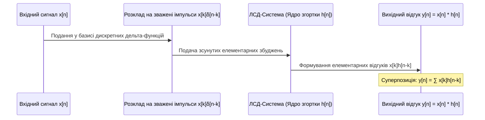
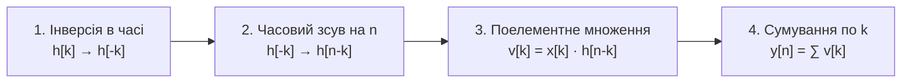
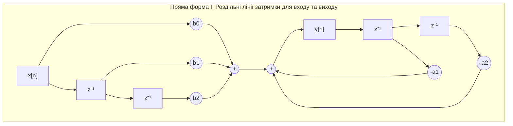
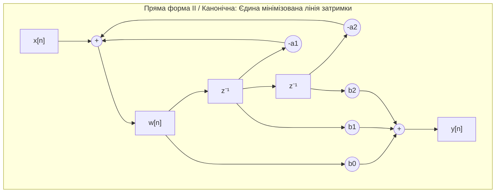

# ТЕМА 2. ЛІНІЙНІ СТАЦІОНАРНІ ДИСКРЕТНІ (ЛСД) СИСТЕМИ. ІМПУЛЬСНА ХАРАКТЕРИСТИКА ТА ДИСКРЕТНА ЗГОРТКА

---

## 2.1. Поняття дискретної системи, властивості: лінійність (адитивність, однорідність), стаціонарність (інваріантність до зсуву), каузальність, стійкість (BIBO)

### Основний зміст та теоретичний базис

У цифровій обробці сигналів під **дискретною системою** розуміють математичний оператор, алгоритм або апаратний пристрій, який перетворює вхідну числову послідовність $x[n]$ (збудження, вхідний сигнал) у вихідну числову послідовність $y[n]$ (відгук, реакцію системи). Формально цей процес записується за допомогою операторного перетворення:

$$y[n] = \mathcal{T}\{x[n]\}$$

де $x[n]$ виступає вхідною дискретною послідовністю, визначеною на множині цілих чисел $n \in \mathbb{Z}$; $y[n]$ є результуючим вихідним сигналом; $\mathcal{T}\{\cdot\}$ позначає оператор перетворення, який встановлює правило формування відліків вихідного сигналу на основі вхідних даних.

Поведінка, обчислювальна складність та методи проектування дискретних систем визначаються сукупністю фундаментальних властивостей. Найважливішою класифікаційною ознакою є **лінійність**, яка базується на виконанні принципу суперпозиції. Система називається лінійною тоді й лише тоді, коли вона одночасно задовольняє двом умовам — адитивності та однорідності (масштабованості):

$$\mathcal{T}\{a \cdot x_1[n] + b \cdot x_2[n]\} = a \cdot \mathcal{T}\{x_1[n]\} + b \cdot \mathcal{T}\{x_2[n]\} = a \cdot y_1[n] + b \cdot y_2[n]$$

де $x_1[n]$ та $x_2[n]$ — довільні вхідні числові послідовності; $y_1[n] = \mathcal{T}\{x_1[n]\}$ та $y_2[n] = \mathcal{T}\{x_2[n]\}$ — відповідні їм відгуки системи; $a$ та $b$ — довільні скалярні коефіцієнти (дійсні або комплексні константи). Властивість адитивності гарантує, що реакція системи на суму сигналів дорівнює сумі реакцій на кожен сигнал окремо, а властивість однорідності забезпечує пропорційну зміну вихідного відгуку при масштабуванні вхідного впливу. Якщо для системи принцип суперпозиції порушується хоча б для однієї комбінації сигналів чи констант (наприклад, для системи квадратування $y[n] = x^2[n]$ або логарифмування $y[n] = \log_{10}|x[n]|$), така система класифікується як **нелінійна**.

```mermaid
flowchart TD
    A[Дискретна система y_n = T{x_n}] --> B{Перевірка лінійності}
    B -->|T{a·x1 + b·x2} = a·y1 + b·y2| C[Лінійна система]
    B -->|Принцип суперпозиції порушено| D[Нелінійна система]
    
    C --> E{Перевірка стаціонарності}
    E -->|T{x_n-k} = y_n-k| F[ЛСД / LTI система]
    E -->|Параметри залежать від n| G[Лінійна нестаціонарна]
    
    F --> H{Аналіз каузальності та стійкості}
    H -->|h_n = 0 при n < 0| I[Каузальна фізично реалізовна]
    H -->|Сума |h_n| < ∞| J[BIBO-стійка система]
```
*Рисунок 2.1 — Діаграма верифікації базових властивостей дискретних систем та виділення класу лінійних стаціонарних дискретних (ЛСД) систем*

Властивість **стаціонарності** (інваріантності до зсуву в часі, *time-invariance*) визначає сталість внутрішніх параметрів системи протягом усього періоду її функціонування. Система вважається стаціонарною, якщо довільна часова затримка або випередження вхідного сигналу на $n_0$ тактів викликає абсолютно таку саму часову затримку або випередження вихідного сигналу без зміни його форми:

$$\mathcal{T}\{x[n - n_0]\} = y[n - n_0], \quad \forall n_0 \in \mathbb{Z}$$

Якщо реакція системи на зсунутий сигнал залежить від абсолютного моменту подачі сигналу (наприклад, у системах децимації $y[n] = x[M \cdot n]$ або модуляторах із часово-залежними коефіцієнтами $y[n] = n \cdot x[n]$), система є **нестаціонарною** (параметричною). Системи, які одночасно є лінійними та стаціонарними, утворюють фундаментальний клас **лінійних стаціонарних дискретних (ЛСД) систем** (в англомовній літературі — *Linear Time-Invariant, LTI systems*).

Властивість **каузальності** (причинності або динамічного детермінізму) відображає фізичну реалізовність системи у реальному часі. Дискретна система називається каузальною, якщо значення вихідного сигналу $y[n]$ у довільний момент часу $n$ залежить виключно від поточного $x[n]$ та попередніх значень вхідного сигналу $x[n-1], x[n-2], \dots$, і абсолютно не залежить від майбутніх значень $x[n+1], x[n+2], \dots$. Для каузальних систем відгук не може виникнути раніше, ніж з'явиться вхідне збудження. Системи просторової обробки зображень або офлайн-фільтрації попередньо записаних файлів можуть бути некаузальними, оскільки в них доступний увесь масив даних за просторовими координатами чи часом.

Властивість **стійкості за критерієм обмеженого входу — обмеженого виходу** (*Bounded-Input Bounded-Output Stability, BIBO*) означає, що за умови подачі на вхід довільної послідовності з обмеженою амплітудою, вихідний сигнал системи гарантовано залишатиметься обмеженим за абсолютною величиною:

$$\forall |x[n]| \le B_x < \infty \implies |y[n]| \le B_y < \infty, \quad \forall n \in \mathbb{Z}$$

де $B_x$ та $B_y$ — скінченні додатні константи. Для ЛСД-систем необхідною і достатньою умовою BIBO-стійкості є абсолютна збіжність (абсолютна сумовність) її імпульсної характеристики:

$$\sum_{n=-\infty}^{\infty} |h[n]| < \infty$$

| Властивість системи | Математичний критерій | Фізичний та інженерний зміст |
| :--- | :--- | :--- |
| **Лінійність** | $\mathcal{T}\{a x_1[n] + b x_2[n]\} = a y_1[n] + b y_2[n]$ | Відсутність взаємної модуляції частот, збереження спектральної форми гармонік. |
| **Стаціонарність** | $\mathcal{T}\{x[n - n_0]\} = y[n - n_0]$ | Незалежність алгоритму обробки від моменту початку спостереження сигналу. |
| **Каузальність** | $y[n] = f(x[n], x[n-1], \dots, y[n-1], \dots)$ | Здатність системи функціонувати в реальному масштабі фізичного часу. |
| **BIBO-стійкість** | $\sum_{n=-\infty}^{\infty} \|h[n]\| \le M_h < \infty$ | Запобігання необмеженому зростанню сигналів та самозбудженню фільтрів. |
| **Пам'ять системи** | $y[n]$ залежить від $x[n-k]$ при $k \neq 0$ | Необхідність наявності регістрів затримки для збереження попередніх відліків. |

---

## 2.2. Імпульсна характеристика $h[n]$ як повний опис ЛСД-системи. Відгук системи у вигляді дискретної лінійної згортки

### Основний зміст та теоретичний базис

Фундаментальною властивістю лінійних стаціонарних дискретних систем є те, що їхня динамічна поведінка повністю й однозначно описується єдиною функцією часу — **імпульсною характеристикою** $h[n]$. Імпульсною характеристикою називається відгук ЛСД-системи на вхідний сигнал у вигляді одиничного дискретного імпульсу Кронекера $\delta[n]$ за нульових початкових умов:

$$h[n] = \mathcal{T}\{\delta[n]\}$$

де $\delta[n]$ — одиничний імпульс, що дорівнює 1 при $n = 0$ та 0 при $n \neq 0$; $h[n]$ — числова послідовність відгуку.

Для строгого аналітичного виведення виразу реакції ЛСД-системи на довільний вхідний сигнал $x[n]$ скористаємося властивістю розкладання сигналу на суму зважених одиничних імпульсів:

$$x[n] = \sum_{k=-\infty}^{\infty} x[k] \delta[n - k]$$

Підставляючи дане представлення вхідного сигналу в операторне рівняння системи, отримуємо вираз для вихідного відгуку:

$$y[n] = \mathcal{T}\{x[n]\} = \mathcal{T}\left\{ \sum_{k=-\infty}^{\infty} x[k] \delta[n - k] \right\}$$

Враховуючи лінійність системи (принцип суперпозиції), оператор перетворення $\mathcal{T}\{\cdot\}$ можна внести під знак нескінченної суми, а скалярні величини відліків $x[k]$, які відносно змінної $n$ є константами, винести за знак оператора:

$$y[n] = \sum_{k=-\infty}^{\infty} x[k] \mathcal{T}\{\delta[n - k]\}$$

Завдяки стаціонарності системи, відгук на зсунутий одиничний імпульс $\delta[n - k]$ є зсунутою на $k$ тактів імпульсною характеристикою системи: $\mathcal{T}\{\delta[n - k]\} = h[n - k]$. Підстановка цього співвідношення приводить до фундаментальної формули **дискретної лінійної згортки** (convolution sum):

$$y[n] = \sum_{k=-\infty}^{\infty} x[k] h[n - k] = x[n] * h[n]$$

де символ $*$ позначає операцію дискретної згортки; $x[k]$ — значення відліків вхідного сигналу; $h[n - k]$ — зсунута та інвертована в часі імпульсна характеристика системи.


*Рисунок 2.2 — Концептуальна схема формування вихідного сигналу ЛСД-системи на основі принципу суперпозиції зважених зсунутих імпульсних відгуків*

Фізичний зміст формули дискретної згортки полягає в тому, що значення вихідного сигналу $y[n]$ у момент часу $n$ формується як зважена сума всіх поточних і минулих значень вхідного сигналу, де роль вагових коефіцієнтів відіграють відповідні відліки імпульсної характеристики $h[n]$. Якщо система є каузальною, її імпульсна характеристика задовольняє умові $h[n] = 0$ при $n < 0$, завдяки чому верхня межа підсумовування обмежується поточним моментом часу $n$:

$$y[n] = \sum_{k=-\infty}^{n} x[k] h[n - k]$$

Якщо, крім того, вхідний сигнал подається починаючи з моменту часу $n = 0$ (тобто $x[n] = 0$ для всіх $n < 0$), формула згортки набуває скінченних меж:

$$y[n] = \sum_{k=0}^{n} x[k] h[n - k] = \sum_{k=0}^{n} h[k] x[n - k]$$

Знання імпульсної характеристики $h[n]$ надає вичерпну інформацію про динамічні та частотні властивості ЛСД-системи, дозволяючи аналітично чи алгоритмічно визначити її реакцію на довільний вхідний процес.

---

## 2.3. Властивості та алгоритмічна процедура обчислення дискретної згортки (інверсія в часі, зсув, множення, сумування). Кругова згортка

### Основний зміст та теоретичний базис

Операція лінійної дискретної згортки має фундаментальні алгебраїчні властивості, що забезпечують еквівалентність різних структурних реалізацій цифрових систем:

1. **Комутативність (переставна властивість):**
   $$x[n] * h[n] = h[n] * x[n] \iff \sum_{k=-\infty}^{\infty} x[k] h[n - k] = \sum_{k=-\infty}^{\infty} h[k] x[n - k]$$
   Результат фільтрації залишається незмінним незалежно від того, яка з послідовностей розглядається як вхідний сигнал, а яка — як імпульсна характеристика.

2. **Асоціативність (сполучна властивість):**
   $$(x[n] * h_1[n]) * h_2[n] = x[n] * (h_1[n] * h_2[n])$$
   Послідовне (каскадне) з'єднання двох систем з імпульсними характеристиками $h_1[n]$ та $h_2[n]$ еквівалентне одній системі з еквівалентною характеристикою $h_{\text{екв}}[n] = h_1[n] * h_2[n]$.

3. **Дистрибутивність (розподільна властивість):**
   $$x[n] * (h_1[n] + h_2[n]) = x[n] * h_1[n] + x[n] * h_2[n]$$
   Паралельне з'єднання систем еквівалентне системі, імпульсна характеристика якої дорівнює сумі характеристик паралельних гілок.

Обчислення згортки для кожного фіксованого значення вихідного індексу $n$ реалізується за суворим чотириетапним алгоритмом:


*Рисунок 2.3 — Алгоритмічний конвеєр розрахунку одного відліку лінійної дискретної згортки*

Якщо вхідний сигнал $x[n]$ містить $N_x$ відліків ($n = 0, 1, \dots, N_x - 1$), а імпульсна характеристика $h[n]$ містить $N_h$ відліків ($n = 0, 1, \dots, N_h - 1$), тривалість вихідної послідовності $y[n]$ строго дорівнює:

$$N_y = N_x + N_h - 1$$

Розглянемо практичний приклад аналітичного, табличного та графічного розрахунку згортки скінченних послідовностей:
Нехай вхідний сигнал задано у вигляді послідовності $x[n] = \{1, 3, 2\}$ ($N_x = 3$), а імпульсна характеристика становить $h[n] = \{1, 2, 3, 4\}$ ($N_h = 4$). Довжина вихідної послідовності дорівнює $N_y = 3 + 4 - 1 = 6$ відліків ($n = 0, 1, 2, 3, 4, 5$).

Покроковий аналітичний розрахунок:
*   Для $n = 0$: $y[0] = x[0]h[0] = 1 \cdot 1 = 1$;
*   Для $n = 1$: $y[1] = x[0]h[1] + x[1]h[0] = 1 \cdot 2 + 3 \cdot 1 = 5$;
*   Для $n = 2$: $y[2] = x[0]h[2] + x[1]h[1] + x[2]h[0] = 1 \cdot 3 + 3 \cdot 2 + 2 \cdot 1 = 11$;
*   Для $n = 3$: $y[3] = x[0]h[3] + x[1]h[2] + x[2]h[1] = 1 \cdot 4 + 3 \cdot 3 + 2 \cdot 2 = 17$;
*   Для $n = 4$: $y[4] = x[1]h[3] + x[2]h[2] = 3 \cdot 4 + 2 \cdot 3 = 18$;
*   Для $n = 5$: $y[5] = x[2]h[3] = 2 \cdot 4 = 8$.

Результуюча послідовність: $y[n] = \{1, 5, 11, 17, 18, 8\}$.

Табличний метод обчислення базується на формуванні матриці часткових добутків, у якій стовпці відповідають зсунутим компонентам, а підсумовування проводиться вздовж діагоналей:

| $x[k] \backslash h[m]$ | $h[0] = 1$ | $h[1] = 2$ | $h[2] = 3$ | $h[3] = 4$ | Діагональна сума для $y[n]$ |
| :---: | :---: | :---: | :---: | :---: | :---: |
| **$x[0] = 1$** | **1** ($n=0$) | **2** ($n=1$) | **3** ($n=2$) | **4** ($n=3$) | $y[0] = 1$ |
| **$x[1] = 3$** | **3** ($n=1$) | **6** ($n=2$) | **9** ($n=3$) | **12** ($n=4$) | $y[1] = 2 + 3 = 5$ |
| **$x[2] = 2$** | **2** ($n=2$) | **4** ($n=3$) | **6** ($n=4$) | **8** ($n=5$) | $y[2] = 3 + 6 + 2 = 11$ <br> $y[3] = 4 + 9 + 4 = 17$ <br> $y[4] = 12 + 6 = 18$ <br> $y[5] = 8$ |

Табличний розрахунок наочно демонструє алгебраїчний механізм множення поліномів: перемножування полінома $X(z) = 1 + 3z^{-1} + 2z^{-2}$ на поліном $H(z) = 1 + 2z^{-1} + 3z^{-2} + 4z^{-3}$ дає результуючий поліном $Y(z) = 1 + 5z^{-1} + 11z^{-2} + 17z^{-3} + 18z^{-4} + 8z^{-5}$, коефіцієнти якого точно збігаються з відліками вихідної послідовності $y[n]$.

**Круговою (циклічною) згорткою** двох $N$-точкових періодичних послідовностей $x[n]$ та $h[n]$ називають операцію, підсумовування в якій виконується в межах одного періоду $N$ із використанням операції взяття індексу за модулем $N$:

$$y_c[n] = x[n] \circledast h[n] = \sum_{m=0}^{N-1} x[m] h[(n - m) \bmod N]$$

де $(n - m) \bmod N$ позначає залишок від ділення різниці $(n - m)$ на довжину блоку $N$. Відмінність кругової згортки від лінійної полягає в тому, що зсув послідовності є циклічним: відліки, які виходять за праву межу інтервалу $[0; N-1]$, циклічно з'являються зліва. 

Згідно з теоремою про дискретну згортку, кругова згортка в часовій області строго відповідає поелементному множенню дискретних перетворень Фур'є послідовностей: $\text{DFT}\{x[n] \circledast h[n]\} = X[k] \cdot H[k]$. Для того щоб за допомогою швидкого перетворення Фур'є (ШПФ) та кругової згортки обчислити лінійну аперіодичну згортку без виникнення циклічного накладання крайових відліків, обидві вихідні послідовності необхідно штучно доповнити нулями (*zero-padding*) до загальної довжини не менше $N \ge N_x + N_h - 1$.

---

## 2.4. Способи опису дискретних систем: різницеві рівняння та структури блок-схем (суматори, підсилювачі, елементи одиничної затримки $z^{-1}$)

### Основний зміст та теоретичний базис

Крім імпульсної характеристики, універсальним математичним апаратом опису ЛСД-систем виступають **лінійні різницеві рівняння зі сталими коефіцієнтами** (*Linear Constant-Coefficient Difference Equations, LCCDE*). Різницеве рівняння пов'язує поточний вихідний відлік системи $y[n]$ із поточним і попередніми вхідними відліками $x[n-m]$, а також із попередніми значеннями вихідного сигналу $y[n-k]$:

$$\sum_{k=0}^{N} a_k y[n - k] = \sum_{m=0}^{M} b_m x[n - m]$$

де $a_k$ та $b_m$ — постійні дійсні коефіцієнти системи; $M$ визначає глибину затримки вхідного сигналу; $N$ визначає порядок системи (максимальну затримку вихідного сигналу).

Прийнявши умову нормування $a_0 = 1$, різницеве рівняння записують у формі явного обчислювального алгоритму:

$$y[n] = \sum_{m=0}^{M} b_m x[n - m] - \sum_{k=1}^{N} a_k y[n - k]$$

Залежно від наявності зворотного зв'язку (членів $y[n-k]$ при $k \ge 1$) цифрові системи поділяють на два фундаментальні класи:

1. **Нерекурсивні системи (КІХ-системи, *Finite Impulse Response, FIR*):** Усі коефіцієнти зворотного зв'язку дорівнюють нулю ($a_k = 0$ для всіх $k \ge 1$). Рівняння спрощується до вигляду $y[n] = \sum_{m=0}^{M} b_m x[n - m]$. Імпульсна характеристика такої системи є скінченною за тривалістю і її відліки безпосередньо збігаються з ваговими коефіцієнтами: $h[n] = b_n$ для $0 \le n \le M$ та $h[n] = 0$ для $n > M$. КІХ-фільтри є безумовно стійкими.

2. **Рекурсивні системи (НІХ-системи, *Infinite Impulse Response, IIR*):** Принаймні один коефіцієнт $a_k \neq 0$ ($k \ge 1$). Наявність зворотного зв'язку призводить до нескінченної тривалості імпульсної характеристики $h[n]$, яка складається із суми згасаючих або наростаючих експонент та синусоїд. НІХ-системи вимагають строгого контролю полюсів передавальної функції для забезпечення стійкості.

Для структурного та апаратного моделювання дискретних алгоритмів використовують три базові елементарні функціональні блоки:
*   **Суматор:** виконує операцію додавання двох або більше числових послідовностей $y[n] = x_1[n] + x_2[n]$;
*   **Підсилювач (масштабатор):** здійснює множення вхідного відліку на постійний коефіцієнт $y[n] = c \cdot x[n]$;
*   **Елемент одиничної затримки ($z^{-1}$ або Delay):** запам'ятовує вхідний відлік на один такт дискретизації, формуючи вихідний сигнал $y[n] = x[n - 1]$.

Існують дві класичні канонічні форми побудови блок-схем ЛСД-систем: **пряма форма I (Direct Form I)** та **пряма форма II (Direct Form II, канонічна)**.


*Рисунок 2.4 — Структурна схема прямої форми I реалізації дискретної системи другого порядку ($N=2, M=2$)*


*Рисунок 2.5 — Структурна схема прямої канонічної форми II реалізації дискретної системи другого порядку ($N=2, M=2$)*

Пряма форма I безпосередньо реалізує різницеве рівняння, використовуючи дві незалежні лінії затримки: одну для вхідного сигналу (довжиною $M$ комірок), іншу — для вихідного сигналу (довжиною $N$ комірок), що сумарно вимагає $M + N$ елементів пам'яті. 

Канонічна пряма форма II утворюється шляхом перестановки місцями нерекурсивної та рекурсивної частин системи, що є математично коректним завдяки лінійності операцій. У результаті проміжний сигнал $w[n]$ надходить на спільну лінію затримки, яка одночасно обслуговує рекурсивну та нерекурсивну гілки:

$$w[n] = x[n] - \sum_{k=1}^{N} a_k w[n - k], \quad y[n] = \sum_{m=0}^{M} b_m w[n - m]$$

Канонічна форма вимагає мінімально можливої кількості комірок пам'яті $\max(N, M)$, що робить її високоефективною для апаратної реалізації в цифрових сигнальних процесорах (DSP) та ПЛІС (FPGA).

---

### Питання для самоперевірки та аналітичного осмислення

1. Сформулюйте математичний критерій лінійності дискретної системи. Чому наявність постійного зміщення (bias) виду $y[n] = 2x[n] + 3$ перетворює систему на нелінійну, незважаючи на графічну лінійність функції?
2. Наведіть математичне доведення того, що відгук довільної лінійної стаціонарної системи на довільне збудження $x[n]$ строго описується операцією дискретної згортки сигналу з імпульсною характеристикою системи.
3. Поясніть фізичний та алгоритмічний зміст чотирьох етапів процедури обчислення дискретної згортки ($h[k] \to h[-k] \to h[n-k] \to \text{множення} \to \text{підсумовування}$). Чому вихідна послідовність згортки послідовностей довжиною $N_x$ та $N_h$ має розмірність $N_x + N_h - 1$?
4. У чому полягає відмінність між лінійною та круговою (циклічною) згорткою? За якої умови результат кругової згортки скінченних послідовностей повністю збігається з результатом їхньої лінійної аперіодичної згортки?
5. Доведіть, чому нерекурсивна дискретна система (КІХ-фільтр) є безумовно стійкою за критерієм BIBO, тоді як рекурсивна система (НІХ-фільтр) може втратити стійкість.
6. Порівняйте пряму форму I та канонічну пряму форму II реалізації цифрового фільтра. Які переваги та потенційні ризики (зокрема, щодо динамічного діапазону проміжних змінних $w[n]$) має канонічна форма при реалізації на процесорах із фіксованою комою?