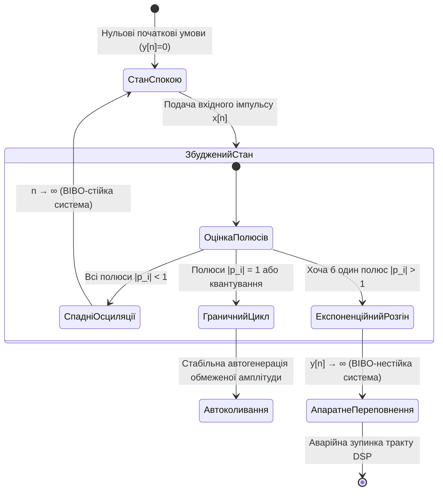
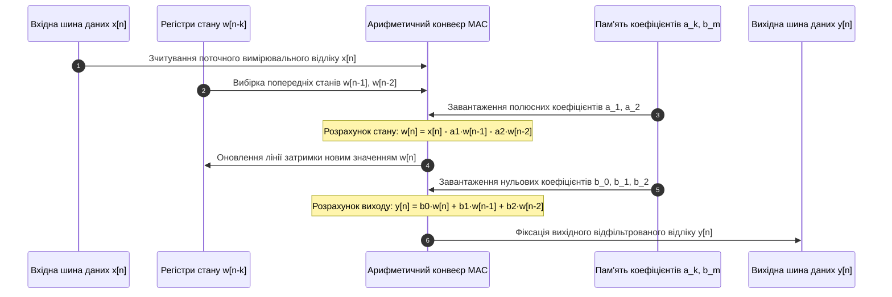

# Тема 2. Лінійні стаціонарні дискретні системи, імпульсна характеристика та математичний апарат дискретної згортки

## Мета лекції
Метою лекції є формування у майбутніх магістрів інженерних та комп'ютерних спеціальностей поглиблених теоретичних знань і прикладних компетентностей щодо математичного опису, структурного моделювання та часового аналізу лінійних стаціонарних дискретних (ЛСД) систем у комп'ютерно-інтегрованих вимірювальних комплексах. У процесі заняття передбачено детальне вивчення аксіоматичних критеріїв класифікації систем (лінійності, часової інваріантності, каузальності та BIBO-стійкості), строге аналітичне виведення дискретної лінійної згортки на основі імпульсного відгуку, а також опанування методів топологічного синтезу цифрових фільтрів у прямій формі I та канонічній формі II. Окрему увагу зосереджено на аналізі апаратних обмежень обчислювальних процесорів (DSP та FPGA), мінімізації обсягу регістрової пам'яті ліній затримки, запобіганні числовому переповненню та усуненні артефактів часового аліасингу під час обробки вимірювальних сигналів і зображень.

## Очікувані результати навчання

1. **Знання та розуміння.** Здобувачі вищої освіти повинні демонструвати ґрунтовне засвоєння аксіоматичного базису теорії дискретних систем, володіти аналітичними критеріями перевірки лінійності за принципом суперпозиції, стаціонарності, каузальності та BIBO-стійкості, а також розуміти фундаментальну роль імпульсної характеристики як вичерпного операторного образу динамічної системи у часовій області.
2. **Застосування.** Здобувачі вищої освіти повинні вміти аналітично й алгоритмічно розраховувати дискретну лінійну згортку числових послідовностей довільної тривалості, перетворювати лінійні різницеві рівняння зі сталими коефіцієнтами в операторні форми та здійснювати безпомилковий перехід від математичного опису фільтрів до топологічних структур прямої форми I та канонічної прямої форми II.
3. **Аналіз.** Здобувачі вищої освіти повинні набути здатність аналізувати поведінку рекурсивних і нерекурсивних цифрових систем за структурою їхньої пам'яті, досліджувати умови стійкості ЛСД-структур за абсолютною сумовністю імпульсного відгуку, а також аналітично оцінювати розбіжності між результатами лінійної та кругової згортки з метою запобігання циклічному накладанню спектрів і крайовим спотворенням.
4. **Оцінювання та синтез.** Здобувачі вищої освіти повинні навчитися критично оцінювати апаратну складність та обчислювальні витрати реалізації алгоритмів цифрової фільтрації у вбудованих системах реального часу, обґрунтовувати вибір топології фільтра за критеріями мінімізації розрядності ліній затримки і суматорів, а також синтезувати стійкі алгоритмічні модулі первинної обробки сенсорних потоків для приладів точного приладобудування та робототехніки.

---

## Детальний покроковий план лекції

### 1. Теоретико-концептуальний базис. Класифікація, системна пам'ять та фундаментальні властивості дискретних систем
* 1.1. Концепція дискретної системи як математичного оператора перетворення числових послідовностей та фізичні аспекти системної пам'яті.
* 1.2. Аксіоматика принципу суперпозиції, формалізація часової інваріантності (стаціонарності) та каузальність динамічних процесів.
* 1.3. Критерій BIBO-стійкості (обмежений вхід — обмежений вихід) та його еквівалентність абсолютній сумовності імпульсного відгуку.
* 1.4. Системи зі скінченною (КІХ) та нескінченною (НІХ) імпульсною характеристикою: фундаментальні структурні відмінності, контури зворотного зв'язку та стійкість.

### 2. Методологія та аналіз граничних умов. Апарат лінійної згортки, різницеві моделі та бар'єри апаратної реалізації
* 2.1. Дискретний імпульс Кронекера, фільтрувальна властивість та аналітичне виведення суми дискретної лінійної згортки.
* 2.2. Алгебраїчні властивості згортки (комутативність, асоціативність, дистрибутивність) як базис синтезу каскадних і паралельних обчислювальних структур.
* 2.3. Алгоритмічний конвеєр згортки (реверс, зсув, множення, накопичення) та порівняльний аналіз лінійної і кругової згортки з процедурою zero-padding.
* 2.4. Лінійні різницеві рівняння зі сталими коефіцієнтами та топологічний синтез структур прямої форми I та канонічної прямої форми II.
* 2.5. Критичні бар'єри та обмеження реалізації: внутрішнє числове переповнення у канонічних структурах, зміщення полюсів через квантування коефіцієнтів та часовий аліасинг.

### 3. Практичний індустріальний / фаховий кейс. Проектування та верифікація цифрового фільтра сенсорного каналу робототехнічної системи
**Тема наскрізної задачі.** «Аналітичний розрахунок динамічного відгуку, оцінка запасу BIBO-стійкості та мінімізація апаратної пам'яті цифрового рекурсивного фільтра акселерометричного тракту мобільного робота»

## 1. Теоретико-концептуальний базис. Класифікація, системна пам'ять та фундаментальні властивості дискретних систем

### 1.1. Концепція дискретної системи як математичного оператора перетворення числових послідовностей та фізичні аспекти системної пам'яті

У сучасній цифровій обробці сигналів перехід від неперервних фізичних процесів до дискретних обчислювальних алгоритмів ґрунтується на строгій математичній формалізації простору послідовностей. Вхідні вимірювальні сигнали, зафіксовані первинними перетворювачами у вигляді напруги, струму, просторового розподілу освітленості чи тиску, після проходження операцій дискретизації за аргументом із фіксованим інтервалом $T$ та квантування за рівнем трансформуються в числові послідовності. З погляду функціонального аналізу такий дискретизований сигнал розглядається як елемент гільбертового простору квадратично сумовних послідовностей $\ell_2(\mathbb{Z})$ або банахового простору обмежених послідовностей $\ell_\infty(\mathbb{Z})$, де аргумент $n \in \mathbb{Z}$ є цілочисловим дискретним часом, що визначає порядковий номер відліку.

Під **дискретною системою** розуміють однозначне відображення, алгоритмічне правило або спеціалізований апаратний обчислювач, який здійснює детерміноване перетворення вхідної числової послідовності $x[n]$ у вихідну числову послідовність $y[n]$. У загальному операторному вигляді функціонування дискретної системи записується виразом:

$$y[n] = \mathcal{T}\{x[n]\}$$

у якому змінна $x[n]$ позначає вхідний дискретний сигнал, що діє на вході системи в дискретні моменти часу $n$;
символ $y[n]$ позначає вихідний сигнал або динамічний відгук системи;
символ $\mathcal{T}\{\cdot\}$ визначає системний оператор перетворення, який інкапсулює сукупність математичних дій, що переводять вхідний числовий вектор у вихідний.

Фізична сутність оператора $\mathcal{T}\{\cdot\}$ залежить від рівня абстракції інженерного опису. На програмно-алгоритмічному рівні це послідовність арифметичних інструкцій процесора, що реалізують фільтрацію, накопичення або спектральну декомпозицію даних. На апаратному рівні комп'ютерно-інтегрованих комплексів оператор втілюється у вигляді спеціалізованих конвеєрних структур цифрових сигнальних процесорів (DSP) або конфігурованих логічних блоків програмованих логічних інтегральних схем (ПЛІС / FPGA), де ключову роль відіграють апаратні помножувачі з накопиченням (Multiply-Accumulate, MAC), внутрішні магістралі передачі даних та регістрова пам'ять.

Фундаментальною класифікаційною ознакою дискретної системи є наявність та глибина її **пам'яті**. За цією властивістю системи строго розділяють на статичні та динамічні. У статичних системах (системах без пам'яті) поточне вихідне значення $y[n]$ у будь-який момент часу $n$ повністю та однозначно визначається виключно значенням вхідного збудження $x[n]$ у той самий момент часу $n$. Загальний математичний опис таких пристроїв має форму $y[n] = f(x[n])$, де функція $f(\cdot)$ є безінерційним функціональним перетворенням, прикладом якого може слугувати числовий квантувач або амплітудний обмежувач. На противагу цьому, у динамічних системах (системах із пам'яттю) формування вихідного відліку $y[n]$ залежить не лише від поточного вхідного значення $x[n]$, але й від попередніх відліків збудження $x[n-1], x[n-2], \dots$, які визначають передісторію вхідного впливу, або від попередніх вихідних станів $y[n-1], y[n-2], \dots$.

Якщо вихідний відгук залежить від фіксованої скінченної кількості $M$ попередніх тактів вхідного сигналу, систему класифікують як систему зі скінченною пам'яттю глибиною $M$. Якщо ж вихідний відгук формується на основі нескінченної кількості попередніх відліків внаслідок наявності рекурсивного зв'язку, система розглядається як динамічна система з нескінченною пам'яттю. В апаратних мікропроцесорних структурах одинична затримка сигналу на один період дискретизації позначається оператором $z^{-1}$ і реалізується фізично у вигляді статичного регістра пам'яті або апаратно-підтримуваного кільцевого буфера.

> **ПРАКТИЧНИЙ ЯКІР:** У бортових комп'ютерах сучасних безпілотних літальних апаратів та інерціальних навігаційних модулях вимірювальні потоки кутових швидкостей із тривісних гіроскопів надходять із частотою $1\text{ кГц}$ і записуються в апаратні кільцеві буфери пам'яті сигнального мікроконтролера, забезпечуючи реалізацію динамічної пам'яті глибиною $M$ тактів для алгоритмів попередньої ковзної фільтрації без фізичного переміщення масивів даних.

---

### 1.2. Аксіоматика принципу суперпозиції, формалізація часової інваріантності та каузальність динамічних процесів

Дослідження математичних моделей дискретних перетворювачів базується на виявленні фундаментальних внутрішніх властивостей системного оператора $\mathcal{T}\{\cdot\}$, серед яких вирішальними є лінійність, стаціонарність та каузальність.

Система строго класифікується як **лінійна**, якщо для неї виконується **принцип суперпозиції**, що регламентує реакцію системи на довільну зважену комбінацію вхідних збуджень. Принцип суперпозиції декомнизується на дві нерозривні математичні аксіоми: адитивність, яка вимагає, щоб реакція на суму двох сигналів дорівнювала сумі їхніх індивідуальних реакцій, та однорідність (масштабованість), що гарантує пропорційну зміну вихідного сигналу при масштабуванні вхідного збудження скалярним множником. Об'єднана математична модель лінійної дискретної системи для довільних вхідних послідовностей $x_1[n]$ та $x_2[n]$ і довільних сталих коефіцієнтів $a, b \in \mathbb{C}$ формалізується у вигляді:

$$\mathcal{T}\{a \cdot x_1[n] + b \cdot x_2[n]\} = a \cdot \mathcal{T}\{x_1[n]\} + b \cdot \mathcal{T}\{x_2[n]\} = a \cdot y_1[n] + b \cdot y_2[n]$$

де величини $x_1[n]$ та $x_2[n]$ позначають незалежні вхідні числові послідовності;
величини $y_1[n]$ та $y_2[n]$ визначають парціальні відгуки системи на кожне збудження окремо;
параметри $a$ та $b$ позначають довільні скалярні коефіцієнти масштабування.

Прямим наслідком лінійності є вимога нульового початкового стану: якщо на вхід лінійної системи подається нульова послідовність $x[n] = 0, \forall n$, то вихідний відгук обов'язково є строго нульовим $y[n] = 0, \forall n$. Лінійні дискретні системи мають критичну властивість зберігати частотний склад: при проходженні гармонічного коливання крізь лінійну систему на виході утворюється виключно гармоніка тієї самої частоти, у якій змінюються лише амплітудний масштаб і фазовий зсув, а генерація нових комбінаційних частот повністю виключається.

Дискретна система класифікується як **стаціонарна** (часово-інваріантна), якщо часовий зсув вхідної числової послідовності на довільну цілу кількість тактів $n_0 \in \mathbb{Z}$ викликає аналогічний часовий зсув вихідного відгуку без спотворення його функціональної форми. Якщо позначити дію оператора часової затримки на $n_0$ тактів як $\mathcal{S}^{n_0}\{x[n]\} = x[n - n_0]$, то критерій стаціонарності зводиться до комутативності оператора системи $\mathcal{T}$ з оператором зсуву:

$$\mathcal{T}\{\mathcal{S}^{n_0}\{x[n]\}\} = \mathcal{S}^{n_0}\{\mathcal{T}\{x[n]\}\} \iff \mathcal{T}\{x[n - n_0]\} = y[n - n_0], \quad \forall n_0 \in \mathbb{Z}$$

де аргумент $n_0$ визначає цілочисловий зсув дискретного часу;
функція $x[n - n_0]$ відповідає затриманому вхідному сигналу;
послідовність $y[n - n_0]$ являє собою відгук системи, зміщений у часі на $n_0$ тактів без зміни амплітудних значень окремих відліків.

Якщо параметри або внутрішні алгоритмічні інструкції системи явно залежать від змінного часу $n$, система переходить у клас нестаціонарних (параметричних). Типовими прикладами нестаціонарних систем є цифрові модулятори $y[n] = x[n] \cdot \cos(\omega_0 n)$ та блоки децимації (проріджування) $y[n] = x[M \cdot n]$, оскільки зсув їхнього входу на $n_0$ тактів не дорівнює аналогічному зсуву вихідних відліків.

Системи, для яких одночасно забезпечується лінійність і стаціонарність, утворюють клас **лінійних стаціонарних дискретних (ЛСД) систем** (у світовій літературі — Linear Time-Invariant, LTI). 

Властивість **каузальності** (фізичної причинності) визначає реалізовність дискретної системи в реальному масштабі часу. Система є каузальною тоді й лише тоді, коли вихідний сигнал $y[n]$ у довільний момент часу $n = n_0$ формується виключно на основі поточного значення $x[n_0]$ і передісторії вхідного процесу $x[n]$ при $n < n_0$, і абсолютно не залежить від майбутніх відліків $x[n]$ при $n > n_0$. Якщо математичний закон обчислення використовує значення $x[n+1]$ чи $x[n+2]$ (наприклад, центрально-різницевий диференціатор), система є некаузальною і не може працювати в реальному часі без внесення штучної фіксованої апаратної затримки. Водночас у завданнях просторової обробки статичних матриць зображень обмеження каузальності повністю знімається, оскільки вся цифрова матриця пікселів повністю доступна в буферній пам'яті.

Нижче наведено концептуальну схему таксономічної класифікації дискретних систем за основними математичними критеріями.

```mermaid
flowchart TD
    A['Простір дискретних систем: y[n] = T(x[n])'] --> B{'Принцип суперпозиції'}
    B -->|Виконується| C['Лінійні системи']
    B -->|Порушується| D['Нелінійні системи']
    
    C --> E{'Часова інваріантність'}
    E -->|T(x[n-n0]) = y[n-n0]| F['ЛСД-системи (LTI)']
    E -->|Параметри залежать від n| G['Лінійні параметричні системи']
    
    F --> H{'Фізична причинність'}
    H -->|Відгук залежить від минулого| I['Каузальні ЛСД-системи (Реальний час)']
    H -->|Потрібні майбутні відліки| J['Некаузальні ЛСД-системи (Офлайн / 2D)']
    
    I --> K{'Стійкість за критерієм BIBO'}
    K -->|Сума абсолютних значень h[n] скінченна| L['BIBO-стійкі системи']
    K -->|Сума прямує до нескінченності| M['Нестійкі системи (Схильні до генерації)']
```

> **ТИПОВА ПОМИЛКА:** Поширеною концептуальною помилкою є ототожнення поняття лінійної алгебраїчної функції $f(x) = kx + b$ із лінійністю системи в теорії сигналів. Студенти часто помилково стверджують, що перетворювач $y[n] = 2x[n] + 5$ є лінійною системою, аргументуючи це графічною формою прямої лінії. 
> 
> Насправді ця система є суворо **нелінійною**, оскільки для неї порушується базова вимога суперпозиції: відгук на нульовий вхід $x[n] = 0$ дає ненульове значення $y[n] = 5 \neq 0$. При масштабуванні сигналу константою $\alpha$ вихідний відгук набуває форми $2\alpha x[n] + 5$, що не дорівнює величині $\alpha y[n] = 2\alpha x[n] + 5\alpha$. Даний тип перетворення належить до класу **афінних систем** і розглядається в теорії систем як нелінійний перетворювач.

---

### 1.3. Критерій BIBO-стійкості та його еквівалентність абсолютній сумовності імпульсного відгуку

Надійна безаварійна робота цифрових систем керування та обробки вимагає обов'язкової стійкості до збурень. Загальноприйнятим інженерним та теоретичним стандартом аналізу дискретних обчислювачів є **BIBO-стійкість** (Bounded-Input Bounded-Output Stability), яка гарантує, що будь-який обмежений за амплітудою вхідний сигнал породжує виключно обмежений за амплітудою вихідний відгук:

$$\forall x[n]: |x[n]| \le B_x < \infty \implies |y[n]| \le B_y < \infty, \quad \forall n \in \mathbb{Z}$$

де константа $B_x$ визначає максимальну скінченну амплітуду вхідного сигналу;
константа $B_y$ позначає скінченну верхню межу амплітуди вихідного сигналу;
модулі $|x[n]|$ та $|y[n]|$ характеризують абсолютні значення сигналів у кожен дискретний такт часу.

Для встановлення умов стійкості ЛСД-систем використовують фундаментальну системну характеристику — **імпульсну характеристику** $h[n]$, яка є відгуком спочатку релаксованої системи на одиничний імпульс Кронекера: $h[n] = \mathcal{T}\{\delta[n]\}$. Зв'язок між BIBO-стійкістю та структурою імпульсного відгуку визначається класичною теоремою математичного аналізу.

> **ВАЖЛИВО:** Лінійна стаціонарна дискретна система є BIBO-стійкою тоді й лише тоді, коли її імпульсна характеристика $h[n]$ є абсолютно сумовною на нескінченному часовому інтервалі, тобто задовольняє умові скінченності ряду:
>
> $$S_h = \sum_{k=-\infty}^{\infty} |h[k]| < \infty$$

#### Аналітичне доведення достатності абсолютної сумовності

Нехай імпульсна характеристика системи задовольняє умову абсолютної сумовності, тобто існує скінченне дійсне число $M_h$, для якого виконується $\sum_{k=-\infty}^{\infty} |h[k]| = M_h < \infty$. Припустимо, що на вхід подано довільний сигнал $x[n]$, амплітуда якого строго обмежена константою $B_x$, тобто $|x[n]| \le B_x < \infty$ для всіх значень $n$.

Запишемо вираз для вихідного сигналу через суму дискретної лінійної згортки та оцінимо його абсолютне значення за модулем:

$$|y[n]| = \left| \sum_{k=-\infty}^{\infty} h[k] x[n - k] \right|$$

Застосовуючи узагальнену нерівність трикутника для абсолютно збіжних рядів, згідно з якою модуль суми ніколи не перевищує суму модулів окремих доданків, отримуємо:

$$|y[n]| \le \sum_{k=-\infty}^{\infty} |h[k] \cdot x[n - k]| = \sum_{k=-\infty}^{\infty} |h[k]| \cdot |x[n - k]|$$

Оскільки для будь-якого часового індексу виконується нерівність $|x[n - k]| \le B_x$, замінимо відліки сигналу їхньою точною верхньою гранню $B_x$ і винесемо цю константу за дужки знака суми:

$$|y[n]| \le B_x \sum_{k=-\infty}^{\infty} |h[k]| = B_x \cdot M_h$$

Позначивши $B_y = B_x \cdot M_h$, бачимо, що оскільки $B_x < \infty$ та $M_h < \infty$, величина $B_y$ є гарантовано скінченним числом. Отже, вихідний сигнал системи є абсолютно обмеженим для всіх $n$, що повністю доводить достатність умови абсолютної сумовності.

#### Аналітичне доведення необхідності абсолютної сумовності

Доведемо необхідність методом від супротивного. Припустимо, що ряд абсолютних значень імпульсної характеристики системи розбігається до нескінченності:

$$\sum_{k=-\infty}^{\infty} |h[k]| = \infty$$

Сконструюємо спеціальне вхідне збудження $x[n]$, сформоване шляхом взяття знакової функції від інвертованого в часі імпульсного відгуку для точки спостереження $n = 0$:

$$x[-k] = \operatorname{sgn}(h[k]) = \begin{cases} 1, & h[k] \ge 0 \\ -1, & h[k] < 0 \end{cases}$$

Даний тестовий сигнал є строго обмеженим, оскільки його модуль $|x[n]| = 1 \le B_x = 1$ для будь-якого значення аргументу. Обчислимо значення вихідного сигналу системи в момент часу $n = 0$ за допомогою рівняння згортки:

$$y[0] = \sum_{k=-\infty}^{\infty} h[k] x[0 - k] = \sum_{k=-\infty}^{\infty} h[k] \cdot \operatorname{sgn}(h[k])$$

Оскільки добуток довільного дійсного числа на його знакову функцію за визначенням дорівнює абсолютному значенню цього числа ($h[k] \cdot \operatorname{sgn}(h[k]) = |h[k]|$), отриманий вираз зводиться до суми:

$$y[0] = \sum_{k=-\infty}^{\infty} |h[k]| = \infty$$

Таким чином, подача обмеженого сигналу амплітудою $B_x = 1$ викликала нескінченне зростання вихідного сигналу $y[0] \to \infty$, що суперечить визначенню BIBO-стійкості. Отже, абсолютна сумовність імпульсної характеристики є абсолютно необхідною умовою стійкості ЛСД-системи.

Динаміку переходу дискретної системи між різними якісними станами під дією імпульсних збурень різної амплітуди можна подати за допомогою діаграми станів.



> **КОНТРОЛЬНЕ ПИТАННЯ:** Дискретний ідеальний цифровий накопичувач (суматор) описується різницевим рівнянням:
>
> $$y[n] = y[n-1] + x[n]$$
>
> за нульових початкових умов. Чи є дана система BIBO-стійкою, і яку поведінку продемонструє вихідний сигнал при збудженні системи обмеженим вхідним одиничним стрибком $x[n] = u[n]$?

<details markdown="1">
<summary>Розгорнути аналіз / відповідь</summary>

**Правильний варіант: Система є BIBO-нестійкою.**

1. Знайдемо імпульсну характеристику $h[n]$ системи, подавши на вхід одиничний імпульс $x[n] = \delta[n]$ при $y[-1] = 0$:
   * для $n = 0$: $y[0] = y[-1] + \delta[0] = 0 + 1 = 1$;
   * для $n = 1$: $y[1] = y[0] + \delta[1] = 1 + 0 = 1$;
   * для довільного $n \ge 0$: $y[n] = 1$, отже, $h[n] = u[n]$.

   Перевіримо умову абсолютної сумовності імпульсного відгуку:
   $$\sum_{k=-\infty}^{\infty} |h[k]| = \sum_{k=0}^{\infty} |1| = \sum_{k=0}^{\infty} 1 = \infty$$
   Оскільки ряд розбігається до нескінченності, критерій абсолютної сумовності не виконується, тому система є суворо BIBO-нестійкою.

2. Аналіз реакції на одиничний стрибок $x[n] = u[n]$: вхідний сигнал є обмеженим за амплітудою ($|x[n]| \le B_x = 1$). Обчислимо вихідний відгук:
   $$y[n] = \sum_{k=0}^{n} x[k] = \sum_{k=0}^{n} 1 = n + 1, \quad \text{для } n \ge 0$$
   При прямуванні часу до нескінченності вихідний відгук необмежено зростає: $\lim_{n \to \infty} y[n] = \lim_{n \to \infty} (n + 1) = \infty$. Обмежений вхід викликав необмежений вихід, що практично підтверджує нестійкість ідеального цифрового інтегратора та пояснює явище швидкого переповнення його накопичувального регістра в мікроконтролерах.

</details>

---

### 1.4. Системи зі скінченною та нескінченною імпульсною характеристикою: фундаментальні структурні відмінності, контури зворотного зв'язку та стійкість

Архітектура цифрових фільтрів і динамічних перетворювачів однозначно визначається топологією зв'язків усередині обчислювального графа та часовою тривалістю їхньої імпульсної характеристики. За цими критеріями цифрові системи поділяються на два класи: системи зі скінченною імпульсною характеристикою (**КІХ-системи**, Finite Impulse Response, FIR) та системи з нескінченною імпульсною характеристикою (**НІХ-системи**, Infinite Impulse Response, IIR).

КІХ-системи конструктивно будуються без використання контурів зворотного зв'язку і називаються **нерекурсивними системами** або трансверсальними фільтрами. У нерекурсивних структурах кожен поточний відлік вихідного сигналу обчислюється як пряма зважена лінійна комбінація вхідного збудження:

$$y[n] = \sum_{m=0}^{M} b_m x[n - m]$$

де коефіцієнти $b_m$ позначають фіксовані вагові множники фільтра;
параметр $M$ визначає порядок системи та кількість ліній одиничної затримки.

Імпульсна характеристика $h[n]$ нерекурсивної системи тотожно збігається з вектором її коефіцієнтів $b_n$ і містить строго скінченну кількість відліків $N_h = M + 1$:

$$h[n] = \sum_{m=0}^{M} b_m \delta[n - m] = \begin{cases} b_n, & 0 \le n \le M \\ 0, & n < 0 \quad \text{або} \quad n > M \end{cases}$$

Скінченна природа імпульсного відгуку надає КІХ-системам безумовну перевагу: вони є **завжди BIBO-стійкими** за будь-яких числових значень коефіцієнтів $b_m$, оскільки сума модулів $\sum_{n=0}^M |b_n|$ складається зі скінченної кількості обмежених чисел і ніколи не прямує до нескінченності. Другою визначальною властивістю КІХ-фільтрів є можливість точної реалізації **строго лінійної фазо-частотної характеристики (ФЧХ)** за умови забезпечення симетрії коефіцієнтів $b_m = b_{M-m}$ або антисиметрії $b_m = -b_{M-m}$. Лінійність ФЧХ гарантує постійну групову затримку для всіх гармонік спектра, запобігаючи фазовій дисперсії, що критично для збереження фронтів імпульсних сигналів та чіткості меж на зображеннях.

НІХ-системи використовують контури зворотного зв'язку, завдяки чому поточний відгук формується на основі вхідних та минулих вихідних значень, утворюючи **рекурсивний процес**:

$$y[n] = \sum_{m=0}^{M} b_m x[n - m] - \sum_{k=1}^{N} a_k y[n - k]$$

де коефіцієнти $a_k$ регламентують вплив зворотного зв'язку;
параметр $N$ задає порядок рекурсивної частини ($N \ge 1$).

Наявність контурів зворотного зв'язку забезпечує нескінченну циркуляцію сигналу у часі, утворюючи нескінченний імпульсний відгук $h[n]$, який математично представляється суперпозицією затухаючих дискретних експонент і синусоїд. НІХ-системи здатні реалізувати надзвичайно круті спади амплітудно-частотних характеристик при низьких порядках ($N = 4 \dots 8$), однак їхня стійкість залежить від величини коефіцієнтів зворотного зв'язку, а фазова характеристика є принципово нелінійною.

> **ПРАКТИЧНИЙ ЯКІР:** У цифровій електрокардіографії (ЕКГ) для прецизійного видалення низькочастотного дрейфу ізолінії дихального походження застосовуються виключно симетричні КІХ-фільтри з лінійною фазою, оскільки застосування рекурсивних НІХ-фільтрів спричиняє нелінійні фазові спотворення діагностично важливих інтервалів зубців комплексу QRS, що призводить до хибної діагностики ішемічних змін міокарда.

Для порівняння математичних моделей, обчислювальної складності та прикладних ніш базових типів цифрових перетворювачів наведено системну порівняльну матрицю.

| Тип дискретної системи | Формальний математичний опис | Апаратні витрати пам'яті та операцій MAC | Приклад з реальної практики | Властивості фази та стійкості |
| :--- | :--- | :--- | :--- | :--- |
| **КІХ-фільтр (FIR, нерекурсивний)** | $y[n] = \sum_{m=0}^M b_m x[n-m]$ | Потребує $M$ комірок затримки та $M+1$ операцій MAC на один вихідний відлік | Виділення просторових контурів маскою Собеля у машинному зорі | Безумовна BIBO-стійкість, можливість отримання строго лінійної ФЧХ |
| **НІХ-фільтр (IIR, рекурсивний)** | $y[n] = \sum_{m=0}^M b_m x[n-m] - \sum_{k=1}^N a_k y[n-k]$ | Потребує $\max(M,N)$ комірок затримки (форма II) та $M+N+1$ операцій MAC | Багатосмугові аудіоеквалайзери та селективні телефонні смугові фільтри | Умовно стійкий (вимагає контролю полюсів), принципово нелінійна ФЧХ |
| **Медіанний фільтр (нелінійний)** | $y[n] = \operatorname{med}\{x[n-k], \dots, x[n+k]\}$ | Не використовує операцій MAC; вимагає буфера вікна $2k+1$ та алгоритму сортування | Придушення імпульсного шуму типу «сіль і перець» у сенсорах камер | Завжди стійкий, усуває викиди без розмиття стрибкоподібних меж сигналу |
| **Адаптивний фільтр (LMS-алгоритм)** | $y[n] = \mathbf{w}^T[n]\mathbf{x}[n]$<br>$\mathbf{w}[n+1] = \mathbf{w}[n] + \mu e[n]\mathbf{x}[n]$ | Подвоєні витрати MAC для фільтрації та динамічної адаптації вектора вагових коефіцієнтів $\mathbf{w}$ | Придушення акустичного відлуння в телекомунікаційних системах hands-free | Стійкість гарантується лише при дотриманні обмежень на крок збіжності $\mu$ |

---

### Вказівки для самостійного осмислення

1. Проаналізуйте причини, з яких розробники цифрових сигнальних процесорів вводять у систему команд спеціальні інструкції конвеєрного множення з накопиченням (MAC), що виконуються за один машинний такт, та оцініть апаратні втрати швидкодії універсальних мікропроцесорів без вбудованого апаратного блоку MAC при виконанні розрахунку дискретної лінійної згортки великої розмірності.
2. Дослідіть поведінку нулів та полюсів передавальної функції дискретної системи другого порядку при переході від точних аналітичних розрахунків до фіксованої 16-бітної розрядної сітки процесора, звернувши увагу на ризик виходу полюсів за межі одиничного кола внаслідок похибок округлення коефіцієнтів зворотного зв'язку.
3. Обґрунтуйте математичну необхідність використання штучного нульового доповнення (zero-padding) при реалізації швидкої лінійної згортки через алгоритми швидкого перетворення Фур'є (ШПФ) та сформулюйте умову, за якої циклічний характер кругової згортки перестає вносити паразитні крайові спотворення у вихідний сигнал.


## 2. Методологія та аналіз граничних умов. Апарат лінійної згортки, різницеві моделі та бар'єри апаратної реалізації

### 2.1. Дискретний імпульс Кронекера, фільтрувальна властивість та аналітичне виведення суми дискретної лінійної згортки

Математичний апарат аналізу лінійних стаціонарних дискретних систем базується на розкладанні довільного вхідного сигналу за ортонормованим базисом елементарних функцій. У дискретному просторі функціональну роль базису відіграє одиничний дискретний імпульс Кронекера $\delta[n]$, який набуває одиничного значення в точці початку відліку $n = 0$ та дорівнює нулю для всіх інших цілочислових значень дискретного часу $n \in \mathbb{Z}$. Фундаментальною властивістю дискретного імпульсу є його фільтрувальна, або просіювальна, здатність: якщо довільну послідовність $x[n]$ перемножити на зміщений на $k$ тактів імпульс $\delta[n - k]$, результуючий добуток міститиме єдиний ненульовий відлік, амплітуда якого дорівнює значенню функції $x[n]$ у фіксованому моменті часу $n = k$:

$$x[n] \cdot \delta[n - k] = x[k] \cdot \delta[n - k]$$

де $x[n]$ визначає значення вхідного числового сигналу в довільний момент часу $n$;
параметр $k$ позначає фіксований цілочисловий часовий зсув імпульсу Кронекера;
величина $x[k]$ є скалярним коефіцієнтом, що фіксує миттєве значення сигналу в точці $k$.

Підсумовування даного співвідношення за всіма можливими цілочисловими зсувами $k$ на нескінченному інтервалі від $-\infty$ до $+\infty$ дозволяє строго довести декомпозиційну теорему: будь-який довільний сигнал $x[n]$ можна аналітично представити у вигляді зваженої суми зсунутих у часі одиничних дискретних імпульсів.

Використовуючи аксіоматичний базис лінійності та часової інваріантності системи, здійснимо строге математичне виведення рівняння відгуку дискретної системи на довільне вхідне збудження:

$$
\begin{aligned}
\text{Крок 1 (Імпульсна декомпозиція вхідного збудження):} & \quad x[n] = \sum_{k=-\infty}^{\infty} x[k] \cdot \delta[n - k] \\
\text{Крок 2 (Застосування оператора перетворення):} & \quad y[n] = \mathcal{T}\{x[n]\} = \mathcal{T}\left\{ \sum_{k=-\infty}^{\infty} x[k] \cdot \delta[n - k] \right\} \\
\text{Крок 3 (Використання властивості лінійності):} & \quad y[n] = \sum_{k=-\infty}^{\infty} x[k] \cdot \mathcal{T}\{\delta[n - k]\} \\
\text{Крок 4 (Врахування часової інваріантності):} & \quad \mathcal{T}\{\delta[n - k]\} = h[n - k] \\
\text{Крок 5 (Канонічне рівняння лінійної згортки):} & \quad y[n] = \sum_{k=-\infty}^{\infty} x[k] \cdot h[n - k] = x[n] * h[n]
\end{aligned}
$$

де послідовність $y[n]$ позначає загальний динамічний відгук дискретної системи;
величина $h[n] \triangleq \mathcal{T}\{\delta[n]\}$ є імпульсною характеристикою системи, тобто її реакцією на одиничний імпульс при нульових початкових умовах;
символ $*$ формалізує інтегральну математичну операцію дискретної лінійної згортки в часовій області.

Отриманий вираз доводить, що за умови лінійності та стаціонарності динамічні процеси в системі повністю визначаються її реакцією на одиничний імпульс, а вихідний сигнал є суперпозицією індивідуальних імпульсних відгуків, масштабованих амплітудами відповідних вхідних відліків.

---

### 2.2. Алгебраїчні властивості згортки як базис синтезу каскадних і паралельних обчислювальних структур

Операція дискретної лінійної згортки володіє фундаментальними алгебраїчними властивостями, які дозволяють виконувати еквівалентні структурні перетворення систем обробки сигналів на етапі їхнього алгоритмічного проектування. 

Комутативна властивість встановлює незалежність вихідного сигналу від порядку взаємодії вхідної послідовності та імпульсного відгуку:

$$x[n] * h[n] = h[n] * x[n]$$

де $x[n]$ позначає вхідне збудження;
$h[n]$ визначає імпульсну характеристику досліджуваної системи.

Математичне доведення комутативності здійснюється шляхом заміни змінної підсумовування $m = n - k$, за якої $k = n - m$, що трансформує вихідну суму $\sum_{k=-\infty}^{\infty} x[k] h[n-k]$ у вираз $\sum_{m=-\infty}^{\infty} h[m] x[n-m]$. В інженерному аспекті це означає, що обчислювальний тракт функціонує однаково незалежно від того, чи обробляється сигнал фільтром, чи імпульсний відгук фільтра модулюється відліками сигналу.

Асоціативна властивість регулює поведінку багатовузлових послідовних з'єднань і дозволяє об'єднувати послідовно розташовані блоки в єдиний еквівалентний оператор:

$$\big(x[n] * h_1[n]\big) * h_2[n] = x[n] * \big(h_1[n] * h_2[n]\big)$$

де функції $h_1[n]$ та $h_2[n]$ позначають імпульсні характеристики першого та другого каскадів відповідно. 

Завдяки асоціативності загальна імпульсна характеристика каскадної системи визначається згорткою відгуків її окремих ланок: $h_{\text{каск}}[n] = h_1[n] * h_2[n]$. Це дає змогу розробникам цифрових сигнальних процесорів змінювати послідовність каскадів фільтрації без спотворення вихідного сигналу для оптимізації динамічного діапазону та запобігання передчасному переповненню проміжних регістрів.

Дистрибутивна властивість згортки відносно операції додавання числових послідовностей регламентує функціонування паралельних топологій:

$$x[n] * \big(h_1[n] + h_2[n]\big) = x[n] * h_1[n] + x[n] * h_2[n]$$

де сума $h_1[n] + h_2[n]$ є еквівалентною імпульсною характеристикою паралельно з'єднаних систем, що діють на спільний вхідний потік $x[n]$.

---

### 2.3. Алгоритмічний конвеєр згортки та порівняльний аналіз лінійної і кругової згортки з процедурою zero-padding

Обчислення лінійної згортки для кожного фіксованого значення дискретного часу $n$ являє собою формалізований обчислювальний конвеєр, що складається з чотирьох операцій: дзеркального відбиття імпульсної характеристики відносно початку координат з утворенням функції $h[-k]$, часового зсуву інвертованої функції вздовж осі $k$ на величину поточного індексу спостереження $n$ з отриманням базисного вектора $h[n - k]$, перемноження відліків вхідного сигналу на зсунуті відліки ядра $v_n[k] = x[k] \cdot h[n - k]$ та накопичувального сумування всіх утворених добутків для формування значення $y[n]$.

#### Розрахунок інтервалу існування та тривалості лінійної згортки

Якщо вхідний сигнал $x[n]$ має скінченну тривалість $N_x$ відліків на інтервалі $n \in [N_1; N_2]$, а імпульсна характеристика $h[n]$ містить $N_h$ відліків на інтервалі $n \in [M_1; M_2]$, то межі інтервалу існування ненульового вихідного сигналу $y[n]$ визначаються моментами входження та виходу сигналів із взаємного контакту:

$$n_{\min} = N_1 + M_1, \quad n_{\max} = N_2 + M_2$$

де $n_{\min}$ позначає момент появи першого ненульового відліку вихідного процесу;
$n_{\max}$ визначає момент завершення перехідного відгуку системи.

Повна довжина результуючої послідовності лінійної згортки $N_y$ розраховується за строгим аналітичним співвідношенням:

$$N_y = n_{\max} - n_{\min} + 1 = N_x + N_h - 1$$

де змінна $N_y$ визначає загальну кількість відліків лінійної згортки;
змінні $N_x$ та $N_h$ позначають довжини носіїв згортаних сигналів.

#### Математична природа кругової згортки та часовий аліасинг

Для $N$-періодичних сигналів або при використанні апарату дискретного перетворення Фур'є (ДПФ) базовою операцією стає **кругова (циклічна) згортка**:

$$y_c[n] = x[n] \circledast h[n] = \sum_{m=0}^{N-1} x[m] \cdot h[((n - m))_N]$$

де символ $\circledast$ позначає оператор циклічної згортки розмірністю $N$;
запис $((n - m))_N = (n - m) \bmod N$ регламентує операцію циклічного зсуву індексу за модулем довжини блоку $N$.

Якщо кругова згортка обчислюється для послідовностей скінченної тривалості $N_x$ та $N_h$ без узгодження розміру блоку, виникає явище **часового аліасингу (періодичного накладання)**, за якого кінцева частина лінійної згортки накладається на її початкові відліки:

$$y_c[n] = \sum_{r=-\infty}^{\infty} y_{\text{лін}}[n + rN], \quad 0 \le n \le N - 1$$

де $y_{\text{лін}}[n]$ позначає істинний результат аперіодичної лінійної згортки;
параметр $r$ визначає індекс періоду циклічного повторення.

> **ВАЖЛИВО:** Для повної еквівалентності результатів кругової згортки, обчисленої через спектральне множення алгоритмами швидкого перетворення Фур'є, та істинної лінійної дискретної згортки довжина блоку обчислення $N$ повинна строго задовольняти фундаментальній умові відсутності часового аліасингу:
>
> $$N \ge N_x + N_h - 1$$
>
> Виконання цього правила досягається за допомогою процедури **нульового доповнення (zero-padding)**, яка полягає у штучному розширенні вхідних послідовностей $x[n]$ та $h[n]$ нульовими значеннями до довжини $N$, що обирається найближчим цілим ступенем двійки $N = 2^{\lceil \log_2(N_x + N_h - 1) \rceil}$.

> **ПРАКТИЧНИЙ ЯКІР:** У сучасних стандартах бездротового зв'язку 5G NR та Wi-Fi 6 (IEEE 802.11ax), що використовують модуляцію OFDM, для виключення міжкадрової інтерференції та компенсації багатопроменевого поширення радіохвиль між символами вставляється циклічний префікс (Cyclic Prefix), тривалість якого строго перевищує довжину імпульсної характеристики радіоканалу, що перетворює лінійну згортку сигналу з середовищем у кругову згортку та дозволяє застосовувати скалярні одночастотні еквалайзери в приймачах.

---

### 2.4. Лінійні різницеві рівняння зі сталими коефіцієнтами та топологічний синтез структур прямої форми I та канонічної прямої форми II

Універсальним апаратним та алгоритмічним способом опису довільної лінійної стаціонарної дискретної системи скінченного порядку є **лінійне різницеве рівняння зі сталими коефіцієнтами** (Linear Constant-Coefficient Difference Equation, LCCDE). У канонічній формі зв'язок між вихідною та вхідною послідовностями задається співвідношенням:

$$\sum_{k=0}^{N} a_k \cdot y[n - k] = \sum_{m=0}^{M} b_m \cdot x[n - m]$$

де коефіцієнти $a_k$ задають параметри контуру зворотного зв'язку (полюси передавальної функції);
коефіцієнти $b_m$ визначають масштабування вхідного сигналу (нулі передавальної функції);
число $N$ визначає порядок системи за виходом, а число $M$ — порядок нерекурсивної частини.

Приймаючи умову нормування $a_0 = 1$ та групуючи доданки відносно поточного відліку $y[n]$, отримуємо базове обчислювальне різницеве рівняння цифрового фільтра:

$$y[n] = \sum_{m=0}^{M} b_m \cdot x[n - m] - \sum_{k=1}^{N} a_k \cdot y[n - k]$$

Апаратна реалізація цього рівняння здійснюється на основі трьох елементарних операційних блоків: цифрових суматорів, помножувачів на сталі коефіцієнти та комірок одиничної пам'яті (затримок на один машинний такт $z^{-1}$). Залежно від конфігурації з'єднання цих елементів розрізняють пряму форму I та канонічну пряму форму II.

#### Топологія прямої форми I

Пряма форма I безпосередньо відображає розрахункове різницеве рівняння. Обчислювальний тракт декомнизується на дві послідовні частини: нерекурсивну КІХ-ланку, що генерує проміжний сигнал $v[n] = \sum_{m=0}^M b_m x[n-m]$, та рекурсивну НІХ-ланку, що замикає контур зворотного зв'язку $y[n] = v[n] - \sum_{k=1}^N a_k y[n-k]$. Така конфігурація вимагає окремої лінії затримки для вхідного сигналу довжиною $M$ комірок та окремої лінії затримки для вихідного сигналу довжиною $N$ комірок. Загальна кількість елементів оперативної пам'яті складає $N_{\text{пам}} = M + N$.

#### Топологія прямої форми II (Канонічна структура)

Спираючись на комутативність послідовного з'єднання лінійних ланок, порядок підсистем змінюють на протилежний: спочатку обчислюється рекурсивна частина, а потім нерекурсивна. Процес обчислення описується двома рівняннями через проміжну змінну внутрішнього стану $w[n]$:

$$
\begin{aligned}
\text{Крок 1 (Формування внутрішнього стану системи):} & \quad w[n] = x[n] - \sum_{k=1}^{N} a_k \cdot w[n - k] \\
\text{Крок 2 (Синтез вихідного сигналу системи):} & \quad y[n] = \sum_{m=0}^{M} b_m \cdot w[n - m]
\end{aligned}
$$

де послідовність $w[n]$ визначає вузловий сигнал внутрішнього динамічного стану;
відліки $w[n-k]$ та $w[n-m]$ зберігаються в спільній центральній лінії затримки.

Оскільки обидва рівняння використовують затримані значення однієї й тієї самої змінної $w[n]$, їхні лінії затримки об'єднуються. У результаті необхідна кількість елементів пам'яті скорочується до мінімально можливого значення $N_{\text{пам}} = \max(M, N)$, що робить структуру канонічною за критерієм витрат пам'яті.

Нижче наведено часову діаграму взаємодії обчислювальних блоків цифрового сигнального процесора в межах одного машинного такту обчислення канонічної форми.



---

### 2.5. Критичні бар'єри та обмеження реалізації: внутрішнє числове переповнення у канонічних структурах, зміщення полюсів через квантування коефіцієнтів та часовий аліасинг

Практична реалізація теоретичних моделей дискретних систем на кристалах сигнальних процесорів та мікроконтролерів стикається з критичними бар'єрами, зумовленими скінченною розрядністю апаратних регістрів та обмеженнями обчислювальних алгоритмів.

#### Бар'єр 1. Внутрішнє числове переповнення у канонічній формі II

Хоча пряма форма II мінімізує кількість комірок пам'яті, вона має суттєвий недолік: схильність до внутрішнього амплітудного переповнення у вузлі проміжного стану $w[n]$. Якщо передавальна функція системи має високу добротність (полюси $p_k$ розташовані в безпосередній близькості до одиничного кола $|p_k| \approx 1$), амплітуда проміжної змінної $w[n]$ може перевищувати амплітуду вхідного сигналу $x[n]$ у десятки та сотні разів. 

В арифметиці з фіксованою комою це призводить до циклічного переповнення розрядної сітки (wrap-around overflow), коли додатне число раптово стає від'ємним, провокуючи виникнення стійких паразитних коливань максимальної амплітуди — великоамплітудних граничних циклів (overflow limit cycles). У прямій формі I цей ефект менш виражений, оскільки нулі передавальної функції зазвичай пригнічують амплітуду сигналу до надходження у контур зворотного зв'язку.

#### Бар'єр 2. Чутливість полюсів до квантування коефіцієнтів

При переході від неперервних коефіцієнтів різницевого рівняння до дискретних цілочислових слів (наприклад, 16-бітного формату Q15) виникають похибки квантування параметрів $a_k$ та $b_m$. Для систем високих порядків ($N \ge 3$) корені характеристичного полінома демонструють колосальну параметричну чутливість: мінімальна флуктуація коефіцієнта $a_k$ в останньому розряді може викликати зміщення радіального положення полюсів на величину $\Delta p$, що перевищує відстань до межі одиничного кола. 

Якщо полюс стійкої системи виходить за межі одиничного кола ($|p_k| \ge 1$), система повністю втрачає BIBO-стійкість і перетворюється на автогенератор із експоненційно наростаючою амплітудою. З цієї причини в промислових вбудованих системах суворо заборонено реалізовувати прямі форми рекурсивних фільтрів порядком вище другого; фільтри високих порядків синтезують виключно у вигляді послідовного каскаду біквадратних секцій другого порядку (Second-Order Sections, SOS).

#### Бар'єр 3. Часовий аліасинг при блочній обробці

При реалізації швидкої цифрової згортки неперервних потоків даних за допомогою методів Overlap-Add або Overlap-Save некоректний вибір довжини кадру відносно імпульсного відгуку спричиняє часовий аліасинг. Якщо апаратний буфер процесора заповнюється швидше, ніж завершується динамічний відгук фільтра, інформація на межах блоків незворотно спотворюється внаслідок циклічного накладання хвостових компонентів згортки на наступний інформаційний пакет.

Зведена аналітична матриця порівняння основних топологічних конфігурацій цифрових фільтрів подана нижче.

| Топологічна конфігурація | Кількість елементів затримки | Чутливість до квантування коефіцієнтів | Складність впровадження | Критичні ризики / Обмеження |
| :--- | :--- | :--- | :--- | :--- |
| **Пряма форма I** | $M + N$ | Експоненційно зростає з ростом порядку $N$ | Низька (базовий алгоритм за рівнянням) | Високі апаратні витрати пам'яті; ризик паразитної генерації при $N > 2$ |
| **Канонічна Пряма форма II** | $\max(M, N)$ | Експоненційно висока для систем вищих порядків | Середня (потребує об'єднання шин стану) | Високий ризик числового переповнення проміжного стану $w[n]$ |
| **Транспонована форма II** | $\max(M, N)$ | Середня (найкраща для конвеєризації MAC) | Низька (стандарт для апаратних блоків DSP) | Потребує додаткових бітів розширення (guard bits) на суматорах |
| **Каскадна форма (SOS біквади)** | $\max(M, N)$ | Мінімальна (система декомпозована на блоки $N=2$) | Середня (потребує спарювання нулів та полюсів) | Складність алгоритму оптимального вибору пар полюсів та коефіцієнтів посилення каскадів |
| **Паралельна форма** | $\max(M, N)$ | Мінімальна (незалежні паралельні дроби 1-2 порядків) | Висока (вимагає розкладу на прості дроби в $\mathbb{C}$) | Чутливість до взаємного фазового зсуву між паралельними каналами |

---

> **КОНТРОЛЬНЕ ПИТАННЯ:** Цифровий рекурсивний фільтр другого порядку описується лінійним різницевим рівнянням зі сталими коефіцієнтами:
>
> $$y[n] = x[n] - 1.8 \cdot y[n-1] - 0.81 \cdot y[n-2]$$
>
> Дослідіть стійкість даної системи в аналітичному вигляді, визначте значення її полюсів та оцініть критичні ризики реалізації цього фільтра у канонічній прямій формі II на 16-бітному процесорі з фіксованою комою при подачі вхідного сигналу з одиничною амплітудою $x[n] = 1.0$.

<details markdown="1">
<summary>Розгорнути аналіз / відповідь</summary>

**Покроковий аналітичний розв'язок:**

1. Складемо характеристичне рівняння рекурсивної частини системи в $z$-області. Перенесемо вихідні компоненти в ліву частину:
   $$y[n] + 1.8 y[n-1] + 0.81 y[n-2] = x[n]$$
   Застосуємо $z$-перетворення:
   $$Y(z) \left( 1 + 1.8 z^{-1} + 0.81 z^{-2} \right) = X(z) \implies H(z) = \frac{1}{1 + 1.8 z^{-1} + 0.81 z^{-2}} = \frac{z^2}{z^2 + 1.8 z + 0.81}$$

2. Розрахуємо полюси системи через корені характеристичного знаменника:
   $$z^2 + 1.8 z + 0.81 = (z + 0.9)^2 = 0 \implies p_{1, 2} = -0.9$$
   Обидва полюси є дійсними, кратними ($p_1 = p_2 = -0.9$) і за модулем строго меншими за одиницю:
   $$|p_{1, 2}| = |-0.9| = 0.9 < 1$$
   Отже, теоретично система є **BIBO-стійкою**, а її вільний відгук має вигляд згасаючих знакозмінних коливань $h[n] = (n + 1)(-0.9)^n u[n]$.

3. Аналіз критичних ризиків апаратної реалізації:
   У канонічній прямій формі II рівняння внутрішнього стану має вигляд:
   $$w[n] = x[n] - 1.8 w[n-1] - 0.81 w[n-2]$$
   Передавальна функція від входу $x[n]$ до внутрішнього стану $w[n]$ становить:
   $$H_w(z) = \frac{W(z)}{X(z)} = \frac{1}{1 + 1.8 z^{-1} + 0.81 z^{-2}}$$
   Знайдемо резонансний коефіцієнт посилення на частоті Найквіста ($\omega = \pi$, де $z = e^{j\pi} = -1$):
   $$H_w(-1) = \frac{1}{1 + 1.8(-1) + 0.81(-1)^2} = \frac{1}{1 - 1.8 + 0.81} = \frac{1}{0.01} = 100$$
   Якщо на вхід системи надійде знакозмінний гармонічний сигнал одиничної амплітуди $x[n] = (-1)^n$, амплітуда внутрішнього стану в усталеному режимі досягне значення $w_{\max} = 1.0 \cdot 100 = 100$. 
   
   У 16-бітній арифметиці з фіксованою комою формату Q15 максимальне числове значення обмежене діапазоном $[-1.0; +0.9999]$. Спроба записати величину $w[n] = 100$ призведе до катастрофічного багаторазового переповнення розрядної сітки. За відсутності апаратної логіки насичення (saturation arithmetic) виникнуть стійкі граничні цикли переповнення, що повністю спотворять сигнал і викличуть паразитну генерацію. 
   
   Крім того, флуктуація коефіцієнта $1.8$ внаслідок похибки квантування на $+11.2\%$ (до величини $\ge 2.0$) або коефіцієнта $0.81$ (до величини $\ge 1.0$) змістить полюси на одиничне коло чи за його межі, спричинивши повну нестійкість фільтра. Для безпечної реалізації необхідно масштабувати вхідний сигнал коефіцієнтом $k \le 0.01$ або перейти до транспонованої форми II.

</details>


## 3. Практичний індустріальний / фаховий кейс. Проектування та верифікація цифрового фільтра сенсорного каналу робототехнічної системи

### 3.1. Комплексний фаховий кейс. Аналітичний розрахунок динамічного відгуку, оцінка запасу BIBO-стійкості та мінімізація апаратної пам'яті цифрового рекурсивного фільтра акселерометричного тракту мобільного робота

#### Постановка задачі / ситуації

У системі стабілізації та навігації автономного мобільного робота первинний вимірювальний сигнал поздовжнього прискорення надходить від цифрового тривісного акселерометра з періодом дискретизації $T = 1\text{ мс}$ (частота квантування за часом становить $f_s = 1000\text{ Гц}$). Отриманий числовий потік спотворений високочастотними резонансними коливаннями від роботи електромеханічних приводів колісних пар та широкосмуговим шумом квантування внутрішнього аналого-цифрового перетворювача сенсора. 

Для попередньої фільтрації вимірювальних даних інженерна група розробила низькочастотний цифровий фільтр другого порядку. Алгоритмічний закон функціонування фільтра у часовій області задано лінійним різницевим рівнянням зі сталими коефіцієнтами:

$$y[n] - 0.7 y[n-1] + 0.1 y[n-2] = x[n] + 0.5 x[n-1]$$

де послідовність $x[n]$ визначає миттєві виміряні відліки прискорення;
послідовність $y[n]$ позначає відфільтрований сигнал, що передається у контур конваріантної фільтрації Калмана;
індекси $n-1$ та $n-2$ регламентують часові затримки процесів на один та два такти відповідно.

Перед впровадженням алгоритму у вбудоване програмне забезпечення мікроконтролера керування рухом необхідно виконати комплексний аналітичний розрахунок динамічного тракту: довести BIBO-стійкість системи, отримати аналітичну модель імпульсного відгуку, розрахувати вихідну траєкторію на тестове збудження двома незалежними методами, а також синтезувати апаратно-оптимальну топологію обчислювача з мінімальним використанням оперативної пам'яті.

| Параметр або характеристика | Позначення | Значення | Фізична або системна розмірність |
| :--- | :--- | :--- | :--- |
| Частота дискретизації сенсорного каналу | $f_s$ | $1000$ | Гц |
| Період дискретизації за часом | $T$ | $0.001$ | с |
| Порядок рекурсивної частини системи | $N$ | $2$ | ціле число |
| Порядок нерекурсивної частини системи | $M$ | $1$ | ціле число |
| Нормований коефіцієнт при поточному відліку виходу | $a_0$ | $1.0$ | безрозмірна величина |
| Коефіцієнти зворотного зв'язку (полюсні ваги) | $a_1, a_2$ | $a_1 = -0.7; \quad a_2 = 0.1$ | дійсні числа |
| Коефіцієнти прямого каналу (нульові ваги) | $b_0, b_1$ | $b_0 = 1.0; \quad b_1 = 0.5$ | дійсні числа |
| Тестовий пакет динамічного прискорення | $x[n]$ | $\{2.0, -1.0, 3.0, 1.0\}$ | умовні одиниці / відліки АЦП |
| Початковий енергетичний стан системи | $y[-1], y[-2]$ | $y[-1] = 0; \quad y[-2] = 0$ | стан спокою (нульові умови) |
| Апаратна платформа вбудованого обчислювача | MCU | ARM Cortex-M4 | $168\text{ МГц}$, FPU, $192\text{ КБ RAM}$ |

```mermaid
flowchart TD
    A['Потоковий сигнал акселерометра x[n]'] --> B['Формування лінійного різницевого рівняння']
    B --> C['Z-перетворення та синтез передавальної функції H(z)']
    C --> D['Розрахунок коренів знаменника: полюси p1, p2']
    D --> E{'Перевірка умови BIBO: |p_k| < 1?'}
    E -->|Порушено| F['Аварійна корекція коефіцієнтів зв'язку']
    E -->|Виконано| G['Розклад H(z) на суму простих дробів']
    G --> H['Формування аналітичного образу h[n]']
    H --> I['Обчислення згортки та рекурсивного відгуку y[n]']
    I --> J['Синтез канонічної форми II: скорочення регістрів']
```

#### Покроковий аналіз та розв'язок

##### Крок 1. Перехід до комплексної z-області та аналіз BIBO-стійкості

Для переходу від часового опису системи до її передавальної функції застосуємо двостороннє $z$-перетворення до обох частин лінійного різницевого рівняння за умови нульового початкового стану:

$$Y(z) - 0.7 z^{-1} Y(z) + 0.1 z^{-2} Y(z) = X(z) + 0.5 z^{-1} X(z)$$

Винесемо за дужки комплекснозначні змінні вихідного та вхідного сигналів:

$$Y(z) \cdot \left( 1 - 0.7 z^{-1} + 0.1 z^{-2} \right) = X(z) \cdot \left( 1 + 0.5 z^{-1} \right)$$

Визначимо передавальну функцію системи як відношення вихідного сигналу до вхідного:

$$H(z) = \frac{Y(z)}{X(z)} = \frac{1 + 0.5 z^{-1}}{1 - 0.7 z^{-1} + 0.1 z^{-2}}$$

Для аналізу положення особливих точок помножимо чисельник та знаменник отриманого виразу на множник $z^2$, що дозволяє перейти до поліномів із додатними степенями комплексної змінної:

$$H(z) = \frac{z^2 + 0.5 z}{z^2 - 0.7 z + 0.1} = \frac{z (z + 0.5)}{z^2 - 0.7 z + 0.1}$$

Для визначення полюсів системи прирівняємо знаменник передавальної функції до нуля та розв'яжемо характеристичне квадратне рівняння:

$$z^2 - 0.7 z + 0.1 = 0$$

Обчислимо дискримінант та корені характеристичного рівняння:

$$D = (-0.7)^2 - 4 \cdot 1 \cdot 0.1 = 0.49 - 0.40 = 0.09$$

$$p_{1, 2} = \frac{0.7 \pm \sqrt{0.09}}{2} = \frac{0.7 \pm 0.3}{2} \implies p_1 = 0.5, \quad p_2 = 0.2$$

де $p_1$ та $p_2$ позначають полюси передавальної функції дискретної системи.

Оцінимо модулі отриманих полюсів відносно одиничного кола комплексної площини:

$$|p_1| = |0.5| = 0.5 < 1, \quad |p_2| = |0.2| = 0.2 < 1$$

Оскільки обидва полюси є строго дійсними та лежать усередині одиничного кола ($|p_k| < 1$), система повністю задовольняє критерію абсолютної сумовності імпульсного відгуку, що свідчить про гарантовану **BIBO-стійкість** фільтра. Радіус найбільшого полюса $R = 0.5$ забезпечує високий запас стійкості, оскільки віддалений від межі самозбудження $|z| = 1$ на величину $\Delta r = 0.5$.

##### Крок 2. Аналітичний синтез імпульсної характеристики через розклад на прості дроби

Для знаходження замкненого аналітичного виразу імпульсної характеристики $h[n]$ подамо нормовану передавальну функцію $H(z)/z$ у вигляді суми елементарних дробів:

$$\frac{H(z)}{z} = \frac{z + 0.5}{(z - 0.5)(z - 0.2)} = \frac{A}{z - 0.5} + \frac{B}{z - 0.2}$$

де коефіцієнти $A$ та $B$ визначають невідомі вагові частки простих полюсів.

Обчислимо числові значення коефіцієнтів методом лишків:

$$A = \left. \frac{z + 0.5}{z - 0.2} \right|_{z = 0.5} = \frac{0.5 + 0.5}{0.5 - 0.2} = \frac{1.0}{0.3} = \frac{10}{3}$$

$$B = \left. \frac{z + 0.5}{z - 0.5} \right|_{z = 0.2} = \frac{0.2 + 0.5}{0.2 - 0.5} = \frac{0.7}{-0.3} = -\frac{7}{3}$$

Помножимо обидві частини рівняння на змінну $z$ та перейдемо до від'ємних степенів:

$$H(z) = \frac{10}{3} \cdot \frac{1}{1 - 0.5 z^{-1}} - \frac{7}{3} \cdot \frac{1}{1 - 0.2 z^{-1}}$$

Застосовуючи табличне зворотне $z$-перетворення для каузальних послідовностей, отримуємо аналітичний вираз імпульсного відгуку:

$$h[n] = \left[ \frac{10}{3} (0.5)^n - \frac{7}{3} (0.2)^n \right] u[n]$$

де $u[n]$ позначає одиничний ступінчастий сигнал Хевісайда.

Обчислимо числові амплітуди перших чотирьох відліків імпульсної характеристики:

$$
\begin{aligned}
n = 0: & \quad h[0] = \frac{10}{3}(1) - \frac{7}{3}(1) = \frac{3}{3} = 1.000 \\
n = 1: & \quad h[1] = \frac{10}{3}(0.5) - \frac{7}{3}(0.2) = \frac{5}{3} - \frac{1.4}{3} = \frac{3.6}{3} = 1.200 \\
n = 2: & \quad h[2] = \frac{10}{3}(0.25) - \frac{7}{3}(0.04) = \frac{2.5}{3} - \frac{0.28}{3} = \frac{2.22}{3} = 0.740 \\
n = 3: & \quad h[3] = \frac{10}{3}(0.125) - \frac{7}{3}(0.008) = \frac{1.25}{3} - \frac{0.056}{3} = \frac{1.194}{3} = 0.398
\end{aligned}
$$

##### Крок 3. Розрахунок відгуку системи рекурсивним методом та лінійною згорткою

Для обчислення реакції на вхідний тестовий пакет $x[n] = \{2.0, -1.0, 3.0, 1.0\}$ запишемо різницеве рівняння в канонічній обчислювальній формі:

$$y[n] = x[n] + 0.5 x[n-1] + 0.7 y[n-1] - 0.1 y[n-2]$$

Виконаємо поетапний розрахунок для кожного такту за нульових початкових умов:

$$
\begin{aligned}
n = 0: & \quad y[0] = 2.0 + 0.5(0) + 0.7(0) - 0.1(0) = 2.000 \\
n = 1: & \quad y[1] = -1.0 + 0.5(2.0) + 0.7(2.000) - 0.1(0) = -1.0 + 1.0 + 1.400 = 1.400 \\
n = 2: & \quad y[2] = 3.0 + 0.5(-1.0) + 0.7(1.400) - 0.1(2.000) = 3.0 - 0.5 + 0.980 - 0.200 = 3.280 \\
n = 3: & \quad y[3] = 1.0 + 0.5(3.0) + 0.7(3.280) - 0.1(1.400) = 1.0 + 1.5 + 2.296 - 0.140 = 4.656 \\
n = 4: & \quad y[4] = 0 + 0.5(1.0) + 0.7(4.656) - 0.1(3.280) = 0.5 + 3.2592 - 0.3280 = 3.431
\end{aligned}
$$

Здійснимо верифікацію відліку $y[2]$ за допомогою прямої суми дискретної лінійної згортки:

$$y[2] = \sum_{k=0}^{2} x[k] h[2 - k] = x[0]h[2] + x[1]h[1] + x[2]h[0] = 2.0 \cdot 0.740 + (-1.0) \cdot 1.200 + 3.0 \cdot 1.000 = 1.480 - 1.200 + 3.000 = 3.280$$

Отримане значення повністю збігається з результатом рекурсивного розрахунку, що підтверджує математичну еквівалентність аналітичних підходів.

##### Крок 4. Топологічний синтез прямої форми I та канонічної прямої форми II

Для синтезу **прямої форми I** розбиваємо рівняння на послідовну реалізацію нерекурсивного КІХ-тракту та рекурсивного НІХ-контуру:

$$v[n] = x[n] + 0.5 x[n-1], \quad y[n] = v[n] + 0.7 y[n-1] - 0.1 y[n-2]$$

У цій схемі потрібна одна комірка затримки для вхідного сигналу ($M = 1$) та дві незалежні комірки затримки для вихідного сигналу ($N = 2$). Сумарні витрати пам'яті становлять $N_{\text{пам}} = M + N = 3$ регістри.

Для синтезу **канонічної прямої форми II** міняємо порядок обчислювальних ланок місцями, вводячи внутрішню змінну стану $w[n]$:

$$w[n] = x[n] + 0.7 w[n-1] - 0.1 w[n-2]$$

$$y[n] = w[n] + 0.5 w[n-1]$$

Оскільки обидві гілки обчислювача використовують затримані значення єдиної змінної $w[n]$, лінія затримки стає спільною. Потрібна кількість регістрів пам'яті зменшується до величини:

$$N_{\text{пам}} = \max(M, N) = \max(1, 2) = 2\text{ регістри}$$

#### Інтерпретація результатів та альтернативні сценарії

1. Розташування полюсів $p_1 = 0.5$ та $p_2 = 0.2$ на дійсній осі комплексної площини зумовлює аперіодичний, плавно згасаючий характер імпульсної характеристики без високочастотних осциляцій, що забезпечує ефективне згладжування вібраційних завад сенсорного тракту.
2. Перехід до канонічної прямої форми II дозволяє скоротити використання оперативної пам'яті мікроконтролера на 33% (з трьох регістрів до двох), що при одночасній паралельній обробці десятків сенсорних каналів суттєво економить ресурси внутрішнього стека процесора.
3. У разі альтернативного сценарію, якби внаслідок температурного дрейфу або деградації сенсора коефіцієнт $a_1$ зріс до значення $1.1$ при збереженні $a_2 = 0.1$, дискримінант склав би $D = 1.21 - 0.40 = 0.81$, а один із полюсів досяг би значення $p_1 = (1.1 + 0.9)/2 = 1.0$. Система опинилася б на межі стійкості, перетворившись на нестійкий інтегратор, вихідний сигнал якого необмежено дрейфував би до настання апаратного насичення розрядної сітки АЦП.
4. Якби виникла вимога збереження суворо лінійної фази для запобігання часовому зсуву піків прискорення при аварійних зіткненнях, даний НІХ-фільтр став би непридатним через суттєву нелінійність фазо-частотної характеристики. У такому разі інженерне рішення вимагало б переходу до КІХ-фільтра із симетричним ядром порядку $M \ge 16$, що збільшило б кількість необхідних операцій множення з накопиченням у чотири рази.

---

### 3.2. Зведена довідкова система лекції

| Термін / Концепція | Формалізація / Сутність | Реальний кейс застосування | Основне обмеження / Ризик |
| :--- | :--- | :--- | :--- |
| **ЛСД-система** | $y[n] = \mathcal{T}\{x[n]\}$ за умов лінійності та інваріантності до часового зсуву | Тракти попередньої фільтрації вимірювальних каналів автопілотів | Чутливість до часової нестаціонарності параметрів середовища |
| **Імпульсний відгук** | $h[n] = \mathcal{T}\{\delta[n]\}$ при нульових початкових умовах | Ідентифікація акустичних трактів приміщень у системах телеконференцій | Складність точного вимірювання за наявності високого рівня завад |
| **Лінійна згортка** | $y[n] = \sum_{k=-\infty}^{\infty} x[k] h[n - k]$ | Просторова фільтрація растрових медичних зображень масками $3\times3$ | Наростання тривалості сигналу: $N_y = N_x + N_h - 1$ |
| **Кругова згортка** | $y_c[n] = \sum_{m=0}^{N-1} x[m] h[((n-m))_N]$ | Швидка блочна фільтрація за алгоритмами FFT у цифрових модемах | Виникнення часового аліасингу при порушенні правила zero-padding |
| **BIBO-стійкість** | $\sum_{n=-\infty}^{\infty} \|h[n]\| < \infty$ | Захист систем керування польотом від самозбудження та резонансу | Ризик зміщення полюсів за одиничне коло при квантуванні слів у DSP |
| **Канонічна форма II** | $w[n] = x[n] - \sum a_k w[n-k]$<br>$y[n] = \sum b_m w[n-m]$ | Апаратна мінімізація площі кристала ПЛІС при реалізації цифрових фільтрів | Високий ризик внутрішнього переповнення проміжної змінної $w[n]$ |
| **Zero-padding** | Доповнення масивів нулями до розміру $N \ge N_x + N_h - 1$ | Спектральний аналіз методом ДПФ без спотворення лінійності згортки | Збільшення обсягу обчислень та вимог до розміру буферної пам'яті |

---

### 3.3. Контрольні питання та завдання

#### Прикладні тестові завдання

1. Інженер реалізує алгоритм цифрової фільтрації потоку даних на базі 16-бітного процесора з фіксованою комою. Після реалізації фільтра другого порядку в канонічній прямій формі II спостерігаються періодичні високоамплітудні спотворення сигналу, схожі на прямокутні коливання, хоча вхідний сигнал не перевищує 30% динамічного діапазону АЦП, а теоретичні полюси лежать на радіусі $|p| = 0.95$. Яка причина виникнення цього дефекту?
   * A. Порушення умови стаціонарності вхідного вимірювального процесу.
   * B. Числове переповнення проміжної змінної стану $w[n]$ із виникненням граничного циклу переповнення.
   * C. Недостатня довжина імпульсного відгуку нерекурсивної частини фільтра.
   * D. Виникнення просторового аліасингу через занизьку тактову частоту шини пам'яті.

<details markdown="1">
<summary>Розгорнути аналіз / відповідь</summary>

**Правильний варіант: B.**

1. У канонічній прямій формі II рекурсивна частина обчислюється перед нерекурсивною. Якщо система має високодобротні полюси поблизу одиничного кола ($|p| = 0.95$), резонансний коефіцієнт передачі до вузла внутрішнього стану $w[n]$ може становити десятки одиниць. При амплітуді входу 0.3 внутрішній сигнал $w[n]$ багаторазово перевищує межу розрядної сітки Q15 (діапазон від -1.0 до +0.9999). В арифметиці з доповняльним кодом це викликає циклічне переповнення з інверсією знака (wrap-around), що замикає контур зворотного зв'язку в режим генерації стійких паразитно-амплітудних автоколивань — граничних циклів переповнення.

2. Аналіз дистракторів:
   * **Варіант A** є хибним, оскільки властивості стаціонарності вхідного сигналу не викликають катастрофічного зростання амплітуди всередині обчислювача.
   * **Варіант C** є некоректним, оскільки довжина нерекурсивного тракту впливає лише на конфігурацію нулів передавальної функції, а не на амплітуду проміжних вузлів.
   * **Варіант D** є хибним, оскільки аліасинг виникає через невідповідність частоти дискретизації теоремі Найквіста, а не через швидкість шини пам'яті мікроконтролера.

</details>

2. Необхідно виконати фільтрацію вимірювального аудіосигналу тривалістю $N_x = 1000$ відліків за допомогою КІХ-фільтра довжиною $N_h = 100$ відліків з використанням 1024-точкового алгоритму швидкого перетворення Фур'є без розбиття на блоки. Який ефект спостерігатиметься у вихідному сигналі?
   * A. Вихідний сигнал буде обчислено абсолютно точно без жодних дефектів.
   * B. Виникне повна втрата низькочастотних складових спектра сигналу.
   * C. Виникне часовий аліасинг: останні 75 відліків вихідного сигналу циклічно накладуться на початкові відліки.
   * D. Фільтр втратить властивість лінійності через обмеження розрядності метеликів ШПФ.

<details markdown="1">
<summary>Розгорнути аналіз / відповідь</summary>

**Правильний варіант: C.**

1. Теоретична тривалість результату істинної лінійної згортки становить:
   $$N_y = N_x + N_h - 1 = 1000 + 100 - 1 = 1099\text{ відліків}$$
   Якщо розрахунок виконується через 1024-точкове кругове перетворення Фур'є, розмір блоку $N = 1024$ менший за мінімально необхідну довжину $N_y = 1099$. Внаслідок циклічного зсуву за модулем $N$ відліки лінійної згортки з індексами від $n = 1024$ до $n = 1098$ (всього $1099 - 1024 = 75$ відліків) накладуться на початок вихідної послідовності від $n = 0$ до $n = 74$, створивши амплітудне спотворення часового аліасингу.

2. Аналіз дистракторів:
   * **Варіант A** є помилковим, оскільки розмір ДПФ не задовольняє умові $N \ge N_x + N_h - 1$.
   * **Варіант B** є хибним, оскільки кругова згортка модифікує всі частотні складові через накладання відліків у часі, а не вибірково пригнічує низькі частоти.
   * **Варіант D** є некоректним, оскільки циклічна згортка через ДПФ залишається лінійною операцією над числовими векторами.

</details>

3. Для вимірювального контуру робота синтезовано рекурсивний фільтр першого порядку $y[n] = x[n] + a_1 y[n-1]$. У процесі випробувань виявилося, що при подачі на вхід постійного сигналу зі значенням $x[n] = 1.0$ вихідний сигнал починає осцилювати з постійною амплітудою між значеннями $+1.0$ та $-1.0$. Чому дорівнює коефіцієнт $a_1$?
   * A. $a_1 = 1.0$
   * B. $a_1 = 0.5$
   * C. $a_1 = -1.0$
   * D. $a_1 = 0.0$

<details markdown="1">
<summary>Розгорнути аналіз / відповідь</summary>

**Правильний варіант: C.**

1. Запишемо передавальну функцію фільтра: $H(z) = \frac{1}{1 - a_1 z^{-1}}$. Полюс системи розташований у точці $p_1 = a_1$. Імпульсна характеристика має вигляд $h[n] = (a_1)^n u[n]$.
   Якщо $a_1 = -1.0$, полюс розташовується строго на одиничному колі в точці $z = -1$ (частота Найквіста $\omega = \pi$). 
   Розрахуємо відгук на постійний сигнал $x[n] = 1$ за нульових початкових умов:
   * $n = 0: y[0] = 1.0 + (-1.0) \cdot 0 = 1.0$;
   * $n = 1: y[1] = 1.0 + (-1.0) \cdot 1.0 = 0.0$;
   * $n = 2: y[2] = 1.0 + (-1.0) \cdot 0.0 = 1.0$;
   * $n = 3: y[3] = 1.0 + (-1.0) \cdot 1.0 = 0.0$.
   Якщо ж у системі були ненульові початкові умови, наприклад $y[-1] = -1$, то:
   * $n = 0: y[0] = 0 + (-1)(-1) = 1$;
   * $n = 1: y[1] = 0 + (-1)(1) = -1$, що породжує автоколивання з незгасаючою амплітудою між $+1$ та $-1$. Система перебуває на межі стійкості.

2. Аналіз дистракторів:
   * **Варіант A** є некоректним, оскільки при $a_1 = +1.0$ відгук на постійний вхід був би лінійно зростаючим процесом $y[n] = n + 1$ без знакозмінних осциляцій.
   * **Варіант B** є хибним, оскільки при $a_1 = 0.5$ відгук збігався б до постійного значення $y[\infty] = 1 / (1 - 0.5) = 2.0$.
   * **Варіант D** є хибним, оскільки при $a_1 = 0$ система перетворюється на безінерційну ланку $y[n] = x[n]$.

</details>

4. Чому при обробці двовимірних цифрових медичних рентгенівських зображень алгоритми просторової фільтрації майже завжди реалізують на базі некаузальних симетричних КІХ-масок, а не рекурсивних НІХ-структур?
   * A. НІХ-фільтри принципово не здатні виконувати операції згладжування шуму.
   * B. КІХ-маски забезпечують суворо нульовий фазовий зсув, що унеможливлює просторове зміщення та геометричну деформацію меж анатомічних структур.
   * C. Обчислювальна складність двовимірної згортки КІХ завжди нижча за складність НІХ-фільтрів аналогічного порядку.
   * D. Двовимірні зображення неможливо подати у вигляді числових матриць цілих чисел.

<details markdown="1">
<summary>Розгорнути аналіз / відповідь</summary>

**Правильний варіант: B.**

1. У діагностичній радіології ключовою вимогою є точна просторова локалізація патологічних утворень. Рекурсивні НІХ-фільтри мають суттєво нелінійну фазо-частотну характеристику, яка у двовимірному просторі викликає нерівномірні просторові зсуви гармонік різної частоти. Це призводить до розмиття, спотворення форм та геометричного зсуву меж об'єктів. Симетричні КІХ-маски (наприклад, ядра розміром $3\times3$ або $5\times5$) є просторово некаузальними та мають строго лінійну фазу (а при симетрії відносно центрального пікселя — нульовий фазовий зсув), що повністю зберігає просторову геометрію діагностичних маркерів.

2. Аналіз дистракторів:
   * **Варіант A** є хибним, оскільки НІХ-фільтри чудово реалізують низькочастотне згладжування, проте роблять це з фазовими спотвореннями.
   * **Варіант C** є некоректним, оскільки для крутих зрізів частот КІХ-згортка у просторовій області вимагає значно більше операцій множення, ніж рекурсивний алгоритм.
   * **Варіант D** є абсурдним, оскільки всі цифрові напівтонові зображення є прямокутними числовими матрицями пікселів.

</details>

#### Завдання для самостійної роботи

##### Постановка задачі

У каналі первинної обробки лазерного далекоміра мобільного робототехнічного комплексу відбитий оптичний сигнал після фотодетектора реєструється у вигляді дискретної послідовності. Для усунення низькочастотної фонової засвітки від сонячного випромінювання використовується рекурсивний цифровий фільтр високих частот другого порядку. Функціонування фільтра задано різницевим рівнянням:

$$y[n] - 0.9 y[n-1] + 0.2 y[n-2] = x[n] - 2 x[n-1] + x[n-2]$$

На вхід фільтра надходить короткочасний вимірювальний імпульс $x[n] = \{3.0, 1.0, 2.0\}$ ($n = 0, 1, 2$). Система перебуває у стані спокою до початку вимірювання ($y[n] = 0$ при $n < 0$).

##### Завдання для виконання

1. Складіть операторне рівняння системи в комплексній $z$-області, визначте аналітичний вираз передавальної функції $H(z)$ та розрахуйте положення її нулів і полюсів на комплексній площині.
2. Проведіть аналітичне дослідження BIBO-стійкості системи за радіусами отриманих полюсів, розкладіть функцію $H(z)/z$ на прості дроби та виведіть формулу імпульсної характеристики $h[n]$.
3. Розрахуйте числові значення перших чотирьох відліків вихідного сигналу $y[n]$ ($n = 0, 1, 2, 3$) шляхом покрокової рекурсивної підстановки в різницеве рівняння, верифікувавши значення $y[2]$ через суму дискретної лінійної згортки.
4. Побудуйте функціональну блок-схему фільтра у канонічній прямій формі II, вказавши внутрішні коефіцієнти помножувачів, та визначте виграш у кількості комірок оперативної пам'яті порівняно з прямою формою I.
