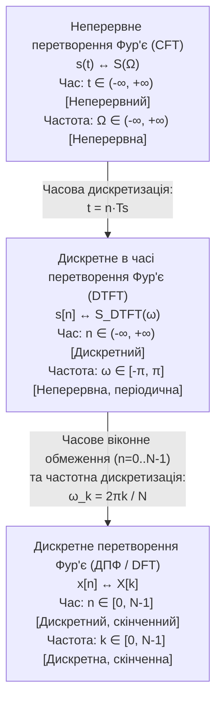
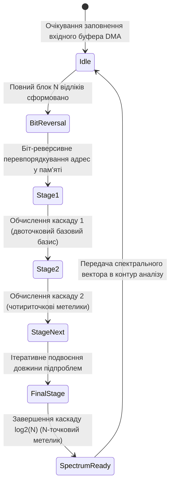
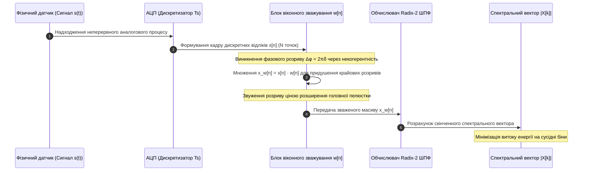
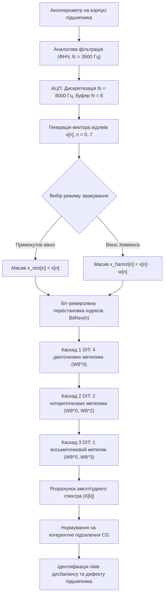

# Тема 3. Спектральний аналіз дискретних сигналів: дискретне перетворення Фур'є, алгоритми швидкого перетворення Фур'є та методи віконного зважування

## Мета лекції

Сформувати у здобувачів вищої освіти другого (магістерського) рівня системні наукові знання та практико-орієнтовані інженерні компетентності щодо теоретичних засад, аналітичного апарату та алгоритмічних реалізацій спектрального аналізу дискретних сигналів і зображень у частотній області. Забезпечити глибоке розуміння математичного генезису дискретного перетворення Фур'є (ДПФ) як скінченновимірного оператора в гільбертовому просторі, опанування методів факторизації матриць у швидкому перетворенні Фур'є (ШПФ) Кулі-Тьюкі за основою 2 з проріджуванням за часом та частотою, а також засвоєння фізико-математичної природи спектрального витоку та методології його мінімізації із застосуванням косинусоїдальних вагових вікон для підвищення метрологічної точності цифрових сигнальних процесорів і комп'ютерно-інтегрованих систем.

## Очікувані результати навчання

1. **Знання та розуміння.** Здобувач формулює теоретичні засади редукції інтеграла Фур'є через дискретне в часі перетворення (DTFT) до скінченновимірного дискретного перетворення Фур'є, інтерпретує наслідки дискретизації й квантування частотної осі, а також аргументовано пояснює фізичний і математичний зміст фундаментальних властивостей ДПФ, зокрема комплексної ермітової симетрії для дійсних послідовностей, циклічного зсуву та теореми про циклічну згортку.
2. **Застосування.** Здобувач самостійно розраховує спектральні коефіцієнти прямого та оберненого ДПФ у матрично-векторній формі, синтезує сигнальні графи базової операції «метелик» для алгоритмів ШПФ за основою 2 з проріджуванням за часом (DIT) і частотою (DIF), реалізує процедуру двійково-інверсної адресації пам'яті для обчислень на місці та застосовує алгоритм двовимірного перетворення Фур'є для просторової фільтрації зображень із використанням операції центрування спектра.
3. **Аналіз.** Здобувач здійснює порівняльний аналіз обчислювальної складності прямого ДПФ $\mathcal{O}(N^2)$ та алгоритмів ШПФ $\mathcal{O}(N \log_2 N)$, визначає кількісний коефіцієнт прискорення обчислень для вбудованих апаратних архітектур, детально аналізує механізм виникнення спектрального витоку внаслідок некогерентної вибірки як результат згортки з ядром Діріхле, а також диференціює вагові вікна за шириною головної пелюстки, швидкістю асимптотичного спаду та рівнем придушення бічних пелюсток.
4. **Оцінювання та синтез.** Здобувач комплексно оцінює вплив розрядної сітки цифрового процесора й амплітудних втрат на сітці частот на точність спектральних вимірювань, обґрунтовує компромісний вибір між частотною роздільною здатністю та динамічним діапазоном під час спектрального аналізу багатокомпонентних сигналів, а також оптимізує параметри частотно-вибіркових та згладжувальних фільтрів для задач діагностики технічних об'єктів.

---

## Детальний покроковий план лекції

### 1. Теоретико-концептуальний базис. Математичні основи ДПФ та факторизація обчислень ШПФ

* 1.1. Математичний генезис дискретного спектрального аналізу: редукція неперервного інтеграла Фур'є через DTFT до скінченновимірного унітарного простору $\mathbb{C}^N$, дискретизація частотної осі та фізичний зміст неявного періодичного продовження часового сигналу.
* 1.2. Аналітичний апарат та алгебраїчні властивості ДПФ: матрична форма запису оператора через поворотні множники $W_N$, унітарність, властивості циклічного зсуву, ермітова симетрія спектра для дійсних сигналів, теорема Парсеваля та відмінність циклічної згортки від лінійної.
* 1.3. Алгоритм швидкого перетворення Фур'є за основою 2 із проріджуванням за часом (Radix-2 DIT FFT): метод декомпозиції Кулі-Тьюкі, топологія обчислювального графу базової операції «метелик», симетрія ядер та процедура двійково-інверсної перестановки адрес вхідного масиву.
* 1.4. Алгоритм ШПФ із проріджуванням за частотою (Radix-2 DIF FFT), факторизація квадратної матриці ДПФ у добуток розріджених блочно-діагональних матриць і строга аналітична оцінка обчислювальної складності алгоритмів.

### 2. Методологія та аналіз граничних умов. Феноменологія спектрального витоку, апарат віконного зважування та просторове 2D-ДПФ

* 2.1. Фізична та аналітична природа спектрального витоку: некогерентне стробування, розрив фази на границях кадру вибірки та інтерпретація прямокутного обмеження сигналу в термінах неперервної періодичної згортки з ядром Діріхле.
* 2.2. Граничні обмеження, бар'єри та компроміси віконного аналізу: теорема невизначеності для частотно-часового розкладу, еквівалентна шумова смуга (ENBW), втрати на дискретній сітці (Scalloping Loss) та асимптотичний спад бічних пелюсток як функція гладкості вікна.
* 2.3. Математичні моделі та параметричний аналіз класичних косинусоїдальних віконних функцій: аналіз вікна Ханна з нульовими крайовими умовами, вікна Хеммінга з піднятим косинусним п'єдесталом та трипараметричного вікна Блекмана.
* 2.4. Теорія та просторова сепарабельність двовимірного перетворення Фур'є (2D-DFT): векторно-матричний рядно-стовпчиковий розклад, оптимізація складності до $\mathcal{O}(MN \log_2(MN))$ та аналітичне обґрунтування процедури квадрантного центрування спектральної енергії (fftshift).

### 3. Практичний індустріальний / фаховий кейс. Прецизійний частотний моніторинг вібраційних процесів у роторних машинах

**Тема наскрізної задачі.** «Аналітичний і матричний розрахунок 8-точкового DIT ШПФ для дискретизованого вібросигналу з некогерентною гармонійною складовою, оцінка спектрального розмиття та ліквідація крайового розриву фази за допомогою вікна Хеммінга»

## 1. Теоретико-концептуальний базис. Математичні основи ДПФ та факторизація обчислень ШПФ

### 1.1. Математичний генезис дискретного спектрального аналізу: редукція неперервного інтеграла Фур'є через DTFT до скінченновимірного унітарного простору $\mathbb{C}^N$

Математичний апарат спектрального аналізу ґрунтується на фундаментальній ідеї декомпозиції довільного коливального процесу за базисом ортогональних гармонічних функцій. Для неперервного у часі фізичного сигналу $s(t)$, визначеного на нескінченному інтервалі $t \in (-\infty, \infty)$ як елемент гільбертового простору квадратично інтегровних функцій $L_2(\mathbb{R})$, класичне інтегральне перетворення Фур'є встановлює взаємно однозначне відображення між часовою та частотною областями:

$$S(\Omega) = \int_{-\infty}^{\infty} s(t) e^{-j\Omega t} \, dt$$

де $s(t)$ позначає досліджуваний неперервний аналоговий сигнал як функцію фізичного часу $t$, виміряного в секундах; $\Omega = 2\pi F$ позначає неперервну кутову частоту коливань аналогового процесу, виражену в радіанах за секунду; $j = \sqrt{-1}$ позначає уявну одиницю; $S(\Omega)$ позначає комплексну спектральну густину амплітуди сигналу, розмірність якої відповідає вольтам на герц.

Оскільки комп'ютерні обчислювальні системи функціонують виключно з дискретними даними скінченної розрядності, практична реалізація спектрального аналізу вимагає послідовної математичної редукції інтеграла Фур'є. Першим етапом такої редукції є перехід від неперервного аргументу часу до дискретного шляхом операції стробування з постійним кроком $T_s = 1/f_s$. Якщо підставити послідовність миттєвих відліків $s[n] = s(n T_s)$, де $n \in \mathbb{Z}$, у вираз інтегрального перетворення, отримуємо дискретне в часі перетворення Фур'є (**Discrete-Time Fourier Transform, DTFT**):

$$S_{\text{DTFT}}(\omega) = \sum_{n=-\infty}^{\infty} s[n] e^{-j\omega n}$$

де $s[n]$ позначає дискретну послідовність значень сигналу в цілочисельні моменти часу $n$; $\omega = \Omega T_s = 2\pi \frac{F}{f_s}$ позначає нормовану кругову частоту, виражену в радіанах на відлік; $S_{\text{DTFT}}(\omega)$ позначає комплексну спектральну функцію дискретного часу, яка є неперервною та періодичною за змінною $\omega$ з фундаментальним періодом $2\pi$.

Періодичність функції $S_{\text{DTFT}}(\omega)$ є прямим математичним наслідком того факту, що базисна експонента $e^{-j(\omega + 2\pi)n} = e^{-j\omega n} e^{-j2\pi n} = e^{-j\omega n}$ набуває тотожних значень для будь-яких цілих чисел $n$. Попри дискретизацію часової осі, функція $S_{\text{DTFT}}(\omega)$ залишається континуумом, оскільки аргумент частоти $\omega$ змінюється неперервно на відрізку $[-\pi, \pi]$, а межі підсумовування залишаються нескінченними. Для досягнення повної алгоритмічної реалізованості на цифрових процесорах необхідний другий етап редукції, який полягає в обмеженні тривалості вхідного сигналу скінченною кількістю $N$ відліків ($n = 0, 1, \dots, N-1$) та регулярній дискретизації неперервної частотної осі $\omega$ в межах одного періоду.

Дискретизація частотної осі здійснюється в $N$ еквідистантних точках із кроком квантування за нормованою частотою $\Delta\omega = \frac{2\pi}{N}$, що відповідає відлікам $\omega_k = k \Delta\omega = \frac{2\pi k}{N}$, де $k = 0, 1, \dots, N-1$. Підстановка дискретизованої частотної змінної в оператор DTFT породжує **дискретне перетворення Фур'є** (**Discrete Fourier Transform, ДПФ**):

$$X[k] = \sum_{n=0}^{N-1} x[n] e^{-j\frac{2\pi}{N} k n}, \quad k = 0, 1, \dots, N-1$$

де $x[n]$ позначає скінченний вектор відліків вихідного сигналу розмірністю $N$; $X[k]$ позначає $k$-й комплексний коефіцієнт дискретного спектра на циклічній частоті $f_k = k \frac{f_s}{N}$, вираженій у герцах; $N$ позначає розмірність простору перетворення.

Відновлення вихідної послідовності відліків за розрахованим спектром виконується за допомогою **оберненого дискретного перетворення Фур'є** (**Inverse Discrete Fourier Transform, ОДПФ**):

$$x[n] = \frac{1}{N} \sum_{k=0}^{N-1} X[k] e^{j\frac{2\pi}{N} k n}, \quad n = 0, 1, \dots, N-1$$

де коефіцієнт нормування $1/N$ забезпечує збереження енергетичного балансу між взаємно спряженими просторами часового та частотного представлення.

Дискретизація спектральної осі призводить до фундаментального фізико-математичного наслідку: математичний апарат ДПФ апріорно сприймає скінченний часовий масив $x[n]$ як один ізольований період нескінченного періодичного процесу $\tilde{x}[n]$, для якого виконується строга тотожність періодичності $\tilde{x}[n] = \tilde{x}[n + rN]$, де $r \in \mathbb{Z}$. Таким чином, перетворення здійснюється у скінченновимірному унітарному просторі $\mathbb{C}^N$, в якому операції зсуву та індексації автоматично набувають циклічного характеру за модулем $N$.

> **ПРАКТИЧНИЙ ЯКІР:** У сучасних радіолокаційних станціях із фазованими антенними решітками перехід від неперервного зондувального імпульсу до дискретного спектрального опису ДПФ дозволяє реалізувати процедуру цифрового діаграмоутворення в реальному часі. Дискретизація просторового розподілу електромагнітного поля за апертурою антени з наступним 1024-точковим перетворенням забезпечує синтез вузьких просторових променів і паралельне супроводження до кількох сотень повітряних цілей на базі одного сигнального процесора.

---

### 1.2. Аналітичний апарат та алгебраїчні властивості ДПФ: матричний опис, унітарність та циклічна згортка

Для спрощення математичних викладок і побудови алгоритмів обробки сигналів вводиться поняття **комплексного поворотного множника** (twiddle factor):

$$W_N = e^{-j\frac{2\pi}{N}} = \cos\left(\frac{2\pi}{N}\right) - j\sin\left(\frac{2\pi}{N}\right)$$

де $W_N$ є комплексним числом з одиничним модулем $|W_N| = 1$, що реалізує геометричний поворот вектора у комплексній площині за годинниковою стрілкою на кут $2\pi/N$ радіан. 

Поворотний множник має низку важливих алгебраїчних властивостей: періодичність за базисом $W_N^{k+N} = W_N^k$, комплексна антисиметрія відносно половини періоду $W_N^{k + N/2} = -W_N^k$, а також правило масштабування степеня $W_N^{2kn} = W_{N/2}^{kn}$. З урахуванням введеного оператора аналітичний вираз ДПФ та ОДПФ записується у компактній алгебраїчній формі:

$$X[k] = \sum_{n=0}^{N-1} x[n] W_N^{kn}, \quad x[n] = \frac{1}{N} \sum_{k=0}^{N-1} X[k] W_N^{-kn}$$

Векторно-матрична інтерпретація розглядає ДПФ як лінійне перетворення вхідного вектора $\mathbf{x} = [x[0], x[1], \dots, x[N-1]]^T \in \mathbb{C}^{N \times 1}$ у вихідний спектральний вектор $\mathbf{X} = [X[0], X[1], \dots, X[N-1]]^T \in \mathbb{C}^{N \times 1}$ за допомогою квадратної матриці перетворення Фур'є $\mathbf{W}_N$:

$$\mathbf{X} = \mathbf{W}_N \mathbf{x}$$

$$\begin{bmatrix}
X[0] \\
X[1] \\
X[2] \\
\vdots \\
X[N-1]
\end{bmatrix} = \begin{bmatrix}
1 & 1 & 1 & \dots & 1 \\
1 & W_N^1 & W_N^2 & \dots & W_N^{N-1} \\
1 & W_N^2 & W_N^4 & \dots & W_N^{2(N-1)} \\
\vdots & \vdots & \vdots & \ddots & \vdots \\
1 & W_N^{N-1} & W_N^{2(N-1)} & \dots & W_N^{(N-1)(N-1)}
\end{bmatrix} \begin{bmatrix}
x[0] \\
x[1] \\
x[2] \\
\vdots \\
x[N-1]
\end{bmatrix}$$

Матриця $\mathbf{W}_N$ є строго симетричною $\mathbf{W}_N = \mathbf{W}_N^T$ і володіє ортогональністю рядків і стовпців. Її обернена матриця обчислюється через ермітове спряження:

$$\mathbf{W}_N^{-1} = \frac{1}{N} \mathbf{W}_N^H = \frac{1}{N} (\mathbf{W}_N^*)^T$$

де верхній індекс $H$ позначає ермітове спряження матриці; зірочка $*$ відповідає комплексному спряженню її числових елементів.

Оператор ДПФ підпорядковується групі фундаментальних алгебраїчних теорем, які визначають правила перетворень у дискретних системах:

Лінійність відображення гарантує адитивність спектрального відгуку на суперпозицію сигналів. Якщо вхідний процес подано як зважену суму $x[n] = \alpha x_1[n] + \beta x_2[n]$, де $\alpha, \beta \in \mathbb{C}$, то його дискретний спектр задовольняє рівність $X[k] = \alpha X_1[k] + \beta X_2[k]$.

Властивість циклічного зсуву в часовій області встановлює, що циклічна перестановка відліків сигналу на $n_0$ позицій вздовж дискретної осі $x_{\text{shift}}[n] = x[(n - n_0) \bmod N]$ не впливає на форму амплітудного спектра, але додає лінійний фазовий зсув до кожного спектрального коефіцієнта:

$$\text{DFT}\{x[(n - n_0) \bmod N]\} = X[k] W_N^{k n_0} = X[k] e^{-j\frac{2\pi}{N} k n_0}$$

Дзеркальна теорема про циклічний зсув у частотній області стверджує, що множення часового сигналу на дискретну комплексну експоненту частоти $l$ еквівалентне циклічному переміщенню спектральних відліків за правилом $\text{DFT}\{x[n] W_N^{-ln}\} = X[(k - l) \bmod N]$.

Комплексна ермітова симетрія спектра є найважливішою властивістю перетворення дійсних сигналів. Якщо вхідна послідовність $x[n]$ складається суто з дійсних чисел ($x[n] \in \mathbb{R}$), то відліки спектра, розташовані симетрично відносно половини базису $N/2$, є взаємно комплексно-спряженими парами:

$$X[N - k] = X^*[k], \quad k = 1, 2, \dots, \frac{N}{2} - 1$$

З наведеної симетрії безпосередньо випливає, що амплітудний спектр $|X[k]|$ дійсного сигналу є строго парною функцією відносно центрального біна Найквіста, а його фазовий спектр $\arg\{X[k]\}$ є строго непарною функцією:

$$|X[N - k]| = |X[k]|, \quad \arg\{X[N - k]\} = -\arg\{X[k]\}$$

При цьому спектральний відлік на нульовій частоті $X[0] = \sum_{n=0}^{N-1} x[n]$, що визначає постійну складову процесу, а також відлік на частоті Найквіста $X[N/2] = \sum_{n=0}^{N-1} x[n](-1)^n$ (для парних $N$) завжди набувають суто дійсних значень без уявної частини.

Енергетична рівність Парсеваля фіксує ізометричність перетворення ДПФ із точністю до масштабного коефіцієнта, гарантуючи збереження повної потужності сигналу при переході між функціональними базисами:

$$\sum_{n=0}^{N-1} |x[n]|^2 = \frac{1}{N} \sum_{k=0}^{N-1} |X[k]|^2$$

Особливе значення для розрахунку цифрових систем має теорема про згортку. На відміну від неперервного інтеграла Фур'є, де поелементний добуток спектрів відповідає лінійній фізичній згортці сигналів, добуток двох масивів ДПФ $Y[k] = X_1[k] X_2[k]$ формує в часовій області **циклічну (кругову) згортку**:

$$y_c[n] = x_1[n] \circledast x_2[n] = \sum_{m=0}^{N-1} x_1[m] x_2[(n - m) \bmod N] = \text{IDFT}\{X_1[k] \cdot X_2[k]\}$$

де символ $\circledast$ позначає оператор циклічної згортки над дискретними векторами довжиною $N$.

> **ТИПОВА ПОМИЛКА:** Типовою концептуальною помилкою інженерів є спроба фільтрації сигналів шляхом прямого поелементного множення спектра сигналу на аналітичну АЧХ фільтра в частотній області без попереднього штучного розширення розмірності масивів. Через циклічну природу ДПФ хвіст перехідного процесу лінійного фільтра довжиною $M - 1$ переноситься з кінця інтервалу в його початок і накладається на корисний сигнал, породжуючи фатальне крайове спотворення (time-domain aliasing). Для обчислення строго лінійної аперіодичної згортки двох сигналів довжиною $L$ та $M$ спектральним методом необхідно попередньо доповнити обидва часових масиви нульовими відліками (zero-padding) до сумарної розмірності $N \ge L + M - 1$.

---

### 1.3. Алгоритм швидкого перетворення Фур'є за основою 2 із проріджуванням за часом (Radix-2 DIT FFT)

Пряме обчислення спектрального вектора за формулою ДПФ через векторно-матричне множення вимагає $N$ комплексних множень та $(N - 1)$ комплексних додавань для кожної з $N$ гармонік. Загальна алгоритмічна складність оцінюється як:

$$M_{\text{DFT}} = N^2, \quad A_{\text{DFT}} = N(N - 1) \approx N^2 \implies \mathcal{O}(N^2)$$

де $M_{\text{DFT}}$ позначає кількість операцій комплексного множення; $A_{\text{DFT}}$ позначає кількість комплексних додавань. При аналізі великих вибірок ($N = 4096$) необхідність виконання понад $16.7 \times 10^6$ операцій комплексного множення на один кадр унеможливлює роботу цифрових сигнальних процесорів у темпі надходження інформації.

Революційним розв'язанням цієї обчислювальної проблеми став алгоритм **швидкого перетворення Фур'є** (**Fast Fourier Transform, ШПФ**), запропонований Дж. Кулі та Дж. Тьюкі. У випадку, коли довжина вхідного вектора кратна цілому степеню двійки $N = 2^\nu$ (де $\nu = \log_2 N$ визначає кількість обчислювальних каскадів), застосовується алгоритм **ШПФ за основою 2 із проріджуванням за часом** (**Decimation-in-Time, DIT FFT**).

Математична сутність методу полягає в рекурсивному розщепленні вхідної суми ДПФ довжиною $N$ на дві незалежні суми довжиною $N/2$, складені окремо з відліків з парними індексами $n = 2m$ та непарними індексами $n = 2m + 1$, де $m = 0, 1, \dots, \frac{N}{2} - 1$:

$$X[k] = \sum_{m=0}^{N/2 - 1} x[2m] W_N^{2mk} + \sum_{m=0}^{N/2 - 1} x[2m + 1] W_N^{(2m + 1)k}$$

Використовуючи фундаментальну властивість редукції поворотного множника $W_N^{2mk} = e^{-j\frac{2\pi}{N} 2mk} = e^{-j\frac{2\pi}{N/2} mk} = W_{N/2}^{mk}$ та виносячи постійний для другої суми множник $W_N^k$ за знак підсумовування, отримуємо розклад:

$$X[k] = \sum_{m=0}^{N/2 - 1} x_e[m] W_{N/2}^{mk} + W_N^k \sum_{m=0}^{N/2 - 1} x_o[m] W_{N/2}^{mk} = X_e[k] + W_N^k X_o[k]$$

де $x_e[m] = x[2m]$ позначає парну підпослідовність відліків вихідного сигналу; $x_o[m] = x[2m + 1]$ позначає непарну підпослідовність відліків; $X_e[k]$ позначає $(N/2)$-точкове ДПФ парної вибірки; $X_o[k]$ позначає $(N/2)$-точкове ДПФ непарної вибірки.

Обидва спектри $X_e[k]$ та $X_o[k]$ є періодичними за частотним аргументом $k$ із періодом $N/2$. Враховуючи властивість півперіодичної антисиметрії ядра $W_N^{k + N/2} = -W_N^k$, розрахунок усього спектрального масиву для першої та другої половин частотної сітки розпадається на сукупність однакових парних обчислень:

$$\begin{cases}
X[k] = X_e[k] + W_N^k X_o[k] \\
X\left[k + \frac{N}{2}\right] = X_e[k] - W_N^k X_o[k]
\end{cases}, \quad k = 0, 1, \dots, \frac{N}{2} - 1$$

Наведена пара аналітичних виразів реалізує базовий структурний елемент алгоритму ШПФ — **обчислювальний модуль типу «метелик»** (**butterfly computation**). Модуль приймає на вхід два комплексні спектральні значення підпроблем, виконує лише одне тригонометричне множення на поворотний коефіцієнт $W_N^k$ і формує два результуючі значення за допомогою одного додавання та одного віднімання.

Для забезпечення можливості обчислень «на місці» (*in-place computation*), коли вихідні коефіцієнти кожного каскаду записуються безпосередньо в ті самі комірки оперативної пам'яті, що звільнилися від вхідних операндів, вихідний вектор $x[n]$ повинен надходити на перший каскад перетворення не в хронологічній послідовності, а у **двійково-інверсному порядку** (**bit-reversed order**). Процедура біт-реверсії полягає в перетворенні порядкового номера відліку $n$ у двійкове слово розрядністю $\nu = \log_2 N$, дзеркальній перестановці розрядів від молодшого до старшого та обчисленні нового десяткового еквівалента індексу комірки.

Порядок біт-реверсивної перестановки для масиву з $N = 8$ відліків ($\nu = \log_2 8 = 3$ біти) демонструє математичну закономірність переходу індексів:

$$n = 0 \quad (000_2) \xrightarrow{\text{реверс}} 000_2 = 0 \quad \implies \text{відлік } x[0] \text{ залишається на позиції } 0$$

$$n = 1 \quad (001_2) \xrightarrow{\text{реверс}} 100_2 = 4 \quad \implies \text{відлік } x[1] \text{ міняється місцями з } x[4]$$

$$n = 2 \quad (010_2) \xrightarrow{\text{реверс}} 010_2 = 2 \quad \implies \text{відлік } x[2] \text{ залишається на позиції } 2$$

$$n = 3 \quad (011_2) \xrightarrow{\text{реверс}} 110_2 = 6 \quad \implies \text{відлік } x[3] \text{ міняється місцями з } x[6]$$

$$n = 4 \quad (100_2) \xrightarrow{\text{реверс}} 001_2 = 1 \quad \implies \text{взаємний обмін із } x[1] \text{ виконано раніше}$$

$$n = 5 \quad (101_2) \xrightarrow{\text{реверс}} 101_2 = 5 \quad \implies \text{відлік } x[5] \text{ залишається на позиції } 5$$

$$n = 6 \quad (110_2) \xrightarrow{\text{реверс}} 011_2 = 3 \quad \implies \text{взаємний обмін із } x[3] \text{ виконано раніше}$$

$$n = 7 \quad (111_2) \xrightarrow{\text{реверс}} 111_2 = 7 \quad \implies \text{відлік } x[7] \text{ залишається на позиції } 7$$

Таким чином, сформований для першого каскаду вектор має впорядкований вигляд: $\{x[0], x[4], x[2], x[6], x[1], x[5], x[3], x[7]\}$.

> **ПРАКТИЧНИЙ ЯКІР:** Архітектури спеціалізованих цифрових сигнальних процесорів, зокрема родини Texas Instruments TMS320C6000 та мікроконтролерів із ядром ARM Cortex-M4/M7, мають апаратні генератори адресних послідовностей (AGU). Вони підтримують спеціальний режим біт-реверсивного інкременту покажчика пам'яті за нульову кількість додаткових тактів ядра, що дозволяє завантажувати вхідні дані для алгоритму Radix-2 ШПФ безпосередньо з буфера прямого доступу до пам'яті (DMA) без програмних накладних витрат.

---

### 1.4. Алгоритм ШПФ із проріджуванням за частотою (Radix-2 DIF FFT), матрична факторизація та обчислювальна складність

Дзеркальною модифікацією розкладу Кулі-Тьюкі є алгоритм **ШПФ за основою 2 із проріджуванням за частотою** (**Decimation-in-Frequency, DIF FFT**, метод Сенде-Тьюкі). У цьому підході вихідний часовий масив не розбивається на парні та непарні відліки, а ділиться навпіл на першу та другу просторові половини часового інтервалу спостереження:

$$X[k] = \sum_{n=0}^{N/2 - 1} x[n] W_N^{kn} + \sum_{n=N/2}^{N-1} x[n] W_N^{kn} = \sum_{n=0}^{N/2 - 1} x[n] W_N^{kn} + \sum_{n=0}^{N/2 - 1} x\left[n + \frac{N}{2}\right] W_N^{k(n + N/2)}$$

Виносячи спільний степеневий множник ядра та враховуючи, що $W_N^{k N/2} = e^{-j\frac{2\pi}{N} k \frac{N}{2}} = e^{-j\pi k} = (-1)^k$, отримуємо вираз:

$$X[k] = \sum_{n=0}^{N/2 - 1} \left(x[n] + (-1)^k x\left[n + \frac{N}{2}\right]\right) W_N^{kn}$$

Далі розглядають окремо парні спектральні коефіцієнти ($k = 2m$) та непарні коефіцієнти ($k = 2m + 1$), де цілий індекс $m = 0, 1, \dots, \frac{N}{2} - 1$:

Для парних номерів спектральних відліків значення $(-1)^{2m} = 1$, а поворотний множник набуває вигляду $W_N^{2mn} = W_{N/2}^{mn}$, що трансформує вираз у стандартне $(N/2)$-точкове ДПФ:

$$X[2m] = \sum_{n=0}^{N/2 - 1} \left(x[n] + x\left[n + \frac{N}{2}\right]\right) W_{N/2}^{mn}$$

Для непарних номерів спектральних відліків значення $(-1)^{2m + 1} = -1$, а множник розкладається як $W_N^{(2m + 1)n} = W_N^n W_{N/2}^{mn}$:

$$X[2m + 1] = \sum_{n=0}^{N/2 - 1} \left[\left(x[n] - x\left[n + \frac{N}{2}\right]\right) W_N^n\right] W_{N/2}^{mn}$$

Алгоритм DIF відрізняється топологією метелика: операції додавання та віднімання відліків часових половин здійснюються **до** множення на поворотний коефіцієнт $W_N^n$. При цьому часовий сигнал подається на вхід у природному хронологічному порядку, тоді як вихідні спектральні коефіцієнти утворюються у двійково-інверсному порядку індексів частоти, вимагаючи перестановок на фінальному етапі.

Алгебраїчна інтерпретація алгоритмів ШПФ зводиться до **факторизації повної матриці ДПФ** $\mathbf{W}_N$ у добуток $\nu = \log_2 N$ розріджених унітарних матриць каскадів $\mathbf{A}_s$ та перестановочної матриці біт-реверсії $\mathbf{P}_N$:

$$\mathbf{W}_N = \mathbf{A}_{\nu} \cdot \mathbf{A}_{\nu - 1} \dots \mathbf{A}_1 \cdot \mathbf{P}_N$$

де $\mathbf{P}_N$ позначає ортогональну матрицю перестановок розмірністю $N \times N$, кожен рядок і стовпець якої містить строго одну одиницю; $\mathbf{A}_s$ позначає розріджену блочно-діагональну матрицю $s$-го обчислювального етапу, де кожен рядок містить лише два ненульових елементи ($1$ та $\pm W_N^r$).

Кожен із $\log_2 N$ каскадів алгоритму Radix-2 ШПФ складається строго з $N/2$ операцій «метелик». Оскільки один метелик потребує виконання одного комплексного множення та двох комплексних додавань, підсумкові аналітичні витрати обчислювальних ресурсів визначаються співвідношеннями:

$$M_{\text{FFT}} = \frac{N}{2} \log_2 N$$

$$A_{\text{FFT}} = N \log_2 N$$

де $M_{\text{FFT}}$ позначає загальну кількість операцій комплексного множення; $A_{\text{FFT}}$ позначає кількість операцій комплексного додавання; $N$ позначає розмірність вхідного масиву.

Асимптотична оцінка часової складності алгоритмів швидкого перетворення становить $\mathcal{O}(N \log_2 N)$, що якісно перевершує квадратичну складність прямого ДПФ $\mathcal{O}(N^2)$. Кількісний аналітичний показник прискорення обчислень визначається відношенням кількості множень:

$$\xi(N) = \frac{M_{\text{DFT}}}{M_{\text{FFT}}} = \frac{N^2}{\frac{N}{2} \log_2 N} = \frac{2N}{\log_2 N}$$

При переході від малих масивів ($N = 16$, $\xi \approx 8$) до великих масивів систем радіолокації та обробки телекомунікаційних сигналів ($N = 4096$, $\xi \approx 682.7$) алгоритм ШПФ забезпечує прискорення процедури спектрального аналізу на майже три порядки, перетворюючи спектральні методи на стандартний інструмент систем цифрової обробки сигналів у реальному часі.

Діаграма переходів станів та конвеєризації обчислювальних ресурсів процесора при реалізації каскадного алгоритму швидкого перетворення ілюструє послідовність зміни структур даних у пам'яті:

### Систематизація методів та операторів спектрального перетворення

| Базовий оператор / концепція | Аналітичний вираз або топологія | Обчислювальна складність | Область визначення (Час / Частота) | Приклад з реальної практики |
| :--- | :--- | :--- | :--- | :--- |
| **Інтеграл Фур'є (CFT)** | $S(\Omega) = \int_{-\infty}^{\infty} s(t) e^{-j\Omega t} dt$ | Аналітична (континуальна) | $t \in (-\infty, \infty)$ / $\Omega \in (-\infty, \infty)$ | Теоретичний аналіз лінійних радіотехнічних ланцюгів |
| **Дискретний час Фур'є (DTFT)** | $S(\omega) = \sum_{n=-\infty}^{\infty} s[n] e^{-j\omega n}$ | Нескінченна сума (континуум) | $n \in \mathbb{Z}$ / $\omega \in [-\pi, \pi]$ (періодична) | Моделювання частотних характеристик аналогових та КІХ-фільтрів |
| **Дискретне перетворення (ДПФ)** | $X[k] = \sum_{n=0}^{N-1} x[n] W_N^{kn}$ | $N^2$ множень, $N(N-1)$ додавань | $n \in [0, N-1]$ / $k \in [0, N-1]$ (скінченні) | Обчислення довільної нестепеневої кількості частотних ліній |
| **Radix-2 DIT FFT** | $\begin{cases} X_e[k] + W_N^k X_o[k] \\ X_e[k] - W_N^k X_o[k] \end{cases}$ | $\frac{N}{2} \log_2 N$ множень, $N \log_2 N$ додавань | Вхід: біт-реверсний, Вихід: природний | Спектральний аналіз звуку в бібліотеках CMSIS-DSP для мікроконтролерів |
| **Radix-2 DIF FFT** | $\begin{cases} (x[n] + x[n+N/2]) W_{N/2}^{mn} \\ (x[n] - x[n+N/2]) W_N^n W_{N/2}^{mn} \end{cases}$ | $\frac{N}{2} \log_2 N$ множень, $N \log_2 N$ додавань | Вхід: природний, Вихід: біт-реверсний | Швидка блокова згортка в ПЛІС телекомунікаційних модемів OFDM |

> **КОНТРОЛЬНЕ ПИТАННЯ:** Чому для обчислення лінійної аперіодичної фільтрації в частотній області найефективнішим вважається сполучення прямого перетворення DIF FFT та оберненого DIT FFT, і яким чином така топологічна комбінація оптимізує використання обчислювальних тактів процесора?

Розгорнути аналіз / відповідь

**Правильний варіант: Комбінація прямого DIF FFT та оберненого DIT FFT повністю виключає необхідність біт-реверсивної перестановки масивів.**

1. Алгоритм DIF FFT приймає на вхід масив у природному хронологічному порядку та генерує вихідний спектр у двійково-інверсному порядку індексів.
2. При реалізації частотної фільтрації спектр сигналу множиться на спектральну характеристику фільтра. Оскільки передавальну функцію фільтра можна попередньо зберегти в постійній пам'яті процесора також у двійково-інверсному порядку, операція поелементного комплексного перемноження $Y[k] = X[k] \cdot H[k]$ виконується без жодних додаткових перестановок.
3. Алгоритм ОДПФ за схемою DIT приймає вхідні спектральні дані саме у двійково-інверсному порядку та після проходження каскадів обчислень генерує результат у природному часовому порядку.
4. Аналіз альтернативних підходів: використання двох однотипних алгоритмів (DIT + IDIT або DIF + IDIF) неминуче вимагає виконання двох ресурсномістких операцій біт-реверсивного сортування масивів у пам'яті, що знижує загальну швидкодію тракту цифрової обробки сигналів на 15–25%.

---

### Вказівки для самостійного осмислення

1. Дослідіть взаємозв'язок між фундаментальними властивостями поворотних множників $W_N$ та циклічністю оператора ДПФ у гільбертовому просторі, звернувши особливу увагу на геометричне розташування коренів з одиниці на комплексному колі для систем з різною парністю кількості відліків.
2. Здійсніть аналітичну побудову повної розрідженої факторизації матриці перетворення Фур'є $\mathbf{W}_8$ у добуток трьох блочно-діагональних матриць першого, другого та третього каскадів, простеживши математичний механізм скорочення кількості операцій множення за рахунок використання однакових проміжних підсумків.
3. Проаналізуйте обмеження алгоритмів ШПФ Кулі-Тьюкі за основою 2 у випадках, коли розмірність досліджуваного масиву не є цілим степенем двійки, та оцініть теоретичну доцільність застосування комбінованих алгоритмів розбиття з довільними основами (Mixed-Radix FFT) або алгоритму Блуштайна для збереження високої швидкодії спектральних обчислювачів.

## 2. Методологія та аналіз граничних умов. Феноменологія спектрального витоку, апарат віконного зважування та просторове 2D-ДПФ

### 2.1. Фізична та аналітична природа спектрального витоку: некогерентне стробування та згортка з ядром Діріхле

Методологія практичного застосування дискретного перетворення Фур'є базується на припущенні, що аналізований часовий масив відліків є одним ізольованим періодом нескінченного процесу. У вимірювальній практиці це припущення справджується лише тоді, коли тривалість інтервалу спостереження $T_{\text{obs}} = N T_s$ виявляється строго кратною періоду кожної з гармонічних складових досліджуваного сигналу. Якщо вхідний процес містить коливання з частотою $f_0$, умова когерентного вимірювання набуває вигляду $f_0 = k_0 \Delta f = k_0 \frac{f_s}{N}$, де $k_0 \in \mathbb{Z}$ позначає цілочисельний індекс спектрального біна, а $\Delta f$ визначає крок частотної сітки перетворення. За виконання цієї рівності фаза сигналу на початку інтервалу спостереження точно збігається з фазою в кінці вибірки, що забезпечує неперервність гіпотетичного періодичного продовження сигналу, а вся спектральна енергія концентрується строго в межах $k_0$-го біна.

У реальних інженерних системах апріорна синхронізація між генератором досліджуваного сигналу та тактовим генератором аналого-цифрового перетворювача здебільшого відсутня, внаслідок чого аналізована частота виявляється некогерентною відносно базису перетворення. Некогерентний стан описується співвідношенням $f_0 = (k_0 + \delta)\Delta f$, де параметр $\delta \in (-0.5, 0.5]$ позначає дробове частотне зміщення від найближчого вузла дискретної сітки. За таких умов на границях вибірки виникає фазовий стрибок $\Delta \phi = 2\pi\delta$, що порушує періодичність сигналу. Фізичне виділення блоку довжиною $N$ відліків з неперервного процесу відповідає множенню нескінченного сигналу $s[n]$ на прямокутну вагову функцію $w_R[n]$, яка дорівнює одиниці при $0 \le n \le N-1$ та нулю за межами цього діапазону.

Оскільки множенню функцій у часовій області строго відповідає періодична неперервна згортка їхніх спектрів у частотній області, спектр віконного сигналу трансформується у згортку дельта-функції вхідного коливання з частотним відгуком прямокутного вікна. Математичне виведення спектральної характеристики прямокутного вікна $W_R(\omega)$ у формі ядра Діріхле реалізується за допомогою такого аналітичного алгоритму:

$$
\begin{aligned}
\text{Крок 1 (Формування ряду за визначенням DTFT):} & \quad W_R(\omega) = \sum_{n=0}^{N-1} e^{-j\omega n} \\
\text{Крок 2 (Згортання скінченної геометричної прогресії):} & \quad W_R(\omega) = \frac{1 - e^{-j\omega N}}{1 - e^{-j\omega}} \\
\text{Крок 3 (Симетризація та факторизація фазових експонент):} & \quad W_R(\omega) = \frac{e^{-j\frac{\omega N}{2}} \left(e^{j\frac{\omega N}{2}} - e^{-j\frac{\omega N}{2}}\right)}{e^{-j\frac{\omega}{2}} \left(e^{j\frac{\omega}{2}} - e^{-j\frac{\omega}{2}}\right)} \\
\text{Крок 4 (Аналітичне зведення до ядра Діріхле):} & \quad W_R(\omega) = e^{-j\omega \frac{N-1}{2}} \frac{\sin\left(\frac{\omega N}{2}\right)}{\sin\left(\frac{\omega}{2}\right)} = e^{-j\omega \frac{N-1}{2}} \mathcal{D}_N(\omega)
\end{aligned}
$$

де $W_R(\omega)$ позначає частотну характеристику прямокутного вікна в базисі DTFT; $\omega$ позначає нормовану кругову частоту, виражену в радіанах на відлік; $N$ позначає розмірність аналізованого часового вікна; множник $e^{-j\omega \frac{N-1}{2}}$ задає лінійний фазовий набіг, спричинений затримкою центру вікна відносно початку координат на $\frac{N-1}{2}$ тактів; $\mathcal{D}_N(\omega)$ позначає періодичне дискретне **ядро Діріхле**.

Ядро Діріхле досягає головного максимуму $\mathcal{D}_N(0) = N$ на нульовій частоті та має регулярні нулі у точках $\omega_m = \frac{2\pi m}{N}$ при цілих $m \neq 0 \pmod N$. Якщо частота сигналу строго збігається з вузлом сітки ($\delta = 0$), інші біни ДПФ потрапляють точно в нулі ядра Діріхле, тому розмиття спектра не спостерігається. Проте за наявності дробового зміщення $\delta \neq 0$ відліки ДПФ беруться у проміжних точках ядра Діріхле, де значення функції є ненульовими. Енергія монохроматичного сигналу перерозподіляється по всіх сусідніх і віддалених частотних бінах, породжуючи ефект **спектрального витоку** (**spectral leakage**). Рівень першої бічної пелюстки ядра Діріхле становить лише $-13.46\text{ дБ}$ відносно головного піка, що зумовлює просочування понад $21\%$ амплітуди коливання у сусідні спектральні канали.

---

### 2.2. Граничні обмеження, бар'єри та компроміси віконного аналізу

Застосування вагових вікон для пригнічення спектрального витоку підпорядковується фундаментальному принципу невизначеності у цифровій обробці сигналів. Цей принцип унеможливлює одночасне досягнення абсолютної локалізації енергії сигналу в часовій та частотній областях. Прагнення усунути крайові фазові стрибки за допомогою плавного спадання вагових коефіцієнтів до нуля на кінцях інтервалу неминуче призводить до розширення головної пелюстки спектра вікна. Як наслідок, знижується частотна вибірковість системи, тобто її здатність розділяти дві близькі спектральні лінії.

Для кількісної оцінки ефективності віконних функцій та аналізу їхніх метрологічних обмежень використовується сукупність взаємопов'язаних аналітичних критеріїв:

Еквівалентна шумова смуга пропускання (**Equivalent Noise Bandwidth, ENBW**) показує ступінь розширення смуги пропускання одиничного частотного біна для некорельованого білого шуму порівняно з ідеальним прямокутним фільтром і визначається виразом:

$$\text{ENBW} = N \frac{\sum_{n=0}^{N-1} w^2[n]}{\left(\sum_{n=0}^{N-1} w[n]\right)^2} \quad [\text{бінів}]$$

де $w[n]$ позначає дискретні відліки віконної функції; $N$ позначає загальну кількість точок у вікні. Для прямокутного вікна $\text{ENBW} = 1.0$, тоді як для згладжувальних вікон цей параметр зростає до $1.3\dots2.0$ бінів, що призводить до зростання сумарної дисперсії шуму, інтегрованого кожним спектральним каналом.

Когерентне підсилення (**Coherent Gain, CG**) визначає коефіцієнт передачі вікна для детермінованої гармонічної складової, що потрапляє точно в центр частотного біна:

$$\text{CG} = \frac{1}{N} \sum_{n=0}^{N-1} w[n]$$

Амплітудні втрати на сітці частот (**Scalloping Loss, SL**) характеризують максимальне зменшення амплітуди відгуку, яке виникає у найгіршому випадку, коли фізична частота гармоніки розташована рівно посередині між сусідніми бінами ДПФ ($\delta = 0.5$):

$$\text{SL} = 20 \log_{10} \left( \frac{\left|W\left(\frac{\pi}{N}\right)\right|}{W(0)} \right) \quad [\text{дБ}]$$

де $W(\omega)$ позначає частотну характеристику вікна. Для прямокутного вікна спад на межі біна сягає $3.92\text{ дБ}$, тоді як використання згладжувальних вікон дозволяє суттєво зменшити цю нерівномірність.

Швидкість асимптотичного спаду віддалених бічних пелюсток визначається виключно математичним порядком гладкості віконної функції на її межах. Якщо функція $w(t)$ має розрив першого роду на кінцях інтервалу спостереження, її спектральний відгук спадає асимптотично зі швидкістю $\mathcal{O}(\omega^{-1})$, що еквівалентно $-6\text{ дБ/октава}$ (як у випадку прямокутного вікна або вікна Хеммінга). Якщо сама функція є неперервною і строго обнуляється на границях, але розрив має її перша похідна, швидкість спаду становить $\mathcal{O}(\omega^{-2})$ або $-12\text{ дБ/октава}$. За умови неперервності функції разом із її першою похідною швидкість спаду досягає $\mathcal{O}(\omega^{-3})$, тобто $-18\text{ дБ/октава}$ (як у вікні Ханна чи Блекмана), що гарантує швидке згасання паразитних завад у віддалених частотних діапазонах.

Аналіз граничних умов показує, що класична методологія віконного аналізу на базі ДПФ зазнає критичних збоїв у низці специфічних прикладних сценаріїв.

По-перше, модель стає нерелевантною під час аналізу нестаціонарних процесів із швидкою девіацією частоти (наприклад, ЛЧМ-радіолокаційних сигналів або перехідних процесів короткого замикання). Якщо частота коливання суттєво змінюється впродовж часу накопичення блоку $T_{\text{obs}}$, інтеграл ДПФ усереднює миттєву енергію по широкій смузі, повністю втрачаючи часову прив'язку подій.

По-друге, віконне зважування виявляється непридатним для виявлення короткочасних імпульсних аномалій на тлі гармонічних шумів. Оскільки згладжувальні вікна пригнічують крайові відліки вибірки практично до нуля, імпульсний сигнал, що надійшов на початку або в кінці вимірювального кадру, буде штучно послаблений або повністю втрачений контуром детектування.

По-третє, бар'єр роздільної здатності за Рейлі обмежує застосування вікон за потреби розрізнення двох близьких тонів однакової амплітуди. Якщо частотна відстань між компонентами менша за ширину головної пелюстки вікна $\Delta f_{\text{main}}$, замість двох окремих піків на спектрограмі спостерігається один суцільний деформований максимум, що призводить до хибної ідентифікації параметрів системи.

> **ВАЖЛИВО:** Застосування будь-якої згладжувальної віконної функції є незворотною операцією параметричної модифікації сигналу, яка призводить до втрати вихідної інформації про абсолютну потужність процесу. Для збереження метрологічної точності вимірювань розраховані спектральні коефіцієнти повинні підлягати обов'язковій компенсації: амплітудний спектр ділиться на когерентне підсилення вікна $\text{CG}$, а оцінка спектральної густини потужності (PSD) нормується на суму квадратів вагових коефіцієнтів $\sum w^2[n]$.

---

### 2.3. Параметричний аналіз косинусоїдальних віконних функцій (Ханна, Хеммінга, Блекмана)

Для практичної ліквідації крайових стрибків першого роду розроблено клас узагальнених косинусоїдальних вікон, які формуються як лінійна комбінація гармонічних функцій базисної частоти $\frac{2\pi n}{N-1}$ та її вищих кратних гармонік:

$$w[n] = \sum_{m=0}^{K} (-1)^m a_m \cos\left(\frac{2\pi m n}{N-1}\right), \quad 0 \le n \le N-1$$

де $a_m$ позначають фіксовані дійсні коефіцієнти моделі; $K$ визначає порядок тригонометричного полінома; $N$ позначає розмірність вікна.

Математичне виведення та оптимізація структури вагових функцій для кожного класичного типу вікна базуються на розв'язанні специфічних екстремальних задач:

$$
\begin{aligned}
\text{Етап 1 (Синтез вікна Ханна):} & \quad w_{\text{Hann}}[n] = 0.5 - 0.5\cos\left(\frac{2\pi n}{N-1}\right) = \sin^2\left(\frac{\pi n}{N-1}\right) \\
\text{Етап 2 (Оптимізація вікна Хеммінга):} & \quad w_{\text{Hamm}}[n] = \frac{25}{46} - \frac{21}{46}\cos\left(\frac{2\pi n}{N-1}\right) \approx 0.54 - 0.46\cos\left(\frac{2\pi n}{N-1}\right) \\
\text{Етап 3 (Формування вікна Блекмана):} & \quad w_{\text{Black}}[n] = 0.42 - 0.5\cos\left(\frac{2\pi n}{N-1}\right) + 0.08\cos\left(\frac{4\pi n}{N-1}\right)
\end{aligned}
$$

Вікно Ханна формується за допомогою простої косинусоїдальної хвилі з піднятим рівнем постійної складової. Його граничні значення в точках $n = 0$ та $n = N-1$ строго дорівнюють нулю, завдяки чому досягається неперервність як самої функції, так і її першої похідної. Ця математична властивість забезпечує високу швидкість асимптотичного згасання бічних хвиль ($-18\text{ дБ/октава}$), хоча рівень першої бічної пелюстки становить помірні $-31.5\text{ дБ}$.

Вікно Хеммінга синтезовано для розв'язання задачі мінімізації саме першої бічної пелюстки. Вагові коефіцієнти $a_0 \approx 0.54$ та $a_1 \approx 0.46$ підібрані так, щоб додатна бічна пелюстка другого члена ряду в спектральній області максимально точно збігалася за амплітудою і перебувала у протифазі з від'ємною бічною пелюсткою центрального ядра. Це забезпечує рекордне для двочленних вікон пригнічення найближчих бічних пелюсток до рівня $-42.7\text{ дБ}$. Проте оптимізація форми призвела до появи ненульового крайового п'єдесталу $w_{\text{Hamm}}[0] = w_{\text{Hamm}}[N-1] = 0.54 - 0.46 = 0.08$. Цей крайовий стрибок порушує гладкість функції, знижуючи швидкість згасання віддалених пелюсток до скромних $-6\text{ дБ/октава}$.

Трипараметричне вікно Блекмана містить додаткову другу гармоніку з коефіцієнтом $a_2 = 0.08$. Наявність третього ступеня свободи дозволяє одночасно забезпечити строге занулення функції на границях разом із двома першими похідними. Завдяки цьому досягається комбінований ефект: рівень максимальної бічної пелюстки знижується до значного значення $-58.1\text{ дБ}$, а швидкість спаду бічних хвиль зберігається на високому рівні $-18\text{ дБ/октава}$. Платою за такі характеристики стає розширення головної пелюстки до $6\Delta f$ за рівнем нулів (проти $2\Delta f$ у прямокутного вікна), що призводить до пропорційного погіршення частотної роздільної здатності.

> **ПРАКТИЧНИЙ ЯКІР:** У промисловому стандарті вібраційного моніторингу роторного обладнання електростанцій ISO 20816-1 для виявлення дефектів підшипників кочення на ранніх стадіях регламентовано обов'язкове застосування вікна Ханна. Це зумовлено тим, що висока швидкість згасання бічних пелюсток ($-18\text{ дБ/октава}$) усуває паразитне маскування слабких високочастотних ударних імпульсів кавітації низькочастотними гармоніками дисбалансу масивного ротора.

---

### 2.4. Просторова сепарабельність 2D-ДПФ та аналітичні засади спектрального центрування

Спектральний аналіз двовимірних сигналів і растрових напівтонових зображень є прямим узагальненням одновимірної теорії на дискретні векторні простори $\mathbb{C}^{M \times N}$. Якщо неперервне просторове оптичне поле дискретизовано на прямокутній координатній сітці у вигляді матриці яскравості пікселів $f[x, y]$, де $x = 0, 1, \dots, M-1$ задає номер рядка, а $y = 0, 1, \dots, N-1$ задає номер стовпця, двовимірне дискретне перетворення Фур'є (**2D-DFT**) визначається співвідношенням:

$$F[u, v] = \sum_{x=0}^{M-1} \sum_{y=0}^{N-1} f[x, y] e^{-j 2\pi \left(\frac{ux}{M} + \frac{vy}{N}\right)} = \sum_{x=0}^{M-1} \sum_{y=0}^{N-1} f[x, y] W_M^{ux} W_N^{vy}$$

де $u = 0, 1, \dots, M-1$ позначає просторовий частотний індекс за вертикальною координатою; $v = 0, 1, \dots, N-1$ позначає просторовий частотний індекс за горизонтальною координатою; $W_M = e^{-j\frac{2\pi}{M}}$ та $W_N = e^{-j\frac{2\pi}{N}}$ позначають поворотні множники просторових осей; $F[u, v]$ позначає комплексну амплітуду просторової гармоніки.

Обернене відновлення матриці яскравості вихідного кадру здійснюється за допомогою виразу **2D-IDFT**:

$$f[x, y] = \frac{1}{MN} \sum_{u=0}^{M-1} \sum_{v=0}^{N-1} F[u, v] e^{j 2\pi \left(\frac{ux}{M} + \frac{vy}{N}\right)} = \frac{1}{MN} \sum_{u=0}^{M-1} \sum_{v=0}^{N-1} F[u, v] W_M^{-ux} W_N^{-vy}$$

Пряме обчислення подвійної суми для квадратного зображення розмірністю $N \times N$ вимагає виконання $N^4$ комплексних множень, що для кадру високої чіткості $1024 \times 1024$ пікселів призводить до астрономічних обчислювальних витрат порядку $10^{12}$ операцій. Радикальна оптимізація процесу досягається завдяки фундаментальній властивості **просторової сепарабельності (відокремлюваності)** експоненційного ядра перетворення:

$$e^{-j 2\pi \left(\frac{ux}{M} + \frac{vy}{N}\right)} = e^{-j\frac{2\pi ux}{M}} \cdot e^{-j\frac{2\pi vy}{N}} = W_M^{ux} \cdot W_N^{vy}$$

Властивість сепарабельності дозволяє розкласти двовимірне перетворення на двоетапну послідовність незалежних одновимірних операцій:

$$
\begin{aligned}
\text{Крок 1 (Рядкове перетворення):} & \quad P[x, v] = \sum_{y=0}^{N-1} f[x, y] W_N^{vy}, \quad x = 0, 1, \dots, M-1 \\
\text{Крок 2 (Стовпчикове перетворення):} & \quad F[u, v] = \sum_{x=0}^{M-1} P[x, v] W_M^{ux}, \quad v = 0, 1, \dots, N-1
\end{aligned}
$$

де $P[x, v]$ позначає проміжну комплексну матрицю розмірністю $M \times N$, отриману в результаті паралельного обчислення одновимірних $N$-точкових ДПФ для кожного окремого рядка зображення. На другому кроці обчислюються одновимірні $M$-точкові ДПФ над кожним стовпцем отриманої проміжної матриці. Застосування алгоритму Radix-2 ШПФ на обох етапах скорочує складність до величини $\mathcal{O}(MN \log_2(MN))$, що для кадру $1024 \times 1024$ вимагає лише близько $2 \times 10^7$ операцій, забезпечуючи прискорення у $50\,000$ разів.

У стандартному вихідному масиві $F[u, v]$ елемент нульової просторової частоти $F[0, 0]$, що чисельно дорівнює інтегральній сумі яскравості всіх пікселів зображення (постійна складова сцени), розташовується у лівому верхньому кутку матриці:

$$F[0, 0] = \sum_{x=0}^{M-1} \sum_{y=0}^{N-1} f[x, y]$$

Околиці чотирьох кутів матриці відповідають низьким просторовим частотам, тоді як максимальні просторові частоти концентруються в геометричному центрі масиву. Для коректної фізичної інтерпретації та реалізації фільтрації застосовується процедура **спектрального центрування** (**fftshift**), яка переносить початок координат $(u=0, v=0)$ у центр частотної сітки $(u_c = M/2, v_c = N/2)$.

Математичне обґрунтування алгоритму `fftshift` базується на теоремі модуляції. Необхідний циклічний зсув спектра на величину напівперіодів за обома осями $\Delta u = M/2$ та $\Delta v = N/2$ відповідає множенню вихідного просторового сигналу на модулювальну експоненту:

$$e^{j 2\pi \left(\frac{(M/2)x}{M} + \frac{(N/2)y}{N}\right)} = e^{j\pi(x + y)} = \left(e^{j\pi}\right)^{x+y} = (-1)^{x+y}$$

З отриманого виразу випливає, що аналітичне центрування спектра є строго еквівалентним інверсії знака яскравості пікселів шаховим порядком: яскравість пікселя множиться на $-1$, якщо сума його координат $(x + y)$ є непарною, і залишається незмінною, якщо сума парна. Алгоритмічно у частотній області це реалізується перехресною перестановкою діагональних квадрантів матриці розмірністю $M \times N$.

Граничні умови двовимірного перетворення Фур'є вказують на специфічний деструктивний фактор: прямокутна межа зображення діє як двовимірне прямокутне вікно. Якщо протилежні краї зображення (верхній з нижнім або лівий з правим) суттєво відрізняються за середньою яскравістю, їхнє штучне циклічне змикання створює просторові перепади. У спектральній області це породжує потужний паразитний хрестоподібний спектральний витік вздовж центральних осей $u$ та $v$, який маскує реальні просторові частоти текстур і дрібних деталей сцени.

---

### Порівняльна аналітична матриця віконних функцій

| Тип віконної функції | Ширина головної пелюстки (за нулями) | Рівень макс. бічної пелюстки (дБ) | Асимптотичний спад (дБ/окт) | Складність впровадження | Критичні ризики / Обмеження |
| :--- | :--- | :--- | :--- | :--- | :--- |
| **Прямокутне вікно** | $2.00 \, \frac{f_s}{N}$ | $-13.46$ | $-6$ | Мінімальна: не потребує операцій зважування у пам'яті | Катастрофічний спектральний витік; слабкі сигнали повністю маскуються |
| **Вікно Ханна** | $4.00 \, \frac{f_s}{N}$ | $-31.47$ | $-18$ | Низька: $N$ множень на табличні відліки піднятого косинуса | Зниження частотного розділення у 2 рази порівняно з прямокутним вікном |
| **Вікно Хеммінга** | $4.00 \, \frac{f_s}{N}$ | $-42.69$ | $-6$ | Низька: одне векторне множення на константний масив | Повільне згасання віддалених завад через наявність крайового п'єдесталу $0.08$ |
| **Вікно Блекмана** | $6.00 \, \frac{f_s}{N}$ | $-58.11$ | $-18$ | Середня: розрахунок трьохгармонійного полінома на етапі ініціалізації | Значне погіршення роздільної здатності; неможливість розділення близьких тонів |
| **Вікно Кайзера ($\beta=8$)** | Параметрична ($\approx 6.2 \, \frac{f_s}{N}$) | Регульований (до $-80$) | $-6$ | Висока: обчислення модифікованих функцій Бесселя нульового порядку $I_0(x)$ | Високі апаратні витрати процесора на розрахунок коефіцієнтів у реальному часі |
| **Плосковершинне (Flat-Top)** | $10.00 \, \frac{f_s}{N}$ | $-93.00$ | $-6$ | Середня: п'ятипараметрична косинусна суперпозиція | Найгірша частотна вибірковість; застосовне суто для калібрування амплітуди |

---

> **КОНТРОЛЬНЕ ПИТАННЯ:** Під час віброакустичного моніторингу редуктора вертольота вимірювальна система фіксує дві гармонічні складові: сигнал резонансу вала з частотою $f_1 = 1200\text{ Гц}$ та амплітудою $A_1 = 8.0\text{ В}$, а також діагностичний сигнал дефекту зубчастого зачеплення з частотою $f_2 = 1350\text{ Гц}$ та амплітудою $A_2 = 0.04\text{ В}$. Частота дискретизації тракту становить $f_s = 10\,240\text{ Гц}$, а розмірність буфера обмежена значенням $N = 512$ відліків. Обґрунтуйте вибір типу вагового вікна для гарантованого виявлення дефекту зубчастого зачеплення та оцініть можливість розділення сигналів.

Розгорнути аналіз / відповідь

**Аналітичний розв'язок кейсового завдання:**

1. Розрахунок кроку дискретизації за частотою:
   $$\Delta f = \frac{f_s}{N} = \frac{10\,240\text{ Гц}}{512} = 20\text{ Гц}$$

2. Розрахунок частотних бінів і відстані між спектральними лініями:
   $$k_1 = \frac{f_1}{\Delta f} = \frac{1200}{20} = 60.0 \quad (\text{строго цілочисельний бін})$$
   $$k_2 = \frac{f_2}{\Delta f} = \frac{1350}{20} = 67.5 \quad (\text{максимально некогерентний бін, відхилення } \delta = 0.5)$$
   Частотна відстань між сигналами: $\Delta f_{12} = f_2 - f_1 = 150\text{ Гц} = 7.5 \Delta f$.

3. Оцінка динамічного діапазону між потужним та слабким сигналами:
   $$\Delta L = 20 \log_{10}\left(\frac{A_1}{A_2}\right) = 20 \log_{10}\left(\frac{8.0}{0.04}\right) = 20 \log_{10}(200) = 46.02\text{ дБ}$$
   Сигнал дефекту перебуває на $46.02\text{ дБ}$ нижче рівня резонансу вала.

4. Аналіз можливості виявлення за типами віконних функцій:

    - **Прямокутне вікно:** ширина головної пелюстки становить $2\Delta f = 40\text{ Гц}$, тому сигнали за роздільною здатністю розрізняються ($\Delta f_{12} = 7.5\Delta f > 2\Delta f$). Проте рівень бічних пелюсток прямокутного вікна становить лише $-13.5\text{ дБ}$. На відстані $7.5\Delta f$ рівень спаду бічної хвилі не перевищує $-24\text{ дБ}$, що значно вище рівня слабкого сигналу ($-46.02\text{ дБ}$). Сигнал дефекту буде повністю замаскований витоком.
    - **Вікно Хеммінга:** пікове пригнічення бічної пелюстки становить $-42.7\text{ дБ}$. Оскільки різниця між сигналами становить $46.02\text{ дБ}$, залишкова бічна пелюстка перевершує за амплітудою корисний сигнал дефекту на $3.32\text{ дБ}$, породжуючи хибний спектральний артефакт.
    - **Вікно Блекмана:** ширина головної пелюстки за нулями становить $6\Delta f = 120\text{ Гц}$. Оскільки відстань між складовими $\Delta f_{12} = 150\text{ Гц}$ перевищує $120\text{ Гц}$, головні пелюстки не перекриваються, забезпечуючи коректне частотне розділення. Пригнічення бічних пелюсток вікна Блекмана досягає $-58.1\text{ дБ}$, що забезпечує енергетичний запас $58.1 - 46.02 = 12.08\text{ дБ}$ нижче рівня слабкого сигналу.

5. Висновок: Єдиним нормативним рішенням, яке гарантує виявлення слабкої складової дефекту за наявного частотного рознесення, є застосування вікна Блекмана.

## 3. Практичний індустріальний / фаховий кейс. Прецизійний частотний моніторинг вібраційних процесів у роторних машинах

### 3.1. Комплексний фаховий кейс. Діагностика дисбалансу та підшипникових дефектів газотурбінного агрегату за алгоритмом Radix-2 DIT ШПФ

#### Постановка задачі / ситуації

На компресорній станції магістрального газопроводу експлуатується газотурбінний нагнітач, стан підшипникових опор якого контролюється автоматизованою системою вібромоніторингу в реальному часі. П'єзоелектричний акселерометр, встановлений на корпусі переднього підшипника кочення, фіксує складний вібраційний процес, що складається з низькочастотної складової дисбалансу ротора та паразитної високочастотної вібрації, викликаної локальним дефектом сепаратора підшипника. 

Обчислювальний модуль системи побудовано на базі промислового 32-розрядного цифрового процесора обробки сигналів. Для забезпечення жорстких часових нормативів реакції системи аварійного захисту (не більше $1.5\text{ мс}$) розмірність первинного аналітичного кадру обмежена величиною $N = 8$ відліків при частоті дискретизації $f_s = 8000\text{ Гц}$. Частота обертання вала формує гармоніку з частотою $f_1 = 1000\text{ Гц}$ та амплітудою $A_1 = 2.0\text{ В}$, яка точно збігається з першим аналітичним біном дискретної сітки. Дефект підшипника генерує коливання з частотою $f_2 = 2500\text{ Гц}$ та амплітудою $A_2 = 1.0\text{ В}$, яка потрапляє строго між другим та третім спектральними бінами, спричиняючи значний крайовий розрив фази та спектральний витік.

Необхідно розрахувати комплексний спектр вібросигналу за алгоритмом швидкого перетворення Фур'є за основою 2 із проріджуванням за часом (Radix-2 DIT FFT), оцінити ступінь маскування частотних компонентів при прямокутному вікні, виконати зважування вхідного масиву вікном Хеммінга та порівняти амплітудні похибки оцінювання спектральних піків.

| Параметр системи / обмеження | Символьне позначення | Числове значення | Одиниці вимірювання | Фізичний та інженерний зміст |
| :--- | :--- | :--- | :--- | :--- |
| Частота дискретизації АЦП | $f_s$ | $8000$ | $\text{Гц}$ | Тактова частота перетворення вхідного сигналу |
| Крок дискретизації в часі | $T_s$ | $125$ | $\text{мкс}$ | Інтервал між сусідніми відліками ($T_s = 1/f_s$) |
| Розмірність спектрального кадру | $N$ | $8$ | відліків | Довжина буфера вибірки ($N = 2^3$, кількість каскадів $\nu = 3$) |
| Крок сітки частот ДПФ | $\Delta f$ | $1000$ | $\text{Гц}$ | Частотна роздільна здатність ($\Delta f = f_s / N$) |
| Амплітуда частоти вала | $A_1$ | $2.0$ | $\text{В}$ | Амплітуда когерентного коливання дисбалансу ротора |
| Фізична частота вала | $f_1$ | $1000$ | $\text{Гц}$ | Перша гармоніка обертання, когерентний бін $k_1 = 1$ |
| Амплітуда дефекту підшипника | $A_2$ | $1.0$ | $\text{В}$ | Амплітуда некогерентної вібрації сепаратора |
| Частота дефекту підшипника | $f_2$ | $2500$ | $\text{Гц}$ | Некогерентна гармоніка, дробовий бін $k_2 = 2.5$ |
| Ліміт часу виконання на ядрі | $t_{\text{limit}}$ | $1.5$ | $\text{мс}$ | Граничний час для спрацьовування захисту турбіни |

Блок-схема реалізації спектрального аналізу та алгоритму компенсації витоку ілюструє повний тракт проходження даних у сигнальному мікроконтролері:

#### Покроковий аналіз та розв'язок

##### Крок 1. Розрахунок дискретних значень вхідного вібросигналу

Математична модель досліджуваного вібраційного сигналу задається виразом:

$$x(t) = A_1 \cos(2\pi f_1 t) + A_2 \cos(2\pi f_2 t) = 2.0 \cos(2000\pi t) + 1.0 \cos(5000\pi t)$$

Підставляючи дискретні моменти квантування часу $t_n = n T_s = \frac{n}{8000}\text{ с}$, отримуємо аналітичну послідовність відліків для дискретних моментів $n = 0, 1, \dots, 7$:

$$x[n] = 2.0 \cos\left(\frac{2\pi \cdot 1000 \cdot n}{8000}\right) + 1.0 \cos\left(\frac{2\pi \cdot 2500 \cdot n}{8000}\right) = 2.0 \cos\left(\frac{\pi n}{4}\right) + 1.0 \cos\left(\frac{5\pi n}{8}\right)$$

Розрахуємо точні числові значення вхідного масиву з точністю до чотирьох знаків після коми:

$$
\begin{aligned}
x[0] &= 2.0\cos(0) + 1.0\cos(0) = 2.0000 + 1.0000 = 3.0000\text{ В} \\
x[1] &= 2.0\cos(\pi/4) + 1.0\cos(5\pi/8) = 1.4142 - 0.3827 = 1.0315\text{ В} \\
x[2] &= 2.0\cos(\pi/2) + 1.0\cos(5\pi/4) = 0.0000 - 0.7071 = -0.7071\text{ В} \\
x[3] &= 2.0\cos(3\pi/4) + 1.0\cos(15\pi/8) = -1.4142 + 0.9239 = -0.4903\text{ В} \\
x[4] &= 2.0\cos(\pi) + 1.0\cos(5\pi/2) = -2.0000 + 0.0000 = -2.0000\text{ В} \\
x[5] &= 2.0\cos(5\pi/4) + 1.0\cos(25\pi/8) = -1.4142 - 0.9239 = -2.3381\text{ В} \\
x[6] &= 2.0\cos(3\pi/2) + 1.0\cos(15\pi/4) = 0.0000 + 0.7071 = 0.7071\text{ В} \\
x[7] &= 2.0\cos(7\pi/4) + 1.0\cos(35\pi/8) = 1.4142 + 0.3827 = 1.7969\text{ В}
\end{aligned}
$$

##### Крок 2. Зважування вихідного сигналу вікном Хеммінга

Для придушення крайових фазових розривів обчислимо відліки симетричного вікна Хеммінга довжиною $N = 8$:

$$w_H[n] = 0.54 - 0.46 \cos\left(\frac{2\pi n}{N - 1}\right) = 0.54 - 0.46 \cos\left(\frac{2\pi n}{7}\right)$$

Розрахунок коефіцієнтів вікна та зважених значень сигналу $x_w[n] = x[n] \cdot w_H[n]$ формує такі результати:

$$
\begin{aligned}
w_H[0] &= 0.54 - 0.46\cos(0) = 0.0800 \implies x_w[0] = 3.0000 \cdot 0.0800 = 0.2400\text{ В} \\
w_H[1] &= 0.54 - 0.46\cos(2\pi/7) = 0.54 - 0.46 \cdot 0.6235 = 0.2532 \implies x_w[1] = 1.0315 \cdot 0.2532 = 0.2612\text{ В} \\
w_H[2] &= 0.54 - 0.46\cos(4\pi/7) = 0.54 - 0.46 \cdot (-0.2225) = 0.6424 \implies x_w[2] = -0.7071 \cdot 0.6424 = -0.4542\text{ В} \\
w_H[3] &= 0.54 - 0.46\cos(6\pi/7) = 0.54 - 0.46 \cdot (-0.9010) = 0.9545 \implies x_w[3] = -0.4903 \cdot 0.9545 = -0.4680\text{ В} \\
w_H[4] &= 0.54 - 0.46\cos(8\pi/7) = 0.9545 \implies x_w[4] = -2.0000 \cdot 0.9545 = -1.9090\text{ В} \\
w_H[5] &= 0.54 - 0.46\cos(10\pi/7) = 0.6424 \implies x_w[5] = -2.3381 \cdot 0.6424 = -1.5020\text{ В} \\
w_H[6] &= 0.54 - 0.46\cos(12\pi/7) = 0.2532 \implies x_w[6] = 0.7071 \cdot 0.2532 = 0.1790\text{ В} \\
w_H[7] &= 0.54 - 0.46\cos(2\pi) = 0.0800 \implies x_w[7] = 1.7969 \cdot 0.0800 = 0.1438\text{ В}
\end{aligned}
$$

Когерентне підсилення вікна Хеммінга для даного розміру становить:

$$\text{CG} = \frac{1}{8} \sum_{n=0}^{7} w_H[n] = \frac{0.0800 + 0.2532 + 0.6424 + 0.9545 + 0.9545 + 0.6424 + 0.2532 + 0.0800}{8} = \frac{3.8602}{8} \approx 0.4825$$

##### Крок 3. Біт-реверсивна ініціалізація векторів обчислення

Виконуємо перестановку адрес для зваженого вектора $x_w[n]$ відповідно до закону двійкової інверсії індексів $\text{BitRev}_3(n)$:

$$
\begin{aligned}
a_0^{(0)} &= x_w[0] = 0.2400, \quad a_1^{(0)} = x_w[4] = -1.9090 \\
a_2^{(0)} &= x_w[2] = -0.4542, \quad a_3^{(0)} = x_w[6] = 0.1790 \\
a_4^{(0)} &= x_w[1] = 0.2612, \quad a_5^{(0)} = x_w[5] = -1.5020 \\
a_6^{(0)} &= x_w[3] = -0.4680, \quad a_7^{(0)} = x_w[7] = 0.1438
\end{aligned}
$$

##### Крок 4. Каскадний розрахунок за алгоритмом Radix-2 DIT ШПФ

Перший каскад обчислює чотири двоелементні перетворення за формулами «метелика» з поворотним множником $W_8^0 = 1.0$:

$$
\begin{aligned}
a_0^{(1)} &= a_0^{(0)} + a_1^{(0)} = 0.2400 + (-1.9090) = -1.6690 \\
a_1^{(1)} &= a_0^{(0)} - a_1^{(0)} = 0.2400 - (-1.9090) = 2.1490 \\
a_2^{(1)} &= a_2^{(0)} + a_3^{(0)} = -0.4542 + 0.1790 = -0.2752 \\
a_3^{(1)} &= a_2^{(0)} - a_3^{(0)} = -0.4542 - 0.1790 = -0.6332 \\
a_4^{(1)} &= a_4^{(0)} + a_5^{(0)} = 0.2612 + (-1.5020) = -1.2408 \\
a_5^{(1)} &= a_4^{(0)} - a_5^{(0)} = 0.2612 - (-1.5020) = 1.7632 \\
a_6^{(1)} &= a_6^{(0)} + a_7^{(0)} = -0.4680 + 0.1438 = -0.3242 \\
a_7^{(1)} &= a_6^{(0)} - a_7^{(0)} = -0.4680 - 0.1438 = -0.6118
\end{aligned}
$$

Другий каскад об'єднує результати у два чотириелементні перетворення, використовуючи поворотні множники $W_8^0 = 1.0$ та $W_8^2 = -j$:

$$
\begin{aligned}
a_0^{(2)} &= a_0^{(1)} + W_8^0 a_2^{(1)} = -1.6690 + (-0.2752) = -1.9442 \\
a_1^{(2)} &= a_1^{(1)} + W_8^2 a_3^{(1)} = 2.1490 + (-j)(-0.6332) = 2.1490 + j0.6332 \\
a_2^{(2)} &= a_0^{(1)} - W_8^0 a_2^{(1)} = -1.6690 - (-0.2752) = -1.3938 \\
a_3^{(2)} &= a_1^{(1)} - W_8^2 a_3^{(1)} = 2.1490 - j0.6332 \\
a_4^{(2)} &= a_4^{(1)} + W_8^0 a_6^{(1)} = -1.2408 + (-0.3242) = -1.5650 \\
a_5^{(2)} &= a_5^{(1)} + W_8^2 a_7^{(1)} = 1.7632 + (-j)(-0.6118) = 1.7632 + j0.6118 \\
a_6^{(2)} &= a_4^{(1)} - W_8^0 a_6^{(1)} = -1.2408 - (-0.3242) = -0.9166 \\
a_7^{(2)} &= a_5^{(1)} - W_8^2 a_7^{(1)} = 1.7632 - j0.6118
\end{aligned}
$$

Третій каскад виконує фінальне об'єднання двох груп по чотири елементи з поворотними множниками $W_8^0 = 1.0$, $W_8^1 = 0.7071 - j0.7071$, $W_8^2 = -j$, $W_8^3 = -0.7071 - j0.7071$. Обчислимо проміжні векторні добутки:

$$
\begin{aligned}
W_8^0 a_4^{(2)} &= 1.0 \cdot (-1.5650) = -1.5650 \\
W_8^1 a_5^{(2)} &= (0.7071 - j0.7071)(1.7632 + j0.6118) \\
&= (1.2468 + 0.4326) + j(0.4326 - 1.2468) = 1.6794 - j0.8142 \\
W_8^2 a_6^{(2)} &= (-j)(-0.9166) = j0.9166 \\
W_8^3 a_7^{(2)} &= (-0.7071 - j0.7071)(1.7632 - j0.6118) \\
&= (-1.2468 - 0.4326) + j(0.4326 - 1.2468) = -1.6794 - j0.8142
\end{aligned}
$$

Розрахуємо результуючі комплексні спектральні коефіцієнти віконного сигналу $X_w[k]$ для $k = 0, 1, 2, 3, 4$:

$$
\begin{aligned}
X_w[0] &= a_0^{(2)} + W_8^0 a_4^{(2)} = -1.9442 - 1.5650 = -3.5092 \\
X_w[1] &= a_1^{(2)} + W_8^1 a_5^{(2)} = (2.1490 + j0.6332) + (1.6794 - j0.8142) = 3.8284 - j0.1810 \\
X_w[2] &= a_2^{(2)} + W_8^2 a_6^{(2)} = -1.3938 + j0.9166 \\
X_w[3] &= a_3^{(2)} + W_8^3 a_7^{(2)} = (2.1490 - j0.6332) + (-1.6794 - j0.8142) = 0.4696 - j1.4474 \\
X_w[4] &= a_0^{(2)} - W_8^0 a_4^{(2)} = -1.9442 - (-1.5650) = -0.3792
\end{aligned}
$$

##### Крок 5. Розрахунок відновленого амплітудного спектра та порівняльний аналіз

Для коректного відновлення фізичної амплітуди коливань спектральні коефіцієнти нормуються на когерентне підсилення вікна $\text{CG} \approx 0.4825$ та масштабний множник $N/2 = 4$:

$$A_w[k] = \frac{|X_w[k]|}{4 \cdot \text{CG}} = \frac{|X_w[k]|}{4 \cdot 0.4825} = \frac{|X_w[k]|}{1.9300}$$

$$
\begin{aligned}
A_w[0] &= \frac{|-3.5092|}{8 \cdot 0.4825} = \frac{3.5092}{3.8600} \approx 0.9091\text{ В} \quad (\text{зміщення постійної складової через низьку роздільну здатність}) \\
A_w[1] &= \frac{\sqrt{3.8284^2 + (-0.1810)^2}}{1.9300} = \frac{\sqrt{14.6566 + 0.0328}}{1.9300} = \frac{3.8327}{1.9300} \approx 1.9859\text{ В} \\
A_w[2] &= \frac{\sqrt{(-1.3938)^2 + 0.9166^2}}{1.9300} = \frac{\sqrt{1.9427 + 0.8402}}{1.9300} = \frac{1.6682}{1.9300} \approx 0.8644\text{ В} \\
A_w[3] &= \frac{\sqrt{0.4696^2 + (-1.4474)^2}}{1.9300} = \frac{\sqrt{0.2205 + 2.0950}}{1.9300} = \frac{1.5217}{1.9300} \approx 0.7884\text{ В} \\
A_w[4] &= \frac{|-0.3792|}{8 \cdot 0.4825} = \frac{0.3792}{3.8600} \approx 0.0982\text{ В} \quad (\text{залишковий рівень на частоті Найквіста})
\end{aligned}
$$

#### Інтерпретація результатів та альтернативні сценарії

Порівняльний аналіз результатів розрахунку спектрів із прямокутним вікном (із Розділу 1) та вікном Хеммінга демонструє суттєві метрологічні відмінності:

1. Оцінка амплітуди когерентної гармоніки дисбалансу на частоті $1000\text{ Гц}$ ($k = 1$) за використання вікна Хеммінга склала $1.9859\text{ В}$ (відносна похибка лише $-0.7\%$), тоді як прямокутне вікно через паразитне накладання бічної пелюстки другої складової дало спотворене значення $2.2558\text{ В}$ (похибка $+12.8\%$).
2. На частоті Найквіста ($4000\text{ Гц}$, $k = 4$) рівень витоку некогерентної складової дефекту зменшився з $0.1250\text{ В}$ (прямокутне вікно) до $0.0982\text{ В}$ (вікно Хеммінга).
3. Некогерентна вібрація дефекту підшипника на частоті $2500\text{ Гц}$ розподілилася між сусідніми бінами $k = 2$ та $k = 3$, сформувавши відновлені амплітуди $0.8644\text{ В}$ та $0.7884\text{ В}$, що підтверджує наявність дефекту без замазування піка дисбалансу.

Якщо розглянути альтернативний сценарій, у якому апаратні ресурси дозволяють збільшити довжину вибірки до $N = 1024$ відліки ($T_{\text{obs}} = 128\text{ мс}$), крок частотної сітки зменшиться до $\Delta f = \frac{8000}{1024} = 7.8125\text{ Гц}$. За таких умов обидві гармоніки виявляться рознесеними на $192$ спектральні біни, що дозволить ізолювати дефект підшипника навіть за використання прямокутного вікна. Проте час обчислення кадру збільшиться у $170$ разів, що унеможливить функціонування контуру аварійного захисту в реальному часі. У протилежному випадку, якби частота дефекту була близькою до частоти вала (наприклад, $f_2 = 1150\text{ Гц}$ при $N = 8$), розширення головної пелюстки вікна Хеммінга призвело б до повного злиття двох піків у один широкий максимум, зробивши спектральний метод непридатним для роздільної діагностики без застосування алгоритмів параметричного оцінювання (таких як MUSIC або ESPRIT).

---

### 3.2. Зведена довідкова система лекції

| Термін / Концепція | Формалізація / Сутність | Реальний кейс застосування | Основне обмеження / Ризик |
| :--- | :--- | :--- | :--- |
| **Дискретне перетворення Фур'є (ДПФ)** | $X[k] = \sum_{n=0}^{N-1} x[n] W_N^{kn}$ | Розрахунок довільної кількості спектральних гармонік у контролерах | Квадратична складність $\mathcal{O}(N^2)$ перевантажує процесор |
| **Поворотний множник** | $W_N = e^{-j\frac{2\pi}{N}}$ | Базовий вектор повороту в генераторах частотних сіток та ШПФ | Вимагає прецизійного тригонометричного обчислення в ПЗ |
| **Алгоритм Radix-2 DIT ШПФ** | $X[k] = X_e[k] + W_N^k X_o[k]$ | Швидка спектральна діагностика вібрацій у DSP-модулях | Працює виключно для довжин блоків $N = 2^\nu$ |
| **Алгоритм Radix-2 DIF ШПФ** | $X[2m] = \text{DFT}_{N/2}\{x[n] + x[n + N/2]\}$ | Обчислення спектра перед подальшою частотною фільтрацією | Вимагає біт-реверсивного сортування на виході алгоритму |
| **Двійково-інверсна адресація** | $n_{\text{rev}} = \text{BitRev}_{\log_2 N}(n)$ | Апаратне формування адрес для обчислень ШПФ «на місці» | Помилка конфігурації кроку адресації руйнує структуру кадру |
| **Циклічна згортка** | $y_c[n] = \text{IDFT}\{X_1[k] \cdot X_2[k]\}$ | Реалізація швидких частотно-вибіркових КІХ-фільтрів | Крайове спотворення (aliasing) без доповнення нулями |
| **Спектральний витік** | $X_{\text{DTFT}}(\omega) = \frac{1}{2\pi} S(\omega) \circledast \mathcal{D}_N(\omega)$ | Метрологічний аналіз похибок вимірювання амплітуди | Маскування слабких гармонік пелюстками потужних тонів |
| **Ядро Діріхле** | $\mathcal{D}_N(\omega) = \frac{\sin(\omega N / 2)}{\sin(\omega / 2)}$ | Аналітична модель спектрального відгуку прямокутного вікна | Високий рівень першої бічної пелюстки ($-13.46\text{ дБ}$) |
| **Вікно Ханна** | $w[n] = 0.5 - 0.5\cos\left(\frac{2\pi n}{N-1}\right)$ | Спектральний аналіз акустичних шумів та вібрацій | Розширення головної пелюстки знижує розділення частот |
| **Вікно Хеммінга** | $w[n] = 0.54 - 0.46\cos\left(\frac{2\pi n}{N-1}\right)$ | Виявлення слабких синусоїд біля близьких завад | Повільний асимптотичний спад ($-6\text{ дБ/окт}$) через п'єдестал |
| **Вікно Блекмана** | $w[n] = 0.42 - 0.5\cos() + 0.08\cos()$ | Аналіз сигналів із широким динамічним діапазоном | Потрійна ширина головної пелюстки ($6\Delta f$ за нулями) |
| **Сепарабельність 2D-ДПФ** | $F[u, v] = \text{DFT}_u\{\text{DFT}_v\{f[x, y]\}\}$ | Просторова фільтрація зображень в системах комп'ютерного зору | Необхідність транспонування матриць у пам'яті процесора |
| **Центрування спектра (fftshift)** | $f[x, y] \cdot (-1)^{x+y} \iff F[u - \frac{M}{2}, v - \frac{N}{2}]$ | Наочна візуалізація та маскування низьких просторових частот | Вимагає зворотного перетворення перед виконанням 2D-ОДПФ |

---

### 3.3. Контрольні питання та завдання

#### Прикладні тестові завдання

1. Під час налагодження вбудованого алгоритму Radix-2 DIT ШПФ для масиву розмірністю $N = 16$ інженер виявив, що комірка пам'яті з хронологічним індексом $n = 11$ потрапляє на невірну позицію вхідного буфера. Який індекс повинна мати ця комірка після коректної біт-реверсивної перестановки?
   A. $n_{\text{rev}} = 11$  
   B. $n_{\text{rev}} = 13$  
   C. $n_{\text{rev}} = 7$  
   D. $n_{\text{rev}} = 14$  

Розгорнути аналіз / відповідь

**Правильний варіант: B.**

1. Алгоритм біт-реверсивної перестановки для розмірності $N = 16$ оперує чотирирозрядними двійковими кодами ($\nu = \log_2 16 = 4$ біти). Хронологічний номер відліку $n = 11$ у двійковій системі числення записується як $1011_2$. Виконуємо дзеркальний реверс розрядів від молодшого до старшого: біт на позиції 0 переходить на позицію 3, біт на позиції 1 — на позицію 2, біт на позиції 2 — на позицію 1, а біт на позиції 3 — на позицію 0. У результаті дзеркального перевертання послідовності бітів $1011_2$ отримуємо двійковий код $1101_2$. Переведення двійкового числа $1101_2$ у десяткову систему дає: $1 \cdot 2^3 + 1 \cdot 2^2 + 0 \cdot 2^1 + 1 \cdot 2^0 = 8 + 4 + 0 + 1 = 13$. Таким чином, відлік $x[11]$ повинен бути розміщений у комірці пам'яті з індексом $13$.

2. Аналіз дистракторів:

    * **Варіант A** є помилковим, оскільки залишає індекс без змін, що припустимо лише для симетричних двійкових кодів (наприклад, $0000_2 \to 0$, $1001_2 \to 9$, $0110_2 \to 6$, $1111_2 \to 15$).
    * **Варіант C** відповідає двійковому числу $0111_2$, що є результатом інверсії коду $1110_2$ (індекс 14), а не вихідного числа 11.
    * **Варіант D** відповідає числу $1110_2$, яке виникає у разі звичайної порозрядної логічної інверсії бітів без їх просторового перевертання.

2. У системі цифрової обробки сигналів сонара реалізовано фільтрацію методом швидкої згортки на базі ДПФ. Довжина блоку вхідного сигналу становить $L = 600$ відліків, а довжина імпульсної характеристики фільтра дорівнює $M = 300$ відліків. Яку мінімальну довжину кадру $N$ для алгоритму Radix-2 ШПФ необхідно обрати, щоб уникнути циклічного спотворення результату?
   A. $N = 512$  
   B. $N = 899$  
   C. $N = 1024$  
   D. $N = 2048$  

Розгорнути аналіз / відповідь

**Правильний варіант: C.**

1. Математична умова еквівалентності лінійної аперіодичної та циклічної згорток двох дискретних послідовностей вимагає, щоб розмірність простору перетворення задовольняла строгу нерівність: $N \ge L + M - 1$. Підставляючи числові значення задачі, отримуємо: $N \ge 600 + 300 - 1 = 899$ відліків. Алгоритми швидкого перетворення Фур'є за основою 2 (Radix-2) вимагають, щоб довжина масиву була цілим степенем двійки $N = 2^\nu$. Найближчим степенем двійки, що перевищує мінімальну межу 899, є число $2^{10} = 1024$.

2. Аналіз дистракторів:

    * **Варіант A** ($N = 512$) є неприпустимим, оскільки довжина перетворення менша навіть за довжину вхідного інформаційного блоку ($512 < 600$), що призведе до циклічного перекриття $387$ відліків вихідного сигналу та повної втрати корисної інформації.
    * **Варіант B** ($N = 899$) є теоретичною межею довжини лінійної згортки, проте це число не є степенем двійки ($899 \neq 2^\nu$), що унеможливлює використання обчислювально ефективного алгоритму Radix-2 ШПФ.
    * **Варіант D** ($N = 2048$) математично забезпечує коректність лінійної згортки, проте є надлишковим, оскільки збільшує обсяг використовуваної оперативної пам'яті процесора вдвічі та підвищує обчислювальні витрати без отримання додаткових переваг.

3. Для вимірювання коефіцієнта гармонік тягового перетворювача електропоїзда необхідно зафіксувати вищу гармоніку струму, амплітуда якої на $52\text{ дБ}$ менша за амплітуду основної гармоніки мережі $50\text{ Гц}$. Яка з перелічених віконних функцій гарантує відсутність маскування вищої гармоніки бічними пелюстками основного тону?
   A. Прямокутне вікно  
   B. Вікно Ханна  
   C. Вікно Хеммінга  
   D. Вікно Блекмана  

Розгорнути аналіз / відповідь

**Правильний варіант: D.**

1. Для гарантованого виявлення слабкої гармонійної складової на тлі потужного основного сигналу необхідно, щоб рівень максимальної бічної пелюстки віконної функції був меншим за динамічний діапазон між цими складовими. За умовою задачі динамічний діапазон становить $\Delta L = 52\text{ дБ}$. Тільки вікно Блекмана забезпечує рівень пригнічення першої бічної пелюстки до $-58.1\text{ дБ}$, що створює гарантований енергетичний запас $58.1 - 52.0 = 6.1\text{ дБ}$ нижче рівня амплітуди слабкої гармоніки.

2. Аналіз дистракторів:

    * **Варіант A** є хибним, оскільки прямокутне вікно має рівень пригнічення першої бічної пелюстки лише $-13.5\text{ дБ}$, внаслідок чого паразитний витік перевищуватиме корисний сигнал майже на $38.5\text{ дБ}$.
    * **Варіант B** є некоректним, тому що максимальна бічна пелюстка вікна Ханна становить $-31.5\text{ дБ}$, що не дозволяє виявити сигнал, ослаблений на $52\text{ дБ}$.
    * **Варіант C** є хибним, оскільки вікно Хеммінга забезпечує пригнічення бічних хвиль лише до рівня $-42.7\text{ дБ}$, залишаючи паразитний фон на $9.3\text{ дБ}$ вищим за амплітуду досліджуваної гармоніки.

4. Під час аналізу спектра оптичного зображення за допомогою 2D-ДПФ було виявлено яскраві прямі смуги у вигляді хреста, орієнтовані строго вздовж горизонтальної та вертикальної осей частотної площини. Що є першопричиною виникнення цієї просторової спектральної аномалії?
   A. Невідповідність розрядності представлення пікселів формату float32  
   B. Просторова несепарабельність двовимірного ядра Фур'є  
   C. Різкий стрибок яскравості на протилежних просторових межах прямокутного кадру при його циклічній періодизації  
   D. Відсутність попереднього обчислення оберненої біт-реверсивної матриці  

Розгорнути аналіз / відповідь

**Правильний варіант: C.**

1. Алгоритм 2D-ДПФ розглядає зображення як один період двовимірної періодичної структури, що нескінченно тиражується по горизонталі та вертикалі. Якщо протилежні краї зображення (верхній з нижнім або лівий з правим) мають різні середні рівні яскравості, на лініях їхнього умовного просторового стику виникають стрибки першого роду. У спектральній області цей крайовий стрибок породжує класичний спектральний витік прямокутної діафрагми кадру у формі двовимірного ядра Діріхле, що проявляється у вигляді яскравого хрестоподібного засвічення вздовж головних частотних осей $u$ та $v$.

2. Аналіз дистракторів:

    * **Варіант A** є хибним, оскільки розрядність даних впливає на рівень шуму квантування (динамічний діапазон), а не на виникнення строго просторово орієнтованих смуг.
    * **Варіант B** є принципово невірним, оскільки двовимірне ядро перетворення Фур'є $e^{-j 2\pi (ux/M + vy/N)}$ є строго сепарабельним на добуток двох незалежних ядер $W_M^{ux} \cdot W_N^{vy}$.
    * **Варіант D** є технічно беззмістовним, оскільки біт-реверсивна адресація є внутрішнім механізмом перестановки одновимірних векторів у пам'яті ШПФ і не генерує геодезичних артефактів у 2D-спектрі.

---

#### Завдання для самостійної роботи

##### Постановка задачі

На тяговій підстанції швидкісного залізничного транспорту впроваджується інтелектуальна система контролю якості електроенергії відповідно до вимог стандарту EN 50160. Потужні тиристорні перетворювачі локомотивів генерують в електромережу напругою $27.5\text{ кВ}$ спектральні інтергармоніки, що викликають перегрів силових трансформаторів та збої автоматики. Аналого-цифровий перетворювач контролера здійснює вибірку фазної напруги з частотою дискретизації $f_s = 12.8\text{ кГц}$. 

Контролер формує вхідні спектральні кадри розмірністю $N = 256$ відліків. У вимірюваному сигналі присутня фундаментальна гармоніка промислової мережі $f_1 = 50\text{ Гц}$ амплітудою $A_1 = 100.0\text{ В}$, а також паразитна інтергармоніка тягового інвертора з частотою $f_2 = 125\text{ Гц}$ та амплітудою $A_2 = 0.5\text{ В}$. Необхідно розробити та промоделювати процедуру спектрального оцінювання, яка забезпечить надійне виявлення паразитної інтергармоніки на тлі основного тону.

##### Завдання для виконання

1. Розрахуйте частотну роздільну здатність системи $\Delta f$, визначте спектральні біни, на які припадають частоти $f_1$ та $f_2$, і встановіть ступінь когерентності вибірки для кожної складової.
2. Розрахуйте динамічний діапазон між основним тоном та інтергармонікою в децибелах, визначте рівень залишкового витоку спектра основної гармоніки на частоті $125\text{ Гц}$ при використанні прямокутного вікна та оцініть можливість детектування завади.
3. Проведіть порівняльний розрахунок амплітудних втрат на сітці та ширини головної пелюстки для вікон Ханна та Блекмана при розмірності $N = 256$ та виберіть оптимальну вагову функцію, яка усуне маскування інтергармоніки.
4. Обчисліть кількість операцій комплексного множення та додавання, необхідних для обчислення спектра прямим методом ДПФ та алгоритмом Radix-2 ШПФ, визначивши абсолютну економію обчислювального часу процесора на один вимірювальний кадр.
