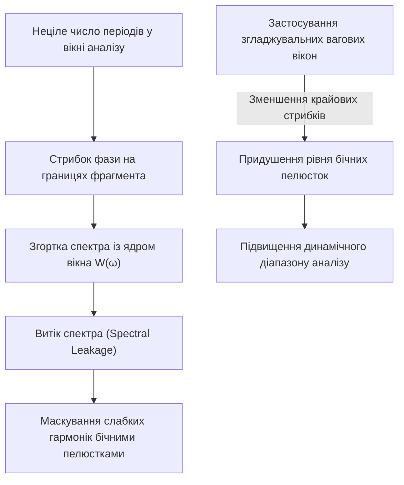

# ТЕМА 3. СПЕКТРАЛЬНИЙ АНАЛІЗ ДИСКРЕТНИХ СИГНАЛІВ: ДИСКРЕТНЕ ПЕРЕТВОРЕННЯ ФУР'Є, ШВИДКЕ ПЕРЕТВОРЕННЯ ФУР'Є ТА ВІКОННІ ФУНКЦІЇ

---

## 3.1. Перехід від інтегрального перетворення Фур'є до Дискретного перетворення Фур'є (ДПФ / DFT). Пряме та обернене ДПФ (IDFT)

### Основний зміст та теоретичний базис

Спектральний аналіз у частотній області становить математичний фундамент цифрової обробки сигналів, дозволяючи перейти від часового опису процесів до їхнього частотного представлення у вигляді суперпозиції ортогональних гармонічних коливань. Для неперервного аналогового сигналу $s(t)$, що задовольняє умовам абсолютної інтегрованості за Діріхле, класичне пряме інтегральне перетворення Фур'є визначає неперервну спектральну густину $S(\omega)$:

$$S(\omega) = \int_{-\infty}^{\infty} s(t) e^{-j\omega t} \, dt$$

де $s(t)$ — неперервний вхідний сигнал як функція фізичного часу $t$; $\omega = 2\pi f$ — кутова частота в радіанах за секунду ($\text{рад/с}$); $j = \sqrt{-1}$ — уявна одиниця; $S(\omega)$ — комплексна спектральна густина сигналу.

При переході до дискретного часу шляхом заміни неперервного аргументу на послідовність відліків $t = nT$ (де $T$ — період дискретизації, $n \in \mathbb{Z}$), формується дискретне в часі перетворення Фур'є (*Discrete-Time Fourier Transform, DTFT*):

$$S_{\text{DTFT}}(\omega) = \sum_{n=-\infty}^{\infty} s[n] e^{-j\omega n T}$$

де $s[n] = s(nT)$ — дискретна послідовність відліків амплітуди; $\omega T = \hat{\omega}$ — нормована кругова частота, виражена в радіанах на відлік ($\text{рад/відлік}$). Функція $S_{\text{DTFT}}(\omega)$ є неперервною функцією частоти та володіє періодичністю з періодом, що дорівнює кутовій частоті дискретизації $\omega_s = 2\pi / T$. 

Безпосередня апаратна чи програмна реалізація DTFT в обчислювальних мікропроцесорних системах є неможливою, оскільки обчислювач не здатний зберігати нескінченні часові послідовності та оперувати неперервним континуумом частот. Для практичної реалізації спектрального аналізу на кінцевому часовому інтервалі тривалістю $T_{\text{obs}} = N T$ здійснюються дві послідовні математичні процедури: часове віконне обмеження вибірки до скінченної кількості $N$ відліків ($n = 0, 1, \dots, N - 1$) та дискретизація частотної осі в межах одного періоду частоти дискретизації $\omega_s$.

Дискретизація частотної області здійснюється у $N$ рівновіддалених (еквідистантних) точках із кроком по частоті $\Delta\omega = \frac{\omega_s}{N} = \frac{2\pi}{NT}$ або $\Delta f = \frac{1}{NT} = \frac{f_s}{N}$, де $k$-та дискретна частота визначається виразом $\omega_k = k \Delta\omega = \frac{2\pi k}{NT}$ при $k = 0, 1, \dots, N - 1$. Підстановка дискретних частот у формулу DTFT формує вираз **Дискретного перетворення Фур'є (ДПФ)** (в англомовній літературі — *Discrete Fourier Transform, DFT*):

$$X[k] = \sum_{n=0}^{N-1} x[n] e^{-j \frac{2\pi}{N} kn} = \sum_{n=0}^{N-1} x[n] W_N^{kn}, \quad k = 0, 1, \dots, N - 1$$

де $x[n]$ — вхідна послідовність дійсних або комплексних чисел довжиною $N$; $X[k]$ — $k$-й комплексний спектральний відлік (спектральний коефіцієнт гармоніки з частотою $f_k = k \frac{f_s}{N}$); $N$ — розмірність (довжина вибірки) ДПФ; $W_N = e^{-j \frac{2\pi}{N}}$ — фундаментальний комплексний **поворотний множник** (ядро перетворення або *twiddle factor*).

```mermaid
flowchart LR
    A["Неперервний сигнал s(t)<br>Час: t ∈ (-∞, +∞)"] -->|Дискретизація t = nT| B["Дискретний сигнал s[n]<br>Час: n ∈ (-∞, +∞)"]
    B -->|Віконне обмеження| C["Скінченний блок x[n]<br>Довжина: n = 0..N-1"]
    C -->|Пряме ДПФ (DFT)| D["Дискретний спектр X[k]<br>Частота: k = 0..N-1"]
    D -->|Обернене ДПФ (IDFT)| C
```
*Рисунок 3.1 — Етапи математичної редукції неперервного сигналу до скінченної послідовності та взаємозв'язок просторів прямого й оберненого ДПФ*

Відновлення вихідної дискретної послідовності $x[n]$ за її комплексними спектральними коефіцієнтами $X[k]$ здійснюється за допомогою **Оберненого дискретного перетворення Фур'є (ОДПФ)** (*Inverse Discrete Fourier Transform, IDFT*):

$$x[n] = \frac{1}{N} \sum_{k=0}^{N-1} X[k] e^{j \frac{2\pi}{N} kn} = \frac{1}{N} \sum_{k=0}^{N-1} X[k] W_N^{-kn}, \quad n = 0, 1, \dots, N - 1$$

де множник $\frac{1}{N}$ забезпечує збереження енергетичного нормування амплітуд сигналів у часовій області. Формула ОДПФ відрізняється від прямого ДПФ виключно знаком у показнику комплексної експоненти та наявністю нормуючого масштабуючого коефіцієнта перед сумою.

В алгебраїчній формі алгоритм ДПФ подається у вигляді матричного векторного добутку:

$$\mathbf{X} = \mathbf{W}_N \mathbf{x}$$

де $\mathbf{x} = [x[0], x[1], \dots, x[N-1]]^T$ — вектор-стовпець вхідних відліків сигналу розмірності $N \times 1$; $\mathbf{X} = [X[0], X[1], \dots, X[N-1]]^T$ — вектор-стовпець комплексних спектральних відліків розмірності $N \times 1$; $\mathbf{W}_N$ — симетрична унітарна матриця перетворення Фур'є розмірності $N \times N$, елементи якої визначаються ступенями поворотного множника:

$$\mathbf{W}_N = \begin{bmatrix} 
W_N^0 & W_N^0 & W_N^0 & \dots & W_N^0 \\ 
W_N^0 & W_N^1 & W_N^2 & \dots & W_N^{N-1} \\ 
W_N^0 & W_N^2 & W_N^4 & \dots & W_N^{2(N-1)} \\ 
\vdots & \vdots & \vdots & \ddots & \vdots \\ 
W_N^0 & W_N^{N-1} & W_N^{2(N-1)} & \dots & W_N^{(N-1)(N-1)} 
\end{bmatrix}$$

Матриця $\mathbf{W}_N$ володіє ортогональністю рядків і стовпців, завдяки чому обернена матриця обчислюється через ермітове спряження: $\mathbf{W}_N^{-1} = \frac{1}{N} \mathbf{W}_N^H = \frac{1}{N} (\mathbf{W}_N^*)^T$.

---

## 3.2. Властивості ДПФ: лінійність, циклічний зсув, спектральна симетрія для дійсних сигналів, кругова згортка, енергетична рівність Парсеваля

### Основний зміст та теоретичний базис

Дискретне перетворення Фур'є володіє комплексом фундаментальних математичних властивостей, які базуються на періодичності дискретного базису $W_N^{kn} = W_N^{(k \pm N)n} = W_N^{k(n \pm N)}$ і визначають закономірності обробки сигналів у спектральній області:

1. **Лінійність:** Якщо дві числові послідовності $x_1[n]$ та $x_2[n]$ мають ДПФ-спектри $X_1[k]$ та $X_2[k]$ відповідно, то спектр їхньої довільної лінійної комбінації з комплексними або дійсними коефіцієнтами $\alpha$ та $\beta$ дорівнює аналогічній лінійній комбінації їхніх спектрів:
   $$\text{DFT}\{\alpha x_1[n] + \beta x_2[n]\} = \alpha X_1[k] + \beta X_2[k]$$

2. **Циклічний (круговий) зсув у часі:** Зсув послідовності $x[n]$ уздовж осі часу на $n_0$ відліків у рамках періоду $N$ (де індекс розраховується за модулем $N$, тобто $x[(n - n_0) \bmod N]$) відповідає множенню вихідного спектра на лінійний фазовий множник:
   $$\text{DFT}\{x[(n - n_0) \bmod N]\} = X[k] e^{-j \frac{2\pi}{N} k n_0} = X[k] W_N^{k n_0}$$
   Амплітудний спектр при цьому залишається інваріантним ($|X_{\text{shift}}[k]| = |X[k]|$), а фазовий спектр отримує лінійний додатковий набіг фази $\Delta\varphi_k = - \frac{2\pi}{N} k n_0$.

3. **Циклічний зсув у частотній області (модуляція):** Множення часового сигналу на комплексну експоненту $W_N^{-l n} = e^{j \frac{2\pi}{N} l n}$ еквівалентне круговому зсуву його дискретного спектра на $l$ позицій:
   $$\text{DFT}\{x[n] e^{j \frac{2\pi}{N} l n}\} = X[(k - l) \bmod N]$$

4. **Спектральна комплексна ермітова симетрія для дійсних сигналів:** Якщо вхідний сигнал є суто дійсною функцією часу ($x[n] \in \mathbb{R}$), то його спектральні відліки, розташовані симетрично відносно половини розмірності перетворення $N/2$ (частоти Найквіста), утворюють комплексно-спряжені пари:
   $$X[N - k] = X^*[k], \quad k = 1, 2, \dots, \frac{N}{2} - 1$$
   З даної властивості випливає, що модуль спектра (амплітудний спектр) володіє парною симетрією, а аргумент (фазовий спектр) — непарною симетрією відносно точки $N/2$:
   $$|X[N - k]| = |X[k]|, \quad \arg\{X[N - k]\} = -\arg\{X[k]\}$$
   Нульовий спектральний відлік $X[0] = \sum_{n=0}^{N-1} x[n]$ завжди є суто дійсним числом, що характеризує постійну складову сигналу. Якщо розмірність $N$ є парним числом, відлік на частоті Найквіста $X[N/2] = \sum_{n=0}^{N-1} x[n] (-1)^n$ також набуває виключно дійсного значення.

5. **Теорема про кругову згортку:** Поелементному добутку двох ДПФ-спектрів $Y[k] = X_1[k] \cdot X_2[k]$ у часовій області строго відповідає кругова (циклічна) згортка вихідних послідовностей:
   $$y_c[n] = \text{IDFT}\{X_1[k] \cdot X_2[k]\} = \sum_{m=0}^{N-1} x_1[m] x_2[(n - m) \bmod N]$$

6. **Енергетична теорема Парсеваля для дискретних процесів:** Повна енергія сигналу в часовій області строго дорівнює сумарній енергії його дискретних спектральних гармонік, масштабованій коефіцієнтом $1/N$:
   $$\sum_{n=0}^{N-1} |x[n]|^2 = \frac{1}{N} \sum_{k=0}^{N-1} |X[k]|^2$$
   Вираз встановлює еквівалентність розрахунку середньої потужності та енергії процесу як у часовому, так і у спектральному просторі.

| Властивість | Часова область $x[n]$ | Спектральна область $X[k] = \text{DFT}\{x[n]\}$ |
| :--- | :--- | :--- |
| **Лінійність** | $\alpha x_1[n] + \beta x_2[n]$ | $\alpha X_1[k] + \beta X_2[k]$ |
| **Круговий зсув за часом** | $x[(n - n_0) \bmod N]$ | $X[k] W_N^{k n_0} = X[k] e^{-j \frac{2\pi}{N} k n_0}$ |
| **Круговий зсув за частотою** | $x[n] W_N^{-l n} = x[n] e^{j \frac{2\pi}{N} l n}$ | $X[(k - l) \bmod N]$ |
| **Комплексне спряження** | $x^*[n]$ | $X^*[(-k) \bmod N] = X^*[N - k]$ |
| **Ермітова симетрія ($x[n] \in \mathbb{R}$)** | $x[n] = x^*[n]$ | $X[k] = X^*[N - k], \; \|X[k]\| = \|X[N - k]\|$ |
| **Кругова згортка** | $x_1[n] \circledast x_2[n]$ | $X_1[k] \cdot X_2[k]$ |
| **Поелементний добуток** | $x_1[n] \cdot x_2[n]$ | $\frac{1}{N} [X_1[k] \circledast X_2[k]]$ |
| **Рівність Парсеваля** | $\sum_{n=0}^{N-1} \|x[n]\|^2$ | $\frac{1}{N} \sum_{k=0}^{N-1} \|X[k]\|^2$ |

---

## 3.3. Алгоритми швидкого перетворення Фур'є (ШПФ / FFT) за основою 2 з проріджуванням у часі (DIT) та частоті (DIF). Базова операція «метелик». Оцінка обчислювальної складності

### Основний зміст та теоретичний базис

Пряме обчислення спектральних коефіцієнтів за формулою ДПФ вимагає виконання для кожного із $N$ відліків суми $N$ комплексних множень та $(N-1)$ комплексних додавань, що сумарно обумовлює квадратичну обчислювальну складність алгоритму:

$$C_{\text{mult}} = N^2, \quad C_{\text{add}} = N(N - 1) \approx N^2 \implies \mathcal{O}(N^2)$$

При великих масивах даних ($N \ge 1024$) прямий розрахунок створює неприпустиме навантаження на процесорні вузли. Кардинальне прискорення розрахунку досягається за допомогою **алгоритмів швидкого перетворення Фур'є (ШПФ)** (*Fast Fourier Transform, FFT*), розроблених Кулі та Тьюкі, які базуються на парадигмі «розділяй і володарюй» (*divide and conquer*). У разі, коли довжина послідовності є цілим ступенем двійки ($N = 2^\nu$, де $\nu = \log_2 N \in \mathbb{Z}$), застосовують алгоритми з основою 2 (*Radix-2 FFT*).

У класичному алгоритмі **ШПФ із проріджуванням у часі (*Decimation-in-Time, DIT FFT*)** вхідна $N$-точкова послідовність $x[n]$ на кожному ітераційному кроці розділяється на дві підпослідовності довжиною $N/2$: парну $x_{e}[m] = x[2m]$ та непарну $x_{o}[m] = x[2m + 1]$, де $m = 0, 1, \dots, N/2 - 1$. 

Вираз прямого ДПФ трансформується шляхом групування доданків:

$$X[k] = \sum_{m=0}^{N/2-1} x[2m] e^{-j\frac{2\pi}{N} k(2m)} + \sum_{m=0}^{N/2-1} x[2m+1] e^{-j\frac{2\pi}{N} k(2m+1)}$$

Враховуючи властивість поворотних множників $W_N^{2mk} = e^{-j\frac{2\pi}{N} 2mk} = e^{-j\frac{2\pi}{N/2} mk} = W_{N/2}^{mk}$ та виносячи спільний множник $W_N^k$ за межі другої суми, отримуємо декомпозицію $N$-точкового ДПФ на два $(N/2)$-точкових ДПФ:

$$X[k] = \sum_{m=0}^{N/2-1} x_{e}[m] W_{N/2}^{mk} + W_N^k \sum_{m=0}^{N/2-1} x_{o}[m] W_{N/2}^{mk} = X_e[k] + W_N^k X_o[k]$$

де $X_e[k]$ — $(N/2)$-точкове ДПФ парної вибірки; $X_o[k]$ — $(N/2)$-точкове ДПФ непарної вибірки.

Оскільки спектри $X_e[k]$ та $X_o[k]$ є періодичними з періодом $N/2$, для обчислення другої половини спектра ($k = N/2, \dots, N - 1$) використовується властивість антисиметрії поворотного множника $W_N^{k + N/2} = W_N^k \cdot W_N^{N/2} = W_N^k \cdot e^{-j\pi} = -W_N^k$:

$$\begin{cases} 
X[k] = X_e[k] + W_N^k X_o[k] \\ 
X\left[k + \frac{N}{2}\right] = X_e[k] - W_N^k X_o[k] 
\end{cases}, \quad k = 0, 1, \dots, \frac{N}{2} - 1$$

Пара наведених співвідношень становить базовий обчислювальний елемент ШПФ, відомий як **операція «метелик» (*butterfly operation*)**. Вона приймає два комплексні входи, виконує одне комплексне множення на коефіцієнт $W_N^k$, одне додавання та одне віднімання, генеруючи два вихідні спектральні коефіцієнти.

```mermaid
flowchart LR
    subgraph Butterfly [Базова операція «метелик» Radix-2 DIT]
        A["X_e[k]"] --> C((+)) --> Out1["X[k] = X_e[k] + W_N^k · X_o[k]"]
        B["X_o[k]"] --> M["Поворотний множник × W_N^k"]
        M --> C
        A --> D((+)) --> Out2["X[k + N/2] = X_e[k] - W_N^k · X_o[k]"]
        M -->|× (-1)| D
    end
```
*Рисунок 3.2 — Структурна схема базового обчислювального модуля «метелик» алгоритму швидкого перетворення Фур'є з проріджуванням у часі*

При реалізації алгоритму DIT вхідні відліки $x[n]$ повинні подаватися не у звичайному порядку, а у двійково-інверсній послідовності (*bit-reversed order*). Порядок формується шляхом запису індексу $n$ у двійковій системі числення розрядністю $\nu = \log_2 N$, дзеркального перевертання бітів та перерахунку отриманого двійкового числа у десятковий еквівалент:

$$\text{BitRev}_3(001_2) = 100_2 \iff 1 \to 4, \quad \text{BitRev}_3(011_2) = 110_2 \iff 3 \to 6$$

Для розмірності $N = 8$ двійково-інверсний порядок перестановки вхідного вектора має вигляд: $\{x[0], x[4], x[2], x[6], x[1], x[5], x[3], x[7]\}$.

```mermaid
flowchart LR
    subgraph FFT_8_Stages [Граф 8-точкового алгоритму DIT ШПФ]
        direction LR
        subgraph In [Вхідні відліки]
            x0["x[0]"]
            x4["x[4]"]
            x2["x[2]"]
            x6["x[6]"]
            x1["x[1]"]
            x5["x[5]"]
            x3["x[3]"]
            x7["x[7]"]
        end
        subgraph Stage1 [Етап 1: 2-точкові ДПФ]
            S1_0["± (W8^0)"]
            S1_1["± (W8^0)"]
            S1_2["± (W8^0)"]
            S1_3["± (W8^0)"]
        end
        subgraph Stage2 [Етап 2: 4-точкові ДПФ]
            S2_0["± (W8^0, W8^2)"]
            S2_1["± (W8^0, W8^2)"]
        end
        subgraph Stage3 [Етап 3: 8-точкове ДПФ]
            S3_0["± (W8^0, W8^1, W8^2, W8^3)"]
        end
        subgraph Out [Вихідний спектр]
            X0["X[0]"]
            X1["X[1]"]
            X2["X[2]"]
            X3["X[3]"]
            X4["X[4]"]
            X5["X[5]"]
            X6["X[6]"]
            X7["X[7]"]
        end
        
        In --> Stage1 --> Stage2 --> Stage3 --> Out
    end
```


*Рисунок 3.3 — Трьохкаскадний спрямований граф обчислення 8-точкового швидкого перетворення Фур'є за схемою Кулі-Тьюкі*

Математично процедура ШПФ для $N = 8$ являє собою **факторизацію повної матриці ДПФ** $\mathbf{W}_8$ у добуток трьох розріджених унітарних матриць підкаскадів $\mathbf{W}_1, \mathbf{W}_2, \mathbf{W}_3$ та матриці двійково-інверсної перестановки $\mathbf{P}_8$:

$$\mathbf{W}_8 = \mathbf{W}_3 \cdot \mathbf{W}_2 \cdot \mathbf{W}_1 \cdot \mathbf{P}_8$$

Матриці каскадів мають високу розрідженість (містять переважно нулі та діагональні блоки з одиницями й поворотними множниками $W_8^k = e^{-j \frac{2\pi}{8} k} = e^{-j \frac{\pi}{4} k}$):

$$\mathbf{P}_8 = \begin{bmatrix}
1 & 0 & 0 & 0 & 0 & 0 & 0 & 0 \\
0 & 0 & 0 & 0 & 1 & 0 & 0 & 0 \\
0 & 0 & 1 & 0 & 0 & 0 & 0 & 0 \\
0 & 0 & 0 & 0 & 0 & 0 & 1 & 0 \\
0 & 1 & 0 & 0 & 0 & 0 & 0 & 0 \\
0 & 0 & 0 & 0 & 0 & 1 & 0 & 0 \\
0 & 0 & 0 & 1 & 0 & 0 & 0 & 0 \\
0 & 0 & 0 & 0 & 0 & 0 & 0 & 1
\end{bmatrix}$$

$$\mathbf{W}_1 = \begin{bmatrix}
1 & 1 & 0 & 0 & 0 & 0 & 0 & 0 \\
1 & -1 & 0 & 0 & 0 & 0 & 0 & 0 \\
0 & 0 & 1 & 1 & 0 & 0 & 0 & 0 \\
0 & 0 & 1 & -1 & 0 & 0 & 0 & 0 \\
0 & 0 & 0 & 0 & 1 & 1 & 0 & 0 \\
0 & 0 & 0 & 0 & 1 & -1 & 0 & 0 \\
0 & 0 & 0 & 0 & 0 & 0 & 1 & 1 \\
0 & 0 & 0 & 0 & 0 & 0 & 1 & -1
\end{bmatrix}$$

$$\mathbf{W}_2 = \begin{bmatrix}
1 & 0 & 1 & 0 & 0 & 0 & 0 & 0 \\
0 & 1 & 0 & W_8^2 & 0 & 0 & 0 & 0 \\
1 & 0 & -1 & 0 & 0 & 0 & 0 & 0 \\
0 & 1 & 0 & -W_8^2 & 0 & 0 & 0 & 0 \\
0 & 0 & 0 & 0 & 1 & 0 & 1 & 0 \\
0 & 0 & 0 & 0 & 0 & 1 & 0 & W_8^2 \\
0 & 0 & 0 & 0 & 1 & 0 & -1 & 0 \\
0 & 0 & 0 & 0 & 0 & 1 & 0 & -W_8^2
\end{bmatrix}$$

$$\mathbf{W}_3 = \begin{bmatrix}
1 & 0 & 0 & 0 & 1 & 0 & 0 & 0 \\
0 & 1 & 0 & 0 & 0 & W_8^1 & 0 & 0 \\
0 & 0 & 1 & 0 & 0 & 0 & W_8^2 & 0 \\
0 & 0 & 0 & 1 & 0 & 0 & 0 & W_8^3 \\
1 & 0 & 0 & 0 & -1 & 0 & 0 & 0 \\
0 & 1 & 0 & 0 & 0 & -W_8^1 & 0 & 0 \\
0 & 0 & 1 & 0 & 0 & 0 & -W_8^2 & 0 \\
0 & 0 & 0 & 1 & 0 & 0 & 0 & -W_8^3
\end{bmatrix}$$

Загальна кількість обчислювальних етапів (каскадів) становить $\nu = \log_2 N$. На кожному етапі паралельно виконується $N/2$ операцій «метелик». Таким чином, сумарна кількість комплексних множень для алгоритму ШПФ зменшується до:

$$M_{\text{FFT}} = \frac{N}{2} \log_2 N$$

Кількість комплексних додавань становить:

$$A_{\text{FFT}} = N \log_2 N$$

Асимптотична обчислювальна складність складає $\mathcal{O}(N \log_2 N)$. Коефіцієнт прискорення розрахунків порівняно з прямим ДПФ зростає логарифмічно:

$$\xi = \frac{N^2}{\frac{N}{2} \log_2 N} = \frac{2N}{\log_2 N}$$

| Розмірність $N$ | Множення ДПФ ($N^2$) | Множення ШПФ ($\frac{N}{2} \log_2 N$) | Теоретичний виграш у швидкості $\xi$ |
| :---: | :---: | :---: | :---: |
| **8** | 64 | 12 | 5.33 |
| **64** | 4 096 | 192 | 21.33 |
| **256** | 65 536 | 1 024 | 64.00 |
| **1024** | 1 048 576 | 5 120 | 204.80 |
| **4096** | 16 777 216 | 24 576 | 682.67 |

В алгоритмі **ШПФ із проріджуванням за частотою (*Decimation-in-Frequency, DIF FFT*)** розбиття на підпрограми здійснюється у вихідному спектрі: вхідна послідовність подається у природному порядку і ділиться на першу та другу половини, а на виході спектральні відліки формуються у двійково-інверсній послідовності. Обчислювальна складність алгоритмів DIT та DIF є абсолютно однаковою.

---

## 3.4. Ефект витоку спектра (spectral leakage). Вагові вікна (Хеммінга, Ханна, Блекмана, прямокутне) та їх характеристики

### Основний зміст та теоретичний базис

При застосуванні ДПФ до реальних сигналів виконується неявне теоретичне припущення про те, що аналізований скінченний фрагмент довжиною $N$ відліків періодично повторюється в часі від $-\infty$ до $+\infty$. Якщо тривалість спостереження $T_{\text{obs}} = NT$ містить строго ціле число періодів $K$ кожної з гармонік сигналу (тобто частота гармоніки $f_0 = K \Delta f = K \frac{f_s}{N}$ точно потрапляє в центр одного з частотних бінів ДПФ), періодичне продовження залишається гладким і неперервним, а вся спектральна енергія зосереджується в єдиному біні $k = K$.

Якщо ж гармонійна складова має довільну частоту і на інтервалі $NT$ укладається неціле число періодів, на межах вікна аналізу виникає штучний стрибок першого роду (розрив фази). Математично операція виділення фрагмента сигналу є множенням нескінченного процесу $s[n]$ на прямокутну вагову функцію $w[n]$:

$$x[n] = s[n] \cdot w[n], \quad w[n] = \begin{cases} 1, & 0 \le n \le N - 1 \\ 0, & \text{в інших випадках} \end{cases}$$

Множенню в часовій області відповідає згортка істинного лінійчастого спектра сигналу зі спектральною характеристикою прямокутного вікна $W(\omega)$, що описується ядром Діріхле:

$$W(\omega) = e^{-j\omega \frac{N-1}{2}} \frac{\sin\left(\frac{\omega N}{2}\right)}{\sin\left(\frac{\omega}{2}\right)}$$

Оскільки функція ядра Діріхле має широкі бічні пелюстки, що повільно спадають за законом $1/\omega$, енергія гармоніки «розтікається» по всьому частотному діапазону ДПФ. Цей паразитний феномен називається **витоком спектра (*spectral leakage*)**. Витік спектра знижує амплітудну точність визначення основних частот та маскує слабкі спектральні гармоніки потужними бічними пелюстками сусідніх сильних компонентів.


*Рисунок 3.4 — Причинно-наслідковий ланцюг виникнення витоку спектра та механізм його мінімізації за допомогою віконного зважування*

Для кардинального придушення витоку спектра застосовують спеціальні **вагові вікна (*window functions*)**, які плавно зменшують значення відліків сигналу на краях інтервалу аналізу до нуля, мінімізуючи амплітуду граничного розриву. 

Основними математичними моделями згладжувальних вікон є:

1. **Вікно Ханна (Hanning window):** описується косинусоїдальною функцією, що плавно спадає до нуля на краях:
   $$w[n] = 0.5 - 0.5 \cos\left(\frac{2\pi n}{N - 1}\right) = \sin^2\left(\frac{\pi n}{N - 1}\right), \quad 0 \le n \le N - 1$$

2. **Вікно Хеммінга (Hamming window):** модифіковане косинусоїдальне вікно з ненульовим піднятим п'єдесталом, коефіцієнти якого оптимізовані для максимального придушення першої бічної пелюстки:
   $$w[n] = 0.54 - 0.46 \cos\left(\frac{2\pi n}{N - 1}\right), \quad 0 \le n \le N - 1$$

3. **Вікно Блекмана (Blackman window):** трьохгармонійна вагова функція з високим рівнем селективності та глибоким придушенням позасмугових паразитних компонентів:
   $$w[n] = 0.42 - 0.5 \cos\left(\frac{2\pi n}{N - 1}\right) + 0.08 \cos\left(\frac{4\pi n}{N - 1}\right), \quad 0 \le n \le N - 1$$

Вибір типу вагового вікна є інженерним компромісом між двома суперечливими критеріями: **частотною роздільною здатністю** (яка визначається шириною головної пелюстки спектрального вікна) та **динамічним діапазоном виявлення слабких сигналів** (який визначається рівнем придушення максимальної бічної пелюстки).

| Тип вагового вікна | Ширина головної пелюстки $\Delta f_{-3\text{dB}}$ | Рівень максимальної бічної пелюстки (дБ) | Швидкість спаду бічних пелюсток (дБ/октава) | Сфера інженерного застосування |
| :--- | :--- | :--- | :--- | :--- |
| **Прямокутне (Rectangular)** | $0.89 \cdot \frac{f_s}{N}$ | **$-13.3\text{ дБ}$** | $-6\text{ дБ/окт}$ | Сигнали із суворо кратними періодами, вимірювання перехідних імпульсів |
| **Ханна (Hann)** | $1.20 \cdot \frac{f_s}{N}$ | **$-31.5\text{ дБ}$** | $-18\text{ дБ/окт}$ | Загальний спектральний аналіз, мовні та музичні сигнали |
| **Хеммінга (Hamming)** | $1.30 \cdot \frac{f_s}{N}$ | **$-42.7\text{ дБ}$** | $-6\text{ дБ/окт}$ | Вузькосмуговий гармонічний аналіз, синтез цифрових КІХ-фільтрів |
| **Блекмана (Blackman)** | $1.68 \cdot \frac{f_s}{N}$ | **$-58.1\text{ дБ}$** | $-18\text{ дБ/окт}$ | Виявлення слабких гармонік на фоні потужних завад, віброакустика |

З аналізу таблиці видно, що прямокутне вікно забезпечує найвищу частотну роздільну здатність завдяки найвужчій головній пелюстці, проте володіє неприпустимо високим рівнем бічних пелюсток ($-13.3\text{ дБ}$), що призводить до сильного витоку спектра. Застосування вікна Блекмана розширює головну пелюстку майже вдвічі, погіршуючи роздільну здатність близьких частот, проте забезпечує глибоке придушення бічного витоку до рівня $-58.1\text{ дБ}$, гарантуючи високу вибірковість при аналізі багатокомпонентних спектрів складних вимірювальних сигналів.

---

### Питання для самоперевірки та аналітичного осмислення

1. Опишіть аналітичний зв'язок між неперервним інтегральним перетворенням Фур'є, дискретним у часі перетворенням Фур'є (DTFT) та Дискретним перетворенням Фур'є (ДПФ). Яким чином дискретизація частотної осі в ДПФ накладає вимогу періодичності на часовий сигнал?
2. Доведіть властивість ермітової комплексної симетрії ДПФ для дійсного сигналу $x[n] \in \mathbb{R}$. Чому інформаційна ємність спектра дійсного сигналу обмежена відліками в діапазоні від $k = 0$ до $k = N/2$?
3. Поясніть математичний механізм факторизації матриці ДПФ при переході від алгоритму прямого обчислення складності $\mathcal{O}(N^2)$ до алгоритму швидкого перетворення Фур'є Кулі-Тьюкі зі складністю $\mathcal{O}(N \log_2 N)$.
4. У чому полягає фізичний та алгоритмічний зміст базової операції «метелик» у структурі Radix-2 DIT FFT, і яку роль відіграє двійково-інверсна перестановка вхідних відліків?
5. Яка фізична причина виникнення ефекту витоку спектра (spectral leakage) при аналізі сигналів скінченної тривалості, і як цей ефект інтерпретується в термінах згортки з ядром Діріхле у частотній області?
6. Проведіть порівняльний аналіз прямокутного вікна та вікон Ханна, Хеммінга, Блекмана. За якими критеріями обирається тип віконної функції при вирішенні задач прецизійного вимірювання амплітуди гармоніки та розділення двох близько розташованих частот?