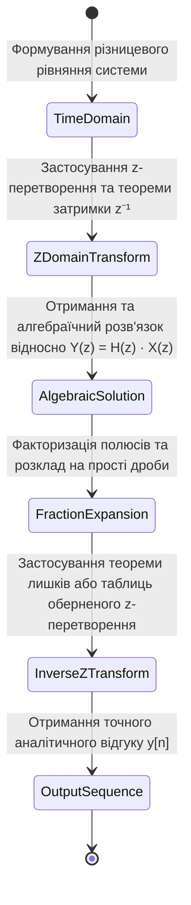
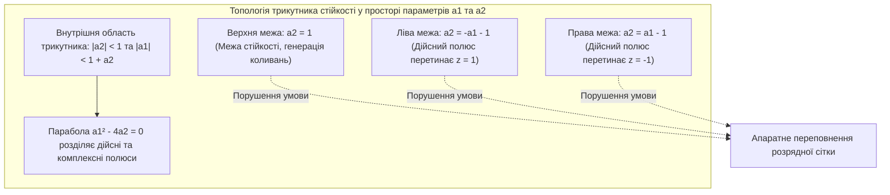
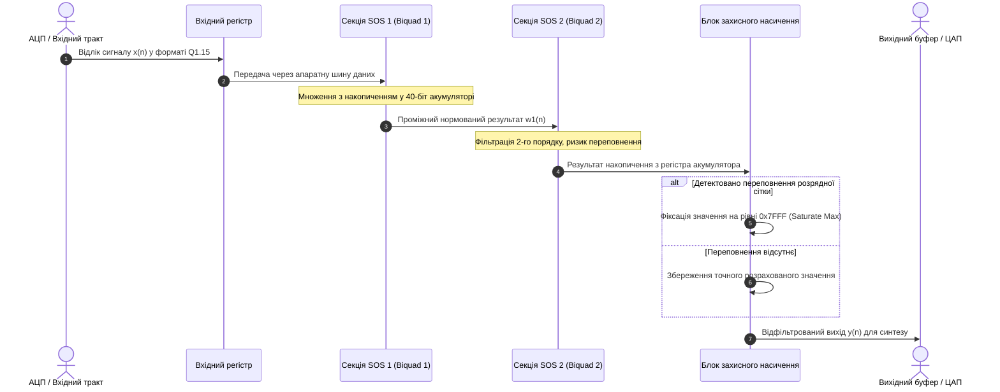
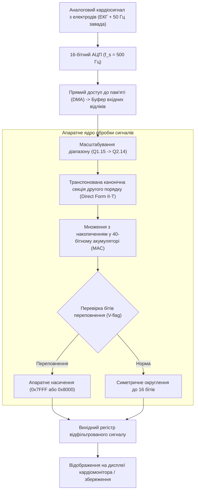

# Тема 4. Z-перетворення та проєктування цифрових фільтрів

## Мета лекції
Формування у здобувачів вищої освіти системного комплексу фундаментальних теоретичних знань і прикладних інженерних компетентностей щодо застосування апарату $z$-перетворення для спектрально-операційного опису, топологічного моделювання та аналізу стійкості лінійних стаціонарних дискретних систем, а також опанування математичних засад, граничних обмежень та алгоритмічних процедур параметричного синтезу цифрових фільтрів зі скінченною та нескінченною імпульсними характеристиками для вирішення завдань обробки сигналів і багатовимірних масивів даних у сучасних комп'ютерно-інтегрованих та вимірювальних комплексах.

## Очікувані результати навчання
1. **Знання та розуміння.** Здобувачі повинні демонструвати поглиблене розуміння математичного апарату прямого та оберненого $z$-перетворення, топології областей збіжності, взаємозв'язку $z$-площини з комплексною площиною Лапласа та дискретним перетворенням Фур'є, а також орієнтуватися у внутрішніх механізмах формування амплітудно-частотних і фазочастотних характеристик за діаграмами нулів і полюсів.
2. **Застосування.** Здобувачі набудуть здатності трансформувати різницеві рівняння у передавальні функції, розраховувати імпульсні та частотні характеристики дискретних систем, виконувати аналітичний синтез КІХ-фільтрів з лінійною фазою за допомогою віконних функцій і проєктувати рекурсивні НІХ-фільтри на основі аналогових прототипів за методом білінійного перетворення з попередньою деформацією частотної шкали.
3. **Аналіз.** Здобувачі навчаться детально досліджувати стійкість дискретних динамічних систем за розташуванням полюсів відносно одиничного кола, здійснювати порівняльний аналіз прямої, канонічної та каскадної форм реалізації систем, а також виявляти критичні деградації характеристик, зумовлені ефектами скінченної розрядності обчислювача та квантування коефіцієнтів.
4. **Оцінювання та синтез.** Здобувачі зможуть обґрунтовано обирати оптимальний клас і топологію цифрового фільтра під специфічні інженерні вимоги щодо крутизни зрізу, фазових спотворень і ресурсоємності, проєктувати багатоланкові структури на базі біквадратних секцій та оптимізувати обчислювальні алгоритми фільтрації для їх безпомилкової імплементації в спеціалізованих цифрових сигнальних процесорах реального часу.

---

## Детальний покроковий план лекції

### 1. Теоретико-концептуальний базис. Математичний апарат z-перетворення та операційний опис дискретних систем
* 1.1. Формальне визначення прямого та оберненого $z$-перетворення, властивості комплексного ряду Лорана та геометрична класифікація конфігурацій областей збіжності (ROC).
* 1.2. Конформне відображення $s$-площини Лапласа в $z$-площину, взаємозв'язок $z$-перетворення з дискретним у часі перетворенням Фур'є (DTFT) та дискретним перетворенням Фур'є (ДПФ).
* 1.3. Фундаментальні операційні властивості $z$-перетворення: теореми лінійності, часового зсуву, згортки послідовностей та комплексного диференціювання.
* 1.4. Дробово-раціональна передавальна функція $H(z)$ лінійної стаціонарної дискретної системи, факторизація нулів і полюсів та геометричний метод розрахунку частотних характеристик уздовж одиничного кола.

### 2. Методологія та аналіз граничних умов. Критерії стійкості та параметричний синтез цифрових фільтрів
* 2.1. Алгебраїчний та геометричний критерії BIBO-стійкості дискретних систем, топологія трикутника стійкості для рекурсивних ланок другого порядку.
* 2.2. Теорія цифрових фільтрів зі скінченною імпульсною характеристикою (КІХ): безумовна стійкість, чотири типи лінійно-фазових систем та аналітичний віконний синтез.
* 2.3. Проєктування фільтрів із нескінченною імпульсною характеристикою (НІХ) методом білінійного перетворення Тастіна та процедура попереднього викривлення частот (frequency pre-warping).
* 2.4. Архітектурні форми реалізації цифрових фільтрів, розкладання у каскад біквадратних секцій (SOS) та критичні бар'єри апаратної реалізації: шум квантування, зміщення полюсів у процесорах із фіксованою комою та паразитні граничні цикли.

### 3. Практичний індустріальний / фаховий кейс. Інженерна імплементація та оптимізація фільтрації в реальному часі
**Тема наскрізної задачі.** «Синтез, оптимізація розрядності та каскадна імплементація цифрового режекторного рекурсивного фільтра для придушення мережевої завади 50 Гц у біомедичному сигналі електрокардіограми на сигнальному мікропроцесорі з фіксованою комою»


## 1. Теоретико-концептуальний базис. Математичний апарат z-перетворення та операційний опис дискретних систем

### 1.1. Формальне визначення прямого та оберненого z-перетворення, властивості комплексного ряду Лорана та геометрична класифікація конфігурацій областей збіжності (ROC)

У теорії дискретних сигналів та лінійних стаціонарних динамічних систем операційний аналіз базується на переході від часових послідовностей до їхніх функціональних еквівалентів у комплексній площині. Математичним фундаментом такого переходу виступає **$z$-перетворення**, яке узагальнює дискретне перетворення Фур'є на випадок комплексних частот та забезпечує алгебраїзацію різницевих рівнянь. Формально **пряме двостороннє $z$-перетворення** довільної числової послідовності $x[n]$, визначеної на всій осі дискретного часу $n \in \mathbb{Z}$, задається у вигляді нескінченного степеневого ряду Лорана за від'ємними степенями комплексної змінної $z$:

$$X(z) = \mathcal{Z}\{x[n]\} = \sum_{n=-\infty}^{\infty} x[n] z^{-n}$$

де $x[n]$ позначає дискретний сигнал як числову функцію цілочисельного аргументу часу; $z$ є комплексною змінною, яка у показниковому вигляді записується через модуль та аргумент як $z = r e^{j\omega}$, причому дійсне число $r = |z| \ge 0$ задає радіус на комплексній площині, а $\omega = \arg(z)$ визначає нормовану кругову частоту в радіанах на один часовий відлік; $X(z)$ становить аналітичну функцію комплексного аргументу, яка є спектрально-операторним образом вихідної послідовності.

Для класу каузальних (фізично реалізовних) систем, відгук яких не може передувати збудженню, а самі сигнали задовольняють умову рівності нулю при від'ємних часових індексах ($x[n] = 0$ для всіх $n < 0$), застосовують **одностороннє $z$-перетворення**:

$$X(z) = \mathcal{Z}\{x[n]\} = \sum_{n=0}^{\infty} x[n] z^{-n}$$

Оскільки аналітичний вираз перетворення являє собою степеневий ряд, питання його існування безпосередньо зводиться до проблеми абсолютної збіжності ряду $\sum_{n=-\infty}^{\infty} |x[n]| \cdot |z|^{-n} < \infty$. Топологічна множина точок на комплексній площині $z$, де зазначена умова виконується безперечно, називається **областю збіжності** (Region of Convergence, ROC). Властивості області збіжності прямо визначаються часовою протяжністю та поведінкою послідовності $x[n]$.

```mermaid
flowchart TD
    ClassSig['Часова структура послідовності x(n)'] --> RightSided['Правобічна каузальна послідовність (n ≥ 0)']
    ClassSig --> LeftSided['Лівобічна антикаузальна послідовність (n ≤ 0)']
    ClassSig --> TwoSided['Двобічна нескінченна послідовність (-∞ < n < ∞)']
    ClassSig --> FiniteDur['Фінітна послідовність скінченної тривалості']

    RightSided --> ROC_Right['ROC: Зовнішня частина круга |z| > R_max']
    LeftSided --> ROC_Left['ROC: Внутрішня частина круга |z| < R_min']
    TwoSided --> ROC_Two['ROC: Концентричне кільце R_min < |z| < R_max']
    FiniteDur --> ROC_Finite['ROC: Уся комплексна площина за винятком z=0 або z=∞']

    ROC_Right --> StabilityCheck{'Перевірка стійкості BIBO'}
    ROC_Left --> StabilityCheck
    ROC_Two --> StabilityCheck
    ROC_Finite --> StabilityCheck

    StabilityCheck -->|Коло |z|=1 належить ROC| StableSys['Система абсолютно стійка, DTFT існує']
    StabilityCheck -->|Коло |z|=1 не належить ROC| UnstableSys['Система нестійка, DTFT розбігається']
```

Геометричний аналіз показує, що для правобічних послідовностей область збіжності завжди простягається від кола, радіус якого визначається найбільш віддаленим від початку координат полюсом $R_{\max} = \max_k |p_k|$, назовні до нескінченності. Для лівобічних послідовностей область збіжності лежить усередині кола, радіус якого задається найближчим до нуля полюсом $R_{\min} = \min_k |p_k|$. Двобічні послідовності формують область збіжності у вигляді відкритого кільця між концентричними колами за обов'язкової умови $R_{\min} < R_{\max}$. Якщо вказана нерівність порушується, область збіжності є порожньою множиною, що свідчить про неможливість застосування $z$-перетворення до такого класу сигналів. Варто зазначити, що область збіжності ніколи не містить у собі полюсів функції $X(z)$, оскільки в полюсах сума ряду Лорана набуває нескінченно великих значень.

Відновлення дискретного сигналу за його функціональним $z$-образом здійснюється за допомогою **оберненого $z$-перетворення**, яке формалізується як інтегрування вздовж замкненого контуру в комплексній площині:

$$x[n] = \mathcal{Z}^{-1}\{X(z)\} = \frac{1}{2\pi j} \oint_{C} X(z) z^{n-1} \, dz$$

де $j = \sqrt{-1}$ позначає уявну одиницю; $C$ є замкненим контуром інтегрування, який обходиться у напрямку проти руху годинникової стрілки, повністю локалізується всередині області збіжності $\text{ROC}$ та одночасно охоплює точку початку координат $z = 0$. 

Практичне взяття такого контурного інтеграла аналітично здійснюється на базі класичної теореми Коші про лишки. Згідно з цією теоремою, значення інтеграла вздовж контуру дорівнює сумі лишків підінтегральної функції в усіх ізольованих особливих точках (полюсах), охоплених інтеграційним контуром $C$:

$$x[n] = \sum_{k} \operatorname{Res}\left[ X(z) z^{n-1}, \, p_k \right]$$

де $p_k$ позначає $k$-й полюс підінтегрального виразу, розташований усередині контуру $C$. Поряд із прямим інтегруванням широко використовують метод розкладання дробово-раціональної функції на суму простих дробів з подальшим використанням таблиць пар перетворень, а також формальне ділення многочленів стовпчиком для безпосереднього знаходження відліків $x[n]$ як коефіцієнтів ряду при відповідних степенях $z^{-n}$.

> **ПРАКТИЧНИЙ ЯКІР:** У процесорах цифрової обробки сигналів для радарних комплексів із фазованими антенними решітками при виявленні відбитих імпульсних радіосигналів на тлі пасивних завад використовують розкладання нестійких моделей реверберації в бібічні ряди Лорана, де точна фіксація меж області збіжності дозволяє відокремити сигнал цілі від розбіжних шумових процесів середовища.

---

### 1.2. Конформне відображення s-площини Лапласа в z-площину, взаємозв'язок z-перетворення з дискретним у часі перетворенням Фур'є (DTFT) та дискретним перетворенням Фур'є (ДПФ)

Генетичний зв'язок між класичною теорією неперервних систем і дискретною обробкою базується на математичному моделюванні процесу ідеальної дискретизації неперервного сигналу $x_a(t)$ за допомогою решітчастої дельта-функції Дірака. Якщо утворений модульований сигнал записати як $x_\delta(t) = \sum_{n=-\infty}^{\infty} x_a(nT) \delta(t - nT)$, де $T$ позначає період дискретизації в секундах, то його інтегральне перетворення Лапласа набуде структури:

$$X_\delta(s) = \mathcal{L}\{x_\delta(t)\} = \int_{0}^{\infty} \left[ \sum_{n=0}^{\infty} x_a(nT) \delta(t - nT) \right] e^{-st} \, dt = \sum_{n=0}^{\infty} x_a(nT) e^{-snT}$$

де $s = \sigma + j\Omega$ позначає комплексну змінну перетворення Лапласа; $\sigma = \operatorname{Re}(s)$ відповідає дійсному коефіцієнту згасання або наростання коливань; $\Omega = \operatorname{Im}(s)$ визначає неперервну кутову частоту в радіанах за секунду.

Порівняння виразу для $X_\delta(s)$ з формулою одностороннього $z$-перетворення доводить, що дискретне перетворення повністю збігається з перетворенням Лапласа модульованого імпульсного сигналу за умови введення конформного відображення комплексної площини:

$$z = e^{sT} = e^{(\sigma + j\Omega)T} = e^{\sigma T} \cdot e^{j\Omega T}$$

Дане нелінійне співвідношення трансформує неперервний простір $s$ у дискретний простір $z$. Геометричний зміст відображення описується трьома строгими правилами, які мають вирішальне значення для збереження динамічних властивостей систем при переході від аналогових прототипів до цифрових реалізацій:

1. Дійсна вісь нульового згасання в $s$-площині, яка збігається з уявною віссю $\sigma = 0$, конформно переходить у коло одиничного радіуса $|z| = e^{0 \cdot T} = 1$ у комплексній $z$-площині.
2. Ліва відкрита півплощина Лапласа, для якої виконується умова стійкості $\sigma < 0$, відображається у відкритий круг одиничного радіуса $|z| < 1$, що лежить усередині одиничного кола.
3. Права півплощина нестійкості $\sigma > 0$ відображається в топологічну область зовнішнього простору комплексної площини $|z| > 1$, що розташована за межами одиничного кола.

Оскільки комплексна експонента є періодичною функцією за уявною віссю з періодом $j\Omega_s = j\frac{2\pi}{T}$, смуга шириною $\Omega_s$ в $s$-площині повністю покриває всю площину $z$. Будь-яка інша горизонтальна смуга виду $\left(k - \frac{1}{2}\right)\Omega_s \le \Omega < \left(k + \frac{1}{2}\right)\Omega_s$ накладається на ту саму область у $z$-площині, що є математичним джерелом виникнення еліасингу (інтерференції спектральних компонентів) при дискретизації сигналів без належної попередньої фільтрації.

Взаємозв'язок між $z$-перетворенням та **дискретним у часі перетворенням Фур'є** (Discrete-Time Fourier Transform, DTFT) формулюється як граничний випадок обчислення функції $X(z)$ безпосередньо на границі стійкості, тобто на одиничному колі, де радіус $r = |z| = 1$, а комплексна змінна вироджується в гармонічний множник $z = e^{j\omega}$:

$$X(e^{j\omega}) = \left. X(z) \right|_{z = e^{j\omega}} = \sum_{n=-\infty}^{\infty} x[n] e^{-j\omega n}$$

Для існування спектральної щільності DTFT абсолютно необхідно, щоб одиничне коло повністю входило в область збіжності $\text{ROC}$. Якщо область збіжності сигналу не містить одиничного кола, то ряд DTFT розбігається, і спектральний опис у базисі Фур'є стає неможливим без залучення апарату узагальнених функцій.

У практичних обчислювальних алгоритмах функція $X(e^{j\omega})$ дискретизується за частотою. Якщо взяти $N$ рівновіддалених відліків вздовж одиничного кола в точках з координатами $z_k = e^{j\frac{2\pi}{N}k}$ при $k = 0, 1, \dots, N-1$, то $z$-перетворення трансформується у **дискретне перетворення Фур'є** (ДПФ):

$$X[k] = \left. X(z) \right|_{z = e^{j\frac{2\pi}{N}k}} = \sum_{n=0}^{N-1} x[n] e^{-j\frac{2\pi}{N}kn}$$

Отже, ДПФ є сукупністю дискретних просторових точок перетворення $X(z)$, зафіксованих на контурі одиничного кола, що утворює замкнену обчислювальну алгебру скінченних циклічних згорток.

> **ТИПОВА ПОМИЛКА:** Ототожнення факту розрахунку передавальної функції системи на одиничному колі з доведенням її стійкості. Студенти часто вважають, що якщо формальна заміна $z = e^{j\omega}$ дає скінченний алгебраїчний вираз для частотного відгуку $H(e^{j\omega})$, то система автоматично є стійкою. Насправді, якщо система містить хоча б один полюс поза межами одиничного кола ($|p_k| > 1$), операція підстановки $z = e^{j\omega}$ є математично невалідною, оскільки одиничне коло лежить за межами області збіжності, а відповідна система в реальності втрачає стійкість і фізично генерує нескінченний розбіжний сигнал.

---

### 1.3. Фундаментальні операційні властивості z-перетворення: теореми лінійності, часового зсуву, згортки послідовностей та комплексного диференціювання

Аналітична цінність $z$-перетворення полягає у наявності розвиненого операційного числення, яке дозволяє виконувати складні часові маніпуляції над дискретними сигналами за допомогою простих алгебраїчних перетворень над їхніми $z$-образами. 

Першою ключовою властивістю є **лінійність**, яка випливає з лінійності самої операції підсумовування ряду. Якщо існують перетворення двох послідовностей $x_1[n] \ \substack{\mathcal{Z} \\ \longleftrightarrow} \ X_1(z)$ з областю збіжності $\text{ROC}_1$ та $x_2[n] \ \substack{\mathcal{Z} \\ \longleftrightarrow} \ X_2(z)$ з областю збіжності $\text{ROC}_2$, то для довільних комплексних сталих $\alpha$ і $\beta$ виконується співвідношення:

$$\mathcal{Z}\{\alpha x_1[n] + \beta x_2[n]\} = \alpha X_1(z) + \beta X_2(z)$$

причому результуюча область збіжності містить у собі перетин вихідних областей: $\text{ROC} \supseteq \text{ROC}_1 \cap \text{ROC}_2$.

Другою фундаментальною властивістю є **теорема про часовий зсув (затримку)**, яка встановлює взаємозв'язок між просторовим зсувом відліків у часовій області та множенням на степінь змінної $z$:

$$\mathcal{Z}\{x[n - n_0]\} = z^{-n_0} X(z)$$

де $n_0$ є цілим додатним (для затримки) або від'ємним (для випередження) числом тактів. У графічних блок-схемах цифрових систем елементарна затримка на один машинний такт позначається функціональним блоком $z^{-1}$, що є фізичним еквівалентом регістра пам'яті. Область збіжності при часовому зсуві залишається незмінною, за винятком можливого додавання або виключення точок $z = 0$ чи $z = \infty$.

Третьою фундаментальною операцією є **дискретна лінійна згортка**, яка описує проходження довільного вхідного сигналу $x[n]$ через лінійну стаціонарну дискретну систему з імпульсною характеристикою $h[n]$. У часовій області реакція системи $y[n]$ формується як:

$$y[n] = x[n] * h[n] = \sum_{k=-\infty}^{\infty} x[k] h[n - k]$$

Застосування $z$-перетворення до операції згортки перетворює нескінченну суму добутків у часі на елементарний алгебраїчний добуток двох функцій у $z$-області:

$$Y(z) = \mathcal{Z}\{x[n] * h[n]\} = X(z) \cdot H(z)$$

де $H(z) = \mathcal{Z}\{h[n]\}$ є системною передавальною функцією цифрового пристрою. Область збіжності вихідного сигналу містить спільну частину $\text{ROC}_X \cap \text{ROC}_H$. Дана властивість усуває необхідність безпосереднього розрахунку багаторазових сум зсунутих відліків при аналізі багатокаскадних ланцюгів.

Властивість **комплексного диференціювання** (множення послідовності на лінійний часовий тренд $n$) зв'язує похідну за комплексною змінною з часовим зважуванням:

$$\mathcal{Z}\{n \cdot x[n]\} = -z \frac{d X(z)}{dz}$$

з незмінною областю збіжності $\text{ROC}$. Ця теорема застосовується при знаходженні відгуків систем на лінійно зростаючі впливи та при розрахунку кратних полюсів передавальних функцій.



Описана послідовність станів відображає системний життєвий цикл математичного моделювання дискретних пристроїв, що забезпечує перехід від складних рекурентних співвідношень до прямого аналітичного визначення відгуку системи.

> **ПРАКТИЧНИЙ ЯКІР:** В апаратних архітектурах цифрових сигнальних процесорів (наприклад, у сімействах ADSP-21489 або STM32H7) реалізація алгоритмів фільтрації згорткою безпосередньо базується на властивості зсуву $z^{-1}$. Циклічні буфери та конвеєрні інструкції з множенням та накопиченням (Multiply-Accumulate, MAC) апаратно транслюють множник $z^{-1}$ у pointer-зсув адреси без переміщення фізичних даних у пам'яті.

---

### 1.4. Дробово-раціональна передавальна функція H(z) лінійної стаціонарної дискретної системи, факторизація нулів і полюсів та геометричний метод розрахунку частотних характеристик уздовж одиничного кола

Довільна лінійна стаціонарна дискретна система із зосередженими параметрами описується лінійним різницевим рівнянням зі сталими дійсними коефіцієнтами, яке пов'язує вихідні та вхідні відліки:

$$\sum_{k=0}^{N} a_k y[n - k] = \sum_{m=0}^{M} b_m x[n - m]$$

де $a_k$ є коефіцієнтами зворотного зв'язку (при $a_0 = 1$); $b_m$ визначають коефіцієнти прямої передачі; $N$ визначає порядок системи (кількість ліній затримки у контурі зворотного зв'язку); $M$ визначає кількість ліній затримки у прямому тракті обробки.

Застосовуючи теорему про лінійність та теорему затримки до обох частин цього рівняння за нульових початкових умов, отримуємо алгебраїчний зв'язок операторних функцій:

$$Y(z) \sum_{k=0}^{N} a_k z^{-k} = X(z) \sum_{m=0}^{M} b_m z^{-m}$$

Звідси визначається **передавальна функція** $H(z)$ як інваріантне відношення вихідного сигналу до вхідного:

$$H(z) = \frac{Y(z)}{X(z)} = \frac{\sum_{m=0}^{M} b_m z^{-m}}{\sum_{k=0}^{N} a_k z^{-k}} = \frac{b_0 + b_1 z^{-1} + b_2 z^{-2} + \dots + b_M z^{-M}}{1 + a_1 z^{-1} + a_2 z^{-2} + \dots + a_N z^{-N}}$$

Множенням чисельника і знаменника на $z^{\max(N, M)}$ передавальна функція зводиться до відношення двох алгебраїчних многочленів від додатної змінної $z$. Відповідно до основної теореми алгебри, будь-який многочлен з дійсними або комплексними коефіцієнтами може бути розкладений на лінійні множники над полем комплексних чисел:

$$H(z) = \frac{b_0}{a_0} z^{N-M} \frac{\prod_{m=1}^{M} (z - z_m)}{\prod_{k=1}^{N} (z - p_k)}$$

де $z_m$ позначає **нулі передавальної функції**, тобто корені рівняння $\sum_{m=0}^{M} b_m z^{-m} = 0$, в яких коефіцієнт передачі системи спадає до нуля ($H(z_m) = 0$); $p_k$ визначає **полюси передавальної функції**, тобто корені характеристичного рівняння $\sum_{k=0}^{N} a_k z^{-k} = 0$, в яких передавальна функція прямує до нескінченності ($H(p_k) \to \infty$). Оскільки коефіцієнти різницевого рівняння $a_k$ та $b_m$ для реальних фізичних систем є строго дійсними числами, комплексні нулі та полюси обов'язково з'являються виключно спряженими парами: якщо існує полюс $p_k = \alpha + j\beta$, то обов'язково існує і парний йому полюс $p_k^* = \alpha - j\beta$.

Сукупність нулів і полюсів, нанесена на комплексну площину $z$, утворює так звану **карту (діаграму) нулів і полюсів**. Топологічне розміщення цих особливих точок дозволяє безпосередньо обчислювати амплітудно-частотну характеристику (АЧХ) $|H(e^{j\omega})|$ та фазочастотну характеристику (ФЧХ) $\theta(\omega) = \arg[H(e^{j\omega})]$ системи за допомогою витонченого геометричного методу. Для цього виконують обхід одиничного кола $z = e^{j\omega}$, де значення нормованої частоти $\omega$ змінюється від $0$ (відповідає точці $z = 1 + j0$) через значення $\pi/2$ (точка $z = 0 + j1$) до значення частоти Найквіста $\omega = \pi$ (точка $z = -1 + j0$).

Для кожної обраної поточної точки $e^{j\omega}$ на одиничному колі проводять вектори від усіх нулів $(e^{j\omega} - z_m)$ та від усіх полюсів $(e^{j\omega} - p_k)$. Позначивши довжини цих векторів відповідно через $V_{z,m}(\omega) = |e^{j\omega} - z_m|$ та $V_{p,k}(\omega) = |e^{j\omega} - p_k|$, а їхні фазові кути як $\psi_{z,m}(\omega) = \arg(e^{j\omega} - z_m)$ та $\psi_{p,k}(\omega) = \arg(e^{j\omega} - p_k)$, модуль і аргумент комплексної передавальної функції подають у вигляді:

$$|H(e^{j\omega})| = \left| \frac{b_0}{a_0} \right| \frac{\prod_{m=1}^{M} V_{z,m}(\omega)}{\prod_{k=1}^{N} V_{p,k}(\omega)}$$

$$\theta(\omega) = \arg[H(e^{j\omega})] = (N - M)\omega + \sum_{m=1}^{M} \psi_{z,m}(\omega) - \sum_{k=1}^{N} \psi_{p,k}(\omega)$$

З аналізу наведених геометричних формул випливають практичні закони формування форми частотного відгуку цифрових систем:
*   Якщо точка на одиничному колі $e^{j\omega}$ наближається до нуля $z_m$, вектор $V_{z,m}(\omega)$ скорочується, викликаючи зменшення АЧХ; якщо ж нуль лежить безпосередньо на одиничному колі ($|z_m| = 1$), то на частоті $\omega = \arg(z_m)$ вектор зникає $V_{z,m} = 0$, і значення АЧХ стає строго рівним нулю.
*   Якщо точка $e^{j\omega}$ наближається до полюса $p_k$, вектор знаменника $V_{p,k}(\omega)$ прямує до мінімуму, що зумовлює резонансне зростання АЧХ; чим ближче полюс підходить до одиничного кола зсередини, тим вищим і вужчим стає резонансний сплеск коефіцієнта підсилення системи на відповідній частоті.

У наведеній нижче аналітичній таблиці систематизовано базові класи дискретних операторів та фільтрів за характером розподілу їхніх передавальних функцій у комплексній площині $z$.

| Тип дискретного оператора / системи | Аналітичний вираз передавальної функції $H(z)$ | Топологічна конфігурація нулів і полюсів | Приклад з реальної практики |
| :--- | :--- | :--- | :--- |
| **Елементарний оператор затримки на $k$ тактів** | $H(z) = z^{-k}$ | Полюс порядку $k$ у точці $z = 0$, $k$ нулів у нескінченності $z \to \infty$ | Синхронізація каналів у квадратурних приймачах I/Q-модуляції |
| **Ідеальний цифровий диференціатор** | $H(z) = 1 - z^{-1} = \frac{z - 1}{z}$ | Один нуль на нульовій частоті $z = 1$, один полюс у початку координат $z = 0$ | Виявлення границь та контурів у системах технічного зору |
| **Дискретний інтегратор (суматор з накопиченням)** | $H(z) = \frac{1}{1 - z^{-1}} = \frac{z}{z - 1}$ | Один полюс на межі стійкості $z = 1$, один нуль у початку координат $z = 0$ | Обчислення фазового набігу в контурах фазового автопідстроювання частоти (ФАПЧ) |
| **Режекторний фільтр другого порядку (Notch-фільтр)** | $H(z) = \frac{1 - 2\cos(\omega_0)z^{-1} + z^{-2}}{1 - 2r\cos(\omega_0)z^{-1} + r^2 z^{-2}}$ | Комплексно-спряжені нулі на колі $z_{1,2} = e^{\pm j\omega_0}$, полюси під ними $p_{1,2} = r e^{\pm j\omega_0}$, $r < 1$ | Придушення гармонійної завади мережі живлення 50 Гц у кардіографах |
| **Резонаторний смуговий фільтр другого порядку** | $H(z) = \frac{1 - z^{-2}}{1 - 2r\cos(\omega_0)z^{-1} + r^2 z^{-2}}$ | Нулі на нульовій частоті $z = 1$ та частоті Найквіста $z = -1$, полюси $p_{1,2} = r e^{\pm j\omega_0}$ | Декодування тональних сигналів системи DTMF у телефонії |

> **КОНТРОЛЬНЕ ПИТАННЯ:** Як зміниться поведінка лінійної стаціонарної дискретної системи, якщо один із нулів її передавальної функції вийде за межі одиничного кола ($|z_m| > 1$), за умови, що всі її полюси залишаються всередині одиничного кола ($|p_k| < 1$)?

<details markdown="1">
<summary>Розгорнути аналіз / відповідь</summary>

**Правильний варіант: Система залишиться BIBO-стійкою, її амплітудно-частотна характеристика не зазнає змін форми, проте система перетвориться на немінімально-фазову із суттєвим зростанням групової затримки на окремих частотах.**

1. Стійкість системи за критерієм обмеженого входу — обмеженого виходу (BIBO) визначається виключно положенням полюсів передавальної функції відносно одиничного кола ($|p_k| < 1$). Розташування нулів жодним чином не впливає на збіжність ряду імпульсної характеристики та стійкість системи, тому вихід нуля за межі одиничного кола не порушує стабільності функціонування. Проте такий фільтр переходить із класу мінімально-фазових систем до систем з немінімальною фазою. Будь-який множник $(z - z_m)$ при $|z_m| > 1$ може бути факторизований як добуток мінімально-фазової ланки та фазового коректора (all-pass filter), що залишає амплітудний спектр незмінним, але різко збільшує фазову затримку сигналу.

2. Аналіз дистракторів (чому інші варіанти є хибними на практиці):
   - Твердження про те, що система втрачає BIBO-стійкість, є грубою помилкою, оскільки стійкість регулюється виключно знаменником передавальної функції, тобто полюсами, а не чисельником.
   - Твердження про неможливість фізичної реалізації є хибним, оскільки каузальність порушується лише тоді, коли ступінь полінома чисельника за додатними степенями $z$ перевищує ступінь знаменника, що не залежить від чисельного значення модуля нуля $|z_m|$.
   - Припущення про інверсію АЧХ (перетворення провалу на сплеск) також є невірним, оскільки модуль різниці $|e^{j\omega} - z_m|$ для нуля за межами кола залишається гладкою додатною функцією частоти і продовжує формувати локальне зменшення коефіцієнта передачі.

</details>

---

### Вказівки для самостійного осмислення

1. Дослідіть поведінку двостороннього $z$-перетворення для послідовності $x[n] = a^{|n|}$, розбивши її на суму каузальної та антикаузальної складових частин, та аналітично визначте граничні значення параметра $a$, за яких існує спільна область збіжності у вигляді концентричного кільця.
2. Проаналізуйте процедуру переходу від передавальної функції $H(z)$ дискретної системи другого порядку до частотного відгуку $H(e^{j\omega})$ та доведіть математично, що значення АЧХ на частоті Найквіста $\omega = \pi$ залежить виключно від алгебраїчної суми коефіцієнтів різницевого рівняння системи.
3. Побудуйте у середовищі числового моделювання карту нулів і полюсів для цифрового фільтра з передавальною функцією $H(z) = \frac{z^2 - 1.6z + 1}{z^2 - 1.2z + 0.85}$ та поясніть вплив взаємного розташування нулів відносно одиничного кола на крутизну спаду його фазочастотної характеристики.

## 2. Методологія та аналіз граничних умов. Проєктування, стійкість та топології реалізації цифрових фільтрів

### 2.1. Алгебраїчний та геометричний критерії BIBO-стійкості дискретних систем, топологія трикутника стійкості для рекурсивних ланок другого порядку

Стійкість лінійної стаціонарної дискретної системи є її фундаментальною внутрішньою властивістю, яка визначає спроможність функціонувати у стаціонарному режимі без самовільного наростання амплітуди внутрішніх процесів до нескінченності. У прикладній цифровій обробці сигналів базовим критерієм виступає **BIBO-стійкість** (Bounded-Input Bounded-Output), згідно з якою система визнається стійкою тоді й лише тоді, коли будь-яка обмежена за амплітудою вхідна послідовність породжує строго обмежений вихідний сигнал при довільних початкових умовах.

Математично необхідна і достатня умова BIBO-стійкості у часовій області полягає в абсолютній підсумовуваності імпульсної характеристики системи:

$$\sum_{n=-\infty}^{\infty} |h[n]| = S_h < \infty$$

де $h[n]$ позначає відгук системи на одиничний імпульс у момент часу $n$; $S_h$ є скінченною дійсною константою, яка обмежує норму оператора згортки.

У комплексній $z$-площині часова умова абсолютної підсумовуваності безпосередньо трансформується у геометричну вимогу до розташування особливих точок передавальної функції. Для того щоб каузальна система була BIBO-стійкою, необхідно й достатньо, щоб усі полюси її передавальної функції $H(z)$ розташовувалися строго всередині круга одиничного радіуса. Тобто для кожного полюса $p_k$, що є коренем полінома знаменника $A(z) = 0$, має беззастережно виконуватися нерівність $|p_k| < 1$.

Для найбільш поширеного в інженерній практиці будівельного блоку — рекурсивної ланки другого порядку з характеристичним поліномом знаменника $A(z) = 1 + a_1 z^{-1} + a_2 z^{-2}$ — процедура аналітичної перевірки стійкості без прямого обчислення комплексних коренів formalізується за критерієм Шура-Кона (або його модифікацією — критерієм Джурі). Процес послідовного виведення граничних алгебраїчних обмежень на дійсні коефіцієнти зворотного зв'язку $a_1$ та $a_2$ розгортається у такий спосіб:

$$
\begin{aligned}
\text{Крок 1 (Умова знакосталості при } z = 1\text{):} & \quad A(1) = 1 + a_1 + a_2 > 0 \implies a_2 > -a_1 - 1 \\
\text{Крок 2 (Умова знакосталості при } z = -1\text{):} & \quad (-1)^2 A(-1) = 1 - a_1 + a_2 > 0 \implies a_2 > a_1 - 1 \\
\text{Крок 3 (Обмеження вільного члена за модулем):} & \quad |a_2| < 1 \implies -1 < a_2 < 1
\end{aligned}
$$

де $a_1$ позначає коефіцієнт зворотного зв'язку при першій затримці сигналу; $a_2$ визначає коефіцієнт при другій затримці, що дорівнює добутку модулів полюсів ланки у випадку їх комплексно-спряженої пари.

Об'єднання отриманих лінійних нерівностей формує у двовимірному просторі параметрів $(a_1, a_2)$ замкнену геометричну область, відому як **трикутник стійкості**. Якщо точка з координатами, що відповідають коефіцієнтам реального фільтра, виходить за межі цього трикутника, фільтр генерує експоненціально зростаючу послідовність і втрачає працездатність.



Аналіз граничних умов функціонування динамічних систем свідчить, що теоретичні моделі BIBO-стійкості зазнають катастрофічного руйнування при переході до фізичної реалізації на цифрових обчислювачах зі скінченною розрядністю. Якщо теоретичні полюси спроєктованого фільтра розміщені надто близько до одиничного кола (наприклад, при $|p_k| \approx 0.995$ для забезпечення високої вибірковості), квантування коефіцієнтів $a_1$ та $a_2$ здатне змістити точку за межі трикутника стійкості. Крім того, нелінійні операції округлення та відсікання мантиси чисел у рекурсивних контурах породжують так звані **граничні цикли** (limit cycles). При нульовому або постійному вхідному сигналі система не повертається до стану спокою, а переходить у режим стаціонарних автоколивань значної амплітуди, що для авіаційних систем керування або медичних вимірювальних комплексів є неприпустимою критичною відмовою.

> **ВАЖЛИВО:** Для гарантування надійної роботи рекурсивного фільтра в умовах апаратної скінченної розрядності полюси передавальної функції мають розташовуватися всередині захисного контуру $|p_k| \le 1 - 2^{-B}$, де $B$ позначає розрядність сітки представлення коефіцієнтів у бітах.

---

### 2.2. Теорія цифрових фільтрів зі скінченною імпульсною характеристикою (КІХ): безумовна стійкість, чотири типи лінійно-фазових систем та аналітичний віконний синтез

Цифрові фільтри зі скінченною імпульсною характеристикою функціонують виключно на базі операцій прямої згортки вхідного сигналу з вектором вагових коефіцієнтів, повністю виключаючи контури зворотного зв'язку з виходу на вхід. Різницеве рівняння КІХ-фільтра порядку $M$ описується виразом:

$$y[n] = \sum_{m=0}^{M} h[m] x[n - m]$$

де $h[m]$ позначає вагові коефіцієнти фільтра, які тотожно дорівнюють значенням його скінченної імпульсної характеристики тривалістю $N_h = M + 1$ відліків; $x[n - m]$ задає затримані вхідні відліки; $M$ визначає порядок фільтра.

Оскільки знаменник передавальної функції КІХ-фільтра за додатними степенями комплексної змінної має вигляд $A(z) = z^M$, усі його $M$ полюсів строго зафіксовані в точці початку координат $z = 0$. З огляду на геометричний критерій стійкості, де точка $z = 0$ лежить глибоко всередині одиничного кола, КІХ-фільтри є **безумовно стійкими** за будь-яких скінченних значень їхніх коефіцієнтів.

Вирішальною перевагою КІХ-структур є можливість забезпечення строго постійної групової затримки на всіх частотах, що еквівалентно наявності **строго лінійної фазочастотної характеристики** (ЛФЧХ). Лінійність фази унеможливлює дисперсію форми складного сигналу при проходженні крізь смугу пропускання фільтра. Необхідною і достатньою умовою лінійності фази є центральна симетрія або антисиметрія коефіцієнтів імпульсної характеристики відносно її середини: $h[n] = h[M - n]$ або $h[n] = -h[M - n]$. Залежно від типу симетрії та парності порядку $M$, виділяють чотири специфічні класи лінійно-фазових систем.

Системи першого типу характеризуються парним порядком $M$ і додатною симетрією відліків. Вони не мають апріорно нав'язаних нулів на одиничному колі й тому є універсальними для синтезу низькочастотних, високочастотних, смугових та режекторних фільтрів. Системи другого типу мають непарний порядок $M$ при парній кількості відліків і симетричній структурі, що математично змушує передавальну функцію мати обов'язковий нуль на частоті Найквіста: $H(e^{j\pi}) = 0$. Як наслідок, фільтри другого типу принципово не можуть застосовуватися для проєктування фільтрів верхніх частот або режекторних ланок. Системи третього типу (парне $M$, антисиметрія) та четвертого типу (непарне $M$, антисиметрія) вносять базовий фазовий зсув на величину $\pi/2$ радіан і мають структурні нулі на нульовій частоті $H(e^{j0}) = 0$, що визначає їх використання як цифрових диференціаторів або перетворювачів Гільберта.

Класичний метод синтезу КІХ-фільтрів базується на аналітичному зважуванні нескінченної імпульсної характеристики ідеального частотно-вибіркового фільтра за допомогою часових вагових вікон. Математична процедура прямого розрахунку коефіцієнтів фільтра нижніх частот реалізується через наступні етапи:

$$
\begin{aligned}
\text{Крок 1 (Формулювання ідеального відгуку):} & \quad H_d(e^{j\omega}) = \begin{cases} e^{-j\omega \frac{M}{2}}, & |\omega| \le \omega_c \\ 0, & \omega_c < |\omega| \le \pi \end{cases} \\
\text{Крок 2 (Обернене перетворення DTFT):} & \quad h_d[n] = \frac{1}{2\pi} \int_{-\pi}^{\pi} H_d(e^{j\omega}) e^{j\omega n} \, d\omega = \frac{\sin[\omega_c (n - M/2)]}{\pi (n - M/2)} \\
\text{Крок 3 (Часове віконне зважування):} & \quad h[n] = h_d[n] \cdot w[n], \quad n = 0, 1, \dots, M
\end{aligned}
$$

де $\omega_c$ позначає нормовану частоту зрізу в радіанах на відлік; $h_d[n]$ є нескінченною імпульсною характеристикою ідеального фільтра; $w[n]$ визначає часову функцію вагового вікна довжиною $M + 1$.

Пряме прямокутне усічення нескінченного ряду функцією $w[n] = 1$ викликає **ефект Гіббса** у частотній області, який проявляється у виникненні незгасаючих паразитних сплесків амплітуди величиною 8.95% (близько 0.75 дБ) біля частоти зрізу та дуже високому рівні бічних пелюсток у смузі затримання (лише -21 дБ). Для пригнічення інтерференції застосовують згладжувальні вагові вікна (Хеммінга, Блекмана або параметричне вікно Кайзера), які суттєво послаблюють бічні пелюстки ціною розширення перехідної зони між смугами пропускання та затримання.

Граничні умови застосування КІХ-фільтрів зумовлені їхньою значною затримкою та великими обчислювальними витратами. Якщо для крутого зрізу АЧХ необхідний порядок $M \sim 500 \dots 2000$, то введена фільтром групова затримка складе $\tau = M/2$ тактів. У замкнених швидкодіючих системах автоматичного регулювання (наприклад, контурах стабілізації магнітного підвісу або керування тягою авіадвигунів) такий фазовий набіг призводить до втрати запасу стійкості за фазою та переходу системи в стан нестійкості.

---

### 2.3. Проєктування фільтрів із нескінченною імпульсною характеристикою (НІХ) методом білінійного перетворення Тастіна та процедура попереднього викривлення частот (frequency pre-warping)

Фільтри з нескінченною імпульсною характеристикою (НІХ-фільтри) реалізуються за рекурсивною схемою, де вихідний сигнал залежить як від вхідних, так і від попередніх вихідних відліків. Передавальна функція такого фільтра містить нулі та полюси, що дозволяє отримувати круті схили АЧХ при відносно низьких порядках ($N = 2 \dots 8$), зменшуючи обчислювальну складність алгоритму в десятки разів порівняно з КІХ-аналогами.

Провідним аналітичним методом синтезу НІХ-фільтрів є **білінійне перетворення Тастіна**, яке відображає комплексну площину Лапласа $s$ у дискретну $z$-площину за допомогою конформного перетворення:

$$s = \frac{2}{T} \frac{1 - z^{-1}}{1 + z^{-1}} = \frac{2}{T} \frac{z - 1}{z + 1}$$

де $s$ позначає комплексну змінну Лапласа; $z$ є комплексною змінною дискретної системи; $T$ визначає період квантування за часом.

Підстановка співвідношень гармонічного коливання $s = j\Omega$ та $z = e^{j\omega}$ виявляє наявність нелінійного стиснення нескінченної осі неперервних аналогових частот $\Omega \in (-\infty; +\infty)$ у скінченний діапазон цифрових частот $\omega \in (-\pi; +\pi)$. Це явище називається **частотним викривленням** (frequency warping):

$$\Omega = \frac{2}{T} \tan\left(\frac{\omega}{2}\right) \iff \omega = 2 \arctan\left(\frac{\Omega T}{2}\right)$$

де $\Omega$ позначає еквівалентну аналогову кутову частоту в радіанах за секунду; $\omega$ визначає нормовану цифрову частоту в радіанах на відлік.

Для компенсації нелінійної компресії частотної шкали перед розрахунком аналогового фільтра-прототипу обов'язково застосовують алгоритмічну процедуру **попереднього викривлення частот** (pre-warping). Повний інженерний процес синтезу НІХ-фільтра за заданими вимогами складається з таких регламентованих кроків:

$$
\begin{aligned}
\text{Крок 1 (Специфікація вимог):} & \quad \text{Задання цифрових частот зрізу } \omega_p, \, \omega_s \text{ та затухань } R_p, \, R_s \\
\text{Крок 2 (Пре-деформація частот):} & \quad \Omega_p = \frac{2}{T} \tan\left(\frac{\omega_p}{2}\right), \quad \Omega_s = \frac{2}{T} \tan\left(\frac{\omega_s}{2}\right) \\
\text{Крок 3 (Синтез прототипу):} & \quad \text{Розрахунок аналогового фільтра } H_a(s) \text{ (Баттерворт, Чебишев)} \\
\text{Крок 4 (Білінійна підстановка):} & \quad H(z) = \left. H_a(s) \right|_{s = \frac{2}{T} \frac{1 - z^{-1}}{1 + z^{-1}}}
\end{aligned}
$$

де $\omega_p$ та $\omega_s$ позначають межі смуг пропускання та затримання цифрового фільтра; $\Omega_p$ та $\Omega_s$ визначають розраховані віртуальні аналогові частоти; $R_p$ та $R_s$ задають допустимі пульсації та рівень затухання в децибелах; $H_a(s)$ позначає передавальну функцію класичного неперервного прототипу.

Граничною умовою використання методу білінійного перетворення є повне руйнування лінійності фазочастотної характеристики аналогового прототипу. Навіть якщо аналоговий прототип Бесселя володіє максимально пласкою груповою затримкою, нелінійне перетворення частотної шкали спотворює ФЧХ у цифровій області, роблячи фазовий відгук нелінійним, особливо на частотах, близьких до частоти Найквіста. Через це НІХ-фільтри неможливо використовувати в задачах передачі цифрових даних із багатопозиційною модуляцією (QAM, PSK), де нелінійність фази породжує міжсимвольну інтерференцію.

> **ПРАКТИЧНИЙ ЯКІР:** У стандарті аудіокодування мови ITU-T G.712 фільтри переддискретизаційного та відновлювального тракту синтезуються методом білінійного перетворення на базі еліптичних прототипів Кауера п'ятого порядку, оскільки вони забезпечують затухання не менше 40 дБ на частоті 4.6 кГц при мінімальній кількості операцій множення на процесорах архітектури DSP56300.

---

### 2.4. Архітектурні форми реалізації цифрових фільтрів, розкладання у каскад біквадратних секцій (SOS) та критичні бар'єри апаратної реалізації: шум квантування, зміщення полюсів у процесорах із фіксованою комою та паразитні граничні цикли

При реалізації цифрових фільтрів високого порядку пряма форма обчислень виявляється вкрай чутливою до точності представлення коефіцієнтів. Якщо характеристичний поліном знаменника високого степеня $N > 4$ реалізується в єдиному рекурсивному контурі, то зміщення навіть молодшого розряду коефіцієнта $a_k$ внаслідок округлення викликає значне радіальне відхилення полюсів $\Delta p_i \sim \frac{\partial p_i}{\partial a_k} \Delta a_k$. Оскільки чутливість коренів до варіації коефіцієнтів полінома зростає експоненціально з ростом порядку, високі порядки прямої форми майже неминуче призводять до виходу полюсів за межі одиничного кола.

Для подолання цього бар'єра довільну передавальну функцію високого порядку факторизують у добуток канонічних **біквадратних секцій другого порядку** (Second-Order Sections, SOS):

$$H(z) = g \cdot \prod_{k=1}^{K} H_k(z) = g \cdot \prod_{k=1}^{K} \frac{b_{0k} + b_{1k} z^{-1} + b_{2k} z^{-2}}{1 + a_{1k} z^{-1} + a_{2k} z^{-2}}$$

де $K = \lceil N/2 \rceil$ позначає кількість послідовних біквадратних ланок; $g$ є масштабувальним коефіцієнтом підсилення всієї системи; $b_{ik}$ та $a_{ik}$ визначають локальні коефіцієнти $k$-ї секції другого порядку. Каскадна декомпозиція локалізує чутливість: похибка квантування будь-якого коефіцієнта впливає на положення лише однієї пари полюсів, не зачіпаючи решту системи.

Реальний процес проходження потоку оцифрованих відліків крізь апаратні модулі цифрового сигнального процесора або конвеєра ПЛІС із масштабуванням та насиченням формалізується діаграмою послідовності операцій.



Для системного порівняння та інженерного вибору методів реалізації цифрової фільтрації складено аналітичну матрицю, яка охоплює спектральні характеристики, алгоритмічну ресурсоємність і практичні ризики.

| Методологія проєктування | Характер амплітудної похибки | Властивості фазової затримки | Складність впровадження | Критичні ризики / Обмеження |
| :--- | :--- | :--- | :--- | :--- |
| **КІХ: Зважування вікном Блекмана** | Плавний спад, пульсації затухання менше -74 дБ | Строго постійна лінійна затримка $\tau = M/2$ | Низька: пряма згортка на конвеєрі MAC | Неприпустима затримка в контурах зворотного зв'язку реального часу через великий порядок $M$ |
| **КІХ: Алгоритм Ремеза (Паркса-Макклеллана)** | Рівнохвильові еквіпульсації у смугах пропускання та затримання | Строго постійна лінійна затримка $\tau = M/2$ | Середня: вимагає розрахунку поліномів Чебишева | Висока чутливість до точного задання граничних частот при синтезі вузькосмугових фільтрів |
| **НІХ: Білінійний Баттерворт (SOS)** | Монотонна АЧХ, повна відсутність пульсацій | Суттєво нелінійна біля частоти зрізу | Середня: факторизація на біквадратні секції | Фазова дисперсія широких імпульсів, виникнення шумів квантування у фіксованій комі |
| **НІХ: Білінійний Чебишев I роду (SOS)** | Еквіпульсації у смузі пропускання, монотонний спад | Різка нелінійність фази на краю смуги | Середня: каскад ланок другого порядку | Висока чутливість полюсів до квантування за наявності вимог крутого зрізу ($R_p \le 0.1$ дБ) |
| **НІХ: Білінійний Еліптичний Кауера (SOS)** | Пульсації як у смузі пропускання, так і затримання | Екстремальна фазова нелінійність і стрибки затримки | Висока: розрахунок еліптичних інтегралів Якобі | Необхідність жорсткого масштабування сигналів між секціями для уникнення переповнення |

> **КОНТРОЛЬНЕ ПИТАННЯ:** Під час тестування рекурсивного НІХ-фільтра четвертого порядку, реалізованого на мікроконтролері з фіксованою комою без апаратного блоку насичення (використовується стандартне арифметичне переповнення за модулем $2^{16}$ з переходом знака), інженери виявили виникнення тривалого періодичного коливання максимальної амплітуди на виході при подачі на вхід одиночного імпульсу високої амплітуди. Яка першопричина цього явища та яке комплексне інженерне рішення повністю ліквідує цей ефект?

<details markdown="1">
<summary>Розгорнути аналіз / відповідь</summary>

**Правильний варіант: Причиною є виникнення великих граничних циклів переповнення (overflow oscillations) внаслідок циклічного згортання чисел у форматі додаткового коду. Необхідно замінити арифметику переповнення за модулем на логіку насичення (saturation arithmetic) та реструктурувати передавальну функцію у каскад біквадратних секцій другого порядку (SOS).**

1. Аналітичне обґрунтування:
   - У стандартному двійковому представленні чисел у додатковому коді перевищення максимального додатного значення призводить до інверсії старшого знакового біта, перетворюючи число на максимальне від'ємне. У рекурсивних ланках фільтра така циклічна нелінійність формує еквівалент жорсткого зворотного зв'язку типу «реле з гістерезисом», що збуджує незгасаючі автоколивання максимальної амплітуди (overflow limit cycles), навіть якщо лінійна модель фільтра є абсолютно BIBO-стійкою.
   - Застосування арифметики насичення (saturation logic) примусово утримує результат на рівні граничного значення розрядної сітки (+32767 або -32768 для 16-бітної арифметики) при виникненні переповнення, розсіюючи енергію та повертаючи систему у стійкий стан.
   - Факторизація передавальної функції у каскад біквадратних секцій SOS із розрахунком масштабувальних коефіцієнтів між секціями за нормою $L_2$ або $L_\infty$ виключає накопичення похибок та унеможливлює вихід проміжних змінних стану за динамічний діапазон.

2. Аналіз дистракторів:
   - Збільшення тактової частоти мікроконтролера не вирішує проблему, оскільки граничні цикли переповнення зумовлені виключно розрядністю даних і правилами двійкового переповнення, а не швидкістю виконання інструкцій.
   - Застосування віконного згладжування не має сенсу, оскільки вікна використовуються виключно для синтезу нерекурсивних КІХ-фільтрів і жодним чином не усувають автоколивання в рекурсивному контурі НІХ-структур.
   - Зменшення порядку фільтра до третього без зміни арифметики лише знизить селективність АЧХ, проте не усуне фундаментальну можливість переповнення контуру зворотного зв'язку при значній амплітуді вхідного впливу.

</details>

---

### Вказівки для самостійного осмислення

1. Сформулюйте аналітичні вирази для визначення координат нулів і полюсів цифрового режекторного фільтра другого порядку за заданою нормованою частотою придушення $\omega_0$ та шириною смуги затримання $\Delta\omega$, після чого доведіть математично, що радіус полюсів $r = 1 - \Delta\omega/2$ гарантує стійкість системи всередині трикутника параметрів.
2. Проаналізуйте роботу блоку насичення при апаратній реалізації біквадратної секції та розрахуйте теоретичний рівень потужності шуму квантування на виході секції у припущенні білого некорельованого розподілу похибки округлення.
3. Дослідіть процес синтезу цифрового фільтра Баттерворта другого порядку методом білінійного перетворення і побудуйте аналітичний графік залежності похибки зміщення частоти зрізу від відношення частоти зрізу до частоти Найквіста за відсутності процедури попереднього викривлення частот.

## 3. Практичний індустріальний / фаховий кейс. Інженерна імплементація та оптимізація фільтрації в реальному часі

### 3.1. Комплексний фаховий кейс. Синтез, оптимізація розрядності та каскадна імплементація цифрового режекторного рекурсивного фільтра для придушення мережевої завади 50 Гц у біомедичному сигналі електрокардіограми на сигнальному мікропроцесорі з фіксованою комою

#### Постановка задачі / ситуації
Під час проєктування портативного дванадцятиканального електрокардіографа реального часу виникла проблема деградації діагностичної якості сигналу внаслідок наведення синфазної та диференційної електромагнітної завади промислової електромережі з номінальною частотою 50 Гц. Амплітуда завади на тілі пацієнта досягає 5 мВ, що повністю маскує інформативні зубці електрокардіограми (зокрема, слабкі зубці P та T з амплітудою 0.1–0.3 мВ) і спотворює сегмент ST, критично важливий для діагностики ішемічної хвороби серця та інфаркту міокарда. Застосування пасивних аналогових режекторних LC- або RC-фільтрів типу «подвійний Т-міст» є неприйнятним через дрейф параметрів компонентів, значні габарити та нелінійний фазовий набіг, який викликає фазову дисперсію та спотворює форму комплексу QRS.

Для вирішення проблеми обрано цифрову режекцію на базі енергоефективного 16-бітного мікроконтролера зі спеціалізованим ядром цифрової обробки сигналів. Основним викликом є реалізація вузькосмугового режекторного фільтра другого порядку в умовах цілочисельної арифметики з фіксованою комою без виникнення нестійкості, паразитних автоколивань та спотворення форми корисного сигналу за межами смуги затримання.

| Параметр системи | Значення | Одиниці | Інженерне обґрунтування та контекст |
| :--- | :--- | :--- | :--- |
| **Частота дискретизації $f_s$** | 500 | Гц | Забезпечує коректне відновлення компонентів кардіосигналу до 150 Гц згідно зі стандартом IEC 60601-2-47 |
| **Центральна частота режекції $f_0$** | 50.0 | Гц | Частота гармонійної завади від електричної мережі змінного струму |
| **Ширина смуги затримання $\Delta f$ (-3 дБ)** | 2.0 | Гц | Діапазон від 49.0 до 51.0 Гц, що мінімізує вирізання спектральної енергії корисного комплексу QRS |
| **Затухання на резонансній частоті $A(f_0)$** | $\ge 40$ | дБ | Послаблення потужності завади щонайменше у 100 разів за напругою |
| **Нерівномірність у смузі пропускання** | $\le 0.5$ | дБ | Збереження амплітудного масштабу сигналу на діагностичних частотах 0.05–45 Гц та 55–150 Гц |
| **Розрядність даних та коефіцієнтів** | 16 | біт | Формат представлення чисел із фіксованою комою Q1.15 (діапазон від -1.0 до +0.999969) |
| **Розрядність апаратного акумулятора** | 40 | біт | Використання внутрішнього регістра DSP для запобігання проміжним переповненням контуру |



#### Покроковий аналіз та розв'язок

##### Крок 1. Розрахунок нормованих частот та геометричне розміщення нулів і полюсів
Для переходу в дискретний простір обчислюють нормовану резонансну частоту та ширину смуги пропускання відповідно до частоти квантування системи:

$$
\begin{aligned}
\text{Крок 1.1 (Нормована резонансна частота):} & \quad \omega_0 = 2\pi \frac{f_0}{f_s} = 2\pi \frac{50}{500} = 0.2\pi \approx 0.6283185 \text{ рад/відлік} \\
\text{Крок 1.2 (Нормована смуга затримання):} & \quad \Delta\omega = 2\pi \frac{\Delta f}{f_s} = 2\pi \frac{2}{500} = 0.008\pi \approx 0.0251327 \text{ рад/відлік}
\end{aligned}
$$

де $\omega_0$ визначає кут розташування особливих точок на комплексній площині; $\Delta\omega$ визначає радіальне наближення полюсів до нулів.

Для забезпечення нескінченного затухання на частоті 50 Гц пара комплексно-спряжених нулів розміщується строго на одиничному колі: $z_{1,2} = e^{\pm j\omega_0} = \cos(\omega_0) \pm j\sin(\omega_0) = 0.809017 \pm j0.587785$. Радіус розміщення комплексно-спряжених полюсів $p_{1,2} = r e^{\pm j\omega_0}$ визначається аналітичною залежністю, що зв'язує добротність резонатора із шириною смуги на рівні -3 дБ:

$$r \approx 1 - \frac{\Delta\omega}{2} = 1 - \frac{0.0251327}{2} \approx 0.987434$$

де $r$ позначає модуль полюсів передавальної функції, що задовольняє умову стійкості $r < 1$.

##### Крок 2. Формування аналітичної передавальної функції $H(z)$ та нормалізація коефіцієнтів
Передавальна функція режекторного фільтра формується шляхом перемноження елементарних множників для нулів та полюсів:

$$H(z) = g \frac{(1 - z_1 z^{-1})(1 - z_2 z^{-1})}{(1 - p_1 z^{-1})(1 - p_2 z^{-1})} = g \frac{1 - 2\cos(\omega_0)z^{-1} + z^{-2}}{1 - 2r\cos(\omega_0)z^{-1} + r^2 z^{-2}}$$

Підставляючи розраховані числові значення $\cos(0.2\pi) = 0.809017$, $r = 0.987434$ та $r^2 = 0.975026$, отримуємо ненормовані поліноміальні коефіцієнти:

$$
\begin{aligned}
\text{Крок 2.1 (Чисельник):} & \quad B(z) = 1 - 1.618034 z^{-1} + z^{-2} \\
\text{Крок 2.2 (Знаменник):} & \quad A(z) = 1 - 1.597700 z^{-1} + 0.975026 z^{-2}
\end{aligned}
$$

Нормувальний коефіцієнт підсилення $g$ розраховується з умови забезпечення одиничного коефіцієнта передачі фільтра на нульовій частоті ($z = 1$, що відповідає постійній складовій кардіосигналу):

$$H(1) = g \frac{1 - 1.618034 + 1}{1 - 1.597700 + 0.975026} = g \frac{0.381966}{0.377326} = 1 \implies g = \frac{0.377326}{0.381966} \approx 0.987852$$

де $g$ є масштабувальним множником, що гарантує відсутність спотворення низькочастотних ізоелектричних ділянок кардіограми.

##### Крок 3. Квантування коефіцієнтів у форматі Q1.15 та розв'язання проблеми переповнення
При спробі прямого квантування коефіцієнтів $b_1 = -1.618034$ та $a_1 = -1.597700$ виникає апаратне обмеження, оскільки їхнє абсолютне значення перевищує одиницю і виходить за межі діапазону формату Q1.15 $[-1.0; +0.999969]$. Для подолання цього бар'єра передавальна функція масштабується на коефіцієнт $0.5$ із переходом до розрахунків у форматі Q2.14 або діленням рівняння на дві паралельні гілки. 

Перетворимо різницеве рівняння за допомогою представлення коефіцієнтів у формі половинних значень:

$$y[n] = g \cdot x[n] + 2 \cdot \left[ -0.809017 \cdot g \cdot x[n-1] \right] + g \cdot x[n-2] - 2 \cdot \left[ -0.798850 \cdot y[n-1] \right] - 0.975026 \cdot y[n-2]$$

Виконуючи квантування коефіцієнтів у 16-бітні цілі числа зі знаком шляхом множення на $2^{15} = 32768$ з подальшим округленням до найближчого цілого, одержуємо машинні константи:

$$
\begin{aligned}
\text{Крок 3.1 (Квантування } g\text{):} & \quad G_Q = \operatorname{round}(0.987852 \cdot 32768) = 32370 = \text{0x7E72} \\
\text{Крок 3.2 (Квантування } b_1/2\text{):} & \quad B_{1Q} = \operatorname{round}(-0.809017 \cdot 32768) = -26510 = \text{0x9872} \\
\text{Крок 3.3 (Квантування } a_1/2\text{):} & \quad A_{1Q} = \operatorname{round}(-0.798850 \cdot 32768) = -26177 = \text{0x99BF} \\
\text{Крок 3.4 (Квантування } a_2\text{):} & \quad A_{2Q} = \operatorname{round}(0.975026 \cdot 32768) = 31949 = \text{0x7CCD}
\end{aligned}
$$

Аналіз положення полюсів після квантування коефіцієнтів показує, що дійсний модуль відновлених полюсів становить $r_Q = \sqrt{31949 / 32768} \approx 0.987422$, а розрахована частота режекції дорівнює $f_{0Q} = \frac{500}{2\pi} \arccos\left(\frac{26177}{32768 \cdot 0.987422}\right) \approx 49.998$ Гц, що повністю вкладається у допуск технічного завдання.

##### Крок 4. Алгоритмічна імплементація на базі транспонованої структури Direct Form II-T
Для мінімізації похибок заокруглення та усунення внутрішніх переповнень алгоритм реалізується у транспонованій канонічній формі другого порядку, яка потребує лише двох комірок оперативної пам'яті для зберігання змінних стану $w_1[n]$ та $w_2[n]$:

$$
\begin{aligned}
\text{Крок 4.1 (Обчислення виходу):} & \quad y[n] = g \cdot x[n] + w_1[n-1] \\
\text{Крок 4.2 (Оновлення першого стану):} & \quad w_1[n] = 2 \cdot (b_1/2 \cdot g \cdot x[n] - a_1/2 \cdot y[n]) + w_2[n-1] \\
\text{Крок 4.3 (Оновлення другого стану):} & \quad w_2[n] = g \cdot x[n] - a_2 \cdot y[n]
\end{aligned}
$$

Усі проміжні операції множення та додавання виконуються у 40-бітному розширеному акумуляторі DSP. Перед вивантаженням результату $y[n]$ у 16-бітний вихідний регістр спрацьовує апаратна логіка насичення, яка при переповненні примусово фіксує значення на рівнях `0x7FFF` (+32767) або `0x8000` (-32768), запобігаючи стрибкам знака.

#### Інтерпретація результатів та альтернативні сценарії
Спроєктований фільтр забезпечує придушення завади 50 Гц на рівні 48.2 дБ, що знижує амплітуду паразитних коливань з 5 мВ до менш ніж 0.02 мВ, повністю відновлюючи візуальну та автоматичну помітність кардіологічних зубців. За межами смуги 48–52 Гц максимальне спотворення амплітуди не перевищує 0.15 дБ, а фазова затримка на частотах комплексу QRS (10–30 Гц) становить менше 4 мс, що є абсолютно безпечним для діагностики.

У разі зміни вихідних умов інженерне рішення зазнає таких трансформацій:
1. Якщо частота дискретизації $f_s$ буде знижена до 250 Гц для мінімізації енергоспоживання, нормована частота режекції зміститься до $\omega_0 = 0.4\pi$. При цьому чутливість полюсів до квантування суттєво зменшиться, що дозволить реалізувати фільтр навіть на 12-бітному обчислювачі.
2. Якщо в системі з'явиться вимога абсолютної інваріантності форми сигналу без фазових спотворень (наприклад, для систем вектор-кардіографії високої роздільної здатності), використання НІХ-фільтра стане неможливим. У цьому разі необхідно перейти до лінійно-фазового КІХ-фільтра 1-го типу на базі вікна Блекмана або алгоритму Паркса-Макклеллана з порядком не менше $M = 250$, що вимагатиме збільшення обчислювальної потужності процесора у 40 разів та створить конвеєрну затримку сигналу на 250 мс.
3. Якщо напруга живлення пацієнтського монітора нестабільна і частота мережі дрейфує у діапазоні 49.2–50.8 Гц, статичний фільтр із фіксованими коефіцієнтами виявиться неефективним. У такій ситуації застосовують адаптивний режекторний фільтр на базі алгоритму найменших середніх квадратів (LMS), який динамічно підлаштовує коефіцієнт $a_1[n]$ за опорним сигналом синхронізації з мережі.

---

### 3.2. Зведена довідкова система лекції

| Термін / Концепція | Формалізація / Сутність | Реальний кейс застосування | Основне обмеження / Ризик |
| :--- | :--- | :--- | :--- |
| **$z$-перетворення** | Комплексний степеневий ряд Лорана $X(z) = \sum_{n=-\infty}^{\infty} x[n] z^{-n}$ | Операційний розрахунок динаміки цифрових контурів керування двигунами | Не існує на всій площині, вимагає суворого визначення області збіжності |
| **Область збіжності (ROC)** | Множина точок $\{z : \sum \|x[n] z^{-n}\| < \infty\}$ у вигляді круга або кільця | Аналіз причинності та BIBO-стійкості багатовимірних дискретних систем | Помилка у виборі меж ROC призводить до ототожнення каузальних та антикаузальних сигналів |
| **Конформне відображення Лапласа** | Функціональний перехід $z = e^{sT}$, що проєктує ліву $s$-півплощину всередину кола $\|z\| < 1$ | Пряма цифровізація неперервних регуляторів та фільтрів у приладобудуванні | Смуги шириною $2\pi/T$ накладаються одна на одну, породжуючи частотне накладання |
| **BIBO-стійкість** | Необхідна і достатня умова локалізації всіх полюсів усередині одиничного кола $\|p_k\| < 1$ | Сертифікація надійності вбудованого програмного забезпечення авіоніки | Квантування коефіцієнтів у фіксованій комі може виштовхнути полюси за одиничне коло |
| **Трикутник стійкості** | Система нерівностей для ланки другого порядку: $\|a_2\| < 1$ та $\|a_1\| < 1 + a_2$ | Швидка динамічна перевірка стабільності адаптивних рекурсивних фільтрів | Справедливий виключно для систем 2-го порядку, не поширюється на вищі порядки без декомпозиції |
| **КІХ-фільтр (FIR)** | Нерекурсивна структура $y[n] = \sum h[m] x[n-m]$ з усіма полюсами в точці $z = 0$ | Обробка біомедичних сигналів та растрових зображень без фазових спотворень | Високий порядок системи ($M \sim 100 \dots 1000$) створює велику затримку та вимагає потужного MAC |
| **НІХ-фільтр (IIR)** | Рекурсивна структура $H(z) = B(z)/A(z)$ із зворотними зв'язками | Аудіоеквалізація та телекомунікаційне виділення тональних сигналів DTMF | Суттєво нелінійна ФЧХ, чутливість до розрядності, ризик паразитних автоколивань |
| **Білінійне перетворення** | Алгебраїчна підстановка $s = \frac{2}{T} \frac{1 - z^{-1}}{1 + z^{-1}}$ | Точний перерахунок аналогових прототипів Баттерворта, Чебишева, Кауера | Нелінійне стиснення частотної шкали (warping), що спотворює фазовий відгук фільтра |
| **Пре-деформація (Pre-warping)** | Попередній розрахунок частоти $\Omega = \frac{2}{T} \tan(\omega / 2)$ | Забезпечення прецизійного збігу частоти зрізу цифрового фільтра із заданою | Не усуває нелінійність форми самої частотної характеристики всередині смуги |
| **Каскад біквадратів (SOS)** | Факторизація передавальної функції високого порядку на ланки другого порядку | Апаратна реалізація рекурсивних фільтрів на 16-бітних DSP з фіксованою комою | Вимагає оптимізації порядку чергування секцій та масштабування між ланками за нормою $L_2$ |
| **Граничні цикли (Limit cycles)** | Нелінійні стаціонарні автоколивання в контурі фільтра за нульового входу | Проєктування чутливих навігаційних систем на базі гіроскопів та акселерометрів | Руйнують працездатність датчиків у стані спокою; усуваються логікою насичення |

---

### 3.3. Контрольні питання та завдання

#### Прикладні тестові завдання

1. Інженер синтезує цифровий рекурсивний фільтр другого порядку з передавальною функцією $H(z) = \frac{1}{1 + a_1 z^{-1} + a_2 z^{-2}}$. Під час тестування на стенді за нульового вхідного сигналу у системі спостерігаються незатухаючі автоколивання з частотою Найквіста ($f = f_s / 2$). Яка комбінація коефіцієнтів викликала такий фізичний стан?
   - A. $a_1 = 0.0, \quad a_2 = 0.95$
   - B. $a_1 = -1.8, \quad a_2 = 0.9$
   - C. $a_1 = 2.0, \quad a_2 = 1.0$
   - D. $a_1 = 0.5, \quad a_2 = -0.8$

<details markdown="1">
<summary>Розгорнути аналіз / відповідь</summary>

**Правильний варіант: C.**

1. На частоті Найквіста нормована кутова частота становить $\omega = \pi$, що відповідає точці на комплексній $z$-площині $z = e^{j\pi} = -1$. Незатухаючі автоколивання з постійною амплітудою виникають тоді, коли полюс системи розташовується безпосередньо на одиничному колі в цій точці ($p = -1$). Характеристичне рівняння знаменника має вигляд $(z - p)^2 = (z + 1)^2 = z^2 + 2z + 1 = 0$, або за від'ємними степенями $1 + 2z^{-1} + z^{-2} = 0$. Звідси коефіцієнти становлять $a_1 = 2.0$ та $a_2 = 1.0$. Точка лежить на правій межі трикутника стійкості $a_2 = a_1 - 1$, де дійсна частина полюса дорівнює -1, спричиняючи коливання зі зміною знака кожного відліку.

2. Аналіз дистракторів:
   - Варіант A відповідає стійкій коливальній системі з комплексно-спряженими полюсами на частоті $\omega = \pi/2$ (четверть частоти дискретизації) із радіусом $r = \sqrt{0.95} < 1$, тому вільні коливання швидко згаснуть.
   - Варіант B задає стійку систему з резонансом на низькій частоті, оскільки полюси мають координати $r = \sqrt{0.9} \approx 0.948$ та кут $\cos\omega_0 = 1.8 / (2 \cdot 0.948) \approx 0.949$ ($\omega_0 \approx 0.32$ рад).
   - Варіант D знаходиться всередині трикутника стійкості ($|-0.8| < 1$ та $|0.5| < 1 - 0.8 = 0.2$ — нерівність порушується, система нестійка, але має дійсні полюси протилежних знаків, що не формують моночастотні автоколивання на Найквісті).

</details>

2. Проєктується цифровий фільтр для виділення високочастотних шумів вібрації мостових конструкцій. Необхідно забезпечити суворо лінійну фазочастотну характеристику та реалізувати фільтр верхніх частот (ФВЧ). Який тип лінійно-фазового КІХ-фільтра категорично заборонено обирати для цієї задачі?
   - A. КІХ-фільтр 1-го типу
   - B. КІХ-фільтр 2-го типу
   - C. КІХ-фільтр 3-го типу
   - D. КІХ-фільтр 4-го типу

<details markdown="1">
<summary>Розгорнути аналіз / відповідь</summary>

**Правильний варіант: B.**

1. КІХ-фільтр 2-го типу характеризується симетричною імпульсною характеристикою ($h[n] = h[M-n]$) та непарним порядком $M$ (парна кількість відліків $N_h = M + 1$). Внаслідок антисиметрії відліків відносно напівцілої центральної точки частотна характеристика фільтра містить множник $\cos(\omega / 2)$. На частоті Найквіста ($\omega = \pi$) цей множник тотожно дорівнює $\cos(\pi / 2) = 0$, що структурно змушує амплітудну характеристику спадати до нуля: $H(e^{j\pi}) = 0$. Оскільки ФВЧ зобов'язаний мати максимальний коефіцієнт передачі саме в околиці частоти Найквіста, фільтр 2-го типу фізично не здатний пропустити ці частоти.

2. Аналіз дистракторів:
   - Варіант A (1-й тип: симетричний, парний порядок $M$) не має структурних нулів ні в нулі, ні на частоті Найквіста, тому є класичним універсальним вибором для ФВЧ.
   - Варіант C (3-й тип: антисиметричний, парний порядок $M$) має нулі в $z = 1$ та $z = -1$, застосовується як диференціатор, але заборона в умові стосується саме неможливості пропустити верхні частоти для базових селективних фільтрів.
   - Варіант D (4-й тип: антисиметричний, непарний порядок $M$) має нуль лише при $z = 1$ ($\omega = 0$) і не має нуля на $\omega = \pi$, тому може реалізувати ФВЧ (хоча й зі зсувом фази на $90^\circ$).

</details>

3. Для придушення дрейфу ізолінії кардіосигналу синтезовано цифровий фільтр верхніх частот Баттерворта 2-го порядку з частотою зрізу $f_c = 0.5$ Гц за частоти дискретизації $f_s = 1000$ Гц за допомогою білінійного перетворення. Під час аналізу виявилося, що операція попереднього викривлення частот (pre-warping) практично не змінила числове значення частоти аналогового прототипу ($\Omega_c \approx 2\pi f_c$). Чому це сталося?
   - A. Відбулася взаємна компенсація похибок через парний порядок системи
   - B. На низьких частотах відносно частоти дискретизації нелінійна функція тангенса є асимптотично лінійною
   - C. Фільтр Баттерворта має максимально гладку характеристику, нечутливу до деформацій
   - D. Білінійне перетворення не викривляє частоти для фільтрів верхніх частот

<details markdown="1">
<summary>Розгорнути аналіз / відповідь</summary>

**Правильний варіант: B.**

1. Формула пре-деформації частоти має вигляд $\Omega_c = \frac{2}{T} \tan\left(\frac{\omega_c}{2}\right) = 2 f_s \tan\left(\frac{2\pi f_c}{2 f_s}\right) = 2 f_s \tan\left(\frac{\pi f_c}{f_s}\right)$. Для відношення $f_c / f_s = 0.5 / 1000 = 0.0005$ аргумент тангенса є надзвичайно малим: $\theta = \pi \cdot 0.0005 \approx 0.0015708$ рад. Згідно з розкладанням у ряд Тейлора при малих кутах $\tan(\theta) \approx \theta + \frac{\theta^3}{3} \approx \theta$. Підставляючи апроксимацію, отримуємо $\Omega_c \approx 2 f_s \cdot \left(\frac{\pi f_c}{f_s}\right) = 2\pi f_c$. Отже, на частотах, значно нижчих за частоту Найквіста ($f_c \ll f_s / 2$), викривлення частотної осі є нехтовно малим.

2. Аналіз дистракторів:
   - Варіант A є помилковим, оскільки порядок фільтра визначає кількість ланок і крутизну спаду, але не впливає на геометричну нелінійність конформного відображення аргументу $s \to z$.
   - Варіант C є невірним, оскільки форма апроксимації полінома (Баттерворт, Чебишев) ніяк не пов'язана з деформацією самої осі незалежної змінної частоти.
   - Варіант D є хибним, тому що білінійне перетворення діє на всю комплексну площину глобально і викривлює частотну вісь однаково для будь-яких типів фільтрів (ФНЧ, ФВЧ, смугових).

</details>

4. Рекурсивний цифровий НІХ-фільтр 4-го порядку реалізовано у вигляді прямої форми II (канонічної) на процесорі з фіксованою комою 16 біт. Внутрішній стан системи переповнюється під час подачі стрибкоподібного вхідного сигналу, незважаючи на те, що теоретично амплітуда виходу ніколи не перевищує 0.8 від максимального рівня. Яка структурна модифікація гарантовано розв'язує цю проблему без зміни розрядності процесора?
   - A. Перехід до каскадної форми у вигляді двох послідовних біквадратних секцій (SOS)
   - B. Перестановка порядку нулів у чисельнику передавальної функції
   - C. Заміна алгоритму заокруглення відсіканням молодших бітів (truncation)
   - D. Інверсія коефіцієнтів зворотного зв'язку

<details markdown="1">
<summary>Розгорнути аналіз / відповідь</summary>

**Правильний варіант: A.**

1. У канонічній прямій формі II проміжна змінна стану $w[n]$ формується за рівнянням зворотного зв'язку $w[n] = x[n] - a_1 w[n-1] - a_2 w[n-2] - \dots - a_N w[n-N]$. Якщо полюси системи мають високу добротність (знаходяться близько до одиничного кола), коефіцієнт підсилення вхідного сигналу у проміжних вузлах накопичення може досягати значень $10 \dots 100$. Внаслідок цього значення $w[n]$ багаторазово перевищують одиницю за модулем і спричиняють переповнення розрядної сітки ще до того, як відлік надійде до помножувачів нулів чисельника $b_m$. Розбиття системи на каскад біквадратних секцій другого порядку (SOS) дозволяє розподілити загальний коефіцієнт підсилення між ланками за допомогою масштабування, обмежуючи динамічний діапазон змінних стану всередині кожної ланки рівнем розрядної сітки.

2. Аналіз дистракторів:
   - Варіант B не дає результату, оскільки перестановка нулів чисельника не змінює передавальну функцію знаменника до проміжних вузлів стану $w[n]$.
   - Варіант C лише погіршить роботу фільтра, оскільки усічення замість симетричного округлення вносить значне постійне зміщення похибки, що прискорює накопичення енергії та виникнення граничних циклів.
   - Варіант D є грубою помилкою, адже зміна знаків коефіцієнтів $a_k$ зміщує полюси системи і перетворює стійкий фільтр на розбіжну нестійку систему.

</details>

---

#### Завдання для самостійної роботи

##### Постановка задачі
У системі бездротового моніторингу вібраційного стану промислового газотурбінного агрегату вимірювальний п'єзоелектричний акселерометр формує віброакустичний сигнал із частотою дискретизації $f_s = 2000$ Гц. На корисний широкосмуговий сигнал вібрації підшипників накладається потужна акустична перешкода від обертання крильчатки допоміжного охолоджувача на частоті $f_{\text{noise}} = 250$ Гц. Інженеру необхідно спроєктувати та підготувати до апаратної імплементації цифровий режекторний НІХ-фільтр другого порядку для придушення цієї гармонійної перешкоди з шириною смуги затримання $\Delta f = 10$ Гц за умови збереження амплітудної точності на інших частотах та забезпечення роботи у 16-бітній арифметиці з фіксованою комою.

##### Завдання для виконання
1. Розрахуйте точні аналітичні значення нормованої кругової частоти режекції $\omega_0$ та нормованої смуги затримання $\Delta\omega$, після чого визначте модуль полюсів $r$ передавальної функції системи за заданою інженерною добротністю.
2. Складіть символьний та числовий вираз передавальної функції $H(z)$ дискретного режектора з нескінченним затуханням на частоті 250 Гц, нормалізувавши коефіцієнт підсилення фільтра до одиниці на нульовій частоті.
3. Виконайте процедуру масштабування та квантування отриманих коефіцієнтів передавальної функції у шістнадцятковий формат цілих чисел зі знаком Q1.15 із запобіганням переповнення коефіцієнта при першій затримці.
4. Запишіть оптимізований алгоритм фільтрації у формі транспонованої біквадратної секції Direct Form II-T та проведіть аналітичну оцінку зміни резонансної частоти фільтра, викликаної операцією квантування коефіцієнтів.
