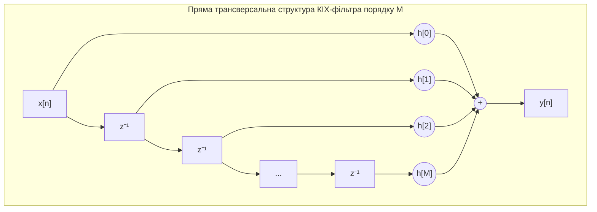
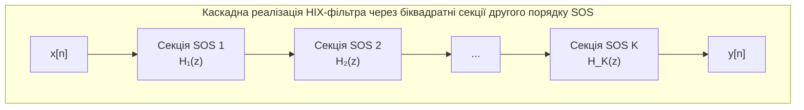
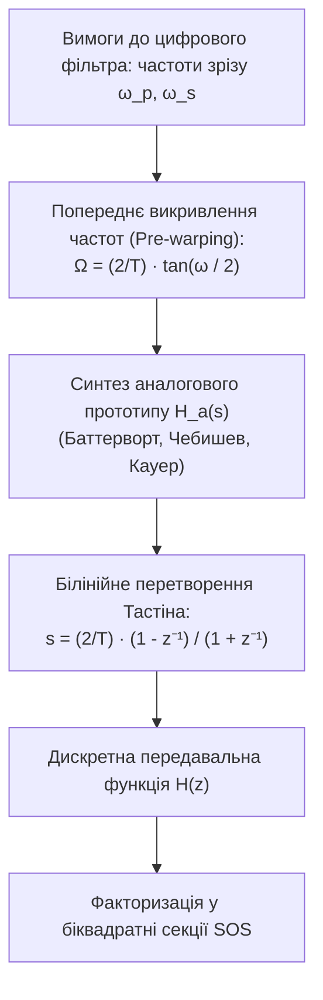

# ТЕМА 4. Z-ПЕРЕТВОРЕННЯ ТА ПРОЄКТУВАННЯ ЦИФРОВИХ ФІЛЬТРІВ

---

## 4.1. Визначення прямого та оберненого z-перетворення. Область збіжності (ROC). Зв'язок z-перетворення з перетворенням Лапласа та ДПФ

### Основний зміст та теоретичний базис

У теорії дискретних сигналів та лінійних стаціонарних систем **$z$-перетворення** відіграє таку саму фундаментальну роль, як перетворення Лапласа в аналізі неперервних динамічних систем або перетворення Фур'є в гармонічному аналізі. Воно є потужним операційним методом, який дозволяє переходити від різницевих рівнянь у часовій області до зручних алгебраїчних співвідношень у комплексній площині, спрощуючи задачі аналізу стійкості, розрахунку перехідних процесів та синтезу цифрових фільтрів.

Математично **пряме двостороннє $z$-перетворення** дискретної числової послідовності $x[n]$ визначається як сума нескінченного степеневого ряду за від'ємними степенями комплексної змінної $z$:

$$X(z) = \mathcal{Z}\{x[n]\} = \sum_{n=-\infty}^{\infty} x[n] z^{-n}$$

де $x[n]$ — дискретна послідовність відліків сигналу при $n \in \mathbb{Z}$; $z$ — комплексна змінна, яка може бути записана в алгебраїчній або показниковій формі як $z = \text{Re}(z) + j\text{Im}(z) = r e^{j\omega}$; $r = |z|$ є модулем комплексного числа; $\omega = \arg(z)$ позначає нормовану кругову частоту в радіанах на відлік; $X(z)$ є $z$-образом аналізованої послідовності.

Для каузальних (причинних) систем і сигналів, відліки яких тотожно дорівнюють нулю для всіх від'ємних моментів часу ($x[n] = 0$ при $n < 0$), використовують **одностороннє $z$-перетворення**:

$$X(z) = \mathcal{Z}\{x[n]\} = \sum_{n=0}^{\infty} x[n] z^{-n}$$

Оскільки $z$-перетворення формалізується як нескінченний ряд Лорана, воно існує не для всієї комплексної площини, а лише для тих значень змінної $z$, при яких цей ряд збігається абсолютно. Множина точок комплексної площини, для яких виконується умова $\sum_{n=-\infty}^{\infty} |x[n] z^{-n}| < \infty$, називається **областю збіжності** (в англомовній термінології — *Region of Convergence, ROC*).

```mermaid
flowchart TD
    A["Дискретна послідовність x[n]"] --> B{"Тип послідовності за часом"}
    B -->|Правобічна / Каузальна: n ≥ 0| C["Область збіжності (ROC):<br>Зовнішня частина кола |z| > R_max"]
    B -->|Лівобічна / Антикаузальна: n ≤ 0| D["Область збіжності (ROC):<br>Внутрішня частина кола |z| < R_min"]
    B -->|Двобічна: -∞ < n < ∞| E["Область збіжності (ROC):<br>Кільце R_min < |z| < R_max"]
    
    C --> F{"Перевірка BIBO-стійкості"}
    D --> F
    E --> F
    F -->|Одиничне коло |z| = 1 входить в ROC| G["Система BIBO-стійка,<br>DTFT/ДПФ існує"]
    F -->|Одиничне коло |z| = 1 поза ROC| H["Система нестійка,<br>DTFT не збігається"]
```
*Рисунок 4.1 — Класифікація конфігурацій областей збіжності (ROC) у z-площині та їхній взаємозв'язок із критерієм BIBO-стійкості системи*

Геометрична конфігурація області збіжності у комплексній площині $z$ підпорядковується суворим топологічним закономірностям:
*   Для правобічних каузальних сигналів скінченної або нескінченної тривалості область збіжності являє собою зовнішню частину круга радіусом $R_{\max}$, що поширюється до нескінченності: $\text{ROC}: |z| > R_{\max}$, де $R_{\max}$ визначається модулем найвіддаленішого від початку координат полюса функції $X(z)$.
*   Для лівобічних антикаузальних сигналів область збіжності є внутрішньою частиною круга радіусом $R_{\min}$, що не містить початку координат: $\text{ROC}: |z| < R_{\min}$.
*   Для двобічних нескінченних послідовностей область збіжності має вигляд відкритого кільця $R_{\min} < |z| < R_{\max}$, утвореного концентричними колами, якщо внутрішній радіус менший за зовнішній ($R_{\min} < R_{\max}$); якщо ж кола не перетинаються, $z$-перетворення для двобічного сигналу не існує.
*   Область збіжності за жодних умов не може містити полюсів функції $X(z)$, оскільки в точках полюсів ряд розбігається до нескінченності.

**Обернене $z$-перетворення** (*Inverse z-Transform, IZT*) відновлює дискретну часову послідовність $x[n]$ за відомою комплексною функцією $X(z)$ шляхом інтегрування за замкненим контуром:

$$x[n] = \mathcal{Z}^{-1}\{X(z)\} = \frac{1}{2\pi j} \oint_{C} X(z) z^{n-1} \, dz$$

де $C$ — замкнений контур інтегрування у комплексній площині $z$, орієнтований проти годинникової стрілки, який повністю лежить у межах області збіжності $\text{ROC}$ та охоплює початок координат $z = 0$ і всі полюси функції $X(z)$. На практиці контурний інтеграл обчислюють за допомогою теореми Коші про лишки, розкладання раціонального дробу $X(z)$ на суму найпростіших дробів із подальшим використанням таблиць відомих $z$-перетворень, або шляхом ділення многочленів у степеневий ряд.

Зв'язок $z$-перетворення з неперервним перетворенням Лапласа встановлюється через математичну модель ідеальної імпульсної дискретизації за часом. Якщо неперервний сигнал $x_a(t)$ перетворюється у модульований потік дельта-імпульсів $x_\delta(t) = \sum_{n=-\infty}^{\infty} x_a(nT) \delta(t - nT)$, то перетворення Лапласа від $x_\delta(t)$ має вигляд:

$$X_\delta(s) = \mathcal{L}\{x_\delta(t)\} = \int_{0}^{\infty} \left[ \sum_{n=0}^{\infty} x_a(nT) \delta(t - nT) \right] e^{-st} \, dt = \sum_{n=0}^{\infty} x_a(nT) e^{-snT}$$

де $s = \sigma + j\Omega$ — комплексна частота Лапласа ($\text{с}^{-1}$); $T$ — період дискретизації (с). 

Порівняння отриманого виразу з формулою одностороннього $z$-перетворення показує їхню повну еквівалентність за умови введення конформного відображення змінних:

$$z = e^{sT} = e^{(\sigma + j\Omega)T} = e^{\sigma T} e^{j\Omega T}$$

Дана функціональна залежність відображає комплексну $s$-площину на комплексну $z$-площину за такими фундаментальними правилами:
*   Уявна вісь $s$-площини ($\text{Re}(s) = \sigma = 0$) відображається на коло одиничного радіуса в $z$-площині ($|z| = e^{0} = 1$).
*   Ліва комплексна півплощина стійкості Лапласа ($\text{Re}(s) = \sigma < 0$) відображається у внутрішню область одиничного кола ($|z| < 1$).
*   Права нестійка півплощина Лапласа ($\text{Re}(s) = \sigma > 0$) відображається у зовнішню область одиничного кола ($|z| > 1$).
*   Смуга шириною $\Omega_s = 2\pi/T$ уздовж уявної осі $s$-площини при обході від $-\pi/T$ до $+\pi/T$ повністю покриває все одиничне коло в $z$-площині проти годинникової стрілки, що безпосередньо відображає періодичність частотного спектра дискретизованого сигналу.

Зв'язок $z$-перетворення з дискретним у часі перетворенням Фур'є (DTFT) виникає як частковий випадок обчислення $X(z)$ безпосередньо на одиничному колі, тобто при $r = |z| = 1$ або $z = e^{j\omega}$:

$$X(e^{j\omega}) = \left. X(z) \right|_{z = e^{j\omega}} = \sum_{n=-\infty}^{\infty} x[n] e^{-j\omega n}$$

Якщо одиничне коло $|z| = 1$ належить області збіжності $\text{ROC}$, то спектральна функція $X(e^{j\omega})$ існує та збігається. Дискретне перетворення Фур'є (ДПФ) $X[k]$ розмірності $N$ є сукупністю рівновіддалених відліків $z$-перетворення, узятих у $N$ точках на одиничному колі: $z_k = e^{j\frac{2\pi}{N}k}$ при $k = 0, 1, \dots, N-1$.

---

## 4.2. Передавальна функція $H(z)$ дискретної системи. Діаграма нулів і полюсів у z-площині. Алгебраїчний та геометричний критерії стійкості ЛСД-систем

### Основний зміст та теоретичний базис

Лінійна стаціонарна дискретна (ЛСД) система, яка у часовій області описується лінійним різницевим рівнянням зі сталими коефіцієнтами, у комплексній $z$-області характеризується дробово-раціональною **передавальною функцією** $H(z)$. Застосовуючи властивість лінійності та теорему про затримку $z$-перетворення ($\mathcal{Z}\{x[n-m]\} = z^{-m}X(z)$) до загального різницевого рівняння системи:

$$\sum_{k=0}^{N} a_k y[n - k] = \sum_{m=0}^{M} b_m x[n - m]$$

після алгебраїчних перетворень отримуємо операторне співвідношення між $z$-образом виходу $Y(z)$ та входу $X(z)$:

$$Y(z) \sum_{k=0}^{N} a_k z^{-k} = X(z) \sum_{m=0}^{M} b_m z^{-m}$$

Передавальна функція $H(z)$ визначається як відношення $z$-перетворення вихідного сигналу до $z$-перетворення вхідного сигналу при нульових початкових умовах, що еквівалентно $z$-перетворенню імпульсної характеристики $h[n]$ системи:

$$H(z) = \frac{Y(z)}{X(z)} = \mathcal{Z}\{h[n]\} = \frac{\sum_{m=0}^{M} b_m z^{-m}}{\sum_{k=0}^{N} a_k z^{-k}} = \frac{b_0 + b_1 z^{-1} + b_2 z^{-2} + \dots + b_M z^{-M}}{a_0 + a_1 z^{-1} + a_2 z^{-2} + \dots + a_N z^{-N}}$$

де $\{b_m\}$ — коефіцієнти прямого зв'язку (нерекурсивна частина фільтра); $\{a_k\}$ — коефіцієнти зворотного зв'язку (рекурсивна частина фільтра, за умови $a_0 = 1$); $M$ та $N$ визначають порядок поліномів чисельника та знаменника відповідно.

Переходячи до додатних степенів комплексної змінної $z$, передавальну функцію подають у факторизованій формі через корені чисельника та знаменника:

$$H(z) = \frac{b_0}{a_0} z^{N-M} \frac{\prod_{m=1}^{M} (z - z_m)}{\prod_{k=1}^{N} (z - p_k)}$$

де $z_m$ — **нулі передавальної функції** (значення комплексної змінної $z$, при яких чисельник обертається в нуль, тобто $H(z_m) = 0$); $p_k$ — **полюси передавальної функції** (значення комплексної змінної $z$, при яких знаменник дорівнює нулю, а функція прямує до нескінченності, тобто $H(p_k) \to \infty$).

```mermaid
flowchart LR
    subgraph S_Plane [Комплексна s-площина Лапласа]
        direction TB
        S1["Ліва півплощина: Re(s) < 0 (Стійкість)"]
        S2["Уявна вісь: s = jΩ"]
        S3["Права півплощина: Re(s) > 0 (Нестійкість)"]
    end
    subgraph Mapping [Конформне відображення z = e^(sT)]
        direction TB
        M1["Відображення на внутрішність круга |z| < 1"]
        M2["Відображення на одиничне коло |z| = 1"]
        M3["Відображення на зовнішність круга |z| > 1"]
    end
    subgraph Z_Plane [Комплексна z-площина]
        direction TB
        Z1["Всередині одиничного кола: |p_k| < 1 (BIBO-стійка)"]
        Z2["Одиничне коло: |z| = 1 (Межа стійкості / АЧХ)"]
        Z3["Поза одиничним колом: |p_k| > 1 (Нестійка система)"]
    end
    
    S1 --> M1 --> Z1
    S2 --> M2 --> Z2
    S3 --> M3 --> Z3
```
*Рисунок 4.2 — Конформне відображення областей стійкості з комплексної s-площини Лапласа в комплексну z-площину*

Розташування нулів і полюсів на комплексній $z$-площині (**діаграма нулів і полюсів**, *pole-zero plot*) однозначно визначає форму амплітудно-частотної (АЧХ) та фазочастотної (ФЧХ) характеристик системи. Комплексний коефіцієнт передачі $H(e^{j\omega})$ отримують підстановкою $z = e^{j\omega}$, що відповідає обходу одиничного кола проти годинникової стрілки від $\omega = 0$ (точка $z = 1$) до частоти Найквіста $\omega = \pi$ (точка $z = -1$). 

Геометричний розрахунок модуля частотної характеристики базується на добутках довжин векторів, проведених від нулів і полюсів до поточної точки $e^{j\omega}$ на одиничному колі:

$$|H(e^{j\omega})| = \left|\frac{b_0}{a_0}\right| \frac{\prod_{m=1}^{M} |e^{j\omega} - z_m|}{\prod_{k=1}^{N} |e^{j\omega} - p_k|} = \left|\frac{b_0}{a_0}\right| \frac{\prod_{m=1}^{M} V_{z,m}(\omega)}{\prod_{k=1}^{N} V_{p,k}(\omega)}$$

де $V_{z,m}(\omega) = |e^{j\omega} - z_m|$ — евклідова відстань від $m$-го нуля до точки на одиничному колі; $V_{p,k}(\omega) = |e^{j\omega} - p_k|$ — евклідова відстань від $k$-го полюса до тієї самої точки.

З геометричного аналізу випливають фундаментальні закономірності формування частотного відгуку цифрових систем:
*   Наближення нуля $z_m$ до одиничного кола на частоті $\omega_0$ викликає різке зменшення відстані $V_{z,m}(\omega_0) \to 0$, що формує глибокий провал (затухання) в АЧХ; якщо нуль лежить безпосередньо на одиничному колі ($|z_m| = 1$), коефіцієнт передачі на цій частоті строго дорівнює нулю ($|H(e^{j\omega_0})| = 0$).
*   Наближення полюса $p_k$ до одиничного кола призводить до різкого зменшення знаменника $V_{p,k}(\omega_0) \to 0$, формуючи виражений резонансний сплеск (пік підсилення) в АЧХ системи.
*   Фазочастотна характеристика $\arg\{H(e^{j\omega})\}$ розраховується як сума фазових кутів векторів від усіх нулів мінус сума фазових кутів векторів від усіх полюсів до точки $e^{j\omega}$.

**Критерій BIBO-стійкості ЛСД-систем:**
Каузальна лінійна стаціонарна дискретна система є стійкою за критерієм обмеженого входу — обмеженого виходу (BIBO) тоді й лише тоді, коли **всі полюси її передавальної функції $p_k$ лежать строго всередині одиничного кола на комплексній $z$-площині**, тобто модуль кожного полюса є строго меншим за одиницю:

$$|p_k| < 1, \quad \forall k = 1, 2, \dots, N$$

Якщо хоча б один полюс потрапляє на одиничне коло ($|p_k| = 1$), система перебуває на межі стійкості (виникають незгасаючі автоколивання, притаманні цифровим генераторам). Якщо хоча б один полюс розташований за межами одиничного кола ($|p_k| > 1$), імпульсна характеристика експоненціально зростає до нескінченності, і система стає абсолютно нестійкою.

Для дискретної системи другого порядку з характеристичним поліномом знаменника $A(z) = 1 + a_1 z^{-1} + a_2 z^{-2} = 0$ алгебраїчний критерій стійкості формулює систему обмежень на дійсні коефіцієнти зворотного зв'язку, відому як **трикутник стійкості**:

$$\begin{cases} |a_2| < 1 \\ a_2 > -a_1 - 1 \\ a_2 > a_1 - 1 \end{cases} \iff \begin{cases} |a_2| < 1 \\ |a_1| < 1 + a_2 \end{cases}$$

| Розташування полюсів $p_k$ | Поведінка імпульсної характеристики $h[n]$ | Стан стійкості системи |
| :--- | :--- | :--- |
| **Усі $|p_k| < 1$ (всередині кола)** | Згасає за експоненціальним законом ($\lim_{n\to\infty} h[n] = 0$) | **Абсолютно стійка (BIBO-stable)** |
| **Простий полюс $|p_k| = 1$ (на колі)** | Постійна амплітуда коливань / стала величина | **На межі стійкості (генератор)** |
| **Кратні полюси $|p_k| = 1$ (на колі)** | Лінійно або поліноміально зростає ($h[n] \sim n^m$) | **Нестійка система** |
| **Хоча б один $|p_k| > 1$ (поза колом)** | Експоненціально зростає ($\lim_{n\to\infty} \|h[n]\| = \infty$) | **Абсолютно нестійка система** |

---

## 4.3. Цифрові фільтри зі скінченною імпульсною характеристикою (КІХ / FIR): структура, властивості, лінійність ФЧХ, абсолютна стійкість

### Основний зміст та теоретичний базис

**Цифровий фільтр зі скінченною імпульсною характеристикою (КІХ-фільтр)** (в англомовній літературі — *Finite Impulse Response, FIR filter*) являє собою нерекурсивну дискретну систему, вихідний сигнал якої формується виключно як зважена сума поточного та скінченної кількості $M$ попередніх відліків вхідного сигналу:

$$y[n] = \sum_{m=0}^{M} b_m x[n - m] = \sum_{m=0}^{M} h[m] x[n - m]$$

де $b_m = h[m]$ — коефіцієнти фільтра, які точно збігаються з відліками його імпульсної характеристики тривалістю $N_h = M + 1$; $M$ — порядок КІХ-фільтра.

Передавальна функція КІХ-фільтра містить виключно поліном за від'ємними степенями $z$ без знаменника (за умови $a_0 = 1$ та $a_k = 0$ при $k \ge 1$):

$$H(z) = \sum_{m=0}^{M} h[m] z^{-m} = h[0] + h[1]z^{-1} + h[2]z^{-2} + \dots + h[M]z^{-M} = \frac{\sum_{m=0}^{M} h[m] z^{M-m}}{z^M}$$

Аналіз факторизованого виразу показує, що передавальна функція КІХ-фільтра має $M$ нулів у довільних точках комплексної площини та $M$ кратних полюсів, які **завжди строго зафіксовані в початку координат** ($z = 0$). Оскільки точка $z = 0$ завжди лежить строго всередині одиничного кола ($|z| = 0 < 1$), КІХ-фільтри володіють **абсолютною (безумовною) стійкістю**. Вони принципово не здатні до самозбудження та генерації паразитної енергії за будь-яких коефіцієнтів $h[m]$.

Найважливішою унікальною перевагою КІХ-фільтрів, недосяжною в аналогових чи цифрових рекурсивних схемах, є можливість забезпечення **строго лінійної фазочастотної характеристики (ЛФЧХ)** у всій смузі пропускання. Фільтр із лінійною фазою пропускає всі спектральні складові сигналу з абсолютно однаковою часовою затримкою, виключаючи виникнення фазової дисперсії та зберігаючи незмінною просторово-часову форму складних імпульсних сигналів, електрокардіограм (ЕКГ) та растрових зображень.


*Рисунок 4.3 — Пряма трансверсальна конвеєрна структура цифрового КІХ-фільтра на базі регістрів зсуву, помножувачів та суматора*

Необхідною і достатньою умовою забезпечення строго лінійної ФЧХ є наявність дзеркальної симетрії або антисиметрії імпульсної характеристики відносно її геометричного центра $n_c = M/2$:

$$h[n] = h[M - n] \quad \text{(симетрична ІХ)} \quad \text{або} \quad h[n] = -h[M - n] \quad \text{(антисиметрична ІХ)}$$

При виконанні цієї умови групова затримка фільтра $\tau_g$ є абсолютно сталою величиною, що дорівнює половині апаратного порядку фільтра в тактах:

$$\tau_g(\omega) = -\frac{d\arg\{H(e^{j\omega})\}}{d\omega} = \frac{M}{2} \cdot T = \text{const}$$

Залежно від типу симетрії та парності порядку $M$, виділяють **чотири класи лінійно-фазових КІХ-фільтрів**:

1. **Тип I (симетрична ІХ, $M$ — парне, довжина $N_h$ — непарна):** Не має апріорних нулів на граничних частотах. Підходить для проектування фільтрів нижніх частот (ФНЧ), фільтрів верхніх частот (ФВЧ), смугових та режекторних фільтрів.
2. **Тип II (симетрична ІХ, $M$ — непарне, довжина $N_h$ — парна):** Має обов'язковий нуль на частоті Найквіста ($H(e^{j\pi}) = 0$). Придатний лише для ФНЧ та смугових фільтрів; категорично не може використовуватись для ФВЧ та режекторних фільтрів.
3. **Тип III (антисиметрична ІХ, $M$ — парне, довжина $N_h$ — непарна):** Має обов'язкові нулі на нульовій частоті ($H(1) = 0$) та на частоті Найквіста ($H(-1) = 0$). Вносить постійний зсув фази на $90^\circ$. Застосовується для проектування цифрових диференціаторів та перетворювачів Гільберта.
4. **Тип IV (антисиметрична ІХ, $M$ — непарне, довжина $N_h$ — парна):** Має обов'язковий нуль на нульовій частоті ($H(1) = 0$). Застосовується для проектування широкосмугових диференціаторів та ФВЧ із фазовим зсувом на $90^\circ$.

Основними методами синтезу КІХ-фільтрів є **метод зважування ваговими вікнами** (віконний синтез на основі зрізання ряду Фур'є функції $\text{sinc}$ вікнами Хеммінга, Блекмана, Кайзера), **метод частотної вибірки** та **оптимальний мінімаксний алгоритм Паркса-Макклеллана** (алгоритм Ремеза), що забезпечує рівнохвильові пульсації (equiripple) в смугах пропускання та затримання.

---

## 4.4. Цифрові фільтри з нескінченною імпульсною характеристикою (НІХ / IIR): структури реалізації та метод білінійного перетворення (Тастіна)

### Основний зміст та теоретичний базис

**Цифровий фільтр із нескінченною імпульсною характеристикою (НІХ-фільтр)** (в англомовній термінології — *Infinite Impulse Response, IIR filter*) являє собою рекурсивну дискретну динамічну систему, передавальна функція якої містить як поліном чисельника, так і поліном знаменника, відображаючи наявність внутрішніх контурів зворотного зв'язку:

$$H(z) = \frac{\sum_{m=0}^{M} b_m z^{-m}}{1 + \sum_{k=1}^{N} a_k z^{-k}}$$

Наявність полюсів, відмінних від нуля, дозволяє формувати високоселективні частотні характеристики з дуже крутими схилами спаду АЧХ при відносно низьких порядках фільтра ($N = 2 \dots 8$). Проте фазочастотна характеристика НІХ-фільтрів є суттєво нелінійною, особливо поблизу частоти зрізу, що призводить до фазових спотворень сигналу.

Основними топологіями апаратної та програмної реалізації НІХ-фільтрів є:
*   **Пряма форма I (Direct Form I):** безпосередньо реалізує різницеве рівняння з роздільними регістрами затримки вхідного та вихідного сигналів, вимагаючи сумарно $M + N$ елементів пам'яті $z^{-1}$.
*   **Пряма форма II (Direct Form II, канонічна):** використовує спільну центральну лінію затримки для проміжних змінних стану $w[n]$, скорочуючи кількість необхідних комірок пам'яті до канонічного мінімуму $\max(M, N)$.
*   **Каскадна форма на основі біквадратних секцій другого порядку (Biquad / Second-Order Sections, SOS):** передавальна функція високого порядку факторизується у послідовний добуток ланок другого порядку:
   $$H(z) = b_0 \prod_{i=1}^{K} \frac{1 + \beta_{1i} z^{-1} + \beta_{2i} z^{-2}}{1 + \alpha_{1i} z^{-1} + \alpha_{2i} z^{-2}}, \quad K = \lceil N/2 \rceil$$
   Каскадна форма має вирішальне практичне значення, оскільки вона кардинально знижує чутливість положення полюсів до квантування коефіцієнтів у процесорах із фіксованою комою, запобігаючи втраті стійкості системи.


*Рисунок 4.4 — Структурна схема каскадної реалізації цифрового НІХ-фільтра високого порядку на базі послідовно з'єднаних біквадратних ланок другого порядку*

Найпоширенішим аналітичним методом синтезу НІХ-фільтрів є **метод білінійного $z$-перетворення (перетворення Тастіна)** (*Bilinear Transform, BLT*). Метод полягає у перетворенні передавальної функції класичного аналогового прототипу $H_a(s)$ (фільтрів Баттерворта, Чебишева I та II роду, еліптичних фільтрів Кауера) у дискретну передавальну функцію $H(z)$ шляхом алгебраїчної підстановки:

$$s = \frac{2}{T} \frac{1 - z^{-1}}{1 + z^{-1}} = \frac{2}{T} \frac{z - 1}{z + 1}$$

де $s$ — комплексна змінна Лапласа; $z$ — комплексна дискретна змінна; $T$ — період дискретизації цифрової системи.

Білінійне перетворення гарантує точне відображення всієї лівої півплощини комплексної площини Лапласа ($\text{Re}(s) < 0$) у внутрішню область одиничного кола ($|z| < 1$), завдяки чому будь-який стійкий аналоговий фільтр гарантовано трансформується у безумовно стійкий цифровий НІХ-фільтр.

Підстановка $s = j\Omega$ та $z = e^{j\omega}$ у формулу білінійного перетворення розкриває залежність між аналоговою неперервною частотою $\Omega$ ($\text{рад/с}$) та цифровою нормованою частотою $\omega$ ($\text{рад/відлік}$):

$$j\Omega = \frac{2}{T} \frac{e^{j\omega} - 1}{e^{j\omega} + 1} = \frac{2}{T} \frac{e^{j\omega/2}(e^{j\omega/2} - e^{-j\omega/2})}{e^{j\omega/2}(e^{j\omega/2} + e^{-j\omega/2})} = \frac{2}{T} \frac{2j \sin(\omega/2)}{2 \cos(\omega/2)} = j \frac{2}{T} \tan\left(\frac{\omega}{2}\right)$$

Звідси випливає фундаментальне нелінійне співвідношення деформації частотної осі (**ефект частотного викривлення**, *frequency warping*):

$$\Omega = \frac{2}{T} \tan\left(\frac{\omega}{2}\right) \iff \omega = 2 \arctan\left(\frac{\Omega T}{2}\right)$$


*Рисунок 4.5 — Алгоритмічна послідовність проєктування цифрового НІХ-фільтра методом білінійного перетворення з компенсацією частотного викривлення*

Внаслідок нелінійного стиснення нескінченна вісь аналогових частот $\Omega \in [-\infty; +\infty]$ однозначно та монотонно відображається у скінченний інтервал цифрових частот $\omega \in [-\pi; +\pi]$. Щоб спроєктований цифровий фільтр мав точні задані граничні частоти зрізу $\omega_c$, перед розрахунком аналогового прототипу обов'язково виконують операцію **попереднього викривлення частот (*frequency pre-warping*)**:

$$\Omega_c = \frac{2}{T} \tan\left(\frac{\omega_c}{2}\right)$$

| Параметр порівняння | КІХ-фільтри (FIR) | НІХ-фільтри (IIR) |
| :--- | :--- | :--- |
| **Імпульсна характеристика** | Скінченна за часом ($h[n] = 0$ при $n > M$) | Нескінченна за часом (експоненціальна/синусна) |
| **Фазочастотна характеристика** | **Суворо лінійна** (відсутність фазових спотворень) | **Нелінійна** (виражена дисперсія біля зрізу) |
| **Стійкість системи** | **Абсолютно стійкі** (усі полюси в $z = 0$) | Потребують перевірки ($|p_k| < 1$, ризик генерації) |
| **Необхідний порядок фільтра** | **Високий** ($N \sim 50 \dots 1000$ для крутих схилів) | **Низький** ($N \sim 2 \dots 8$ для аналогічної крутизни) |
| **Обчислювальні витрати** | Високі (велике число операцій множення MAC) | Мінімальні (висока швидкодія та мала затримка) |
| **Чутливість до квантування** | Низька (похибка округлення не викликає нестійкості) | Висока (можливість переходу полюсів за одиничне коло) |
| **Аналогові прототипи** | Не існують (чисто дискретний синтез) | Прямий перерахунок класичних аналогових фільтрів |

Аналіз порівняльної таблиці визначає інженерні критерії вибору типу фільтра: КІХ-фільтри є безальтернативними в системах обробки біомедичних сигналів, звукових трактах та обробці цифрових зображень, де критично важливим є збереження форми хвильового фронту без фазових спотворень; натомість НІХ-фільтри обирають у вимірювальних мікроконтролерних системах реального часу та телекомунікаціях, де пріоритетом є мінімальне завантаження процесора, мала латентність та висока крутизна смуги затримання при обмежених апаратних ресурсах.

---

### Питання для самоперевірки та аналітичного осмислення

1. Дайте математичне визначення області збіжності (ROC) $z$-перетворення. Чому розташування одиничного кола $|z| = 1$ всередині області збіжності є обов'язковою умовою існування дискретного перетворення Фур'є (DTFT) для досліджуваного сигналу?
2. Поясніть геометричний зв'язок між полюсами передавальної функції $H(z)$ та стійкістю каузальної ЛСД-системи. Які фізичні процеси виникають у цифровій системі, якщо комплексно-сполучена пара полюсів перетинає одиничне коло ($|p_{1,2}| > 1$)?
3. За допомогою геометричної інтерпретації на комплексній $z$-площині поясніть, чому розміщення нуля передавальної функції безпосередньо на одиничному колі формує нульовий коефіцієнт передачі АЧХ на відповідній частоті.
4. Доведіть, чому КІХ-фільтри є безумовно стійкими за будь-яких значень їхніх вагових коефіцієнтів $h[n]$, та які обмеження накладає властивість лінійності ФЧХ на симетрію імпульсної характеристики.
5. Опишіть математичний апарат та фізичний зміст явища частотного викривлення (frequency warping), що виникає при застосуванні білінійного перетворення Тастіна. Для чого застосовується процедура попереднього викривлення частот (pre-warping)?
6. Проведіть системне порівняння переваг і недоліків КІХ- та НІХ-фільтрів. У яких практичних задачах комп'ютерної інженерії доцільно знехтувати нелінійністю фази заради зниження порядку фільтра, а де збереження лінійної фази є абсолютно критичним?