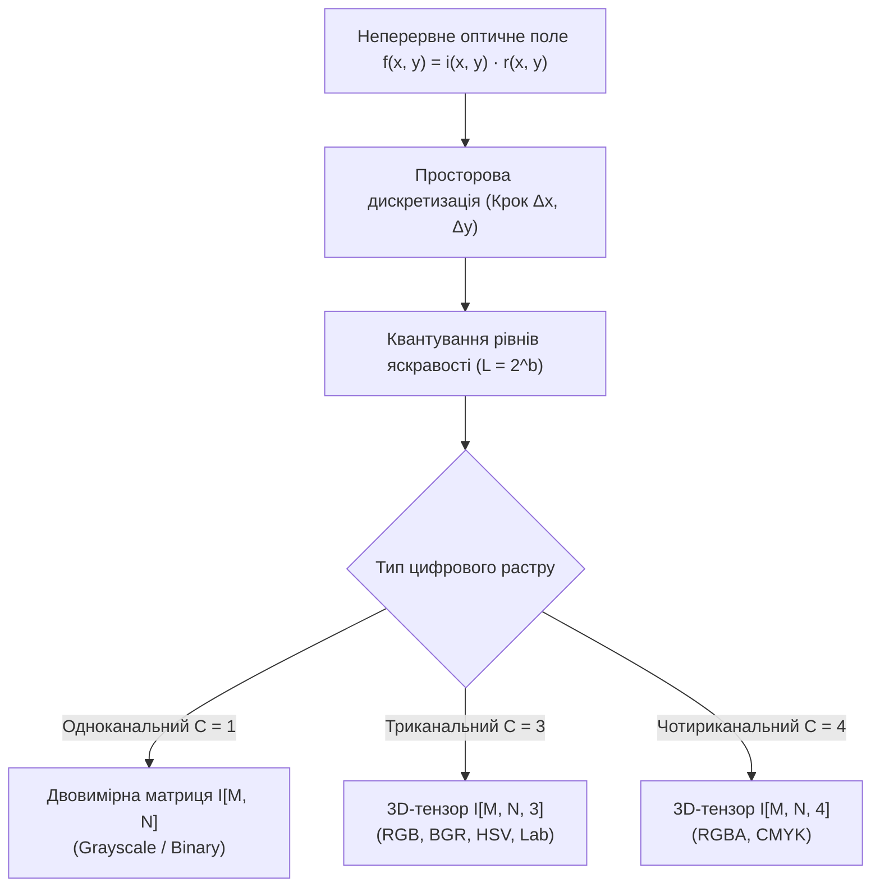
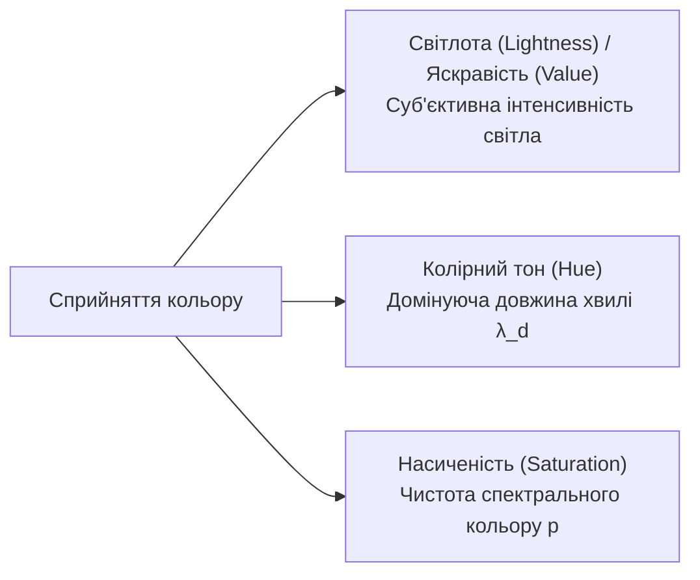
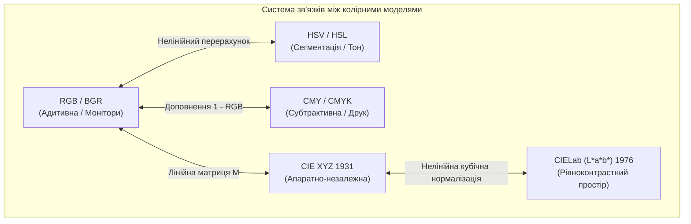

# ТЕМА 5. ЦИФРОВЕ ПРЕДСТАВЛЕННЯ ЗОБРАЖЕНЬ ТА КОЛОРИМЕТРИЧНІ МОДЕЛІ

---

## 5.1. Цифрове растрове зображення як двовимірна матриця / 3D-тензор. Просторова роздільна здатність та глибина кольору

### Основний зміст та теоретичний базис

У математичному моделюванні оптичних систем неперервне монохромне півтонове зображення розглядається як двовимірна неперервна функція просторових координат $f(x, y)$, визначена на компактній прямокутній області площини $\Omega \subset \mathbb{R}^2$. Фізично значення функції $f(x, y)$ у точці з координатами $(x, y)$ пропорційне енергетичній яскравості (радіансу) відповідної ділянки сцени або коефіцієнту відбиття світлового потоку. Формування зображення описується класичною моделлю освітлення-відбиття:

$$f(x, y) = i(x, y) \cdot r(x, y)$$

де $i(x, y)$ — функція падаючого світлового потоку від первинних джерел випромінювання ($0 < i(x, y) < \infty$), виражена у люксах або $\text{Вт/м}^2$; $r(x, y)$ — коефіцієнт відбиття (альбедо) матеріалу поверхні об'єкта ($0 \le r(x, y) \le 1$, де 0 відповідає абсолютному поглинанню, а 1 — повному дифузному відбиттю).

Перехід від неперервного оптичного зображення $f(x, y)$ до цифрової форми вимагає застосування двох фундаментальних операцій: просторової дискретизації неперервних координат $(x, y)$ та квантування значень амплітуди $f(x, y)$ за рівнем яскравості. У результаті дискретизації за прямокутною просторовою сіткою формується двовимірна матриця дискретних відліків, які називаються елементами зображення або **пікселями** (*picture elements, pixels*):

$$\mathbf{I} = \begin{bmatrix}
I[0, 0] & I[0, 1] & \dots & I[0, N-1] \\
I[1, 0] & I[1, 1] & \dots & I[1, N-1] \\
\vdots & \vdots & \ddots & \vdots \\
I[M-1, 0] & I[M-1, 1] & \dots & I[M-1, N-1]
\end{bmatrix}$$

де $M$ — кількість рядків матриці (висота растру у пікселях); $N$ — кількість стовпців (ширина растру у пікселях); $I[m, n]$ — дискретне значення оптичної густини або рівня сірого в елементі з просторовими дискретними координатами $(m, n)$, де $m \in [0; M-1]$, $n \in [0; N-1]$. Початок координат цифрового растра $(0, 0)$ традиційно розташовується у лівому верхньому кутку матриці, при цьому індекс $m$ задає вертикальне зміщення вниз уздовж осі $Y$, а індекс $n$ — горизонтальне зміщення вправо уздовж осі $X$.

Для багатоканальних (кольорових та мультиспектральних) зображень математичною структурою представлення виступає тривимірний **тензор третього рангу** розмірності $M \times N \times C$, де $C$ позначає кількість колірних або спектральних каналів (шарів):

$$\mathbf{I} \in \mathbb{R}^{M \times N \times C}, \quad I[m, n, c] = f_c(m \Delta y, n \Delta x)$$

де $c \in [0; C-1]$ — індекс спектрального каналу; $\Delta x, \Delta y$ — лінійні кроки просторової дискретизації вздовж відповідних осей на поверхні фоточутливого сенсора.

*Рисунок 5.1 — Структурна схема перетворення неперервного оптичного поля у цифрові матричні та тензорні представлення*

Якість цифрового представлення зображень визначається двома параметрами: **просторовою роздільною здатністю** та **глибиною кольору (розрядністю квантування)**. Просторова роздільна здатність задає просторову густину дискретизації і вимірюється фізичною кількістю пікселів на одиницю довжини — точок на дюйм (*dots per inch, DPI*) чи пікселів на дюйм (*pixels per inch, PPI*). 

Глибина кольору (інформаційна ємність пікселя, *color depth*) визначає кількість бітів $b$, виділених для цифрового кодування яскравості кожного каналу пікселя, що обумовлює загальне число відтворюваних градацій $L = 2^b$:

| Тип даних | Розрядність ($b$) | Діапазон значень | Кількість рівнів | Типове застосування в комп'ютерній інженерії |
| :--- | :---: | :---: | :---: | :--- |
| **`bool / bit`** | 1 біт | $\{0, 1\}$ | 2 | Бінарні маски сегментації, OCR-розпізнавання тексту, силуети |
| **`uint8 / CV_8U`** | 8 біт | $0 \dots 255$ | 256 | Стандартний комп'ютерний зір (sRGB, Grayscale), відеопотоки |
| **`uint16 / CV_16U`** | 16 біт | $0 \dots 65535$ | 65 536 | Медична томографія (DICOM), супутникові мультиспектральні знімки, RAW |
| **`int32 / CV_32S`** | 32 біти | $-2^{31} \dots 2^{31}-1$ | $4.29 \times 10^9$ | Маркування зв'язних компонентів (Connected Components Labeling) |
| **`float32 / CV_32F`** | 32 біти | $[0.0; 1.0]$ або $\mathbb{R}$ | Неперервний | Нормовані градієнти, фільтрація у частотній області 2D-FFT, CNN |

Використання 8-бітного цілочислового формату без знака `uint8` є загальноприйнятим промисловим стандартом для візуалізації, де рівень 0 відповідає абсолютно чорному кольору, а рівень 255 — максимальній яскравості білого. Під час виконання складних проміжних математичних операцій (диференціювання, розрахунок градієнтів, двовимірне перетворення Фур'є) застосовують тип даних `float32` з діапазоном $[0.0; 1.0]$, що виключає виникнення похибок переповнення розрядної сітки та втрату точності округлення.

---

## 5.2. Сенсорні структури матричних фотоприймачів (Bayer pattern, кольороподіл)

### Основний зміст та теоретичний базис

Отримання первинних цифрових зображень у сучасних оптико-електронних приладах базується на використанні **матричних фотоприймачів (МФП)**, виготовлених на основі приладів із зарядовим зв'язком (ПЗЗ, *CCD*) або комплементарних структур метал-оксид-напівпровідник (КМОН, *CMOS*). Напівпровідниковий кремнієвий фотодіод інтегрує фотони світла за рахунок внутрішнього фотоефекту, накопичуючи електричний заряд, пропорційний сумарній енергетичній освітленості. Кремній володіє власною спектральною чутливістю у широкому діапазоні довжин хвиль від 350 до 1100 нм, тому одиничний фотоелемент є суто монохромним і принципово не здатний розрізняти спектральний склад (довжину хвилі) падаючого випромінювання.

Для формування кольорового зображення застосовують методи просторово-спектрального кольороподілу. Найпоширенішим апаратним рішенням у масових сенсорних системах є інтеграція на поверхню напівпровідникової матриці **мозаїчного колірного фільтра Байєра (*Bayer Color Filter Array, CFA*)**.

*Рисунок 5.2 — Оптико-електронний тракт просторового формування кольорового зображення матричним фотоприймачем із фільтром Байєра*

Фільтр Байєра являє собою двовимірний періодичний масив мікроскопічних барвних фільтрів, згрупованих у періодичні комірки розміром $2 \times 2$ елементи. Класичний шаблон колірної конфігурації містить два зелених (G), один червоний (R) та один синій (B) субпікселі (патерн RGGB або BGGR):

$$\mathbf{M}_{\text{Bayer}} = \begin{bmatrix} R & G \\ G & B \end{bmatrix}$$

Спектральне співвідношення площ фільтрів становить $50\%$ для зеленого каналу, $25\%$ для червоного та $25\%$ для синього. Такий нерівномірний просторовий розподіл зумовлений психофізіологічними особливостями зорової системи людини: крива денної спектральної чутливості людського ока (функція $V(\lambda)$) має різко виражений максимум у зеленій ділянці спектра на довжині хвилі $\lambda \approx 555\text{ нм}$. Зорова система сприймає дрібні просторові деталі, контури та текстури переважно через зелену складову світлового потоку.

Вихідним результатом експонування МФП є матриця даних у форматі **RAW**, де кожен просторовий піксель містить інформацію лише про одну спектральну компоненту ($R$, $G$ або $B$). Відновлення повноколірного трикомпонентного представлення на рівні кожного пікселя здійснюється за допомогою обчислювальної процедури **демозаїки (дебайєризації, *demosaicing*)**. Найпростішим методом дебайєризації є білінійна просторова інтерполяція, за якої відсутні колірні компоненти розраховуються як середнє арифметичне сусідніх просторових відліків того самого типу:

$$G[m, n] = \frac{1}{4} \Big( G[m-1, n] + G[m+1, n] + G[m, n-1] + G[m, n+1] \Big)$$

Для запобігання втрати різкості та виникненню інтерполяційних дефектів застосовують адаптивні градієнтні алгоритми демозаїки (алгоритм Мальвара-Хе-Катлера, спрямована інтерполяція вздовж границь об'єктів).

Невідповідність просторової дискретизації колірної мозаїки просторовому спектру сцени викликає просторовий аліасинг, що проявляється у вигляді паразитного муарового забарвлення дрібних періодичних текстур і фальшивих кольорових ореолів вздовж різких контурів. Для пригнічення цього ефекту перед матричним фільтром встановлюють оптичний антиаліасинговий фільтр низьких частот (*Optical Low-Pass Filter, OLPF*), виготовлений із двозаломлюючих кристалів кварцу, який злегка розмиває просторове зображення до розміру кроку дискретизації субпікселів.

---

## 5.3. Фізичні та психофізіологічні основи колориметрії. Закони змішування кольорів Грасмана. Світлота, колірний тон, насиченість

### Основний зміст та теоретичний базис

**Колориметрія** — це наука про методи кількісного вимірювання та числового вираження кольору на основі фізичних параметрів оптичного випромінювання та психофізіологічних закономірностей зорового сприйняття. Фізіологічний механізм колірного зору людини базується на трихроматичній теорії Юнга-Гельмгольца. Сітківка людського ока містить фоторецептори двох типів: високочутливі палички (відповідають за сутінковий ахроматичний зір) та три типи колбочок (відповідають за денний хроматичний зір), кожен з яких має індивідуальну криву спектральної чутливості:
*   Колбочки $S$-типу (*Short wavelength*): володіють максимумом чутливості в короткохвильовій синьо-фіолетовій зоні спектра ($\lambda_{\max} \approx 420\text{ нм}$).
*   Колбочки $M$-типу (*Medium wavelength*): мають пік поглинання у середньохвильовій зеленій ділянці ($\lambda_{\max} \approx 534\text{ нм}$).
*   Колбочки $L$-типу (*Long wavelength*): характеризуються максимумом у довгохвильовій жовто-червоній ділянці ($\lambda_{\max} \approx 564\text{ нм}$).

Будь-який неперервний спектральний розподіл потужності світла $S(\lambda)$ сприймається зоровою системою у вигляді трьох інтегральних сигналів збудження сітківки:

$$S_{\text{cone}} = \int_{\lambda_{\min}}^{\lambda_{\max}} S(\lambda) s(\lambda) \, d\lambda, \quad M_{\text{cone}} = \int_{\lambda_{\min}}^{\lambda_{\max}} S(\lambda) m(\lambda) \, d\lambda, \quad L_{\text{cone}} = \int_{\lambda_{\min}}^{\lambda_{\max}} S(\lambda) l(\lambda) \, d\lambda$$

де $s(\lambda), m(\lambda), l(\lambda)$ — спектральні функції чутливості відповідних груп колбочок; інтервал інтегрування $[\lambda_{\min}; \lambda_{\max}]$ охоплює видимий оптичний діапазон від 380 до 780 нм. Внаслідок інтегрального перетворення різні спектральні комбінації $S_1(\lambda) \neq S_2(\lambda)$ можуть формувати ідентичні трійки збуджень $(S, M, L)$, викликаючи в людини абсолютно однакове зорове відчуття кольору. Це фундаментальне явище називається **метамеризмом**.

Психофізіологічно відчуття кольору однозначно описується трьома суб'єктивними координатами сприйняття:

*Рисунок 5.3 — Триосьова структура суб'єктивного колірного сприйняття людини*

*   **Світлота (яскравість, *Lightness / Value*):** визначає рівень сприйманої зорової інтенсивності випромінювання на шкалі від абсолютно темного (чорного) до сліпуче яскравого (білого). Вона є нелінійною функцією енергетичної яскравості, що підпорядковується логарифмічному закону Вебера-Фехнера.
*   **Колірний тон (*Hue*):** якісна характеристика хроматичного відчуття, яка дозволяє класифікувати колір як червоний, жовтий, зелений або синій. Кількісно колірний тон визначається **домінуючою довжиною хвилі** $\lambda_d$ спектрально чистого монохроматичного випромінювання.
*   **Насиченість (*Saturation*):** ступінь вираженості та спектральної чистоти колірного тону, що відображає міру його розведення ахроматичним (білим) світлом. **Чистота кольору** $p$ формалізується як відношення яскравості спектрально чистої складової $L_\lambda$ до повної яскравості світлової суміші $L$:
   $$p = \frac{L_\lambda}{L_\lambda + L_E} = \frac{L_\lambda}{L}$$
   де $L_E$ — яскравість рівноенергетичного білого світла; для чистого спектрального випромінювання $p = 1$, а для білого світла $p = 0$.

Математичним базисом колориметричних розрахунків виступають **закони змішування кольорів Грасмана (1854 р.)**:

1. **Перший закон (тривимірність кольору):** Будь-який колір $\mathbf{C}$ може бути однозначно отриманий змішуванням трьох лінійно незалежних основних кольорів $\mathbf{P}_1, \mathbf{P}_2, \mathbf{P}_3$, жоден із яких не може бути синтезований сумішшю двох інших:
   $$\mathbf{C} = T_1 \mathbf{P}_1 + T_2 \mathbf{P}_2 + T_3 \mathbf{P}_3$$
   де $T_1, T_2, T_3$ — координати кольору (тристимульні значення), що визначають кількості відповідних основних кольорів у суміші.
2. **Другий закон (неперервність колірного простору):** При неперервній зміні спектрального складу оптичного випромінювання відчуття кольору суміші також змінюється неперервно; довільний колірний тон може бути плавно змінений від одного кольору до іншого через послідовність проміжних переходів.
3. **Третій закон (адитивність і лінійність змішування):** Колір суміші некогерентних випромінювань залежить виключно від їхніх координат кольору і не залежить від їхнього первинного спектрального складу (еквівалентні кольори дають еквівалентні суміші):
   $$\text{Якщо } \mathbf{C}_1 \equiv \mathbf{C}_2 \text{ та } \mathbf{C}_3 \equiv \mathbf{C}_4, \quad \text{то } \mathbf{C}_1 + \mathbf{C}_3 \equiv \mathbf{C}_2 + \mathbf{C}_4, \quad \text{і } k \mathbf{C}_1 \equiv k \mathbf{C}_2$$
4. **Четвертий закон (адитивність світності):** Повна яскравість складної колірної суміші дорівнює алгебраїчній сумі яскравостей її окремих випромінюваних компонентів:
   $$L(\mathbf{C}) = T_1 L(\mathbf{P}_1) + T_2 L(\mathbf{P}_2) + T_3 L(\mathbf{P}_3)$$
   де $L(\mathbf{P}_i)$ — коефіцієнти яскравості одиничних кількостей основних кольорів.

---

## 5.4. Колірні моделі та простори: адитивна RGB (BGR в OpenCV), циліндрична HSV/HSL, апаратно-незалежні CIE XYZ та CIELab ($L^*a^*b^*$), субтрактивні CMY/CMYK. Формули взаємного перерахунку

### Основний зміст та теоретичний базис

**Колірна модель** являє собою абстрактну математичну систему опису кольорів у вигляді впорядкованих числових кортежів (зазвичай тривимірних або чотиривимірних векторів). Разом із правилами фізичної інтерпретації координат та умовами перегляду колірна модель задає певний **колірний простір** (*color space*), що визначає колірне охоплення (*gamut*).

*Рисунок 5.4 — Граф топологічних взаємозв'язків та взаємних перетворень між основними колориметричними просторами*

### Адитивна модель RGB та порядок каналів BGR в OpenCV

Колірна модель **RGB** базується на адитивному змішуванні випромінювань трьох первинних монохроматичних кольорів: червоного ($R$, $\lambda = 700.0\text{ нм}$), зеленого ($G$, $\lambda = 546.1\text{ нм}$) та синього ($B$, $\lambda = 435.8\text{ нм}$). Одиничний простір RGB представляється одиничним кубом $[0; 1]^3$, вершини якого відповідають основним кольорам, чорному кольору $(0, 0, 0)$, білому кольору $(1, 1, 1)$, та вторинним кольорам: жовтому $(1, 1, 0)$, пурпуровому $(1, 0, 1)$ та блакитному $(0, 1, 1)$.

Для перетворення повноколірного RGB-зображення в монохромне півтонове (Grayscale) застосовують стандартизовану зважену суму яскравостей відповідно до рекомендації ITU-R BT.601, яка враховує різну спектральну чутливість людського ока:

$$Y = 0.299 \cdot R + 0.587 \cdot G + 0.114 \cdot B$$

де $Y$ — результуюча яскравість пікселя; коефіцієнти $0.299, 0.587, 0.114$ точно відображають домінантний внесок зеленого каналу у сприйняття загальної світності.

**Критична особливість архітектури OpenCV:** Історично бібліотека комп'ютерного зору OpenCV завантажує, зберігає та обробляє кольорові растри у форматі зі зворотним порядком слідування каналів — **BGR** (Blue, Green, Red). Натомість більшість універсальних бібліотек обробки та візуалізації Python (такі як Matplotlib `plt.imshow()` та Pillow `Image.open()`) працюють виключно зі стандартизованим порядком **RGB**. 

Якщо зчитане засобами OpenCV BGR-зображення спробувати безпосередньо відобразити через `matplotlib.pyplot.imshow()`, виникає апаратний конфлікт інтерпретації пам'яті: червоні та сині канали міняються місцями, що призводить до повного спотворення колірної гами (людські обличчя набувають неприродного синього відтінку, а синє небо стає жовто-червоним). Для коректного суміщення бібліотек обов'язково виконують програмне перетворення порядку каналів:

$$\mathbf{I}_{\text{RGB}} = \text{cv2.cvtColor}(\mathbf{I}_{\text{BGR}}, \text{cv2.COLOR\_BGR2RGB})$$

### Циліндрична модель HSV та її особливості при сегментації за кольором

Колірний простір **HSV** (*Hue, Saturation, Value* — колірний тон, насиченість, яскравість) являє собою нелінійну трансформацію простору RGB у циліндричну систему координат у формі перевернутого шестикутного конуса або циліндра. Він розділяє колірну інформацію на суто хроматичну складову (тон $H$ та насиченість $S$) та ахроматичну інтенсивність освітлення ($V$).

Аналітичні формули перетворення нормованих координат $R, G, B \in [0; 1]$ у простір HSV визначаються співвідношеннями:

$$V = \max(R, G, B)$$

$$S = \begin{cases} 0, & \text{якщо } V = 0 \\ \frac{V - \min(R, G, B)}{V} = \frac{\Delta}{V}, & \text{якщо } V \neq 0 \end{cases}$$

$$H = \begin{cases}
0^\circ, & \text{якщо } \Delta = 0 \\
60^\circ \cdot \left( \frac{G - B}{\Delta} \bmod 6 \right), & \text{якщо } V = R \\
60^\circ \cdot \left( \frac{B - R}{\Delta} + 2 \right), & \text{якщо } V = G \\
60^\circ \cdot \left( \frac{R - G}{\Delta} + 4 \right), & \text{якщо } V = B
\end{cases}$$

де $\Delta = \max(R, G, B) - \min(R, G, B)$; значення кута $H$ лежить у діапазоні $[0^\circ; 360^\circ]$; якщо $H < 0^\circ$, до значення додається $360^\circ$.

В інженерній практиці реалізації на базі OpenCV для 8-бітного представлення (`uint8`) кутовий діапазон $H \in [0^\circ; 360^\circ]$ масштабується діленням навпіл у діапазон $H_{\text{OpenCV}} \in [0; 179]$, що дозволяє вмістити кут у межі одного байта (оскільки максимальне число в байті становить 255). Канали $S$ та $V$ масштабуються до інтервалу $[0; 255]$.

**Переваги простору HSV у задачах комп'ютерного зору та кольорової сегментації:**
У класичному просторі RGB зміна умов освітленості сцени (поява тіней, відблисків або зміна потужності джерела світла) призводить до одночасної нелінійної зміни всіх трьох координат $(R, G, B)$, що робить сегментацію об'єктів за пороговими значеннями RGB нестабільною і вразливою до завад. 

У просторі HSV координата тону $H$ є інваріантною до змін інтенсивності освітлення. Затінення об'єкта або зміна яскравості лампи змінює переважно значення координати $V$, тоді як домінуючий колірний тон $H$ залишається незмінним. Завдяки цьому сегментація цільових об'єктів (розпізнавання кольору дорожніх знаків, виділення шкіри людини, детектування дефектів) у просторі HSV реалізується простим бінарним пороговим вікном:

$$I_{\text{mask}}[m, n] = \begin{cases} 255, & \text{якщо } H_{\min} \le H[m,n] \le H_{\max} \;\land\; S_{\min} \le S[m,n] \le S_{\max} \;\land\; V_{\min} \le V[m,n] \le V_{\max} \\ 0, & \text{в інших випадках} \end{cases}$$

### Апаратно-незалежні простори CIE XYZ та CIELab ($L^*a^*b^*$)

Колориметрична система **CIE XYZ (1931 р.)** розроблена Міжнародною комісією з освітлення (CIE) як універсальний апаратно-незалежний еталон. Основні кольори $\mathbf{X}, \mathbf{Y}, \mathbf{Z}$ є математичними абстракціями і розраховані так, щоб усі реальні фізичні випромінювання описувалися строго додатними координатами, а координата $Y$ чисельно збігалася з фотометричною яскравістю сцени. Перерахунок лінійного простору sRGB до системи CIE XYZ для стандартного білого джерела D65 здійснюється матричним множенням:

$$\begin{bmatrix} X \\ Y \\ Z \end{bmatrix} = \begin{bmatrix}
0.412456 & 0.357576 & 0.180438 \\
0.212673 & 0.715152 & 0.072175 \\
0.019334 & 0.119192 & 0.950304
\end{bmatrix} \begin{bmatrix} R \\ G \\ B \end{bmatrix}$$

Колориметричний простір **CIELab ($L^*a^*b^*$, 1976 р.)** є **рівноконтрастним простором**, створеним для усунення нелінійності зорового сприйняття систем RGB та XYZ. У просторі CIELab однаковій евклідовій відстані між точками у будь-якій ділянці колірного тіла відповідає однакова суб'єктивна зорова відмінність між кольорами. Координати системи визначаються формулами:

$$L^* = 116 f\left(\frac{Y}{Y_n}\right) - 16, \quad a^* = 500 \left[ f\left(\frac{X}{X_n}\right) - f\left(\frac{Y}{Y_n}\right) \right], \quad b^* = 200 \left[ f\left(\frac{Y}{Y_n}\right) - f\left(\frac{Z}{Z_n}\right) \right]$$

де $X_n, Y_n, Z_n$ — координати опорного білого джерела (для стандартного джерела D65: $X_n = 0.95047, Y_n = 1.00000, Z_n = 1.08883$); $L^*$ позначає світлоту від 0 (чорний) до 100 (білий); $a^*$ відображає позицію на осі від зеленого (від'ємні значення) до червоного (додатні значення); $b^*$ відображає позицію на осі від синього (від'ємні значення) до жовтого (додатні значення). 

Нелінійна кускова функція $f(q)$ має вигляд:

$$f(q) = \begin{cases} q^{1/3}, & \text{якщо } q > \left(\frac{6}{29}\right)^3 \approx 0.008856 \\ \frac{1}{3}\left(\frac{29}{6}\right)^2 q + \frac{4}{29} \approx 7.787 q + \frac{16}{116}, & \text{якщо } q \le 0.008856 \end{cases}$$

Кількісна колірна різниця між двома зразками $(L_1^*, a_1^*, b_1^*)$ та $(L_2^*, a_2^*, b_2^*)$ обчислюється за формулою Евкліда ($\Delta E^*_{ab}$ за стандартом CIE 1976):

$$\Delta E^*_{ab} = \sqrt{(L_1^* - L_2^*)^2 + (a_1^* - a_2^*)^2 + (b_1^* - b_2^*)^2}$$

Якщо $\Delta E^*_{ab} < 1.0$, відмінність між кольорами є нерозрізненною для людського ока; діапазон $\Delta E^*_{ab} \in [1.0; 2.0]$ відповідає ледь помітній різниці при ретельному порівнянні.

### Субтрактивна модель CMY та CMYK

Моделі **CMY** (*Cyan, Magenta, Yellow*) та **CMYK** (+ *Key/Black*) описують процес субтрактивного формування кольору, який базується не на випромінюванні, а на поглинанні (відніманні) певних довжин хвиль білого світла барвниками поліграфічного обладнання або принтерів. Базові координати CMY пов'язані з нормованими координатами RGB відніманням від одиниці:

$$C = 1 - R, \quad M = 1 - G, \quad Y = 1 - B$$

Для зменшення витрат дорогих кольорових чорнил та забезпечення глибокого нейтрального чорного кольору в поліграфії додають чорний пігмент $K$, формуючи модель **CMYK**:

$$K = \min(C, M, Y)$$

$$C' = \frac{C - K}{1 - K}, \quad M' = \frac{M - K}{1 - K}, \quad Y' = \frac{Y - K}{1 - K}, \quad \text{при } K < 1$$

| Колірна модель | Тип моделі / Орієнтація | Основні координати | Основне інженерне призначення |
| :--- | :--- | :--- | :--- |
| **RGB / BGR** | Адитивна / Апаратна | Червоний, Зелений, Синій ($0 \dots 255$) | Монітори, цифрові камери, дисплеї, обробка в OpenCV |
| **HSV / HSL** | Циліндрична / Сприйняттєва | Тон ($0 \dots 179$), Насиченість, Яскравість | Сегментація за кольором, інваріантність до освітлення |
| **CIE XYZ** | Лінійна / Апаратно-незалежна | Умовні координати $X, Y, Z \ge 0$ | Еталонний колориметричний перерахунок між просторами |
| **CIELab** | Рівноконтрастна / Апаратно-незалежна | Світлота $L^*$, колірні осі $a^*, b^*$ | Оцінка похибки передачі кольору ($\Delta E$), поліграфія |
| **CMYK** | Субтрактивна / Поліграфічна | Блакитний, Пурпуровий, Жовтий, Чорний | Кольоровий друк, підготовка макетів до поліграфії |

---

### Питання для самоперевірки та аналітичного осмислення

1. Опишіть математичну структуру представлення монохромного зображення у вигляді двовимірної матриці та кольорового зображення як тривимірного тензора. Поясніть фізичний зміст просторових координат та рівнів квантування яскравості.
2. Які фізичні та оптичні фактори обумовлюють необхідність розміщення колірного фільтра Байєра (CFA) на поверхні матричних фотоприймачів, і чому площа зелених субпікселів удвічі перевищує площу червоних чи синіх елементів?
3. Сформулюйте чотири закони змішування кольорів Грасмана. У чому полягає явище метамеризму, і який фізіологічний механізм людського зору робить його можливим?
4. Поясніть архітектурну причину несумісності відображення колірних каналів між бібліотеками OpenCV (BGR) та Matplotlib/Pillow (RGB). Які візуальні артефакти спостерігаються у разі прямого виведення BGR-масиву через функцію `plt.imshow()`?
5. Наведіть аналітичні формули перетворення з простору RGB у простір HSV. Чому сегментація цільових об'єктів за пороговими значеннями в просторі HSV є на порядок стійкішою до зміни освітлення та тіней, ніж у просторі RGB?
6. Що таке рівноконтрастний колірний простір, і яким чином координати системи CIELab ($L^*a^*b^*$) пов'язані з евклідовою метрикою розрізнення кольорів $\Delta E^*_{ab}$ за стандартом CIE 1976?