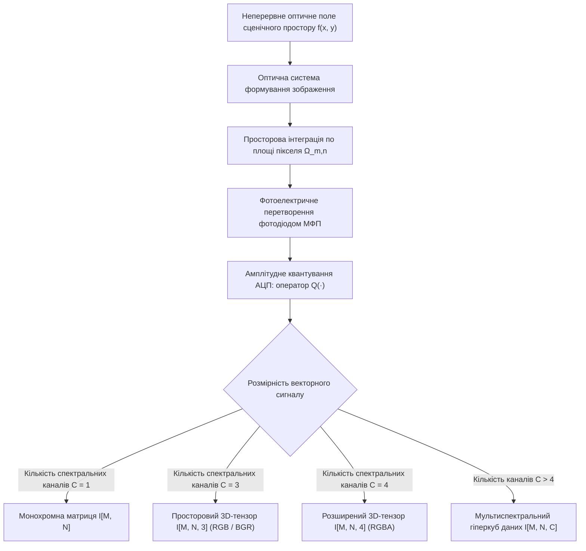
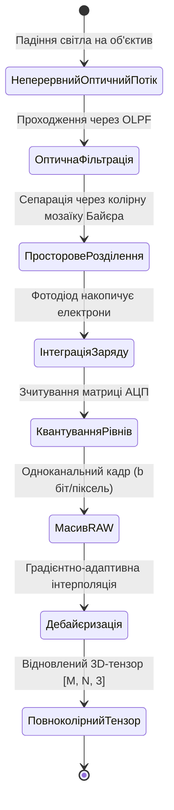
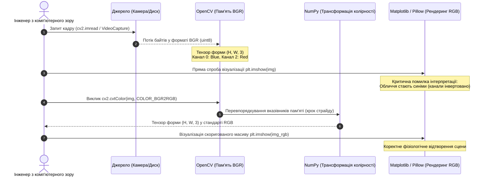
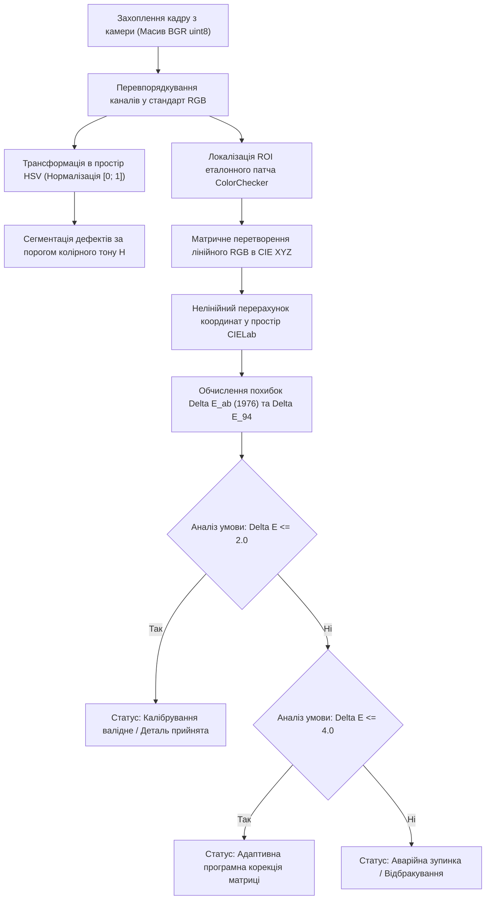

# Тема 5. Цифрове представлення просторових сигналів, сенсорні структури та колориметричні моделі

## Мета лекції

Формування фундаментальної системи теоретичних знань і прикладних інженерних компетенцій щодо математичного опису неперервних двовимірних оптичних полів у вигляді дискретних матриць і багатовимірних тензорів, вивчення фізичних та схемотехнічних принципів первинного просторово-спектрального перетворення оптичного випромінювання за допомогою матричних фотоприймачів із мозаїчними фільтрами Байєра, глибоке засвоєння аксіоматики колориметрії та законів Грасмана, а також опанування строгого аналітичного апарату міжпросторових перетворень (RGB, BGR, HSV, CIE XYZ, CIELab, CMYK) і кількісної оцінки колірних розбіжностей для проектування високоточних комп'ютерно-інтегрованих систем технічного зору та автоматизованого контролю якості.

## Очікувані результати навчання

1. **Знання та розуміння.** Здобувач демонструє системне розуміння математичних моделей просторової дискретизації й амплітудного квантування оптичних сигналів, фізики функціонування фоточутливих напівпровідникових сенсорів КМОН і ПЗЗ із фільтром Байєра, а також трихроматичної теорії зору, явища метамеризму та феноменологічних законів змішування кольорів Грасмана.
2. **Застосування.** Здобувач уміє математично формалізувати операції переходу між адитивними, субтрактивними, циліндричними та рівноконтрастними апаратно-незалежними колірними моделями, нівелювати апаратні конфлікти представлення каналів BGR та RGB на стику інженерних бібліотек OpenCV, Pillow і Matplotlib, а також реалізовувати алгоритми стійкої до перепадів освітлення колірної сегментації.
3. **Аналіз.** Здобувач здатний здійснювати аналітичне дослідження артефактів просторової дискретизації, дефектів дебайєризації та муарових завад, критично порівнювати метричні властивості колірних просторів і декомпозувати спектральний склад багатоканальних зображень із виявленням паразитних кореляцій між хроматичними та яскравісними компонентами.
4. **Оцінювання та синтез.** Здобувач володіє здатністю розробляти комплексні алгоритмічні пайплайни прецизійного колориметричного калібрування оптоелектронних трактів на основі стандартів колірної різниці Delta E (CIE 1976 та CIE 1994), оптимізувати структури даних для мінімізації похибок цілочисельного переповнення й оцінювати обчислювальну складність матрично-тензорних операцій в автономних системах обробки зображень реального часу.

---

## Детальний покроковий план лекції

### 1. Теоретико-концептуальний базис. Математичне моделювання цифрових растрів та сенсорні структури дискретизації полів
* 1.1. Математична формалізація оптичного поля моделлю освітлення-відбиття та перехід від неперервної функції яскравості до двовимірної матриці й 3D-тензора.
* 1.2. Метрологічні характеристики растру: співвідношення просторової роздільної здатності, розрядності квантування за рівнями та системних типів даних у комп'ютерному зорі.
* 1.3. Фізика матричних фотоприймачів КМОН і ПЗЗ, формування повноколірного сигналу мозаїкою Байєра та психофізіологічне обґрунтування надмірності зелених субпікселів.
* 1.4. Просторово-частотний аліасинг у матричних сенсорах, дефекти інтерполяції алгоритмів дебайєризації та оптична фільтрація просторових частот.

### 2. Методологія та аналіз граничних умов. Колориметричні системи, закони Грасмана та метрика колірних відмінностей
* 2.1. Трихроматична модель Юнга-Гельмгольца, феномен метамеризму та система аксіом змішування випромінювань Грасмана.
* 2.2. Адитивний простір RGB, архітектурні особливості чергування каналів BGR в OpenCV і стандартизована модель перетворення в монохромний півтоновий сигнал за стандартом ITU-R BT.601.
* 2.3. Циліндричний простір HSV, нелінійне розділення колірного тону та яскравості як засіб забезпечення інваріантності сегментації до змін інтенсивності освітлення.
* 2.4. Еталонний колориметричний простір CIE XYZ, рівноконтрастна система CIELab та евклідова метрика колірної розбіжності Delta E (стандарти CIE 1976 та CIE 1994).
* 2.5. Критичні бар'єри та вузькі місця теорії колориметрії на практиці: вихід за межі колірного охоплення сенсора, похибки утискання діапазону та обчислювальна деградація при роботі з цілочисельними форматами.

### 3. Практичний індустріальний / фаховий кейс. Прецизійне калібрування системи технічного зору сортувального робототехнічного комплексу
**Тема наскрізної задачі.** «Розробка алгоритмічного конвеєра інваріантної сегментації дефектів та колориметричної корекції промислової камери за еталонною мішенню ColorChecker на базі метрики Delta E»

## 1. Теоретико-концептуальний базис. Математичне моделювання цифрових растрів та сенсорні структури дискретизації полів

### 1.1. Математична формалізація оптичного поля моделлю освітлення-відбиття та перехід від неперервної функції яскравості до двовимірної матриці й 3D-тензора

У математичному моделюванні систем технічного зору неперервне оптичне поле, що формується в площині аналізу оптичної системи, описується неперервною функцією двох просторових координат $f(x, y)$, визначеною на обмеженій компактній ділянці двовимірного евклідового простору $\Omega \subset \mathbb{R}^2$. Фізична природа значення $f(x, y)$ відповідає просторовому розподілу енергетичної яскравості або освітленості, створюваної світловим потоком, відбитим від поверхонь спостережуваних тривимірних об'єктів або генерованим первинними випромінювачами.

Для аналітичного опису процесу формування первинного оптичного сигналу традиційно застосовується феноменологічна **модель освітлення-відбиття** (*illumination-reflection model*). Відповідно до цієї моделі, результуюча функція просторової яскравості $f(x, y)$ представляється як мультиплікативний добуток двох фізично незалежних компонент:

$$f(x, y) = i(x, y) \cdot r(x, y)$$

У цій математичній залежності складова $i(x, y)$ позначає **функцію освітлення**, яка чисельно виражає величину світлового потоку, що падає на спостережувану сцену від зовнішніх первинних чи вторинних джерел випромінювання. Значення функції освітлення обмежені фізичними характеристиками випромінювачів і принципово перебувають у діапазоні $0 < i(x, y) < \infty$, вимірюючись у люксах ($\text{лк}$) або ватах на квадратний метр ($\text{Вт/м}^2$). Друга компонента $r(x, y)$ являє собою просторову **функцію відбиття (альбедо)**, яка повністю визначається фізико-хімічними властивостями матеріалів, геометричним мікрорельєфом та оптичними константами поверхні досліджуваного об'єкта. Значення коефіцієнта відбиття строго нормалізовані енергетичним балансом середовища і лежать у фундаментальних межах $0 \le r(x, y) \le 1$, де нульовий рівень відповідає ідеальному поглинанню світлового потоку абсолютно чорним тілом, а одиничний — абсолютному дзеркальному або ідеально дифузному відбиттю.

> **ПРАКТИЧНИЙ ЯКІР:** В автоматизованій оптичній інспекції напівпровідникових кремнієвих пластин стабільність контролю субмікронних топологічних дефектів досягається шляхом жорсткої стабілізації освітлення $i(x, y)$ за допомогою коаксіальних телецентричних світлодіодних випромінювачів, завдяки чому будь-яка просторова варіація яскравості у відеопотоці трактується виключно як зміна локального коефіцієнта відбиття матеріалу $r(x, y)$, викликана дефектами травлення чи нанесення шару оксиду.

Перетворення неперервної двовимірної функції освітленості $f(x, y)$ у форму, придатну для зберігання, передачі та обробки в цифрових обчислювальних машинах, реалізується за допомогою процедур **просторової дискретизації** та **квантування за рівнем яскравості**. Під просторовою дискретизацією розуміють вимірювання миттєвих значень неперервного оптичного поля на вузлах регулярної двовимірної просторової решітки з періодами $\Delta x$ та $\Delta y$. Якщо розглядати оптичне поле, зареєстроване сенсором, то дискретизація за координатами $x$ та $y$ приводить до формування прямокутної матриці дискретних відліків. Ці просторові відліки називаються елементами зображення або **пікселями** (*picture elements, pixels*).

Для монохромного (півтонового) зображення результатом дискретизації та квантування є числова матриця розмірності $M \times N$, де $M$ задає загальну кількість дискретних рядків по вертикалі, а $N$ визначає кількість стовпців по горизонталі:

$$\mathbf{I} = \begin{bmatrix}
I[0, 0] & I[0, 1] & \dots & I[0, N-1] \\
I[1, 0] & I[1, 1] & \dots & I[1, N-1] \\
\vdots & \vdots & \ddots & \vdots \\
I[M-1, 0] & I[M-1, 1] & \dots & I[M-1, N-1]
\end{bmatrix}$$

У цьому матричному операторі просторовий індекс $m \in [0; M-1]$ задає номер дискретного рядка, зростаючи у напрямку згори вниз, а індекс $n \in [0; N-1]$ відповідає номеру стовпця, зростаючи зліва направо. Початок відліку координат комп'ютерного растра традиційно розміщується у лівому верхньому кутку, що відповідає індексам $(0, 0)$ і принципово відрізняється від класичної правої декартової системи координат.

Для кольорових, мультиспектральних та гіперспектральних зображень математична модель ускладнюється до **тензора третього рангу** розмірності $M \times N \times C$, де просторова площина описується першими двома вимірами, а третій вимір $C$ кодує дискретні спектральні смуги реєстрації світлового потоку:

$$\mathbf{I} \in \mathbb{R}^{M \times N \times C}, \quad I[m, n, c] = \mathcal{Q}\left( \iint_{\Omega_{m,n}} f_c(x, y) \, dx \, dy \right)$$

де $c \in [0; C-1]$ є дискретним індексом спектрального каналу; $\Omega_{m,n}$ представляє просторову область чутливої площадки фотодіода, центрованого у точці з координатами $(n \Delta x, m \Delta y)$; $f_c(x, y)$ позначає просторовий розподіл оптичного випромінювання у межах смуги пропускання оптичного фільтра $c$-го каналу; $\mathcal{Q}(\cdot)$ являє собою нелінійний оператор амплітудного квантування аналогового сигналу в двійковий машинний код. 

У класичних триканальних зображеннях значення $C = 3$ відповідає червоному, зеленому та синьому каналам, а додавання альфа-каналу прозорості формує чотириканальний тензор $M \times N \times 4$.



### 1.2. Метрологічні характеристики растру: співвідношення просторової роздільної здатності, розрядності квантування за рівнями та системних типів даних у комп'ютерному зорі

Метрологічна повнота цифрового растра визначається двома нерозривними характеристиками: **просторовою роздільною здатністю** та **глибиною квантування за рівнем (амплітудною роздільною здатністю)**. Просторова роздільна здатність відображає здатність оптоелектронної системи фіксувати просторово розділені деталі сцени і виражається або абсолютною кількістю дискретних елементів на одиницю фізичної довжини сенсора, або просторовою частотою гранично помітних смуг на міліметр ($\text{ліній/мм}$). У прикладній інформатиці та поліграфії під роздільною здатністю часто використовують величини точок на дюйм (*dots per inch, DPI*) чи пікселів на дюйм (*pixels per inch, PPI*), однак у комп'ютерному зорі коректніше застосовувати фізичний розмір кроку дискретизації (пітч пікселя, $\Delta x, \Delta y$), який зазвичай вимірюється у мікрометрах ($\mu\text{м}$).

Глибина квантування (розрядність квантувача, *bit depth*) $b$ задає число двійкових бітів, виділених для збереження амплітуди цифрового відліку яскравості в кожному просторово-спектральному каналі. Кількість квантованих рівнів шкали яскравості $L$ знаходиться у строгій експоненціальній залежності від розрядності $b$:

$$L = 2^b$$

При аналізі рівномірного квантування діапазону вимірюваної величини $[0; A_{\max}]$ крок квантування за амплітудою становить $\Delta = A_{\max} / (L - 1)$. Похибка квантування $\varepsilon$, що виникає внаслідок округлення неперервної амплітуди до найближчого дискретного рівня, є адитивним шумом квантування. Якщо вважати шум рівномірно розподіленим на інтервалі $[-\Delta/2; +\Delta/2]$, його дисперсія становить величину $\sigma_q^2 = \Delta^2 / 12$. Відповідно, теоретичне відношення потужності сигналу до потужності шуму квантування (*Signal-to-Quantization-Noise Ratio, SQNR*) визначається фундаментальним інженерним співвідношенням:

$$\text{SQNR} \approx 6.02 \cdot b + 1.76 \quad [\text{дБ}]$$

Зі збільшенням розрядності квантування на кожен додатковий біт відношення сигнал/шум покращується орієнтовно на $6\text{ дБ}$, що забезпечує значне розширення динамічного діапазону реєстрованого випромінювання.

Вибір системного типу даних для внутрішнього представлення матриць і тензорів у програмних комплексах визначається балансом між потрібною точністю проміжних обчислень, динамічним діапазоном значень та обсягом виділеної оперативної пам'яті. Сучасні бібліотеки комп'ютерного зору (OpenCV, SciPy, Pillow) використовують стандартизовані типи структур мови Python та бібліотеки NumPy:

| Машинний тип даних | Розрядність ($b$) | Діапазон значень | Кількість рівнів | Приклад з реальної практики |
| :--- | :---: | :---: | :---: | :--- |
| **`bool_ / uint1`** | 1 біт | $\{0, 1\}$ | 2 | Бінарні маски семантичної сегментації, оптичне розпізнавання символів (OCR) |
| **`uint8 / CV_8U`** | 8 біт | $0 \dots 255$ | 256 | Візуалізація sRGB у споживчих моніторах, виведення відеопотоків кодеків H.264 |
| **`uint16 / CV_16U`** | 16 біт | $0 \dots 65535$ | 65 536 | Рентгенівська та комп'ютерна томографія (стандарт DICOM), сенсори нічного бачення |
| **`int16 / CV_16S`** | 16 біт | $-32768 \dots 32767$ | 65 536 | Просторові градієнти першого порядку операторів Собеля та Лапласа |
| **`int32 / CV_32S`** | 32 біти | $-2^{31} \dots 2^{31}-1$ | $4.29 \times 10^9$ | Карти маркування ізольованих об'єктів алгоритмів зв'язних компонентів |
| **`float32 / CV_32F`** | 32 біти | $\approx \pm 3.4 \times 10^{38}$ | Неперервний ($\approx 7$ цифр) | Двовимірне швидке перетворення Фур'є (2D-FFT), згорткові нейромережі |
| **`float64 / CV_64F`** | 64 біти | $\approx \pm 1.8 \times 10^{308}$ | Неперервний ($\approx 16$ цифр) | Прецизійна фотограмметрія, калібрування камер субпіксельної точності |

Розрахунок необхідного фізичного обсягу пам'яті $S_{\text{mem}}$ для нестиснутого зображення виконується множенням просторових розмірів на глибину кольору і кількість каналів:

$$S_{\text{mem}} = M \cdot N \cdot C \cdot \frac{b}{8} \quad [\text{байт}]$$

Для кадру сучасного відеопотоку формату 4K UHD ($3840 \times 2160$ пікселів) із представленням RGB ($C = 3$) та стандартною глибиною $b = 8\text{ біт}$ розмір одного нестиснутого растра у пам'яті становить близько $24.88\text{ Мбайт}$. Якщо ж для підвищення динамічного діапазону в медичній діагностиці чи науковій астрофотометрії використовується 16-бітне представлення або 32-бітне представлення з плаваючою комою, обсяг оперативної пам'яті на один кадр подвоюється або зростає у чотири рази відповідно.

> **ТИПОВА ПОМИЛКА:** Ототожнення геометричного розміру матриці цифрового зображення ($M \times N$ пікселів) із реальною просторовою роздільною здатністю оптичної системи. Збільшення кількості пікселів сенсора шляхом зменшення їх фізичного розміру без підвищення оптичної якості об'єктива не веде до зростання роздільної здатності системи, оскільки гранична просторова частота обмежується дифракційною плямою Ейрі об'єктива, що описується критерієм Релея, і призводить лише до розмиття зображення по надмірно великій кількості сусідніх пікселів.

### 1.3. Фізика матричних фотоприймачів КМОН і ПЗЗ, формування повноколірного сигналу мозаїкою Байєра та спектральна перевага зелених субпікселів

Отримання просторових матриць у цифрових камерах базується на напівпровідникових сенсорах, які за технологією виготовлення та архітектурою зчитування сигнального заряду поділяються на прилади із зарядовим зв'язком (**ПЗЗ**, *Charge-Coupled Device, CCD*) та структури на базі комплементарних метало-оксидних напівпровідників (**КМОН**, *Complementary Metal-Oxide-Semiconductor, CMOS*). В обох типах сенсорів первинним фізичним механізмом детектування виступає внутрішній фотоелектричний ефект: поглинання квантів світла (фотонів) у кристалі кремнію спричиняє генерацію електронно-діркових пар у збідненій зоні $p-n$ переходу. Кількість накопиченого заряду в потенційній ямі пропорційна інтегралу освітленості за час експозиції.

Головна відмінність між технологіями полягає у топології зчитування зарядових пакетів. У ПЗЗ-сенсорах накопичені заряди передаються вздовж стовпців матриці за допомогою послідовного тактування зсувних регістрів до загального вихідного підсилювача, що мінімізує апаратну дисперсію підсилення, але обмежує швидкість вибірки. У КМОН-сенсорах кожен піксель являє собою активну структуру (*Active Pixel Sensor, APS*), яка крім фотодіода містить власні транзистори скидання, вибірки та посилення, перетворюючи накопичений заряд на електричну напругу безпосередньо всередині комірки. Це дає змогу реалізувати паралельне аналого-цифрове перетворення безпосередньо на кристалі за стовпцевою архітектурою, забезпечуючи високу швидкодію, низьке енергоспоживання та довільний доступ до виділених фрагментів матриці.

Кремнієві фотоприймачі володіють власною спектральною чутливістю, яка охоплює діапазон хвиль від $350\text{ нм}$ (ближній ультрафіолет) до $1100\text{ нм}$ (ближній інфрачервоний діапазон). Проте кремнієвий фотодіод інтегрує енергію всього падаючого спектра і сам по собі є спектрально сліпим: він не може відрізнити потік фотонів червоного світла високої інтенсивності від потоку фотонів синього світла низької інтенсивності. 

Для формування кольорового зображення застосовують просторовий кольороподіл. Найпоширенішим апаратним рішенням є нанесення на поверхню кристала матричного колірного фільтра (**CFA**, *Color Filter Array*). Найпоширенішою геометрією CFA є **мозаїчний фільтр Байєра** (*Bayer filter*), запатентований інженером компанії Eastman Kodak Брюсом Байєром у 1976 році. 

```
+---+---+      Шаблон мозаїки Байєра (RGGB)
| R | G |      R: Червоний субпіксель (25% площі)
+---+---+      G: Зелений субпіксель  (50% площі)
| G | B |      B: Синій субпіксель    (25% площі)
+---+---+
```

Шаблон фільтра Байєра складається з періодичних повторюваних елементарних комірок розміром $2 \times 2$ субпікселі, типова конфігурація яких містить два зелених фільтри (G), один червоний (R) та один синій (B), утворюючи просторові патерни конфігурацій RGGB, BGGR, GBRG або GRBG. У структурі матриці Байєра елементи зеленого кольору займають рівно $50\%$ від загальної корисної площі світлочутливої зони, тоді як на червоні та сині компоненти припадає лише по $25\%$ просторової вибірки.

Така просторова диспропорція спирається на психофізіологічні особливості функціонування зорової системи людини. Чутливість зорового апарату за умов денного зору описується стандартизованою функцією відносної спектральної світлової ефективності монохроматичного випромінювання $V(\lambda)$, що має виражений максимум на довжині хвилі $\lambda \approx 555\text{ нм}$, що локалізована в зеленій зоні спектра. 

Анатомічно на фовеальній ділянці сітківки людського ока густина колбочок типу $M$ (чутливих до зеленого світла) та типу $L$ (чутливих до жовто-червоного світла) у десятки разів перевершує кількість колбочок типу $S$ (синього діапазону). Саме інформація із зеленого каналу є основним джерелом формування суб'єктивного відчуття контурної різкості, просторової структури та дрібномасштабних деталей зображення. Мозок сприймає червоні та сині складові переважно як хроматичне забарвлення, будучи менш чутливим до втрати просторової чіткості в цих діапазонах.

> **ПРАКТИЧНИЙ ЯКІР:** У сенсорах систем комп'ютерного зору автономних транспортних засобів (наприклад, у спеціалізованих камерах систем ADAS) замість класичного патерну RGGB нерідко використовують модифіковані мозаїки типу RCCC (один червоний піксель і три прозорих) або RCCB, де зелені субпікселі замінені повністю прозорими (*Clear*). Це усуває втрати на поглинання світлофільтрами, підвищує чутливість матриці в умовах нічного водіння втричі та зберігає червоний канал, критично важливий для детектування стоп-сигналів і світлофорів.

### 1.4. Просторово-частотний аліасинг у матричних сенсорах, дефекти інтерполяції алгоритмів дебайєризації та оптична фільтрація просторових частот

Вихідний масив відліків, що зчитується з матриці фотоприймача з фільтром Байєра, є одноканальним масивом даних у форматі **RAW**. Кожен окремий піксель цього масиву містить значення інтенсивності, виміряне лише для однієї довжини хвилі ($R$, $G$ або $B$). Для відновлення тривимірного тензора повноколірного зображення $\mathbf{I} \in \mathbb{R}^{M \times N \times 3}$, в якому кожен піксель повинен мати повний вектор колірних координат $(R, G, B)$, застосовується операція відновлення пропущених відліків — **демозаїка (дебайєризація, *demosaicing*)**.

Найпростішим способом дебайєризації є **білінійна просторова інтерполяція**. При такому підході відсутні значення яскравості в точці розраховуються як середнє арифметичне сусідніх зареєстрованих відліків аналогічного спектрального каналу. Для центрального зеленого пікселя у позиції червоного субпікселя обчислення виконується за чотирма сусідніми елементами з просторового околу фон Неймана:

$$G[m, n] = \frac{1}{4} \Big( G[m-1, n] + G[m+1, n] + G[m, n-1] + G[m, n+1] \Big)$$

Для знаходження значень червоного каналу на позиції синього пікселя використовують середнє значення чотирьох діагональних червоних сусідів:

$$R[m, n] = \frac{1}{4} \Big( R[m-1, n-1] + R[m-1, n+1] + R[m+1, n-1] + R[m+1, n+1] \Big)$$

Незважаючи на мінімальну обчислювальну складність, лінійна інтерполяція призводить до виникнення візуальних артефактів: замилювання границь, помилкової кольорової облямівки на різких контурах і спотворення тонких ліній (*zippering effect*). У високоякісних системах комп'ютерного зору використовують адаптивні градієнтні методи інтерполяції (алгоритм Мальвара-Хе-Катлера чи інтерполяцію із збереженням градієнтів країв), у яких напрямок інтерполяційного усереднення обирається уздовж, а не впоперек виявлених просторових границь об'єктів.

Процес первинного формування растру схильний до фундаментальних фізико-математичних обмежень, обумовлених двовимірною **теоремою Котельникова-Шеннона (Найквіста)**. Відповідно до цієї теореми, неперервне оптичне поле з обмеженим просторовим спектром може бути відновлене без втрати інформації тоді й тільки тоді, коли просторова частота дискретизації сенсора по осях $x$ та $y$ перевищує подвійну максимальну просторову частоту спектра оптичного поля:

$$f_{s, x} = \frac{1}{\Delta x} \ge 2 f_{\max, x}, \quad f_{s, y} = \frac{1}{\Delta y} \ge 2 f_{\max, y}$$

де $f_{\max, x}$ та $f_{\max, y}$ — граничні просторові частоти оптичного поля; $\Delta x, \Delta y$ — геометричні періоди розташування пікселів на поверхні напівпровідникового кристала; частоти $f_{N, x} = \frac{1}{2 \Delta x}$ та $f_{N, y} = \frac{1}{2 \Delta y}$ є просторовими частотами Найквіста.

Якщо сцена містить високочастотні просторові структури (дрібні періодичні сітки, текстури тканин, решітки огорож, цегляні кладки), просторова частота яких перевищує частоту Найквіста ($f > f_N$), виникає ефект незворотного накладання частот — **просторовий аліасинг** (*spatial aliasing*). Високі просторові частоти дзеркально відбиваються в область низьких просторових частот, створюючи на результуючому растрі несправжні хвильові інтерференційні структури — **муар** (*moiré patterns*). Оскільки крок просторової решітки для червоного і синього каналів мозаїки Байєра у $\sqrt{2}$ або 2 рази більший за фізичний крок матриці фотодіодів, хроматичний аліасинг виникає на нижчих просторових частотах, ніж яскравісний, проявляючись у вигляді помилкового кольорового муару.



Для запобігання просторовому аліасингу в оптико-електронний тракт перед світлочутливою матрицею інтегрують спеціалізований пасивний оптичний компонент — **оптичний фільтр низьких просторових частот** (**ОФНЧ**, *Optical Low-Pass Filter, OLPF* або *anti-aliasing filter*). Конструктивно такий фільтр виготовляється із декількох тонких пластин двозаломлюючого кристала кварцу або ніобату літію. Поляризаційний розщеплювач просторово розділяє падаючий промінь світла на звичайний і незвичайний промені, зміщені на відстань, що дорівнює радіусу розмиття плями розсіювання точки. 

ОФНЧ діє як фізичний двовимірний фільтр низьких частот: він подавляє амплітуду просторових гармонік оптичного поля на частотах вище частоти Найквіста матриці фотоприймача ($f > f_N$), мінімізуючи виникнення муарових структур ціною незначного спаду загальної мікроконтрастності та різкості вихідного зображення.

> **КОНТРОЛЬНЕ ПИТАННЯ:** Чому на монохромних промислових камерах систем технічного зору, де використовується МФП без фільтра Байєра, рідко встановлюють оптичні фільтри низьких частот (OLPF), тоді як у побутових трикомпонентних колірних камерах аналогічної роздільної здатності їх наявність є обов'язковою?

<details markdown="1">
<summary>Розгорнути аналіз / відповідь</summary>

**Правильний варіант: У монохромних матрицях просторова частота Найквіста вдвічі вища, а також відсутній хроматичний аліасинг.**

1. У монохромній матриці кожен сусідній піксель реєструє повнодіапазонний сигнал, а крок дискретизації $\Delta x$ дорівнює фізичному кроку розташування фотодіодів. Відповідно, просторова гранична частота Найквіста становить $f_N = 1 / (2\Delta x)$. У матрицях із фільтром Байєра кроки просторової вибірки для червоного і синього каналів подвоюються ($2\Delta x$), через що їхня частота Найквіста знижується до $f_N / 2$. За відсутності OLPF у байєрівському сенсорі просторові частоти в діапазоні $[f_N/2; f_N]$ неминуче спричиняють виникнення висококонтрастного кольорового муару, який неможливо усунути програмною дебайєризацією. У монохромному сенсорі аліасинг можливий лише як високочастотний яскравісний шум на значно вищих частотах без фальшивої зміни колірних координат, тому заради збереження максимальної мікрорізкості OLPF вилучають із оптичного тракту.

2. Аналіз дистракторів (чому інші варіанти є хибними на практиці):
   - Припущення, що монохромні об'єктиви володіють вищою дифракційною якістю, є некоректним, оскільки оптичні спотворення визначаються конструкцією лінз об'єктива, а не типом фотоматриці.
   - Твердження, ніби монохромні сенсори оперують виключно коліматорним світлом і не зазнають заломлення, є фізично помилковим, адже характер розсіювання світла залежить від властивостей відбивної поверхні сцени, а не від структури сенсора.
   - Теза про те, що програмне усунення муару в монохромних зображеннях є простішим за рахунок лінійних операцій, не відповідає дійсності: просторовий аліасинг є математично незворотною операцією накладання спектрів, і відновити втрачені частоти без апріорних даних неможливо незалежно від монохромності кадру.

</details>

### Вказівки для самостійного осмислення

1. Розрахуйте аналітично мінімальну розрядність квантування за рівнем $b$, необхідну для забезпечення теоретичного динамічного діапазону оптоелектронного тракту не менше ніж $72\text{ дБ}$ за умови використання лінійного аналого-цифрового перетворювача без попереднього логарифмічного стиснення сигналу.
2. Проаналізуйте просторовий спектр дискретної мозаїки Байєра конфігурації GRBG та побудуйте двовимірну область Найквіста для зеленого каналу, зіставивши її з областями Найквіста червоного та синього спектральних каналів.
3. Оцініть обчислювальну складність алгоритму білінійної дебайєризації для кадру роздільною здатністю $4096 \times 2160$ пікселів, визначивши сумарну кількість операцій додавання та бітового зсуву, необхідних для обробки одного кадру відеопотоку в режимі реального часу з частотою 60 кадрів на секунду.


## 2. Методологія та аналіз граничних умов. Колориметричні простори, закони Грасмана та міжпросторові трансформації

### 2.1. Трихроматична модель Юнга-Гельмгольца, феномен метамеризму та система аксіом змішування випромінювань Грасмана

Методологія сучасного колірного аналізу в комп'ютерних системах базується на психофізичній моделі зорового сприйняття, концептуальні основи якої були закладені Томасом Юнгом і Германом фон Гельмгольцем. Згідно з трихроматичною теорією, довільний спектральний склад оптичного випромінювання редукується рецепторним апаратом ока до трьох скалярних величин, що відповідають інтегральним відгукам колбочок сітківки $S$-, $M$- та $L$-типів. Математично цей процес є проекцією нескінченновимірного функціонального простору спектральних густин потужності $S(\lambda)$ на тривимірний векторний підпростір фізіологічних стимулів.

Безпосереднім наслідком такої розмірнісної редукції виступає феномен **метамеризму**, за якого два оптичні випромінювання з абсолютно різними спектральними функціями розподілу потужності $S_1(\lambda) \neq S_2(\lambda)$ формують тотожні зорові відчуття. Умова метамерної еквівалентності записується системою лінійних інтегральних рівнянь:

$$\int_{\lambda_{\min}}^{\lambda_{\max}} S_1(\lambda) \, \bar{c}_i(\lambda) \, d\lambda = \int_{\lambda_{\min}}^{\lambda_{\max}} S_2(\lambda) \, \bar{c}_i(\lambda) \, d\lambda, \quad i \in \{1, 2, 3\}$$

де $\bar{c}_i(\lambda)$ позначають стандартизовані функції колірного зрівнювання або спектральні чутливості фоторецепторів, а межі інтегрування $[\lambda_{\min}; \lambda_{\max}]$ охоплюють видимий діапазон довжин хвиль від $380\text{ нм}$ до $780\text{ нм}$. Феномен метамеризму робить технічно можливим повноцінне відтворення широкої гами природних кольорів за допомогою змішування випромінювань лише трьох фіксованих базових джерел (емітерів монітора чи світлофільтрів камери).

Формалізація операцій змішування некогерентних світлових потоків описується чотирма феноменологічними законами Грасмана, сформульованими у 1854 році, які визначають лінійні та алгебраїчні властивості колориметричного простору:

Перший закон Грасмана постулює тривимірність кольору: для однозначного опису будь-якого колірного відчуття необхідно і достатньо рівно трьох лінійно незалежних компонент. Жоден із трьох базових кольорів не може бути отриманий оптичним змішуванням двох інших.

Другий закон Грасмана декларує неперервність колірного простору: при плавному, монотонному варіюванні спектрального складу оптичного випромінювання результуючий колір суміші змінюється без розривів і стрибків, що забезпечує диференційовність міжпросторових функціональних відображень.

Третій закон Грасмана встановлює лінійність та адитивність процесів змішування: результат оптичного сумування залежить виключно від колориметричних координат складових частин, а не від їх первинного спектрального складу. Якщо дві пари джерел володіють попарною метамерною еквівалентністю $\mathbf{C}_1 \equiv \mathbf{C}_2$ та $\mathbf{C}_3 \equiv \mathbf{C}_4$, то суміш $\mathbf{C}_1 + \mathbf{C}_3$ сприймається ідентично суміші $\mathbf{C}_2 + \mathbf{C}_4$, а пропорційна зміна інтенсивності $k \mathbf{C}_1$ веде до еквівалентної зміни сприйняття $k \mathbf{C}_2$.

Четвертий закон Грасмана стверджує закон адитивності інтегральної світності: повна фотометрична яскравість складної адитивної колірної суміші дорівнює арифметичній сумі парціальних яскравостей її окремих випромінюваних компонентів:

$$L(\mathbf{C}) = \sum_{j=1}^{3} T_j L(\mathbf{P}_j)$$

де $T_j$ є координатами досліджуваного кольору у вибраному базисі, а $L(\mathbf{P}_j)$ являють собою коефіцієнти фотометричної яскравості одиничних кількостей основних базисних кольорів $\mathbf{P}_j$.

> **ВАЖЛИВО:** Закони Грасмана залишаються справедливими виключно в умовах денного (фотопічного) зору за яскравостей понад $10\text{ кд/м}^2$, коли функціонують лише колбочки. При переході до сутінкового (мезопічного) чи нічного (скотопічного) зору активуються палички сітківки, що руйнує лінійність колориметричних систем унаслідок ефекту Пуркінє (зміщення максимуму відносної світлової чутливості з $555\text{ нм}$ у короткохвильову область $507\text{ нм}$).

### 2.2. Адитивний простір RGB, архітектурні особливості чергування каналів BGR в OpenCV і стандартизована модель перетворення в монохромний півтоновий сигнал за стандартом ITU-R BT.601

Адитивна колірна модель **RGB** спирається на синтез випромінювань трьох базових довжин хвиль: монохроматичного червоного ($R$, $\lambda = 700.0\text{ нм}$), зеленого ($G$, $\lambda = 546.1\text{ нм}$) та синього ($B$, $\lambda = 435.8\text{ нм}$). Математично простір представляється замкненим тривимірним одиничним кубом $[0; 1]^3$, точки головної діагоналі якого від вершини $(0, 0, 0)$ до $(1, 1, 1)$ утворюють ахроматичну лінію градацій сірого.

У практичній інженерії обробки зображень існує критичний архітектурний конфлікт внутрішнього представлення пам'яті між різними бібліотеками. Бібліотека **OpenCV** історично зберігає та обробляє растрові багатоканальні масиви з чергуванням байтів у послідовності **BGR** (Blue, Green, Red). Це рішення було зумовлене сумісністю зі стандартами апаратного кодування фреймграберів Intel та форматом файлів Windows Bitmap (BMP) наприкінці 1990-х років. Навпаки, переважна більшість графічних бібліотек Python загального призначення, зокрема **Pillow**, **Matplotlib** та веб-рушії, стандартизовані на порядок проходження каналів **RGB**.



Для декомпозиції повноколірного сигналу на монохромне півтонове представлення не можна застосовувати просте арифметичне усереднення каналів $(R + G + B)/3$, оскільки зорова система сприймає яскравість довжин хвиль нерівномірно. Міжнародний телекомунікаційний союз у рекомендації **ITU-R BT.601** стандартизував аналітичний розрахунок нормованого сигналу яскравості $Y$ для систем стандартної чіткості:

$$Y = 0.2989 \cdot R + 0.5870 \cdot G + 0.1140 \cdot B$$

Для телебачення високої чіткості застосовується уточнена специфікація **ITU-R BT.709**, яка використовує змінені коефіцієнти відповідно до іншого колірного охоплення люмінофорів сучасних дисплеїв:

$$Y_{709} = 0.2126 \cdot R + 0.7152 \cdot G + 0.0722 \cdot B$$

В обох випадках зелений канал забезпечує понад $58-71\%$ сумарної яскравості пікселя. В оптимізованих низькорівневих модулях обчислення виконуються в цілочисельній арифметиці з фіксованою комою (*fixed-point arithmetic*) для виключення витратних операцій з рухомою комою, наприклад, через бітовий зсув на 16 розрядів:

$$Y = (19595 \cdot R + 38469 \cdot G + 7472 \cdot B + 32768) \gg 16$$

де цілі множники отримані нормалізацією коефіцієнтів BT.601 до шкали $2^{16} = 65536$.

### 2.3. Циліндричний простір HSV, нелінійне розділення колірного тону та яскравості як засіб забезпечення інваріантності сегментації до змін інтенсивності освітлення

Колірна модель **HSV** (*Hue, Saturation, Value*) формується шляхом нелінійної деформації декартового куба RGB у циліндричну систему координат. Її методологічна перевага полягає в ортогоналізації геометричного положення: суто хроматичні характеристики випромінювання (колірний тон і насиченість) повністю відокремлюються від ахроматичної енергетичної складової (яскравості).

Аналітичний алгоритм перерахунку компонент із нормованого простору $R, G, B \in [0; 1]$ у координати $H \in [0^\circ; 360^\circ]$, $S \in [0; 1]$, $V \in [0; 1]$ формалізується наступною послідовністю кроків:

$$
\begin{aligned}
\text{Крок 1 (Екстремуми та розмах):} & \quad V_{\max} = \max(R, G, B), \quad V_{\min} = \min(R, G, B), \quad \Delta = V_{\max} - V_{\min} \\
\text{Крок 2 (Обчислення яскравості):} & \quad V = V_{\max} \\
\text{Крок 3 (Розрахунок насиченості):} & \quad S = \begin{cases} 0, & \text{якщо } V = 0 \\ \frac{\Delta}{V}, & \text{якщо } V \neq 0 \end{cases} \\
\text{Крок 4 (Визначення колірного тону):} & \quad H = \begin{cases} 
0^\circ, & \text{якщо } \Delta = 0 \\
60^\circ \cdot \left( \frac{G - B}{\Delta} \bmod 6 \right), & \text{якщо } V_{\max} = R \\
60^\circ \cdot \left( \frac{B - R}{\Delta} + 2 \right), & \text{якщо } V_{\max} = G \\
60^\circ \cdot \left( \frac{R - G}{\Delta} + 4 \right), & \text{якщо } V_{\max} = B
\end{cases} \\
\text{Крок 5 (Масштабування діапазону):} & \quad H = H + 360^\circ \quad \text{при } H < 0^\circ
\end{aligned}
$$

У системній архітектурі бібліотеки OpenCV для компактного представлення у 8-бітному беззнаковому форматі `uint8` параметри трансформуються: колірний тон $H$ ділиться на два ($H_{\text{CV}} = H / 2 \in [0; 179]$), а насиченість і яскравість розгортаються на повну 8-бітну шкалу ($S_{\text{CV}} = S \cdot 255$, $V_{\text{CV}} = V \cdot 255$).

Інженерна цінність простору HSV під час колірної сегментації полягає в тому, що природні зміни освітленості сцени (затінення, кут падіння світла, нестабільність живлення ламп) викликають зміщення переважно вздовж осі $V$, слабо деформуючи значення $H$ та $S$. 

У просторі RGB аналогічне затінення викликає корельований спад усіх трьох координат $(R, G, B)$, що руйнує статичні порогові маски. Сегментація цільового класу об'єктів у просторі HSV описується селективним гіперпаралелепіпедом:

$$I_{\text{mask}}[m, n] = \begin{cases}
1, & \text{якщо } (H_{\min} \le H[m,n] \le H_{\max}) \land (S_{\min} \le S[m,n] \le S_{\max}) \land (V_{\min} \le V[m,n] \le V_{\max}) \\
0, & \text{в інших випадках}
\end{cases}$$

> **ПРАКТИЧНИЙ ЯКІР:** У роботизованих агропромислових комплексах сортування томатів конвеєрного типу алгоритм детектування зрілості оперує пороговими масками колірного тону $H \in [0; 10]$ (червоний спектр) та $H \in [35; 45]$ (зелений спектр) у просторі HSV. Завдяки цьому якість відбору залишається стабільною за перепадів зовнішньої освітленості цеху в межах до $45\%$, що було б неможливо у просторі RGB без застосування важких згорткових нейромереж.

### 2.4. Еталонний колориметричний простір CIE XYZ, рівноконтрастна система CIELab та евклідова метрика колірної розбіжності Delta E (стандарти CIE 1976 та CIE 1994)

Колориметрична система **CIE XYZ (1931 р.)** була розроблена для подолання принципового недоліку експериментальної системи RGB — необхідності введення від'ємних коефіцієнтів змішування для синтезу деяких спектрально чистих кольорів на ділянці $435-546\text{ нм}$. Шляхом лінійного перетворення базисних векторів було створено умовні нефізичні координати $X, Y, Z$, що охоплюють увесь колірний локус людини з виключно додатними значеннями. При цьому крива додавання $\bar{y}(\lambda)$ була цілеспрямовано поєднана зі стандартизованою спектральною світловою ефективністю монохроматичного випромінювання для денного зору $V(\lambda)$, внаслідок чого координата $Y$ строго чисельно визначає повну яскравість світлового потоку.

Міжпросторове перетворення лінійного вектора $(R, G, B)$ у координати $(X, Y, Z)$ для стандартного білого опорного джерела **D65** ($6504\text{ К}$) описується матричним рівнянням:

$$\begin{bmatrix} X \\ Y \\ Z \end{bmatrix} = \begin{bmatrix}
0.412453 & 0.357580 & 0.180423 \\
0.212671 & 0.715160 & 0.072169 \\
0.019334 & 0.119193 & 0.950227
\end{bmatrix} \begin{bmatrix} R \\ G \\ B \end{bmatrix}$$

Суттєвим недоліком систем RGB та CIE XYZ є їхня сильна просторова **нерівноконтрастність**: однаковим евклідовим відстаням між точками колірного простору в різних його ділянках відповідають кардинально різні суб'єктивні відчуття відмінності кольору для ока (еліпси розрізнення Мак-Адама у зеленій зоні у десятки разів більші за еліпси у синій ділянці).

Для усунення цієї нелінійності Міжнародна комісія з освітлення у 1976 році затвердила рівноконтрастний апаратно-незалежний простір **CIELab ($L^*a^*b^*$)**, заснований на опонентній теорії Евальда Герінга. Координата $L^*$ визначає перцептивну світлоту від 0 (чорний) до 100 (білий), вісь $a^*$ кодує положення на шкалі від зеленого (від'ємні значення) до червоного (додатні значення), а вісь $b^*$ — від синього (від'ємні) до жовтого (додатні):

$$
\begin{aligned}
\text{Крок 1 (Світлота):} & \quad L^* = 116 \cdot f\left(\frac{Y}{Y_n}\right) - 16 \\
\text{Крок 2 (Хроматична вісь a):} & \quad a^* = 500 \cdot \left[ f\left(\frac{X}{X_n}\right) - f\left(\frac{Y}{Y_n}\right) \right] \\
\text{Крок 3 (Хроматична вісь b):} & \quad b^* = 200 \cdot \left[ f\left(\frac{Y}{Y_n}\right) - f\left(\frac{Z}{Z_n}\right) \right]
\end{aligned}
$$

де $X_n = 0.95047$, $Y_n = 1.00000$, $Z_n = 1.08883$ є координатами опорного білого світла D65, а кусково-неперервна функція $f(q)$ компенсує нелінійність сприйняття:

$$f(q) = \begin{cases}
q^{1/3}, & \text{якщо } q > \left(\frac{6}{29}\right)^3 \approx 0.008856 \\
\frac{1}{3}\left(\frac{29}{6}\right)^2 q + \frac{4}{29} \approx 7.787 q + \frac{16}{116}, & \text{якщо } q \le 0.008856
\end{cases}$$

Кількісна міра розрізнення двох кольорів $\mathbf{C}_1 = (L_1^*, a_1^*, b_1^*)$ та $\mathbf{C}_2 = (L_2^*, a_2^*, b_2^*)$ у стандарті **CIE 1976** розраховується як звичайна евклідова відстань у тривимірному просторі:

$$\Delta E_{ab}^* = \sqrt{(L_1^* - L_2^*)^2 + (a_1^* - a_2^*)^2 + (b_1^* - b_2^*)^2}$$

Уточнений промисловий стандарт **CIE 1994** вводить коригувальні вагові коефіцієнти, що враховують залежність порогів сприйняття від вихідної насиченості ($C_1^* = \sqrt{(a_1^*)^2 + (b_1^*)^2}$):

$$\Delta E_{94}^* = \sqrt{\left(\frac{\Delta L^*}{k_L S_L}\right)^2 + \left(\frac{\Delta C_{ab}^*}{k_C S_C}\right)^2 + \left(\frac{\Delta H_{ab}^*}{k_H S_H}\right)^2}$$

де $\Delta C_{ab}^* = C_1^* - C_2^*$, різниця за колірним тоном $\Delta H_{ab}^* = \sqrt{(\Delta a^*)^2 + (\Delta b^*)^2 - (\Delta C_{ab}^*)^2}$, вагові функції $S_L = 1$, $S_C = 1 + 0.045 C_1^*$, $S_H = 1 + 0.015 C_1^*$, а коефіцієнти умов перегляду за замовчуванням дорівнюють $k_L = k_C = k_H = 1$.

### 2.5. Критичні бар'єри та обчислювальні обмеження нелінійних перетворень між неортогональними колірними просторами з виходом за межі охоплення (gamut clipping) та втратою точності цілочисельної арифметики

Застосування викладених колориметричних моделей у реальних автоматизованих системах стикається з низкою критичних апаратних та алгоритмічних бар'єрів:

Математична сингулярність циліндричних просторів: під час конвертації пікселів у простір HSV на ахроматичній осі (де $R = G = B$, відповідно $\Delta = 0$) або за нульової яскравості ($V = 0$) значення колірного тону $H$ є невизначеним (ділення $0/0$). У практичних системах це призводить до випадкового викиду значення кута під дією навіть мізерного апаратного шуму АЦП фотодіода. При спробі сегментації темних об'єктів або областей із глибокими тінями за кутом $H$ маска стає хаотично поцяткованою помилковими спрацьовуваннями.

Вихід за межі колірного охоплення (**Gamut Clipping**): фізичні простори пристроїв відтворення та реєстрації володіють різними областями допустимих кольорів. Під час міжпросторової трансформації (наприклад, перерахунку з широкого простору Adobe RGB або CIELab у вузький апаратний простір sRGB чи поліграфічний CMYK) обчислені координати можуть виходити за межі валідного фізичного інтервалу $[0; 1]$. Жорстке відсікання значень (*clipping*) за межами діапазону спричиняє повну втрату тональних градацій і текстурних деталей у зонах екстремальної насиченості.

Деградація динамічного діапазону при квантуванні: перетворення між просторами вимагає нелінійних піднесень до степеня ($q^{1/3}$, логарифмування, тригонометричні обчислення). Якщо такі операції виконуються безпосередньо над 8-бітними цілими числами без попереднього переведення у 32-бітні типи з рухомою комою (`float32`), виникає накопичення похибок округлення. Зокрема, утискання діапазону тону $H \in [0^\circ; 360^\circ]$ у байтовий формат $H \in [0; 179]$ бібліотеки OpenCV призводить до квантування колірного тону з кроком у $2^\circ$, що унеможливлює субпіксельну колориметричну диференціацію близьких відтінків на високоточних спектрофотометричних лініях.

| Колірний простір | Математична природа | Цільове функціональне призначення | Складність впровадження | Критичні ризики / Обмеження |
| :--- | :--- | :--- | :--- | :--- |
| **RGB / BGR** | Лінійний / Адитивний декартів куб | Захоплення кадрів камерами, відображення на LED/OLED матрицях | Низька (базова адресна арифметика масивів пам'яті) | Висока кореляція між хроматичними осями; нестабільність до перепадів освітлення |
| **HSV / HSL** | Нелінійна циліндрична проекція куба RGB | Комп'ютерний зір, сегментація об'єктів за спектральним тоном | Середня (вимагає кускових перевірок умов та операцій $\bmod$) | Математична сингулярність на ахроматичній осі; шум $H$ при низьких значеннях $S$ і $V$ |
| **CIE XYZ** | Лінійний базис умовних додатних стимулів | Апаратно-незалежний еталон для перерахунку між просторами | Низька (множення вектора на статичну матрицю $3 \times 3$) | Нелінійність евклідової відстані; невідповідність суб'єктивним порогам ока |
| **CIELab** | Нелінійний рівноконтрастний простір | Метрологія, контроль якості друку, розрахунок колірної похибки $\Delta E$ | Висока (розрахунок кубічних коренів і нелінійної кускової функції) | Неможливість прямої апаратної візуалізації без зворотного відображення в RGB |
| **CMYK** | Субтрактивна чотирикомпонентна модель | Поліграфія, керування друкарськими машинами, офсетний друк | Висока (нелінійні алгоритми генерації чорного каналу UCR/GCR) | Вузьке колірне охоплення; критична залежність від фізики барвника і паперу |

> **КОНТРОЛЬНЕ ПИТАННЯ:** Під час розробки роботизованої системи сортування червоних деталей на конвеєрі інженер налаштував сегментацію у просторі HSV через діапазон тону $H_{\text{OpenCV}} \in [170; 10]$. Проте під час тестування виявилося, що маска взагалі не виділяє об'єкти, повертаючи порожнє чорне бінарне зображення. У чому полягає фундаментальна алгоритмічна помилка та як її усунути?

<details markdown="1">
<summary>Розгорнути аналіз / відповідь</summary>

**Правильний варіант: Розрив кутової шкали в околі нуля вимагає диз'юнкції двох порогових умов.**

1. Кут колірного тону $H$ у просторі HSV є циклічною координатою на колі ($0^\circ \equiv 360^\circ$). Спектр червоного кольору розташований на стику діапазону: від малинового ($340^\circ-360^\circ$) до оранжево-червоного ($0^\circ-20^\circ$). У шкалі OpenCV цьому відповідає діапазон $[170; 179]$ та $[0; 10]$. Стандартна порогова функція перевіряє лінійну кон'юнкцію умов: $H \ge 170 \land H \le 10$, що є математично неможливою умовою для будь-якого дійсного числа, внаслідок чого результуюча бінарна маска виявляється абсолютно порожньою. Коректний алгоритм вимагає створення двох незалежних бінарних масок для діапазонів $[0; 10]$ та $[170; 179]$ з їх наступним логічним об'єднанням за допомогою побітового оператора АБО (`cv2.bitwise_or`).

2. Аналіз дистракторів (чому інші варіанти є хибними на практиці):
   - Припущення про необхідність зміни порогу яскравості $V$ не усуває проблему, оскільки логічна помилка виникає виключно у процесі обчислення кутової умови тону $H$.
   - Твердження, що червоний колір слід виділяти у моделі RGB через пряму різницю $R - G > T$, є нестійким до змін потужності джерела світла та наявності тіней на об'єктах.
   - Спроба змінити порядок байтів із BGR на RGB безпосередньо перед пороговою фільтрацією не дасть результату, якщо логічна структура кон'юнкції діапазонів залишається хибною.

</details>

## 3. Практичний індустріальний / фаховий кейс. Прецизійне калібрування системи технічного зору сортувального робототехнічного комплексу

### 3.1. Комплексний фаховий кейс. Розробка алгоритмічного конвеєра інваріантної сегментації дефектів та колориметричної корекції промислової камери за еталонною мішенню ColorChecker на базі метрики Delta E

#### Постановка задачі / ситуації

На автоматизованій лінії роботизованого фарбування та складання кузовних деталей автомобілів функціонує пост вихідного оптичного контролю якості лакофарбового покриття. Роботизований маніпулятор переміщує деталі по конвеєру зі швидкістю $0.5\text{ м/с}$. Система технічного зору повинна у реальному часі виконувати два взаємопов'язані завдання: виявляти локальні дефекти нанесення емалі (подряпини, згустки фарби, сторонні включення) та здійснювати прецизійний колориметричний контроль відповідності нанесеного кольору базовому заводському еталону червоного металіку.

Складність завдання обумовлена нестабільністю виробничого середовища: заводське цехове освітлення зазнає низькочастотних пульсацій від сусідніх зварювальних постів, що призводить до динамічних коливань освітленості деталі до $\pm 15\%$. Крім того, напівпровідникова матриця промислової камери має нерівномірну температурну деградацію квантової ефективності в червоній та синій зонах спектра. Для забезпечення функціонування системи у робочу зону періодично вводиться еталонна колориметрична мішень X-Rite ColorChecker Classic, за 15-м тестовим полем якої («Red») проводиться метрологічна верифікація оптико-електронного тракту.

| Параметр системи | Символьне позначення | Числове значення | Розмірність / Одиниці вимірювання |
| :--- | :---: | :---: | :--- |
| Швидкість руху транспортера | $v$ | $0.5$ | $\text{м/с}$ |
| Розмірність світлочутливої матриці камери | $M \times N$ | $2448 \times 2048$ | пікселів (Sony IMX264, CMOS) |
| Фізичний крок пікселя (пітч) | $\Delta x, \Delta y$ | $3.45$ | $\mu\text{м}$ |
| Глибина квантування відеопотоку | $b$ | $8$ | біт/канал (`CV_8U`) |
| Патерн мозаїчного фільтра | CFA | RGGB | мозаїка Байєра |
| Паспортні координати еталона (Patch 15) | $(L_0^*, a_0^*, b_0^*)$ | $(40.0, 50.7, 25.4)$ | одиниці CIELab (джерело D65) |
| Зареєстрований середній колір еталона | $(R_{\text{raw}}, G_{\text{raw}}, B_{\text{raw}})$ | $(175, 54, 60)$ | цифрові рівні шкали $[0 \dots 255]$ |
| Допустимий поріг відхилення кольору | $\Delta E_{\max}^*$ | $2.0$ | одиниці CIE 1976 / 1994 |
| Критичний поріг відбракування партії | $\Delta E_{\text{crit}}^*$ | $4.0$ | одиниці CIE 1976 / 1994 |



#### Покроковий аналіз та розв'язок

##### Крок 1. Корекція порядку каналів та нормалізація колірних координат

Вихідний масив байтів, отриманий від API промислової камери через бібліотеку OpenCV, зберігається в апаратному буфері з топологією BGR. Для виконання строгого колориметричного аналізу виконується програмна сепарація та реорганізація масиву в стандартний порядок RGB з одночасним переведенням цілих чисел у 32-бітний нормалізований формат з рухомою комою:

$$R = \frac{R_{\text{raw}}}{255} = \frac{175}{255} \approx 0.6863, \quad G = \frac{G_{\text{raw}}}{255} = \frac{54}{255} \approx 0.2118, \quad B = \frac{B_{\text{raw}}}{255} = \frac{60}{255} \approx 0.2353$$

##### Крок 2. Інваріантна сегментація дефектів у циліндричному просторі HSV

Для детектування структурних подряпин та неоднорідностей емалі, що не залежать від стрибків освітленості цеху, локальні пікселі перераховуються у простір HSV. Згідно з аналітичною моделлю, компоненти вектора визначаються через екстремуми нормалізованих координат:

$$V = \max(0.6863, 0.2118, 0.2353) = 0.6863$$

$$\Delta = V - \min(0.6863, 0.2118, 0.2353) = 0.6863 - 0.2118 = 0.4745$$

$$S = \frac{\Delta}{V} = \frac{0.4745}{0.6863} \approx 0.6914$$

Оскільки максимальне значення досягається в червоному каналі ($V = R$), розрахунок кута колірного тону виконується через різницю зеленого та синього каналів:

$$H = 60^\circ \cdot \left( \frac{G - B}{\Delta} \bmod 6 \right) = 60^\circ \cdot \left( \frac{0.2118 - 0.2353}{0.4745} \bmod 6 \right) = 60^\circ \cdot (-0.0495 \bmod 6) \approx 357.03^\circ$$

Отримане значення колірного тону $H \approx 357^\circ$ відображає насичений червоний спектр. Локальні пошкодження металіку викликають різке зниження насиченості $S < 0.3$ або падіння тону нижче $330^\circ$, що дозволяє надійно відфільтрувати дефект за бінарною маскою незалежно від варіацій параметра $V$.

##### Крок 3. Перетворення колірного вектора в еталонний простір CIE XYZ

Для оцінки повної похибки передачі кольору виміряний вектор нормалізованих координат $(R, G, B)$ переводиться у лінійний апаратно-незалежний простір CIE XYZ відносно стандартного джерела білого D65 шляхом матричного множення:

$$\begin{bmatrix} X \\ Y \\ Z \end{bmatrix} = \begin{bmatrix}
0.412453 & 0.357580 & 0.180423 \\
0.212671 & 0.715160 & 0.072169 \\
0.019334 & 0.119193 & 0.950227
\end{bmatrix} \begin{bmatrix} 0.6863 \\ 0.2118 \\ 0.2353 \end{bmatrix}$$

Підставляючи числові значення компонент, отримуємо відповідні координати тристимульних величин:

$$X = (0.412453 \cdot 0.6863) + (0.357580 \cdot 0.2118) + (0.180423 \cdot 0.2353) \approx 0.2831 + 0.0757 + 0.0425 = 0.4013$$

$$Y = (0.212671 \cdot 0.6863) + (0.715160 \cdot 0.2118) + (0.072169 \cdot 0.2353) \approx 0.1460 + 0.1515 + 0.0170 = 0.3145$$

$$Z = (0.019334 \cdot 0.6863) + (0.119193 \cdot 0.2118) + (0.950227 \cdot 0.2353) \approx 0.0133 + 0.0252 + 0.2236 = 0.2621$$

##### Крок 4. Розрахунок координат рівноконтрастного простору CIELab

Для зіставлення з паспортними даними мішені координати $X, Y, Z$ нормалізуються відносно параметрів білої точки джерела D65 ($X_n = 0.95047$, $Y_n = 1.00000$, $Z_n = 1.08883$):

$$\frac{X}{X_n} = \frac{0.4013}{0.95047} \approx 0.4222, \quad \frac{Y}{Y_n} = \frac{0.3145}{1.00000} = 0.3145, \quad \frac{Z}{Z_n} = \frac{0.2621}{1.08883} \approx 0.2407$$

Оскільки всі три відношення строго перевищують граничну порогову константу $0.008856$, для обчислення застосовується перша гілка нелінійної функції $f(q) = q^{1/3}$:

$$f\left(\frac{X}{X_n}\right) = (0.4222)^{1/3} \approx 0.7502, \quad f\left(\frac{Y}{Y_n}\right) = (0.3145)^{1/3} \approx 0.6801, \quad f\left(\frac{Z}{Z_n}\right) = (0.2407)^{1/3} \approx 0.6220$$

Координати вектора кольору камери в просторі CIELab складають:

$$L_1^* = 116 \cdot 0.6801 - 16 = 78.89 - 16 = 62.89$$

$$a_1^* = 500 \cdot (0.7502 - 0.6801) = 500 \cdot 0.0701 = 35.05$$

$$b_1^* = 200 \cdot (0.6801 - 0.6220) = 200 \cdot 0.0581 = 11.62$$

##### Крок 5. Обчислення похибки розрізнення кольору за стандартами Delta E

Розрахунок евклідової колірної різниці за стандартом CIE 1976 між виміряним вектором $(62.89, 35.05, 11.62)$ та паспортним значенням еталона $(40.0, 50.7, 25.4)$ дає:

$$\Delta L^* = 62.89 - 40.0 = 22.89, \quad \Delta a^* = 35.05 - 50.7 = -15.65, \quad \Delta b^* = 11.62 - 25.4 = -13.78$$

$$\Delta E_{ab}^* = \sqrt{(22.89)^2 + (-15.65)^2 + (-13.78)^2} = \sqrt{523.95 + 244.92 + 189.89} = \sqrt{958.76} \approx 30.96$$

Отримане значення $\Delta E_{ab}^* \approx 30.96$ суттєво перевищує критичний поріг $\Delta E_{\text{crit}}^* = 4.0$. Основний внесок у похибку вносить зміщення світлоти $\Delta L^* = 22.89$, викликане надмірною експозицією камери. 

Якщо оптимізувати час інтеграції заряду фотоприймача так, щоб рівень світлоти збігся ($L_1^* = 40.0$), хроматична похибка визначиться за формулою стандарту CIE 1994 з урахуванням вихідної насиченості еталона $C_0^* = \sqrt{(50.7)^2 + (25.4)^2} \approx 56.71$:

$$S_C = 1 + 0.045 \cdot 56.71 \approx 3.552, \quad S_H = 1 + 0.015 \cdot 56.71 \approx 1.851$$

$$\Delta C_{ab}^* = \sqrt{(35.05)^2 + (11.62)^2} - 56.71 = 36.93 - 56.71 = -19.78$$

$$\Delta H_{ab}^* = \sqrt{(-15.65)^2 + (-13.78)^2 - (-19.78)^2} = \sqrt{244.92 + 189.89 - 391.25} = \sqrt{43.56} \approx 6.60$$

$$\Delta E_{94}^* = \sqrt{0 + \left(\frac{-19.78}{3.552}\right)^2 + \left(\frac{6.60}{1.851}\right)^2} = \sqrt{(-5.569)^2 + (3.566)^2} = \sqrt{31.01 + 12.72} \approx 6.61$$

#### Інтерпретація результатів та альтернативні сценарії

Навіть після повної апаратної компенсації експозиційного зсуву світлоти залишкова хроматична похибка $\Delta E_{94}^* = 6.61$ перевищує критичний технологічний допуск $\Delta E_{\text{crit}}^* = 4.0$. Це однозначно свідчить про наявність вираженого систематичного спектрального спотворення оптико-електронного тракту. 

Для повернення похибки в межі допуску $\Delta E \le 2.0$ автоматизована система повинна виконати розрахунок індивідуальної калібрувальної матриці корекції колірного перерахунку $\mathbf{M}_{\text{calib}}$ розмірністю $3 \times 3$ за методом найменших квадратів на основі зчитування всіх 24 тестових полів калібратора X-Rite.

Якщо змоделювати альтернативний промисловий сценарій, у якому первинне металогалогенове цехове освітлення замінюється на вузькосмугові натрієві лампи високого тиску або дешеві промислові світлодіоди з низьким індексом кольоропередачі ($R_a < 70$), наведена модель лінійної матричної корекції зазнає повної метрологічної деградації. Через глибокі провали у спектрі випромінювання натрієвих ламп на окремих ділянках видимого діапазону виникає незворотний розрив метамерної еквівалентності. 

У таких граничних умовах жодне лінійне матричне перетворення не здатне розв'язати систему рівнянь, оскільки відсутні довжини хвиль принципово не збуджують фотодіоди відповідних субпікселів мозаїки Байєра. Єдиним апаратним вирішенням цієї проблеми стає встановлення локальних освітлювальних блоків зі спектральним розподілом стандарту CIE D65 або D50 із нормованим індексом $R_a \ge 98$.

---

### 3.2. Зведена довідкова система лекції

| Термін / Концепція | Формалізація / Сутність | Реальний кейс застосування | Основне обмеження / Ризик |
| :--- | :--- | :--- | :--- |
| **Модель освітлення-відбиття** | $f(x, y) = i(x, y) \cdot r(x, y)$, мультиплікативний добуток освітленості та альбедо поверхні | Гомоморфна фільтрація рентгенівських знімків, нормалізація фону в OCR | Неможливість однозначного аналітичного розділення компонент без апріорних моделей |
| **Мозаїчний фільтр Байєра (CFA)** | Просторова матриця світлофільтрів RGGB $2 \times 2$ (50% G, 25% R, 25% B) поверх кристала МФП | Первинна реєстрація зображень у 99% споживчих та промислових камер | Втрата двох третин просторово-спектральної інформації на рівні фізичного пікселя |
| **Дебайєризація (Демозаїка)** | Адаптивне градієнтне відновлення трьох компонент вектора в кожній просторовій точці | Побудова повноколірного RGB-кадру в сигнальних процесорах ISP камер | Артефакти типу «блискавки» (*zippering*) та колірні ореоли вздовж висококонтрастних границь |
| **Оптичний фільтр низьких частот (OLPF)** | Двозаломлююча фазова пластина, що розмиває промінь до розміру діаметра плями Ейрі | Пригнічення високочастотних просторових гармонік вище частоти Найквіста | Невідворотне зниження мікроконтрасту, контурної різкості та просторової деталізації |
| **Конфлікт BGR/RGB форматування** | Порядок розміщення байтів синього та червоного каналів в адресному просторі оперативної пам'яті | Суміщення обчислювальних потоків OpenCV з бібліотеками Pillow та Matplotlib | Критичні помилки інверсії кольору (шкіра стає синьою) при міжбібліотечній передачі покажчиків |
| **Колірний простір HSV** | Нелінійна циліндрична модель, що ортогоналізує тон $H$, насиченість $S$ та яскравість $V$ | Сегментація об'єктів у задачах сортування за умов нестабільного цехового освітлення | Математична невизначеність кута тону $H$ на ахроматичній осі ($S = 0$) та в тінях ($V = 0$) |
| **Колориметричний простір CIE XYZ** | Лінійний базис умовних нефізичних позитивних стимулів, де координата $Y \equiv V(\lambda)$ | Універсальний математичний посередник при міжпросторових перерахунках | Геометрична нерівноконтрастність простору (еліпси розрізнення Мак-Адама) |
| **Рівноконтрастний простір CIELab** | Нелінійний опонентний простір, де евклідова відстань корелює з суб'єктивним зором | Вихідний контроль кольору деталей в автомобільній та поліграфічній промисловості | Висока обчислювальна складність; необхідність перерахунку через точку білого $X_n, Y_n, Z_n$ |
| **Метрика колірної різниці Delta E** | Евклідова міра відхилення $\Delta E_{ab}^*$ (CIE 1976) або зважена еліпсоїдна метрика $\Delta E_{94}^*$ | Автоматизована колориметрична паспортизація серійної продукції | Чутливість метрики 1976 до високої насиченості; вимоги до строгих умов спостереження |

---

### 3.3. Контрольні питання та завдання

#### Прикладні тестові завдання

1. Інженер отримав завдання оптимізувати за швидкістю вбудовану систему розпізнавання дорожніх знаків. Відеопотік надходить у форматі BGR (`CV_8U`). Яке перетворення забезпечить найвищу стійкість виділення червоного облямування знака при мінімальних обчислювальних витратах процесора ARM без апаратного блоку FPU?
   - A. Пряме порогове відсікання за умовою $R > 180 \land G < 80 \land B < 80$ безпосередньо в масиві BGR.
   - B. Перетворення в простір CIELab з розрахунком евклідової відстані $\Delta E_{ab}^*$ до еталонного червоного кольору.
   - C. Переведення в простір HSV із застосуванням фіксованого цілочисельного порогового вікна з диз'юнкцією двох діапазонів тону.
   - D. Обчислення нормалізованого різницевого хроматичного індексу $(R - G) / (R + G)$ у форматі `float32`.

<details markdown="1">
<summary>Розгорнути аналіз / відповідь</summary>

**Правильний варіант: C.**

1. Простір HSV забезпечує повне відокремлення хроматичної складової (тону $H$) від інтенсивності освітлення, яка на дорозі постійно змінюється через погоду, тіні від дерев та зміну кута сонця. Оскільки червоний колір перетинає початок кругової шкали ($0^\circ \equiv 360^\circ$), обов'язковим є використання диз'юнкції двох діапазонів ($H \in [0; 10] \lor H \in [170; 179]$ у шкалі OpenCV). Це перетворення реалізується на цілочисельних операціях порівняння без використання ресурсомісткої тригонометрії або чисел із плаваючою комою, що критично для вбудованих ядер ARM.

2. Аналіз дистракторів:
   - Варіант A є абсолютно нестійким: при падінні хмари або в'їзді в тунель рівень $R$ впаде нижче 180, і знак буде повністю втрачено алгоритмом.
   - Варіант B вимагає обчислення кубічних коренів і нелінійних функцій із плаваючою комою, що спричинить просідання частоти кадрів на процесорі без апаратного FPU.
   - Варіант D вимагає приведення до `float32` та виконання операції ділення для кожного пікселя, що створить неприпустиме навантаження на конвеєр обробки у реальному часі.

</details>

2. Під час сканування гравюри на барабанному сканері з кроком просторової дискретизації $10\text{ мкм}$ на результуючому цифровому зображенні з'явився виражений низькочастотний муаровий візерунок. Що є першопричиною цього ефекту?
   - A. Наявність у структурі гравюри періодичних штрихів із просторовою частотою, що перевищує $50\text{ ліній/мм}$.
   - B. Похибка квантування аналого-цифрового перетворювача сканера внаслідок використання 8-бітного кодування.
   - C. Тепловий дрейф напруги зміщення лінійки фотоелектронних помножувачів сканера.
   - D. Невідповідність просторового розташування колірних каналів у форматі зберігання TIFF.

<details markdown="1">
<summary>Розгорнути аналіз / відповідь</summary>

**Правильний варіант: A.**

1. Крок дискретизації $\Delta x = 10\text{ мкм} = 0.01\text{ мм}$ визначає просторову частоту дискретизації $f_s = 1 / \Delta x = 100\text{ ліній/мм}$. Згідно з теоремою Найквіста-Котельникова, максимальна просторова частота, яка може бути коректно відновлена без аліасингу, дорівнює частоті Найквіста: $f_N = f_s / 2 = 50\text{ ліній/мм}$. Якщо гравюра містить елементи з частотою вище $50\text{ ліній/мм}$, ці гармоніки дзеркально відбиваються в низькочастотну область спектра, формуючи муар.

2. Аналіз дистракторів:
   - Варіант B описує амплітудний шум квантування, який проявляється як псевдоізохроматичні смуги (помилкові контури), а не геометричний хвильовий муар.
   - Варіант C викликає дрейф яскравості вздовж рядків сканування (смугастість), але не створює просторових інтерференційних структур.
   - Варіант D стосується лише формату файлу і не має відношення до фізики просторової дискретизації оптичного поля.

</details>

3. Для метрологічної атестації друкарського відбитка виміряно колірні координати двох червоних плашок у просторі CIELab: перший зразок має $(45.0, 60.0, 30.0)$, другий — $(45.0, 62.0, 31.0)$. Розраховано $\Delta E_{ab}^* \approx 2.24$ та $\Delta E_{94}^* \approx 0.65$. Чому метрика CIE 1994 дала результат майже втричі менший за CIE 1976?
   - A. У формулі CIE 1994 було помилково проігноровано різницю за координатою світлоти $\Delta L^*$.
   - B. Метрика CIE 1994 компенсує зниження чутливості ока до змін колірного тону та насиченості у зоні високої вихідної хроматичності.
   - C. У стандарті 1994 року координати автоматично конвертуються у радіани замість градусів.
   - D. Простір CIELab 1994 використовує інше опорне джерело білого світла, ніж стандарт 1976 року.

<details markdown="1">
<summary>Розгорнути аналіз / відповідь</summary>

**Правильний варіант: B.**

1. Зразок володіє дуже високою початковою насиченістю ($C^* = \sqrt{60^2 + 30^2} \approx 67.08$). Психофізіологічні дослідження показують, що око людини значно гірше помічає невеликі хроматичні зсуви у надзвичайно насичених кольорах, ніж у пастельних або нейтральних сірих. Стандарт CIE 1994 вводить у знаменник ваговий коефіцієнт $S_C = 1 + 0.045 C^*$, який для цього випадку становить понад $4.0$, значно зменшуючи розрахункову величину похибки, що набагато точніше відповідає реальному зоровому сприйняттю бракера.

2. Аналіз дистракторів:
   - Варіант A є хибним, оскільки світлота для обох зразків однакова ($L_1^* = L_2^* = 45.0$), відповідно $\Delta L^* = 0$ в обох стандартах.
   - Варіант C некоректний, оскільки координати $a^*$ та $b^*$ є лінійними декартовими осями, а не кутовими величинами.
   - Варіант D не відповідає дійсності, адже обидві метрики базуються на єдиному просторі CIELab із тотожними джерелами адаптації (переважно D50 або D65).

</details>

4. Програміст викликав функцію перетворення `cv2.cvtColor(img, cv2.COLOR_RGB2Lab)` для 8-бітного масиву `uint8`. Які діапазони значень матимуть вихідні координати $L^*, a^*, b^*$ у бібліотеці OpenCV?
   - A. $L^* \in [0; 100]$, $a^* \in [-128; 127]$, $b^* \in [-128; 127]$.
   - B. $L^* \in [0; 255]$, $a^* \in [0; 255]$, $b^* \in [0; 255]$.
   - C. $L^* \in [0.0; 1.0]$, $a^* \in [-1.0; 1.0]$, $b^* \in [-1.0; 1.0]$.
   - D. $L^* \in [0; 100]$, $a^* \in [0; 255]$, $b^* \in [0; 255]$.

<details markdown="1">
<summary>Розгорнути аналіз / відповідь</summary>

**Правильний варіант: B.**

1. Для того щоб результати перетворення вмістилися у стандартний однобайтовий тип даних `uint8` без знакових бітів і дробової частини, розробники OpenCV застосували спеціальне масштабування: $L_{\text{CV}} = L^* \cdot \frac{255}{100}$, а хроматичні змінні зміщуються на 128 одиниць: $a_{\text{CV}} = a^* + 128$ та $b_{\text{CV}} = b^* + 128$. У результаті всі три канали приймають псевдозначення у фіксованому діапазоні від 0 до 255, що вимагає зворотного масштабування при виконанні точних метрологічних розрахунків $\Delta E$.

2. Аналіз дистракторів:
   - Варіант A описує строгий математичний діапазон CIELab, який принципово не може бути записаний у беззнаковий тип `uint8` через наявність від'ємних чисел.
   - Варіант C відповідає нормалізованому представленню при використанні масивів типу `float32`.
   - Варіант D є штучною комбінацією, яка не використовується в жодній відомій реалізації комп'ютерного зору.

</details>

#### Завдання для самостійної роботи

##### Постановка задачі

На фармацевтичному підприємстві впроваджується автоматизована інспекція блістерів з медичними капсулами. Необхідно розробити програмний модуль технічного зору, який вирішує дві задачі: виявлення відсутності капсули у чарунці блістера за аналізом контрасту відбивного фону алюмінієвої фольги та класифікація двох типів двоколірних желатинових капсул (перший тип: синій/білий; другий тип: блакитний/жовтий) із контролем відповідності кольору барвника заводському рецептурному сертифікату з допуском $\Delta E_{ab}^* \le 3.0$. Система працює при змінній колірній температурі підсвічування конвеєра в діапазоні від $4000\text{ К}$ до $6500\text{ К}$.

##### Завдання для виконання

1. Складіть аналітичну блок-схему попередньої нормалізації вхідного відеопотоку, що включає перетворення байтових масивів BGR у лінійний формат RGB, корекцію балансу білого за алгоритмом "сірого світу" (*Gray-World*) та фільтрацію дзеркальних відблисків на блістерній фользі.
2. Реалізуйте математичну модель бінаризації чарунок блістера в циліндричному колірному просторі HSV, формалізувавши систему селективних порогів для відокремлення металевого фону від тіла желатинової капсули незалежно від поточної інтенсивності підсвічування.
3. Розрахуйте повну матрицю лінійного перетворення значень пікселів зони інтересу капсули в еталонний простір CIE XYZ, а потім у рівноконтрастний простір CIELab з адаптацією до спектрального джерела D50.
4. Напишіть розрахунковий алгоритм обчислення метрик $\Delta E_{ab}^*$ та $\Delta E_{94}^*$ для кожної половини капсули відносно паспортних спектрофотометричних констант, передбачивши механізм автоматичної генерації сигналу відбракування при перевищенні встановленого допуску.
