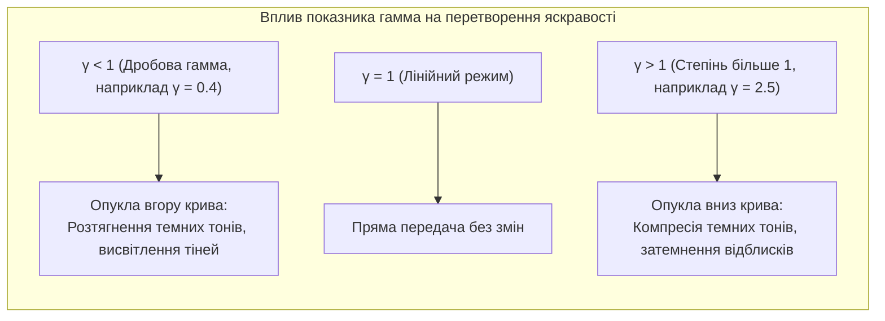
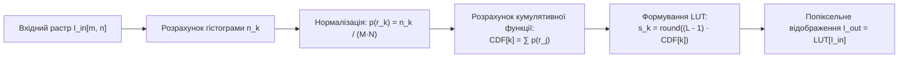
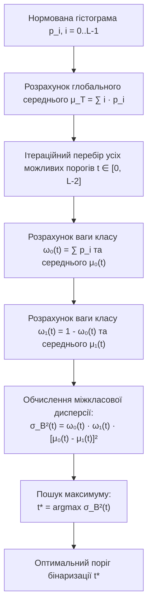

# ТЕМА 6. ПОЕЛЕМЕНТНІ АМПЛІТУДНІ ПЕРЕТВОРЕННЯ ТА ГІСТОГРАМНИЙ АНАЛІЗ ЗОБРАЖЕНЬ

---

## 6.1. Математична модель поелементного перетворення яскравості. Перетворення у негатив, лінійне масштабування динамічного діапазону (яскравість/контраст)

### Основний зміст та теоретичний базис

**Поелементні (точкові або амплітудні) перетворення** є базовим класом низькорівневих операцій цифрової обробки зображень, за яких вихідне значення яскравості кожного окремого пікселя формується виключно на основі його власного початкового значення яскравості та не залежить від оптичних параметрів сусідніх елементів растра. Такі системи є просторовими аналогами безінерційних нелінійних ланок у теорії сигналів.

Математично точкове перетворення монохромного зображення описується функціональною залежністю:

$$s = T(r) \quad \Longleftrightarrow \quad I_{\text{out}}[m, n] = T\big(I_{\text{in}}[m, n]\big)$$

де $r = I_{\text{in}}[m, n]$ позначає яскравість пікселя вхідного зображення з просторовими координатами $(m, n)$; $s = I_{\text{out}}[m, n]$ є результуючим значенням яскравості відповідного пікселя; $T(\cdot)$ виступає оператором (передавальною характеристикою) амплітудного перетворення. Для стандартного 8-бітного кодування без знака (`uint8`) діапазон зміни аргументів обмежений множиною $r, s \in [0; L-1]$, де $L = 256$ є кількістю доступних рівнів квантування.

*Рисунок 6.1 — Функціональна схема поелементного перетворення оптичного растра*

Класичним базовим амплітудним перетворенням є **інверсія рівнів сірого (перетворення у негатив)**. Операція інвертує градаційну шкалу яскравості, переводячи темні ділянки у світлі, а світлі — у темні:

$$s = (L - 1) - r = 255 - r$$

де $L - 1 = 255$ позначає максимальне значення динамічного діапазону. Перетворення у негатив є високоефективним інструментом при візуальному аналізі медичних рентгенограм, мікроскопічних цитологічних препаратів та мамограм, оскільки людська зорова система здатна розпізнавати малоконтрастні низькоінтенсивні аномалії значно чіткіше, коли вони відображаються високими рівнями світності на темному тлі.

**Лінійне амплітудне перетворення** забезпечує масштабування динамічного діапазону шляхом незалежного регулювання параметрів контрасту (*gain / contrast*) та яскравості (*bias / brightness*):

$$s = \alpha \cdot r + \beta$$

де $\alpha > 0$ є коефіцієнтом контрастності (кутовим коефіцієнтом нахилу лінійної характеристики); $\beta \in [-255; 255]$ є коефіцієнтом яскравості (адитивним зміщенням). 

При значеннях $\alpha > 1$ відбувається розширення динамічного діапазону (підвищення контрасту) з одночасним збільшенням крутизни передавальної характеристики, тоді як значення $0 < \alpha < 1$ викликають компресію динамічного діапазону (зниження контрасту). Позитивні значення $\beta > 0$ зміщують усі відліки в бік насичення білого, висвітлюючи кадр, тоді як від'ємні значення $\beta < 0$ затемнюють растр.

Оскільки результат лінійного розрахунку $s$ може виходити за межі фізичної розрядної сітки формату `uint8`, застосовують операцію насичення (відсікання, *clipping*):

$$I_{\text{out}}[m, n] = \text{clip}(\alpha \cdot I_{\text{in}}[m, n] + \beta, 0, 255) = \begin{cases} 0, & \alpha r + \beta < 0 \\ \alpha r + \beta, & 0 \le \alpha r + \beta \le 255 \\ 255, & \alpha r + \beta > 255 \end{cases}$$

Для максимального використання розрядного діапазону сенсора в умовах слабкої освітленості застосовують **кусково-лінійне розтягування контрасту** (*contrast stretching*), яке лінійно трансформує фактичний вузький інтервал яскравостей вхідного зображення $[r_{\min}; r_{\max}]$ у повний апаратний діапазон $[0; L-1]$:

$$s = \frac{L - 1}{r_{\max} - r_{\min}} (r - r_{\min}) = \frac{255}{r_{\max} - r_{\min}} (r - r_{\min})$$

де $r_{\min} = \min_{m,n} I_{\text{in}}[m, n]$ та $r_{\max} = \max_{m,n} I_{\text{in}}[m, n]$ є мінімальним і максимальним рівнями яскравості вхідного масиву.

---

## 6.2. Нелінійна гамма-корекція (степеневе перетворення). Застосування таблиць пошуку (Look-Up Tables / LUT)

### Основний зміст та теоретичний базис

Лінійне амплітудне масштабування не завжди забезпечує якісну візуалізацію через те, що людський зір сприймає яскравість за логарифмічним нелінійним законом, а електрооптичні прилади відображення (монітори, матриці проекторів) володіють власною нелінійною передавальною характеристикою. Для корекції нерівномірності передачі тонів застосовують **степеневе амплітудне перетворення (гамма-корекцію)**:

$$s = c \cdot r^\gamma$$

де $c$ — нормуючий масштабний коефіцієнт; $\gamma$ (гамма) — дійсний показник степеня, що визначає кривизну функціональної залежності. При роботі з нормованими значеннями $r, s \in [0.0; 1.0]$ константа $c = 1$. Для 8-бітного цифрового представлення $r \in [0; 255]$ формула набуває вигляду:

$$s = (L - 1) \cdot \left( \frac{r}{L - 1} \right)^\gamma = 255 \cdot \left( \frac{r}{255} \right)^\gamma$$

*Рисунок 6.2 — Функціональна спрямованість нелінійного гамма-перетворення залежно від значення показника γ*

При значеннях $\gamma < 1$ передавальна крива є опуклою вгору. Відбувається істотне динамічне розтягування градієнтів у темних ділянках зображення при одночасному стисненні світлих ділянок, що дозволяє виявити деталі у затінених зонах без спотворення загального колірного тону. Навпаки, при $\gamma > 1$ крива є опуклою вниз, що стискає темні півтони та розширює світлі, запобігаючи переекспонуванню яскравих ділянок.

Прямий розрахунок операції піднесення до дробового степеня $r^\gamma$ для кожного пікселя зображення високої роздільної здатності (наприклад, $1920 \times 1080 = 2.07 \times 10^6$ пікселів) вимагає значних апаратних ресурсів процесора через ресурсомісткість операцій із рухомою комою. Оскільки кількість можливих градацій яскравості вхідного 8-бітного пікселя становить лише 256 дискретних значень ($r \in [0; 255]$), обчислення оптимізують за допомогою **таблиць пошуку (Look-Up Tables, LUT)**.

Алгоритм LUT передбачає попередній одноразовий розрахунок одновимірного масиву $\mathbf{T}_{\text{LUT}}$ довжиною 256 елементів:

$$\mathbf{T}_{\text{LUT}}[r] = \text{round}\left( 255 \cdot \left(\frac{r}{255}\right)^\gamma \right), \quad \forall r \in [0; 255]$$

Під час обробки растра операція зводиться до безпосереднього вилучення значення з попередньо обчисленої таблиці за індексом, що дорівнює яскравості поточного пікселя:

$$I_{\text{out}}[m, n] = \mathbf{T}_{\text{LUT}}\big[ I_{\text{in}}[m, n] \big]$$

Застосування LUT знижує асимптотичну складність операції з $M \times N$ складних математичних функцій до $M \times N$ елементарних звернень до пам'яті за адресою зі складністю $\mathcal{O}(1)$, забезпечуючи роботу алгоритмів у реальному часі навіть на вбудованих мікропроцесорах із фіксованою комою.

---

## 6.3. Гістограма яскравості монохромних та покомпонентних зображень. Алгоритм глобальної еквалізації гістограми на основі кумулятивної функції розподілу (CDF)

### Основний зміст та теоретичний базис

**Гістограмою яскравості** цифрового зображення називається дискретна одновимірна функція $h(r_k)$, яка відображає кількість пікселів $n_k$, що мають точний рівень інтенсивності $r_k$:

$$h(r_k) = n_k, \quad k = 0, 1, \dots, L - 1$$

де $r_k$ — $k$-й рівень градації сірого; $n_k$ — абсолютна частота появи пікселів з яскравістю $r_k$; $L$ — загальна кількість квантованих рівнів ($L = 256$). 

**Нормована гістограма** $p(r_k)$ являє собою емпіричну статистичну оцінку функції густини розподілу ймовірностей (*Probability Mass Function, PMF*) випадкової величини яскравості пікселів:

$$p(r_k) = \frac{h(r_k)}{M \cdot N} = \frac{n_k}{M \cdot N}, \quad \sum_{k=0}^{L-1} p(r_k) = 1$$

де $M \cdot N$ є повною кількістю пікселів цифрового растра. За формою нормованої гістограми оцінюють глобальний контраст зображення: вузький пік у лівій області свідчить про недоекспонованість (затемненість), зміщення вправо — про переекспонованість, а вузький пік по центру шкали вказує на низьку динамічну контрастність сцени.

*Рисунок 6.3 — Послідовність виконання алгоритму глобальної еквалізації гістограми на базі дискретної інтегральної функції розподілу*

**Еквалізація (вирівнювання) гістограми** (*Histogram Equalization*) — це алгоритм нелінійного амплітудного перетворення, метою якого є формування вихідного зображення з максимально рівномірною щільністю розподілу ймовірностей яскравості ($p_s(s) \approx \text{const} = \frac{1}{L-1}$). Це дозволяє рівномірно розподілити енергію півтонів по всьому доступному динамічному діапазону та максимізувати інформаційну ентропію зображення.

У неперервному представленні математична модель еквалізації базується на теорії перетворення випадкових величин. Якщо вхідна яскравість $r \in [0; 1]$ описується густиною ймовірності $p_r(r)$, то монотонно зростаюче перетворення $s = T(r)$ перетворює її у рівномірно розподілену величину $s \in [0; 1]$ тоді, коли передавальна функція $T(r)$ збігається з **інтегральною кумулятивною функцією розподілу (CDF)**:

$$s = T(r) = \int_{0}^{r} p_r(w) \, dw$$

Диференціюючи інтеграл за правилом Лейбніца, отримуємо:

$$\frac{ds}{dr} = \frac{d}{dr} \left[ \int_0^r p_r(w) \, dw \right] = p_r(r)$$

Підставляючи цей вираз у фундаментальне співвідношення для перетворення густин ймовірностей $p_s(s) = p_r(r) \cdot \left| \frac{dr}{ds} \right|$, маємо:

$$p_s(s) = p_r(r) \cdot \frac{1}{p_r(r)} = 1, \quad 0 \le s \le 1$$

У дискретному просторі цифрових растрових зображень інтегрування замінюється накопичувальним сумуванням. Покроковий **алгоритм дискретної еквалізації гістограми**:

1. Обчислюють значення гістограми $n_k$ та нормованої гістограми $p(r_k) = \frac{n_k}{MN}$ для всіх $k \in [0; L-1]$.
2. Розраховують дискретну кумулятивну функцію розподілу $\text{CDF}[k]$:
   $$\text{CDF}[k] = \sum_{j=0}^{k} p(r_j) = \frac{1}{M \cdot N} \sum_{j=0}^{k} n_j$$
3. Формують значення перетворених рівнів яскравості $s_k$ шляхом квантування значень кумулятивної суми на множину цілих чисел $[0; L-1]$:
   $$s_k = \text{round}\Big( (L - 1) \cdot \text{CDF}[k] \Big) = \text{round}\left( \frac{L - 1}{M \cdot N} \sum_{j=0}^{k} n_j \right)$$
4. Здійснюють заміну яскравості кожного пікселя вхідного зображення: якщо $I_{\text{in}}[m, n] = r_k$, то $I_{\text{out}}[m, n] = s_k$.

При обробці повноколірних зображень пряма незалежна еквалізація каналів $R$, $G$ та $B$ є некоректною, оскільки зміна співвідношення між компонентами викликає грубі артефакти спотворення природного колірного тону (зсув хроматичності). Правильний підхід полягає у попередньому переводі зображення у колірний простір із розділеними координатами світності та хроматичності (HSV, HSL або CIELab), виконанні еквалізації виключно каналу яскравості ($V$, $L$ або $L^*$) та подальшому зворотному перетворенні у простір RGB.

---

## 6.4. Методи бінаризації та порогової обробки: фіксований поріг (THRESH_BINARY, TRUNC, TOZERO), метод міжкласової дисперсії Оцу (Otsu's thresholding), локальна адаптивна порогова обробка (Adaptive Mean / Gaussian)

### Основний зміст та теоретичний базис

**Порогова обробка (бінаризація)** являє собою нелінійну операцію квантування півтонового зображення на два взаємовиключні класи: пікселі об'єктів переднього плану (*foreground*) та пікселі фону (*background*). У результаті формується двійкова бінарна маска, де об'єкти кодуються логічною одиницею (або числом 255), а фонові структури — логічним нулем (0).

### Фіксована глобальна порогова обробка

При глобальній пороговій обробці для всього растра застосовується єдиний скалярний поріг $T = \text{const}$. Залежно від передавальної функції порогового детектора виділяють наступні базові режими перетворення:

1. **Пряма бінаризація ($\text{THRESH\_BINARY}$):**
   $$I_{\text{out}}[m, n] = \begin{cases} \text{maxval}, & I_{\text{in}}[m, n] > T \\ 0, & I_{\text{in}}[m, n] \le T \end{cases}$$
2. **Інверсна бінаризація ($\text{THRESH\_BINARY\_INV}$):**
   $$I_{\text{out}}[m, n] = \begin{cases} 0, & I_{\text{in}}[m, n] > T \\ \text{maxval}, & I_{\text{in}}[m, n] \le T \end{cases}$$
3. **Обмеження порогом згори ($\text{THRESH\_TRUNC}$):**
   $$I_{\text{out}}[m, n] = \begin{cases} T, & I_{\text{in}}[m, n] > T \\ I_{\text{in}}[m, n], & I_{\text{in}}[m, n] \le T \end{cases}$$
4. **Обнулення рівнів нижче порога ($\text{THRESH\_TOZERO}$):**
   $$I_{\text{out}}[m, n] = \begin{cases} I_{\text{in}}[m, n], & I_{\text{in}}[m, n] > T \\ 0, & I_{\text{in}}[m, n] \le T \end{cases}$$
5. **Інверсне обнулення рівнів вище порога ($\text{THRESH\_TOZERO\_INV}$):**
   $$I_{\text{out}}[m, n] = \begin{cases} 0, & I_{\text{in}}[m, n] > T \\ I_{\text{in}}[m, n], & I_{\text{in}}[m, n] \le T \end{cases}$$

де $T$ — порогове числове значення; $\text{maxval}$ — максимальний рівень заміни (зазвичай 255).

### Метод міжкласової дисперсії Оцу (Otsu's Thresholding)

**Метод Оцу** (розроблений Нобуюті Оцу у 1979 р.) є оптимальним непараметричним статистичним методом автоматичного визначення глобального порогу бінаризації на основі аналізу гістограми сірого тону без апріорних припущень про розподіл яскравостей. Алгоритм розглядає зображення як бімодальну суміш двох класів: фону $C_0$ (пікселі з яскравістю в діапазоні $[0; t]$) та переднього плану $C_1$ (пікселі з яскравістю в діапазоні $[t+1; L-1]$).

*Рисунок 6.4 — Блок-схема статистичного алгоритму оптимізації порогу бінаризації за методом Оцу*

Нехай $p_i = \frac{n_i}{MN}$ — нормована ймовірність появи яскравості $i \in [0; L-1]$. Для довільно обраного граничного порогу $t$ статистичні ваги (ймовірності появи) класів $C_0$ та $C_1$ визначаються виразами:

$$\omega_0(t) = \sum_{i=0}^{t} p_i, \quad \omega_1(t) = \sum_{i=t+1}^{L-1} p_i = 1 - \omega_0(t)$$

Середні математичні очікування рівнів яскравості для кожного з виділених класів розраховуються як умовні середні:

$$\mu_0(t) = \sum_{i=0}^{t} \frac{i \cdot p_i}{\omega_0(t)} = \frac{\mu(t)}{\omega_0(t)}, \quad \mu_1(t) = \sum_{i=t+1}^{L-1} \frac{i \cdot p_i}{\omega_1(t)} = \frac{\mu_T - \mu(t)}{1 - \omega_0(t)}$$

де $\mu(t) = \sum_{i=0}^{t} i \cdot p_i$ — перший початковий кумулятивний момент гістограми до рівня $t$; $\mu_T = \sum_{i=0}^{L-1} i \cdot p_i$ — загальне глобальне середнє значення яскравості всього растра.

Повна дисперсія яскравості зображення $\sigma_T^2 = \sum_{i=0}^{L-1} (i - \mu_T)^2 p_i$ строго розкладається на суму двох компонентів — внутрішньокласової дисперсії $\sigma_W^2(t)$ та **міжкласової дисперсії** $\sigma_B^2(t)$:

$$\sigma_T^2 = \sigma_W^2(t) + \sigma_B^2(t)$$

де $\sigma_W^2(t) = \omega_0(t) \sigma_0^2(t) + \omega_1(t) \sigma_1^2(t)$ характеризує ступінь неоднорідності пікселів всередині кожного класу; $\sigma_B^2(t)$ характеризує статистичну контрастну відмінність між класами фону та об'єкта:

$$\sigma_B^2(t) = \omega_0(t) \big(\mu_0(t) - \mu_T\big)^2 + \omega_1(t) \big(\mu_1(t) - \mu_T\big)^2 = \omega_0(t) \omega_1(t) \big[\mu_0(t) - \mu_1(t)\big]^2$$

Шляхом алгебраїчних підстановок вираз для міжкласової дисперсії зводиться до форми, що не вимагає розрахунку дисперсій окремих класів:

$$\sigma_B^2(t) = \frac{\big[\mu_T \omega_0(t) - \mu(t)\big]^2}{\omega_0(t) \big(1 - \omega_0(t)\big)}$$

Оскільки повна дисперсія $\sigma_T^2$ не залежить від обраного порогу $t$, мінімізація внутрішньокласової дисперсії $\sigma_W^2(t)$ еквівалентна максимізації міжкласової дисперсії $\sigma_B^2(t)$. **Оптимальний поріг Оцу $t^*$** знаходиться шляхом повного одновимірного перебору всіх $t \in [0; L-1]$:

$$t^* = \arg\max_{0 \le t < L-1} \sigma_B^2(t)$$

### Локальна адаптивна порогова обробка

У реальних сценах глобальний метод Оцу втрачає працездатність за наявності суттєво нерівномірного просторового освітлення кадру (наявність градієнтного затемнення, відблисків або спрямованих тіней), коли фон у світлій частині зображення має яскравість вищу, ніж об'єкти у затіненій зоні. У таких умовах застосовують **локальну адаптивну бінаризацію**, за якої індивідуальний поріг $T(m, n)$ розраховується окремо для кожного пікселя на основі локального просторового околу розміром $B \times B$ елементів:

$$I_{\text{out}}[m, n] = \begin{cases} \text{maxval}, & I_{\text{in}}[m, n] > T(m, n) \\ 0, & I_{\text{in}}[m, n] \le T(m, n) \end{cases}$$

$$T(m, n) = \mu_{\text{local}}[m, n] - C$$

де $\mu_{\text{local}}[m, n]$ — локальна центральна оцінка яскравості у прямокутному вікні розміром $B \times B$ (де $B$ є непарним цілим числом); $C$ — додатна дійсна константа, що регулює чутливість порогового детектора до дрібних шумових перепадів.

Залежно від алгоритму розрахунку $\mu_{\text{local}}$ виділяють:
*   **Адаптивне середнє ($\text{Adaptive Mean}$):** $\mu_{\text{local}}[m, n]$ розраховується як просте середнє арифметичне яскравостей усіх $B \times B$ пікселів локального вікна за допомогою фільтра ковзного усереднення.
*   **Адаптивне Гаусове зважування ($\text{Adaptive Gaussian}$):** $\mu_{\text{local}}[m, n]$ визначається як двовимірна зважена згортка пікселів вікна з нормальним дискретним ядром Гаусса, що надає найбільшої ваги пікселям, розташованим ближче до аналізованого центрального вузла.

| Метод бінаризації | Тип порогу | Обчислювальна складність | Стійкість до перепадів освітлення | Оптимальна сфера застосування |
| :--- | :--- | :---: | :---: | :--- |
| **Фіксований поріг** | Глобальний, статичний $T$ | $\mathcal{O}(MN)$ | Вкрай низька | Контрольовані лабораторні умови, студійне освітлення |
| **Метод Оцу** | Глобальний, статистичний $t^*$ | $\mathcal{O}(MN + L)$ | Середня (бімодальні гістограми) | Сканування документів, промислова дефектоскопія деталей |
| **Adaptive Mean** | Локальний, ковзне вікно $B \times B$ | $\mathcal{O}(MN)$ (через інтегральні зображення) | Висока | Розпізнавання тексту з нерівномірним фоном |
| **Adaptive Gaussian** | Локальний, Гаусове ядро | $\mathcal{O}(MN \cdot B)$ | **Найвища** (мінімум шумових плям) | Системи технічного зору автономних роботів, дорожня розмітка |

Аналіз порівняльної таблиці показує, що адаптивні алгоритми мають беззаперечну перевагу в складних нестаціонарних оптичних середовищах, дозволяючи виділяти дрібні локальні контури незалежно від глобального рівня перепаду яскравості по полю кадру.

---

### Питання для самоперевірки та аналітичного осмислення

1. Сформулюйте математичну модель поелементного амплітудного перетворення зображення. Чому точкові амплітудні перетворювачі вважаються просторовим аналогом безінерційних нелінійних кіл?
2. Яким чином нелінійна гамма-корекція зі значеннями $\gamma < 1$ та $\gamma > 1$ змінює динамічний діапазон півтонів цифрового растра, і яким чином застосування таблиць пошуку (LUT) оптимізує швидкодію алгоритму?
3. Наведіть аналітичне обґрунтування процедури еквалізації гістограми. Чому використання інтегральної кумулятивної функції розподілу (CDF) як передавальної функції перетворення теоретично забезпечує рівномірну густину ймовірностей вихідного сигналу?
4. У чому полягає небезпека прямої поелементної еквалізації гістограми кольорового зображення окремо за каналами $R$, $G$ та $B$, і як ця проблема вирішується за допомогою колірних просторів HSV або CIELab?
5. Наведіть повне математичне виведення цільової функції максимізації міжкласової дисперсії $\sigma_B^2(t)$ в алгоритмі автоматичної бінаризації Оцу. За рахунок чого метод Оцу дозволяє уникнути обчислення внутрішньокласових дисперсій $\sigma_0^2(t)$ та $\sigma_1^2(t)$?
6. За яких оптичних умов сцени глобальний метод Оцу втрачає працездатність, і які переваги надають методи локальної адаптивної порогової обробки (Adaptive Mean та Adaptive Gaussian) при фільтрації документів із сильними тінями?