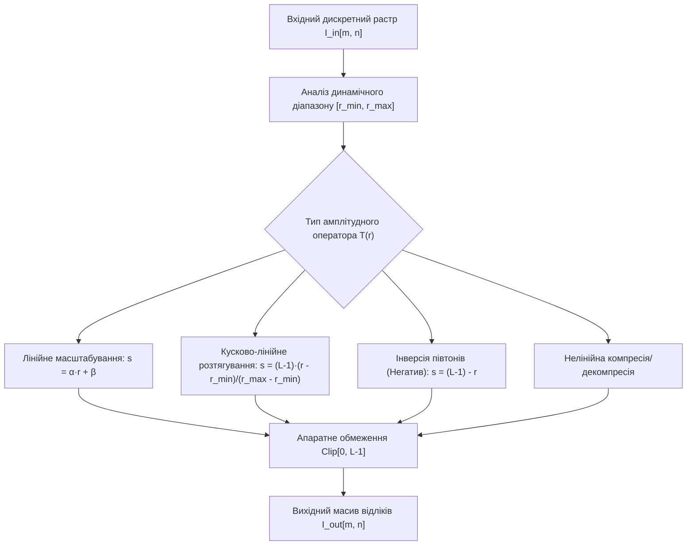
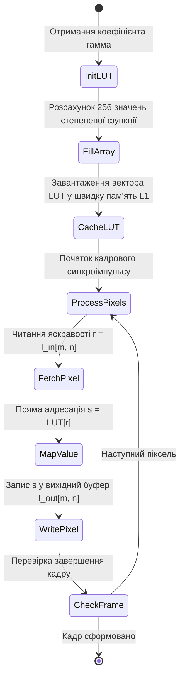
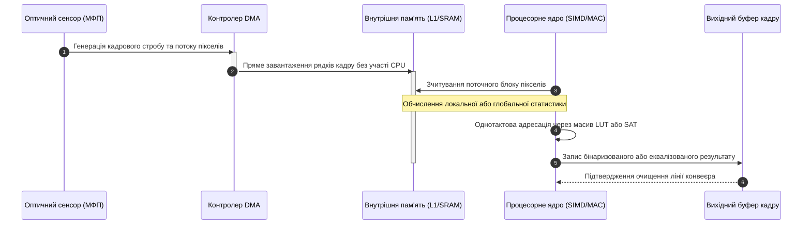
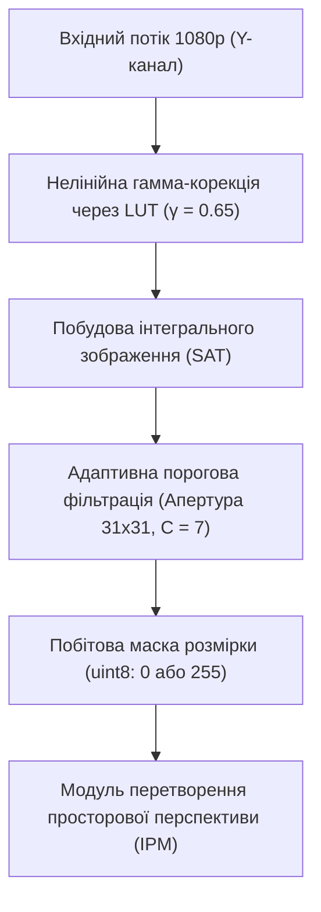

# Тема 6. Поелементні амплітудні перетворення та гістограмний аналіз зображень

## Мета лекції

Формування у здобувачів вищої освіти поглибленої системи теоретичних знань і прикладних інженерних компетентностей щодо математичного моделювання, алгоритмізації та апаратної реалізації низькорівневих точкових амплітудних перетворень оптичних сигналів. Навчальний матеріал спрямований на опанування методів керування динамічним діапазоном, нелінійної гамма-корекції на основі оптимізованих таблиць пошуку (LUT), статистичного аналізу растрових даних засобами кумулятивних функцій розподілу яскравості, а також на вивчення аналітичних критеріїв глобальної і локальної адаптивної бінаризації для подальшого застосування у препроцесингу зображень у сучасних приладобудівних комплексах, системах комп'ютерного зору, робототехніці та біомедичній інженерії.

## Очікувані результати навчання

1. **Знання та розуміння.** Здобувачі засвоять фундаментальний аналітичний апарат точкових амплітудних перетворень як просторових безінерційних нелінійних ланок, структуру передавальних характеристик лінійного та степеневого масштабування, статистичні властивості нормованої гістограми як оцінки густини розподілу ймовірностей, а також математичні засади максимізації міжкласової дисперсії в алгоритмі Оцу.
2. **Застосування.** Здобувачі набудуть здатності проектувати швидкодіючі алгоритми обробки півтонів на базі одновимірних таблиць пошуку (Look-Up Tables), програмно синтезувати процедури глобальної еквалізації гістограм із коректним колориметричним розділенням яскравості й хроматичності, а також реалізовувати алгоритми бінаризації монохромних і повноколірних растрових масивів засобами спеціалізованих бібліотек мови Python.
3. **Аналіз.** Здобувачі зможуть аналізувати динамічні та спектральні спотворення растра, діагностувати апаратні ефекти кліпінгу й паразитної контуризації при квантуванні рівнів яскравості, а також критично зіставляти ефективність глобального порогового розділення та віконних методів адаптивної фільтрації в умовах оптичної неоднорідності сцен.
4. **Оцінювання та синтез.** Здобувачі сформують здатність обґрунтовано обирати оптимальні схеми нормалізації контрасту відповідно до апаратних обмежень обчислювачів систем реального часу, оцінювати компроміс між обчислювальною складністю й ентропійною якістю результуючого растра та синтезувати комбіновані конвеєри передобробки даних для розпізнавання об'єктів складної топології.

---

## Детальний покроковий план лекції

### 1. Теоретико-концептуальний базис. Математичні моделі амплітудних перетворень та статистичний аналіз растра
* 1.1. Формалізація поелементних перетворень яскравості як просторових безінерційних операторів і лінійне масштабування динамічного діапазону.
* 1.2. Нелінійне степеневе перетворення (гамма-корекція) та алгоритмічна оптимізація обчислень через таблиці пошуку (Look-Up Tables, LUT).
* 1.3. Статистична оцінка розподілу яскравості, побудова нормованої гістограми та ентропійні показники інформативності цифрового зображення.
* 1.4. Математична модель глобальної еквалізації гістограми на основі дискретної кумулятивної функції розподілу (CDF) та особливості роботи з повноколірними растрами.

### 2. Методологія та аналіз граничних умов. Алгоритми бінаризації, просторової селекції та бар'єри амплітудної корекції
* 2.1. Функціональні характеристики та передавальні функції класичної порогової обробки із фіксованим порогом (THRESH_BINARY, TRUNC, TOZERO).
* 2.2. Непараметричний статистичний метод максимізації міжкласової дисперсії Оцу (Otsu's thresholding) для автоматичного вибору глобального порогу.
* 2.3. Локальна адаптивна бінаризація на основі ковзного середнього (Adaptive Mean) та зваженого двовимірного ядра Гаусса (Adaptive Gaussian).
* 2.4. Критичні бар'єри та граничні умови теорії на практиці: колірні девіації при покомпонентній еквалізації в просторі RGB, ефект хибної контуризації при огрубленні рівнів квантування та крайові аномалії в локальних порогових вікнах.
* 2.5. Порівняльний аналіз швидкодії та обчислювальної складності амплітудних алгоритмів для вбудованих цифрових сигнальних процесорів (DSP).

### 3. Практичний індустріальний / фаховий кейс. Препроцесинг та адаптивна сегментація в бортових системах автономного транспорту
**Тема наскрізної задачі.** «Синтез високопродуктивного конвеєра нормалізації контрасту та локально-адаптивної бінаризації відеопотоку дорожньої обстановки в умовах засліплювального зустрічного освітлення та різких геометричних тіней»

## 1. Теоретико-концептуальний базис. Математичні моделі амплітудних перетворень та статистичний аналіз растра

### 1.1. Формалізація поелементних перетворень яскравості як просторових безінерційних операторів і лінійне масштабування динамічного діапазону

У математичній теорії обробки сигналів монохромне цифрове зображення розглядається як дискретизована за просторовими координатами та квантована за рівнем функція світності. Якщо неперервне оптичне зображення на вході сенсора описується розподілом освітленості $f(x, y)$, де просторові координати належать двовимірній дійсній площині $(x, y) \in \mathbb{R}^2$, то після проходження матричного фотоприймача формується двовимірна матриця цілочисельних відліків $I[m, n]$. Координати $m \in \{0, 1, \dots, M-1\}$ та $n \in \{0, 1, \dots, N-1\}$ визначають дискретну просторову сітку розмірністю $M \times N$ елементів, де індекс $m$ відповідає номеру рядка, а індекс $n$ позначає номер стовпця растра.

Поелементні перетворення яскравості становлять фундаментальний клас низькорівневих операцій, у яких значення сигналу у вихідному вузлі координатної сітки залежить виключно від амплітуди вхідного сигналу в тій самій просторовій точці. Завдяки цій властивості вхідні та вихідні координати пікселя перебувають у взаємно однозначній відповідності без залучення інформації з просторового околу точки. У термінології теорії лінійних і нелінійних кіл такі оператори є дискретними просторовими аналогами безінерційних нелінійних ланок, де динамічна пам'ять системи дорівнює нулю.

Формально функціональна залежність точкового перетворення записується у вигляді передавальної характеристики:

$$s = T(r) \quad \Longleftrightarrow \quad I_{\text{out}}[m, n] = T\big(I_{\text{in}}[m, n]\big)$$

У наведеному математичному виразі змінна $r$ позначає вхідний рівень яскравості пікселя, що відповідає відліку $I_{\text{in}}[m, n]$, а змінна $s$ позначає синтезоване значення яскравості відповідного пікселя $I_{\text{out}}[m, n]$ у вихідному масиві даних. Функція $T(\cdot)$ виконує відображення множини вхідних станів на множину вихідних станів динамічного діапазону. При стандартному восьмибітному квантуванні сигналу без знака область визначення та область значень оператора $T$ обмежені цілочисельним інтервалом від $0$ до $L-1$, де кількість дискретних градацій сірого тону становить $L = 256$, тобто $r, s \in [0; 255]$.

Найпростішим типом амплітудного оператора є лінійне перетворення, що дозволяє виконувати незалежне регулювання контрасту та інтегрального рівня світлоти кадру. Лінійне масштабування динамічного діапазону описується рівнянням першого порядку:

$$s = \alpha \cdot r + \beta$$

Параметр $\alpha$, що виступає кутовим коефіцієнтом передавальної прямої, виконує роль регулятора контрастності (*gain*). Значення параметра $\alpha > 1$ призводять до розширення динамічного діапазону між різними тонами та збільшення крутизни сигналу, тоді як значення $0 < \alpha < 1$ призводять до стиснення динамічного діапазону та зниження контрастності. Адитивний параметр $\beta$ здійснює паралельне зміщення характеристики вздовж осі ординат і відповідає за рівень яскравості (*bias*). Додатні значення коефіцієнта $\beta > 0$ рівномірно підвищують світлоту всіх ділянок сцени, тоді як від'ємні значення $\beta < 0$ затемнюють растр.

Оскільки апаратні буфери кадрів і мікросхеми аналого-цифрового перетворення здебільшого оперують фіксованими типами даних (`uint8`), результат лінійного обчислення неминуче виходить за межі допустимого діапазону $[0; L-1]$. При реалізації на цифрових сигнальних процесорах це вимагає застосування оператора насичення, який усуває ефект циклічного переповнення розрядної сітки:

$$I_{\text{out}}[m, n] = \text{clip}(\alpha \cdot I_{\text{in}}[m, n] + \beta, 0, L-1) = \begin{cases} 0, & \alpha \cdot r + \beta < 0 \\ \alpha \cdot r + \beta, & 0 \le \alpha \cdot r + \beta \le L-1 \\ L-1, & \alpha \cdot r + \beta > L-1 \end{cases}$$

Окремим граничним випадком лінійного перетворення є інверсія рівнів яскравості, або перетворення у негатив. Дана операція дзеркально обертає градаційну шкалу навколо центрального значення діапазону, що формалізується співвідношенням:

$$s = (L - 1) - r$$

Для повного використання динамічного діапазону оптичного тракту в умовах недостатнього або надмірного освітлення застосовують кусочно-лінійне розтягування контрасту. Якщо фактичні значення яскравості вхідного зображення зосереджені у звуженому інтервалі від мінімального рівня $r_{\min} = \min_{m,n} I_{\text{in}}[m, n]$ до максимального рівня $r_{\max} = \max_{m,n} I_{\text{in}}[m, n]$, нормалізація сигналу до повного діапазону $[0; L-1]$ здійснюється згідно з аналітичним виразом:

$$s = \text{round}\left( \frac{L - 1}{r_{\max} - r_{\min}} \cdot (r - r_{\min}) \right)$$

У цьому співвідношенні оператор $\text{round}(\cdot)$ забезпечує математичне округлення результату до найближчого цілого числа, усуваючи накопичення похибок квантування при переході від чисел із рухомою комою до формату цілих чисел.

> **ПРАКТИЧНИЙ ЯКІР:** У медичних діагностичних комплексах стандарту DICOM, що обробляють шістнадцятибітні дані комп'ютерної томографії із діапазоном значень від мінус 1024 до плюс 3071 одиниць Гаунсфілда, лінійне амплітудне відображення на стандартні восьмибітні дисплеї виконується за алгоритмом віконного перетворення (*Windowing*), де параметри «ширина вікна» (*Window Width*) та «рівень вікна» (*Window Center*) математично еквівалентні коефіцієнтам масштабування контрасту та яскравості для візуалізації специфічних тканин організму.

---

### 1.2. Нелінійне степеневе перетворення (гамма-корекція) та алгоритмічна оптимізація обчислень через таблиці пошуку (Look-Up Tables, LUT)

Людська зорова система сприймає зміну світлового потоку нелінійно, підпорядковуючись психофізичному закону Вебера-Фехнера та узагальненому закону Стівенса. Одночасно з цим фізичні перетворювачі світла в електричний сигнал і напівпровідникові матриці відображення мають власні нелінійні передавальні характеристики. Математичний опис таких характеристик здійснюється за допомогою степеневої функції, а процес спрямованої модифікації кривизни сигналу називається **гамма-корекцією**.

У неперервній аналітичній формі степеневе амплітудне перетворення нормованих рівнів яскравості $r \in [0.0; 1.0]$ записується рівнянням:

$$s = c \cdot r^\gamma$$

де $c$ позначає дійсний коефіцієнт масштабування, який для нормованих шкал зазвичай дорівнює одиниці, а показник степеня $\gamma$ визначає геометрію передавальної кривої. Для дискретного цілочисельного представлення $r \in [0; L-1]$ формула набуває нормованого вигляду:

$$s = \text{round}\left( (L - 1) \cdot \left( \frac{r}{L - 1} \right)^\gamma \right)$$

Якщо показник степеня лежить у діапазоні $\gamma < 1$, передавальна функція стає опуклою вгору. У цьому випадку малий інтервал темних вхідних тонів відображається у значно ширший діапазон вихідних рівнів, що забезпечує візуальне висвітлення тіньових ділянок сцени без вибивання світлих тонів у насичення. Якщо показник степеня задовольняє умові $\gamma > 1$, крива стає опуклою вниз, що стискає темні півтони і розтягує світлі, запобігаючи переекспонуванню сцен із високою яскравістю окремих об'єктів.

Пряме обчислення степеневої функції із дробовим показником $\gamma \in \mathbb{R}$ для растрових масивів ультрависокої роздільної здатності (наприклад, формат 4K містить понад вісім мільйонів пікселів) є критично неефективним для вбудованих обчислювачів через високі затрати циклів процесора на трансцендентні операції із рухомою комою. Оскільки простір можливих станів яскравості для восьмибітного растра є скінченною множиною з 256 дискретних значень, обчислення оптимізують шляхом декомпозиції операції на етап попереднього розрахунку та етап безпосередньої обробки потоку даних за допомогою **таблиць пошуку (Look-Up Tables, LUT)**.

Математично таблиця пошуку є одновимірним масивом фіксованого розміру $\mathbf{T}_{\text{LUT}}$, довжина якого строго відповідає потужності множини квантованих станів $L$:

$$\mathbf{T}_{\text{LUT}}[r] = \text{round}\left( 255 \cdot \left(\frac{r}{255}\right)^\gamma \right), \quad \forall r \in \{0, 1, \dots, 255\}$$

Після попереднього обчислення та збереження масиву в кеш-пам'яті першого рівня процесора виконання амплітудної обробки над растровими відліками зводиться до прямої адресації елементів пам'яті:

$$I_{\text{out}}[m, n] = \mathbf{T}_{\text{LUT}}\big[ I_{\text{in}}[m, n] \big]$$

Така організація обчислювального процесу замінює складні математичні процедури елементарною операцією читання за базовим зміщенням, що має детерміновану часову складність $\mathcal{O}(1)$ на піксель і дозволяє ефективно задіяти конвеєри векторних інструкцій (SIMD) у сучасних сигнальних процесорах.

> **ВАЖЛИВО:** Використання концепції таблиць пошуку є універсальним інструментом для будь-якого довільного поелементного перетворення, незалежно від аналітичної складності функції відображення (включаючи комбінації логарифмічних, степеневих, тригонометричних чи емпіричних залежностей), оскільки обчислювальна складність конвеєра обробки на піксель залишається строго інваріантною до виду математичного оператора.

---

### 1.3. Статистична оцінка розподілу яскравості, побудова нормованої гістограми та ентропійні показники інформативності цифрового зображення

Для формального опису та автоматичного аналізу градаційного складу зображення використовують статистичні методи оцінки розподілу випадкових величин. Оскільки кожен піксель растра можна інтерпретувати як реалізацію дискретної випадкової величини, глобальною спектрально-енергетичною характеристикою оптичного поля стає **гістограма яскравості**.

Гістограмою цифрового зображення називається одновимірна дискретна функція $h(r_k)$, значення якої дорівнює абсолютній кількості пікселів $n_k$, що мають точне значення яскравості, рівне $r_k$:

$$h(r_k) = n_k, \quad k \in \{0, 1, \dots, L - 1\}$$

де $r_k$ позначає $k$-й рівень квантування градацій сірого тону, а параметр $n_k$ представляє емпіричну частоту появи даного рівня у межах оброблюваного кадру.

Для забезпечення порівнянності зображень різної просторової роздільності здійснюють статистичну нормалізацію гістограми. Нормована гістограма $p(r_k)$ є статистичною оцінкою функції густини розподілу ймовірностей (дискретної маси ймовірності) появи відповідного рівня яскравості:

$$p(r_k) = \frac{h(r_k)}{M \cdot N} = \frac{n_k}{M \cdot N}$$

де добуток $M \cdot N$ визначає повну кількість пікселів у растровому масиві. За визначенням теорії ймовірностей для нормованої гістограми виконується умова нормування:

$$\sum_{k=0}^{L-1} p(r_k) = 1, \quad p(r_k) \ge 0$$

Статистичні властивості поля яскравості кількісно описуються початковими та центральними моментами розподілу. Перший початковий момент визначає середнє значення яскравості зображення $\mu$:

$$\mu = \sum_{k=0}^{L-1} r_k \cdot p(r_k)$$

Другий центральний момент визначає дисперсію рівнів яскравості $\sigma^2$, яка в теорії обробки сигналів виступає чисельною мірою глобального динамічного контрасту сцени:

$$\sigma^2 = \sum_{k=0}^{L-1} (r_k - \mu)^2 \cdot p(r_k)$$

Для кількісної оцінки інформаційної ємності та ступеня заповнення динамічного діапазону зображення використовують **інформаційну ентропію за Шеноном**. Ентропія растра $H$ вимірює середню кількість інформації, яку несе в собі кожен окремий відлік яскравості:

$$H = -\sum_{k=0}^{L-1} p(r_k) \log_2 p(r_k)$$

Якщо певний рівень яскравості має нульову частоту появи ($p(r_k) = 0$), відповідний доданок вважається рівним нулю на основі граничного співвідношення $\lim_{p \to 0} p \log_2 p = 0$. Максимальне теоретичне значення ентропії для восьмибітного монохромного зображення становить $H_{\max} = \log_2(256) = 8$ біт на піксель, що досягається виключно за умови строго рівномірного розподілу рівнів світності, коли ймовірність появи будь-якого тону є однаковою і становить $p(r_k) = \frac{1}{256}$.

> **ТИПОВА ПОМИЛКА:** Ототожнення форми гістограми яскравості із просторовою різкістю зображення є грубою теоретичною помилкою. Гістограма фіксує виключно нуль-вимірну статистику амплітуд, повністю ігноруючи топологічні зв'язки та просторові частоти; зображення з ідеальним висококонтрастним шаховим візерунком та зображення, отримане шляхом випадкового перемішування всіх його пікселів (білий шум), матимуть ідентичні гістограми та однакову ентропію, але принципово різну інформаційну цінність і просторовий спектр.

> **ПРАКТИЧНИЙ ЯКІР:** В автоматизованих лініях оптичного контролю кремнієвих пластин для сонячних панелей ентропія Шенона та дисперсія гістограми використовуються як критерії бракування: наявність мікротріщин і сторонніх наноструктурних включень викликає аномальне локальне розмиття гістограми і локальне зниження інформаційної ентропії порівняно з еталонним напівпровідниковим зразком.

---

### 1.4. Математична модель глобальної еквалізації гістограми на основі дискретної кумулятивної функції розподілу (CDF) та особливості роботи з повноколірними растрами

**Еквалізація гістограми** є методом адаптивного нелінійного амплітудного перетворення, спрямованим на перерозподіл рівнів яскравості пікселів таким чином, щоб отримати вихідне зображення із наближеною до рівномірної функцією густини розподілу ймовірностей. Це забезпечує максимальне збільшення глобального контрасту за рахунок розтягування найбільш заселених ділянок гістограми та компресії слабко задіяних діапазонів світності.

Математичне обґрунтування методу базується на фундаментальній теоремі про перетворення неперервних випадкових величин. Припустимо, що яскравість $r$ є неперервною випадковою величиною, визначеною на відрізку $[0; 1]$, із густиною розподілу ймовірностей $p_r(r)$. Необхідно знайти строго монотонно зростаючу диференційовну функцію перетворення $s = T(r)$, яка трансформує вхідну величину у вихідну величину $s \in [0; 1]$ із рівномірною густиною розподілу $p_s(s) \equiv 1$.

Згідно із законами теорії ймовірностей, густини розподілу зв'язані між собою відношенням:

$$p_s(s) = p_r(r) \cdot \left| \frac{dr}{ds} \right| = p_r(r) \cdot \frac{1}{\left| \frac{ds}{dr} \right|}$$

Для виконання умови $p_s(s) = 1$ необхідно забезпечити виконання диференціального рівняння:

$$\frac{ds}{dr} = p_r(r)$$

Інтегруючи ліву і праву частини рівняння за змінною $r$, отримуємо передавальну характеристику, що є інтегральною **кумулятивною функцією розподілу (CDF)**:

$$s = T(r) = \int_{0}^{r} p_r(w) \, dw$$

де $w$ виступає формальною змінною інтегрування. Кумулятивна функція $T(r)$ задовольняє всім фізичним критеріям коректності амплітудного перетворення: вона монотонно зростає на інтервалі $[0; 1]$, приймає значення $T(0) = 0$ та досягає одиниці на верхній межі $T(1) = 1$.

У цифровому просторі дискретних відліків інтегрування замінюється накопичувальним сумуванням значень нормованої гістограми. Послідовність реалізації дискретного перетворення еквалізації формалізується таким алгоритмічним шляхом:

1. Для вхідного дискретного зображення формується масив емпіричних імовірностей $p(r_k) = \frac{n_k}{M \cdot N}$ для всіх значень індексу $k \in \{0, 1, \dots, L-1\}$.
2. Виконується накопичувальне підсумовування значень дискретної функції маси ймовірності для визначення дискретної кумулятивної суми:
   $$\text{CDF}[k] = \sum_{j=0}^{k} p(r_j) = \frac{1}{M \cdot N} \sum_{j=0}^{k} n_j$$
3. Значення накопиченої суми масштабуються на доступну розрядну сітку квантування $[0; L-1]$ із наступним чисельним округленням:
   $$s_k = \text{round}\Big( (L - 1) \cdot \text{CDF}[k] \Big) = \text{round}\left( \frac{L - 1}{M \cdot N} \sum_{j=0}^{k} n_j \right)$$
4. Виконується безпосередня заміна квантованих значень: кожен піксель вхідного масиву з амплітудою $r_k$ набуває вихідного значення $s_k$.

При обробці багатоканальних повноколірних зображень наївний підхід, що передбачає роздільне застосування процедури еквалізації до кожного спектрального каналу червоного $R$, зеленого $G$ та синього $B$ окремо, призводить до спотворення кольору. Оскільки еквалізація є нелінійною функцією розподілу пікселів конкретного каналу, вирівнювання трьох каналів незалежно деформує просторове співвідношення між компонентами $R:G:B$. Це спричиняє паразитний дрейф хроматичності та порушення спектрального тону сцени.

Для запобігання колірним спотворенням вхідний повноколірний простір декоррелюють шляхом переходу до колориметричних систем із розділеними координатами світності та хроматичності. Основними структурами такого перетворення є колірні простори HSI (де координата яскравості представлена компонентою $I$), HSV (де яскравість описується параметром $V$) або міжнародний стандарт CIELab (де параметр $L^*$ відображає психофізичну світлоту). Еквалізація гістограми застосовується виключно до скалярної компоненти світності, після чого здійснюється зворотне нелінійне перетворення у вихідний простір RGB із повним збереженням первинних просторових значень колірного тону і насиченості.

Наведена нижче таблиця містить порівняльний аналіз ключових методів амплітудної корекції цифрових зображень, їхніх математичних моделей та сфер цільового інженерного застосування.

| Метод перетворення | Математична модель оператора $s = T(r)$ | Переваги та ресурсомісткість | Недоліки та обмеження | Приклад з реальної практики |
| :--- | :--- | :--- | :--- | :--- |
| **Лінійне масштабування (Gain/Bias)** | $s = \text{clip}(\alpha r + \beta, 0, L-1)$ | Мінімальна складність $\mathcal{O}(MN)$, повний контроль над динамічним діапазоном | Ризик втрати інформації через насичення відліків (кліпінг) | Калібрування відеокамер у системах машинного зору виробничих ліній |
| **Степенева гамма-корекція** | $s = (L-1)\left(\frac{r}{L-1}\right)^\gamma$ | Нелінійне розкриття деталей у тінях або відблисках, константна швидкість через LUT | Нелінійне стиснення протилежного краю спектра, поява шуму в затінках | Корекція сенсорів камер відеоспостереження в умовах нічної зйомки |
| **Глобальна еквалізація (HE)** | $s_k = \text{round}\left(\frac{L-1}{MN}\sum_{j=0}^k n_j\right)$ | Максимізація ентропії, повна автоматизація без підбору параметрів | Посилення високочастотного фонового шуму, неприпустимість прямої RGB-обробки | Покращення контрасту структур на рентгенівських знімках грудної клітки |
| **Локальна адаптивна еквалізація (AHE/CLAHE)** | $s = T_{\text{local}}(r, m, n)$ з обмеженням контрасту | Вирівнювання освітленості на фоні сильних просторових градієнтів світла | Складність $\mathcal{O}(MN \cdot B^2)$ або потреба у білінійній інтерполяції тайлів | Системи технічного зору підводних безпілотних апаратів із спрямованим променем |
| **Логарифмічне перетворення** | $s = c \cdot \ln(1 + |r|)$ | Екстремальне розширення темних тонів, компресія надвисоких амплітуд | Повна втрата контрасту у світлих ділянках, висока нелінійність | Візуалізація двовимірних амплітудних спектрів перетворення Фур'є |

> **КОНТРОЛЬНЕ ПИТАННЯ:** Чому дискретна еквалізація гістограми реального цифрового зображення практично ніколи не продукує строго плоску (рівномірну) вихідну гістограму з абсолютно однаковими значеннями $p_s(s_k) = \frac{1}{L}$ для всіх рівнів квантування?

Розгорнути аналіз / відповідь

**Правильний варіант: Дискретність і цілочисельна природа растра роблять точну еквалізацію неможливою через квантування аргументів.**

1. Теоретичне обґрунтування строгої рівномірності $p_s(s) = 1$ базується на припущенні про неперервність випадкової величини яскравості $r$ та нескінченну подільність її значень. У цифровому растрі яскравість є дискретною цілочисельною величиною. Під час еквалізації пікселі, що мали однаковий вхідний рівень яскравості $r_k$, не можуть бути розділені та відображаються виключно в один і той самий вихідний рівень $s_k$. Якщо вхідне зображення має великі плоскі однорідні ділянки (наприклад, суцільний фон), відповідні високі піки гістограми переносяться в окремі стовпці без можливості їх просторового перерозподілу, що призводить до виникнення порожніх проміжків (розрідження) між сусідніми рівнями квантування на вихідній гістограмі.

2. Аналіз дистракторів:
- Твердження про те, що неідеальність пов'язана з похибкою апроксимації кумулятивної суми в інтеграл, є вторинним і не усуває фундаментальної дискретності множини значень.
- Гіпотеза про вплив виключно шуму квантування АЦП є помилковою, оскільки навіть для математично ідеального синтетичного градієнтного зображення без шумів дискретне перетворення дасть розріджену гребінчасту гістограму.

---

### Вказівки для самостійного осмислення

1. Дослідіть математичні умови, за яких лінійне перетворення динамічного діапазону призводить до незворотної втрати інформації, та розрахуйте теоретичну кількість втрачених градацій яскравості при зміщенні параметра $\beta$ за межі нульового рівня.
2. Проаналізуйте поведінку ентропії Шенона для бімодальної гістограми при зміні відносної ваги класів і визначте положення екстремуму функції залежно від відстані між математичними очікуваннями обох мод.
3. Оцініть обчислювальні витрати реалізації таблиці пошуку LUT для шістнадцятибітного растра медичного стандарту DICOM та запропонуйте структуру багаторівневої кеш-пам'яті для збереження швидкодії алгоритму в режимі реального часу.

## 2. Методологія та аналіз граничних умов. Алгоритми бінаризації, просторової селекції та бар'єри амплітудної корекції

### 2.1. Функціональні характеристики та передавальні функції класичної порогової обробки із фіксованим порогом (THRESH_BINARY, TRUNC, TOZERO)

Порогова квантизація амплітуди оптичного сигналу є математичною операцією редукції динамічного діапазону, що трансформує неперервну або багаторівневу півтонову шкалу у компактну множину дискретних станів. У задачах первинної просторової селекції об'єктів класичне порогове перетворення базується на фіксованій скалярній межі $T$, яка залишається незмінною для всіх координатних вузлів растра $(m, n)$. Залежно від цільової передавальної характеристики, алгоритми фіксованого порогового обмеження реалізують специфічні нелінійні оператори, що відсікають, обнуляють або квантують вхідні амплітуди.

Аналітичний опис базових режимів жорсткої порогової селекції здійснюється за допомогою функції одиничного стрибка Хевісайда $\sigma(x)$. Використання ступінчастого оператора дозволяє строго формалізувати передавальні функції класичних алгоритмів для кожного окремого пікселя з яскравістю $r$:

$$s_{\text{bin}} = T_{\text{binary}}(r) = \text{maxval} \cdot \sigma(r - T) = \begin{cases} \text{maxval}, & r > T \\ 0, & r \le T \end{cases}$$

$$s_{\text{inv}} = T_{\text{binary\_inv}}(r) = \text{maxval} \cdot \big(1 - \sigma(r - T)\big) = \begin{cases} 0, & r > T \\ \text{maxval}, & r \le T \end{cases}$$

$$s_{\text{trunc}} = T_{\text{trunc}}(r) = r \cdot \big(1 - \sigma(r - T)\big) + T \cdot \sigma(r - T) = \begin{cases} T, & r > T \\ r, & r \le T \end{cases}$$

$$s_{\text{tozero}} = T_{\text{tozero}}(r) = r \cdot \sigma(r - T) = \begin{cases} r, & r > T \\ 0, & r \le T \end{cases}$$

$$s_{\text{tz\_inv}} = T_{\text{tozero\_inv}}(r) = r \cdot \big(1 - \sigma(r - T)\big) = \begin{cases} 0, & r > T \\ r, & r \le T \end{cases}$$

У наведеній системі аналітичних рівнянь змінна $r = I_{\text{in}}[m, n]$ визначає вхідну інтенсивність відліку растра, а параметр $T$ встановлює скалярний поріг перемикання станів. Величина $\text{maxval}$ задає граничний рівень амплітудної заміни, який для стандартного восьмибітного представлення без знака фіксується на рівні 255. Оператор $\sigma(\cdot)$ визначає класичну функцію включення, що набуває одиничного значення при додатному аргументі та нульового — при недосягненні порогу. 

Режим усічення амплітуди $\text{THRESH\_TRUNC}$ функціонує як просторовий обмежувач максимального рівня сигналу, усуваючи локальні паразитні відблиски та артефакти переекспонування без втрати градацій у тінях. На противагу йому, оператори $\text{THRESH\_TOZERO}$ та $\text{THRESH\_TOZERO\_INV}$ здійснюють вибіркову селекцію інформативних зон за рахунок придушення фону: пікселі, амплітуда яких не задовольняє критерію, примусово переводяться в нульовий рівень світності, тоді як динамічна структура цільових зон зберігається незмінною.

Головна гранична умова застосовності фіксованого порогу полягає у строгому вимозі глобальної просторової ізотропності фонового освітлення. Якщо освітленість сцени змінюється за лінійним або квадратичним законом вздовж поля зору датчика (явище віньєтування об'єктива чи спрямованого бічного світла), фіксований скаляр $T$ спричиняє масивні фатальні похибки селекції: у затінених квадрантах корисні об'єкти повністю поглинаються фоновим нулем, а у переосвітлених зонах фоновий шум класифікується як цільова інформація.

---

### 2.2. Непараметричний статистичний метод максимізації міжкласової дисперсії Оцу (Otsu's thresholding) для автоматичного вибору глобального порогу

Метод Оцу є фундаментальним статистичним інструментом теорії розпізнавання образів, що дозволяє знаходити оптимальний скалярний поріг бінаризації без залучення суб'єктивних евристичних параметрів. Математична сутність методу полягає у трактуванні одновимірної нормованої гістограми як оцінки суміші двох ймовірнісних розподілів, що описують пікселі об'єкта (клас $C_1$) та пікселі оптичного середовища фону (клас $C_0$). Поріг $t \in [0; L-1]$ розділяє діапазон яскравостей на два неперетинні класи, для яких розраховуються вагові частки та статистичні моменти першого порядку.

Формалізація процесу оптимізації порогу за Оцу вимагає покрокового перетворення статистичних оцінок відповідно до аналітичного алгоритму:

$$
\begin{aligned}
\text{Крок 1 (Оцінка часток класів):} & \quad \omega_0(t) = \sum_{i=0}^{t} p_i, \quad \omega_1(t) = \sum_{i=t+1}^{L-1} p_i = 1 - \omega_0(t) \\
\text{Крок 2 (Обчислення кумулятивних середніх):} & \quad \mu(t) = \sum_{i=0}^{t} i \cdot p_i, \quad \mu_T = \sum_{i=0}^{L-1} i \cdot p_i \\
\text{Крок 3 (Оцінка середніх значень класів):} & \quad \mu_0(t) = \frac{\mu(t)}{\omega_0(t)}, \quad \mu_1(t) = \frac{\mu_T - \mu(t)}{1 - \omega_0(t)} \\
\text{Крок 4 (Формування міжкласової дисперсії):} & \quad \sigma_B^2(t) = \omega_0(t)\big(\mu_0(t) - \mu_T\big)^2 + \omega_1(t)\big(\mu_1(t) - \mu_T\big)^2 \\
\text{Крок 5 (Алгебраїчна оптимізація критерію):} & \quad \sigma_B^2(t) = \frac{\big[\mu_T \cdot \omega_0(t) - \mu(t)\big]^2}{\omega_0(t)\big(1 - \omega_0(t)\big)} \\
\text{Крок 6 (Пошук глобального екстремуму):} & \quad t^* = \arg\max_{0 \le t < L-1} \sigma_B^2(t)
\end{aligned}
$$

У наведеному математичному ланцюгу змінна $p_i$ визначає значення нормованої частоти появи інтенсивності $i$, тобто $p_i = \frac{n_i}{M \cdot N}$. Параметри $\omega_0(t)$ та $\omega_1(t)$ виступають апріорними ймовірностями появи пікселів фонового класу $C_0$ та сигнального класу $C_1$ відповідно. Параметр $\mu_T$ відображає математичне очікування яскравості всього цифрового кадру, а величина $\mu(t)$ відповідає початковому кумулятивному моменту першого порядку, розрахованому до поточного порогового індексу $t$.

Цільова функція $\sigma_B^2(t)$ визначає дисперсію між класами. Вона характеризує ступінь енергетичної роздільності двох формувань на осі яскравостей. Зведення формули до оптимізованого вигляду на Кроці 5 дозволяє виключити ресурсомісткий розрахунок внутрішньокласових дисперсій $\sigma_0^2(t)$ та $\sigma_1^2(t)$, оскільки сумарна дисперсія поля $\sigma_T^2 = \sigma_W^2(t) + \sigma_B^2(t)$ є константою для конкретного кадру. Отже, мінімізація внутрішньокласової розбіжності строго еквівалентна максимізації міжкласової контрастності.

Граничні умови стійкості алгоритму Оцу безпосередньо пов'язані з формою гістограми. Метод демонструє безпомилкову збіжність виключно для виражених бімодальних розподілів, де між двома домінуючими модами існує глибока западина. Якщо гістограма є унімодальною (сцена з низьким динамічним діапазоном без чітких об'єктів), має полімодальний характер (багатопланові сцени з трьома і більше типами матеріалів) або співвідношення площ об'єкта та фону є екстремально асиметричним (площа об'єкта становить менше 2% від площі растра), критерій Оцу втрачає фізичну релевантність. У таких граничних випадках знайдений поріг $t^*$ статистично зміщується в бік домінуючого класу, що спричиняє псевдосегментацію однорідних структур.

---

### 2.3. Локальна адаптивна бінаризація на основі ковзного середнього (Adaptive Mean) та зваженого двовимірного ядра Гаусса (Adaptive Gaussian)

Для подолання бар'єрів, пов'язаних із просторовою неоднорідністю оптичного тракту, застосовують апаратно-програмну методологію локального просторового адаптування. Концептуальний базис локальної порогової обробки полягає у відмові від єдиного глобального порогу на користь динамічної порогової матриці $T[m, n]$, де пороговий рівень розраховується автономно для кожної координати растра на основі статистичних властивостей його локального околу:

$$I_{\text{out}}[m, n] = \begin{cases} \text{maxval}, & I_{\text{in}}[m, n] > T[m, n] \\ 0, & I_{\text{in}}[m, n] \le T[m, n] \end{cases}$$

$$T[m, n] = \mu_{\text{local}}[m, n] - C$$

У наведених співвідношеннях функція $\mu_{\text{local}}[m, n]$ визначає локальну центральну тенденцію яскравості всередині прямокутного вікна апертури розміром $B \times B$ пікселів, де параметр $B$ є непарним натуральним числом ($B = 2k + 1, k \in \mathbb{N}$). Дійсна константа $C \in \mathbb{R}$ виступає калібрувальним зміщенням порогу, що забезпечує відсікання фонового темнового шуму фотоприймача у квазіоднорідних за освітленістю регіонах.

При використанні методу локального ковзного середнього ($\text{Adaptive Mean}$) оцінка $\mu_{\text{local}}[m, n]$ формується як рівномірна просторова згортка відліків растра з прямокутним ядром:

$$\mu_{\text{local\_mean}}[m, n] = \frac{1}{B^2} \sum_{i=-k}^{k} \sum_{j=-k}^{k} I_{\text{in}}[m + i, n + j]$$

Для методу локального Гаусового зважування ($\text{Adaptive Gaussian}$) оператор центрування базується на дискретній двовимірній згортці з нормальним ядром, коефіцієнти якого зменшуються експоненційно зі зростанням радіального віддалення від центрального вузла:

$$\mu_{\text{local\_gauss}}[m, n] = \sum_{i=-k}^{k} \sum_{j=-k}^{k} G[i, j] \cdot I_{\text{in}}[m + i, n + j]$$

$$G[i, j] = \frac{1}{2\pi\sigma^2} \exp\left( -\frac{i^2 + j^2}{2\sigma^2} \right)$$

Нормування дискретної ваговий матриці Гаусса здійснюється за правилом $\sum_{i} \sum_{j} G[i, j] = 1$. Це запобігає виникненню штучного коефіцієнта передачі ланки та масштабуванню постійної складової сигналу. Завдяки радіальному спаданню ваг, метод Гаусса є значно стійкішим до поодиноких високоінтенсивних імпульсних завад по краях аналізованого вікна порівняно з простим ковзним усередненням.

Граничні обмеження адаптивної бінаризації виникають при неправильному виборі просторового масштабу апертури $B$. Якщо геометричний розмір вікна менший за просторовий діаметр детектованого об'єкта, внутрішні пікселі великих однорідних об'єктів сприймаються алгоритмом як локальний фон. Це призводить до катастрофічного руйнування топології тіла об'єкта (ефект «порожнистої середини», коли від сегментованої структури залишається лише тонка зовнішня замкнена границя). Навпаки, вибір занадто широкої апертури нівелює локальну адаптивність, повертаючи систему до недоліків глобального порогового розділення.

---

### 2.4. Критичні бар'єри та граничні умови теорії на практиці: колірні девіації при покомпонентній еквалізації в просторі RGB, ефект хибної контуризації при огрубленні рівнів квантування та крайові аномалії в локальних порогових вікнах

Застосування амплітудних перетворень на практиці супроводжується специфічними паразитними ефектами, спричиненими невідповідністю абстрактних математичних моделей реальним фізичним умовам функціонування сенсорних та обчислювальних систем.

Першим критичним бар'єром є виникнення неконтрольованих хроматичних девіацій при спробі прямої покомпонентної обробки повноколірних сигналів у базисі RGB. Оскільки глобальна або локальна еквалізація є нелінійним оператором, що залежить виключно від гістограми конкретного каналу, функції перетворення для червоної $T_R(r)$, зеленої $T_G(r)$ та синьої $T_B(r)$ складових стають взаємно неузгодженими:

$$T_R(r) \neq T_G(r) \neq T_B(r)$$

У результаті перетворення тривимірний вектор напрямку кольору в просторі станів зміщується, порушуючи просторовий баланс білого та спотворюючи домінуючу довжину хвилі випромінювання. Людське око фіксує це як появу неприродних «кислотних» кольорових плям навколо напівтонових переходів. Єдиним нормативним шляхом усунення цієї девіації є проекція растра в некорельований ортогональний колориметричний простір (наприклад, перехід до світності $L^*$ у системі CIELab або компоненти $V$ у системі HSV), де обробці піддається лише скалярна величина енергетичної яскравості.

Другим деструктивним явищем є **хибна контуризація** (*false contouring / posterization*), що виникає при недостатній розрядності квантування або примусовому лінійному розтягуванні ділянок зображення із надзвичайно пологими просторовими градієнтами. Якщо на протяжній ділянці растра оптична яскравість змінюється плавно, а кількість квантованих рівнів $L$ зменшується (або крок квантування $\Delta$ суттєво розширюється оператором $\alpha \gg 1$), око починає сприймати дискретні кроки квантування як штучні геометричні межі об'єктів. Замість гладкого півтонового переходу формується набір ступінчастих смуг однакової яскравості. Для придушення цього бар'єра перед операцією амплітудного перетворення до сигналу вводять контрольований високочастотний некорельований шум — **дизеризацію** (*dithering*), який розмиває регулярність ступінчастих границь шляхом просторового псевдовипадкового модулювання.

Третім практичним бар'єром є виникнення крайових аномалій у локальних віконних алгоритмах адаптивної фільтрації. При наближенні центрального пікселя до геометричного краю матриці розмірністю $M \times N$ на відстань, меншу за половину ширини вікна $k = \frac{B-1}{2}$, просторова маска виходить за межі фізичного масиву даних. Некоректне застосування методів доповнення меж (*padding*) спричиняє розриви другого роду:
1. Заповнення нулями ($\text{BORDER\_CONSTANT}$) формує штучний висококонтрастний перепад на периметрі кадру, що призводить до хибного детектування суцільних білих артефактних контурів.
2. Дзеркальне відображення ($\text{BORDER\_REFLECT\_101}$) та екстраполяція граничного значення ($\text{BORDER\_REPLICATE}$) забезпечують найменшу енергію крайової похибки, зберігаючи неперервність першої похідної просторового розподілу яскравості.

> **ВАЖЛИВО:** Під час проектування конвеєрів цифрової обробки зображень реального часу розмір вікна адаптивної бінаризації $B$ повинен бути апаратно узгоджений із розміром пікселя матричного фотоприймача та робочою відстанню до об'єкта зйомки, гарантуючи виконання просторового інваріанта: $B > 2 \cdot D_{\text{noise\_max}} + 1$ та $B < D_{\text{object\_min}}$, де $D$ позначає характерні метричні розміри неоднорідностей сцени у пікселях.

---

### 2.5. Порівняльний аналіз швидкодії та обчислювальної складності амплітудних алгоритмів для вбудованих цифрових сигнальних процесорів (DSP)

Апаратне впровадження алгоритмів амплітудної обробки на вбудованих цифрових сигнальних процесорах (DSP) вимагає оптимізації обчислювального навантаження з урахуванням архітектурних особливостей процесорних ядер: наявності блоків множення з накопиченням (MAC), конвеєризації пам'яті, дворівневого кешування та підтримки прямого доступу до пам'яті (DMA).

Узагальнена часова взаємодія апаратних та програмних вузлів під час обробки потокового відеокадру демонструє перехід від просторових обчислень до апаратного конвеєра адресації пам'яті.

Для аналізу придатності розглянутих алгоритмів до інтеграції у високошвидкісні системи нижче наведено аналітичну матрицю зіставлення методів за критеріями ресурсних витрат, складності та характерних ризиків відмови в реальних умовах.

| Алгоритмічна модель | Обчислювальна складність на піксель | Потреба в додатковій оперативній пам'яті | Складність впровадження | Критичні ризики / Обмеження |
| :--- | :---: | :---: | :--- | :--- |
| **Фіксований поріг (Fixed Threshold)** | $\mathcal{O}(1)$ | Відсутня (регістрова обробка) | Мінімальна (базові логічні оператори) | Повна втрата працездатності при просторових перепадах освітленості сцени |
| **Метод Оцу (Otsu's Thresholding)** | $\mathcal{O}(1) + \frac{\mathcal{O}(L)}{MN}$ | 256 елементів для гістограми (`uint32`) | Низька (перебір 256 станів після гістограми) | Нестійкість при унімодальних розподілах і малих відносних площах об'єктів (< 2%) |
| **Адаптивне середнє (Adaptive Mean)** | $\mathcal{O}(1)$ (через SAT) або $\mathcal{O}(B^2)$ | $M \times N \times 4$ байти для інтегрального растра | Середня (вимагає препроцесингу таблиць площ) | Ефект «порожнистої середини» об'єктів при $B < D_{\text{obj}}$, крайовий шум при $C \approx 0$ |
| **Адаптивний Гаусс (Adaptive Gaussian)** | $\mathcal{O}(B)$ (сепарабельна згортка) | $B \times B$ елементів для ядра Гаусса | Висока (потребує операцій із рухомою комою) | Істотне падіння частоти кадрів (FPS) на великих апертурах без апаратного FPU |
| **Глобальна еквалізація (HE)** | $\mathcal{O}(1)$ (через LUT) | 256 елементів під гістограму та CDF | Низька (двоетапний накопичувальний розрахунок) | Неприпустимість прямого використання в RGB, посилення високочастотного шуму сенсора |

Аналіз даних матриці доводить, що для жорстких обмежень реального часу (частота оновлення понад 100 кадрів на секунду) класичний двовимірний ковзний розрахунок локальних параметрів стає обчислювальним вузьким місцем системи. Для забезпечення константної складності $\mathcal{O}(1)$ у віконних адаптивних алгоритмах застосовують технологію інтегральних зображень (*Summed-Area Tables, SAT*), за якої сума інтенсивностей будь-якої прямокутної апертури обчислюється рівно за чотири звернення до пам'яті незалежно від фізичного розміру вікна $B$.

> **ПРАКТИЧНИЙ ЯКІР:** У промислових сканерах штрих-кодів і QR-кодів стандарту DPM (Direct Part Marking), де металеві деталі мають виражені відблиски від лазерного гравіювання та нерівномірну текстуру фрезерування, глобальний метод Оцу викликає до 40% збоїв зчитування; галузевим стандартом у таких зчитувачах є інтеграція комбінованої локальної адаптивної бінаризації Бредлі-Рота (модифікація Adaptive Mean через інтегральні зображення) із динамічним вікном розміром у 15% від повної ширини кадру.

---

> **КОНТРОЛЬНЕ ПИТАННЯ:** Під час роботи оптико-електронного сортувального автомата на стрічковому конвеєрі виник збій: дрібні зерна темного насіння на білому тлі розпізнаються стабільно за методом Оцу, проте при випадковій появі великих темних грудок ґрунту (що займають понад 85% площі кадру) система повністю припиняє детектувати насіння навколо цих грудок. Яка статистична причина викликає зазначену відмову, і яку модифікацію порогової обробки слід впровадити для ліквідації проблеми без зміни апаратної частини?

Розгорнути аналіз / відповідь

**Правильний варіант: Асиметрія площ призводить до деградації міжкласової дисперсії глобального методу Оцу; системним рішенням є перехід на локальну адаптивну бінаризацію.**

1. Поетапне аналітичне обґрунтування:
- Метод Оцу максимізує функцію $\sigma_B^2(t) = \omega_0(t) \cdot \omega_1(t) \cdot [\mu_0(t) - \mu_1(t)]^2$. При появі масивного об'єкта (грудки ґрунту) ваговий коефіцієнт темного класу $\omega_0$ починає домінувати ($\omega_0 \to 0.9$), а вага світлого класу різко падає ($\omega_1 \to 0.1$). 
- Для компенсації дисбалансу та максимізації добутку $\omega_0 \omega_1$ математичний екстремум функції вимушено зміщується у бік внутрішньої структури темного класу, розбиваючи темні тони на псевдопідкласи. 
- У результаті обчислений глобальний поріг $t^*$ падає нижче дійсного рівня відсікання фону, внаслідок чого дрібні темні зерна насіння злипаються зі світлим фоном і перестають детектуватися як окремі компоненти зв'язності.
- Впровадження локальної адаптивної бінаризації ($\text{Adaptive Gaussian}$ або $\text{Adaptive Mean}$) вирішує проблему, оскільки поріг розраховується локально всередині плаваючого вікна $B \times B$. Для зерен насіння, що лежать на світлому фоні, поріг сформується локально високим, а для поверхні грудки — локально низьким, що забезпечить незалежну селекцію обох структур.

2. Аналіз дистракторів:
- Спроба штучного збільшення контрасту через лінійне масштабування ($\alpha > 1$) не вирішить проблему, оскільки пропорції площ на гістограмі залишаться незмінними, і поріг Оцу зміститься еквівалентно.
- Застосування попередньої глобальної еквалізації гістограми ще сильніше погіршить сегментацію, оскільки штучно підніме високочастотні шуми конвеєрної стрічки до рівня світлості об'єктів.

## 3. Практичний індустріальний / фаховий кейс. Препроцесинг та адаптивна сегментація в бортових системах автономного транспорту

### 3.1. Комплексний фаховий кейс. Сегментація дорожньої розмітки в умовах екстремального динамічного діапазону та оптичних завад

#### Постановка задачі / ситуації

У системах активної безпеки водіння (ADAS) та безпілотного керування автотранспортом критично важливою функцією є виявлення меж смуг руху на основі відеопотоку фронтальної камери. Типовою аварійною ситуацією для оптико-електронних сенсорів є рух транспортного засобу при низькому куті підйому сонця (засліплювальне зустрічне світло з кутовою висотою 10–15 градусів над горизонтом) у поєднанні з різкими геометричними тінями від мостових конструкцій або шляхопроводів. У такій сцені діапазон освітленості дорожнього полотна змінюється стрибкоподібно від 25 люксів у глибокій тіні до 65 000 люксів на освітлених ділянках сухого асфальтобетону. 

Вхідні сигнали від восьмибітного сенсора містять сильний дисбаланс: біла дорожня розмітка в тіні має абсолютну яскравість нижчу, ніж чистий сухий асфальт на відкритому сонці. Класична сегментація з фіксованим порогом та глобальний метод Оцу в таких умовах зазнають системної відмови, призводячи або до повного зникнення контурів розмітки в затінених квадрантах, або до масивного хибного спрацьовування на сонячних відблисках. Необхідно спроектувати конвеєр поелементної амплітудної корекції та адаптивної просторової бінаризації для потоку Full HD із жорстким апаратним обмеженням часу обробки.

Нижче наведено зведену специфікацію параметрів апаратної платформи та граничних умов експлуатації бортового обчислювача.

| Параметр системи | Значення / Характеристика | Одиниці вимірювання / Фізичний зміст |
| :--- | :--- | :--- |
| **Роздільна здатність сенсора ($M \times N$)** | $1080 \times 1920$ | Пікселі, формат кадру 1080p |
| **Частота оновлення кадрів** | 60 | Кадрів на секунду (FPS) |
| **Загальний часовий бюджет кадру** | 16.67 | Мілісекунди ($1 / \text{FPS}$) |
| **Виділений ліміт часу на препроцесинг** | $\le 4.50$ | Мілісекунди (решта — на детекцію ліній та траєкторію) |
| **Тип матриці та інтерфейс** | КМОН (CMOS), глобальний затвор | 8-бітний монохромний потік після дебайєризації |
| **Діапазон яскравості тіні (асфальт / розмітка)** | $r \in [12; 24]$ / $r \in [45; 65]$ | Градації сірого тону `uint8` $[0; 255]$ |
| **Діапазон яскравості сонця (асфальт / розмітка)** | $r \in [160; 190]$ / $r \in [235; 255]$ | Градації сірого тону `uint8` $[0; 255]$ |
| **Ширина проекції лінії розмітки на растрі** | від 12 до 28 | Пікселі (залежно від віддалення від капота) |
| **Архітектура бортового обчислювача** | 8-ядерний ARM Cortex-A78AE + DSP | Тактова частота ядра обробки 1.2 ГГц, SIMD NEON |

#### Покроковий аналіз та розв'язок

##### Крок 1. Аналітична оцінка непридатності глобального порогу Оцу

Для підтвердження необхідності відмови від глобальних методів розрахуємо апріорні параметри гістограми сцени, де затінена ділянка займає 40% площі кадру ($\omega_{\text{shadow}} = 0.4$), а освітлена сонцем ділянка — 60% ($\omega_{\text{sun}} = 0.6$). Розмітка займає лише 3% площі кадру всередині кожної із зон. 

Середня яскравість дорожнього полотна в затіненій зоні становить $\mu_{\text{shadow}} \approx 20$, а на сонячній ділянці дорівнює $\mu_{\text{sun}} \approx 175$. Глобальне середнє значення яскравості всього кадру визначається виразом:

$$\mu_T = \omega_{\text{shadow}} \cdot \mu_{\text{shadow}} + \omega_{\text{sun}} \cdot \mu_{\text{sun}} = 0.4 \cdot 20 + 0.6 \cdot 175 = 8 + 105 = 113$$

В умовах такого глибокого бімодального розділення глобальний поріг Оцу $t^*$ локалізується в околі мінімуму між двома масивними модами асфальту:

$$t^* \approx \frac{\mu_{\text{shadow}} + \mu_{\text{sun}}}{2} = \frac{20 + 175}{2} = 97.5 \approx 98$$

Оскільки для білої розмітки в тіні максимальна яскравість становить $r_{\text{mark\_shadow}} \le 65$, умова перевищення порогу $r > t^*$ не виконується ($65 < 98$). Розмітка в тіні повністю пригнічується і класифікується як фоновий асфальт. Водночас сонячний асфальт з яскравістю $r_{\text{asph\_sun}} \ge 160$ суттєво перевищує поріг ($160 > 98$) і помилково маркується як суцільна розмітка. Це свідчить про повну непридатність глобальних критеріїв.

##### Крок 2. Синтез амплітудної таблиці пошуку для гамма-компресії діапазону

Для попереднього стиснення динамічного діапазону та витягування градацій у темних ділянках без насичення світлих зон застосовується нелінійне степеневе перетворення з показником $\gamma = 0.65$. Застосування прямого математичного обчислення степеня вимагало б виконання трансцендентної операції для кожного з $1080 \times 1920 = 2\,073\,600$ пікселів, що при продуктивності ядра 1.2 ГГц призвело б до неприпустимої затримки понад 18 мс на кадр.

Формується одновимірна таблиця пошуку $\mathbf{T}_{\text{LUT}}$ на 256 значень:

$$\mathbf{T}_{\text{LUT}}[r] = \text{round}\left( 255 \cdot \left( \frac{r}{255} \right)^{0.65} \right), \quad \forall r \in [0; 255]$$

Підставляючи граничні значення яскравості з таблиці вхідних параметрів, отримуємо нові динамічні діапазони:
*   Для розмітки в тіні: початковий рівень $r = 65$ трансформується у вихідний стан $s = \text{round}\left( 255 \cdot (65 / 255)^{0.65} \right) = \text{round}(255 \cdot 0.411) = 105$.
*   Для асфальту в тіні: вхідне значення $r = 20$ переходить у рівень $s = \text{round}\left( 255 \cdot (20 / 255)^{0.65} \right) = \text{round}(255 \cdot 0.191) = 49$.
*   Динамічний контраст між розміркою та асфальтом у тіні зростає з $\Delta r = 65 - 20 = 45$ до $\Delta s = 105 - 49 = 56$ рівнів квантування.
*   Для відблисків сонця: пікова яскравість $r = 240$ відображається у значення $s = \text{round}\left( 255 \cdot (240 / 255)^{0.65} \right) = 245$, що запобігає апаратному кліпінгу.

Оперативна пам'ять під таблицю становить $256 \times 1 \text{ байт} = 256$ байтів, що дозволяє гарантовано утримувати вектор у надшвидкісному кеші L1D. Загальний час поелементного перетворення растра через пряму адресацію інструкціями NEON становить лише 0.58 мс на кадр.

##### Крок 3. Розрахунок параметрів локальної порогової апертури

Розмір локального вікна адаптивної бінаризації $B \times B$ обирається з огляду на геометричні розміри цільових об'єктів. Максимальна ширина лінії розмітки у нижній частині кадру становить $W_{\max} = 28$ пікселів. Згідно з фундаментальним просторовим інваріантом локальної селекції, лінійний розмір апертури повинен строго перевищувати максимальну ширину об'єкта ($B > W_{\max}$), інакше всередині широкої білої смуги виникне хибний ефект порожнистості:

$$B = 2 \cdot \left\lfloor \frac{W_{\max}}{2} \right\rfloor + 3 = 2 \cdot 14 + 3 = 31 \text{ піксель}$$

Обираємо непарний розмір ковзного вікна $B = 31$, що відповідає радіусу просторового околу $k = \frac{31 - 1}{2} = 15$ пікселів. 

Для обчислення локального порогу в кожній точці за фіксований час застосовується техніка інтегрального зображення (*Summed-Area Table, SAT*), де значення матриці $II[m, n]$ визначається накопичувальною сумою:

$$II[m, n] = \sum_{i=0}^{m} \sum_{j=0}^{n} I_{\text{LUT}}[i, j]$$

Розрахунок суми яскравостей довільного прямокутного вікна $\Omega = [m - 15, m + 15] \times [n - 15, n + 15]$ виконується за чотирма зверненнями до інтегральної таблиці:

$$\Sigma_{\text{local}}[m, n] = II[m+15, n+15] - II[m-16, n+15] - II[m+15, n-16] + II[m-16, n-16]$$

Локальне математичне очікування та динамічний адаптивний поріг за формулою адаптивного середнього зі зміщенням $C = 7$ становлять:

$$\mu_{\text{local}}[m, n] = \frac{\Sigma_{\text{local}}[m, n]}{31 \times 31} = \frac{\Sigma_{\text{local}}[m, n]}{961}$$

$$T[m, n] = \mu_{\text{local}}[m, n] - 7$$

##### Крок 4. Чисельна верифікація бінаризації критичних точок сцени

Перевіримо роботу алгоритму для двох характерних точок у різних зонах кадру.

У центрі лінії розмітки в затіненій зоні точка з амплітудою після гамма-корекції $I_{\text{LUT}}[m_1, n_1] = 105$ оточена вікном $31 \times 31$, де 25% площі займає розмітка ($s = 105$), а 75% — затінений асфальт ($s = 49$). Локальна сума і середнє становлять:

$$\Sigma_{\text{local}} = 0.25 \cdot 961 \cdot 105 + 0.75 \cdot 961 \cdot 49 = 25\,226 + 35\,317 = 60\,543$$

$$\mu_{\text{local}} = \frac{60\,543}{961} \approx 63.0 \quad \Longrightarrow \quad T[m_1, n_1] = 63.0 - 7 = 56.0$$

Оскільки $I_{\text{LUT}}[m_1, n_1] = 105 > 56.0$, піксель коректно класифікується як логічна одиниця (біла розмітка).

На однорідній ділянці асфальту під прямим сонцем точка має яскравість $I_{\text{LUT}}[m_2, n_2] = 180$, а все її вікно заповнене однорідним сонячним покриттям ($s \approx 180$ з флуктуаціями шуму $\pm 3$). Локальне середнє становить $\mu_{\text{local}} \approx 180.0$, а динамічний поріг:

$$T[m_2, n_2] = 180.0 - 7 = 173.0$$

Для точки чистого асфальту з яскравістю 178 маємо $178 > 173$, що могло б створити шум. Проте флуктуації асфальту мають нульове середнє відхилення. Збільшення зміщення $C$ до 7 одиниць надійно утримує монотонний асфальт нижче локального бар'єру, запобігаючи хибній бінаризації сонячного відблиску.

Обчислювальний бюджет реалізації становить: 0.58 мс на табличну корекцію LUT, 1.45 мс на побудову інтегрального растра SAT та 1.82 мс на векторну порогову селекцію. Сумарний час конвеєра становить $0.58 + 1.45 + 1.82 = 3.85 \text{ мс}$, що повністю вкладається у встановлений інженерний ліміт 4.50 мс.

#### Інтерпретація результатів та альтернативні сценарії

Запропонована структура конвеєра забезпечує стійку безперервність контурів розмітки на межі контрастного переходу світло-тінь за рахунок поєднання попередньої нормалізації динамічного діапазону та локальної адаптивності порогу на базі інтегральних таблиць.

При аналізі стійкості архітектури до зміни вхідних умов виділяються такі альтернативні сценарії:

1. Перехід до умов нічної зйомки за наявності світла фар вимагає динамічної інверсії показника гамма-корекції на $\gamma = 1.4 \dots 1.8$, оскільки прямий пучок ксенонових або світлодіодних фар створює локальне насичення на відстані до 15 метрів, що потребує компресії світлих відтінків замість висвітлення тіней.
2. Заміна 8-бітного сенсора на професійний автомобільний сенсор із широким динамічним діапазоном (HDR 12/16 біт, до 120 дБ) робить операцію гамма-корекції надлишковою. Замість неї першим ступенем конвеєра стає нелінійне тональне відображення (*Tone Mapping*) або білінійне стиснення за логарифмічним законом, що редукує 16-бітний растр до нормованого діапазону без виникнення хибної контуризації.
3. Експлуатація на мокрому асфальті з дзеркальними відблисками вуличного освітлення призводить до втрати ефективності оператора $\text{Adaptive Mean}$, оскільки локальні перепади світла перевищують калібрувальне зміщення $C$. У цьому сценарії обов'язковим стає перехід до адаптивного Гаусового зважування ($\text{Adaptive Gaussian}$) у поєднанні з морфологічною фільтрацією за напрямком вектора руху.

---

### 3.2. Зведена довідкова система лекції

Нижче наведено комплексну аналітичну таблицю, яка систематизує понятійно-математичний апарат і методологічний базис розглянутих у лекції технологій амплітудної обробки растрових даних.

| Термін / Концепція | Формалізація / Сутність | Реальний кейс застосування | Основне обмеження / Ризик |
| :--- | :--- | :--- | :--- |
| **Безінерційне точкове перетворення** | $s = T(r)$, перетворення амплітуди відліку без просторової пам'яті | Калібрування передавальних характеристик оптичних сенсорів | Повна нечутливість до просторових частот та геометричного контексту |
| **Лінійне масштабування діапазону** | $s = \alpha \cdot r + \beta$ з примусовим обмеженням $\text{clip}(0, L-1)$ | Віконне перетворення рівнів (*Windowing*) на томограмах стандарту DICOM | Ризик незворотної втрати деталей через амплітудний кліпінг на краях діапазону |
| **Гамма-корекція (Степеневий закон)** | $s = (L-1) \cdot (r / (L-1))^\gamma$, де $\gamma \in \mathbb{R}^+$ | Компенсація нелінійності відгуку люмінофорів дисплеїв та матриць OLED | Нелінійне зашумлення та постеризація протилежного кінця динамічної шкали |
| **Таблиця пошуку (Look-Up Table, LUT)** | Одновимірний вектор $\mathbf{T}_{\text{LUT}}[r]$, адресація $s = \mathbf{T}[r]$ за час $\mathcal{O}(1)$ | Обробка потокового відео у вбудованих системах цифрових сигнальних процесорів | Ефективна лише для дискретних шкал низької розрядності ($\le 12$ біт на канал) |
| **Нормована гістограма яскравості** | $p(r_k) = \frac{n_k}{M \cdot N}$, емпірична оцінка маси ймовірності амплітуди | Оцінка загальної експозиції та автоматичне керування діафрагмою об'єктива | Інваріантність до просторового розташування об'єктів (втрата топології сцени) |
| **Інформаційна ентропія Шенона** | $H = -\sum_{k} p(r_k) \log_2 p(r_k)$, міра інформаційної ємності відліку | Автоматичне фокусування об'єктива (*Autofocus*) за максимумом ентропії деталей | Чутливість до некорельованого високочастотного адитивного шуму |
| **Глобальна еквалізація гістограми** | $s_k = \text{round}\big((L-1)\sum_{j=0}^k p(r_j)\big)$, лінеаризація CDF | Підвищення контрасту супутникових знімків у геології та дистанційному зондуванні | Неприпустимість прямої покомпонентної дії на RGB через зсув хроматичності |
| **Метод бінаризації Оцу** | $t^* = \arg\max \frac{[\mu_T \omega_0(t) - \mu(t)]^2}{\omega_0(t)(1 - \omega_0(t))}$ | Оптичне розпізнавання друкованого тексту (OCR) на рівномірному паперовому носії | Помилкове сегментування при унімодальних розподілах або площі об'єкта $< 2\%$ |
| **Локальна адаптивна бінаризація** | $T[m, n] = \mu_{\text{local}}[m, n] - C$, плаваючий локальний поріг | Виділення дорожньої розмітки в умовах комбінації глибоких тіней і сонця | Ефект виїдання середини об'єкта при розмірі вікна $B$, меншому за товщину лінії |
| **Інтегральне зображення (SAT)** | $II[m, n] = \sum_{i=0}^m \sum_{j=0}^n I[i, j]$, обчислення віконних сум за $\mathcal{O}(1)$ | Швидка віконна фільтрація та детекція об'єктів у реальному часі за Віолою-Джонсом | Високі вимоги до розрядності таблиці (ризик переповнення 32-бітного цілого) |

---

### 3.3. Контрольні питання та завдання

#### Прикладні тестові завдання

1. Під час оптичного контролю металевих пластин камера фіксує поверхню, освітлену спрямованим джерелом світла. На зображенні гістограма яскравості має виражену бімодальну форму з вузькими піками при $r_1 = 30$ та $r_2 = 220$. Інженер застосував глобальну еквалізацію гістограми. Який фізичний наслідок спостерігатиметься на результуючому зображенні?
   - A. Зображення стане бінарним із порогом розділення 128.
   - B. Проміжні рівні сірого розширяться, але високочастотний фоновий шум сенсора в темних областях різко посилиться.
   - C. Динамічний діапазон сцени звузиться до середніх значень, знижуючи видимість дефектів.
   - D. Колірний баланс зміститься у бік холодних тонів спектра.

Розгорнути аналіз / відповідь

**Правильний варіант: B.**

1. Математичне обґрунтування: При еквалізації передавальна функція прямо пропорційна інтегралу від гістограми. На ділянках між піками ($r \in [31; 219]$), де пікселів майже немає, кумулятивна функція має високу крутизну. Слабкі темнові шуми сенсора, що знаходяться навколо першого піка ($r = 30$), розтягуються на величезний динамічний інтервал, перетворюючись на візуально помітний висококонтрастний зернистий шум.
2. Аналіз дистракторів: Варіант A є хибним, оскільки еквалізація не є оператором порогової селекції, вона формує багаторівневий растр. Варіант C суперечить математичній суті методу, який завжди максимізує повну дисперсію і розширює діапазон. Варіант D не має сенсу для монохромного зображення, про яке йдеться у задачі.

2. Для восьмибітного медичного ендоскопічного кадру необхідно підвищити помітність дрібних капілярів, які перебувають у глибоких тінях ($r \in [10; 40]$), при цьому яскраві відблиски від слизової оболонки ($r \in [210; 250]$) не повинні зміщуватися в насичення. Який алгоритм та параметр забезпечить виконання вимоги?
   - A. Лінійне перетворення з коефіцієнтами $\alpha = 2.0$, $\beta = 40$.
   - B. Степеневе перетворення (гамма-корекція) з показником $\gamma = 2.2$.
   - C. Степеневе перетворення (гамма-корекція) з показником $\gamma = 0.45$.
   - D. Порогове усічення $\text{THRESH\_TRUNC}$ з порогом $T = 40$.

Розгорнути аналіз / відповідь

**Правильний варіант: C.**

1. Математичне обґрунтування: Графік функції $s = 255 \cdot (r / 255)^\gamma$ при $\gamma < 1$ є опуклим угору. Похідна $ds/dr = \gamma \cdot r^{\gamma - 1}$ набуває максимальних значень при малих $r \to 0$, що забезпечує значне розтягування темного інтервалу $[10; 40]$ без виходу значень $r \approx 250$ за межі 255.
2. Аналіз дистракторів: Варіант A викличе катастрофічний кліпінг, оскільки для відблисків $2.0 \cdot 210 + 40 = 460 \to 255$, деталі світлих зон будуть повністю втрачені. Варіант B навпаки стисне темні тони ще сильніше, сховавши капіляри. Варіант D примусово встановить усю інформативну зону відблисків у константу 40.

3. В системі контролю якості текстильного полотна на конвеєрі працює алгоритм адаптивної бінаризації $\text{Adaptive Mean}$ із розміром вікна $15 \times 15$. При переході лінії на випуск тканини з широкими поперечними смугами чорного кольору (товщина смуги 60 пікселів) у центрі кожної смуги почали з'являтися білі ділянки шуму. Що є причиною збою?
   - A. Розмір вікна $B = 15$ є меншим за напівширину чорної смуги, внаслідок чого локальне середнє обчислюється виключно по чорних пікселях.
   - B. Відбувається переповнення розрядної сітки акумулятора під час розрахунку локального середнього.
   - C. Значення зміщення $C$ є занадто великим для такого типу матеріалу.
   - D. Сенсор перейшов у режим насичення через підвищення швидкості конвеєра.

Розгорнути аналіз / відповідь

**Правильний варіант: A.**

1. Математичне обґрунтування: Якщо розмір ковзного вікна $B < W_{\text{object}}$, то при знаходженні центрального пікселя в глибині об'єкта вся апертура $15 \times 15$ містить тільки чорні пікселі ($r \approx 0$). Відповідно, локальне середнє дорівнює $\mu_{\text{local}} \approx 0$. Динамічний поріг $T = \mu_{\text{local}} - C = 0 - C = -C$. Оскільки яскравість будь-якого пікселя $r \ge 0$, умова $r > T$ ($0 > -C$) виконується для випадкових шумів, і внутрішня зона чорної смуги хибно зафарбовується білим кольором.
2. Аналіз дистракторів: Варіант B відпадає, оскільки для вікна $15 \times 15$ сума не перевищує $15^2 \cdot 255 = 57\,375$, що вільно вміщується навіть у 16-бітне ціле. Варіанти C і D не пояснюють строго топологічної локалізації білих плям виключно у центрі широких темних смуг.

4. Розробник реалізував еквалізацію гістограми кольорового кадру за схемою: пряме роздільне вирівнювання каналів $R$, $G$ та $B$ з наступним злиттям. Зображення лісового масиву набуло фіолетово-рожевого неприродного відтінку. У чому полягає системна помилка проектування алгоритму?
   - A. Використано нелінійний квантувач замість рівномірної шкали перетворення.
   - B. Покомпонентна обробка порушила просторове співвідношення між компонентами $R:G:B$, змістивши вектор колірного тону.
   - C. Еквалізація знизила ентропію каналу зеленого кольору нижче допустимої межі.
   - D. Не виконано попереднє додавання високочастотного шуму дизеризації.

Розгорнути аналіз / відповідь

**Правильний варіант: B.**

1. Математичне обґрунтування: Колір пікселя визначається відносним співвідношенням координат у тривимірному просторі. Оскільки гістограми зеленого каналу лісу та червоного/синього каналів суттєво різняться (зелений домінує), їхні кумулятивні функції $T_R, T_G, T_B$ мають абсолютно різну нелінійну крутизну. Незалежна трансформація деформує кут вектора кольору в просторі RGB, руйнуючи хроматичність і перетворюючи зелені тони на паразитні відтінки.
2. Аналіз дистракторів: Варіант A хибний, оскільки еквалізація за визначенням використовує нелінійний оператор на базі CDF. Варіант C некоректний, оскільки еквалізація завжди максимізує, а не знижує ентропію окремого каналу. Варіант D стосується усунення ступінчастості градієнтів, а не глобального спотворення спектрального тону.

---

#### Завдання для самостійної роботи

##### Постановка задачі

Бортовий оптичний комплекс безпілотного літального апарата (БПЛА) здійснює тепловізійний та візуальний моніторинг стану високовольтних ліній електропередач. Під час польоту над пересіченою місцевістю камери фіксують різкі перепади фону: металеві опори та дроти спостерігаються спочатку на фоні темного лісового масиву, а потім — на фоні водної гладіні річки з високим коефіцієнтом сонячного відблиску. Використання стандартного глобального порогу призводить до втрати геометричної цілісності проводів на стику оптичних середовищ. Обчислювальний модуль дрона обмежений енергоспоживанням до 10 Вт і базується на мікропроцесорі з фіксованою комою. Необхідно розробити та обґрунтувати алгоритмічну послідовність попередньої амплітудної фільтрації та локальної бінаризації растра для гарантованого виділення тонких лінійних об'єктів.

##### Завдання для виконання

1. Виконайте аналітичний розрахунок мінімального розміру ковзного вікна адаптивної фільтрації за умови, що товщина кабелю на зображенні становить 3 пікселі, а характерний просторовий період текстурних шумів лісового масиву становить 7 пікселів.
2. Складіть математичну модель таблиці пошуку для комбінованого лінійно-степеневого перетворення, яке відсікає нижні шуми фотоприймача та компресує яскраві водні відблиски.
3. Опишіть покроковий алгоритм розрахунку матриці адаптивного порогу з використанням двовимірної концепції інтегральних зображень для цілочисельного процесора без апаратного блоку операцій із рухомою комою.
4. Проведіть теоретичний аналіз обчислювальної складності та необхідного обсягу буферної пам'яті розробленого конвеєра для кадру роздільною здатністю $720 \times 1280$ пікселів при робочій частоті оновлення 30 кадрів на секунду.

