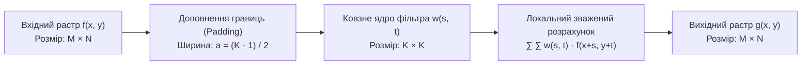
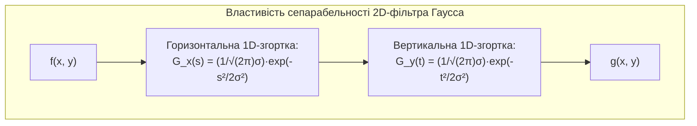
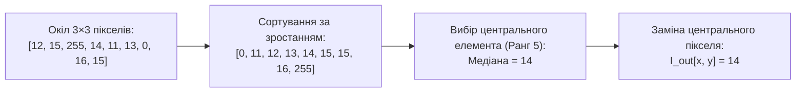
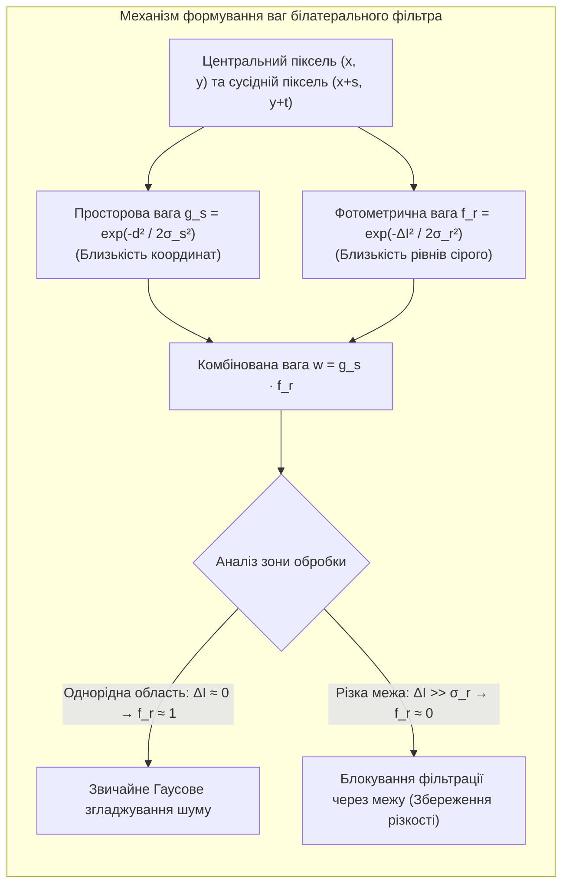

# ТЕМА 7. ПРОСТОРОВА ФІЛЬТРАЦІЯ ЗОБРАЖЕНЬ У ПРОСТОРОВІЙ ОБЛАСТІ

---

## 7.1. Основи 2D-згортки та кореляції матриць. Ядро просторового фільтра (маска), механізми обробки крайових пікселів

### Основний зміст та теоретичний базис

**Просторова фільтрація зображень** є базовою технологією контекстної обробки растрових даних, за якої результуюче значення яскравості кожного вихідного пікселя формується на основі аналізу локальної групи сусідніх пікселів вхідного растра. Ця операція є двовимірним розширенням концепції фільтрації в часовій області й здійснюється шляхом переміщення дискретної вагового вікна — **маски (ядра фільтра, *kernel*)** — вздовж усього двовимірного поля зображення.

Математичним фундаментом просторової лінійної фільтрації виступають операції **двовимірної дискретної взаємної кореляції** та **двовимірної дискретної згортки**. Для вхідного монохромного растра $f(x, y)$ розмірністю $M \times N$ та просторової маски фільтра $w(s, t)$ непарної розмірності $K \times K$ (де $K = 2a + 1$, а просторові зміщення маски лежать у межах $-a \le s, t \le a$), операція двовимірної кореляції описується виразом:

$$g_{\text{corr}}(x, y) = w(x, y) \otimes f(x, y) = \sum_{s=-a}^{a} \sum_{t=-a}^{a} w(s, t) f(x + s, y + t)$$

де $f(x + s, y + t)$ позначає значення яскравості пікселя у поточному просторовому околі; $w(s, t)$ — ваговий коефіцієнт маски фільтра за просторовими координатами $(s, t)$ відносно геометричного центру ядра $(0, 0)$; $g_{\text{corr}}(x, y)$ — результуюче значення відфільтрованого пікселя у вузлі $(x, y)$.

Операція **двовимірної лінійної згортки** відрізняється від кореляції тим, що матриця ядра $w(s, t)$ попередньо дзеркально обертається на $180^\circ$ відносно свого центру (виконується подвійна інверсія просторових координат $s \to -s, t \to -t$):

$$g_{\text{conv}}(x, y) = w(x, y) * f(x, y) = \sum_{s=-a}^{a} \sum_{t=-a}^{a} w(s, t) f(x - s, y - t)$$

Якщо маска фільтра володіє центральною або осьовою просторовою симетрією ($w(s, t) = w(-s, -t)$), що є характерним для більшості згладжувальних та ізотропних диференціальних операторів, операції кореляції та згортки стають математично тотожними.

*Рисунок 7.1 — Структурна схема просторової фільтрації зображення за допомогою ковзного двовимірного ядра з крайовим доповненням*

При переміщенні ковзної маски вздовж периферійних ділянок зображення виникає **крайовий ефект (border problem)**, коли частина вагових коефіцієнтів ядра виходить за межі фізичного координатного поля кадру. Для розв'язання цієї проблеми вхідний растр штучно розширюють на величину радіуса маски $a = (K - 1)/2$ за допомогою методів крайового доповнення (**padding**):

*   **Доповнення нулями або сталою величиною (*Constant padding / Zero padding*):** усі фіктивні пікселі за межами вихідного растра заповнюються нульовим значенням або фіксованою константою $C$, що може призводити до появи штучних темних рамок по краях кадру.
*   **Реплікація крайніх пікселів (*Replicate / Nearest padding*):** координати пікселів, що вийшли за межі сітки, замінюються значеннями найближчих граничних пікселів зображення: $f(x, y) = f(\text{clamp}(x, 0, M-1), \text{clamp}(y, 0, N-1))$, що мінімізує градієнтні збурення.
*   **Дзеркальне відображення без повторення межі (*Reflect 101 / Default mirror*):** пікселі крайової смуги відображаються симетрично відносно крайнього елемента (послідовність відліків $a, b, c, d$ розширюється як $c, b | a, b, c, d | c, b$), забезпечуючи найвищу гладкість просторових похідних.
*   **Періодичне циклічне загортання (*Wrap / Periodic padding*):** координати пікселів обчислюються за модулем розмірності растра ($x \bmod M, y \bmod N$), що є математично необхідним при фільтрації у спектральній області 2D-FFT.

---

## 7.2. Лінійні згладжувальні фільтри: усереднюючий фільтр (Box filter), двовимірний фільтр Гаусса (Gaussian Blur)

### Основний зміст та теоретичний базис

**Лінійні згладжувальні (низькочастотні) просторові фільтри** призначені для придушення високочастотного адитивного шуму, зменшення дрібної плямистості та згладжування різких перепадів інтенсивності. Їхня дія базується на усередненні значень пікселів у локальному околі. Для збереження середньої інтегральної яскравості та постійної складової зображення сума всіх коефіцієнтів згладжувального ядра обов'язково повинна дорівнювати одиниці (умова нормування):

$$\sum_{s=-a}^{a} \sum_{t=-a}^{a} w(s, t) = 1$$

Найпростішим представником є **прямокутний усереднюючий фільтр (*Box filter*)**, усі коефіцієнти якого є строго однаковими і дорівнюють оберненій площі маски $1 / K^2$. Ядра усереднюючого фільтра розмірністю $3 \times 3$ та $5 \times 5$ мають таку матричну структуру:

$$K_{\text{box}, 3\times 3} = \frac{1}{9} \begin{bmatrix}
1 & 1 & 1 \\
1 & 1 & 1 \\
1 & 1 & 1
\end{bmatrix}, \quad
K_{\text{box}, 5\times 5} = \frac{1}{25} \begin{bmatrix}
1 & 1 & 1 & 1 & 1 \\
1 & 1 & 1 & 1 & 1 \\
1 & 1 & 1 & 1 & 1 \\
1 & 1 & 1 & 1 & 1 \\
1 & 1 & 1 & 1 & 1
\end{bmatrix}$$

Усереднюючий фільтр володіє максимальною обчислювальною швидкодією, оскільки його матриця є сепарабельною (може бути представлена як добуток одновимірних векторів $K = \mathbf{u} \cdot \mathbf{v}^T$), проте він викликає значне розмиття структурних контурів і створює сходинкові псевдоконтурні артефакти через різкий прямокутний профіль вагової функції.

Більш досконалим лінійним фільтром є **двовимірний фільтр Гаусса (*Gaussian Blur*)**, вагові коефіцієнти якого спадають від центру до периферії відповідно до закону двовимірного нормального розподілу:

$$G(x, y) = \frac{1}{2\pi \sigma^2} \exp\left( -\frac{x^2 + y^2}{2\sigma^2} \right)$$

де $\sigma$ — середньоквадратичне відхилення (параметр розмиття Гаусса), що задає просторову ширину дзвоноподібного профілю; $(x, y)$ — декартові координати відносно центру ядра.

*Рисунок 7.2 — Схема сепарабельної реалізації двовимірного фільтра Гаусса шляхом послідовної одновимірної обробки рядків і стовпців*

Фільтр Гаусса володіє важливою математичною властивістю **сепарабельності** ($G(x, y) = G(x) \cdot G(y)$), що дозволяє замінити трудомістку двовимірну згортку розмірністю $K \times K$ двома послідовними одновимірними згортками розмірністю $1 \times K$ та $K \times 1$. Це скорочує кількість операцій множення на один піксель із $K^2$ до $2K$. Крім того, функція Гаусса є ізотропною (володіє ідеальною круговою симетрією), завдяки чому згладжування здійснюється рівномірно за всіма напрямками без спрямованих спотворень.

Дискретні нормовані цілочислові апроксимації ядер Гаусса для розмірностей $3 \times 3$ ($\sigma \approx 0.85$) та $5 \times 5$ ($\sigma \approx 1.0$) мають вигляд:

$$K_{\text{gauss}, 3\times 3} = \frac{1}{16} \begin{bmatrix}
1 & 2 & 1 \\
2 & 4 & 2 \\
1 & 2 & 1
\end{bmatrix}, \quad
K_{\text{gauss}, 5\times 5} = \frac{1}{273} \begin{bmatrix}
1 & 4 & 7 & 4 & 1 \\
4 & 16 & 26 & 16 & 4 \\
7 & 26 & 41 & 26 & 7 \\
4 & 16 & 26 & 16 & 4 \\
1 & 4 & 7 & 4 & 1
\end{bmatrix}$$

---

## 7.3. Нелінійні просторові фільтри: медіанний фільтр (Median blur) для усунення імпульсного шуму, фільтри мінімуму та максимуму

### Основний зміст та теоретичний базис

Лінійні фільтри є неефективними при обробці зображень, спотворених **імпульсним шумом («сіль та перець», *salt and pepper noise*)**, що виникає внаслідок збоїв аналогово-цифрового перетворення або дефектів окремих фотодіодів матриці. Оскільки імпульсний шум має вигляд ізольованих екстремальних викидів максимальної (255) або мінімальної (0) яскравості, лінійне усереднення розмиває одиничний дефект у велику напівпрозору пляму, не усуваючи його енергію.

У таких випадках застосовують нелінійні **рангові (порядкові) фільтри**, робота яких базується на попередньому впорядкуванні (сортуванні) значень пікселів локального околу.

*Рисунок 7.3 — Алгоритмічний конвеєр статистичного сортування та вилучення медіанного значення яскравості в апертурі 3×3*

**Медіанний фільтр (*Median filter*)** замінює яскравість центрального пікселя медіаною варіаційного ряду, утвореного відліками ковзного вікна $S_{x,y}$:

$$g_{\text{median}}(x, y) = \text{median}\big( \{ f(x + s, y + t) \mid (s, t) \in S_{x,y} \} \big)$$

Оскільки поодинокі імпульсні шумові викиди після сортування завжди потрапляють на крайні позиції варіаційного ряду (на початок або в кінець списку), вони повністю відсікаються при виборі центрального елемента. Важливою перевагою медіанного фільтра є його здатність зберігати монотонні сходинкові контури без розмиття границь за умови, що розмір вікна фільтра не перевищує подвоєного розміру структурного об'єкта.

**Фільтри екстремальних рангів (фільтри мінімуму та максимуму):**
*   **Фільтр мінімуму (морфологічна ерозія півтонів):** обирає найменше значення яскравості у вікні $g_{\min}(x, y) = \min_{(s,t) \in S} f(x+s, y+t)$, що забезпечує повне видалення позитивних високоінтенсивних імпульсів шуму («сіль»), проте викликає загальне затемнення растра та розширення темних об'єктів.
*   **Фільтр максимуму (морфологічна діляція півтонів):** обирає найбільше значення яскравості у вікні $g_{\max}(x, y) = \max_{(s,t) \in S} f(x+s, y+t)$, ефективно усуваючи негативні низькоінтенсивні імпульси шуму («перець») із одночасним висвітленням сцени та розростанням світлих ділянок.

---

## 7.4. Двостороння (Bilateral) фільтрація для збереження меж при шумозаглушенні

### Основний зміст та теоретичний базис

Головним недоліком фільтра Гаусса є його неспроможність розрізняти високочастотний шум та корисні просторові межі об'єктів: згладжуючи флуктуації, він неминуче розмиває чіткі контури та текстурні переходи. Для подолання цього обмеження застосовують **двосторонній (білатеральний) фільтр (*Bilateral filter*)**, запропонований Томазі та Мандучі (1998 р.).

Білатеральний фільтр є нелінійним адаптивним фільтром, ваговий коефіцієнт кожного пікселя в якому формується як добуток двох незалежних ядер Гаусса — **просторового ядра (*spatial domain*)** та **ядра фотометричної подібності за яскравістю (*range domain*)**:

$$I_{\text{bilat}}(x, y) = \frac{1}{W_p(x, y)} \sum_{s=-a}^{a} \sum_{t=-a}^{a} I_{\text{in}}(x+s, y+t) \cdot g_s(s, t) \cdot f_r\big(I_{\text{in}}(x+s, y+t), I_{\text{in}}(x, y)\big)$$

де просторовий ваговий коефіцієнт $g_s(s, t)$ визначається геометричною відстанню від центру маски:

$$g_s(s, t) = \exp\left( -\frac{s^2 + t^2}{2\sigma_s^2} \right)$$

а фотометричний ваговий коефіцієнт $f_r(I_1, I_2)$ залежить від абсолютної різниці рівнів яскравості між сусіднім та центральним пікселями:

$$f_r\big(I_{\text{in}}(x+s, y+t), I_{\text{in}}(x, y)\big) = \exp\left( -\frac{\big(I_{\text{in}}(x+s, y+t) - I_{\text{in}}(x, y)\big)^2}{2\sigma_r^2} \right)$$

Нормуючий множник $W_p(x, y)$ гарантує збереження середнього енергетичного балансу:

$$W_p(x, y) = \sum_{s=-a}^{a} \sum_{t=-a}^{a} g_s(s, t) \cdot f_r\big(I_{\text{in}}(x+s, y+t), I_{\text{in}}(x, y)\big)$$

де $\sigma_s$ — параметр просторового розмиття (геометричний радіус дії фільтра); $\sigma_r$ — параметр амплітудної чутливості за яскравістю (радіометричний поріг розрізнення меж).

*Рисунок 7.4 — Двовимірний механізм селективного зважування в білатеральному фільтрі залежно від просторової та колориметричної відстаней*

В однорідних областях зображення різниця яскравостей сусідніх пікселів є малою ($|I_{\text{in}}(x+s, y+t) - I_{\text{in}}(x, y)| \ll \sigma_r$), тому фотометрична вага наближається до одиниці ($f_r \approx 1$), і фільтр функціонує як звичайний згладжувальний фільтр Гаусса, ефективно придушуючи високочастотний шум. 

Коли ж у зону апертури потрапляє різка просторова межа (контур об'єкта), різниця яскравостей пікселів по різні боки межі значно перевищує параметр $\sigma_r$. Внаслідок цього значення $f_r$ експоненціально прямує до нуля, практично виключаючи пікселі іншого боку контуру з процесу усереднення. Це дозволяє ефективно згладжувати шум всередині сегментів без розмиття границь між ними.

---

## 7.5. Диференціальні фільтри підвищення різкості на основі дискретного оператора Лапласа (Лапласіан)

### Основний зміст та теоретичний базис

**Підвищення різкості (акцентування деталей, *image sharpening*)** є високочастотною просторовою операцією, спрямованою на підкреслення тонких ліній, текстурних переходів та контурів об'єктів. Математичною основою підвищення різкості є обчислення других просторових похідних за допомогою лінійного диференціального **оператора Лапласа (Лапласіана)**:

$$\nabla^2 f(x, y) = \frac{\partial^2 f(x, y)}{\partial x^2} + \frac{\partial^2 f(x, y)}{\partial y^2}$$

У дискретному просторі другі частинні похідні апроксимуються центральними скінченними різницями другого порядку:

$$\frac{\partial^2 f}{\partial x^2} \approx f(x+1, y) + f(x-1, y) - 2f(x, y)$$

$$\frac{\partial^2 f}{\partial y^2} \approx f(x, y+1) + f(x, y-1) - 2f(x, y)$$

Підсумовуючи ці компоненти, отримуємо дискретну модель 4-зв'язного ізотропного Лапласіана:

$$\nabla^2 f(x, y) \approx f(x+1, y) + f(x-1, y) + f(x, y+1) + f(x, y-1) - 4f(x, y)$$

Враховуючи також внесок діагональних сусідів, отримуємо 8-зв'язну ізотропну апроксимацію Лапласіана з кутовою інваріантністю з кроком $45^\circ$. Матриці ядер Лапласа розмірністю $3 \times 3$ (для 4- та 8-зв'язності) та розмірністю $5 \times 5$ мають вигляд:

$$K_{\text{lap}, 3\times 3}^{(4)} = \begin{bmatrix}
0 & 1 & 0 \\
1 & -4 & 1 \\
0 & 1 & 0
\end{bmatrix}, \quad
K_{\text{lap}, 3\times 3}^{(8)} = \begin{bmatrix}
1 & 1 & 1 \\
1 & -8 & 1 \\
1 & 1 & 1
\end{bmatrix}, \quad
K_{\text{lap}, 5\times 5} = \begin{bmatrix}
0 & 0 & -1 & 0 & 0 \\
0 & -1 & -2 & -1 & 0 \\
-1 & -2 & 16 & -2 & -1 \\
0 & -1 & -2 & -1 & 0 \\
0 & 0 & -1 & 0 & 0
\end{bmatrix}$$

Сума коефіцієнтів будь-якого ядра Лапласіана строго дорівнює нулю ($\sum w = 0$), що обумовлює повне обнулення постійної складової в однорідних областях та формування нульового відгуку на ділянках із постійною яскравістю.

Формування підсиленого за різкістю зображення $g_{\text{sharp}}(x, y)$ здійснюється шляхом віднімання обчисленого Лапласіана від вихідного растра (якщо центральний коефіцієнт ядра Лапласа від'ємний) або його додавання (якщо центральний коефіцієнт додатний):

$$g_{\text{sharp}}(x, y) = f(x, y) - c \cdot \nabla^2 f(x, y)$$

де $c \ge 0$ — ваговий коефіцієнт підсилення різкості (зазвичай $c \in [0.5; 1.5]$).

Об'єднання операції вилучення вихідного сигналу та віднімання Лапласіана в єдине еквівалентне просторове ядро формує **матриці прямого підвищення різкості (*Sharpening kernels*)**:

$$K_{\text{sharp}, 3\times 3} = \begin{bmatrix}
0 & -1 & 0 \\
-1 & 5 & -1 \\
0 & -1 & 0
\end{bmatrix}, \quad
K_{\text{sharp}, 3\times 3}^{(\text{diag})} = \begin{bmatrix}
-1 & -1 & -1 \\
-1 & 9 & -1 \\
-1 & -1 & -1
\end{bmatrix}, \quad
K_{\text{sharp}, 5\times 5} = \begin{bmatrix}
-1 & -3 & -4 & -3 & -1 \\
-3 & 0 & 6 & 0 & -3 \\
-4 & 6 & 21 & 6 & -4 \\
-3 & 0 & 6 & 0 & -3 \\
-1 & -3 & -4 & -3 & -1
\end{bmatrix}$$

Сума коефіцієнтів ядер підвищення різкості завжди дорівнює одиниці ($\sum w = 1$), що гарантує збереження фонового рівня яскравості зображення при суттєвому загостренні градієнтних меж.

| Тип просторового фільтра | Математичний клас | Ефективність: Гаусів шум | Ефективність: Шум «сіль та перець» | Ступінь збереження меж | Обчислювальна складність |
| :--- | :--- | :--- | :--- | :--- | :---: |
| **Box Filter** | Лінійний (ФНЧ) | Добра | Низька (розмиває імпульси) | Низька (сильне розмиття) | **$\mathcal{O}(1)$** (через інтегральні зображення) |
| **Gaussian Blur** | Лінійний (ФНЧ) | **Висока** | Низька | Середня (ізотропне розмиття) | $\mathcal{O}(K)$ (сепарабельний) |
| **Median Filter** | Нелінійний (Ранговий) | Посередня | **Ідеальна** (повне видалення) | **Висока** (зберігає сходинки) | $\mathcal{O}(K^2 \log K)$ (сортування) |
| **Bilateral Filter** | Нелінійний (Адаптивний) | **Висока** | Середня | **Найвища** (ідеальні контури) | $\mathcal{O}(K^2)$ (не сепарабельний) |
| **Laplacian Sharpen** | Лінійний (ФВЧ) | Підсилює шум | Підсилює шум | Підкреслює та загострює | $\mathcal{O}(K^2)$ |

Порівняльний аналіз показує, що для придушення широкосмугового нормального шуму найефективнішим є фільтр Гаусса або білатеральний фільтр, тоді як при наявності бінарних імпульсних викидів безальтернативним інструментом виступає медіанний фільтр. Диференціальні фільтри підвищення різкості вимагають обов'язкової попередньої фільтрації завад, оскільки оператор Лапласа різко підсилює високочастотний шум.

---

### Питання для самоперевірки та аналітичного осмислення

1. У чому полягає фундаментальна математична відмінність між операціями двовимірної взаємної кореляції та двовимірної згортки матриць, і за яких умов просторова фільтрація кореляцією та згорткою дає абсолютно однаковий числовий результат?
2. Опишіть фізичний механізм виникнення крайового ефекту при просторовій фільтрації. Проведіть порівняльний аналіз методів доповнення границь (Zero padding, Replicate padding, Reflect padding) за критерієм мінімізації крайових спотворень.
3. Доведіть властивість сепарабельності двовимірного фільтра Гаусса. Який математичний та апаратний виграш у кількості операцій множення надає застосування двох послідовних одновимірних згорток замість повної 2D-згортки?
4. Поясніть причину абсолютної неефективності лінійних усереднюючих фільтрів при придушенні імпульсного шуму типу «сіль та перець». Чому нелінійний медіанний фільтр здатен повністю ліквідувати імпульсні викиди без суттєвого розмиття контрастних контурів?
5. Наведіть аналітичну формулу білатерального фільтра (Bilateral filter). Яким чином взаємодія просторового ядра $g_s$ та фотометричного ядра $f_r$ забезпечує адаптивне шумозаглушення зі збереженням різкості меж об'єктів?
6. Виведіть матричну форму дискретного оператора Лапласа на основі скінченно-різницевої апроксимації других частинних похідних. Чому сума коефіцієнтів ядра Лапласіана повинна строго дорівнювати нулю, а сума коефіцієнтів ядра прямого підвищення різкості — одиниці?