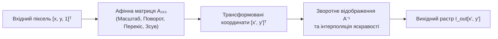
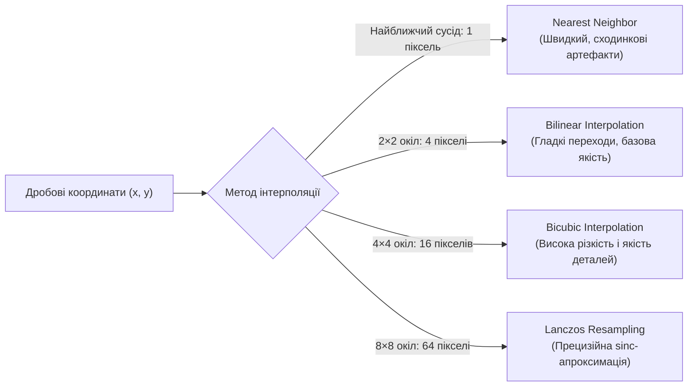
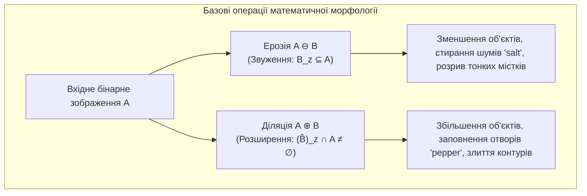
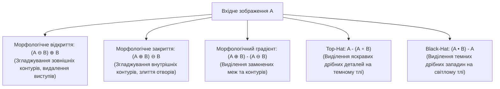

# ТЕМА 8. ГЕОМЕТРИЧНІ ТРАНСФОРМАЦІЇ ТА МАТЕМАТИЧНА МОРФОЛОГІЯ ЗОБРАЖЕНЬ

---

## 8.1. Загальна математична модель афінного перетворення у 2D-просторі: однорідні координати, матриця $2 \times 3$. Елементарні перетворення

### Основний зміст та теоретичний базис

**Геометричні перетворення зображень** являють собою клас просторових операцій, які змінюють просторове розташування пікселів, їхні взаємні геометричні зв'язки та форму об'єктів на площині растра відповідно до заданого координатного закону відображення. На відміну від амплітудних поелементних та фільтраційних методів, які змінюють значення яскравості в нерухомій координатній сітці, геометричні трансформації переносять значення яскравості зі старих просторових координат $(x, y)$ у нові просторові координати $(x', y')$.

Загальне просторове перетворення координат описується парою двовимірних функціональних відображень:

$$x' = f_x(x, y), \quad y' = f_y(x, y)$$

де $(x, y)$ — вихідні декартові координати пікселя вхідного растра; $(x', y')$ — розраховані координати пікселя трансформованого зображення.

**Афінним перетворенням** (від латинського *affinis* — «споріднений», «пов'язаний») називається взаємно однозначне (бієктивне) відображення площини на себе, за якого довільна пряма лінія переходить у пряму лінію. В евклідовому просторі загальна модель афінної трансформації виражається векторно-матричним рівнянням:

$$\mathbf{x}' = \mathbf{M} \mathbf{x} + \mathbf{v} \quad \Longleftrightarrow \quad \begin{bmatrix} x' \\ y' \end{bmatrix} = \begin{bmatrix} a_{11} & a_{12} \\ a_{21} & a_{22} \end{bmatrix} \begin{bmatrix} x \\ y \end{bmatrix} + \begin{bmatrix} t_x \\ t_y \end{bmatrix}$$

де $\mathbf{M}$ — невироджена дійснісна квадратна матриця розмірності $2 \times 2$ ($\det(\mathbf{M}) \neq 0$), яка визначає масштабування, обертання та зсув осей; $\mathbf{v} = [t_x, t_y]^T$ — вектор лінійного паралельного перенесення (трансляції).

Для представлення лінійних операцій (множення на матрицю $\mathbf{M}$) та нелінійної трансляції (додавання вектора $\mathbf{v}$) у вигляді єдиного уніфікованого матричного добутку в комп'ютерній інженерії та комп'ютерній графіці застосовують апарат **однорідних координат (проективних координат)**. Двовимірна точка $(x, y)$ розширюється до тривимірного вектора $[x, y, 1]^T$, що дозволяє записати довільне афінне перетворення через квадратну матрицю розмірності $3 \times 3$, третій рядок якої завжди фіксований як $[0, 0, 1]$:

$$\begin{bmatrix} x' \\ y' \\ 1 \end{bmatrix} = \begin{bmatrix} a_{11} & a_{12} & t_x \\ a_{21} & a_{22} & t_y \\ 0 & 0 & 1 \end{bmatrix} \begin{bmatrix} x \\ y \\ 1 \end{bmatrix}$$

В інженерній практиці бібліотек обробки зображень (зокрема в OpenCV) фіксований нижній рядок опускають і оперують компактною **розширеною матрицею афінного перетворення** $\mathbf{A}_{2\times 3}$:

$$\mathbf{A}_{2\times 3} = \begin{bmatrix} a_{11} & a_{12} & t_x \\ a_{21} & a_{22} & t_y \end{bmatrix}$$


*Рисунок 8.1 — Алгоритмічний конвеєр афінної трансформації просторових координат цифрового зображення*

Довільна складна афінна трансформація формується як композиція (добуток матриць) чотирьох елементарних геометричних перетворень:

1. **Паралельне перенесення (зсув, *translation*):** зміщує зображення на відстань $t_x$ вздовж осі $X$ та на відстань $t_y$ вздовж осі $Y$:
   $$\mathbf{T}_{\text{trans}} = \begin{bmatrix} 1 & 0 & t_x \\ 0 & 1 & t_y \end{bmatrix}$$

2. **Масштабування (*scaling*):** змінює просторові розміри зображення у $c_x$ разів по горизонталі та у $c_y$ разів по вертикалі відносно початку координат:
   $$\mathbf{T}_{\text{scale}} = \begin{bmatrix} c_x & 0 & 0 \\ 0 & c_y & 0 \end{bmatrix}$$

3. **Обертання навколо початку координат $(0, 0)$ на кут $\theta$ (*rotation*):** здійснює поворот просторової площини проти годинникової стрілки:
   $$\mathbf{T}_{\text{rot}} = \begin{bmatrix} \cos\theta & -\sin\theta & 0 \\ \sin\theta & \cos\theta & 0 \end{bmatrix}$$

   У разі обертання навколо довільного центру $(x_c, y_c)$ з одночасним масштабуванням на коефіцієнт $s_{\text{scale}}$, модифікована матриця перетворення має вигляд:
   $$\mathbf{M}_{\text{rot\_center}} = \begin{bmatrix} \alpha & \beta & (1 - \alpha)x_c - \beta y_c \\ -\beta & \alpha & \beta x_c + (1 - \alpha)y_c \end{bmatrix}$$
   де $\alpha = s_{\text{scale}} \cdot \cos\theta$, $\beta = s_{\text{scale}} \cdot \sin\theta$.

4. **Перекіс (скіс або зсувна деформація, *shear*):** деформує прямокутну координатну сітку в паралелограм, зміщуючи координати однієї осі пропорційно координатам іншої:
   $$\mathbf{T}_{\text{shear}} = \begin{bmatrix} 1 & s_x & 0 \\ s_y & 1 & 0 \end{bmatrix}$$
   де $s_x$ — коефіцієнт скосу вздовж осі абсцис; $s_y$ — коефіцієнт скосу вздовж осі ординат.

**Фундаментальні інваріанти афінного перетворення:**
Афінні трансформації мають суворі геометричні властивості збереження:
*   Колінеарність: точки, що лежать на одній прямій до перетворення, гарантовано залишаються на одній прямій після трансформації.
*   **Паралельність прямих:** паралельні лінії за будь-яких параметрів матриці $\mathbf{A}_{2\times 3}$ залишаються строго паралельними.
*   Збереження відношення довжин відрізків, що лежать на паралельних прямих.
*   Збереження опуклості геометричних фігур (опукла множина залишається опуклою).

---

## 8.2. Перспективне перетворення (гомографія, матриця $3 \times 3$). Визначення матриці проекції за чотирма опорними точками. Методи просторової інтерполяції

### Основний зміст та теоретичний базис

**Перспективне перетворення (гомографія або проективна трансформація)** являє собою більш загальний клас геометричних операцій, який моделює центральну оптичну проекцію тривимірної площини об'єкта на двовимірну площину матриці фотоприймача камери. 

На відміну від афінних трансформацій, **перспективне перетворення не зберігає паралельність прямих ліній**. Паралельні лінії у просторі сцени (наприклад, краї дороги, рейки або протилежні сторони фасаду будівлі) на проективному зображенні перетинаються в єдиній просторовій точці, яка називається **точкою сходження (*vanishing point*)**.

Математично проективне перетворення описується в однорідних координатах за допомогою повної невиродженої матриці гомографії $\mathbf{H}$ розмірністю $3 \times 3$:

$$\begin{bmatrix} x' \cdot w' \\ y' \cdot w' \\ w' \end{bmatrix} = \begin{bmatrix} h_{11} & h_{12} & h_{13} \\ h_{21} & h_{22} & h_{23} \\ h_{31} & h_{32} & h_{33} \end{bmatrix} \begin{bmatrix} x \\ y \\ 1 \end{bmatrix} = \mathbf{H} \begin{bmatrix} x \\ y \\ 1 \end{bmatrix}$$

де $w'$ — масштабний проективний фактор. Декартові просторові координати результуючого пікселя $(x', y')$ розраховуються шляхом нелінійного ділення на проективний дільник $w'$:

$$x' = \frac{h_{11}x + h_{12}y + h_{13}}{h_{31}x + h_{32}y + h_{33}}, \quad y' = \frac{h_{21}x + h_{22}y + h_{23}}{h_{31}x + h_{32}y + h_{33}}$$

Нижній рядок матриці $[h_{31}, h_{32}, h_{33}]$ задає параметри перспективного скорочення вздовж осей кадру. Оскільки матриця гомографії визначена з точністю до довільного скалярного множника, її нормують за умовою $h_{33} = 1$, що залишає **8 незалежних ступенів вільності (Degrees of Freedom, DOF)** порівняно з 6 ступенями вільності афінного перетворення.

```mermaid
flowchart TD
    subgraph Transform_Comparison [Порівняння геометрії просторових перетворень]
        direction LR
        A["Вихідний прямокутник"] -->|Афінне перетворення (6 DOF)| B["Паралелограм<br>(Паралельність збережена)"]
        A -->|Перспективне перетворення (8 DOF)| C["Довільний чотирикутник<br>(Паралельність порушена, прямі сходяться)"]
    end
```
*Рисунок 8.2 — Порівняльний характер деформації вихідної прямокутної області при афінній та перспективній трансформаціях*

Єдиним проективним інваріантом перспективного перетворення для чотирьох колінеарних точок $A, B, C, D$, що лежать на одній прямій, є **подвійне (складне або ангармонічне) відношення**:

$$(A, B; C, D) = \frac{c - a}{c - b} \cdot \frac{d - b}{d - a} = \text{const}$$

Для однозначного розрахунку всіх 8 невідомих коефіцієнтів матриці гомографії $\mathbf{H}$ необхідно задати рівно **чотири пари відповідних опорних точок** $(x_i, y_i) \to (x'_i, y'_i)$ ($i = 1, 2, 3, 4$), жодні три з яких не лежать на одній прямій. Кожна пара точок формує два незалежні лінійні рівняння:

$$\begin{cases}
h_{11}x_i + h_{12}y_i + h_{13} - h_{31}x_i x'_i - h_{32}y_i x'_i = x'_i \\
h_{21}x_i + h_{22}y_i + h_{23} - h_{31}x_i y'_i - h_{32}y_i y'_i = y'_i
\end{cases}$$

Складена система з 8 лінійних алгебраїчних рівнянь розв'язується методом прямого лінійного перетворення (*Direct Linear Transformation, DLT*) або сингулярного розкладу матриць (SVD).

| Ознака порівняння | Афінне перетворення | Перспективне перетворення (Гомографія) |
| :--- | :--- | :--- |
| **Розмірність матриці** | $2 \times 3$ (або $3 \times 3$ із фіксованим $[0, 0, 1]$) | Повна $3 \times 3$ матриця |
| **Кількість ступенів вільності** | **6 DOF** | **8 DOF** |
| **Мінімальна кількість точок** | **3 точки** (6 рівнянь) | **4 точки** (8 рівнянь) |
| **Збереження паралельності** | **Так** (паралельні прямі залишаються паралельними) | **Ні** (прямі сходяться у точці сходження) |
| **Збереження відношення довжин** | **Так** (уздовж паралельних прямих) | **Ні** |
| **Збережений інваріант** | Колінеарність, паралельність, відношення площ | Колінеарність, подвійне (ангармонічне) відношення |
| **Основне застосування** | Поворот, масштабування, вирівнювання положення | Корекція ракурсу камер, випрямлення документів |

### Методи просторової інтерполяції яскравості

При прямому відображенні координат цілочислові вузли вхідного растра потрапляють у дробові позиції результуючої сітки, що викликає виникнення незаповнених порожнин або накладання пікселів. Щоб уникнути цього, застосовують **зворотне відображення (зворотне трасування, *backward mapping*)**: для кожного цілочислового пікселя вихідного растра $(x', y')$ розраховують відповідні неперервні дійсні координати у вхідному растрі через обернену матрицю $(x, y) = \mathbf{H}^{-1}(x', y')$. Оскільки координати $(x, y)$ виявляються дробовими, значення яскравості розраховують за допомогою методів просторової інтерполяції:


*Рисунок 8.3 — Класифікація методів просторової інтерполяції за розміром апертури та якістю реконструкції півтонів*

*   **Інтерполяція за найближчим сусідом (*Nearest Neighbor*):** яскравість пікселя прирівнюється до значення найближчого цілочислового вузла $I(x, y) = I[\text{round}(x), \text{round}(y)]$. Метод має мінімальну обчислювальну складність, проте породжує грубі сходинкові артефакти та розриви ліній.
*   **Білінійна інтерполяція (*Bilinear*):** використовує зважене усереднення чотирьох найближчих сусідніх пікселів $2 \times 2$. Інтерполяція виконується спочатку по горизонталі, потім по вертикалі з ваговими коефіцієнтами, пропорційними дробовим зміщенням $\Delta x = x - \lfloor x \rfloor$ та $\Delta y = y - \lfloor y \rfloor$:
   $$I(x, y) = (1 - \Delta x)(1 - \Delta y) I_{00} + \Delta x (1 - \Delta y) I_{10} + (1 - \Delta x) \Delta y I_{01} + \Delta x \Delta y I_{11}$$
*   **Бікубічна інтерполяція (*Bicubic*):** використовує окіл розміром $4 \times 4$ (16 пікселів) та кубічні сплайни, забезпечуючи високу візуальну якість, гладкість похідних та збереження гострих контурів без розмиття.
*   **Інтерполяція Ланцоша (*Lanczos Resampling*):** застосовує двовимірне ядро на основі віконної функції $\text{sinc}$ в апертурі $8 \times 8$ (64 пікселі), що мінімізує аліасинг та забезпечує найкращу математичну реконструкцію при масштабуванні високочастотних растрових структур.

---

## 8.3. Основи математичної морфології: поняття структуруючого елемента (ядра). Базові операції над бінарними та напівтоновими зображеннями: ерозія та діляція

### Основний зміст та теоретичний базис

**Математична морфологія** (створена Ж. Матероном та Ж. Серра у 1960-х рр.) являє собою нелінійну теоретико-множинну методологію аналізу просторових геометричних структур та форм об'єктів на зображенні. У морфологічній парадигмі бінарне зображення $A$ розглядається як дискретна підмножина двовимірного простору $A \subset \mathbb{Z}^2$, де пікселі об'єкта належать множині (мають значення 1), а пікселі фону — доповненню множини $A^c$ (значення 0).

Морфологічні перетворення виконуються за допомогою невеликого геометричного зонда відомої форми та розміру, який називається **структуруючим елементом (ядро, *structuring element*)** $B \subset \mathbb{Z}^2$. Структуруючий елемент має виділену центральну точку прив'язки — **початок координат (anchor point)**. Основними геометричними формами структуруючих елементів є прямокутник, симетричний хрест, ромб та диск:

$$B_{\text{cross}, 3\times 3} = \begin{bmatrix} 0 & 1 & 0 \\ 1 & 1 & 1 \\ 0 & 1 & 0 \end{bmatrix}, \quad B_{\text{rect}, 3\times 3} = \begin{bmatrix} 1 & 1 & 1 \\ 1 & 1 & 1 \\ 1 & 1 & 1 \end{bmatrix}, \quad B_{\text{ellipse}, 5\times 5} = \begin{bmatrix} 0 & 0 & 1 & 0 & 0 \\ 0 & 1 & 1 & 1 & 0 \\ 1 & 1 & 1 & 1 & 1 \\ 0 & 1 & 1 & 1 & 0 \\ 0 & 0 & 1 & 0 & 0 \end{bmatrix}$$


*Рисунок 8.4 — Функціональна протилежність базових морфологічних операцій ерозії та діляції*

**Ерозія (звуження, *erosion*)** бінарного зображення $A$ структуруючим елементом $B$ визначається як множина всіх точок зсуву $z$, при яких зсунутий структуруючий елемент $(B)_z$ повністю міститься всередині вихідної множини $A$:

$$A \ominus B = \{ z \in \mathbb{Z}^2 \mid (B)_z \subseteq A \}$$

де $(B)_z = \{ b + z \mid b \in B \}$ позначає трансляцію структуруючого елемента $B$ на просторовий вектор $z = [x, y]^T$. 

Ерозія зменшує геометричні розміри об'єктів переднього плану на величину радіуса структуруючого елемента, зрізає тонкі виступи, розриває вузькі перешийки між злиплими тілами та повністю видаляє дрібні ізольовані шумові об'єкти типу «сіль» (*salt noise*), лінійний розмір яких менший за розмір маски $B$.

**Діляція (розширення, нарощування, *dilation*)** бінарного зображення $A$ структуруючим елементом $B$ визначається як множина всіх точок зсуву $z$, при яких дзеркально відбитий відносно свого центру структуруючий елемент $(\hat{B})_z$ має хоча б одне спільне ненульове перетинання з множиною $A$:

$$A \oplus B = \{ z \in \mathbb{Z}^2 \mid (\hat{B})_z \cap A \neq \emptyset \}$$

де $\hat{B} = \{ -b \mid b \in B \}$ — симетричне відображення структуруючого елемента. 

Діляція збільшує площу об'єктів переднього плану, заповнює дрібні внутрішні розриви та чорні отвори типу «перець» (*pepper noise*), а також об'єднує просторово близькі фрагменти ліній у цілісні геометричні структури.

Операції ерозії та діляції володіють фундаментальною властивістю **морфологічної дуальності** відносно операції теоретико-множинного доповнення (інверсії бінарного растра $A^c$):

$$(A \ominus B)^c = A^c \oplus \hat{B}, \quad (A \oplus B)^c = A^c \ominus \hat{B}$$

Ерозія об'єктів переднього плану $A$ еквівалентна діляції фону $A^c$, і навпаки.

Для півтонових напівтонових зображень $f(x, y)$ операції морфології узагальнюються через використання концепції поверхневих функцій і зводяться до нелінійних операцій локального мінімуму та максимуму з плоским структуруючим елементом $B$:

$$(f \ominus B)(x, y) = \min_{(s, t) \in B} f(x + s, y + t)$$

$$(f \oplus B)(x, y) = \max_{(s, t) \in B} f(x - s, y - t)$$

---

## 8.4. Комбіновані морфологічні операції: відкриття (Opening), закриття (Closing), морфологічний градієнт, перетворення Top-Hat та Black-Hat

### Основний зміст та теоретичний базис

На базі послідовного застосування елементарних операцій ерозії та діляції з одним і тим самим структуруючим елементом будують складні фільтраційні та сегментаційні конвеєри просторового аналізу форми:


*Рисунок 8.5 — Класифікація комбінованих морфологічних операторів просторового аналізу*

### Морфологічне відкриття (*Morphological Opening*)

Морфологічним відкриттям множини $A$ структуруючим елементом $B$ називається послідовне виконання операції ерозії з наступною діляцією:

$$A \circ B = (A \ominus B) \oplus B$$

Відкриття згладжує контури об'єктів зсередини, зрізає тонкі зовнішні піки та перешийки і повністю усуває дрібні шумові фрагменти, зберігаючи при цьому загальні макроскопічні геометричні розміри та просторову площу великих тіл. Оператор відкриття володіє властивістю **ідемпотентності**: повторне застосування операції відкриття до вже відкритого зображення не викликає жодних додаткових змін:

$$(A \circ B) \circ B = A \circ B$$

### Морфологічне закриття (*Morphological Closing*)

Морфологічним закриттям множини $A$ структуруючим елементом $B$ називається послідовне виконання операції діляції з наступною ерозією:

$$A \bullet B = (A \oplus B) \ominus B$$

Закриття згладжує зовнішні контури об'єктів, ліквідує вузькі внутрішні западини, склеює тонкі тріщини та розриви ліній, а також заповнює дрібні порожнини без зміни вихідного просторового масштабу об'єктів. Операція закриття є ідемпотентною ($(A \bullet B) \bullet B = A \bullet B$) та дуальною до відкриття:

$$(A \circ B)^c = A^c \bullet \hat{B}, \quad (A \bullet B)^c = A^c \circ \hat{B}$$

### Морфологічний градієнт (*Morphological Gradient*)

Морфологічний градієнт являє собою різницю між результатом діляції та ерозії зображення, що дозволяє отримати чіткі межі та контури об'єктів:

$$\text{Grad}(A) = (A \oplus B) - (A \ominus B)$$

Для тонкого виділення країв застосовують також **внутрішній градієнт** $\text{Grad}_{\text{int}}(A) = A - (A \ominus B)$ (контур формується всередині межі об'єкта) та **зовнішній градієнт** $\text{Grad}_{\text{ext}}(A) = (A \oplus B) - A$ (контур формується на зовнішній стороні фону).

### Перетворення Top-Hat та Black-Hat

Морфологічні капелюхові фільтри призначені для компенсації значної просторової нерівномірності фонової освітленості та вилучення дрібних об'єктів:

*   **Перетворення «Верхній капелюх» (*White Top-Hat*):** обчислюється як різниця між вихідним зображенням та результатом його морфологічного відкриття:
   $$\text{TopHat}(A) = A - (A \circ B)$$
   Оскільки відкриття $A \circ B$ видаляє всі яскраві деталі, розмір яких менший за розмір ядра $B$, різницева операція виділяє виключно локальні яскраві піки, текстові символи та елементи дефектів на нерівномірно освітленому темному фоні.
*   **Перетворення «Нижній капелюх» (*Black-Hat / Bottom-Hat*):** обчислюється як різниця між морфологічним закриттям та вихідним зображенням:
   $$\text{BlackHat}(A) = (A \bullet B) - A$$
   Фільтр виділяє локальні темні западини, плями та тріщини, розмір яких менший за геометрію структуруючого елемента $B$, на світлому тлі.

| Морфологічна операція | Математичний вираз | Геометричний ефект на растрі | Основне практичне застосування |
| :--- | :--- | :--- | :--- |
| **Ерозія (Erosion)** | $A \ominus B$ | Рівномірне стиснення меж об'єкта | Видалення білого імпульсного шуму, розділення об'єктів |
| **Діляція (Dilation)** | $A \oplus B$ | Рівномірне розширення меж об'єкта | Заповнення чорних отворів, об'єднання розривів ліній |
| **Відкриття (Opening)** | $(A \ominus B) \oplus B$ | Зрізання виступів, видалення шуму | Очищення бінарних масок без зміни масштабу тіл |
| **Закриття (Closing)** | $(A \oplus B) \ominus B$ | Затягування тріщин, закриття пор | Зшивання розривів дорожньої розмітки, скелетизація |
| **Градієнт (Gradient)** | $(A \oplus B) - (A \ominus B)$ | Формування контурного абрису | Детектування границь об'єктів у машинному зорі |
| **Top-Hat** | $A - (A \circ B)$ | Виділення яскравих мікроструктур | Вирівнювання фону, мікроскопія, читання номерних знаків |
| **Black-Hat** | $(A \bullet B) - A$ | Виділення темних мікроструктур | Дефектоскопія тріщин металу, аналіз відбитків пальців |

---

### Питання для самоперевірки та аналітичного осмислення

1. У чому полягає математичний зміст афінного перетворення у двовимірному просторі? Доведіть, чому використання однорідних координат $[x, y, 1]^T$ дозволяє представити операцію трансляції у вигляді матричного множення.
2. Проведіть детальне порівняння афінних та перспективних перетворень (гомографії). Чому при перспективній трансформації паралельні прямі перетинаються у точках сходження, і який геометричний інваріант залишається незмінним для 4-х колінеарних точок?
3. Скільки пар відповідних точок необхідно задати для однозначного визначення матриці афінного перетворення ($2 \times 3$) та матриці гомографії ($3 \times 3$)? Наведіть математичну постановку задачі DLT для знаходження коефіцієнтів гомографії.
4. Поясніть алгоритмічний принцип зворотного відображення координат (backward mapping) при геометричних трансформаціях. Чому застосування білінійної або бікубічної інтерполяції є обов'язковим для усунення артефактів просторової дискретизації?
5. Дайте теоретико-множинне визначення операцій ерозії та діляції бінарного зображення за допомогою структуруючого елемента $B$. У чому полягає властивість морфологічної дуальності цих операцій?
6. Опишіть фізичний механізм вирівнювання нерівномірного освітлення за допомогою морфологічного фільтра Top-Hat. Чому операції морфологічного відкриття та закриття є ідемпотентними?