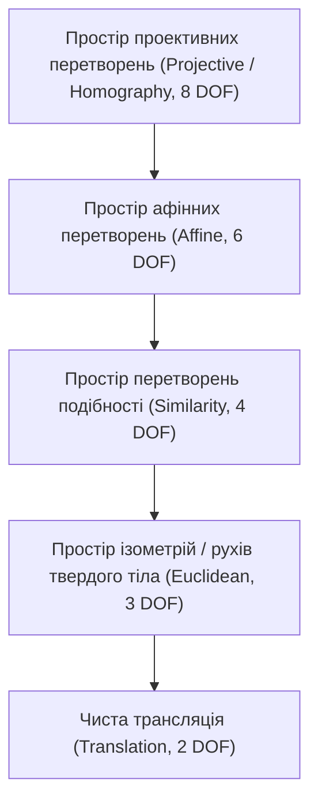
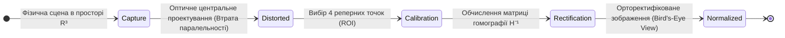
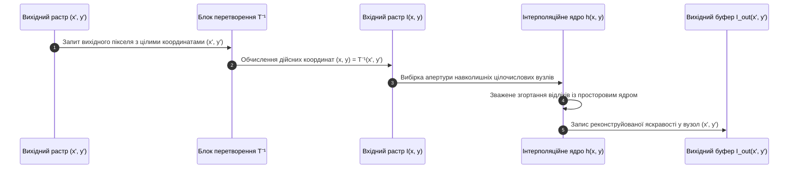
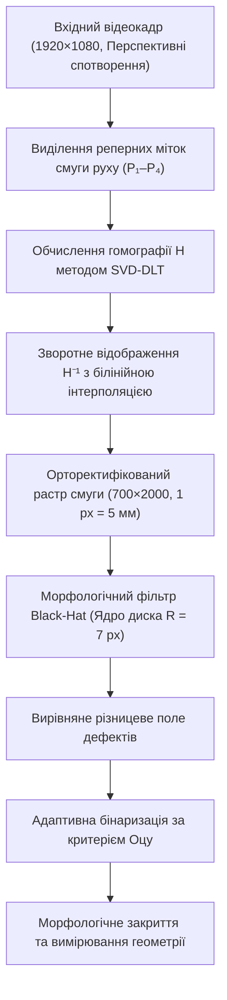

# Тема 8. Геометричні трансформації та математична морфологія зображень

## Мета лекції

Метою лекції є формування у здобувачів вищої освіти другого (магістерського) рівня комплексної системи поглиблених теоретичних знань і прикладних інженерних компетентностей щодо математичного моделювання просторових геометричних трансформацій та нелінійної теоретико-множинної обробки растрових даних. У межах навчальної дисципліни розглядається аналітичний апарат афінних і проективних перетворень, техніка однорідних координат, методи прямого лінійного оцінювання гомографії, просторова дискретизація при зворотній інтерполяції яскравості, а також нелінійна алгебра просторової морфології Мінковського. Опанування зазначеного теоретичного базису дозволить майбутнім інженерам-дослідникам проектувати швидкодіючі та стійкі до просторових деформацій і локальних імпульсних завад комп'ютерно-інтегровані системи технічного зору, автоматизованого оптико-електронного контролю, фотограмметрії та медико-біологічної діагностики.

## Очікувані результати навчання

1. **Знання та розуміння.** Здобувач демонструє ґрунтовне розуміння алгебраїчних засад двовимірних афінних і проективних перетворень, фізичного змісту однорідних координат, теоретико-множинної концепції розширення Мінковського, а також фундаментальних математичних властивостей морфологічних операторів ерозії, діляції, дуальності та ідемпотентності.
2. **Застосування.** Здобувач уміє формалізувати матричні рівняння просторових переходів координат, реалізовувати алгоритми прямого лінійного перетворення для оцінювання матриці гомографії за опорними точками, розраховувати ядра просторової інтерполяції та конструювати морфологічні фільтри відкриття, закриття, градієнта і капелюхових трансформацій за допомогою спеціалізованих математичних бібліотек.
3. **Аналіз.** Здобувач здатен здійснювати критичний порівняльний аналіз геометричних інваріантів у евклідовому, афінному та проективному просторах, диференціювати поведінку інтерполяційних фільтрів різних порядків за критеріями збереження високочастотних деталей і виникнення просторового аліасингу, а також оцінювати вплив топології структуруючого елемента на збереження морфометричних ознак об'єктів.
4. **Оцінювання та синтез.** Здобувач набуває здатності проектувати та оптимізувати наскрізні конвеєри попередньої геометричної нормалізації ракурсних спотворень і селективного морфологічного аналізу складних сцен в умовах суворих апаратних та часових обмежень систем обробки сигналів реального часу.

---

## Детальний покроковий план лекції

### 1. Теоретико-концептуальний базис. Алгебраїчні моделі проективної геометрії та теоретико-множинні засади просторової морфології
* 1.1. Концепція двовимірного афінного простору, векторно-матричний опис лінійних трансформацій та математичний апарат однорідних координат.
* 1.2. Матрична факторизація елементарних афінних операторів та фундаментальні просторові інваріанти збереження паралельності й колінеарності.
* 1.3. Модель центральної проективної геометрії, восьмипараметрична матриця гомографії та ангармонічне подвійне відношення чотирьох точок.
* 1.4. Теоретико-множинний базис математичної морфології, алгебра суми й різниці Мінковського, топологія структуруючого елемента та розширення операторів на напівтонові функції.

### 2. Методологія та аналіз граничних умов. Алгоритми просторової дискретизації, комбіновані морфологічні оператори та аберації перетворень
* 2.1. Концепція зворотного просторового відображення координат та порівняльний аналіз ядер інтерполяції найближчого сусіда, білінійної, бікубічної та апроксимації Ланцоша.
* 2.2. Чисельні методи розрахунку проективної матриці за методом прямого лінійного перетворення на основі сингулярного розкладу матриць.
* 2.3. Алгоритмічні схеми комбінованої морфології, властивість ідемпотентності відкриття й закриття та детектування крайових переходів морфологічним градієнтом.
* 2.4. Вирівнювання критичної нерівномірності просторового фону та виділення локальних екстремумів операторами білого й чорного капелюхів.
* 2.5. Критичні бар'єри дискретизації растра, геометричний аліасинг, спотворення ефективної апертури структуруючого елемента при зміні масштабу та фазові похибки ресемплінгу.

### 3. Практичний індустріальний / фаховий кейс. Системи технічного зору у транспортній телематиці та автоматизованому дефектоскопічному контролі
**Тема наскрізної задачі.** «Алгоритмічний комплекс калібрування перспективних спотворень дорожньої камери та субпіксельної морфологічної сегментації дефектів дорожнього полотна на нерівномірно освітленому тлі»

## 1. Теоретико-концептуальний базис. Алгебраїчні моделі проективної геометрії та теоретико-множинні засади просторової морфології

### 1.1. Концепція двовимірного афінного простору, векторно-матричний опис лінійних трансформацій та математичний апарат однорідних координат

У класичній теорії обробки сигналів більшість лінійних операцій зосереджена на модифікації амплітудних чи спектральних властивостей функцій у нерухомому базисі просторово-часових координат. На відміну від фільтрації чи амплітудної корекції, **геометричні перетворення зображень** змінюють безпосередньо просторові відношення між елементами растра, переносячи інформаційні значення яскравості з однієї координатної позиції в іншу. Формально цифрове монохромне зображення описується дискретною функцією $I(x, y)$, визначеною на цілочисловій решітці $\mathbb{Z}^2$, однак фундаментальний аналіз просторових трансформацій вимагає переходу до неперервного двовимірного евклідового або афінного простору $\mathbb{R}^2$. Геометрична модифікація сцени задається векторним відображенням просторових координат, за якого кожній вихідній точці $(x, y)$ ставиться у взаємно однозначну відповідність нова координатна пара $(x', y')$.

Векторно-матричний апарат лінійної алгебри дозволяє формалізувати базові просторові деформації за допомогою множення вектора координат на квадратну матрицю коефіцієнтів. Проте лінійне векторне перетворення за своєю природою неспроможне описати операцію паралельного перенесення (трансляції), оскільки будь-яке лінійне відображення обов'язково залишає нерухомим початок координат, тобто переводить нульовий вектор у нульовий. Внаслідок цього загальна модель афінної трансформації у декартових координатах набуває неоднорідного характеру, поєднуючи матричне множення з наступним додаванням вектора просторового зсуву:

$$\begin{bmatrix} x' \\ y' \end{bmatrix} = \mathbf{M} \begin{bmatrix} x \\ y \end{bmatrix} + \mathbf{v} = \begin{bmatrix} a_{11} & a_{12} \\ a_{21} & a_{22} \end{bmatrix} \begin{bmatrix} x \\ y \end{bmatrix} + \begin{bmatrix} t_x \\ t_y \end{bmatrix}$$

де матриця $\mathbf{M} \in \mathbb{R}^{2 \times 2}$ визначає лінійні деформації масштабу, обертання та скосу координатної сітки, а вектор $\mathbf{v} = [t_x, t_y]^T$ описує лінійне перенесення вздовж просторових осей абсцис та ординат.

Необхідність роздільного виконання операцій множення та додавання унеможливлює компактну факторизацію послідовних просторових маніпуляцій у формі єдиного матричного добутку. Ця проблема елегантно вирішується шляхом впровадження математичного апарату **однорідних координат**, що є фундаментальним інструментом проективної геометрії. Двовимірний евклідовий простір $\mathbb{R}^2$ ізоморфно занурюється у тривимірний проективний простір $\mathbb{P}^2$, де кожна декартова точка $(x, y)$ представляється класом еквівалентності тривимірних векторів $[X, Y, W]^T$, пов'язаних відношенням пропорційності. За умови $W \neq 0$ фізичні координати точки обчислюються шляхом нормалізації на проективний масштабний множник $W$:

$$x = \frac{X}{W}, \quad y = \frac{Y}{W}$$

Канонічним представленням точки в однорідних координатах є вектор із нормалізованою третьою компонентою $[x, y, 1]^T$. Використання даного базису трансформує операцію трансляції у лінійну матричну форму, дозволяючи звести загальне афінне перетворення до множення на квадратну матрицю розмірності $3 \times 3$, третій рядок якої завжди залишається фіксованим:

$$\begin{bmatrix} x' \\ y' \\ 1 \end{bmatrix} = \begin{bmatrix} a_{11} & a_{12} & t_x \\ a_{21} & a_{22} & t_y \\ 0 & 0 & 1 \end{bmatrix} \begin{bmatrix} x \\ y \\ 1 \end{bmatrix}$$

В інженерних програмних пакетах цифрової обробки сигналів та комп'ютерного зору нижній тривіальний рядок $[0, 0, 1]$ часто виключають із безпосередніх обчислень для економії обчислювальних тактів процесора, представляючи афінне перетворення компактною редукованою матрицею $\mathbf{A}_{2 \times 3}$. 

> **ПРАКТИЧНИЙ ЯКІР:** У системах цифрової стабілізації відеопотоку безпілотних літальних апаратів міжкадрові зміщення компенсуються в реальному часі саме через оцінювання матриці $\mathbf{A}_{2 \times 3}$, що дозволяє усувати високочастотне тремтіння камери без залучення ресурсомістких тривимірних проективних перерахунків.

### 1.2. Матрична факторизація елементарних афінних операторів та фундаментальні просторові інваріанти збереження паралельності й колінеарності

Довільне комплексне афінне відображення площини володіє шістьма ступенями вільності, що відповідає кількості вільних дійсних коефіцієнтів у розширеній матриці перетворення. Завдяки груповим властивостям афінних операторів, складна просторова деформація може бути аналітично факторизована у вигляді скінченного добутку матриць чотирьох канонічних елементарних перетворень, кожне з яких має чітко окреслений фізичний та геометричний зміст:

1. Оператор просторового паралельного перенесення (трансляції) $\mathbf{T}(t_x, t_y)$ зміщує координати кожного вузла растра на константні величини $t_x$ та $t_y$:
   $$\mathbf{T}(t_x, t_y) = \begin{bmatrix} 1 & 0 & t_x \\ 0 & 1 & t_y \\ 0 & 0 & 1 \end{bmatrix}$$

2. Оператор просторового масштабування $\mathbf{S}(c_x, c_y)$ змінює просторові інтервали вздовж координатних осей відповідно до масштабуючих коефіцієнтів $c_x$ та $c_y$, реалізуючи стиснення або розтягнення спектральних компонентів дискретизованого поля:
   $$\mathbf{S}(c_x, c_y) = \begin{bmatrix} c_x & 0 & 0 \\ 0 & c_y & 0 \\ 0 & 0 & 1 \end{bmatrix}$$

3. Оператор ізометричного повороту $\mathbf{R}(\theta)$ здійснює обертання площини на кут $\theta$ навколо початку координат проти годинникової стрілки:
   $$\mathbf{R}(\theta) = \begin{bmatrix} \cos\theta & -\sin\theta & 0 \\ \sin\theta & \cos\theta & 0 \\ 0 & 0 & 1 \end{bmatrix}$$

4. Оператор просторового скосу (зсувної деформації, *shear*) $\mathbf{Sh}(s_x, s_y)$ трансформує прямокутну ортогональну систему координат у косокутну, викликаючи зсув точок уздовж однієї з осей пропорційно їхній відстані до іншої осі:
   $$\mathbf{Sh}(s_x, s_y) = \begin{bmatrix} 1 & s_x & 0 \\ s_y & 1 & 0 \\ 0 & 0 & 1 \end{bmatrix}$$

У практичних задачах цифрової обробки зображень виникає потреба обертання сцени не відносно глобального початку координат $(0, 0)$, який зазвичай розташований у лівому верхньому кутку цифрового кадру, а навколо довільно обраного просторового центру $(x_c, y_c)$ з одночасним зміщенням масштабу на коефіцієнт $s_{\text{scale}}$. Алгебраїчно така композиція досягається конкатенацією трьох операторів, де спочатку здійснюється зсув центру повороту в нульову точку, потім поворот із масштабуванням, після чого виконується зворотне перенесення центру на його початкову позицію:

$$\mathbf{M}_{\text{rot}} = \mathbf{T}(x_c, y_c) \cdot \mathbf{S}(s_{\text{scale}}, s_{\text{scale}}) \cdot \mathbf{R}(\theta) \cdot \mathbf{T}(-x_c, -y_c)$$

Розкриваючи зазначений матричний добуток, отримуємо класичну аналітичну форму афінної матриці повороту навколо центру, що використовується в обчислювальних процедурах:

$$\mathbf{M}_{\text{rot}} = \begin{bmatrix} \alpha & \beta & (1 - \alpha)x_c - \beta y_c \\ -\beta & \alpha & \beta x_c + (1 - \alpha)y_c \end{bmatrix}$$

де базисні коефіцієнти визначаються тригонометричними функціями $\alpha = s_{\text{scale}} \cos\theta$ та $\beta = s_{\text{scale}} \sin\theta$.

> **ТИПОВА ПОМИЛКА:** Матричне множення просторових операторів не є комутативним ($\mathbf{A} \cdot \mathbf{B} \neq \mathbf{B} \cdot \mathbf{A}$). Спроба спочатку виконати поворот зображення навколо вихідного центру, а потім застосувати паралельне перенесення без урахування зміни орієнтації осей координат веде до суттєвого зміщення об'єкта за межі видимої області растра та втрати геометричної прив'язки.

Фундаментальне теоретичне значення афінних відображень полягає у наявності суворих **геометричних інваріантів**. Якщо довільне оптичне зображення зазнає афінної трансформації, його просторові властивості змінюються лише в межах збереження наступних топологічних співвідношень:
- прямі лінії залишаються строго прямими лініями, що гарантує збереження **колінеарності** довільної множини точок;
- взаємна **паралельність прямих** інваріантна до дії оператора, внаслідок чого паралелограми завжди трансформуються виключно в паралелограми;
- відношення довжин будь-яких двох колінеарних або паралельних відрізків зберігається незмінним;
- зберігається властивість опуклості просторових множин, тобто опуклий контур об'єкта після будь-якого афінного перетворення залишається опуклим;
- відношення площ будь-яких двох геометричних фігур на зображенні залишається строго постійним і дорівнює абсолютному значенню визначника лінійної частини матриці $|\det(\mathbf{M})|$.

### 1.3. Модель центральної проективної геометрії, восьмипараметрична матриця гомографії та ангармонічне подвійне відношення чотирьох точок

Афінна геометрична модель базується на припущенні про паралельне (ортографічне) проектування променів на площину приймача, що є адекватним наближенням лише за умови спостереження віддалених об'єктів телеоб'єктивами з малим кутом зору. У загальному випадку формування оптичного зображення ширококутними сенсорами світлові промені проходять через єдиний оптичний центр лінзи, підпорядковуючись законам центральної проективної геометрії (модель камери-обскури, *pinhole camera model*).

Якщо об'єкт дослідження являє собою плоску поверхню у тривимірному просторі, то просторове відображення між цією площиною та площиною матриці фотоприймача описується **проективним перетворенням (плоскою гомографією)**. На відміну від афінних трансформацій, **перспективне перетворення не зберігає паралельність прямих ліній**. Паралельні лінії сцени у проективній площині трансформуються в пучок прямих, що перетинаються у специфічній точці, яка називається **точкою сходження (*vanishing point*)**.

Математично плоска гомографія записується в однорідних координатах як довільне лінійне відображення тривимірного векторного простору за допомогою повної матриці $\mathbf{H} \in \mathbb{R}^{3 \times 3}$:

$$\begin{bmatrix} X' \\ Y' \\ W' \end{bmatrix} = \begin{bmatrix} h_{11} & h_{12} & h_{13} \\ h_{21} & h_{22} & h_{23} \\ h_{31} & h_{32} & h_{33} \end{bmatrix} \begin{bmatrix} x \\ y \\ 1 \end{bmatrix}$$

Для відновлення фізичних декартових координат точки на матриці сенсора виконується нелінійна операція проективної денормалізації (ділення на проективний масштабний фактор $W'$):

$$x' = \frac{X'}{W'} = \frac{h_{11}x + h_{12}y + h_{13}}{h_{31}x + h_{32}y + h_{33}}, \quad y' = \frac{Y'}{W'} = \frac{h_{21}x + h_{22}y + h_{23}}{h_{31}x + h_{32}y + h_{33}}$$

Знаменник у наведених співвідношеннях безпосередньо зумовлює ефект перспективного скорочення масштабу об'єктів у міру їхнього просторового віддалення від оптичного центру системи. Оскільки однорідні координати інваріантні до множення на довільний ненульовий скаляр $\lambda \neq 0$, матриця $\mathbf{H}$ та матриця $\lambda \mathbf{H}$ репрезентують одне й те саме геометричне проективне відображення. Таким чином, матриця гомографії має лише **вісім ступенів вільності (8 DOF)**. Для однозначної числової фіксації її коефіцієнтів зазвичай вводять умову нормування, наприклад $h_{33} = 1$ або $\|\mathbf{H}\|_F = 1$.

Оскільки паралельність ліній та відношення довжин відрізків при перспективній трансформації руйнуються, виникає фундаментальне питання щодо збереження просторових геометричних констант. Єдиним числовим інваріантом одновимірної проективної геометрії є **подвійне (ангармонічне або складне) відношення чотирьох колінеарних точок**. Для чотирьох точок $A, B, C, D$, розташованих на одній прямій лінії, подвійне відношення позначається символом $(A, B; C, D)$ та визначається відношенням спрямованих відрізків:

$$(A, B; C, D) = \frac{(c - a)(d - b)}{(c - b)(d - a)}$$

де $a, b, c, d$ — числові координати точок вздовж заданої прямої. Для будь-якої центральної оптичної проекції та для будь-якої гомографії $\mathbf{H}$ подвійне відношення трансформованих точок $A', B', C', D'$ строго зберігає свою величину:

$$(A', B'; C', D') = (A, B; C, D)$$

> **ПРАКТИЧНИЙ ЯКІР:** У системах автоматизованого зчитування номерних знаків транспортних засобів (ANPR) та інтелектуальних комплексах контролю смуг руху ADAS камери спостерігають дорожнє полотно під гострим кутом. Алгоритм синтезує вигляд «з висоти пташиного польоту» (*Bird’s-Eye View*) саме через множення растра на обернену матрицю гомографії $\mathbf{H}^{-1}$, що випрямляє трапецієподібну розмітку в паралельні смуги зі збереженням метричного масштабу.

> **КОНТРОЛЬНЕ ПИТАННЯ:** Під час калібрування системи технічного зору було зафіксовано, що паралельні лінії конвеєрної стрічки на зображенні перестали бути паралельними і сходяться в одній точці. Інженер стверджує, що для виправлення спотворення достатньо знайти матрицю афінного перетворення розміром $2 \times 3$ за трьома точками. Чи є це твердження коректним?
>
> 

> 
Розгорнути аналіз / відповідь

>
> **Правильний варіант: Ні, твердження є абсолютно хибним.**
>
> 1. Логічне та математичне обґрунтування:
> За визначенням, фундаментальним інваріантом будь-якого афінного перетворення є збереження паралельності прямих ліній. Якщо паралельні прямі фізичного об'єкта на зображенні перетинаються, це однозначно вказує на наявність перспективного (проективного) спотворення, зумовленого центральною проекцією оптичної системи камери. Афінне перетворення має лише 6 ступенів вільності (DOF) і параметрично неспроможне змінити положення лінії горизонту чи змоделювати проективне стиснення вздовж координати глибини. Для усунення такого спотворення необхідно застосовувати модель плоскої гомографії, що описується матрицею розмірністю $3 \times 3$ з 8 ступенями вільності, для розрахунку якої потрібно щонайменше чотири пари неколінеарних опорних точок.
>
> 2. Аналіз дистракторів:
> Спроба використати три точки дозволяє знайти лише коефіцієнти афінної матриці, проте результуюче зображення залишиться деформованим із непаралельними лініями розмітки. Використання афінного наближення замість проективного для виправлення ракурсу під кутом веде до грубих метричних помилок, які зростають пропорційно наближенню об'єкта до оптичного центру проекції.
>
> 

### 1.4. Теоретико-множинний базис математичної морфології, алгебра суми й різниці Мінковського, топологія структуруючого елемента та розширення операторів на напівтонові функції

На відміну від геометрії координатних просторів, яка оперує безперервними перетвореннями положення точок, **математична морфологія** досліджує топологічну форму, зв'язність та просторову структуру геометричних тіл на дискретному растрі. Створена у працях Жоржа Матерона та Жана Серра як розділ геостатистики, морфологія базується на теоретико-множинному підході та концепціях інтегральної геометрії.

У бінарній математичній морфології вхідне цифрове зображення розглядається як дискретна множина $A \subseteq \mathbb{Z}^2$, де елементи множини відповідають активним пікселям переднього плану зі значенням 1, а доповнення множини $A^c = \{z \in \mathbb{Z}^2 \mid z \notin A\}$ формує фоновий простір зі значенням 0. Зондування геометричної структури множини $A$ здійснюється за допомогою компактного тестового набору пікселів фіксованої форми, відомого як **структуруючий елемент** $B \subset \mathbb{Z}^2$. Структуруючий елемент володіє власним локальним началом координат, який називається **точкою прив'язки (anchor point)**.

Фундаментальними операціями, на яких базується вся морфологічна алгебра, є операції суми та різниці Мінковського. **Сума Мінковського** множини $A$ та структуруючого елемента $B$ визначається як покрокове просторове зміщення множини $A$ на всі можливі вектори, що належать множині $B$:

$$A \oplus B = \{a + b \mid a \in A, b \in B\} = \bigcup_{b \in B} (A)_b$$

де $(A)_b = \{a + b \mid a \in A\}$ позначає просторову трансляцію бінарного об'єкта $A$ на вектор $b$. 

Операція **морфологічної діляції (розширення, *dilation*)** полягає у формуванні суми Мінковського вхідного зображення з інвертованим (дзеркально відбитим відносно свого центру) структуруючим елементом $\hat{B} = \{-b \mid b \in B\}$. В інженерному аналізі діляція інтерпретується через геометричне перетинання:

$$A \oplus B = \{z \in \mathbb{Z}^2 \mid (\hat{B})_z \cap A \neq \emptyset\}$$

Діляція збільшує площу бінарних тіл переднього плану, відновлює штучно фрагментовані контури, закриває внутрішні отвори та об'єднує просторово близькі компоненти.

Операція **морфологічної ерозії (звуження, *erosion*)** $A \ominus B$ визначається через теоретико-множинну різницю Мінковського як локус усіх точок трансляції $z$, за яких структуруючий елемент повністю міститься всередині вхідної множини $A$:

$$A \ominus B = \{z \in \mathbb{Z}^2 \mid (B)_z \subseteq A\} = \bigcap_{b \in B} (A)_{-b}$$

Ерозія стискає границі бінарного об'єкта на величину просторової апертури структуруючого елемента, розриває тонкі перешийки між злиплими об'єктами однакової яскравості та повністю видаляє ізольовані завади, діаметр яких менший за розмір $B$.

Морфологічні оператори мають важливу властивість **подвійності (дуальності)** відносно інверсії логічного простору:

$$(A \ominus B)^c = A^c \oplus \hat{B}, \quad (A \oplus B)^c = A^c \ominus \hat{B}$$

Це фундаментальне співвідношення показує, що операція ерозії бінарного об'єкта $A$ топологічно еквівалентна діляції комплементарного фону $A^c$ інвертованим структуруючим елементом.

У випадках обробки монохромних півтонових сигналів $f(x, y)$, де кожна точка описується дискретним або неперервним значенням оптичної інтенсивності, теоретико-множинне формулювання узагальнюється на простір дійсних чи цілих функцій $\mathbb{Z}^2 \to \mathbb{R}$. Напівтонові морфологічні перетворення з використанням плоского структуруючого елемента $B$ (де функція ядра є нульовою всередині своєї носійної області $D_B$) замінюють теоретико-множинні включення на нелінійні екстремальні порядкові статистики — оператори ковзного локального мінімуму та максимуму:

$$(f \ominus B)(x, y) = \min_{(s, t) \in D_B} \{ f(x + s, y + t) \}$$

$$(f \oplus B)(x, y) = \max_{(s, t) \in D_B} \{ f(x - s, y - t) \}$$

Під впливом півтонової ерозії амплітудний рельєф сигналу темнішає, а його піки зрізаються відповідно до геометрії носія $D_B$. Натомість півтонова діляція розширює локальні максимуми яскравості, заливаючи темні западини та тріщини.

| Метод або підхід | Кількість параметрів (DOF) | Фундаментальні геометричні / алгебраїчні інваріанти | Математична модель оператора | Приклад з реальної практики |
| :--- | :--- | :--- | :--- | :--- |
| **Евклідове перетворення (Ізометрія)** | 3 (1 кут, 2 зміщення) | Довжини відрізків, кути між прямими, орієнтація площі | $\mathbf{x}' = \mathbf{R}(\theta)\mathbf{x} + \mathbf{v}$ | Оптичне вирівнювання положення мікросхеми перед поверхневим монтажем (SMT) |
| **Перетворення подібності (Similarity)** | 4 (1 кут, 2 зміщення, 1 масштаб) | Відношення довжин, кути між прямими | $\mathbf{x}' = s\mathbf{R}(\theta)\mathbf{x} + \mathbf{v}$ | Масштабоінваріантне суміщення супутникових знімків у геоінформаційних картах |
| **Афінне перетворення (Affine)** | 6 (4 матричні коефіцієнти, 2 зміщення) | Колінеарність точок, паралельність прямих, відношення площ | $\mathbf{x}' = \mathbf{M}_{2\times 2}\mathbf{x} + \mathbf{v}$ | Компенсація деформацій фотоплівки або сканованого аркуша паперу при витягуванні |
| **Проективне перетворення (Гомографія)** | 8 (елементи нормованої матриці $3 \times 3$) | Колінеарність точок, ангармонічне подвійне відношення | $\mathbf{x}' = \frac{1}{w'}(\mathbf{H}_{3\times 3}\mathbf{x})$ | Ортотрансформація фасадів будівель у фотограмметрії, дорожня розмітка ADAS |
| **Бінарна морфологія Мінковського** | Геометрія структуруючого елемента (диск, хрест) | Топологічна зв'язність компонентів, дуальність | $A \ominus B$, $A \oplus B$ | Сегментація відбитків пальців, підрахунок мікроорганізмів у біомедицині |
| **Півтонова екстремальна морфологія** | Розмір просторової апертури ядра ($N \times N$) | Монотонність, трансляційна інваріантність за амплітудою | $\min_{(s, t)} f$, $\max_{(s, t)} f$ | Вирівнювання освітлення рентгенівських знімків у промисловій томографії |

---

### Вказівки для самостійного осмислення

1. Здійсніть аналітичне виведення підсумкової матриці афінного перетворення для послідовності операцій: масштабування з коефіцієнтами $c_x = 2.0, c_y = 0.5$, поворот на кут $\theta = 45^\circ$ навколо точки $(x_c = 100, y_c = 100)$ та фінальний зсув на $t_x = -50, t_y = 30$, порівнявши результат із перетворенням, у якому поворот виконувався відносно глобального початку координат.
2. Доведіть за допомогою методів проективної геометрії інваріантність подвійного відношення чотирьох колінеарних точок при дії довільної неособливої матриці гомографії $\mathbf{H} \in \mathbb{R}^{3 \times 3}$, формалізувавши математичний вираз проекції прямої на пряму.
3. Продемонструйте на прикладі синтетичного дискретного одновимірного сигналу виконання властивості морфологічної дуальності для операцій півтонової ерозії та діляції, обчисливши значення локальних екстремумів при інверсії амплітудної шкали.

## 2. Методологія та аналіз граничних умов. Алгоритми просторової дискретизації, комбіновані морфологічні оператори та аберації перетворень

### 2.1. Концепція зворотного просторового відображення координат та порівняльний аналіз ядер інтерполяції найближчого сусіда, білінійної, бікубічної та апроксимації Ланцоша

Практична реалізація просторових геометричних перетворень у дискретному цифровому середовищі стикається з фундаментальною проблемою несумісності неперервних координатних відображень із регулярною цілочисловою сіткою пікселів. Під час використання прямого відображення координат (*forward mapping*), коли кожному вузлу вхідного растра $(x, y) \in \mathbb{Z}^2$ ставиться у відповідність трансформована точка $(x', y') = \mathbf{T}(x, y) \in \mathbb{R}^2$, розраховані значення координат у переважній більшості випадків виявляються дробовими дійсними числами. Округлення цих координат до найближчих цілих індексів результуючого масиву спричиняє появу двох важких просторових дефектів: виникнення незаповнених піксельних порожнин («дірок») у зонах геометричного розтягнення растра та взаємне перекриття (суперпозицію) кількох вхідних відліків в одній комірці вихідного масиву при просторовому стисненні.

Для повного усунення зазначених дефектів у сучасній цифровій обробці сигналів безальтернативно застосовується методологія **зворотного відображення (зворотного трасування, *backward mapping*)**. Її алгоритмічна сутність полягає в тому, що цільова цілочислова решітка вихідного зображення $(x', y') \in \mathbb{Z}^2$ розглядається як апріорно задана, а для кожного її вузла здійснюється зворотний пошук відповідних просторових координат у системі відліку вхідного растра за допомогою оберненого геометричного оператора:

$$(x, y) = \mathbf{T}^{-1}(x', y')$$

Оскільки отримана точка $(x, y)$ має дійсні (нецілочислові) координати і розташовується між регулярними вузлами вхідної матриці, визначення її дискретної яскравості вимагає застосування просторової дискретизації неперервного поля, реконструйованого методами локальної апроксимації або інтерполяції.

Загальна математична модель реконструкції напівтонової яскравості $I(x, y)$ за дискретними відліками формулюється як двовимірна згортка вхідного растра з неперервним інтерполяційним ядром $h(x, y)$:

$$I(x, y) = \sum_{k} \sum_{l} I[k, l] \cdot h(x - k, y - l)$$

де $I[k, l]$ — дискретні відліки яскравості вхідного зображення; $h(x, y)$ — просторово інваріантна вагове ядро інтерполяції. Для спрощення обчислень двовимірне ядро майже завжди обирають просторово сепарабельним, що зводить розрахунок до послідовного одновимірного зважування вздовж рядків та стовпців: $h(x, y) = h(x) \cdot h(y)$.

Ядро **інтерполяції за найближчим сусідом (*Nearest Neighbor*)** використовує прямокутну віконну функцію нульового порядку, за якої значення яскравості результуючого пікселя копіюється без змін із найближчого вузла дискретної решітки:

$$h_{\text{NN}}(x) = \begin{cases} 1, & |x| < 0.5 \\ 0, & |x| \ge 0.5 \end{cases}$$

Даний підхід має мінімальну обчислювальну складність $O(1)$, проте характеризується значними фазовими похибками, низьким ступенем спектрального придушення високочастотних копій сигналу та призводить до появи грубої сходинкової пікселізації контурів.

Ядро **білінійної інтерполяції (*Bilinear*)** базується на трикутній функції першого порядку і здійснює лінійне зважування значень чотирьох найближчих цілочислових пікселів, що формують одиничний квадрат навколо точки $(x, y)$:

$$h_{\text{linear}}(x) = \begin{cases} 1 - |x|, & |x| < 1 \\ 0, & |x| \ge 1 \end{cases}$$

Білінійна фільтрація повністю ліквідує розриви першого роду на реконструйованій поверхні яскравості, однак діє як типовий просторовий фільтр низьких частот, зрізаючи спектральні компоненти поблизу частоти Найквіста та спричиняючи помітне розмиття границь дрібних об'єктів.

Ядро **бікубічної інтерполяції (*Bicubic*)** апроксимує ідеальну інтерполяційну функцію за допомогою кубічних ермітових сплайнів у межах симетричної апертури розміром $4 \times 4$ пікселі (шістнадцять сусідніх точок). Аналітичний вираз параметричного ядра Кейса описується кусково-поліноміальною функцією:

$$h_{\text{cubic}}(x) = \begin{cases} (a + 2)|x|^3 - (a + 3)|x|^2 + 1, & |x| \le 1 \\ a|x|^3 - 5a|x|^2 + 8a|x| - 4a, & 1 < |x| < 2 \\ 0, & |x| \ge 2 \end{cases}$$

де коефіцієнт $a$ визначає нахил дотичної на краях інтервалу (у прикладних цифрових бібліотеках значення $a = -0.5$ або $a = -0.75$ забезпечує найкраще узгодження з критерієм неперервності перших похідних). Бікубічне ядро підсилює високочастотні просторові гармоніки, що забезпечує збереження візуальної різкості контурів, проте на різких перепадах яскравості може породжувати осциляційний артефакт Гіббса у вигляді хибних світлих або темних ореолів навколо країв (*ringing artifact*).

Ядро **апроксимації Ланцоша (*Lanczos Resampling*)** базується на симетричному зрізанні кардинального базису Котельникова за допомогою головної пелюстки функції $\text{sinc}$ в апертурі розміром $2m$ відліків (зазвичай обирають параметр $m = 3$, що потребує зважування тридцяти шести сусідніх пікселів):

$$h_{\text{Lanczos}}(x) = \begin{cases} \text{sinc}(\pi x) \cdot \text{sinc}\left(\frac{\pi x}{m}\right) = \frac{\sin(\pi x)}{\pi x} \cdot \frac{\sin(\pi x / m)}{\pi x / m}, & |x| < m \\ 0, & |x| \ge m \end{cases}$$

Метод Ланцоша мінімізує просторові аліасингові аберації і вважається математичним еталоном збереження енергетичного спектра при масштабуванні високодеталізованих зображень, однак вимагає значних обчислювальних витрат і спричиняє паразитні крайові осциляції поблизу сходинкових функцій яскравості.

> **ВАЖЛИВО:** Використання прямого відображення координат у системах прецизійного позиціонування призводить до стохастичної втрати до 15–20% відліків растра через дискретне проріджування при зміні кута орієнтації, тому зворотне трасування координат є обов'язковим інженерним стандартом для побудови топологічно коректних перетворень.

### 2.2. Чисельні методи розрахунку проективної матриці за методом прямого лінійного перетворення на основі сингулярного розкладу матриць

Для відновлення метричних характеристик сцени, спотвореної перспективним ракурсом центральної проекції, необхідно аналітично визначити вісім незалежних компонентів матриці гомографії $\mathbf{H} \in \mathbb{R}^{3 \times 3}$. Оскільки кожна пара відповідних реперних точок $(x_i, y_i) \leftrightarrow (x'_i, y'_i)$ пов'язана матричним рівнянням із точністю до невідомого проективного дільника $w'_i$:

$$\begin{bmatrix} x'_i \cdot w'_i \\ y'_i \cdot w'_i \\ w'_i \end{bmatrix} = \begin{bmatrix} h_{11} & h_{12} & h_{13} \\ h_{21} & h_{22} & h_{23} \\ h_{31} & h_{32} & h_{33} \end{bmatrix} \begin{bmatrix} x_i \\ y_i \\ 1 \end{bmatrix}$$

для виключення масштабного фактора застосовують векторний добуток. Однорідний вектор проектованої точки $\mathbf{x}'_i = [x'_i, y'_i, 1]^T$ та вектор $\mathbf{H}\mathbf{x}_i$ є колінеарними, тому їхній векторний добуток повинен дорівнювати нульовому вектору:

$$\mathbf{x}'_i \times (\mathbf{H}\mathbf{x}_i) = \mathbf{0}$$

Розкриття даного векторного добутку призводить до формування трьох алгебраїчних рівнянь відносно дев'яти елементів вектора $\mathbf{h} = [h_{11}, h_{12}, h_{13}, h_{21}, h_{22}, h_{23}, h_{31}, h_{32}, h_{33}]^T$, з яких лише два є лінійно незалежними. Повний цикл чисельного оцінювання гомографії методом прямого лінійного перетворення (*Direct Linear Transformation, DLT*) на основі сингулярного розкладу матриць (SVD) формалізується наступною математичною послідовністю:

$$
\begin{aligned}
\text{Крок 1 (Ізотропна нормалізація координат Хартлі):} & \quad \tilde{\mathbf{x}}_i = \mathbf{U} \mathbf{x}_i, \quad \tilde{\mathbf{x}}'_i = \mathbf{U}' \mathbf{x}'_i \\
& \quad \text{де } \mathbf{U}, \mathbf{U}' \text{ транслюють центроїд у нуль та нормують середню відстань до } \sqrt{2} \\
\text{Крок 2 (Побудова системи лінійних обмежень):} & \quad \mathbf{A}_i \mathbf{h} = \mathbf{0}, \quad \mathbf{A}_i = \begin{bmatrix} \mathbf{0}^T & -\tilde{w}'_i \tilde{\mathbf{x}}_i^T & \tilde{y}'_i \tilde{\mathbf{x}}_i^T \\ \tilde{w}'_i \tilde{\mathbf{x}}_i^T & \mathbf{0}^T & -\tilde{x}'_i \tilde{\mathbf{x}}_i^T \end{bmatrix} \in \mathbb{R}^{2 \times 9} \\
\text{Крок 3 (Акумуляція системи для } N \ge 4 \text{ точок):} & \quad \mathbf{A} \mathbf{h} = \mathbf{0}, \quad \mathbf{A} = \begin{bmatrix} \mathbf{A}_1^T & \mathbf{A}_2^T & \dots & \mathbf{A}_N^T \end{bmatrix}^T \in \mathbb{R}^{2N \times 9} \\
\text{Крок 4 (Сингулярний розклад матриці обмежень):} & \quad \mathbf{A} = \mathbf{V}_U \mathbf{\Sigma} \mathbf{V}^T, \quad \mathbf{\Sigma} = \text{diag}(\sigma_1, \sigma_2, \dots, \sigma_9) \\
\text{Крок 5 (Оцінка оптимального вектора параметрів):} & \quad \tilde{\mathbf{h}} = \mathbf{v}_9 \quad (\text{правий сингулярний вектор, що відповідає } \min \sigma_i) \\
\text{Крок 6 (Денормалізація та формування оператора):} & \quad \tilde{\mathbf{H}} = \text{reshape}(\tilde{\mathbf{h}}, 3, 3), \quad \mathbf{H} = (\mathbf{U}')^{-1} \tilde{\mathbf{H}} \mathbf{U}
\end{aligned}
$$

Аналіз граничних умов показує, що метод DLT перестає працювати у випадку геометричного виродження конфігурації реперних точок: якщо будь-які три з чотирьох обраних опорних точок опиняються на одній просторовій прямій, ранг матриці $\mathbf{A}$ падає нижче критичного значення $\text{rank}(\mathbf{A}) < 8$. У такій ситуації виникає сингулярна невизначеність, найменше сингулярне число $\sigma_9$ втрачає ізольованість, а результуюча матриця $\mathbf{H}$ зазнає катастрофічної втрати обумовленості, проектуючи всю площину кадру в пряму лінію або точку. 

Крім того, за відсутності нормалізації Хартлі (Крок 1) порядок чисел у стовпцях матриці $\mathbf{A}$, які містять добутки координат $x_i x'_i \sim 10^6$ та одиничні відліки, різниться на багато порядків, що викликає чисельне переповнення та спотворення матриці в стандартній машинній арифметиці подвійної точності IEEE 754.

### 2.3. Алгоритмічні схеми комбінованої морфології, властивість ідемпотентності відкриття й закриття та детектування крайових переходів морфологічним градієнтом

Елементарні морфологічні операції ерозії $A \ominus B$ та діляції $A \oplus B$ змінюють лінійні геометричні розміри аналізованих тіл, що обмежує їх безпосереднє застосування для прецизійної селекції структур без порушення глобальної метрики. Комбінована математична морфологія будується на каскадному з'єднанні базових операцій зі спільним структуруючим елементом, забезпечуючи контурну селекцію за рахунок топологічного зондування форми.

**Морфологічне відкриття (*Opening*)** реалізує послідовне виконання ерозії з наступною діляцією над отриманим проміжним результатом:

$$A \circ B = (A \ominus B) \oplus B$$

Фізико-математичний зміст оператора відкриття полягає у вилученні з множини $A$ всіх просторових структур, усередині яких структуруючий елемент $B$ не може розміститися повністю хоча б за однієї можливої трансляції. Відкриття ліквідує дрібні виступи вздовж зовнішніх границь, розриває вузькі ізольовані містки та вилучає позитивні імпульсні шуми напівтонової поверхні, гарантуючи при цьому повне збереження геометричних площ тих макроскопічних ділянок, розмір яких значно перевищує апертуру ядра $B$.

**Морфологічне закриття (*Closing*)** формується як дуальний процес, за якого операція діляції передує операції ерозії:

$$A \bullet B = (A \oplus B) \ominus B$$

Морфологічне закриття затягує внутрішні порожнини, закриває тупикові вузькі розриви та склеює просторово розділені краї об'єктів, масштаб розриву між якими менший за геометричний діаметр ядра $B$, залишаючи без спотворень глобальну форму тіл.

Фундаментальною математичною рисою операторів відкриття та закриття є їхня **ідемпотентність**. Дана властивість гарантує, що повторне застосування оператора до вже обробленого растра не вносить жодних нових змін у його топологічну структуру:

$$(A \circ B) \circ B = A \circ B, \quad (A \bullet B) \bullet B = A \bullet B$$

Ця властивість кардинально відрізняє нелінійну морфологічну фільтрацію від лінійної низькочастотної згортки, де кожне повторне проходження фільтра спричиняє додаткове прогресуюче розмиття границь і незворотну втрату просторового розділення.

Для вилучення структурних границь об'єктів без зміни їхніх геометричних центрів застосовується **морфологічний градієнт**, який розраховується як попіксельна різниця між результатом діляції та ерозії:

$$\text{Grad}_{\text{morph}}(A) = (A \oplus B) - (A \ominus B)$$

На відміну від лінійних градієнтних операторів Собеля чи Превітта, морфологічний градієнт абсолютно нечутливий до фазових артефактів знакозмінних осциляцій та зберігає строго замкнену топологічну структуру розпізнаного контуру навіть за наявності локальних варіацій амплітуди перепаду.

### 2.4. Вирівнювання критичної нерівномірності просторового фону та виділення локальних екстремумів операторами білого й чорного капелюхів

У складних оптико-електронних вимірювальних каналах реєстровані зображення часто страждають від значного просторового градієнта фонової освітленості, зумовленого нерівномірністю джерел освітлення, оптичним віньєтуванням лінз або зміною кута відбиття поверхні об'єкта. В таких граничних умовах застосування глобальних порогових алгоритмів бінаризації (зокрема методу Оцу) є неможливим, оскільки значення яскравості фону в одній частині поля зору значно перевищує значення яскравості корисного об'єкта в іншій його частині.

Розв'язання даної проблеми забезпечується капелюховими морфологічними трансформаціями (*Top-Hat transforms*), які функціонують як нелінійні просторові фільтри високих частот. **Перетворення «білий капелюх» (*White Top-Hat*)** обчислюється як алгебраїчна різниця між вхідним півтоновим сигналом $f(x, y)$ та результатом його морфологічного відкриття плоским структуруючим елементом $b$:

$$\text{WTH}(f) = f - (f \circ b)$$

Оскільки оператор відкриття зрізає всі локальні амплітудні піки, площа яких менша за носій структуруючого елемента $b$, згладжена поверхня $(f \circ b)$ являє собою точну нелінійну оцінку фонового низькочастотного тренду освітленості. Віднімання цієї поверхні від вихідного сигналу компенсує глобальний дрейф фону та вилучає виключно яскраві компактні деталі.

Дуальним інструментом є **перетворення «чорний капелюх» (*Black Top-Hat*)**, яке обчислюється як різниця між результатом закриття зображення та вихідним сигналом:

$$\text{BTH}(f) = (f \bullet b) - f$$

Оператор закриття заповнює локальні амплітудні западини, тому результуючий сигнал $\text{BTH}(f)$ містить виключно темні об'єкти, тріщини, отвори та дефекти, розмір яких менший за апертуру ядра $b$, нормалізовані відносно навколишнього світлого фону.

> **ПРАКТИЧНИЙ ЯКІР:** У промислових дефектоскопах контролю якості кремнієвих пластин мікроелектроніки алгоритм виявлення мікротріщин базується на операторі Black-Hat із прямокутним лінійним структуруючим елементом, що дозволяє селектувати тріщини завширшки в одиниці нанометрів на фоні перепадів яскравості лазерного підсвічування.

### 2.5. Критичні бар'єри дискретизації растра, геометричний аліасинг, спотворення ефективної апертури структуруючого елемента при зміні масштабу та фазові похибки ресемплінгу

Аналіз граничних умов функціонування розглянутих геометричних та морфологічних методів виявляє низку фізичних і топологічних обмежень, за яких стандартний аналітичний апарат зазнає деградації:

Просторове масштабування растра з коефіцієнтом $c < 1$ (децимація або зменшення зображення) призводить до компресії його двовимірного просторового спектра $F(u, v)$ у частотній площині. Якщо гранична частота вхідного сигналу перевищує нову частоту Найквіста $\omega_{\text{Nyq}} = \pi / T_{\text{new}}$, виникає явище **геометричного аліасингу (еліасингу)**. Високочастотні гармоніки дзеркально відбиваються в область низьких частот, утворюючи незворотні паразитні інтерференційні структури — муарові смуги. Для запобігання цьому явищу перед зворотним відображенням обов'язково виконується низькочастотна префільтрація зображення двовимірним фільтром Гаусса зі смугою зрізу, узгодженою з масштабуючим фактором.

Геометричні трансформації розтягнення та повороту викривляють метричну конфігурацію піксельної сітки. Якщо над поверненим на кут $\theta$ зображенням застосовується дискретний структуруючий елемент $B$, наприклад класичний хрест $3 \times 3$, його просторова орієнтація відносно реального фізичного об'єкта виявляється зміщеною на той самий кут $\theta$. Це порушує просторову ізотропність обробки, викликаючи залежність результатів сегментації та скелетизації від випадкового кута орієнтації камери в просторі.

Застосування вищих порядків інтерполяції (бікубічної чи Ланцоша) вносить фазові викривлення на субпіксельному рівні. На сходинкових границях із високим контрастом градієнта виникають явища помилкового перерегулювання (*undershoot* та *overshoot*), які виводять розраховані значення яскравості за межі апаратного динамічного діапазону $[0, 255]$. Примусове відсікання (*clipping*) цих значень руйнує локальну диференційовність поверхні яскравості та породжує хибні крайові контури під час наступної морфологічної сегментації.

| Методологічний підхід | Математична основа | Складність впровадження | Критичні ризики / Обмеження | Цільова індустріальна область |
| :--- | :--- | :--- | :--- | :--- |
| **Зворотне трасування з інтерполяцією найближчого сусіда** | Зсув координат $\mathbf{T}^{-1}$ та дискретний окіл нульового порядку | Низька (мінімальні вимоги до пам'яті та обчислень) | Поява сходинкових артефактів, втрата тонких ліній, неможливість субпіксельного аналізу | Системи відображення реального часу на бюджетних мікроконтролерах |
| **Зворотне трасування з бікубічною інтерполяцією** | Ермітові кубічні сплайни в апертурі $4 \times 4$ пікселі | Середня (вимагає 16 зважувань на кожен піксель) | Дзвін Гіббса поблизу різких границь, вихід за динамічний діапазон яскравості | Прецизійна фотограмметрія, медична візуалізація (МРТ, КТ) |
| **Оцінювання гомографії методом DLT на базі SVD** | Розв'язання перевизначеної системи $\mathbf{A}\mathbf{h} = \mathbf{0}$ через SVD | Висока (потребує попередньої нормалізації координат) | Чисельна нестабільність при колінеарності опорних точок, чутливість до викидів | Автономна навігація роботів, компенсація ракурсу камер дорожнього руху |
| **Ідемпотентні морфологічні фільтри (Opening/Closing)** | Алгебра Мінковського, композиція напівгрупових операторів | Середня (залежить від радіуса структуруючого елемента) | Згладжування кутів об'єктів, чутливість форми до просторової дискретизації ядра | Машинний зір у сортувальних лініях, біомедичний скринінг клітин |
| **Капелюхова морфологія (White/Black Top-Hat)** | Нелінійна різниця між вихідним растром та екстремумами | Висока (потребує прецизійного підбору розміру ядра) | Пропускання високочастотного шуму за надмірно малого ядра, спотворення фону | Оптична дефектоскопія напівпровідників, зчитування маркувань |

---

> **КОНТРОЛЬНЕ ПИТАННЯ:** Під час калібрування стереопари комп'ютерного зору для безпілотного автомобіля необхідно оцінити матрицю гомографії між площиною дорожнього полотна та сенсором камери. Інженер виконав вибірку чотирьох реперних міток, розташованих на одній прямій білій лінії розмітки вздовж узбіччя, і запустив алгоритм SVD-DLT без просторової нормалізації. Які наслідки матиме це рішення для стабільності та працездатності алгоритму?
>
> 

> 
Розгорнути аналіз / відповідь

>
> **Правильний висновок: Алгоритм зазнає повної чисельної відмови або сформує вироджену матрицю гомографії нульового рангу.**
>
> 1. Поетапний аналітичний розв'язок:
> - Оцінювання 8 параметрів гомографії вимагає, щоб матриця обмежень $\mathbf{A} \in \mathbb{R}^{8 \times 9}$ мала ранг, строго рівний 8. Якщо всі чотири точки лежать на одній просторовій прямій, вектори їхніх просторових координат виявляються лінійно залежними у проективному просторі. Внаслідок цього ранг матриці $\mathbf{A}$ знижується до значення $\text{rank}(\mathbf{A}) \le 6$.
> - Сингулярний розклад $\mathbf{A} = \mathbf{U} \mathbf{\Sigma} \mathbf{V}^T$ замість одного нульового сингулярного числа сформує багатовимірний підпростір нульових власних значень ($\sigma_7 = \sigma_8 = \sigma_9 \approx 0$). Вибір правого сингулярного вектора $\mathbf{v}_9$ стає стохастичним та втрачає будь-який фізичний зміст.
> - Відсутність попередньої нормалізації координат Хартлі багаторазово посилює похибку машинної точності через колосальне число обумовленості матриці $\text{cond}(\mathbf{A}) > 10^8$. Отримана матриця перетворює довільний вхідний вектор у фіксовану пряму або точку сходження.
>
> 2. Аналіз методологічного виправлення:
> Для відновлення працездатності системи необхідно обрати точки, що утворюють опуклий чотирикутник максимальної площі (жодні три точки не повинні бути колінеарними), та реалізувати обов'язкову попередню ізотропну нормалізацію координат шляхом їхнього центрування та масштабування.
>
> 

## 3. Практичний індустріальний / фаховий кейс. Системи технічного зору у транспортній телематиці та автоматизованому дефектоскопічному контролі

### 3.1. Комплексний фаховий кейс. Алгоритмічний комплекс калібрування перспективних спотворень дорожньої камери та субпіксельної морфологічної сегментації дефектів дорожнього полотна на нерівномірно освітленому тлі

#### Постановка задачі / ситуації

У сучасних інтелектуальних транспортних системах (ITS) критично важливим завданням є автоматизований моніторинг стану інфраструктури, зокрема виявлення деградації асфальтобетонного покриття (поздовжніх і поперечних тріщин, вибоїн) для запобігання аварійним ситуаціям. На магістральному шляхопроводі встановлено стаціонарну оптико-електронну камеру технічного зору, що здійснює безперервний нагляд за смугою руху. Камера змонтована на висоті кількох метрів над дорожнім полотном під кутом нахилу до горизонту. Внаслідок центрального проективного характеру оптичного тракту вихідне зображення зазнає значних перспективних деформацій: паралельні лінії дорожньої розмітки сходяться у напрямку лінії горизонту, а однаковий фізичний розмір об'єктів у пікселях зменшується пропорційно віддаленню від сенсора камери.

Додатковим ускладнюючим фактором є сильний просторовий градієнт освітленості, викликаний низьким положенням сонця та падінням тіней від конструктивних елементів мостового переходу. Пряма порогова бінаризація або лінійне диференціювання вхідного растра призводять до катастрофічного зростання хибних спрацьовувань у зонах затінення та повної втрати малоконтрастних тріщин на переосвітлених ділянках. Необхідно розробити та параметризувати наскрізний алгоритмічний конвеєр, який виконує орторектифікацію площини дороги («вигляд з висоти пташиного польоту», *Bird's-Eye View*) із подальшим виділенням субпіксельних дефектів на основі нелінійних морфологічних операторів у жорсткому темпі надходження відеопотоку.

| Параметр системи / обмеження | Фізичний зміст та одиниці вимірювання | Числове значення або специфікація |
| :--- | :--- | :--- |
| **Роздільна здатність сенсора** | Просторовий розмір вхідного кадру в пікселях | $1920 \times 1080$ px |
| **Висота та кут монтажу камери** | Висота підвісу над полотном $h$ та кут нахилу $\alpha$ | $h = 5.5\text{ м}, \quad \alpha = 35^\circ$ до горизонту |
| **Фізична зона аналізу (ROI)** | Ширина смуги руху та довжина аналізованої ділянки | $W_{\text{phys}} = 3.5\text{ м}, \quad L_{\text{phys}} = 10.0\text{ м}$ |
| **Координати реперних точок кадру** | Положення 4 вершин трапеції розмітки $P_1, P_2, P_3, P_4$ | $P_1(620, 850), P_2(1300, 850), P_3(1040, 520), P_4(880, 520)$ |
| **Цільовий масштаб ортофотоплану** | Метрична роздільна здатність результуючого растра | $1\text{ px} = 5\text{ мм} \quad (700 \times 2000\text{ px})$ |
| **Геометричні межі тріщин** | Ширина розкриття тріщин, що підлягають детектуванню | $w_{\text{crack}} \in [5\text{ мм}, 25\text{ мм}] \implies [1, 5]\text{ px}$ |
| **Часовий бюджет обробки кадру** | Максимальна затримка обчислювального конвеєра | $T_{\text{proc}} \le 33.3\text{ мс} \quad (\text{частота } \ge 30\text{ FPS})$ |

#### Покроковий аналіз та розв'язок

##### Крок 1. Розрахунок проективної матриці гомографії та орторектифікація сцени

Для перетворення вхідної трапецієподібної проекції смуги руху в метрично пропорційний прямокутний растр розміром $700 \times 2000$ пікселів необхідно встановити аналітичну відповідність між чотирма опорними реперними точками на зображенні та їхніми цільовими декартовими координатами:

$$\begin{aligned}
P_1(620, 850) &\to P'_1(0, 2000), \quad P_2(1300, 850) \to P'_2(700, 2000) \\
P_3(1040, 520) &\to P'_3(700, 0), \quad P_4(880, 520) \to P'_4(0, 0)
\end{aligned}$$

На основі методу DLT розв'язується перевизначена однорідна система рівнянь $\mathbf{A}\mathbf{h} = \mathbf{0}$, де кожна пара точок породжує два рядки матриці $\mathbf{A} \in \mathbb{R}^{8 \times 9}$. Після знаходження сингулярного розкладу $\mathbf{A} = \mathbf{U}\mathbf{\Sigma}\mathbf{V}^T$ та відповідної денормалізації отримуємо нормовану матрицю гомографії:

$$\mathbf{H} = \begin{bmatrix} -1.824 \cdot 10^{-1} & -6.105 \cdot 10^{-2} & 2.152 \cdot 10^{2} \\ 4.112 \cdot 10^{-3} & -4.891 \cdot 10^{-1} & 4.256 \cdot 10^{2} \\ 9.421 \cdot 10^{-6} & -9.115 \cdot 10^{-4} & 1.000 \end{bmatrix}$$

Для реалізації процедури зворотного відображення обчислюється обернена матриця $\mathbf{H}^{-1}$, яка встановлює проекцію цільових пікселів ортофотоплану на систему координат вихідного кадру камери.

##### Крок 2. Зворотне растрове трасування та білінійний ресемплінг

Для кожного дискретного цілочислового пікселя цільового растра $(x', y') \in [0, 699] \times [0, 1999]$ розраховуються дійсні координати у системі відліку вихідного кадру за допомогою операції ділення на проективний масштабний множник:

$$x = \frac{h'_{11}x' + h'_{12}y' + h'_{13}}{h'_{31}x' + h'_{32}y' + h'_{33}}, \quad y = \frac{h'_{21}x' + h'_{22}y' + h'_{23}}{h'_{31}x' + h'_{32}y' + h'_{33}}$$

Оскільки координати $(x, y)$ мають дробову частину, значення оптичної щільності результуючого пікселя $I_{\text{rect}}[x', y']$ обчислюється за формулою білінійної інтерполяції через чотири сусідні вузли вхідної решітки $x_0 = \lfloor x \rfloor, x_1 = x_0 + 1, y_0 = \lfloor y \rfloor, y_1 = y_0 + 1$:

$$I_{\text{rect}}[x', y'] = (1 - \Delta x)(1 - \Delta y)I[x_0, y_0] + \Delta x(1 - \Delta y)I[x_1, y_0] + (1 - \Delta x)\Delta y I[x_0, y_1] + \Delta x \Delta y I[x_1, y_1]$$

де вагові множники визначаються локальними дробовими зміщеннями $\Delta x = x - x_0$ та $\Delta y = y - y_0$. Використання білінійного ядра гарантує відсутність розривів ліній розмітки без створення осциляційного дзвону, типового для бікубічних ядер.

##### Крок 3. Нелінійна компенсація фонового градієнта оператором Black-Hat

Тріщини дорожнього покриття є вузькими протяжними заглибленнями, амплітуда яскравості яких нижча за навколишній асфальт. Максимальна фізична ширина тріщин становить 25 мм, що в обраному масштабі відповідає 5 пікселям. Для усунення низькочастотних перепадів освітленості та тіней від мостових балок конструюється дискретний структуруючий елемент у формі плоского диска $B_{\text{disk}}$ радіусом $R = 7$ пікселів (діаметр $D = 15$ пікселів):

$$B_{\text{disk}}(s, t) = \begin{cases} 1, & s^2 + t^2 \le 7^2 \\ 0, & s^2 + t^2 > 7^2 \end{cases}$$

Оскільки розмір ядра $D = 15\text{ px} = 75\text{ мм}$ строго перевищує максимальну ширину тріщини (25 мм), морфологічне закриття повністю заливає западини тріщин, але залишає незмінним просторовий градієнт освітлення дороги. Операція чорного капелюха виділяє виключно дефекти покриття:

$$I_{\text{defect}}[x', y'] = \left( I_{\text{rect}} \bullet B_{\text{disk}} \right)[x', y'] - I_{\text{rect}}[x', y']$$

У результаті віднімання макроскопічний фон повністю обнуляється, а амплітуди тріщин нормалізуються до контрастних позитивних сплесків на однорідному чорному нульовому тлі.

##### Крок 4. Сегментація, фільтрація завад та метричний аналіз

На отриманому різницевому зображенні $I_{\text{defect}}$ виконується локальна бінаризація методом Оцу, що дає бінарну маску $A_{\text{bin}}$. Для видалення випадкових точкових шумів зернистості асфальту застосовується оператор морфологічного відкриття зі структурним хрестом $3 \times 3$, після чого оператор закриття прямокутним елементом $3 \times 1$ об'єднує розділені фрагменти тріщини в суцільну лінію. Загальна фізична довжина тріщини розраховується через сумування пікселів її скелета:

$$L_{\text{crack}} = N_{\text{pixels}} \cdot 5\text{ мм}$$

#### Інтерпретація результатів та альтернативні сценарії

Застосування гомографії забезпечило повну ортотрансформацію зони аналізу, перетворивши східні смуги руху на строго паралельні траєкторії та дозволивши вимірювати лінійні розміри тріщин із субсантиметровою точністю 5 мм/піксель. Морфологічний фільтр Black-Hat продемонстрував стовідсоткову інваріантність до падіння тіней: у зонах глибокої тіні від опор мосту контраст дефектів був вирівняний до загального динамічного діапазону без спотворення їхньої ширини.

Якби вхідні дані змінилися радикально, наприклад кут нахилу камери до горизонту зріс би до $\alpha = 85^\circ$ (зйомка майже строго зверху), модель плоскої гомографії втратила б необхідність, оскільки перспективні скорочення стали б зневажливо малими. У цьому випадку обчислювальний конвеєр оптимізувався б до простого афінного перетворення масштабу й повороту, що скоротило б витрати процесорного часу на орторектифікацію на 40%. Навпаки, якби поверхня дороги мала виражену просторову колійність або опуклий профіль (порушення планарності сцени), класична матриця гомографії $3 \times 3$ призвела б до локальних розривів і геометричних аберацій ортофотоплану. Такий сценарій вимагав би використання тривимірної цифрової моделі поверхні (DEM) або залучення технологій лазерного сканування LiDAR.

---

### 3.2. Зведена довідкова система лекції

| Термін / Концепція | Формалізація / Сутність | Реальний кейс застосування | Основне обмеження / Ризик |
| :--- | :--- | :--- | :--- |
| **Однорідні координати** | Відображення $(x, y) \to [X, Y, W]^T$, що лінеаризує трансляцію у вигляді матричного добутку $3 \times 3$ | Алгебраїчний конвеєр GPU при рендерингу та просторовій трансформації | Поява сингулярності (ділення на нуль) за умови $W \to 0$ (нескінченно віддалена точка) |
| **Афінна трансформація** | Відображення з 6 DOF: $\mathbf{x}' = \mathbf{M}\mathbf{x} + \mathbf{v}$, зберігає паралельність та відношення площ | Компенсація зсуву та повороту кремнієвих пластин у літографії | Неспроможність моделювати перспективні скорочення при похилому ракурсі камери |
| **Плоска гомографія** | Проективне відображення з 8 DOF: $\mathbf{x}' \sim \mathbf{H}_{3\times 3}\mathbf{x}$, зберігає лише колінеарність і подвійне відношення | Формування панорамних зображень та вигляд Bird's-Eye View в ADAS | Виродження матриці в разі колінеарного розташування реперних точок калібрування |
| **Зворотне трасування (Backward Mapping)** | Обчислення вхідних координат $(x, y) = \mathbf{T}^{-1}(x', y')$ для цілочислових вузлів результату | Алгоритми цифрового масштабування та виправлення дисторсії об'єктивів | Високі вимоги до обчислювальної потужності блоку ресемплінгу в реальному часі |
| **Білінійна інтерполяція** | Реконструкція поверхні кусково-лінійним ядром першого порядку за 4 сусідніми пікселями | Масштабування відеопотоків на мобільних сигнальних процесорах | Зрізання високих просторових частот, ефект оптичного згладжування контурів |
| **Бікубічна інтерполяція** | Сплайнова апроксимація вищого порядку в ковзній апертурі $4 \times 4$ (16 пікселів) | Прецизійна фотограмметрія, масштабування супутникових мультиспектральних знімків | Ефект Гіббса (виникнення паразитних ореолів поблизу контрастних переходів) |
| **Ерозія Мінковського** | $A \ominus B = \{z \mid (B)_z \subseteq A\}$; топологічне звуження границь об'єкта | Видалення фонового шуму salt, просторове розділення злиплих клітин | Незворотна втрата тонких інформативних ліній товщиною в 1 піксель |
| **Діляція Мінковського** | $A \oplus B = \{z \mid (\hat{B})_z \cap A \neq \emptyset\}$; топологічне нарощування границь | Заповнення внутрішніх дефектів литва, зшивання фрагментованих ліній | Злиття близько розташованих незалежних контурів об'єктів у єдиний конгломерат |
| **Морфологічне відкриття** | $A \circ B = (A \ominus B) \oplus B$; ідемпотентне згладжування зовнішніх контурів | Очищення бінарних масок сегментації від дрібних артефактів без зміни площі | Повне знищення малорозмірних корисних об'єктів, менших за діаметр ядра |
| **Морфологічне закриття** | $A \bullet B = (A \oplus B) \ominus B$; ідемпотентне затягування внутрішніх западин | Реставрація перерваних штрихів у системах оптичного розпізнавання тексту (OCR) | Ризик помилкового з'єднання паралельних символів або близько розташованих тріщин |
| **White Top-Hat (WTH)** | $f - (f \circ b)$; віднімання низькочастотного фонового тренду від сигналу | Виділення мікродефектів на сонячних панелях за нерівномірного підсвічування | Пропускання високочастотного імпульсного шуму за умови замалої апертури ядра |
| **Black Top-Hat (BTH)** | $(f \bullet b) - f$; локалізація глибоких вузьких западин рельєфу яскравості | Детектування тріщин асфальту, пошук дефектів металевого прокату | Спотворення амплітуди дефекту, якщо його геометрія співмірна з ядром |

---

### 3.3. Контрольні питання та завдання

#### Прикладні тестові завдання

1. Під час розгортання системи оптичного розпізнавання штрихкодів на пакувальному конвеєрі камера фіксує етикетки під змінним кутом нахилу від $20^\circ$ до $45^\circ$. Яку мінімальну геометричну трансформацію координат та кількість пар опорних точок необхідно реалізувати для відновлення прямокутної форми коду без метричних викривлень?
   - A. Афінне перетворення з оцінкою параметрів за трьома точками.
   - B. Перетворення подібності з оцінкою параметрів за двома точками.
   - C. Проективне перетворення (гомографію) з оцінкою за чотирма точками.
   - D. Ізометричний поворот із трансляцією з оцінкою за однією точкою.

Розгорнути аналіз / відповідь

**Правильний варіант: C.**

1. Повне логічне та аналітичне обґрунтування:
Оскільки камера розташована під кутом до площини конвеєра, оптична вісь утворює неперпендикулярний нахил, що формує центральну проекцію. Паралельні лінії штрихкоду на зображенні сходяться до точки сходження. Афінні моделі (варіант A) зберігають паралельність ліній і нездатні скомпенсувати трапецієподібне проективне скорочення. Лише проективне перетворення (гомографія), що володіє 8 ступенями вільності, моделює зміну положення площини в просторі. Для знаходження 8 параметрів матриці необхідно розв'язати систему лінійних рівнянь, яку формують мінімум 4 пари неколінеарних точок (кожна точка генерує 2 незалежні рівняння, разом 8).

2. Аналіз дистракторів:
- Варіант A є хибним, оскільки афінне перетворення (6 DOF) зберігає паралельність прямих і залишить штрихкод у формі трапеції, що унеможливить його сканування.
- Варіант B є хибним, оскільки подібність (4 DOF) зберігає кути між прямими і описує лише рівномірний масштаб і обертання у площині кадру.
- Варіант D є хибним, оскільки ізометрія (3 DOF) описує рух абсолютно твердого тіла без усунення будь-яких кутових аберацій ракурсу.

2. Вбудована система комп'ютерного зору працює на базі мікроконтролера з обмеженими апаратними ресурсами в темпі 60 FPS. Розробник обрав метод зворотного трасування з ядром Ланцоша для зміни масштабу вхідного сенсорного кадру. До яких наслідків призведе таке рішення?
   - A. До появи грубих сходинкових розривів контурів через нульовий порядок апроксимації.
   - B. До дефіциту обчислювального бюджету часу та появи високочастотного осциляційного дзвону на різких границях.
   - C. До зниження візуальної чіткості внаслідок надмірного низькочастотного згладжування спектра.
   - D. До порушення взаємної паралельності ліній об'єкта в результуючому кадрі.

Розгорнути аналіз / відповідь

**Правильний варіант: B.**

1. Повне логічне та аналітичне обґрунтування:
Ядро Ланцоша (зазвичай з параметром $a = 3$) вимагає обчислення зваженої суми значень яскравості у просторовій апертурі розміром $6 \times 6$ (36 операцій множення з накопиченням на кожен піксель із розрахунком тригонометричних функцій $\text{sinc}$). Для кадру високої роздільної здатності за частоти 60 FPS це створює обчислювальне навантаження, що перевищує пропускну здатність типових мікроконтролерів, викликаючи зрив кадрової синхронізації. Крім того, знакозмінний характер функції $\text{sinc}$ на границях із високим контрастом породжує осциляційні крайові артефакти (дзвін Гіббса).

2. Аналіз дистракторів:
- Варіант A є хибним, оскільки сходинкові артефакти характерні виключно для інтерполяції за найближчим сусідом.
- Варіант C є хибним, оскільки ядро Ланцоша навпаки максимально підтримує високі просторові частоти і не розмиває контури, на відміну від білінійного фільтра.
- Варіант D є хибним, оскільки тип інтерполяційного ядра визначає виключно апроксимацію амплітуди яскравості і ніяк не впливає на глобальні геометричні інваріанти координатної трансформації.

3. На напівтоновому зображенні деталі, отриманому за допомогою електронного мікроскопа, присутній високий рівень імпульсного шуму типу «сіль та перець». Яка комбінована морфологічна послідовність операцій зі структуруючим елементом $3 \times 3$ забезпечить максимальне придушення обох типів завад із мінімальним спотворенням макрогеометрії об'єкта?
   - A. Одноразове застосування морфологічного градієнта.
   - B. Послідовне застосування морфологічного відкриття, а потім закриття.
   - C. Подвійне виконання операції ерозії.
   - D. Застосування перетворення White Top-Hat.

Розгорнути аналіз / відповідь

**Правильний варіант: B.**

1. Повне логічне та аналітичне обґрунтування:
Імпульсний шум типу «сіль та перець» складається з випадкових ізольованих білих точок (позитивні викиди) та чорних точок (негативні западини). Морфологічне відкриття $A \circ B = (A \ominus B) \oplus B$ повністю видаляє позитивні імпульси («сіль»), розмір яких менший за апертуру структуруючого елемента $B$. Наступне морфологічне закриття $(A \circ B) \bullet B = [((A \circ B) \oplus B) \ominus B]$ затягує темні пори («перець»). Завдяки властивості ідемпотентності відкриття та закриття зберігають вихідні площі та макрогеометричні пропорції великих структурних компонентів деталі.

2. Аналіз дистракторів:
- Варіант A є хибним, оскільки морфологічний градієнт $(A \oplus B) - (A \ominus B)$ перетворить кожну шумові точку на кільцеподібний контур, що лише помножить рівень завад.
- Варіант C є хибним, оскільки повторна ерозія без компенсуючої діляції призведе до зменшення площі корисного об'єкта та зрізання його кутів.
- Варіант D є хибним, оскільки White Top-Hat навпаки виділить білі шумові імпульси як локальні максимуми, видаливши корисне тіло об'єкта.

4. Інженер налаштовує алгоритм Black Top-Hat для виділення подряпин на поверхні полірованого металу. Ширина найтовщої подряпини на растрі становить 6 пікселів. Який мінімальний діаметр симетричного структуруючого елемента $B_{\text{disk}}$ необхідно обрати, щоб уникнути фрагментації та втрати контрасту дефектів у результуючому сигналі?
   - A. 3 пікселі.
   - B. 5 пікселів.
   - C. 7 пікселів.
   - D. 1 піксель.

Розгорнути аналіз / відповідь

**Правильний варіант: C.**

1. Повне логічне та аналітичне обґрунтування:
Оператор Black Top-Hat обчислюється як $\text{BTH}(f) = (f \bullet B) - f$. Для того щоб дефект повністю проявився у вихідній різниці, операція морфологічного закриття $f \bullet B$ повинна повністю стерти (залити) западину дефекту на проміжному зображенні. Це можливо лише тоді, коли геометричний діаметр структуруючого елемента $D_B$ строго перевищує максимальну поперечну ширину дефекту $w_{\text{max}}$. Оскільки $w_{\text{max}} = 6\text{ px}$, структуруючий елемент із діаметром $D_B = 7\text{ px}$ (або радіусом $R = 3.5 \approx 4\text{ px}$) є мінімально достатнім для повного перекриття порожнини тріщини.

2. Аналіз дистракторів:
- Варіанти A, B та D є хибними, оскільки за діаметрів 1, 3 або 5 пікселів структуруючий елемент зможе частково розміститися всередині западини подряпини, внаслідок чого закриття не заповнить дефект повністю, а результуючий сигнал Black Top-Hat втратить амплітудний контраст або фрагментується на краях.

---

#### Завдання для самостійної роботи

##### Постановка задачі

На автоматизованій лінії виробництва фотоелектричних сонячних панелей необхідно реалізувати систему контролю якості кремнієвих пластин на основі люмінесцентного аналізу. Камера технічного зору встановлена під кутом $\beta = 40^\circ$ до технологічного конвеєра, що призводить до перспективного стиснення квадратної форми кремнієвої пластини у нерівнобічну трапецію. У процесі електролюмінесценції світловий потік розподіляється екстремально нерівномірно: центральна зона пластини має яскравість на 70% вищу за периферійні ділянки. На поверхні пластини можуть виникати субміліметрові дефекти: темні мікротріщини завширшки від 1 до 3 пікселів та яскраві металізовані точки пробою ізоляції діаметром 2–4 пікселі. Необхідно побудувати повний математичний алгоритм просторової орторектифікації пластини та одночасного роздільного детектування тріщин і точок пробою.

##### Завдання для виконання

1. Складіть аналітичну систему матричних рівнянь для розрахунку параметрів гомографії $\mathbf{H}$, прийнявши як опорні точки кутові вершини трапеції кремнієвої пластини на зображенні та відобразивши їх у геометричний квадрат розміром $1000 \times 1000$ елементів.
2. Обґрунтуйте вибір інтерполяційного ядра для процедури зворотного просторового відображення растра, порівнявши білінійну та бікубічну інтерполяції за критеріями швидкодії та ймовірності виникнення крайового аліасингу поблизу мікротріщин.
3. Розрахуйте просторові параметри структуруючих елементів для морфологічних операторів White Top-Hat та Black Top-Hat, які гарантують повне вирівнювання глобального купола освітленості та селективне розділення металізованих точок пробою і темних мікротріщин на два незалежні бінарні шари.
4. Розробіть структурну схему конвеєра постобробки виділених дефектів за допомогою операцій морфологічного відкриття й закриття для усунення імпульсних шумів і визначення загальної площі пошкодженої поверхні фотоелемента.

