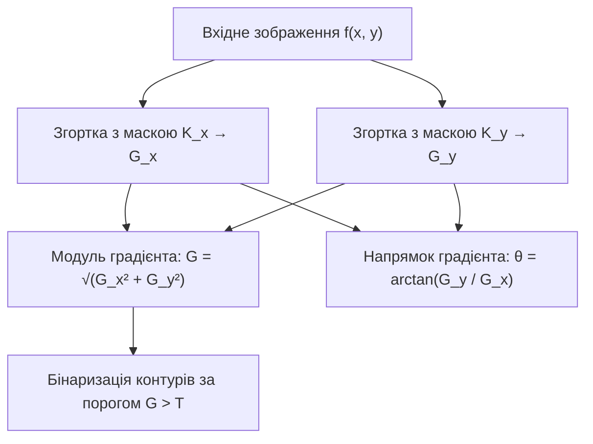
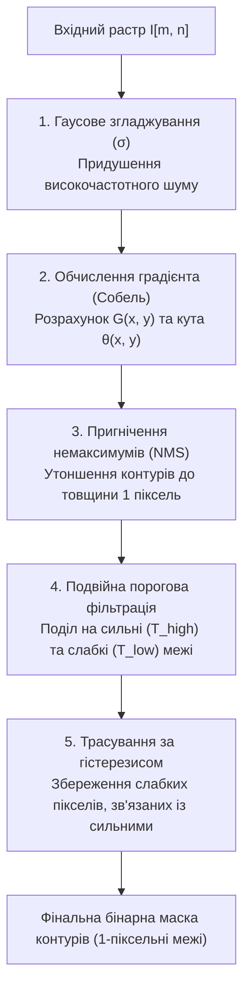
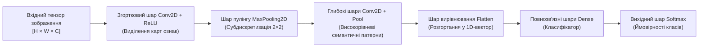

# ТЕМА 9. ДВОВИМІРНА ФУР'Є-ОБРОБКА, ДЕТЕКТОРИ КОНТУРІВ ТА ОСНОВИ РОЗПІЗНАВАННЯ ОБ'ЄКТІВ

---

## 9.1. Двовимірне дискретне перетворення Фур'є (2D-DFT / 2D-FFT). Центрування спектра (fftshift), амплітудний та фазовий спектри зображення

### Основний зміст та теоретичний базис

Спектральний аналіз двовимірних просторових сигналів становить математичний базис частотної фільтрації, деконволюції та стиснення цифрових зображень. **Двовимірне дискретне перетворення Фур'є (2D-ДПФ)** (в англомовній термінології — *Two-Dimensional Discrete Fourier Transform, 2D-DFT*) здійснює декомпозицію дискретного растра розмірністю $M \times N$ на систему ортогональних просторових гармонічних коливань із різними просторовими частотами та орієнтаціями.

Математично пряме 2D-ДПФ цифрового зображення $f(x, y)$ визначається виразом:

$$F(u, v) = \sum_{x=0}^{M-1} \sum_{y=0}^{N-1} f(x, y) e^{-j 2\pi \left( \frac{ux}{M} + \frac{vy}{N} \right)} = \sum_{x=0}^{M-1} \sum_{y=0}^{N-1} f(x, y) W_M^{ux} W_N^{vy}$$

де $f(x, y)$ — значення яскравості пікселя у просторових дискретних координатах $x \in [0; M-1]$ та $y \in [0; N-1]$; $u \in [0; M-1]$ та $v \in [0; N-1]$ — цілочислові змінні просторових частот уздовж вертикальної та горизонтальної осей відповідно; $W_M = e^{-j \frac{2\pi}{M}}$ та $W_N = e^{-j \frac{2\pi}{N}}$ — комплексні поворотні множники; $F(u, v)$ — комплексний спектральний коефіцієнт просторової гармоніки.

Відновлення вихідного просторового зображення здійснюється за допомогою **двовимірного оберненого дискретного перетворення Фур'є (2D-ОДПФ)** (*2D-IDFT*):

$$f(x, y) = \frac{1}{MN} \sum_{u=0}^{M-1} \sum_{v=0}^{N-1} F(u, v) e^{j 2\pi \left( \frac{ux}{M} + \frac{vy}{N} \right)}$$

де масштабний нормуючий коефіцієнт $\frac{1}{MN}$ забезпечує збереження амплітудної енергії растра в просторовій області.

Фундаментальною властивістю 2D-ДПФ є його **сепарабельність**. Ядро двовимірного перетворення розкладається на добуток двох незалежних одновимірних ядер: $e^{-j 2\pi (\frac{ux}{M} + \frac{vy}{N})} = e^{-j 2\pi \frac{ux}{M}} \cdot e^{-j 2\pi \frac{vy}{N}}$. Завдяки цьому обчислення 2D-ДПФ здійснюється у два послідовні етапи: спочатку виконується одновимірне ДПФ для кожного рядка матриці, а потім — одновимірне ДПФ для кожного стовпця отриманого проміжного масиву:

$$F(u, v) = \sum_{x=0}^{M-1} \left[ \sum_{y=0}^{N-1} f(x, y) e^{-j 2\pi \frac{vy}{N}} \right] e^{-j 2\pi \frac{ux}{M}}$$

Застосування алгоритму швидкого перетворення Фур'є (2D-ШПФ / 2D-FFT) за основою 2 скорочує кількість комплексних операцій із $\mathcal{O}(M^2 N^2)$ до $\mathcal{O}(MN \log_2(MN))$, що уможливлює спектральну обробку зображень високої роздільної здатності у реальному часі.


*Рисунок 9.1 — Сепарабельний алгоритмічний конвеєр розрахунку 2D-FFT та просторового центрування частотних квадрантів*

Комплексний спектр $F(u, v) = R(u, v) + j I(u, v)$ подається у вигляді двох взаємодоповнюючих характеристик:

*   **Амплітудний спектр (модуль просторової частотної характеристики):**
   $$|F(u, v)| = \sqrt{R^2(u, v) + I^2(u, v)}$$
   Амплітудний спектр відображає розподіл енергії зображення за просторовими частотами та геометричними напрямками, залишаючись інваріантним до лінійного перенесення (зсуву) об'єктів у просторовій області.
*   **Фазовий спектр (просторова фазова характеристика):**
   $$\phi(u, v) = \arctan\left( \frac{I(u, v)}{R(u, v)} \right)$$
   Фазовий спектр несе критично важливу просторово-структурну інформацію про розташування меж, ліній і контурів; спотворення фазового спектра призводить до повної втрати розпізнаваності геометричної форми об'єктів на зображенні.

У вихідному масиві 2D-ДПФ нульова просторова частота $F(0, 0) = \sum \sum f(x, y)$ (постійна складова, що дорівнює сумарній яскравості кадру) розташовується у лівому верхньому кутку матриці $[0, 0]$. Для коректної візуалізації та симетричної частотної фільтрації виконують процедуру **центрування спектра (*fftshift*)**, за якої квадранти матриці спектра діагонально міняються місцями (квадрант 1 міняється з 4, а 2 — з 3). Це переносить початок координат $(0, 0)$ у геометричний центр матриці $(M/2, N/2)$.

Через екстремально високий динамічний діапазон модуля спектра (значення постійної складової $F(0,0)$ на $4 \dots 6$ порядків перевищують високочастотні гармоніки) візуалізацію амплітудного спектра здійснюють за допомогою **логарифмічного стиснення шкали**:

$$D(u, v) = c \cdot \log\big( 1 + |F(u, v)| \big)$$

де $c$ — масштабний коефіцієнт підсилення контрасту відображення.

---

## 9.2. Частотна фільтрація зображень у Фур'є-просторі: ідеальні, баттервортівські та гаусові ФНЧ і ФВЧ. Відновлення розмитих зображень

### Основний зміст та теоретичний базис

**Частотна фільтрація у просторі Фур'є** базується на теоремі про згортку: просторовій згортці зображення з ядром фільтра $f(x, y) * h(x, y)$ у частотній області строго відповідає поелементний добуток їхніх спектральних представлень. Алгоритм частотної фільтрації включає обчислення прямого 2D-ДПФ вхідного зображення $F(u, v)$, множення комплексного спектра на передавальну функцію частотного фільтра $H(u, v)$ та подальше застосування оберненого 2D-ОДПФ:

$$G(u, v) = H(u, v) \cdot F(u, v) \quad \Longrightarrow \quad g(x, y) = \text{Re}\Big( \mathcal{F}^{-1}\big\{ H(u, v) \cdot F(u, v) \big\} \Big)$$

де $H(u, v)$ — просторово-частотна передавальна характеристика фільтра; $D(u, v) = \sqrt{(u - M/2)^2 + (v - N/2)^2}$ — евклідова відстань від поточної точки $(u, v)$ до центру спектра $(M/2, N/2)$; $D_0$ — радіус частоти зрізу фільтра ($\text{рад/відлік}$).

```mermaid
flowchart TD
    A["Вхідний спектр F(u, v)"] --> B{"Тип частотного фільтра H(u, v)"}
    
    B -->|Низькі частоти D(u, v) ≤ D₀| C["Фільтри нижніх частот (ФНЧ)<br>(Розмиття, шумозаглушення)"]
    B -->|Високі частоти D(u, v) > D₀| D["Фільтри верхніх частот (ФВЧ)<br>(Виділення контурів, різкість)"]
    
    C --> C1["Ідеальний ФНЧ: сходинка<br>(Сильний дзвін Гіббса)"]
    C --> C2["ФНЧ Баттерворта: гладкий схил<br>(Порядок n = 1..2, мінімум дзвону)"]
    C --> C3["ФНЧ Гаусса: нормальний дзвоноподібний<br>(Повна відсутність дзвону)"]
    
    D --> D1["H_HPF(u, v) = 1 - H_LPF(u, v)"]
```
*Рисунок 9.2 — Класифікація частотних фільтрів у просторі Фур'є та їхній вплив на просторові артефакти*

За формою передавальної функції $H(u, v)$ виділяють три базові класи частотних фільтрів:

1. **Ідеальні частотні фільтри (Ideal Filters):** володіють абсолютною прямокутною крутизною зрізу:
   $$H_{\text{ILPF}}(u, v) = \begin{cases} 1, & D(u, v) \le D_0 \\ 0, & D(u, v) > D_0 \end{cases}$$
   Через нескінченний спектральний розрив просторовий імпульсний відгук ідеального фільтра описується двовимірною функцією Бесселя (аналогом одновимірної функції $\text{sinc}$), що викликає на результуючому зображенні важкі паразитні хвильові артефакти вздовж різких меж — **ефект Гіббса (дзвін, *ringing artifacts*)**.

2. **Частотні фільтри Баттерворта (Butterworth Filters):** забезпечують плавний монотонний перехід між смугою пропускання та смугою затримання:
   $$H_{\text{BLPF}}(u, v) = \frac{1}{1 + \left[ \frac{D(u, v)}{D_0} \right]^{2n}}$$
   де $n \ge 1$ — порядок фільтра. При низьких порядках ($n = 1, 2$) фільтр практично не створює паразитного кільцевого дзвону, поєднуючи ефективне шумозаглушення із збереженням просторової структури.

3. **Гаусові частотні фільтри (Gaussian Filters):** використовують експоненціальну функцію Гаусса:
   $$H_{\text{GLPF}}(u, v) = \exp\left( -\frac{D^2(u, v)}{2 D_0^2} \right)$$
   Оскільки обернене перетворення Фур'є від функції Гаусса є також чистою функцією Гаусса без бічних пелюсток, гаусовий частотний фільтр **принципово не створює просторового дзвону**, забезпечуючи гладке ізотропне розмиття.

Фільтри верхніх частот (ФВЧ) синтезуються за правилом взаємного доповнення: $H_{\text{HPF}}(u, v) = 1 - H_{\text{LPF}}(u, v)$.

### Відновлення спотворених та розмитих зображень

Процес просторової деградації зображення (розмиття рухом, дифракційна дефокусування оптичної системи) з адитивним шумом описується спектральним рівнянням:

$$G(u, v) = H_{\text{deg}}(u, v) \cdot F(u, v) + N(u, v)$$

де $H_{\text{deg}}(u, v)$ — передавальна функція деградації (оптична передавальна функція, *Optical Transfer Function, OTF*); $N(u, v)$ — спектральна густина шуму; $G(u, v)$ — спостережуване розмите зображення.

**Інверсна фільтрація (*Inverse Filtering*)** здійснює пряму компенсацію деградації діленням на $H_{\text{deg}}(u, v)$:

$$\hat{F}(u, v) = \frac{G(u, v)}{H_{\text{deg}}(u, v)} = F(u, v) + \frac{N(u, v)}{H_{\text{deg}}(u, v)}$$

У високочастотних областях, де значення передавальної функції деградації прямують до нуля ($H_{\text{deg}}(u, v) \to 0$), шумовий доданок $\frac{N(u, v)}{H_{\text{deg}}(u, v)}$ катастрофічно зростає до нескінченності, повністю руйнуючи відновлене зображення.

Для оптимальної регуляризації розв'язку в умовах шуму застосовують **вінерівську фільтрацію (фільтрацію за критерієм мінімуму середньоквадратичної похибки)**:

$$\hat{F}(u, v) = \left[ \frac{H_{\text{deg}}^*(u, v)}{|H_{\text{deg}}(u, v)|^2 + \frac{S_\eta(u, v)}{S_f(u, v)}} \right] G(u, v) \approx \left[ \frac{1}{H_{\text{deg}}(u, v)} \frac{|H_{\text{deg}}(u, v)|^2}{|H_{\text{deg}}(u, v)|^2 + K} \right] G(u, v)$$

де $S_\eta(u, v)$ та $S_f(u, v)$ — спектральні густини потужності шуму та істинного сигналу відповідно; $K = \text{const}$ — емпіричний параметр регуляризації (відношення шум/сигнал за потужністю). Вінерівський фільтр автоматично пригнічує частотні складові, де потужність шуму перевищує корисний сигнал, забезпечуючи стійку деконволюцію.

---

## 9.3. Градієнтні детектори контурів першого порядку: оператори Робертса, Собеля, Шарра, Прюітта

### Основний зміст та теоретичний базис

**Контуром (межею об'єкта, *edge*)** на цифровому зображенні називається локальна просторова ділянка растра, на якій спостерігається різкий стрибок (перепад) оптичної яскравості або колірної інтенсивності. Виділення контурів базується на математичному апараті векторного диференціального числення за допомогою обчислення просторового **градієнта яскравості** $\nabla f$:

$$\nabla f(x, y) = \begin{bmatrix} G_x \\ G_y \end{bmatrix} = \begin{bmatrix} \frac{\partial f(x, y)}{\partial x} \\ \frac{\partial f(x, y)}{\partial y} \end{bmatrix}$$

де $G_x$ — горизонтальна складова просторової похідної; $G_y$ — вертикальна складова просторової похідної.

Вектор градієнта характеризується двома основними параметрами:

*   **Модуль (величина) градієнта $G(x, y)$:** визначає силу та вираженість перепаду яскравості:
   $$G(x, y) = |\nabla f| = \sqrt{G_x^2 + G_y^2} \approx |G_x| + |G_y|$$
*   **Просторовий напрямок (фазовий кут) градієнта $\theta(x, y)$:** вказує напрямок максимального зростання яскравості (ортогонально до лінії контуру):
   $$\theta(x, y) = \arctan\left( \frac{G_y}{G_x} \right)$$

У дискретному просторі обчислення частинних похідних $\frac{\partial f}{\partial x}$ та $\frac{\partial f}{\partial y}$ реалізується за допомогою просторової 2D-згортки растра парою комплементарних спрямованих ядер (масок): горизонтальної $\mathbf{K}_x$ та вертикальної $\mathbf{K}_y$:

$$G_x = f * \mathbf{K}_x, \quad G_y = f * \mathbf{K}_y$$


*Рисунок 9.3 — Алгоритм формування векторного градієнтного поля та виділення контурів операторами першого порядку*

Основними класичними градієнтними операторами є:

1. **Оператор Робертса (Roberts Cross, $2 \times 2$):** обчислює діагональні різниці між сусідніми пікселями:
   $$\mathbf{K}_{x, \text{Rob}} = \begin{bmatrix} 1 & 0 \\ 0 & -1 \end{bmatrix}, \quad \mathbf{K}_{y, \text{Rob}} = \begin{bmatrix} 0 & 1 \\ -1 & 0 \end{bmatrix}$$
   Оператор Робертса має високу чутливість до високочастотних шумів і формує тонкі, але розривні лінії контурів через малий розмір апертури.

2. **Оператор Прюітта (Prewitt, $3 \times 3$):** поєднує центральні різниці другого порядку з лінійним усередненням вздовж перпендикулярної осі:
   $$\mathbf{K}_{x, \text{Prew}} = \begin{bmatrix} -1 & 0 & 1 \\ -1 & 0 & 1 \\ -1 & 0 & 1 \end{bmatrix}, \quad \mathbf{K}_{y, \text{Prew}} = \begin{bmatrix} -1 & -1 & -1 \\ 0 & 0 & 0 \\ 1 & 1 & 1 \end{bmatrix}$$

3. **Оператор Собеля (Sobel, $3 \times 3$):** використовує зважене згладжування з трикутними коефіцієнтами $[1, 2, 1]^T$, що апроксимує одновимірний фільтр Гаусса:
   $$\mathbf{K}_{x, \text{Sob}} = \begin{bmatrix} -1 & 0 & 1 \\ -2 & 0 & 2 \\ -1 & 0 & 1 \end{bmatrix}, \quad \mathbf{K}_{y, \text{Sob}} = \begin{bmatrix} -1 & -2 & -1 \\ 0 & 0 & 0 \\ 1 & 2 & 1 \end{bmatrix}$$
   Зважування центральних відліків вагою 2 істотно підвищує стійкість детектора до адитивного шуму та забезпечує високу якість виділення границь.

4. **Оператор Шарра (Scharr, $3 \times 3$):** оптимізований градієнтний фільтр з підвищеними коефіцієнтами:
   $$\mathbf{K}_{x, \text{Scharr}} = \begin{bmatrix} -3 & 0 & 3 \\ -10 & 0 & 10 \\ -3 & 0 & 3 \end{bmatrix}, \quad \mathbf{K}_{y, \text{Scharr}} = \begin{bmatrix} -3 & -10 & -3 \\ 0 & 0 & 0 \\ 3 & 10 & 3 \end{bmatrix}$$
   Оператор Шарра володіє практично ідеальною круговою ізотропією, мінімізуючи кутові похибки розрахунку градієнта вздовж ліній, нахилених під непрямими кутами.

---

## 9.4. Оптимальний детектор меж Кенні (Canny edge detector)

### Основний зміст та теоретичний базис

У 1986 році Джон Кенні розробив строго оптимізований математичний алгоритм детектування контурів (**Canny Edge Detector**), який базується на трьох фундаментальних критеріях якості:
*   **Низька ймовірність помилки (Low error rate):** алгоритм повинен виявляти всі істинні контури без пропусків та не генерувати хибних спрацьовувань від випадкового шуму.
*   **Висока точність локалізації (Localization precision):** відстань між відміченими пікселями контуру та істинним фізичним центром перепаду яскравості має бути мінімальною.
*   **Єдиний відгук на одиничний контур (Single response constraint):** лінія виділеної межі повинна мати товщину рівно в один піксель без роздвоєння та паразитних шлейфів.


*Рисунок 9.4 — П'ятиетапний функціональний конвеєр оптимального детектора контурів Кенні*

Алгоритм Кенні виконується за суворою п'ятиетапною обчислювальною послідовністю:

1. **Фільтрація та згладжування за Гауссом:** для придушення шумів вихідне зображення згортається з двовимірним ядром Гаусса $G_\sigma(x, y)$ з просторовим радіусом розмиття $\sigma$.

2. **Розрахунок амплітуди та напрямку градієнта:** за допомогою масок Собеля знаходяться компоненти $G_x$ та $G_y$, після чого для кожного пікселя обчислюється амплітуда $G = \sqrt{G_x^2 + G_y^2}$ та кут $\theta = \arctan(G_y / G_x)$. Неперервний кут $\theta$ квантується на чотири дискретні сектори орієнтації: горизонтальний ($0^\circ$), перший діагональний ($45^\circ$), вертикальний ($90^\circ$) та другий діагональний ($135^\circ$).

3. **Пригнічення немаксимумів (*Non-Maximum Suppression, NMS*):** процедура утоншення широких градієнтних гребенів до ліній товщиною в один піксель. Для поточного пікселя перевіряється умова: якщо його амплітуда $G(x, y)$ менша хоча б за одного з двох сусідів, розташованих уздовж квантованого напрямку вектора градієнта $\theta(x, y)$, значення його амплітуди обнуляється ($G(x, y) = 0$). Тільки локальні максимуми градієнтного профілю оголошуються кандидатами в контури.

4. **Подвійна порогова фільтрація (*Double Thresholding*):** відбір пікселів здійснюється за допомогою двох рівнів — верхнього $T_{\text{high}}$ та нижнього $T_{\text{low}}$ (зазвичай обирають співвідношення $T_{\text{high}} : T_{\text{low}} \approx 2:1 \dots 3:1$):
   *   Пікселі з $G(x, y) \ge T_{\text{high}}$ маркуються як **сильні пікселі контуру (*strong edges*)** і безумовно додаються до вихідної маски.
   *   Пікселі з $T_{\text{low}} \le G(x, y) < T_{\text{high}}$ класифікуються як **слабкі пікселі контуру (*weak edges*)** і підлягають додатковій перевірці.
   *   Пікселі з $G(x, y) < T_{\text{low}}$ безумовно пригнічуються як фоновий шум ($G(x, y) = 0$).

5. **Трасування областей неоднозначності за гістерезисом (*Hysteresis Edge Tracking*):** слабкий піксель визнається істинною межею і зберігається в кінцевій масці тоді й лише тоді, коли він має безпосередній 8-зв'язний просторовий контакт хоча б із одним сильним пікселем контуру. Якщо слабкий відлік є ізольованим або контактує лише з іншими слабкими пікселями, він видаляється. Це забезпечує нерозривність контурних ліній без просочування фонового шуму.

---

## 9.5. Вступ до інтелектуального розпізнавання зображень: архітектура згорткових нейронних мереж (CNN)

### Основний зміст та теоретичний базис

Класичні методи обробки зображень вимагають ручного інженерного проектування просторових ознак (*handcrafted features*), що обмежує їхню ефективність у складних задачах класифікації об'єктів в умовах змін ракурсу, масштабу та освітленості. Сучасним стандартом розпізнавання візуальних образів є **згорткові нейронні мережі (ЗНМ)** (в англомовній термінології — *Convolutional Neural Networks, CNN*).

Фундаментальний зв'язок між класичною цифровою обробкою сигналів та нейромережевими архітектурами полягає в тому, що **математична операція у згортковому шарі нейромережі (`Conv2D`) є прямою апаратною реалізацією двовимірної просторової згортки растра з набором ковзних ядер фільтрів**. 

Якщо в класичній обробці коефіцієнти просторових масок (Собеля, Лапласа, Гаусса) жорстко зафіксовані розробником за аналітичними правилами, то в згорткових нейромережах **вагові коефіцієнти фільтрів $w_{i,j}$ є адаптивними (навчальними) параметрами**, значення яких автоматично оптимізуються у процесі навчання методом зворотного поширення помилки (*backpropagation*) за допомогою алгоритмів градієнтного спуску (Adam, SGD). 

У процесі оптимізації фільтри першого згорткового шару CNN самостійно сходяться до просторових конфігурацій, які математично еквівалентні градієнтним детекторам Собеля різної кутової орієнтації, смуговим фільтрам Габора та детекторам колірних контрастів.


*Рисунок 9.5 — Скрізна топологічна архітектура згорткової нейронної мережі для класифікації багатовимірних візуальних даних*

Типова архітектура CNN складається з трьох основних функціональних шарів:

### 1. Згорткові шари (`Conv2D`) та активація
Згортковий шар приймає вхідний тензор $\mathbf{X} \in \mathbb{R}^{H \times W \times C_{\text{in}}}$ і формує вихідний тензор карт ознак (*feature maps*) $\mathbf{Y} \in \mathbb{R}^{H' \times W' \times C_{\text{out}}}$ шляхом згортки з $C_{\text{out}}$ тривимірними ядрами розмірністю $K_h \times K_w \times C_{\text{in}}$:

$$Y[m, n, k] = f_{\text{act}}\left( \sum_{c=0}^{C_{\text{in}}-1} \sum_{i=-a}^{a} \sum_{j=-b}^{b} X[m \cdot S_y + i, n \cdot S_x + j, c] \cdot W_k[i, j, c] + b_k \right)$$

де $W_k$ — вагове ядро $k$-го фільтра; $b_k$ — скалярне зміщення (*bias*); $S_x, S_y$ — крок зсуву ядра (*stride*); $f_{\text{act}}(\cdot)$ — нелінійна функція активації. Загальноприйнятим стандартом є функція **ReLU (*Rectified Linear Unit*)**:

$$f_{\text{ReLU}}(z) = \max(0, z)$$

яка забезпечує швидку збіжність градієнтів та усуває проблему згасання градієнтів.

### 2. Шари субдискретизації / пулінгу (`MaxPooling2D`)
Шари пулінгу призначені для зменшення просторової розмірності карт ознак, зниження обчислювальної складності та забезпечення інваріантності виділених ознак до малих просторових зсувів і поворотів. Операція максимального пулінгу (**MaxPooling**) обирає максимальне значення у вікні розміром $P \times P$ (зазвичай $2 \times 2$ із кроком $S = 2$):

$$Y_{\text{pool}}[m, n, k] = \max_{0 \le i, j < P} X[m \cdot S + i, n \cdot S + j, k]$$

Максимальний пулінг зберігає найбільш виражені текстурні та контурні активації, скорочуючи кількість просторових відліків у 4 рази без зміни кількості каналів глибини.

### 3. Повнозв'язні шари (`Dense`) та класифікація
Після кількох каскадів `Conv2D` та `MaxPooling2D` тривимірний тензор високорівневих семантичних ознак розгортається у єдиний одновимірний вектор шаром `Flatten` і подається на повнозв'язний класифікатор (`Dense`). Для задачі мультикласової класифікації на $K$ класів вихідний шар використовує нормалізовану експоненціальну функцію **Softmax**:

$$P(y = k \mid \mathbf{x}) = \frac{\exp(z_k)}{\sum_{j=1}^{K} \exp(z_j)}$$

де $z_k$ — лінійний вихідний потенціал $k$-го нейрона; $P(y = k \mid \mathbf{x})$ — апостеріорна ймовірність належності вхідного зображення до цільового класу $k$.

| Парадигма аналізу | Метод виділення ознак | Стійкість до шумів та змін освітлення | Обчислювальна складність | Сфера застосування |
| :--- | :--- | :--- | :---: | :--- |
| **Оператор Собеля** | Жорстке ядро $3 \times 3$ (перші похідні) | Низька | **Мінімальна $\mathcal{O}(MN)$** | Первинне оконтурювання, швидкі вбудовані системи |
| **Детектор Кенні** | Багатокритеріальний 5-етапний конвеєр | **Висока** | Середня $\mathcal{O}(MN)$ | Прецизійна сегментація меж, вимірювання геометрії |
| **Частотна 2D-FFT** | Просторове маскування спектра | Середня | $\mathcal{O}(MN \log(MN))$ | Деконволюція розмиття, режекція періодичних растрових завад |
| **CNN (ЗНМ)** | Ієрархічні навчальні тензорні ядра | **Екстремально висока** | Висока (GPU / NPU прискорення) | Інтелектуальна класифікація, детекція об'єктів (YOLO, ResNet) |

---

### Питання для самоперевірки та аналітичного осмислення

1. Виведіть математичний вираз двовимірного дискретного перетворення Фур'є (2D-DFT) та доведіть його властивість сепарабельності. Який виграш у швидкодії забезпечує сепарабельне обчислення 2D-FFT порівняно з прямим матричним розрахунком?
2. Поясніть фізичний зміст амплітудного та фазового спектрів двовимірного зображення. Чому при збереженні амплітудного спектра та повній рандомізації фазового спектра зображення перетворюється на нерозпізнаваний шум?
3. Опишіть фізичний механізм виникнення кільцевого дзвону Гіббса при фільтрації зображень ідеальним частотним ФНЧ. Чому гаусові частотні фільтри гарантують повну відсутність дзвону?
4. У чому полягає математична нестабільність прямої інверсної фільтрації розмитих зображень, і яким чином вінерівська деконволюція регуляризує процес відновлення сигналу на фоні шуму?
5. Детально опишіть п'ять послідовних етапів алгоритму виділення меж Кенні (Canny edge detector). Яку роль відіграє квантування напрямку градієнта в процедурі пригнічення немаксимумів (Non-Maximum Suppression)?
6. Поясніть пряму математичну та концептуальну аналогію між класичною просторовою фільтрацією ядрами Собеля та функціонуванням згорткового шару `Conv2D` у нейронних мережах CNN. Чому перші шари навчених глибоких мереж самостійно формують просторові маски градієнтного типу?