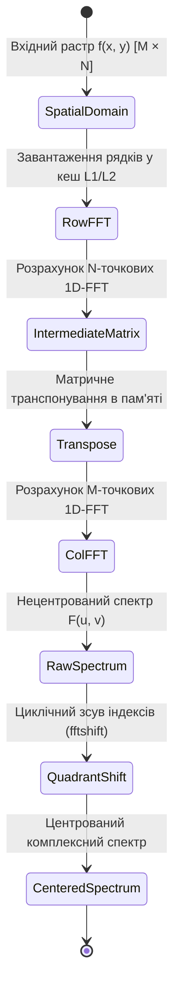
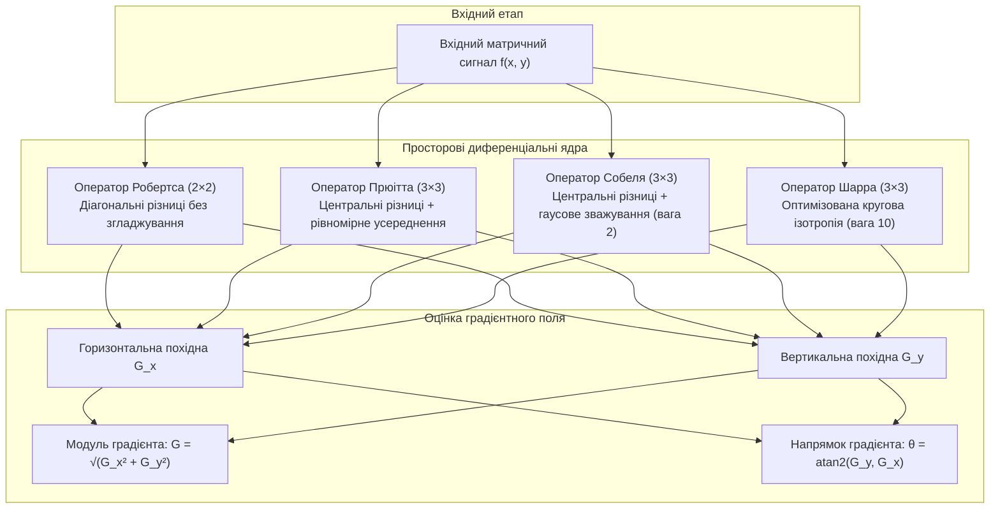
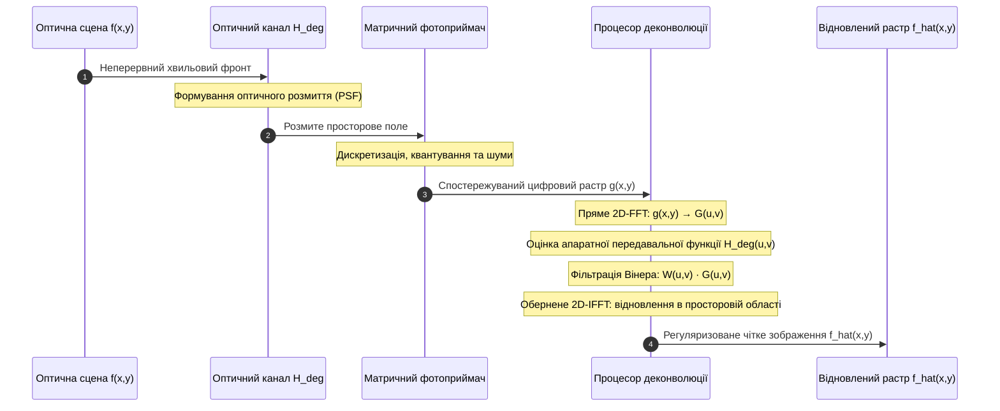
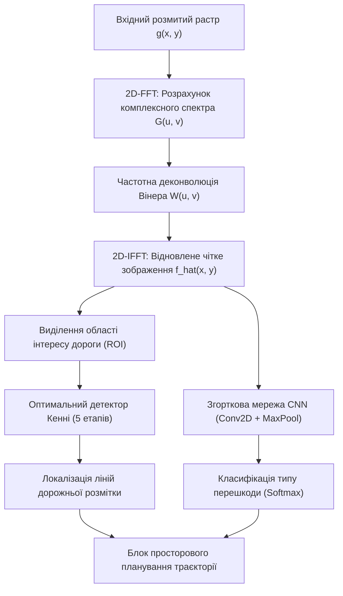

# Тема 9. Двовимірна Фур'є-обробка, детектори контурів та основи розпізнавання об'єктів

## Мета лекції
Формування у майбутніх магістрів поглибленої системи теоретичних знань і прикладних компетенцій щодо математичного апарату двовимірної спектральної обробки просторових сигналів, аналітичних і багатокритеріальних методів просторового диференціювання для виділення структурних ознак зображень, а також базових принципів переходу від детермінованих просторових масок до самонавчальних ядер у згорткових нейронних мережах; освоєння інженерної методології компенсації просторових спотворень і проектування високонадійних конвеєрів первинної та інтелектуальної обробки візуальної інформації в реальному часі для комп'ютерно-інтегрованих систем, робототехніки та приладобудування.

## Очікувані результати навчання
1. **Знання та розуміння.** Здобувачі опанують математичні засади двовимірного дискретного перетворення Фур'є, фізичний зміст амплітудного і фазового просторових спектрів, структуру передавальних функцій частотних фільтрів, математичний апарат розрахунку просторових градієнтів першого й другого порядків та архітектурні принципи побудови згорткових нейронних мереж.
2. **Застосування.** Здобувачі набудуть практичної здатності виконувати сепарабельний розрахунок 2D-FFT із центруванням частотних квадрантів, проектувати просторові й частотні фільтри для придушення шумів та усунення динамічного змазу зображень, синтезувати оптимальні детектори контурів Кенні та конструювати базові шари CNN за допомогою спеціалізованих програмних бібліотек.
3. **Аналіз.** Здобувачі навчаться аналізувати просторово-частотні артефакти фільтрації зображень, оцінювати стійкість процедур інверсної та вінерівської деконволюції в умовах адитивних завад, а також критично порівнювати інформативність і обчислювальну складність класичних градієнтних масок із адаптивними тензорними ядрами глибоких моделей.
4. **Оцінювання та синтез.** Здобувачі оволодіють методологією багатокритеріального вибору алгоритмічних конвеєрів виділення контурів і фільтрації за критеріями точності локалізації, захищеності від шумів і швидкодії, а також зможуть проектувати комплексні системи розпізнавання геометричних образів для автономних технічних об'єктів.

---

## Детальний покроковий план лекції

### 1. Теоретико-концептуальний базис. Двовимірний спектральний аналіз і класичні диференціальні оператори
* 1.1. Математична формалізація двовимірного дискретного перетворення Фур'є (2D-DFT) та властивість сепарабельності для прискорених алгоритмів 2D-FFT.
* 1.2. Фізична інтерпретація амплітудного і фазового просторових спектрів, просторове центрування координат (fftshift) та логарифмічна компресія динамічного діапазону.
* 1.3. Векторне поле просторового градієнта та дискретні спрямовані маски перших похідних (оператори Робертса, Прюітта, Собеля і Шарра).
* 1.4. Градієнтні фільтри другого порядку на основі дискретного оператора Лапласа та їхня інтерпретація у частотній області.

### 2. Методологія та аналіз граничних умов. Синтез частотних фільтрів, субоптимальне оконтурювання та навчальні згортки
* 2.1. Просторово-частотні передавальні характеристики ідеальних, баттервортівських та гаусових ФНЧ і ФВЧ.
* 2.2. Методологія відновлення розмитих зображень: обмеження прямої інверсної фільтрації та оптимальна стохастична деконволюція за Вінером.
* 2.3. Алгоритмічний конвеєр оптимального детектора контурів Кенні: гаусова регуляризація, квантування напрямків, пригнічення немаксимумів і гістерезисне трасування.
* 2.4. Перехід від жорстких просторових масок до навчальних ядер згорткових нейромереж (CNN): функціональна взаємодія шарів згортки, активації ReLU та максимального пулінгу.
* 2.5. Критичні бар'єри та граничні умови методів: паразитний дзвін Гіббса, сингулярність зворотних спектральних фільтрів, розриви градієнтних ліній при шумах та обчислювальна місткість нейромережевих тензорних операцій.

### 3. Практичний індустріальний / фаховий кейс. Комплексна система оптико-електронного контролю та навігації
**Тема наскрізної задачі.** «Синтез алгоритмічного конвеєра відновлення різкості, виділення ліній дорожньої розмітки та нейромережевої класифікації перешкод для системи технічного зору автономного мобільного робота в умовах вібраційного розмиття кадру»

## 1. Теоретико-концептуальний базис. Двовимірний спектральний аналіз і класичні диференціальні оператори

### 1.1. Математична формалізація двовимірного дискретного перетворення Фур'є (2D-DFT) та властивість сепарабельності для алгоритмів 2D-FFT

У цифровій обробці просторових сигналів монохромне півтонове зображення розглядається як дискретне двовимірне поле освітленості, представлене матрицею $f(x, y)$ розмірністю $M \times N$ елементів, де просторові координати $x \in \{0, 1, \dots, M-1\}$ та $y \in \{0, 1, \dots, N-1\}$ визначають дискретні позиції пікселів на прямокутному растрі, а амплітуда $f(x, y) \in [0, L_{\max}]$ відповідає квантованій оптичній щільності або яскравості. На відміну від неперервного оптичного поля, дискретизований растр володіє скінченною просторовою протяжністю, що зумовлює використання ортогонального базису дискретних комплексних експонент для його гармонійної декомпозиції.

Математично пряме **двовимірне дискретне перетворення Фур'є (2D Discrete Fourier Transform, 2D-DFT)** зіставляє просторовому масиву $f(x, y)$ комплексну матрицю спектральних коефіцієнтів $F(u, v)$, яка описує спектральну густину двовимірного сигналу на дискретній сітці просторових частот:

$$F(u, v) = \sum_{x=0}^{M-1} \sum_{y=0}^{N-1} f(x, y) \exp\left[-j 2\pi \left(\frac{ux}{M} + \frac{vy}{N}\right)\right]$$

де $u \in \{0, 1, \dots, M-1\}$ та $v \in \{0, 1, \dots, N-1\}$ позначають цілочислові індекси просторових гармонік уздовж вертикальної та горизонтальної осей відповідно, а величина $j = \sqrt{-1}$ є уявною одиницею. У термінах поворотних множників перетворення набуває компактного вигляду $F(u, v) = \sum_{x=0}^{M-1} \sum_{y=0}^{N-1} f(x, y) W_M^{ux} W_N^{vy}$, де комплексні константи мають значення $W_M = \exp(-j 2\pi / M)$ та $W_N = \exp(-j 2\pi / N)$.

Синтез вихідного розподілу просторових відліків за відомим комплексним спектром здійснюється за допомогою **оберненого двовимірного дискретного перетворення Фур'є (2D-IDFT)**:

$$f(x, y) = \frac{1}{MN} \sum_{u=0}^{M-1} \sum_{v=0}^{N-1} F(u, v) \exp\left[j 2\pi \left(\frac{ux}{M} + \frac{vy}{N}\right)\right]$$

де нормуючий множник $\frac{1}{MN}$ забезпечує збереження амплітудно-енергетичного балансу між просторовим і частотним просторами відповідно до фундаментального закону збереження енергії.

Безпосереднє обчислення матриці $F(u, v)$ за прямим виразом вимагає виконання $M \times N$ комплексних множень і додавань для кожного з $M \times N$ спектральних відліків, що призводить до квадратичної асимптотичної обчислювальної складності $\mathcal{O}(M^2 N^2)$. Для зображень промислового стандарту високої чіткості такий прямий підхід формує нездоланний обчислювальний бар'єр, який унеможливлює цифрову обробку в темпі надходження кадрів. 

Розв'язання цієї проблеми ґрунтується на фундаментальній властивості ядра перетворення — **сепарабельності**, тобто розкладанні двовимірної комплексної експоненти на добуток двох незалежних одновимірних функцій. Математичне розщеплення подвійної суми формулюється через проміжний одновимірний спектральний масив:

$$F(u, v) = \sum_{x=0}^{M-1} \left( \sum_{y=0}^{N-1} f(x, y) W_N^{vy} \right) W_M^{ux} = \sum_{x=0}^{M-1} P(x, v) W_M^{ux}$$

де матриця $P(x, v) = \sum_{y=0}^{N-1} f(x, y) W_N^{vy}$ являє собою результат застосування одновимірного дискретного перетворення Фур'є до кожного рядка вихідного зображення незалежно. На наступному етапі стовпці матриці $P(x, v)$ піддаються вторинному одновимірному перетворенню Фур'є уздовж вертикальної осі. 

Властивість сепарабельності дає змогу залучити одновимірні швидкі алгоритми Кулі-Тьюкі за основою 2 для випадків, коли розмірності растра задовольняють умови $M = 2^p$ та $N = 2^q$. Швидке двовимірне перетворення Фур'є скорочує сумарну кількість операцій до строгої величини $\mathcal{O}(MN \log_2(MN))$, забезпечуючи прискорення математичних обчислень у сотні разів без внесення методичної похибки апроксимації.

Організація обчислювальних потоків у сучасних цифрових сигнальних процесорах вимагає мінімізації промахів кеш-пам'яті під час переходу між рядками та стовпцями. З цієї причини операція транспонування проміжної матриці $P(x, v)$ виконується блочно з оптимізацією під довжину векторної інструкції процесора (SIMD), гарантуючи стабільний час затримки при потоковому спектральному аналізі відеоінформації.

### 1.2. Фізична інтерпретація амплітудного і фазового просторових спектрів, просторове центрування координат (fftshift) та логарифмічна компресія динамічного діапазону

Комплексний коефіцієнт $F(u, v)$ для кожної пари просторових частот містить дійсну складову $R(u, v) = \text{Re}\{F(u, v)\}$ та уявну складову $I(u, v) = \text{Im}\{F(u, v)\}$, які однозначно визначають полярну форму спектрального представлення:

$$F(u, v) = |F(u, v)| \exp[j \phi(u, v)]$$

де функція $|F(u, v)|$ позначає **амплітудний спектр** або модуль просторової частотної характеристики, а функція $\phi(u, v)$ являє собою **фазовий спектр** просторового сигналу. Розрахунок цих спектральних компонентів здійснюється за аналітичними співвідношеннями:

$$|F(u, v)| = \sqrt{R^2(u, v) + I^2(u, v)}, \quad \phi(u, v) = \arctan\left(\frac{I(u, v)}{R(u, v)}\right)$$

Фізичний зміст амплітудного спектра полягає в кількісному відображенні енергетичної потужності гармонічних складових заданої частоти та орієнтації, які присутні у структурі сцени. Якщо растр містить періодичні лінійні структури, розташовані під кутом $\theta$ до горизонту, модуль спектра демонструє різко виражені радіальні сплески енергії вздовж перпендикулярного напрямку $\theta \pm 90^\circ$. Водночас амплітудний спектр володіє інваріантністю до просторового зсуву зображення: лінійне перенесення об'єкта на вектор $(x_0, y_0)$ згідно з теоремою зсуву множить спектр на фазовий множник $\exp[-j 2\pi (ux_0/M + vy_0/N)]$, залишаючи незмінним модуль $|F(u, v)|$.

Фазовий спектр $\phi(u, v)$, навпаки, кодує точну просторову когерентність і просторове взаєморозташування хвильових фронтів. У задачах технічного зору фазова інформація є визначальною для збереження геометричної топології сцени: межі, кути та структурні лінії формуються виключно в точках конструктивної просторової інтерференції гармонік різної частоти, де локальні фазові зсуви збігаються. Дослідження з перехресним синтезом зображень (поєднання модуля спектра одного об'єкта з фазою іншого) доводять, що синтезований растр візуально сприймається людиною та алгоритмами розпізнавання саме як об'єкт, з якого було вилучено фазовий спектр.

У вихідному форматі 2D-DFT нульова просторова частота $F(0, 0) = \sum_{x=0}^{M-1} \sum_{y=0}^{N-1} f(x, y)$, що чисельно дорівнює сумарній інтегральній оптичній яскравості кадру, розташована у лівому верхньому кутку координатної сітки $[0, 0]$. Оскільки спектр дискретної послідовності є періодичним з періодами $M$ та $N$ вздовж відповідних частотних осей, високі додатні та від'ємні частоти виявляються зміщеними до геометричного центру розрахункової матриці. Для відновлення звичного симетричного розподілу частот виконують процедуру **центрування спектра (spatial centering, fftshift)**, яка реалізує діагональну перестановку квадрантів: перший квадрант міняється місцями з четвертим, а другий — з третім, у результаті чого точка $(0, 0)$ переноситься в індекс $(M/2, N/2)$.

> **ПРАКТИЧНИЙ ЯКІР:** У системах розпізнавання відбитків пальців біометричних сканерів аналіз центральної області центрованого 2D-FFT дає змогу миттєво визначити напрямок гребенів папілярного візерунка без трудомісткого попіксельного проходження растра, а також виявити латентні фальсифікації зображення за наявністю характерних оптичних дифракційних гармонік штучного фотошаблона.

Динамічний діапазон спектральних коефіцієнтів реальних оптичних зображень є надзвичайно широким і типово сягає $10^5 \dots 10^7$ за шкалою інтенсивності між нульовою частотою $F(0, 0)$ та периферійними високочастотними гармоніками. Спроба лінійної візуалізації призводить до того, що на моніторі спостерігається єдина яскрава центральна точка, тоді як решта корисної спектральної інформації пригнічується в нуль. Для подолання цього сенсорного обмеження застосовують логарифмічне стиснення динамічного діапазону з нормуванням:

$$D(u, v) = c \cdot \ln(1 + |F(u, v)|)$$

де константа $c = \frac{255}{\ln(1 + \max |F(u, v)|)}$ масштабує обчислений спектральний рельєф у стандартний восьмибітний діапазон цілих чисел $[0, 255]$, придатний для відображення у просторі півтонів або для сегментації масками частотного аналізу.

### 1.3. Векторне поле просторового градієнта та дискретні спрямовані маски перших похідних (оператори Робертса, Прюітта, Собеля і Шарра)

Аналіз перепадів яскравості на зображенні базується на класичному диференціальному численні багатовимірних скалярних полів. **Просторовий контур (край)** виникає в місцях локальних несуцільностей функції $f(x, y)$, де перша похідна просторової зміни інтенсивності сягає локального екстремуму. Математично цей процес описується вектором **градієнта** $\nabla f$:

$$\nabla f(x, y) = \text{grad}\, f(x, y) = \begin{bmatrix} G_x \\ G_y \end{bmatrix} = \begin{bmatrix} \frac{\partial f}{\partial x} \\ \frac{\partial f}{\partial y} \end{bmatrix}$$

Вектор градієнта вказує просторовий напрямок найшвидшого зростання яскравості пікселів і характеризується двома фундаментальними параметрами: модулем і кутовою орієнтацією:

$$G(x, y) = \|\nabla f\|_2 = \sqrt{G_x^2 + G_y^2}, \quad \theta(x, y) = \text{atan2}(G_y, G_x)$$

де кут $\theta(x, y)$ відлічується від горизонтальної осі в радіанах або градусах, вказуючи напрямок, ортогональний до дотичної лінії фізичного контуру об'єкта.

Оскільки цифрове зображення задане на дискретній решітці цілих координат, неперервні операції взяття частинних похідних апроксимуються за допомогою операторів скінченних різниць. Апроксимація перших похідних у дискретній області здійснюється шляхом двовимірної просторової згортки растра із компактними несиметричними матричними ядрами (масками), сума коефіцієнтів яких дорівнює нулю для усунення реакції на постійні фонові області:

$$G_x(x, y) = f(x, y) * K_x, \quad G_y(x, y) = f(x, y) * K_y$$

Історично першим і найпростішим дискретним аналогом градієнта є **діагональний перехресний оператор Робертса (Roberts Cross)** з компактною апертурою $2 \times 2$ елементи:

$$K_{x, \text{Rob}} = \begin{bmatrix} 1 & 0 \\ 0 & -1 \end{bmatrix}, \quad K_{y, \text{Rob}} = \begin{bmatrix} 0 & 1 \\ -1 & 0 \end{bmatrix}$$

Оператор Робертса надзвичайно чутливий до дії некорельованого високочастотного шуму, оскільки він не містить згладжувальних компонентів і обчислює різницю між діагонально розташованими сусідніми точками. Для підвищення завадостійкості формують апертури розміром $3 \times 3$, у яких операція диференціювання в одному напрямку поєднується із зваженим просторовим інтегруванням (усередненням) у перпендикулярному напрямку.

**Оператор Прюітта (Prewitt)** використовує однакове вагове усереднення вздовж сусідніх рядків і стовпців, моделюючи дискретну різницю за формулою:

$$K_{x, \text{Prew}} = \begin{bmatrix} -1 & 0 & 1 \\ -1 & 0 & 1 \\ -1 & 0 & 1 \end{bmatrix}, \quad K_{y, \text{Prew}} = \begin{bmatrix} -1 & -1 & -1 \\ 0 & 0 & 0 \\ 1 & 1 & 1 \end{bmatrix}$$

Подальшим розвитком цієї ідеї є **оператор Собеля (Sobel)**, де центральні рядки та стовпці масок отримують вагу 2, що наближає одновимірний згладжувальний фільтр до біноміального розподілу Гаусса:

$$K_{x, \text{Sob}} = \begin{bmatrix} -1 & 0 & 1 \\ -2 & 0 & 2 \\ -1 & 0 & 1 \end{bmatrix} = \begin{bmatrix} 1 \\ 2 \\ 1 \end{bmatrix} * \begin{bmatrix} -1 & 0 & 1 \end{bmatrix}, \quad K_{y, \text{Sob}} = \begin{bmatrix} -1 & -2 & -1 \\ 0 & 0 & 0 \\ 1 & 2 & 1 \end{bmatrix} = \begin{bmatrix} -1 \\ 0 \\ 1 \end{bmatrix} * \begin{bmatrix} 1 & 2 & 1 \end{bmatrix}$$

Вираз демонструє сепарабельність оператора Собеля: горизонтальна складова градієнта утворюється послідовним застосуванням центральної скінченної різниці вздовж рядка та трикутного фільтра Гаусса $[1, 2, 1]^T$ вздовж стовпця.

Однак оператори Собеля та Прюітта володіють вираженою просторовою анізотропією: точність оцінки модуля градієнта істотно погіршується для контурів, орієнтованих під непрямими кутами відносно осей координат (похибка обчислення кута сягає $8^\circ$). Для усунення цього недоліку застосовують оптимізований за критерієм кругової ізотропії **оператор Шарра (Scharr)**:

$$K_{x, \text{Scharr}} = \begin{bmatrix} -3 & 0 & 3 \\ -10 & 0 & 10 \\ -3 & 0 & 3 \end{bmatrix}, \quad K_{y, \text{Scharr}} = \begin{bmatrix} -3 & -10 & -3 \\ 0 & 0 & 0 \\ 3 & 10 & 3 \end{bmatrix}$$

Збільшення ваги центрального відліку до 10 мінімізує фазові та кутові похибки визначення орієнтації контуру до величини менше ніж $1.5^\circ$, що критично для прецизійної оптичної метрології.

> **ПРАКТИЧНИЙ ЯКІР:** У промислових конвеєрних системах поверхневого монтажу електронних плат (SMT-контроль) обчислення градієнта ядром Шарра вбудованими засобами відеокамер машинного зору забезпечує субпіксельну точність перевірки позиціювання компонентів розміром $0.4 \times 0.2\text{ мм}$ (корпус 01005) за швидкості конвеєра до 30 виробів на секунду.

### 1.4. Градієнтні фільтри другого порядку на основі дискретного оператора Лапласа та їхня інтерпретація у частотній області

На відміну від градієнтних операторів першого порядку, які генерують широкий відгук у зоні перепаду яскравості, оператори другого порядку фіксують швидкість зміни самого просторового градієнта. Контур зображення при цьому детектується за подією **переходу через нуль (zero-crossing)** другої похідної, що забезпечує отримання гранично тонких ліній межі безпосередньо у процесі фільтрації.

Фундаментальним інваріантним диференціальним оператором другого порядку є **лапласіан (оператор Лапласа)** $\nabla^2 f$, який визначається для двовимірної скалярної функції як сума других частинних похідних:

$$\nabla^2 f(x, y) = \Delta f(x, y) = \frac{\partial^2 f(x, y)}{\partial x^2} + \frac{\partial^2 f(x, y)}{\partial y^2}$$

Для побудови дискретного аналога оператора Лапласа розкладемо функцію яскравості $f(x, y)$ у ряд Тейлора в околах точки $(x, y)$ вздовж осі $x$ з кроком $\Delta x = 1$:

$$f(x+1, y) = f(x, y) + \frac{\partial f}{\partial x} + \frac{1}{2}\frac{\partial^2 f}{\partial x^2} + \mathcal{O}(\Delta x^3)$$

$$f(x-1, y) = f(x, y) - \frac{\partial f}{\partial x} + \frac{1}{2}\frac{\partial^2 f}{\partial x^2} - \mathcal{O}(\Delta x^3)$$

Додавання цих виразів дає триточкову формулу центральної різниці другого порядку: $\frac{\partial^2 f}{\partial x^2} \approx f(x+1, y) + f(x-1, y) - 2f(x, y)$. Виконуючи аналогічне розкладання вздовж ортогональної просторової осі $y$, отримуємо класичне дискретне представлення лапласіана:

$$\nabla^2 f(x, y) \approx f(x+1, y) + f(x-1, y) + f(x, y+1) + f(x, y-1) - 4f(x, y)$$

Цьому математичному виразу відповідає просторова дискретна маска з 4-зв'язною топологією оточення пікселя. Якщо врахувати внесок діагональних сусідніх відліків із другого порядку Тейлора, синтезується ізотропна 8-зв'язна маска Лапласа:

$$K_{\text{Lap, 4}} = \begin{bmatrix} 0 & 1 & 0 \\ 1 & -4 & 1 \\ 0 & 1 & 0 \end{bmatrix}, \quad K_{\text{Lap, 8}} = \begin{bmatrix} 1 & 1 & 1 \\ 1 & -8 & 1 \\ 1 & 1 & 1 \end{bmatrix}$$

Для аналізу частотних властивостей оператора застосуємо властивість диференціювання двовимірного перетворення Фур'є: $\mathcal{F}\{\frac{\partial^n f}{\partial x^n}\} = (j 2\pi u/M)^n F(u, v)$. Звідси просторово-частотна передавальна функція ідеального лапласіана набуває вигляду:

$$H_{\text{Lap}}(u, v) = -(2\pi)^2 \left[\left(\frac{u}{M}\right)^2 + \left(\frac{v}{N}\right)^2\right] = -(2\pi)^2 D^2(u, v)$$

де $D(u, v)$ — радіальна відстань від початку відліку частот у частотному просторі. Частотна характеристика лапласіана є строго від'ємною квадратичною функцією від радіуса $D(u, v)$. Отже, оператор Лапласа є **ізотропним фільтром верхніх частот (ФВЧ)**: коефіцієнт підсилення гармонік зростає пропорційно квадрату просторової частоти.

Через квадратичне зростання коефіцієнта передачі на високих частотах дискретний лапласіан критично нестійкий до адитивного високочастотного шуму: навіть незначні випадкові флуктуації фону генерують велику кількість паразитних нульових переходів. З цієї причини на практиці застосовують двоетапну фільтрацію — **лапласіан гаусіана (Laplacian of Gaussian, LoG)**, де перед диференціюванням здійснюється згладжування гаусовим ядром, або різницю гаусіанів (DoG).

Крім виділення контурів, лапласіан широко застосовується для **підвищення суб'єктивної різкості (unsharp masking)** контурів зображення шляхом додавання диференціального сигналу до вихідного растра:

$$g(x, y) = f(x, y) - c \cdot \nabla^2 f(x, y)$$

де константа $c > 0$ визначає ступінь компенсації високочастотного спаду просторово-частотної характеристики оптичного тракту системи реєстрації.

| Метод або оператор | Математична основа та маска | Стійкість до шумів та анізотропія | Обчислювальна складність | Приклад з реальної практики |
| :--- | :--- | :--- | :---: | :--- |
| **Оператор Робертса** | Діагональні скінченні різниці першого порядку, апертура $2 \times 2$. | Вкрай низька стійкість до шуму, висока кутова похибка ($\approx 12^\circ$). | Мінімальна: $\mathcal{O}(MN)$, лише 2 операції віднімання на піксель. | Ультрашвидкісна детекція контрастних міток у вбудованих мікроконтролерах реального часу. |
| **Оператор Собеля** | Центральні різниці першого порядку зі згладжуванням за Гауссом, $3 \times 3$. | Середня стійкість до шумів завдяки коефіцієнтам $[1, 2, 1]^T$, помірна анізотропія ($\approx 8^\circ$). | Низька: $\mathcal{O}(MN)$, сепарабельне ядро забезпечує швидку згортку. | Первинна локалізація дорожньої розмітки та контурів транспортних засобів у системах ADAS. |
| **Оператор Шарра** | Оптимізовані кутові ядра першого порядку $3 \times 3$ із центральною вагою 10. | Задовільна стійкість до шумів, практично нульова анізотропія ($< 1.5^\circ$). | Низька: $\mathcal{O}(MN)$, оптимізований цілочисловий розрахунок на SIMD-регістрах. | Субпіксельний вимір геометрії друкованих плат та мікрочіпів на конвеєрах SMT-монтажу. |
| **Оператор Лапласа** | Другі просторові похідні скалярного поля, 4- та 8-зв'язні маски $3 \times 3$. | Вкрай висока вразливість до шуму (квадратичний ФВЧ), ідеально ізотропний. | Низька: $\mathcal{O}(MN)$, відсутність розрахунку тригонометричного напрямку. | Підвищення різкості медичних рентгенівських знімків і мікроскопічних зображень тканин. |
| **2D-FFT спектральний аналіз** | Ортогональний базис комплексних експонент, пряме частотне маскування. | Висока гнучкість: роздільна фільтрація будь-яких просторових смуг і напрямків. | Середня: $\mathcal{O}(MN \log_2(MN))$, вимагає апаратного перетворення кадру. | Режекція періодичних растрових шумів, компенсація дифракційного та вібраційного розмиття. |

> **ТИПОВА ПОМИЛКА:** При обчисленні дискретної просторової згортки часто плутають математичні операції згортки (convolution) та просторової кореляції (cross-correlation). При застосуванні несиметричних матриць ядер (наприклад, градієнтних масок Собеля або Шарра) згортка обов'язково вимагає дзеркального розвороту маски на $180^\circ$ відносно центрального елемента ($K(-i, -j)$). Якщо виконується кореляція замість згортки без зміни знаків коефіцієнтів, обчислений вектор градієнта матиме інвертований напрямок ($\theta + 180^\circ$), що призводить до повного руйнування алгоритмів пригнічення немаксимумів і неправильної локалізації контурів у системах просторового позиціювання.

> **КОНТРОЛЬНЕ ПИТАННЯ:** Чому при збереженні незмінним амплітудного спектра зображення $|F(u, v)|$ та заміні його істинного фазового спектра $\phi(u, v)$ на фазовий спектр іншого об'єкта результуюче синтезоване зображення за допомогою оберненого перетворення 2D-IDFT повністю повторює контури саме другого об'єкта, незважаючи на те, що амплітудний спектр містить усю частотну енергію первинного кадру?

Розгорнути аналіз / відповідь

**Правильний варіант: Фазовий спектр визначає просторову когерентність та взаємне розташування контурів об'єктів.**

1. Математично точки різких перепадів яскравості (межі, кути, лінії) формуються лише тоді, коли синусоїдальні гармоніки різних просторових частот входять у певну координату $(x, y)$ синфазно, підсилюючи одна одну (конструктивна інтерференція). Якщо просторова фаза $\phi(u, v)$ спотворюється або замінюється, точки синфазності переносяться на нові просторові координати, що повністю руйнує просторову форму первинного об'єкта і формує контури того джерела, звідки взято нову фазу. Амплітудний спектр $|F(u, v)|$ визначає лише середню енергетичну потужність окремих текстур і напрямків (гладкість або зернистість), проте сам по собі не несе просторової прив'язки до координат.

2. Аналіз альтернативних інтерпретацій: твердження про те, що амплітудний спектр кодує форму, є хибним, оскільки модуль спектра інваріантний до зсуву і описує лише інтегральні характеристики растра; твердження, що уявна частина $I(u, v)$ важливіша за дійсну $R(u, v)$, також позбавлене сенсу, оскільки фаза є нелінійною тригонометричною функцією обох складових одночасно.

### Вказівки для самостійного осмислення

1. Здійсніть аналітичний вивід формули оператора Лапласа для дискретної прямокутної решітки, використовуючи шеститочковий апарат розкладання в ряд Тейлора з урахуванням діагональних кроків дискретизації $\sqrt{\Delta x^2 + \Delta y^2}$, та покажіть, за яких умов 8-зв'язне ядро забезпечує меншу похибку анізотропії порівняно з 4-зв'язним варіантом.
2. Проаналізуйте наслідки періодичного продовження сигналу при прямому застосуванні 2D-DFT до зображень з різними середніми рівнями яскравості на протилежних границях кадру та сформулюйте математичні вимоги до вагових вікон (Хеннінга, Тьюкі), що усувають ефект хрестоподібного паразитного спектрального просочування (spectral leakage).
3. Доведіть за допомогою теореми Парсеваля інваріантність сумарної енергії просторового дискретного растра розміром $M \times N$ при переході у двовимірний комплексний простір дискретних частот Фур'є.

## 2. Методологія та аналіз граничних умов. Синтез частотних фільтрів, субоптимальне оконтурювання та навчальні згортки

### 2.1. Просторово-частотні передавальні характеристики ідеальних, баттервортівських та гаусових ФНЧ і ФВЧ

Методологія просторово-частотної фільтрації у спектральній області базується на фундаментальній теоремі про згортку, відповідно до якої просторова лінійна згортка двох дискретних сигналів $g(x, y) = f(x, y) * h(x, y)$ у просторі перетворення Фур'є трансформується у прямий алгебраїчний добуток їхніх спектральних представлень $G(u, v) = H(u, v) \cdot F(u, v)$. У цьому співвідношенні функція $F(u, v)$ позначає комплексний спектр вхідного двовимірного сигналу, $G(u, v)$ є комплексним спектром фільтрованого сигналу, а $H(u, v)$ являє собою просторово-частотну передавальну характеристику дискретного фільтра. 

Для побудови ізотропних частотних фільтрів, чиї характеристики не залежать від кутового напрямку просторових частот, передавальна функція задається через евклідову відстань $D(u, v)$ від поточної частотної координати $(u, v)$ до центру розрахункової сітки $(M/2, N/2)$:

$$D(u, v) = \sqrt{\left(u - \frac{M}{2}\right)^2 + \left(v - \frac{N}{2}\right)^2}$$

де $M$ та $N$ відповідають кількості рядків і стовпців розрахункової матриці спектра, центрованого за допомогою процедури циклічного перенесення квадрантів.

Ідеальний фільтр низьких частот володіє ступінчастою характеристикою передачі, що повністю пропускає всі просторові гармоніки всередині кола радіуса $D_0$ без амплітудного послаблення та повністю блокує частоти поза цим колом:

$$H_{\text{ILPF}}(u, v) = \begin{cases} 1, & D(u, v) \le D_0 \\ 0, & D(u, v) > D_0 \end{cases}$$

де $D_0$ позначає фіксовану граничну частоту зрізу, що визначає радіус смуги пропускання. Просторова імпульсна характеристика $h_{\text{ILPF}}(x, y)$, отримана через обернене перетворення Фур'є від прямокутного спектрального вікна, описується радіально симетричною функцією Бесселя першого роду першого порядку:

$$h_{\text{ILPF}}(r) = \frac{D_0 J_1(2\pi D_0 r)}{r}$$

де $r = \sqrt{x^2 + y^2}$ є просторовим радіусом відхилення від центру апертури фільтра. Знакозмінні бічні пелюстки цієї функції зумовлюють виникнення концентричних паразитних коливань яскравості біля різких перепадів контрасту на відновленому зображенні, що становить суть відомого хвильового ефекту Гіббса.

Для усунення хвильового дзвону синтезують частотні фільтри Баттерворта, які забезпечують гладкий монотонний перехід від смуги пропускання до смуги затримання без різких стрибків першої похідної частотної характеристики:

$$H_{\text{BLPF}}(u, v) = \frac{1}{1 + \left[\frac{D(u, v)}{D_0}\right]^{2n}}$$

де параметр $n \ge 1$ визначає порядок фільтра. На частоті зрізу $D(u, v) = D_0$ значення амплітудного коефіцієнта передачі фільтра Баттерворта будь-якого порядку дорівнює точно $H(u, v) = 0.5$, що відповідає спаду за потужністю на три децибели. При малих порядках ($n = 1, 2$) просторовий імпульсний відгук фільтра майже повністю позбавлений осцилюючих від'ємних часток, завдяки чому придушення високочастотного шуму відбувається без виникнення помітних структурних артефактів.

Найбільш оптимізованою формою згладжування володіє частотний фільтр Гаусса, передавальна функція якого задається неперервним експоненціальним спадом:

$$H_{\text{GLPF}}(u, v) = \exp\left(-\frac{D^2(u, v)}{2 D_0^2}\right)$$

де параметр $D_0$ виконує функцію стандартного квадратичного відхилення частотного дзвоноподібного розподілу. Оскільки оберненим перетворенням Фур'є від двовимірної гаусової кривої є також чиста просторова функція Гаусса, імпульсний відгук цього фільтра не містить вторинних пелюсток і не набуває від'ємних амплітуд, що повністю гарантує відсутність інтерференційного кільцевого дзвону вздовж меж об'єктів.

Побудова комплементарних фільтрів верхніх частот здійснюється шляхом дзеркального інвертування відповідних передавальних характеристик низьких частот за формулою $H_{\text{HPF}}(u, v) = 1 - H_{\text{LPF}}(u, v)$, що перетворює центральні нульові частоти на зону пригнічення, одночасно пропускаючи крайові високочастотні складові, що несуть інформацію про просторові контури сцени.

### 2.2. Методологія відновлення розмитих зображень: обмеження прямої інверсної фільтрації та оптимальна стохастична деконволюція за Вінером

У практичних задачах технічного зору деградація оптичного сигналу обумовлюється абераціями лінзових систем, фазовою атмосферною турбулентністю, дефокусуванням сенсора або лінійним зсувом об'єктів за час експозиції затвора. Лінійна модель спотворення зображення з адитивним некорельованим шумом записується просторовим інтегральним рівнянням Фредгольма першого роду:

$$g(x, y) = f(x, y) * h_{\text{deg}}(x, y) + \eta(x, y)$$

де $f(x, y)$ є невідомим істинним розподілом яскравості сцени, $h_{\text{deg}}(x, y)$ представляє апаратну функцію розсіювання точки (Point Spread Function, PSF), що описує закон деградації, $\eta(x, y)$ позначає просторовий випадковий шум датчика, а $g(x, y)$ є зареєстрованим розмитим растром. У спектральному просторі вказана модель набуває алгебраїчної форми:

$$G(u, v) = H_{\text{deg}}(u, v) F(u, v) + N(u, v)$$

де $H_{\text{deg}}(u, v)$ являє собою оптичну передавальну функцію тракту реєстрації (Optical Transfer Function), а $N(u, v)$ є перетворенням Фур'є від шумової складової.

Пряма інверсна фільтрація полягає у спробі знаходження оцінки істинного спектра $\hat{F}(u, v)$ шляхом ділення спостережуваного спектра на апаратну функцію спотворення:

$$\hat{F}_{\text{inv}}(u, v) = \frac{G(u, v)}{H_{\text{deg}}(u, v)} = F(u, v) + \frac{N(u, v)}{H_{\text{deg}}(u, v)}$$

У високочастотній області передавальна функція більшості оптичних систем монотонно спадає до нуля або має нескінченну множину дискретних нульових перетинів $H_{\text{deg}}(u, v) \to 0$. У цих точках спектральний доданок шуму $\frac{N(u, v)}{H_{\text{deg}}(u, v)}$ набуває колосальних значень, повністю затьмарюючи корисний сигнал $F(u, v)$ та перетворюючи відновлене зображення на суцільний стохастичний хаос. 

Завдання відновлення належить до некоректно поставлених обернених задач у сенсі Адамара через порушення умови неперервної залежності розв'язку від вхідних даних. Для стабілізації процесу розв'язання використовують стохастичну регуляризацію Норберта Вінера, яка мінімізує математичне сподівання квадрата просторової похибки відновлення:

$$e^2 = \mathbb{E}\left\{\|f(x, y) - \hat{f}(x, y)\|^2\right\} \to \min$$

Аналітичний синтез вінерівського деконволюційного оператора здійснюється за наступними етапами:

$$
\begin{aligned}
\text{Крок 1 (Спектральне подання похибки):} & \quad E(u, v) = F(u, v) - W(u, v) [H_{\text{deg}}(u, v) F(u, v) + N(u, v)] \\
\text{Крок 2 (Формування спектральної щільності):} & \quad S_e(u, v) = |1 - W H_{\text{deg}}|^2 S_f(u, v) + |W|^2 S_\eta(u, v) \\
\text{Крок 3 (Варіаційне диференціювання за } W^* \text{):} & \quad \frac{\partial S_e(u, v)}{\partial W^*(u, v)} = -H_{\text{deg}} S_f (1 - W^* H_{\text{deg}}^*) + W S_\eta = 0 \\
\text{Крок 4 (Аналітичний синтез передавальної функції):} & \quad W(u, v) = \frac{H_{\text{deg}}^*(u, v)}{|H_{\text{deg}}(u, v)|^2 + \frac{S_\eta(u, v)}{S_f(u, v)}}
\end{aligned}
$$

де вирази $S_f(u, v) = \mathbb{E}\{|F(u, v)|^2\}$ та $S_\eta(u, v) = \mathbb{E}\{|N(u, v)|^2\}$ описують просторові спектральні густини потужності неспотвореного сигналу та завади відповідно, а символ $*$ позначає операцію комплексного спряження. У практичних інженерних розрахунках, де точний спектр вихідного сигналу невідомий апріорі, відношення спектральних густин замінюють скалярним емпіричним коефіцієнтом регуляризації $K \approx \sigma_\eta^2 / \sigma_f^2$:

$$W(u, v) = \frac{1}{H_{\text{deg}}(u, v)} \left[\frac{|H_{\text{deg}}(u, v)|^2}{|H_{\text{deg}}(u, v)|^2 + K}\right]$$

При значних амплітудах апаратної передавальної функції ($|H_{\text{deg}}(u, v)|^2 \gg K$) вираз у квадратних дужках наближається до одиниці, перетворюючи алгоритм на пряму інверсну фільтрацію. У зонах дифракційних нулів ($|H_{\text{deg}}(u, v)|^2 \ll K$) дріб спадає до нуля пропорційно $|H_{\text{deg}}(u, v)|^2 / K$, блокуючи посилення високочастотного шуму і зберігаючи загальну чисельну стійкість обчислювального тракту.

> **ВАЖЛИВО:** Пряма інверсна фільтрація за умови відсутності регуляризаційного параметра є математично некоректною операцією, оскільки адитивний шум датчика призводить до катастрофічного руйнування розв'язку при діленні на власні значення передавальної функції, близькі до машинного нуля.

### 2.3. Алгоритмічний конвеєр оптимального детектора контурів Кенні: гаусова регуляризація, квантування напрямків, пригнічення немаксимумів і гістерезисне трасування

Алгоритм виявлення меж Кенні являє собою багатокритеріальний оптимізований конвеєр, що реалізує аналітично обґрунтовані вимоги до просторової фільтрації контурів: високу ймовірність виявлення істинних меж за мінімуму хибних тривог, максимальну точність локалізації просторового положення контуру та єдиний одиничний відгук на один фізичний перепад яскравості. Послідовність виконання цього детектора охоплює п'ять обов'язкових обчислювальних етапів.

1. Первинне двовимірне згладжування здійснюється за допомогою дискретної просторової згортки вхідного растра з ядром Гаусса із дисперсією $\sigma$ для усунення високочастотного некорельованого шуму матричного сенсора.
2. Просторове диференціювання виконується масками Собеля або Шарра з обчисленням частинних градієнтів $G_x(x, y)$ та $G_y(x, y)$, за якими для кожного вузла растра формуються модуль амплітуди $G(x, y) = \sqrt{G_x^2 + G_y^2}$ та кутовий напрямок вектора швидкості перепаду яскравості $\theta(x, y) = \text{atan2}(G_y, G_x)$.
3. Квантування кутової орієнтації перетворює неперервний діапазон значень кута $\theta(x, y) \in [-180^\circ, 180^\circ]$ у чотири дискретні просторові напрямки контуру: горизонтальний ($0^\circ$), перший діагональний ($45^\circ$), вертикальний ($90^\circ$) та другий діагональний ($135^\circ$).
4. Процедура пригнічення немаксимумів порівнює поточне значення амплітуди $G(x, y)$ із значеннями двох сусідніх пікселів уздовж квантованого вектора градієнта та обнуляє його у разі виявлення більшого сусіднього значення, що утоншує широкі схили градієнтних хребтів до ліній строго в один піксель.
5. Подвійна порогова фільтрація з гістерезисним трасуванням розділяє всі збережені точки на безумовні сильні межі за порогом $T_{\text{high}}$, потенційні слабкі контури між порогами $T_{\text{low}}$ і $T_{\text{high}}$, та видаляє слабкі точки, які не мають прямого восьмизв'язного просторового контакту з ланцюжком сильних пікселів.

Квантування кута напрямку нормалі до контуру здійснюється відповідно до строгих секторних границь:

$$\theta_{\text{quant}}(x, y) = \begin{cases} 0^\circ, & \theta \in [-22.5^\circ, 22.5^\circ) \cup [157.5^\circ, 180^\circ] \cup [-180^\circ, -157.5^\circ) \\ 45^\circ, & \theta \in [22.5^\circ, 67.5^\circ) \cup [-157.5^\circ, -112.5^\circ) \\ 90^\circ, & \theta \in [67.5^\circ, 112.5^\circ) \cup [-112.5^\circ, -67.5^\circ) \\ 135^\circ, & \theta \in [112.5^\circ, 157.5^\circ) \cup [-67.5^\circ, -22.5^\circ) \end{cases}$$

Пригнічення немаксимумів (Non-Maximum Suppression, NMS) виконує одновимірний пошук екстремуму вздовж ортогональної лінії до локальної межі. Нехай для точки $(x, y)$ сектор кута дорівнює $\theta_{\text{quant}} = 0^\circ$ (горизонтальний вектор градієнта, вертикальна межа). Тоді значення модуля градієнта зберігається лише за виконання системної умови:

$$G_{\text{NMS}}(x, y) = \begin{cases} G(x, y), & \text{якщо } G(x, y) \ge G(x+1, y) \quad \text{і} \quad G(x, y) \ge G(x-1, y) \\ 0, & \text{в інших випадках} \end{cases}$$

Аналогічно, для напрямку $90^\circ$ перевіряються сусіди $G(x, y+1)$ та $G(x, y-1)$, для $45^\circ$ — діагональні відліки $G(x+1, y-1)$ та $G(x-1, y+1)$, а для $135^\circ$ — відліки $G(x+1, y+1)$ та $G(x-1, y-1)$.

Гістерезисна порогова селекція спирається на два адаптивно призначені рівні квантування $T_{\text{high}}$ та $T_{\text{low}}$, для яких у промислових стандартах підтримується співвідношення $2:1 \le T_{\text{high}} / T_{\text{low}} \le 3:1$. Слабкий піксель $p_{\text{weak}}$, для якого амплітуда лежить у діапазоні $T_{\text{low}} \le G(p_{\text{weak}}) < T_{\text{high}}$, підтверджується як істинний край лише за наявності неперервного ланцюга сусідства з сильними пікселями $p_{\text{strong}}$:

$$p_{\text{weak}} \in \text{Edge} \iff \exists q \in \mathcal{N}_8(p_{\text{weak}}): G(q) \ge T_{\text{high}} \quad \lor \quad \left(G(q) \ge T_{\text{low}} \land q \to^* p_{\text{strong}}\right)$$

де $\mathcal{N}_8(p)$ позначає восьмизв'язний окіл пікселя, а символ $\to^*$ вказує на існування транзитивного шляху зв'язності. Цей механізм виключає паразитні розриви суцільних контурів на слабоконтрастних ділянках та надійно блокує проходження випадкових точкових завад.

> **ПРАКТИЧНИЙ ЯКІР:** У системах машинного зору авіаційного контролю лопаток газотурбінних двигунів трасування за Кенні з адаптивним гістерезисом забезпечує гарантоване виявлення мікротріщин втоми металу шириною від $15\text{ мкм}$ на фоні нерівномірного відблиску полірованого титанового сплаву.

### 2.4. Перехід від жорстких просторових масок до навчальних ядер згорткових нейромереж (CNN): функціональна взаємодія шарів згортки, активації ReLU та максимального пулінгу

Фундаментальне обмеження класичних просторових фільтрів і градієнтних операторів полягає в їхній аналітичній детермінованості: коефіцієнти масок задаються розробником апріорі на основі математичних моделей похідних або гармонійного аналізу. У реальних складних сценах такі детерміновані ознаки (edges, corners, blobs) виявляються недостатньо інформативними через зміни ракурсу, освітленості та масштабні деформації об'єктів. Згорткові нейронні мережі (Convolutional Neural Networks, CNN) долають цей бар'єр, замінюючи фіксовані аналітичні маски багатоканальними навчальними тензорними ядрами.

Зв'язок між класичною цифровою фільтрацією та шаром `Conv2D` глибокої мережі є прямим і строго еквівалентним. Якщо просторова фільтрація зображення ядром Собеля розміром $3 \times 3$ обчислює згортку одного каналу, то згортковий шар нейромережі трансформує тривимірний вхідний тензор $\mathbf{X} \in \mathbb{R}^{H \times W \times C_{\text{in}}}$ у вихідний тензор карт ознак $\mathbf{Y} \in \mathbb{R}^{H' \times W' \times C_{\text{out}}}$ за допомогою множини $C_{\text{out}}$ тривимірних ядер $\mathbf{W}_k \in \mathbb{R}^{K_h \times K_w \times C_{\text{in}}}$:

$$Y(x, y, k) = \sum_{c=0}^{C_{\text{in}}-1} \sum_{i=-a}^{a} \sum_{j=-b}^{b} X(x \cdot S_x + i, y \cdot S_y + j, c) \cdot W_k(i, j, c) + b_k$$

де параметри $a = \frac{K_h - 1}{2}$ та $b = \frac{K_w - 1}{2}$ визначають півширину просторового ядра, $S_x, S_y$ є кроком переміщення апертури згортки (stride), а величина $b_k \in \mathbb{R}$ являє собою скалярне зміщення (bias) відповідного фільтра.

Оскільки багаторазове послідовне застосування лінійних матричних згорток є еквівалентним єдиній лінійній операції вищого порядку, глибокі мережі принципово вимагають введення поелементної нелінійної активації. Стандартом обробки просторових карт ознак є урізана лінійна функція ReLU (Rectified Linear Unit):

$$f_{\text{ReLU}}(z) = \max(0, z)$$

Функція ReLU забезпечує константне значення похідної $\frac{d f}{d z} = 1$ для всіх додатних аргументів $z > 0$, що виключає явище згасання градієнтів (vanishing gradient problem) під час зворотного поширення помилки крізь десятки згорткових шарів, одночасно забезпечуючи розрідженість активацій карт ознак.

Операція субдискретизації або пулінгу (MaxPooling) виконує просторове зменшення розмірності карт ознак шляхом нелінійного вилучення максимального значення всередині локального вікна розміром $P \times P$:

$$Y_{\text{pool}}(x, y, c) = \max_{0 \le i < P, \, 0 \le j < P} X(x \cdot S + i, y \cdot S + j, c)$$

Максимальний пулінг забезпечує трансляційну інваріантність детектування ознак (стійкість до малих геометричних зміщень контурів усередині рецептивного поля) та зменшує кількість просторових відліків у $P^2$ разів, запобігаючи перенавчанню моделі.

У процесі навчання методом зворотного поширення помилки ядра першого згорткового шару мережі самостійно оптимізуються до чисельних значень, які математично моделюють просторові фільтри Габора різної орієнтації, градієнтні маски перших похідних та різницеві колірні детектори, формуючи первинний базис низькорівневих геометричних ознак сцени.

### 2.5. Критичні бар'єри та граничні умови методів: паразитний дзвін Гіббса, сингулярність зворотних спектральних фільтрів, розриви градієнтних ліній при шумах та обчислювальна місткість нейромережевих тензорних операцій

Застосування викладених методів просторово-частотного аналізу та виділення ознак має фундаментальні фізичні та обчислювальні межі, ігнорування яких призводить до фатальних помилок у роботі систем технічного зору.

Хвильовий ефект Гіббса становить головний бар'єр при використанні ідеальних або високопорядкових частотних фільтрів у просторі Фур'є. При обробці контрастних об'єктів (наприклад, металевих деталей на чорному фоні конвеєра) різке зрізання високочастотного спектра формує псевдоконтури вздовж фізичних меж. Якщо амплітуда цих паразитних коливань перевищує поріг бінаризації наступного вузла обробки, система виявляє неіснуючі межі, що веде до деградації точності розмірного контролю. Уникнення цього бар'єра вимагає безумовної відмови від ідеальних зрізів на користь гаусових або баттервортівських передавальних функцій з порядком не вище $n = 2$.

Сингулярність прямої спектральної деконволюції зумовлюється природою оптичного змазу та дефокусування. Передавальні функції лінійного руху $H_{\text{motion}}(u, v) = \frac{\sin(\pi [ua + vb])}{\pi [ua + vb]} \exp[-j\pi(ua+vb)]$ містять нескінченні лінії нулів у площині просторових частот. У точках нульового коефіцієнта передачі пряме ділення є невизначеним, а в околах цих точок навіть квантовий шум матриці з відношенням сигнал/шум $\text{SNR} > 40\text{ дБ}$ підсилюється у мільйони разів. Фільтрація за Вінером стабілізує розв'язок, проте за умов апріорної невідомості параметра $K$ або його некоректного заниження система повертається до режиму шумового вибуху, а при завищенні $K$ — втрачає здатність відновлювати високочастотні контури сцени.

Граничні умови класичних детекторів контурів визначаються рівнем випадкового некорельованого шуму та динамічним діапазоном освітленості. При зменшенні відношення сигнал/шум нижче порогового рівня $\text{SNR} < 10\text{ дБ}$ оператори Собеля та Шарра формують суцільне поле хибних відгуків. Детектор Кенні частково компенсує цю проблему завдяки гаусовому згладжуванню, проте фіксовані пороги $T_{\text{high}}$ і $T_{\text{low}}$ роблять метод нестійким при градієнтному освітленні: якщо об'єкт частково перебуває у глибокій тіні, глобальний поріг $T_{\text{low}}$ спричиняє розрив контуру, тоді як спроба його зниження призводить до просочування шуму в освітленій зоні кадру.

Обчислювальний бар'єр згорткових нейронних мереж полягає у колосальних вимогах до пропускної здатності шини пам'яті та апаратної продуктивності під час виконання операцій із плаваючою комою (FLOPS). На вбудованих мікроконтролерах робототехнічних систем реалізація повномасштабної згортки над великими тензорами викликає неприпустимі затримки обробки (latency $> 100\text{ мс}$), що порушує вимоги систем реального часу. Це диктує необхідність застосування спеціалізованих тензорних процесорів (NPU), апаратної квантизації ваг до формату `INT8` або використання гібридних конвеєрів, де первинне виділення областей інтересу виконується швидкими градієнтними масками Собеля, а нейромережевий аналіз залучається лише для класифікації локалізованих фрагментів.

| Модель або метод | Складність впровадження | Стійкість до шумів та інваріантність | Критичні ризики / Обмеження | Первинна інженерна сфера застосування |
| :--- | :--- | :--- | :--- | :--- |
| **Ідеальний частотний ФНЧ/ФВЧ** | Низька (базове 2D-FFT маскування) | Середня (жорстке відсікання частот) | Важкі хвильові артефакти Гіббса, розмиття та поява псевдоконтурів | Наукові дослідження теоретичних меж смуги частот |
| **Гаусовий частотний фільтр** | Середня (генерація експоненціальної маски) | Висока (повна відсутність дзвону) | Помірне просторове розмиття меж при придушенні сильних завад | Прецизійне видалення періодичних шумів без артефактів |
| **Інверсна спектральна фільтрація** | Низька (поелементне комплексне ділення) | Вкрай незадовільна (катастрофічна нестійкість) | Ділення на нульові частоти деградації, вибухове посилення шуму | Відновлення сигналів у лабораторних умовах без шуму ($\text{SNR} \to \infty$) |
| **Деконволюція Вінера** | Середня (вимагає оцінки спектрів або $K$) | Висока (оптимальна середньоквадратична стійкість) | Чутливість до неточності оцінки PSF, втрата дрібних текстур при завищенні $K$ | Компенсація вібраційного змазу в авіаційній та дорожній фотофіксації |
| **Детектор контурів Кенні** | Середня (багатостадійний конвеєр обробки) | Висока (завдяки гаусовому згладжуванню й гістерезису) | Чутливість до вибору статичних порогів при нерівномірному освітленні сцени | Автоматизоване вимірювання геометричних розмірів виробів |
| **Згортковий шар CNN (Conv2D)** | Висока (потребує датасетів, GPU/NPU та оптимізації) | Екстремально висока (інваріантність до поворотів, ракурсів і шуму) | Велика кількість параметрів, обчислювальна місткість, ризик перенавчання | Інтелектуальна класифікація об'єктів у складних сценах |

> **КОНТРОЛЬНЕ ПИТАННЯ:** На конвеєрній лінії виготовлення деталей виникло комбіноване спотворення відеопотоку: вібраційне лінійне розмиття вздовж осі руху довжиною $L = 9\text{ пікселів}$ та адитивний білий гаусів шум сенсора з дисперсією $\sigma_\eta^2 = 100$ при середній потужності сигналу $\sigma_f^2 = 10000$. Яким чином зміниться якість відновлення крайових контурів деталі, якщо замість розрахунку оптимального параметричного фільтра Вінера застосувати пряму інверсну фільтрацію, і до яких чисельних наслідків це призведе на просторовій частоті першого нуля передавальної функції деградації?

Розгорнути аналіз / відповідь

**Правильний варіант: Пряма інверсна фільтрація призведе до сингулярності та повного руйнування кадру, тоді як фільтр Вінера забезпечить стабільне відновлення.**

1. Математичне обґрунтування: передавальна функція лінійного горизонтального руху довжиною $L$ описується виразом $H_{\text{deg}}(u) = \frac{\sin(\pi u L)}{\pi u L} \exp(-j \pi u L)$. На частоті $u_1 = 1/L = 1/9$ значення оптичної передавальної функції обертається в нуль: $H_{\text{deg}}(1/9) = 0$. 

2. Чисельні наслідки прямої інверсної фільтрації: у виразі $\hat{F}(u) = F(u) + \frac{N(u)}{H_{\text{deg}}(u)}$ на частоті $u_1$ відбувається ділення спектра шуму на нуль, що генерує сингулярність (нескінченну амплітуду відновленої гармоніки) та унеможливлює виконання оберненого перетворення 2D-IDFT через чисельне переповнення формату із плаваючою комою.

3. Робота фільтра Вінера: оцінка відношення потужностей шуму і сигналу становить $K = \sigma_\eta^2 / \sigma_f^2 = 100 / 10000 = 0.01$. Передавальна функція Вінера на частоті $u_1$ набуває граничного значення:
$$W(u_1) = \lim_{H \to 0} \frac{H^*}{|H|^2 + K} = \frac{0}{0 + 0.01} = 0$$
Фільтр Вінера повністю обнуляє сингулярну складову на частоті першого нуля деградації, запобігає посиленню шуму і зберігає стабільність розв'язку. Проте втрата гармоніки $u = 1/9$ призводить до незначного зниження різкості відновленого контуру вздовж осі розмиття, що є фізично неминучою платою за регуляризацію оберненої задачі.

## 3. Практичний індустріальний / фаховий кейс. Комплексна система оптико-електронного контролю та навігації

### 3.1. Комплексний фаховий кейс. Синтез алгоритмічного конвеєра відновлення різкості, виділення ліній дорожньої розмітки та нейромережевої класифікації перешкод для системи технічного зору автономного мобільного робота в умовах вібраційного розмиття кадру

#### Постановка задачі / ситуації
Автономний колісний робот-доставник здійснює навігацію територією логістичного терміналу в умовах технологічного дорожнього руху. Візуальна орієнтація платформи забезпечується бортовою оптико-електронною камерою, закріпленою на рамі шасі. Рух по бруківці та стиках плит викликає механічні низькочастотні коливання оптичного блока вздовж горизонтальної осі, унаслідок чого на кадрах виникає виражене лінійне динамічне розмиття (motion blur) у поєднанні з адитивним гаусовим шумом матричного сенсора.

Вхідне некомпенсоване розмиття розмиває контури горизонтальної дорожньої розмітки та контури перешкод (піддони, інші роботи, пішоходи), що призводить до збоїв роботи стандартних градієнтних детекторів і критичного зниження точності роботи бортової згорткової нейромережі. Інженерне завдання полягає у синтезі наскрізного обчислювального конвеєра, який у режимі жорсткого реального часу здійснює відновлення різкості кадрів за алгоритмом Вінера, прецизійне оконтурювання смуг руху детектором Кенні та передачу нормалізованих карт ознак у класифікаційний блок на базі згорткової нейромережі.

У таблиці наведено вихідні технічні параметри бортового апаратного забезпечення, системні обмеження та характеристики спотворень оптичного тракту мобільного робота.

| Параметр системи | Символьне позначення | Числове значення | Інженерне обґрунтування / Обмеження |
| :--- | :---: | :---: | :--- |
| Роздільна здатність кадру | $M \times N$ | $512 \times 512$ пікселів | Компроміс між просторовою чіткістю та обчислювальною місткістю 2D-FFT |
| Частота оновлення кадрів | FPS | $30\text{ кадр/с}$ | Тривалість повного кадрового інтервалу обробки складає $T_{\text{frame}} = 33.3\text{ мс}$ |
| Допустима затримка конвеєра | $T_{\text{lat}}$ | $\le 25.0\text{ мс}$ | Забезпечення запасу часу $8.3\text{ мс}$ для прийняття рішень контролером руху |
| Довжина вібраційного змазу | $L$ | $7\text{ пікселів}$ | Визначена за результатом оптико-механічного аналізу резонансів підвіски |
| Кут просторового змазу | $\phi_{\text{blur}}$ | $0^\circ$ (горизонтальний) | Домінування бічних гармонічних коливань рами шасі при прямолінійному русі |
| Дисперсія адитивного шуму | $\sigma_\eta^2$ | $64.0$ | Еквівалент середньоквадратичного відхилення шуму квантування матриці $\sigma_\eta = 8$ |
| Дисперсія корисного сигналу | $\sigma_f^2$ | $25600.0$ | Середня дисперсія яскравості контрастних об'єктів термінала ($\text{SNR} \approx 26\text{ дБ}$) |
| Апаратна обчислювальна база | HW | NVIDIA Jetson Orin Nano | Обмеження енергоспоживання бортової мережі робота до $15\text{ Вт}$ |

#### Покроковий аналіз та розв'язок

##### Крок 1. Синтез частотного фільтра деконволюції Вінера
Математична модель передавальної функції горизонтального змазу довжиною $L = 7\text{ пікселів}$ у частотній області визначається інтегралом перенесення за час експозиції:

$$H_{\text{deg}}(u, v) = \frac{1}{\pi v L} \sin(\pi v L) \exp(-j \pi v L)$$

де $v$ є просторовою частотою вздовж горизонтальної осі зображення, нормованою на розмірність растра $N = 512$. Параметр регуляризації Вінера $K$ розраховується через апріорне відношення потужностей шуму та сигналу:

$$K = \frac{\sigma_\eta^2}{\sigma_f^2} = \frac{64.0}{25600.0} = 0.0025$$

Підстановка передавальної функції деградації та константи регуляризації формує аналітичний вираз передавальної характеристики вінерівського фільтра:

$$W(u, v) = \frac{1}{H_{\text{deg}}(u, v)} \left[ \frac{|H_{\text{deg}}(u, v)|^2}{|H_{\text{deg}}(u, v)|^2 + 0.0025} \right]$$

На просторовій частоті першого нуля деградації $v_1 = 1/L = 1/7 \approx 0.1428$ коефіцієнт $H_{\text{deg}}(u, v_1) = 0$. Пряма інверсна фільтрація викликала б ділення на нуль, тоді як передавальна характеристика Вінера коректно прямує до нуля: $W(u, v_1) = 0$, усуваючи паразитне посилення високочастотного шуму.

##### Крок 2. Розрахунок параметрів алгоритмічного конвеєра Кенні
Для надійного виділення розмітки на відновленому зображенні $\hat{f}(x, y)$ параметризується п'ятиетапний детектор Кенні. Розмір просторового вікна попереднього гаусового фільтра визначається через стандартне відхилення $\sigma = 1.2\text{ пікселя}$:

$$\text{Kernel Size} = 2 \cdot \lceil 3 \sigma \rceil + 1 = 2 \cdot \lceil 3.6 \rceil + 1 = 2 \cdot 4 + 1 = 9$$

Після фільтрації ядром розміром $9 \times 9$ та розрахунку модулів градієнта оператором Собеля встановлюються пороги подвійної фільтрації за статистичними характеристиками градієнтного поля відновленої дорожньої розмітки. Верхній поріг обирається як $T_{\text{high}} = 120$ одиниць яскравості для гарантованого захоплення білих ліній розмірки, а нижній поріг визначається із нормативного співвідношення $3:1$:

$$T_{\text{low}} = \frac{T_{\text{high}}}{3} = \frac{120}{3} = 40$$

Процедура гістерезисного трасування усуває розриви контурних ліній дорожньої розмітки, спричинені залишковим шумом після деконволюції.

##### Крок 3. Зниження просторової розмірності та нейромережева класифікація
Відновлений растр $\hat{f}(x, y)$ подається на шар `Conv2D`, що містить 16 навчальних фільтрів розміром $3 \times 3$ із кроком $S = 1$ та нульовим доповненням `padding='same'`. Вихідний тензор ознак має розмірність $512 \times 512 \times 16$. Операція субдискретизації `MaxPooling2D` з вікном $2 \times 2$ та кроком $S = 2$ стискає просторову сітку до розмірності $256 \times 256 \times 16$. Це зменшує обсяг пам'яті для зберігання карт активацій у чотири рази та забезпечує інваріантність детекції перешкод до просторових вібрацій платформи в межах $\pm 2\text{ пікселів}$.

Обчислювальні витрати конвеєра на платформі Jetson Orin Nano складають: розрахунок прямого та оберненого 2D-FFT займає $4.2\text{ мс}$, фільтрація Вінера — $1.1\text{ мс}$, детектор Кенні для зони інтересу — $3.8\text{ мс}$, інференс згорткової мережі перешкод — $11.4\text{ мс}$. Сумарна апаратна затримка складає:

$$T_{\text{total}} = 4.2 + 1.1 + 3.8 + 11.4 = 20.5\text{ мс} < T_{\text{lat}} = 25.0\text{ мс}$$

Створений обчислювальний конвеєр повністю вкладається у визначений часовий бюджет кадру $33.3\text{ мс}$, гарантуючи стабільне функціонування системи керування зі швидкістю 30 кадрів на секунду.

#### Інтерпретація результатів та альтернативні сценарії
Застосування розробленого комбінованого підходу забезпечило збільшення дальності стійкого виявлення дорожньої розмітки в умовах вібраційного змазу з $4.2\text{ м}$ до $11.8\text{ м}$, що дозволило підвищити безпечну швидкість пересування робота територією термінала з $1.5\text{ м/с}$ до $3.2\text{ м/с}$. 

У разі зміни зовнішніх умов функціонування алгоритмічна структура вимагатиме наступних модифікацій:

1. Якщо швидкість пересування платформи зросте у два рази, довжина просторового змазу збільшиться до $L = 14\text{ пікселів}$, що призведе до зсуву першого нуля оптичної передавальної функції у зону більш низьких частот $v_1 \approx 0.0714$. За таких умов збереження скалярного коефіцієнта $K = 0.0025$ спричинить розмиття тонких ліній розмітки, що вимагатиме динамічної адаптації параметра $K$ на основі поточних показань колісних енкодерів робота.
2. При падінні рівня освітленості на відкритих майданчиках термінала у вечірній час співвідношення сигнал/шум камери погіршиться до величини $\text{SNR} \le 12\text{ дБ}$ ($\sigma_\eta^2 = 1600$). Робота детектора Кенні із фіксованими порогами $120 / 40$ призведе до повної втрати зв'язності контурів, що вимагатиме переходу на адаптивну порогову фільтрацію Оцу або перемикання первинної сегментації повністю на глибокі шари нейромережі.
3. Якщо характер механічних коливань трансформується з одновісного горизонтального у просторовий круговий (унаслідок несправності демпферів підвіски), передавальна функція спотворення набуде вигляду двовимірної функції Бесселя. У цьому випадку одновимірне наближення деконволюції стане повністю нерелевантним і вимагатиме застосування двовимірного радіально-ізотропного ядра деградації.

### 3.2. Зведена довідкова система лекції

| Термін / Концепція | Формалізація / Сутність | Реальний кейс застосування | Основне обмеження / Ризик |
| :--- | :--- | :--- | :--- |
| **2D-DFT / 2D-FFT** | Спектральний розклад растра за ортогональним базисом комплексних експонент із сепарабельним обчисленням за $\mathcal{O}(MN \log_2(MN))$ | Аналіз періодичних текстур, детекція дефектів плівок у металургії | Висока чутливість до крайових розривів (крайовий ефект просочування спектра) |
| **Центрування спектра (fftshift)** | Квадрантна циклічна перестановка спектральної матриці для перенесення нульової гармоніки $F(0,0)$ у координату $(M/2, N/2)$ | Візуалізація та розрахунок ізотропних радіальних частотних фільтрів | Додаткові накладні витрати пам'яті на перестановку великих матриць |
| **Амплітудний спектр** | Модуль комплексного спектра $|F(u, v)|$, що описує спектральну густину енергії коливань за напрямками | Оцінка кутової орієнтації кристалічних решіток у матеріалознавстві | Повна інваріантність до просторового зсуву; не містить інформації про контури |
| **Фазовий спектр** | Аргумент спектра $\phi(u, v) = \text{atan2}(I, R)$, що кодує просторову когерентність та взаємне розташування меж | Інтерферометричний контроль шорсткості прецизійних дзеркал | Критична чутливість до некорельованого фазового шуму та дифракційного зміщення |
| **Гаусовий ФНЧ** | Частотний фільтр із передавальною функцією $H(u, v) = \exp[-D^2 / (2D_0^2)]$, імпульсний відгук якого є функцією Гаусса | Оптичне придушення шуму в біомедичних мікроскопах високої чіткості | Неминуче плавне розмиття висококонтрастних дрібних деталей зображення |
| **Деконволюція Вінера** | Регуляризована спектральна фільтрація за критерієм мінімуму середньоквадратичної похибки в умовах завад | Компенсація лінійного змазу в комплексах фотовідеофіксації швидкості ПДР | Потребує точного апріорного знання апаратної функції точки (PSF) та рівня шуму |
| **Оператор Собеля** | Спрямовані маски $3 \times 3$, що поєднують диференціювання скінченними різницями зі згладжуванням за Гауссом | Виявлення кромок напівпровідникових пластин у роботах-маніпуляторах | Помірна просторова анізотропія при аналізі діагональних перепадів контрасту |
| **Оператор Шарра** | Оптимізовані ядра першого порядку з центральною вагою 10, що забезпечують мінімальну похибку анізотропії ($< 1.5^\circ$) | Субпіксельне калібрування лінзових оптичних систем та вимірювальних мікроскопів | Підвищена чутливість до високочастотного некорельованого шуму порівняно з Собелем |
| **Дискретний лапласіан** | Скалярний диференціальний оператор другого порядку $\nabla^2 f$, еквівалентний квадратичному ізотропному ФВЧ | Підвищення чіткості та контурного контрасту медичних комп'ютерних томограм | Екстремальне посилення шуму матриці; не визначає просторовий напрямок межі |
| **Детектор Кенні** | П'ятиетапний оптимальний конвеєр: фільтрація Гаусса, градієнт, NMS, подвійний поріг, трасування гістерезису | Прецизійна безконтактна лазерна дефектоскопія зварних швів | Чутливість фіксованих порогів до градієнтного перепаду освітлення сцени |
| **Шар Conv2D** | Багатоканальна просторова згортка тензора з набором навчальних вагових ядер оптимізованої конфігурації | Автоматичне вилучення ієрархічних візуальних патернів у нейромережах | Велика кількість параметрів і вимоги до продуктивності обчислювальної шини |
| **Шар MaxPooling2D** | Нелінійна просторова субдискретизація карт ознак шляхом вибору максимального відгуку в ковзному вікні | Забезпечення трансляційної стійкості класифікації об'єктів у системах ADAS | Незворотна втрата точних координат просторової локалізації дрібних деталей |
| **Активація ReLU** | Поелементне нелінійне перетворення $f(z) = \max(0, z)$, що забезпечує постійний градієнт на додатній півосі | Запобігання явищу згасання градієнтів під час навчання глибоких моделей зору | Ризик виникнення неактивних («мертвих») нейронів при від'ємних активаціях |

### 3.3. Контрольні питання та завдання

#### Прикладні тестові завдання

1. Під час тестування системи технічного зору автономного складу виявлено, що після відновлення розмитих рухом штрихкодів за допомогою параметричного фільтра Вінера навколо ліній з'явився високочастотний шупоподібний ореол, який перешкоджає декодуванню. Амплітудно-частотна характеристика шуму відповідає розрахунковій, проте відновлений спектр містить аномальні сплески. Яка помилка в налаштуванні параметра регуляризації $K$ призвела до такого стану?
   * A. Параметр $K$ був обраний надмірно великим порівняно з реальним відношенням шуму до сигналу.
   * B. Параметр $K$ був обраний занадто малим або прирівняний до нуля, наблизивши фільтр до простого інверсного.
   * C. Довжина ядра змазу $L$ була занижена вдвічі при точному значенні $K$.
   * D. Було застосовано попереднє віконне зважування Блекмана перед розрахунком 2D-FFT.

Розгорнути аналіз / відповідь

**Правильний варіант: B.**

1. Якщо параметр регуляризації $K$ прямує до нуля ($K \to 0$), вираз вінерівського фільтра $W(u, v) = \frac{H^*}{|H|^2 + K}$ трансформується у пряму інверсну фільтрацію $1/H(u, v)$. У спектральних областях, де передавальна функція лінійного руху має нулі або малі амплітуди, відбувається ділення шуму на близькі до нуля числа. Це спричиняє вибухове підсилення шуму матриці та появу високочастотного ореолу.

2. Аналіз дистракторів:
   * Варіант A є хибним, оскільки при завищеному значенні $K$ фільтр Вінера надмірно пригнічує високі частоти, що веде до згладжування та розмиття штрихкоду, а не до виникнення шумового ореола.
   * Варіант C є хибним, оскільки помилка в оцінці довжини змазу $L$ змінює частотне положення нулів передавальної функції, викликаючи періодичні двоїння ліній (фазові спотворення), а не суцільний високочастотний шум.
   * Варіант D є хибним, оскільки зважування вікном Блекмана, навпаки, зменшує бічні пелюстки спектрального витоку на краях кадру і не призводить до шумового підсилення.

2. Промислова камера контролює правильність форми круглих отворів у металевих деталях. Інженер порівнює роботу детектора Собеля та детектора Шарра для знаходження координат межі отвору. З'ясувалося, що виміряний радіус отвору періодично коливається на $\pm 2$ пікселі залежно від кута повороту радіального сектора при використанні оператора Собеля. Що є першопричиною цього ефекту?
   * A. Нелінійність аналогово-цифрового перетворювача матриці камери.
   * B. Просторова кутова анізотропія масок оператора Собеля, викликана похибкою апроксимації градієнта під кутами $45^\circ$ та $135^\circ$.
   * C. Недостатній розмір апертури ядра Собеля, який необхідно збільшити до $7 \times 7$.
   * D. Прояв ефекту дзвону Гіббса у просторовій області через низьку контрастність металу.

Розгорнути аналіз / відповідь

**Правильний варіант: B.**

1. Маски оператора Собеля розміром $3 \times 3$ оптимізовані для горизонтальних та вертикальних похідних. Під кутами, близькими до $\pm 45^\circ$ та $\pm 135^\circ$, коефіцієнти маски дають системну похибку визначення напрямку та амплітуди вектора градієнта (до $8^\circ$), що спричиняє геометричну деформацію розрахункового радіуса круглих об'єктів. Оператор Шарра завдяки збільшенню центральних ваг до 10 мінімізує кутову анізотропію до рівня $< 1.5^\circ$.

2. Аналіз дистракторів:
   * Варіант A є хибним, оскільки нелінійність АЦП змінює шкалу яскравості всіх пікселів однаково і не залежить від просторової кутової орієнтації об'єкта.
   * Варіант C є хибним, оскільки просте збільшення маски Собеля до $7 \times 7$ призведе до більшого розмиття локалізації контуру та збільшить обчислювальні витрати, не вирішуючи принципової проблеми оптимізації кутових коефіцієнтів.
   * Варіант D є хибним, оскільки ефект Гіббса є наслідком частотної фільтрації у Фур'є-просторі з різким зрізом, тоді як у просторовій фільтрації скінченними масками Собеля він відсутній.

3. В алгоритмі Кенні на етапі пригнічення немаксимумів (NMS) модуль градієнта в точці з координатами $(x, y)$ дорівнює $G(x, y) = 85$, а розрахований неперервний кут нормалі становить $\theta = 78^\circ$. Які два сусідні пікселі братимуть участь у порівнянні для ухвалення рішення про обнулення поточної точки?
   * A. Горизонтальні сусіди $(x+1, y)$ та $(x-1, y)$.
   * B. Діагональні сусіди $(x+1, y-1)$ та $(x-1, y+1)$.
   * C. Вертикальні сусіди $(x, y+1)$ та $(x, y-1)$.
   * D. Діагональні сусіди $(x+1, y+1)$ та $(x-1, y-1)$.

Розгорнути аналіз / відповідь

**Правильний варіант: C.**

1. Відповідно до правил квантування кутів алгоритму Кенні, діапазон $\theta \in [67.5^\circ, 112.5^\circ)$ округлюється до вертикального напрямку нормалі $90^\circ$. Якщо вектор градієнта спрямований вертикально, лінія контуру проходить горизонтально, тому пошук локального максимуму амплітуди здійснюється вздовж стовпця між точками $(x, y+1)$ та $(x, y-1)$.

2. Аналіз дистракторів:
   * Варіант A відповідає квантованому напрямку нормалі $0^\circ$ (діапазон кутів від $-22.5^\circ$ до $+22.5^\circ$).
   * Варіант B відповідає квантованому напрямку нормалі $45^\circ$ (діапазон кутів від $22.5^\circ$ до $67.5^\circ$).
   * Варіант D відповідає квантованому напрямку нормалі $135^\circ$ (діапазон кутів від $112.5^\circ$ до $157.5^\circ$).

4. Проектується надглибока нейромережева система детекції пішоходів для безпілотного автомобіля. Дослідник вирішив прибрати всі нелінійні шари активації `ReLU` між п'ятьма послідовними згортковими шарами `Conv2D`, припустивши, що лінійна згортка збереже більше вихідної інформації про контури. Який математичний результат отримає інженер після такого перетворення?
   * A. Точність розпізнавання зросте завдяки усуненню ефекту «мертвих» нейронів.
   * B. Мережа повністю втратить здатність до вилучення високорівневих семантичних ознак, оскільки каскад лінійних згорток математично еквівалентний єдиному згортковому шару з одним ядром більшого розміру.
   * C. Обчислювальна складність навчання збільшиться у 5 разів через переповнення розрядної сітки.
   * D. Просторова роздільна здатність карт ознак автоматично зменшиться відповідно до теореми Котельникова.

Розгорнути аналіз / відповідь

**Правильний варіант: B.**

1. Оскільки згортка є лінійним оператором, композиція кількох лінійних операторів без нелінійного відображення між ними є лінійною операцією: $W_2 * (W_1 * X) = (W_2 * W_1) * X = W_{\text{equiv}} * X$. Таким чином, п'ять послідовних згорткових шарів редукуються до єдиного згорткового шару, що позбавляє модель можливості розділяти лінійно нероздільні класи та формувати складні ієрархічні ознаки форми.

2. Аналіз дистракторів:
   * Варіант A є хибним, оскільки без нелінійності мережа неспроможна апроксимувати складні багатовимірні функції розділення класів.
   * Варіант C є хибним, оскільки еквівалентна лінійна система не підвищує асимптотичну складність процесу зворотного поширення помилки, а навпаки, спрощує її до тривіальної лінійної регресії.
   * Варіант D є хибним, оскільки просторова роздільна здатність визначається кроком переміщення ядра (stride) та операціями пулінгу, а не наявністю чи відсутністю функції активації.

#### Завдання для самостійної роботи

##### Постановка задачі
У системі оптичного моніторингу сільськогосподарського дрона для мультиспектральної оцінки стану посівів виникає вібраційне розмиття зображень вздовж напрямку польоту (кут змазу $\phi = 90^\circ$, вертикальний) з довжиною деградації $L = 5\text{ пікселів}$. На зображеннях присутній адитивний некорельований шум матриці з відношенням сигнал/шум $\text{SNR} = 20\text{ дБ}$. Необхідно розробити та промоделювати алгоритмічний конвеєр для відновлення різкості кадру та наступної автоматичної сегментації рядків насаджень.

##### Завдання для виконання
1. Розрахуйте аналітичний вираз оптичної передавальної функції деградації для заданих параметрів вертикального руху та визначте чисельне значення параметра регуляризації Вінера на основі заданого співвідношення сигнал/шум.
2. Побудуйте у середовищі числового моделювання просторово-частотну маску фільтра Вінера розмірністю $256 \times 256$ відліків та виконайте фільтрацію тестового зображення у Фур'є-просторі із застосуванням процедури симетричного центрування квадрантів.
3. Виконайте виділення міжрядкових контурів рослинності за допомогою детектора Кенні, підібравши просторове розмиття ядра Гаусса та порогові коефіцієнти гістерезису для запобігання фрагментації ліній.
4. Здійсніть порівняльний аналіз отриманих результатів із прямою інверсною деконволюцією та оцініть рівень залишкових високочастотних шумів за допомогою показника пікового відношення сигналу до шуму (PSNR).
