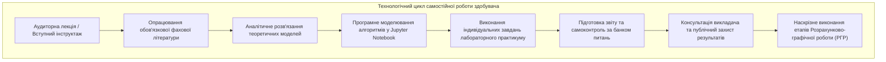

# МЕТОДИЧНІ ВКАЗІВКИ ЩОДО САМОСТІЙНОЇ РОБОТИ З ОСВІТНЬОГО КОМПОНЕНТА «Обробка сигналів та зображень»

---

## ВСТУП

Самостійна робота здобувачів вищої освіти є провідною формою навчальної діяльності в кредитно-трансферній системі організації освітнього процесу (ECTS), яка спрямована на поглиблення, закріплення та творче розширення теоретичних знань і практичних умінь, отриманих під час аудиторних занять. У контексті спеціальності 123 «Комп'ютерна інженерія» вивчення освітнього компонента «Обробка сигналів та зображень» вимагає від здобувачів формування стійких аналітичних навичок роботи з абстрактними математичними моделями, матричними структурами даних, алгоритмами спектрального розкладу та спеціалізованими інженерними бібліотеками мови програмування Python.

Головною метою самостійного опрацювання навчального матеріалу є розвиток інженерної інтуїції, дослідницької ініціативи та здатності до самостійного проєктування програмно-апаратних трактів попередньої фільтрації, стиснення, спектрально-кореляційного аналізу сигналів і комп'ютерного зору. Самостійна робота стимулює критичне осмислення теоретичних положень теореми відліків, стійкості динамічних систем у комплексній $z$-площині, фізичних засад колориметрії та нелінійних морфологічних перетворень цифрового растру.

Навчально-методичне забезпечення самостійної роботи включає підручники провідних вітчизняних та зарубіжних наукових шкіл, конспекти лекцій, інструктивно-методичні матеріали до лабораторного практикуму, репозиторії еталонних програмних кодів на мові Python, стандарти обробки інформації (ITU-R, CIE, ISO), а також офіційну технічну документацію до бібліотек NumPy, SciPy, OpenCV, Pillow та Matplotlib. Доступ до всіх навчально-інформаційних ресурсів забезпечується через платформу дистанційного навчання університету.

*Рисунок 1 — Структурно-логічна послідовність етапів самостійного опрацювання навчального матеріалу*

Методологія самостійної роботи передбачає систематичне опрацювання теоретичного матеріалу після кожної лекції з обов'язковим аналітичним виведенням ключових математичних співвідношень та їхньою комп'ютерною верифікацією. Графік консультацій викладачів кафедри комп'ютерної інженерії та електроніки передбачає щотижневі очні та онлайн-зустрічі для надання індивідуальних методичних роз'яснень, обговорення складних аспектів синтезу цифрових фільтрів і контролю проміжних результатів виконання розрахунково-графічної роботи.

Предметом вивчення освітнього компонента є алгоритмічні, математичні та програмно-апаратні методи обробки одновимірних часових послідовностей і багатовимірних статичних та динамічних зображень. У результаті успішного виконання запланованих обсягів самостійної роботи здобувач вищої освіти набуває фахових компетентностей щодо вибору оптимальних параметрів дискретизації, розрахунку швидких перетворень Фур'є, синтезу стійких цифрових фільтрів заданої селективності, колірної нормалізації, просторової реставрації та контурного аналізу зображень у прикладних комп'ютерних системах.

---

## 1. ТЕМИ ТА ПОГОДИННИЙ РОЗКЛАД ЛЕКЦІЙ І САМОСТІЙНОЇ РОБОТИ

| Назва змістового модуля та теми | Лекції (год) | Самостійна робота (год) |
| :--- | :---: | :---: |
| **Змістовий модуль 1. Цифрова обробка сигналів та лінійні дискретні системи (DSP)** | | |
| Тема 1. Математичне представлення, дискретизація та квантування сигналів. Теорема Котельникова-Шеннона-Найквіста. | 2 | 8 |
| Тема 2. Лінійні стаціонарні дискретні (ЛСД) системи. Імпульсна характеристика та дискретна згортка. | 2 | 8 |
| Тема 3. Спектральний аналіз дискретних сигналів: Дискретне перетворення Фур'є (ДПФ), ШПФ (FFT) та віконні функції. | 2 | 8 |
| Тема 4. Z-перетворення та проектування цифрових фільтрів (КІХ та НІХ). Аналіз стійкості у z-площині. | 2 | 8 |
| **Усього за змістовим модулем 1** | **8** | **32** |
| **Змістовий модуль 2. Цифрова обробка, фільтрація та аналіз зображень (DIP & CV)** | | |
| Тема 5. Цифрове представлення зображень та колориметричні моделі. | 2 | 7 |
| Тема 6. Поелементні амплітудні перетворення, гістограмний аналіз та методи бінаризації. | 2 | 7 |
| Тема 7. Просторова фільтрація зображень: згладжування, шумозаглушення та підкреслення меж. | 2 | 8 |
| Тема 8. Геометричні афінні та перспективні трансформації. Математична морфологія. | 2 | 8 |
| Тема 9. Двовимірне перетворення Фур'є, детектори контурів та основи розпізнавання об'єктів. | 2 | 8 |
| **Усього за змістовим модулем 2** | **10** | **38** |
| Виконання індивідуального завдання (Розрахунково-графічна робота) | — | 10 |
| **Всього годин з освітнього компонента** | **18** | **80** |

---

## 2. ПЕРЕЛІК ТЕМ І ПИТАНЬ ДЛЯ САМОСТІЙНОГО ОПРАЦЮВАННЯ

### Змістовий модуль 1. Цифрова обробка сигналів та лінійні дискретні системи (DSP)

#### Тема 1. Математичне представлення, дискретизація та квантування сигналів. Теорема Котельникова-Шеннона-Найквіста.

**Теми для самостійного опрацювання:**
1. Дослідження математичного апарату відновлення неперервних сигналів із дискретних відліків за допомогою інтерполяційного ряду Уіттекера-Шеннона-Котельникова на основі базових функцій $\text{sinc}(t)$.
2. Аналітичне виведення спектра дискретизованого сигналу через згортку спектра первинного сигналу з періодичною граткою дельта-функцій Дірака.
3. Дослідження фізичних причин виникнення стробоскопічного ефекту та розрахунок частот несправжніх гармонік (псевдонімів) за формулою $f_{alias} = |f_0 - k \cdot f_s|$ в умовах піддискретизації.
4. Порівняльний аналіз передавальних характеристик аналогових фільтрів захисту від аліасингу (Баттерворта, Чебишева, Кауера) та визначення вимог до крутизни їхнього спаду.
5. Математичне моделювання статистичних властивостей похибки квантування за рівнем та виведення формули середньої потужності шуму квантування $P_e = \Delta^2 / 12$ для випадкових процесів.
6. Дослідження методології дизеризації (dithering) з прямокутним та трикутним законами розподілу ймовірностей шуму для лінеаризації передавальної характеристики квантувача.
7. Аналіз принципів функціонування дизеризації з відніманням (subtractive dither) для повної делінеаризації та некорельованого видалення завад із квантованого сигналу.

**Питання для самоперевірки:**
1. Яким чином вибір кроку дискретизації за часом $T_s$ впливає на періодичну структуру спектральної щільності дискретизованого сигналу у частотній області?
2. Чому гранична частота Найквіста строго дорівнює половині частоти дискретизації, і які спотворення виникають у разі присутності вхідних гармонік із частотами $f > f_s / 2$?
3. У чому полягає математична та фізична сутність апроксимації неперервного сигналу зімкненою послідовністю прямокутних імпульсів при прямуванні їхньої тривалості до нуля?
4. Чому теоретичне співвідношення сигнал/шум квантування збільшується приблизно на $6.02\text{ дБ}$ при додаванні кожного додаткового двійкового розряду квантувача?
5. Який механізм дозволяє високочастотному шуму дизеризації усувати паразитні гармонійні спотворення та дискретні піки в спектрі квантованого низькорозрядного сигналу?
6. За яких умов похибка квантування перестає бути статистично незалежною від вхідного сигналу, і до яких негативних наслідків у слуховому або зоровому сприйнятті це призводить?

**Література:** [1, с. 7–16, 20–23, 31–37; 4, с. 2–5, 12–14; 6, с. 15–48; 7, с. 22–65].

---

#### Тема 2. Лінійні стаціонарні дискретні (ЛСД) системи. Імпульсна характеристика та дискретна згортка.

**Теми для самостійного опрацювання:**
1. Дослідження алгебраїчних та функціональних методів перевірки дискретних систем на лінійність, часову інваріантність (стаціонарність), каузальність та BIBO-стійкість.
2. Аналітичне розв'язання лінійних неоднорідних різницевих рівнянь зі сталими коефіцієнтами методом невизначених коефіцієнтів та через суму загального розв'язку однорідного рівняння і часткового розв'язку.
3. Дослідження часових властивостей дискретної лінійної згортки скінченних послідовностей та оптимізація алгоритму прямого обчислення згортки за методом матриці Тепліца.
4. Математичне обґрунтування властивостей кругової (циклічної) згортки періодичних послідовностей та визначення умов еквівалентності лінійної та кругової згорток за допомогою доповнення нулями (Zero-Padding).
5. Порівняльний аналіз прямих, канонічних, паралельних та каскадних структур реалізації дискретних алгоритмів фільтрації на базі регістрів затримки $z^{-1}$, суматорів і помножувачів.
6. Моделювання перехідних процесів та формування імпульсної характеристики у рекурентних системах другого порядку (генератори гармонічних коливань, резонатори, накопичувачі).
7. Дослідження алгоритмів швидкої блочної лінійної згортки довгих потоків даних на основі методів перекриття з додаванням (Overlap-Add) та перекриття зі збереженням (Overlap-Save).

**Питання для самоперевірки:**
1. Чому знання реакції лінійної стаціонарної дискретної системи на одиничний імпульс $\delta[n]$ є вичерпною інформацією для визначення відгуку на довільний вхідний сигнал?
2. Яким чином аналітично розраховується результуюча довжина послідовності, отриманої внаслідок лінійної згортки двох сигналів тривалістю $N_x$ та $N_h$ відліків?
3. У чому полягає принципова фізична та обчислювальна різниця між лінійною аперіодичною згорткою та круговою циклічною згорткою дискретних послідовностей?
4. Чому наявність хоча б одного ненульового коефіцієнта зворотного зв'язку за вихідними відліками у різницевому рівнянні породжує систему з нескінченною імпульсною характеристикою?
5. Які переваги надає канонічна форма реалізації дискретної системи (Direct Form II) щодо мінімізації кількості комірок оперативної пам'яті у порівнянні з прямою формою (Direct Form I)?
6. Як впливає операція ковзного усереднення (Moving Average) на високочастотні флуктуації сигналу та швидкість зміни його монотонного тренду?

**Література:** [1, с. 24–27, 115–119, 126–128; 4, с. 28–44; 6, с. 55–98; 8, с. 110–145].

---

#### Тема 3. Спектральний аналіз дискретних сигналів: Дискретне перетворення Фур'є (ДПФ), ШПФ (FFT) та віконні функції.

**Теми для самостійного опрацювання:**
1. Дослідження математичних засад факторизації матриці поворотних множників ДПФ в алгоритмі Кулі-Тьюкі з проріджуванням за часом (DIT) та проріджуванням за частотою (DIF).
2. Аналітичний розрахунок топології графа потоку даних базової операції «метелик» для розрахунку 8-точкового та 16-точкового швидкого перетворення Фур'є за основою 2.
3. Дослідження алгоритмів швидкого перетворення Фур'є для довільних складених розмірностей масивів даних (алгоритм Блуштайна на основі згортки та алгоритм Радера).
4. Аналітичне моделювання спектрального відгуку віконних функцій із регульованими параметрами (параметричне вікно Кайзера на основі модифікованих функцій Бесселя нульового порядку).
5. Дослідження впливу ширини головної пелюстки та рівня бічних пелюсток віконних функцій на похибки вимірювання амплітуди й частоти полігармонічних сигналів.
6. Математичне обґрунтування дискретного аналога рівності Парсеваля та теореми Релея для спектральної густини потужності дискретних послідовностей.
7. Опрацювання методів спектрального аналізу нестаціонарних процесів за допомогою короткочасного перетворення Фур'є (Short-Time Fourier Transform — STFT) та побудова спектрограм.

**Питання для самоперевірки:**
1. Чому обчислювальна складність алгоритму ШПФ за основою 2 оцінюється як $O(N \log_2 N)$, і за рахунок яких симетрій досягається прискорення у порівнянні з прямим ДПФ $O(N^2)$?
2. Яка математична залежність пов'язує частоту дискретизації $f_s$, розмір вікна перетворення $N$ та частотну роздільну здатність $\Delta f$ дискретного спектра?
3. Чому виникає ефект розтікання (витоку) енергії спектра, якщо частота гармонійної складової сигналу не збігається з жодним із дискретних вузлів частотної сітки?
4. Які переваги та обмеження має прямокутне вагове вікно при спектральному аналізі близьких за частотою коливань із суттєво різними амплітудами?
5. Чим зумовлені відмінності у швидкості спадання бічних пелюсток спектральних вікон Ханна ($-18\text{ дБ/октава}$) та Хеммінга ($-6\text{ дБ/октава}$)?
6. Як виконується процедура відновлення точного значення амплітуди гармоніки після застосування вагового вікна з урахуванням коефіцієнта когерентного підсилення ($CG$)?

**Література:** [1, с. 38–46, 55–68; 4, с. 113–125; 6, с. 105–160; 7, с. 80–120].

---

#### Тема 4. Z-перетворення та проектування цифрових фільтрів (КІХ та НІХ). Аналіз стійкості у z-площині.

**Теми для самостійного опрацювання:**
1. Дослідження властивостей двостороннього та одностороннього $z$-перетворення, визначення областей збіжності (ROC) для правосторонніх, лівосторонніх та двосторонніх сигналів.
2. Методологія розкладання дробово-раціональних передавальних функцій $H(z)$ на суму простих дробів для аналітичного знаходження імпульсної характеристики у часовій області.
3. Дослідження алгебраїчних критеріїв стійкості дискретних систем (критерій Шура-Кона та критерій Джурі) без безпосереднього знаходження коренів знаменника передавальної функції.
4. Опанування алгоритму синтезу оптимальних рівнохвильових КІХ-фільтрів Чебишева за допомогою методу Ремеза (алгоритм Паркса-Макклеллана).
5. Математичне обґрунтування процедури попереднього частотного деформування (pre-warping) в алгоритмі білінійного $z$-перетворення Тастіна для НІХ-фільтрів.
6. Дослідження спектрально-кореляційних властивостей випадкових марківських послідовностей першого $\text{AR}(1)$ та другого $\text{AR}(2)$ порядків (процес Юла).
7. Аналітичне виведення та комп'ютерне моделювання виграшу в обробці (Processing Gain) при оптимальному кореляційному прийомі складних фазоманіпульованих сигналів Баркера у шумах.

**Питання для самоперевірки:**
1. Як геометрично пов'язане розташування полюсів передавальної функції $H(z)$ відносно одиничного кола $|z| = 1$ з характером імпульсної характеристики системи (збіжна, розбіжна, нейтральна)?
2. Чому перетворення Фур'є дискретного сигналу є окремим випадком його $z$-перетворення при підстановці $z = e^{j\Omega}$?
3. Які специфічні симетрії коефіцієнтів імпульсної характеристики $h[n]$ є необхідними і достатніми для забезпечення строго лінійної фазочастотної характеристики КІХ-фільтра?
4. Чому НІХ-фільтри забезпечують значно вищу крутизну зрізу АЧХ у перехідній смузі при меншому порядку фільтра, ніж еквівалентні за селективністю КІХ-фільтри?
5. У чому полягає фізичний зміст теореми Вінера-Хінчіна щодо взаємозв'язку між автокореляційною функцією та спектральною щільністю потужності випадкового сигналу?
6. Чому функція взаємної кореляції дозволяє точно оцінити час затримки сигналу в радіолокаційному каналі навіть за умов від'ємного співвідношення сигнал/шум ($\text{SNR} < 0\text{ дБ}$)?

**Література:** [1, с. 69–75, 85–114, 127–141; 4, с. 70–112, 126–153; 6, с. 180–250; 8, с. 160–220].

---

### Змістовий модуль 2. Цифрова обробка, фільтрація та аналіз зображень (DIP & CV)

#### Тема 5. Цифрове представлення зображень та колориметричні моделі.

**Теми для самостійного опрацювання:**
1. Дослідження математичних засад просторової дискретизації оптичних полів на двовимірних матрицях фотоприймачів та оцінка функції передачі модуляції (MTF).
2. Аналіз алгоритмів просторової дебайєризації (Demosaicing: білінійна інтерполяція, інтерполяція за градієнтом змінної якості) для відновлення повноколірного RGB-растру.
3. Дослідження стандартів цифрового кодування та компресії растрових зображень: аналіз стиснення без втрат (PNG на основі алгоритму Deflate) та стиснення з втратами (JPEG на основі дискретного косинусного перетворення DCT).
4. Аналітичний вивід формул переходу між адитивним простором RGB та апаратно-незалежним колориметричним простором CIE XYZ з урахуванням матриці білої точки D65.
5. Дослідження нелінійних перетворень колірних координат у рівноконтрастному просторі CIELab ($L^*a^*b^*$) та розрахунок колірних відмінностей за метриками $\Delta E_{76}$ та $\Delta E_{94}$.
6. Математичне моделювання циліндричних поверхонь колірного простору HSV та розробка алгоритмів сегментації об'єктів складної насиченості з компенсацією колірних розривів на межі кута $0^\circ / 360^\circ$.
7. Опрацювання стандартів передачі кольорової інформації у телевізійних та відеосистемах високої чіткості на основі колірно-різницевих просторів YCbCr та YUV.

**Питання для самоперевірки:**
1. Чим зумовлена необхідність виділення каналу яскравості ($Y$ або $L^*$) від хроматичних компонентів при стисненні та аналізі кольорових зображень?
2. Чому пряме відображення зображення у форматі BGR бібліотекою Matplotlib призводить до колірної інверсії, за якої червоні об'єкти візуалізуються синіми?
3. У чому полягає відмінність між адитивним змішуванням кольорів у системі RGB та субтрактивним змішуванням у системі CMYK?
4. Які переваги надає колірний простір CIELab порівняно з RGB під час розрахунку об'єктивної числової міри відмінності двох кольорів $\Delta E$?
5. Чому параметр колірного тону $H$ у просторі HSV є інваріантним до рівномірної зміни інтенсивності освітлення сцени, і як це використовується в комп'ютерному зорі?
6. Які артефакти стиснення виникають на контрастних границях об'єктів у форматі JPEG при високих коефіцієнтах квантування коефіцієнтів ДКП?

**Література:** [1, с. 156–173; 2, с. 7–21; 3, с. 7–14, 22–23; 5, с. 380–440; 9, с. 120–165].

---

#### Тема 6. Поелементні амплітудні перетворення, гістограмний аналіз та методи бінаризації.

**Теми для самостійного опрацювання:**
1. Дослідження алгоритмів кусково-лінійного контрастування з двома та трьома вузлами апроксимації для вибіркового підсилення динамічного діапазону заданих структур.
2. Математичне обґрунтування алгоритму адаптивної еквалізації гістограми з обмеженням контрасту (Contrast Limited Adaptive Histogram Equalization — CLAHE) для усунення перепідсилення шуму на однорідних ділянках.
3. Аналітичне виведення формули оптимального порогу бінаризації в алгоритмі Оцу на основі мінімізації внутрішньокласової дисперсії $\sigma_W^2(T)$ та доведення її еквівалентності максимізації міжкласової дисперсії $\sigma_B^2(T)$.
4. Дослідження багатопорогової бінаризації за розширеним методом Оцу (Multi-Otsu Thresholding) для сегментації зображень на три та більше морфологічні класи.
5. Опанування локальних адаптивних алгоритмів бінаризації документів зі складним фоном за методиками Ніблека (Niblack), Сауволи (Sauvola) та Вольфа (Wolf).
6. Математичне моделювання впливу гамма-корекції на передавальну функцію півтонових рентгенівських знімків і томограм із використанням таблиць Look-Up Table.
7. Дослідження методів бінаризації на основі ентропійних критеріїв (метод максимальної ентропії Капура-Саху-Вонга).

**Питання для самоперевірки:**
1. Яким чином вигляд гістограми розподілу яскравості дозволяє діагностувати недоекспонованість, переекспонованість або низький динамічний контраст зображення?
2. Чому математичне очікування кумулятивної функції розподілу (CDF) після процедури глобальної еквалізації набуває строго лінійної форми?
3. У чому полягає алгоритмічна перевага використання таблиць підстановки (LUT) при виконанні нелінійних амплітудних перетворень великих масивів зображень?
4. Чому глобальний метод бінаризації Оцу зазнає збоїв на кадрах із сильним просторовим градієнтом фонового освітлення?
5. Як розмір ковзного вікна $S \times S$ та константа зміщення $C$ у локальній адаптивній бінаризації впливають на збереження дрібних контурів текстових символів?
6. За яких значень показника гамма-корекції $\gamma$ відбувається вибіркове підвищення яскравості глибоких тіней без насичення світлих ділянок кадру?

**Література:** [1, с. 161–163, 175–178; 2, с. 22–37; 3, с. 20–22; 5, с. 120–175; 9, с. 180–215].

---

#### Тема 7. Просторова фільтрація зображень: згладжування, шумозаглушення та підкреслення меж.

**Теми для самостійного опрацювання:**
1. Математичне обґрунтування факторизації двовимірного ядра Гаусса на два одновимірні вектори згортки $G(x, y) = G(x) \cdot G(y)$ та оцінка зниження обчислювальної складності з $O(K^2)$ до $O(2K)$.
2. Дослідження аналітичних властивостей білатерального фільтра та математичне моделювання поведінки вагових коефіцієнтів при наближенні до різкого перепаду яскравості.
3. Опанування алгоритмів адаптивної фільтрації Вінера у просторовій області на основі оцінки локальної дисперсії та середнього значення у ковзному вікні.
4. Дослідження методів нелінійної анізотропної дифузії Перони-Маліка для згладжування шуму вздовж ізофотичних ліній без розмиття границь об'єктів.
5. Аналітичний розрахунок передавальної характеристики комбінованого алгоритму нерізкого маскування (Unsharp Masking / High-Boost Filtering) на основі зваженого Лапласіана.
6. Математичне моделювання та розрахунок об'єктивних метрик структурної подібності зображень (Structural Similarity Index Measure — SSIM) на додаток до MSE та PSNR.
7. Дослідження ефективності рангових порядкових фільтрів (фільтри мінімуму, максимуму, медіани та усіченого середнього) при фільтрації складних сумішей шумів.

**Питання для самоперевірки:**
1. Чому двовимірна просторова згортка симетричним Гаусовим ядром не вносить фазових спотворень і не породжує сходинкових артефактів на границях об'єктів?
2. Який математичний механізм забезпечує абсолютну стійкість нелінійного медіанного фільтра до екстремальних викидів імпульсного шуму типу «сіль та перець»?
3. Чому сума всіх коефіцієнтів ядра згладжувального фільтра низьких частот повинна строго дорівнювати одиниці, а ядра Лапласіана — нулю?
4. У чому полягає різниця між просторовим $\sigma_s$ та фотометричним $\sigma_r$ параметрами білатерального фільтра, і як вони впливають на збереження текстури?
5. Як визначається метрика PSNR, і чому значення $\text{PSNR} > 30\text{ дБ}$ вважається показником високої якості візуальної реставрації півтонового кадру?
6. Яким чином застосування дискретного оператора Лапласа другого порядку дозволяє виділяти локальні екстремуми градієнта яскравості для підвищення різкості?

**Література:** [1, с. 178; 2, с. 59–75; 3, с. 28–31; 5, с. 185–240; 9, с. 230–280].

---

#### Тема 8. Геометричні афінні та перспективні трансформації. Математична морфологія.

**Теми для самостійного опрацювання:**
1. Дослідження математичного апарату афінних перетворень на основі однорідних координат і матричних добутків $M_{all} = M_{trans} \cdot M_{rot} \cdot M_{scale} \cdot M_{shear}$.
2. Математичне обґрунтування та програмна реалізація методів субпіксельної інтерполяції (бікубічної на основі сплайнів Ерміта та інтерполяції Ланцоша на базі ядра $\text{sinc}$).
3. Аналітичне виведення системи лінійних рівнянь для визначення 8 невідомих коефіцієнтів матриці гомографії $H_{3\times 3}$ за чотирма парами опорних точок методом сингулярного розкладу (SVD).
4. Дослідження алгоритмів автоматичного вирівнювання нахилених площин (Perspective Rectification / Bird's Eye View) для задач розпізнавання автомобільних номерів та дорожньої розмітки.
5. Математичне доведення теореми дуальності операцій ерозії та діляції відносно операції теоретико-множинного доповнення: $(A \ominus B)^c = A^c \oplus \hat{B}$.
6. Опанування алгоритмів топологічної скелетизації бінарних масок та витончення контурів за методом Зонга-Суня (Zhang-Suen Thinning Algorithm).
7. Дослідження операцій геодезичної морфології, морфологічної реконструкції за маркером та їхнього застосування для фільтрації складних текстурних завад.

**Питання для самоперевірки:**
1. Чому при геометричних трансформаціях растру використовується зворотне координатне відображення (Inverse Mapping) замість прямого переносу пікселів?
2. Які геометричні інваріанти зберігаються при афінних перетвореннях, і чому перспективні трансформації порушують паралельність ліній у площині проекції?
3. Скільки незалежних ступенів вільності має матриця гомографії $H_{3\times 3}$, і чому для її знаходження необхідно мінімум чотири неколінеарні точки?
4. У чому полягає властивість ідемпотентності морфологічних операцій відкриття $(A \circ B)$ та закриття $(A \bullet B)$?
5. Яким чином морфологічне відкриття дозволяє розірвати тонкий з'єднувальний перешийок між двома дотичними круглими клітинами без зміни їхньої площі?
6. Як формуються перетворення «білий капелюх» (Top-Hat) та «чорний капелюх» (Black-Hat), і за рахунок чого вони усувають повільні фонові зміни освітленості?

**Література:** [1, с. 157, 159; 2, с. 38–58; 3, с. 24–27, 31–35; 5, с. 250–320; 9, с. 300–360].

---

#### Тема 9. Двовимірна Фур'є-обробка, детектори контурів та основи розпізнавання об'єктів.

**Теми для самостійного опрацювання:**
1. Математичне обґрунтування властивостей сепарабельності та симетрії двовимірного перетворення Фур'є $F(u, v) = \mathcal{F}_x\{\mathcal{F}_y\{f(x, y)\}\}$.
2. Дослідження методів частотної режекції періодичних растрових завад у Фур'є-просторі за допомогою смугово-загороджувальних фільтрів (Notch Filters).
3. Опанування математичного апарату деконволюції Вінера у частотній області $H_W(u, v) = \frac{H^*(u, v)}{|H(u, v)|^2 + K}$ для відновлення дефокусованих зображень.
4. Дослідження аналітичних властивостей оператора Шарра та доведення його мінімальної кутової похибки при апроксимації перших похідних у порівнянні з оператором Собеля.
5. Деталізований математичний аналіз кроку пригнічення немаксимумів (Non-Maximum Suppression) та трасування контурів за гістерезисом в оптимальному детекторі Кенні.
6. Опанування методів маркерної сегментації зображень за алгоритмом вододілу (Marker-Controlled Watershed Algorithm) для розділення перекритих об'єктів.
7. Дослідження базових топологій згорткових нейронних мереж (CNN), функціонування згорткових ядер, шарів підвибірки (MaxPooling) та функцій активації (ReLU) для класифікації зображень.

**Питання для самоперевірки:**
1. Що відображають просторові частоти $u$ та $v$ у двовимірному спектрі зображення, і чому нульова частота зміщується в центр матриці операцією `fftshift`?
2. Яка фізична причина виникнення паразитних осциляцій (явища Гіббса) при фільтрації зображень ідеальним частотним фільтром низьких частот (ILPF)?
3. Чому гаусівський частотний фільтр низьких частот (GLPF) не утворює кілець розмиття навколо контрастних меж об'єктів?
4. Які переваги має оператор Собеля над найпростішими різницевими градієнтними операторами першого порядку?
5. Опишіть призначення подвійного порогу гістерезису ($T_{low}, T_{high}$) в алгоритмі Кенні. Як відсікаються хибні контури, породжені шумом?
6. Чому класичні згорткові фільтри в комп'ютерному зорі розглядаються як прототипи навчальних згорткових шарів сучасних глибоких нейромереж?

**Література:** [1, с. 178–180; 2, с. 70–84; 3, с. 31–49; 5, с. 340–375, 450–510; 9, с. 380–430].

---

## 3. ПИТАННЯ ДО МОДУЛЬНОГО ТА ПІДСУМКОВОГО СЕМЕСТРОВОГО КОНТРОЛЮ

### Змістовий модуль 1. Цифрова обробка сигналів та лінійні дискретні системи (DSP)

1. У чому полягає фундаментальна відмінність між аналоговими, дискретними за часом, квантованими за рівнем та цифровими вимірювальними сигналами?
2. Які математичні властивості має дискретний одиничний імпульс Дірака-Кронекера $\delta[n]$, і як за його допомогою подається довільна послідовність?
3. Сформулюйте та доведіть теорему відліків Котельникова-Шеннона-Найквіста для сигналів з обмеженим спектром.
4. Яка частота називається частотою Найквіста, і яке співвідношення пов'язує її з частотою дискретизації процесу $f_s$?
5. Опишіть фізичний механізм виникнення ефекту аліасингу (стробоскопічного накладання спектрів) в умовах порушення теореми відліків.
6. За якою аналітичною формулою розраховується частота хибної дзеркальної гармоніки $f_{alias}$ при частоті аналогового сигналу $f_0 > f_s / 2$?
7. Які функціональні вимоги висуваються до амплітудно-частотної характеристики вхідного аналогового фільтра захисту від аліасингу (Anti-Aliasing Filter)?
8. Як визначається крок рівномірного квантування за рівнем $\Delta$ при заданій розрядності АЦП $N$ та динамічному діапазоні $[V_{min}, V_{max}]$?
9. Чому дисперсія похибки рівномірного квантування випадкового сигналу закругленням дорівнює $\sigma_e^2 = \Delta^2 / 12$?
10. Виведіть аналітичний вираз для теоретичного співвідношення сигнал/шум квантування $\text{SNR} \approx 6.02 \cdot N + 1.76\text{ дБ}$ для повномасштабної синусоїди.
11. У чому полягає сутність явища делінеаризації квантувача за допомогою технології дизеризації (додавання псевдовипадкового шуму перед квантуванням)?
12. Сформулюйте математичні умови лінійності (адитивність, однорідність) та стаціонарності дискретних динамічних систем.
13. Що таке імпульсна характеристика $h[n]$ ЛСД-системи, і чому вона є вичерпним часовим описом динаміки системи?
14. Запишіть та поясніть математичний вираз лінійної дискретної згортки двох послідовностей $y[n] = x[n] * h[n]$.
15. Яким чином визначається результуюча довжина послідовності, утвореної згорткою двох скінченних сигналів довжиною $N_x$ та $N_h$?
16. Опишіть чотири послідовні алгоритмічні кроки обчислення дискретної згортки у часовій області (обертання, зсув, множення, сумування).
17. У чому полягає математична модель та алгоритм реалізації кругової (циклічної) згортки періодичних послідовностей?
18. За якої умови результат кругової згортки стає строго еквівалентним результату лінійної аперіодичної згортки (метод Zero-Padding)?
19. Запишіть загальний вигляд лінійного різницевого рівняння $N$-го порядку з постійними коефіцієнтами, що описує цифрову систему зі зворотним зв'язком.
20. Чим відрізняються системи зі скінченною імпульсною характеристикою (КІХ / FIR) від систем із нескінченною імпульсною характеристикою (НІХ / IIR)?
21. Наведіть структури прямої форми I (Direct Form I) та канонічної форми II (Direct Form II) реалізації дискретного фільтра другого порядку.
22. Дайте математичне визначення прямого та оберненого дискретного перетворення Фур'є (ДПФ / DFT).
23. Що являють собою поворотні множники $W_N = \exp(-j 2\pi / N)$ у матричній структурі алгоритму ДПФ?
24. Опишіть базовий принцип побудови швидкого перетворення Фур'є (ШПФ / FFT) Кулі-Тьюкі за основою 2 з проріджуванням за часом.
25. Яка обчислювальна структура операції типу «метелик» (butterfly), і скільки операцій комплексного множення вона містить?
26. Чому оцінка обчислювальної складності ШПФ дорівнює $O(N \log_2 N)$, і який виграш у швидкодії це дає для вибірки розміром $N = 1024$ відліки?
27. У чому полягає явище витоку (розтікання) енергії спектра (spectral leakage), і за яких умов воно повністю відсутнє при обчисленні ДПФ?
28. Поясніть компроміс між шириною головної пелюстки та рівнем придушення бічних пелюсток при виборі віконних функцій (Ханна, Хеммінга, Блекмана).
29. Дайте математичне визначення прямого $z$-перетворення дискретної послідовності та вкажіть поняття його області збіжності (ROC).
30. Як пов'язані між собою передавальна функція дискретної системи $H(z)$ та коефіцієнти її різницевого рівняння?
31. Сформулюйте точний критерій стійкості каузальної дискретної системи за розташуванням полюсів її передавальної функції на комплексній $z$-площині.
32. Яким чином наближення нуля $z_m$ або полюса $p_k$ передавальної функції до одиничного кола $|z| = 1$ впливає на амплітудно-частотну характеристику системи?
33. Чому цифрові КІХ-фільтри є абсолютно стійкими за будь-яких значень вагових коефіцієнтів імпульсної характеристики?
34. За яких умов симетрії імпульсної характеристики КІХ-фільтр має строго лінійну фазочастотну характеристику та постійну групову затримку?
35. Опишіть метод білінійного $z$-перетворення Тастіна для синтезу цифрових НІХ-фільтрів на основі аналогових прототипів Баттерворта.
36. Що являє собою дискретний білий гаусів шум, і який вигляд має його автокореляційна функція?
37. Запишіть різницеве рівняння авторегресійного марківського процесу першого порядку $\text{AR}(1)$ та вираз для його теоретичної автокореляційної функції.
38. Як визначається інтервал кореляції $\tau_k$ стаціонарного випадкового процесу за спаданням його нормованої автокореляційної функції?
39. У чому полягає математична сутність використання взаємної кореляційної функції (ВКФ) для виявлення затриманого корисного сигналу на тлі шумів?
40. Сформулюйте зміст теореми Вінера-Хінчіна щодо зв'язку автокореляційної функції та спектральної щільності потужності випадкового процесу.

---

### Змістовий модуль 2. Цифрова обробка, фільтрація та аналіз зображень (DIP & CV)

1. Як математично формалізується цифрове растрове монохромне та кольорове зображення у вигляді матриць і багатовимірних тензорів?
2. Які типи числових даних (`uint8`, `uint16`, `float32`) використовуються для представлення рівнів яскравості пікселів, і які динамічні діапазони вони забезпечують?
3. Опишіть принцип просторової організації колірних масивів фільтрів Баєра (Bayer pattern) у матричних фотоприймачах.
4. Сформулюйте три закони змішування кольорів Грасмана, що є теоретичною основою сучасної колориметрії.
5. За якою стандартизованою формулою ITU-R BT.601 виконується перетворення повноколірного RGB-зображення у напівтонове (Grayscale)?
6. Чому порядок розташування колірних каналів у бібліотеці OpenCV (BGR) відрізняється від стандарту Matplotlib (RGB), і до яких візуальних наслідків це призводить?
7. Опишіть структуру та геометричний зміст циліндричного колірного простору HSV (Hue, Saturation, Value).
8. Чому при сегментації об'єктів за кольором простір HSV є значно ефективнішим та стійкішим до перепадів освітлення, ніж простір RGB?
9. У чому полягає особливість сегментації об'єктів червоного кольору у просторі HSV на межі циклічного переходу кута $0^\circ / 180^\circ$ в OpenCV?
10. Опишіть фізичний зміст та властивості рівноконтрастного колірного простору CIELab ($L^*a^*b^*$).
11. Як розраховується колірна відмінність між двома відтінками за стандартом CIE Delta E ($\Delta E_{76}$)?
12. Що являє собою поелементне амплітудне перетворення зображення, і як воно описується оператором $s = T(r)$?
13. Як впливають параметри лінійного перетворення $s = k \cdot r + b$ на яскравість і контрастність вихідного кадру?
14. Запишіть формулу степеневого амплітудного перетворення (гамма-корекції) та поясніть поведінку кривої при $\gamma < 1$ та $\gamma > 1$.
15. Чому використання таблиць пошуку (Look-Up Table — LUT) дозволяє суттєво оптимізувати швидкодію нелінійних амплітудних перетворень?
16. Дайте визначення гістограми яскравості цифрового зображення та її нормованої статистичної оцінки $p(r_k)$.
17. Опишіть математичний алгоритм глобальної еквалізації гістограми на основі дискретної кумулятивної функції розподілу (CDF).
18. Чому глобальна еквалізація гістограми призводить до лінеаризації CDF та розширення динамічного діапазону контрасту?
19. У чому полягає математичний критерій оптимальності вибору порогу бінаризації в автоматичному алгоритмі Оцу?
20. Які недоліки має глобальна бінаризація Оцу при обробці зображень із неоднорідним градієнтним фоном або тінями?
21. Опишіть принципи функціонування локальної адаптивної бінаризації (Adaptive Mean та Adaptive Gaussian) на блоках $S \times S$.
22. Запишіть вираз двовимірної просторової дискретної згортки матриці кадру з просторовим ядром фільтра $h(s, t)$.
23. Які методи обробки крайових пікселів (padding: zero, reflect, replicate, wrap) застосовуються при виході маски фільтра за межі зображення?
24. Як формується прямокутне ядро лінійного усереднюючого Box-фільтра, і чому воно розмиває різкі межі об'єктів?
25. Запишіть формулу неперервного та дискретного двовимірного ядра Гаусса, і поясніть фізичний зміст параметра $\sigma$.
26. Чому лінійні фільтри згладжування (Box, Gauss) є малоефективними для видалення імпульсного шуму типу «сіль та перець»?
27. Опишіть алгоритм роботи нелінійного медіанного фільтра та поясніть його високу робастність до екстремальних викидів.
28. Яким чином білатеральний фільтр поєднує просторове та фотометричне гаусові зважування для шумозаглушення зі збереженням меж?
29. За якими математичними формулами розраховуються об'єктивні метрики якості реставрації зображень MSE та PSNR?
30. Які властивості має дискретний оператор Лапласа другого порядку, і як він використовується для підвищення різкості контурів?
31. Запишіть загальний матричний вираз афінного перетворення у 2D-просторі з використанням однорідних координат.
32. Чому при зміні геометрії растру використовують алгоритм зворотного координатного відображення (Inverse Mapping) з інтерполяцією?
33. Порівняйте методи інтерполяції найближчого сусіда (`INTER_NEAREST`), білінійної (`INTER_LINEAR`) та бікубічної (`INTER_CUBIC`).
34. Скільки незалежних ступенів вільності має матриця гомографії $H_{3\times 3}$, і як вона використовується для усунення перспективних спотворень?
35. Що таке структуруючий елемент у математичній морфології, і які його стандартні топологічні форми (`RECT`, `CROSS`, `ELLIPSE`)?
36. Дайте точні математичні визначення операцій морфологічної ерозії ($A \ominus B$) та діляції ($A \oplus B$) над бінарними множинами.
37. Чому операції морфологічного відкриття та закриття є ідемпотентними, і які шумові дефекти вони усувають?
38. Як формуються перетворення «білий капелюх» (Top-Hat) та «чорний капелюх» (Black-Hat) для компенсації нерівномірного фону?
39. Опишіть усі п'ять етапів алгоритму оптимального детектора контурів Кенні (Canny Edge Detector).
40. Яка мета операції пригнічення немаксимумів (Non-Maximum Suppression) та трасування подвійним порогом гістерезису в детекторі Кенні?

---

## СПИСОК РЕКОМЕНДОВАНОЇ ЛІТЕРАТУРИ

### Основна література:
1. **Микитенко В. І., Тимчик Г. С.** Цифрова обробка сигналів та зображень : навч. посіб. для здобувачів ступеня магістра. — 2-ге вид., переробл. і доповн. — Київ : КПІ ім. Ігоря Сікорського, 2025. — 181 с.
2. **Кравченко І. В., Микитенко В. І.** Цифрова обробка сигналів та зображень. Частина 2. Практикум : навч. посіб. для здобувачів ступеня магістра. — Київ : КПІ ім. Ігоря Сікорського, 2025. — 85 с.
3. **Лавер В. О., Левчук О. М.** Обробка зображень та мультимедія : навч.-метод. посіб. — Ужгород : Вид-во ПП «АУТДОР-ШАРК», 2021. — 51 с.
4. **Мазуренко В. Б.** Основи цифрової обробки сигналів та зображень : конспект лекцій. — Дніпро : ДНУ ім. Олеся Гончара, 2020. — 153 с.
5. **Gonzalez R. C., Woods R. E.** Digital Image Processing. — 4th ed. — New York : Pearson, 2018. — 1168 p.
6. **Oppenheim A. V., Schafer R. W.** Discrete-Time Signal Processing. — 3rd ed. — Upper Saddle River : Prentice Hall, 2010. — 1120 p.

### Додаткова література:
7. **Lyons R. G.** Understanding Digital Signal Processing. — 3rd ed. — Boston : Prentice Hall / Pearson, 2010. — 994 p.
8. **Ушенко Ю. О., Гавриляк М. С., Талах М. В., Дворжак В. В.** Основи та методи цифрової обробки сигналів: від теорії до практики : навч. посіб. — Чернівці : Чернівецький нац. ун-т ім. Ю. Федьковича, 2021. — 308 с.
9. **Szeliski R.** Computer Vision: Algorithms and Applications. — 2nd ed. — London : Springer, 2022. — 1232 p.
10. **Боровицький В. М.** Розробка програм для цифрової обробки зображень з застосуванням OpenCV : навч. посіб. — Київ : Політехніка, 2022. — 84 с.
11. **Mallat S.** A Wavelet Tour of Signal Processing: The Sparse Way. — 3rd ed. — Burlington : Academic Press, 2009. — 832 p.

### Інформаційні ресурси в Інтернеті:
1. Офіційний портал технічної документації та навчальних посібників бібліотеки OpenCV: [https://docs.opencv.org/4.x/](https://docs.opencv.org/4.x/)
2. Документація наукового пакету SciPy (модулі `scipy.signal`, `scipy.ndimage`, `scipy.fft`): [https://docs.scipy.org/doc/scipy/reference/](https://docs.scipy.org/doc/scipy/reference/)
3. Офіційне керівництво користувача з багатовимірної матричної алгебри NumPy: [https://numpy.org/doc/stable/](https://numpy.org/doc/stable/)
4. Довідкова система бібліотеки візуалізації наукових даних Matplotlib: [https://matplotlib.org/stable/contents.html](https://matplotlib.org/stable/contents.html)
5. Документація модулів комп'ютерної обробки зображень Pillow (PIL Fork): [https://pillow.readthedocs.io/en/stable/](https://pillow.readthedocs.io/en/stable/)
6. Система електронного дистанційного навчання КрНУ імені Михайла Остроградського: [https://moodle.kdu.edu.ua/](https://moodle.kdu.edu.ua/)